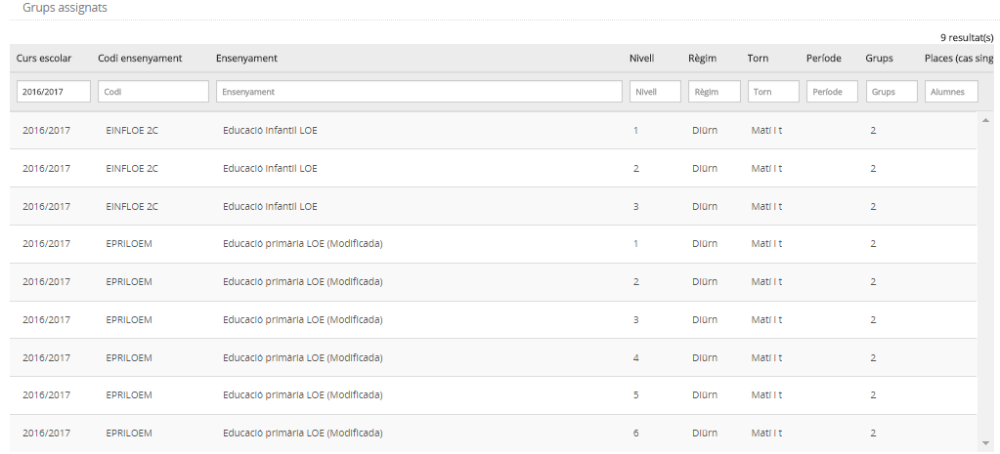
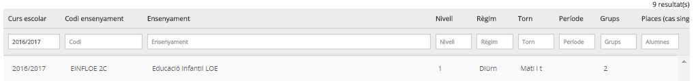

# Grups assignats

* [Què són](g_assignats.md#que-son)
* [Com s’hi accedeix](g_assignats.md#com-shi-accedeix)
* [Quines operacions s'hi poden fer](g_assignats.md#quines-operacions-shi-poden-fer)

### Què són

Són els grups que el Departament d'Ensenyament ha assignat al centre per a cada ensenyament i nivell, règim, torn i període. En realitat el nombre de grups assignats és el paràmetre que utilitza el Departament per assignar els recursos humans al centre.
  

Aquesta informació no es pot modificar, és únicament de consulta.

En aquesta pàgina es mostren tant els grups complets com les autoritzacions singulars, si és el cas.

*Imatge 1 - Llista de grups assignats*
  

---

### Com s’hi accedeix

S'ha d'escollir l'opció **Grups assignats** del mòdul **Grups**.
  
  
*Imatge 2 - Selecció de l'opció del menú Grups assignats*

---

### Quines operacions s'hi poden fer

#### Consulta

A la taula dels grups assignats al centre es mostra la informació següent:

* **Curs escolar.** Els grups assignats sempre es mostren filtrats per a un curs escolar. Per defecte es mostren els grups assignats del "curs escolar per a la matrícula" determinat al menú **Configuracions**, però es pot seleccionar un altre curs si la informació consta a l'aplicació.
* **Codi de l'ensenyament.** Mostra el codi de l'ensenyament.
* **Ensenyament.** Mostra el nom de l'ensenyament.
* **Nivell.** Indica el nivell.
* **Règim.** Indica el règim.
* **Torn.** Indica el torn.
* **Grups.** Mostra el nombre de grups classe que el centre té autoritzats per a aquest ensenyament, nivell, règim i torn.
* **Places (cas singular).** Indica el nombre de places que, de manera singular, el centre té assignades a l'aplicació de l'oferta educativa.

Els grups assignats al centre es poden filtrar per qualsevol dels camps indicats.
  
  

---