# Grups classe

* [Què són](g_classe.md#què-són)
* [Com s’hi accedeix](g_classe.md#com-shi-accedeix)
* [Quines operacions s'hi poden fer](g_classe.md#quines-operacions-shi-poden-fer)

  + [Afegir](g_classe.md#afegir)

    - [Identificar el grup](g_classe.md#identificar-el-grup)
    - [Posar/treure alumnes al grup](g_classe.md#posartreure-alumnes-al-grup)
    - [Posar/treure continguts al grup](g_classe.md#posartreure-continguts-al-grup)
    - [Relacionar els professors amb els continguts](g_classe.md#relacionar-els-professors-amb-els-continguts)
  + [Esborrar](g_classe.md#esborrar)
  + [Copiar](g_classe.md#copiar)
  + [Consultar/Modificar](g_classe.md#consultarmodificar)

### Què són

Un grup classe és un conjunt d’alumnes del mateix ensenyament, nivell, règim, torn o període que tenen un mateix tutor o tutora.

Cal fer els grups classe a inici de curs, incloent-hi a més dels alumnes corresponents el currículum que segueix, el tutor, i els professors i l'assignatura que imparteix, per tal de poder gestionar correctament la resta de funcionalitats i processos.

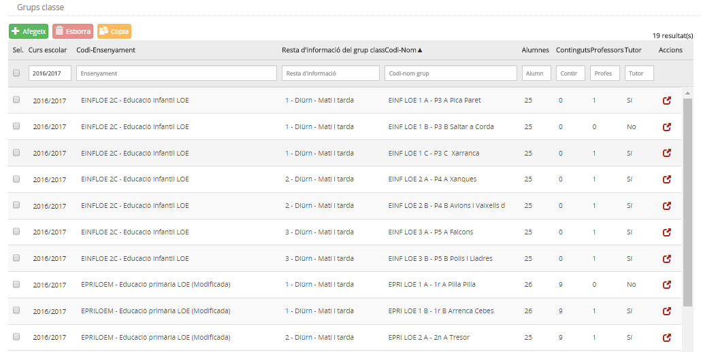*Imatge 1 - Llista de grups classe d'un centre*
  
  
Quan el centre té grups classe creats, la pantalla mostra una taula amb la informació següent:

* **Curs escolar**
* **Codi - Ensenyament**: Mostra el nom i el codi de l'ensenyament al qual pertany el grup classe.
* **Resta d'informació del grup classe**: Mostra el nivell, règim, torn i/o període del grup classe.
* **Codi - Nom**: El codi i el nom del grup classe
* **Alumnes**: Nombre d'alumnes que formen part del grup classe.
* **Continguts**: Nombre de continguts assignats al grup classe.
* **Professors**: Nombre de professors assignats al grup classe.
* **Tutor**: "Sí/No" segons si s'ha especificat o no el tutor o tutora del grup classe.
* **Accions**: Icona mitjançant la qual es pot accedir al detall del grup.

---

### Com s'hi accedeix

S'ha d'escollir l'opció **Grups classe** del mòdul **Grups**.

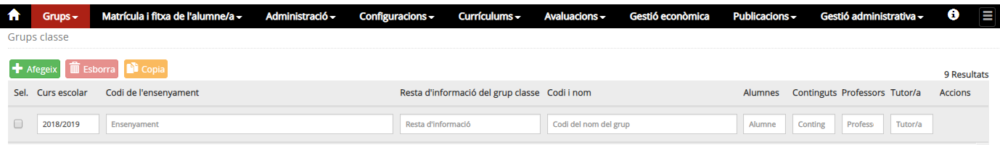*Imatge 2 - Accés a Grups classe*
  
  
Damunt la relació de grups hi ha un conjunt de camps que faciliten la cerca de grups.
  
També és possible variar l'ordre en què els grups es mostren per pantalla clicant sobre cada capçalera.

---

### Quines operacions s'hi poden fer

* [Afegir](g_classe.md#afegir) - Per crear nous grups classe.
* [Esborrar](g_classe.md#esborrar) - El programa permet esborrar un grup classe sempre que aquest no tingui alumnes, continguts, professors i tutor o tutora.
* [Copiar](g_classe.md#copiar) - Permet copiar la relació de grups identificats d'un curs al següent. En aquest procés de còpia no s'inclouen la llista dels alumnes, professors i continguts; només es copien les dades d'identificació dels grups classe.
* [Consultar/Modificar](g_classe.md#consultarmodificar) - Per veure la composició del grup, és a dir, la relació d'alumnes, continguts i professors que imparteixen cada contingut al grup i per modificar-lo, si és el cas.

---

#### Afegir

* [Identificar el grup](g_classe.md#identificar-el-grup)
* [Afegir/treure alumnes al grup](g_classe.md#afegirtreure-alumnes-al-grup)
* [Afegir/treure continguts al grup](g_classe.md#afegirtreure-continguts-al-grup)
* [Relacionar els professors amb els continguts](g_classe.md#relacionar-els-professors-amb-els-continguts)

En primer lloc s'ha de clicar el botó .
Aquesta acció obrirà una finestra modal on introduir les dades generals.

---

#### Identificar el grup

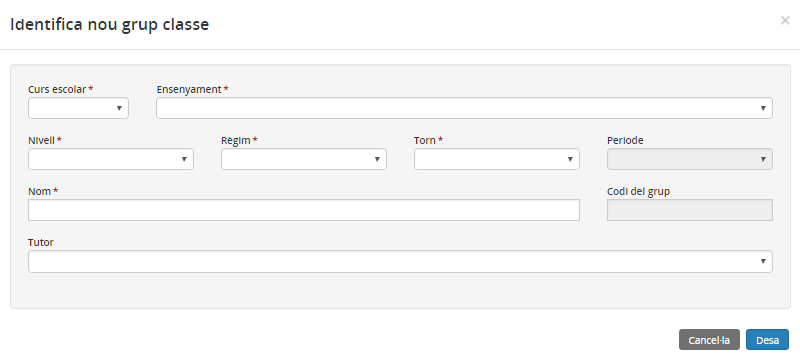*Imatge 3 - Dades d'identificació d'un grup classe*

* **Curs escolar**: Camp obligatori. S'ha de seleccionar del desplegable el curs escolar a què correspon el grup.
* **Ensenyament**: Camp obligatori. S'ha de seleccionar un dels ensenyaments entre els quals el centre té assignats.
* **Nivell**: Camp obligatori. Cal triar un nivell de l'ensenyament. Només és possible si el centre té grups assignats.
* **Règim**: Camp obligatori. Si l'ensenyament i nivell seleccionats només tenen un règim o el centre només en té autoritzat un, aquest camp s'omple automàticament; en cas contrari caldrà seleccionar-lo en el desplegable.
* **Torn**: Si l'ensenyament i nivell seleccionats només tenen un torn o el centre només en té autoritzat un, aquest camp s'omple automàticament; en cas contrari caldrà seleccionar-lo en el desplegable.
* **Període**: Camp obligatori que només és per als centres de formació de persones adultes.
* **Nom del grup**: Camp opcional on s'especifica el nom per identificar el grup a les diferents pantalles de l'aplicació.
* **Codi del grup**: Camp obligatori que l'omple automàticament l'aplicació. No és editable.
* **Tutor**: Camp opcional que permet seleccionar d'entre la relació de professors del centre, el tutor o tutora del grup classe.

---

Per gestionar el grup, és a dir, posar-hi els alumnes, els continguts, els professors i els tutors, cal clicar la icona del grup seleccionat.
  
  
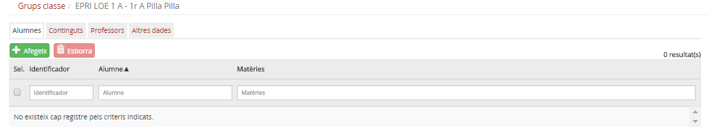*Imatge 4 - Dades d'identificació d'un grup classe*

#### Afegir/treure alumnes al grup

La pantalla mostra, a la part superior, algunes dades de la identificació del grup: **nom**, **tutor** i **observacions**.
  
A continuació hi ha quatre pestanyes, la primera, **Alumnes**, permet veure els alumnes que hi ha al grup i permet afegir-ne i treure'n.
  
Per afegir alumnes al grup cal clicar el botó .
  
  
S'obrirà una finestra modal que mostrarà els alumnes que estan matriculats a l'ensenyament i nivell corresponent al grup classe, i que encara no estan assignats a cap grup classe.
  
  
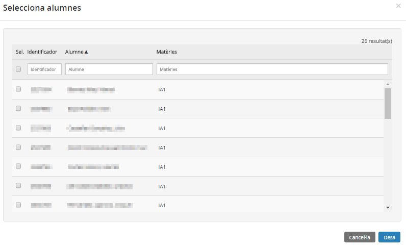*Imatge 5 - Llista d'alumnes per incloure al grup classe*
  
  
Cal marcar els alumnes que es desitgi incorporar al grup i acabar clicant al botó .
  
Els alumnes passaran a mostrar-se a la llista d'alumnes del grup.
  
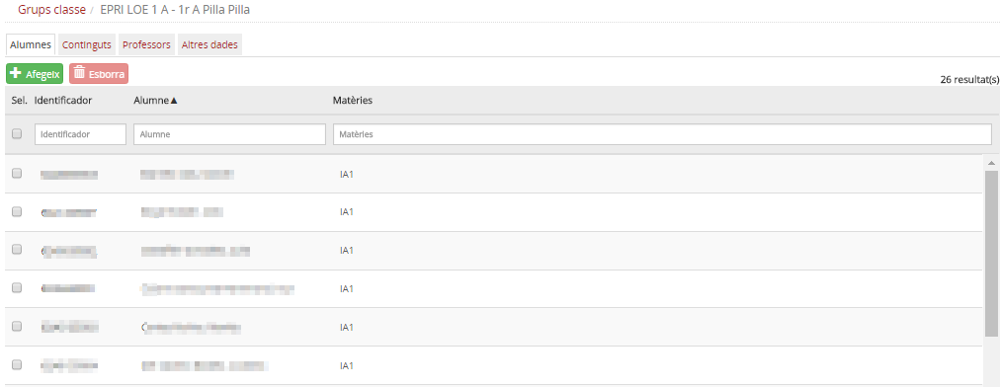*Imatge 6 - Llista d'alumnes del grup classe*
  
La taula d'alumnes del grup disposa de la informació següent:

* **Identificador de l'alumne/a**
* **Nom i cognoms de l'alumne/a**
* **Matèries**: Codi de totes les matèries no comunes o opcionals i que l'alumne té en el seu currículum.

Si cal treure algun alumne del grup, s'ha de seleccionar de la llista d'alumnes del grup i a continuació clicar al botó .

---

#### Afegir/treure continguts al grup

La pantalla mostra, a la part superior, algunes dades de la identificació del grup: **nom**, **tutor/a** i **observacions**.
  
La segona pestanya, **Continguts**, permet treure i afegir continguts al grup classe.
  
El botó **Actualitza continguts** portarà a terme les accions següents:

1. Afegirà al grup els continguts que els alumnes tenen en el currículum, però que no estan al grup.
2. Mostrarà un avís si hi ha algun contingut en el grup que no tingui un professor o professora assignat.

No és necessari que tots els alumnes comparteixin un contingut perquè aquest s'inclogui al grup, n'hi ha prou que un alumne el tingui perquè formi part del grup.
  
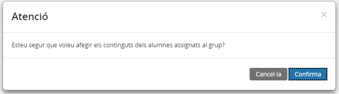*Imatge 7 - Actualitza continguts*
  
  
També és possible afegir altres continguts al grup. Per fer-ho s'ha de prémer el botó , marcar els continguts desitjats i clicar al botó  per incorporar-los al grup.
  
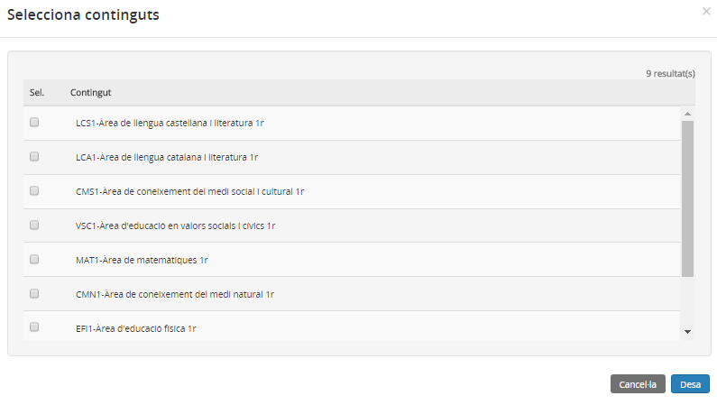*Imatge 8 -Selecció de continguts per afegir-los al grup classe*
  
  
Per eliminar els continguts del grup classe cal seleccionar els continguts del grup i clicar al botó .
  
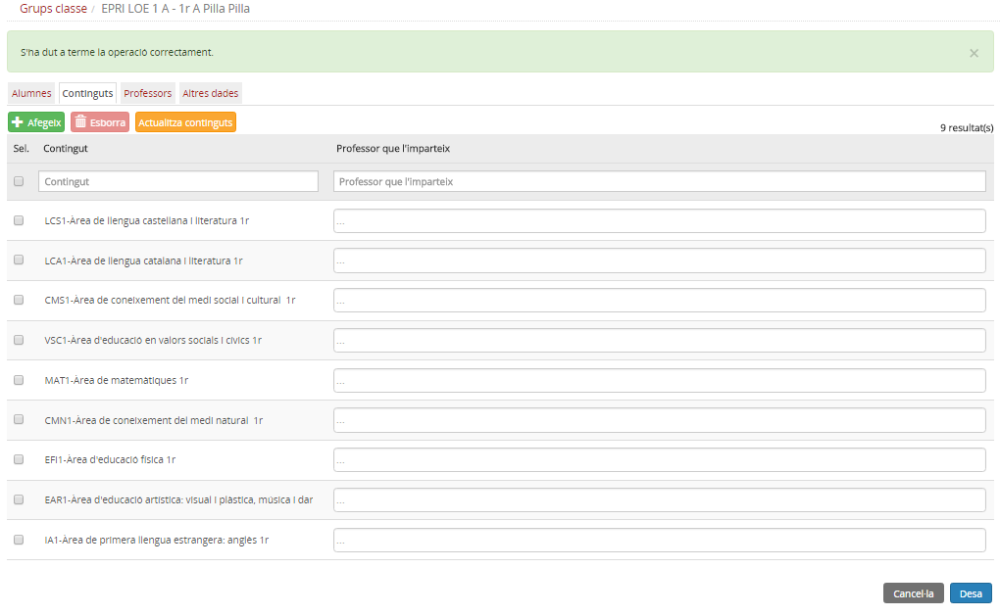*Imatge 9 - Continguts del grup classe*
  
  

---

#### Relacionar els professors amb els continguts

Un cop estan els continguts assignats al grup, clicant la icona d'un contingut, s'accedeix a identificar els professors que l'imparteixen.
  
Cada contingut ha de tenir assignat, com a mínim, un professor o professora.
  
També és possible desassignar un professor o professora d'un contingut clicant a la casella de verificació del costat del seu nom.
  
  
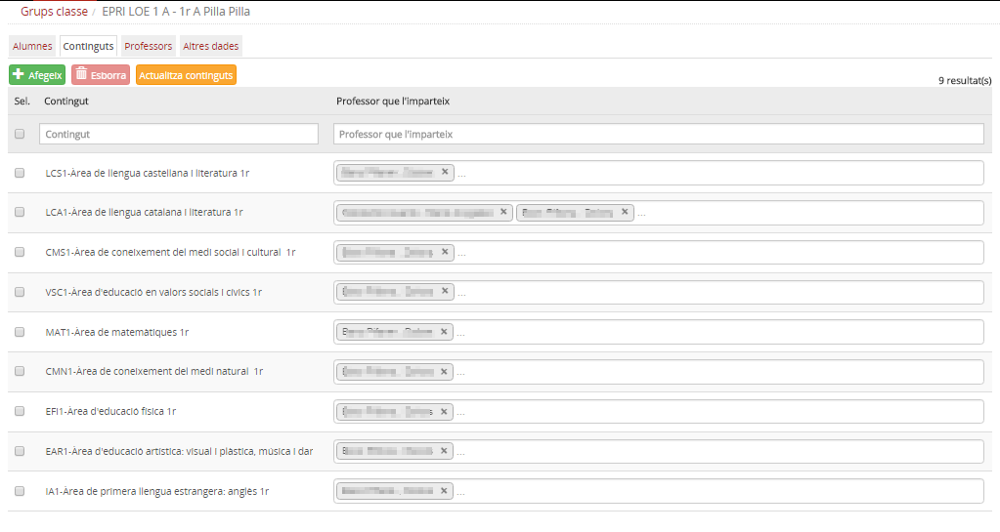*Imatge 9 - Continguts i professors del grup classe*

Des de la secció **Professors** només es pot consultar la llista de professors assignats amb els continguts que imparteixen cadascun.
  
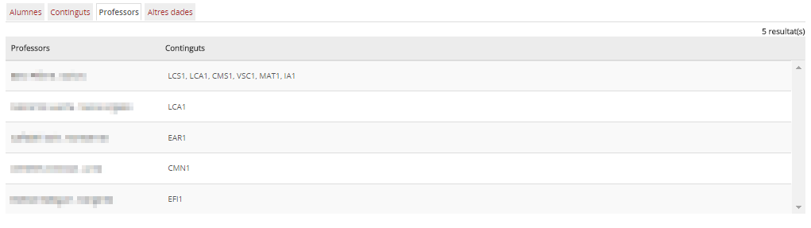*Imatge 10 - Professors del grup classe i continguts que imparteixen*
  
  
La darrera pestanya **Altres** permet modificar el nom del grup, posar, treure o modificar el tutor i afegir observacions si escau.
  
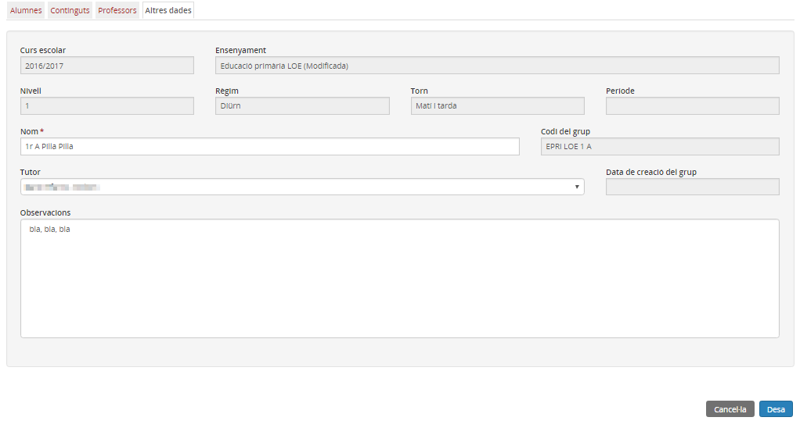*Imatge 9 - Continguts del grup classe*

#### Esborrar

A la pantalla principal es mostra la llista de grups classe que hi ha. Aquí es poden també esborrar grups classe creats.
  
Només es pot esborrar un grup classe si no conté alumnes, continguts, professors ni tutors.
Cal marcar el grup o grups i prémer el botó .
  

---

#### Copiar

És possible copiar la identificació dels grups d'un curs escolar per al següent curs escolar.
  
Només es copia la identificació dels grups, és a dir, no es copien els alumnes, continguts, professors ni tutors.
  
S'han de seleccionar els grups necessaris i prémer el botó .
  
Llavors la identificació dels grups es copiarà per al curs següent sempre que el centre tingui assignats els grups corresponents.
  

---

#### Consultar/Modificar

Clicant la icona d'acció d'un grup s'accedeix a la composició del grup i també a les seves dades d'identificació.
  
És possible modificar el nom del grup, les observacions i la composició, tant pel que fa als alumnes, professors, continguts i tutors del grup.

---