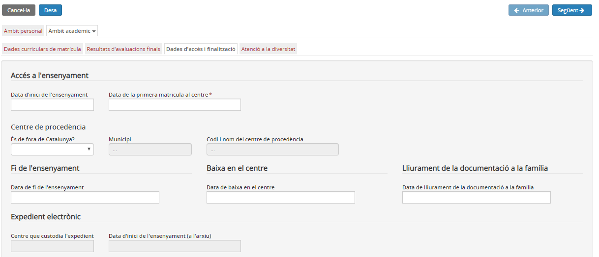
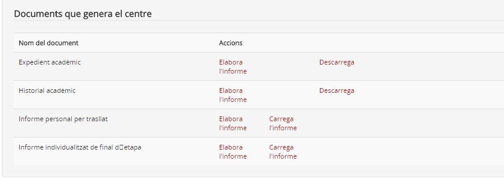

## Dades d'accés i de finalització

En aquesta pantalla es veuen i s'editen les dades d'accés i de finalització de l'ensenyament. Concretament es recullen les dades següents:

* **Accés a l'ensenyament:**

1. Data d'inici de l'ensenyament
2. Data de la primera matrícula al centre
3. Centre de procedència

   1. És de fora de Catalunya?
   2. Municipi
   3. Codi i nom del centre de procedència

* **Fi de l'ensenyament:**

1. Data de fi de l'ensenyament
2. Data de baixa en el centre
3. Data de lliurament de la documentació a la família

* **Expedient electrònic:**

1. Centre que custodia l'expedient
2. Data de l'inici de l'ensenyament (a l'arxiu)

*Imatge 1 - Accés a Dades d'accés i finalització de l'àmbit acadèmic*

#### Impressió de documents normatius

Des d'aquesta mateixa pantalla es poden elaborar i imprimir els documents normatius de l'ensenyament, si corresponen.  
  
*Imatge 2 - Documents que genera el centre*