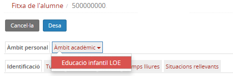
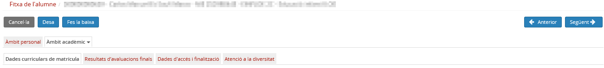

## Àmbit acadèmic

L'Àmbit acadèmic recull tota la informació de cadascun dels ensenyaments als quals l'alumne està o ha estat matriculat al centre.

* [Què és](index.md#què-és)
* [Com s'hi accedeix](index.md#com-shi-accedeix)
* [Quines operacions s'hi poden fer](index.md#quines-operacions-shi-poden-fer)

### Què és

Aquesta informació s'organitza en les pestanyes següents:

* [Dades curriculars de matrícula](../../../../mgac/fda/fda-aa-curriculars.md)
* [Resultats de les avaluacions finals](../../../../mgac/fda/fda-aa-avaluacions.md)
* [Preus públics](../../../../mgac/fda/fda-aa-preus_publics.md)
* [Especificitats dels cicles formatius](../../../../mgac/fda/fda-aa-esp_cf.md)
* [Dades d'accés i de finalització](../../../../mgac/fda/fda-aa-acces_i_fi.md)
* [Atenció a la diversitat](../../../../mgac/fda/fda-aa-atencio_d.md)

---

### Com s'hi accedeix

Per accedir-hi cal clicar a la pestanya **Àmbit acadèmic** del mòdul **fitxa de l'alumne/a**, i seleccionar l'ensenyament.

*Imatge 1 - Accés a la fitxa de l'alumne - Àmbit acadèmic*

*Imatge 2 - FDA - Accés a l'Àmbit acadèmic de la fitxa de l'alumne*

### Quines operacions s'hi poden fer

* Consultar les dades curriculars de les matrícules de l'alumne/a
* Canviar el nivell d'una matrícula
* Consultar els resultats de les avaluacions finals
* Consultar les dades d'accés i de finalització de cadascun dels ensenyaments cursats per l'alumne/a
* Consultar les dades d'atenció a la diversitat
* Consultar les especificitats, si escau
* Consultar els preus públics, si escau
* Fer la baixa de la matrícula

