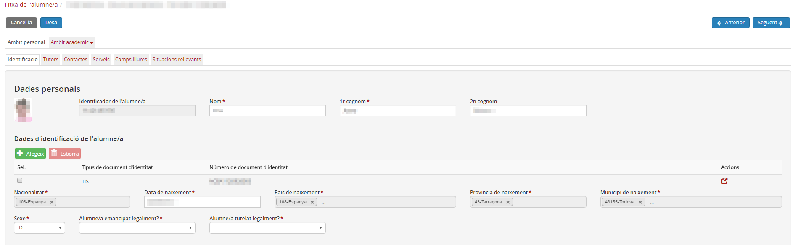
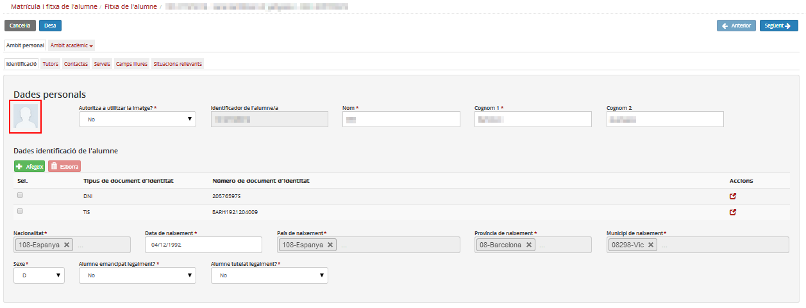
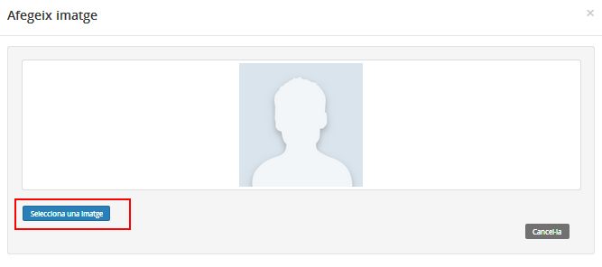
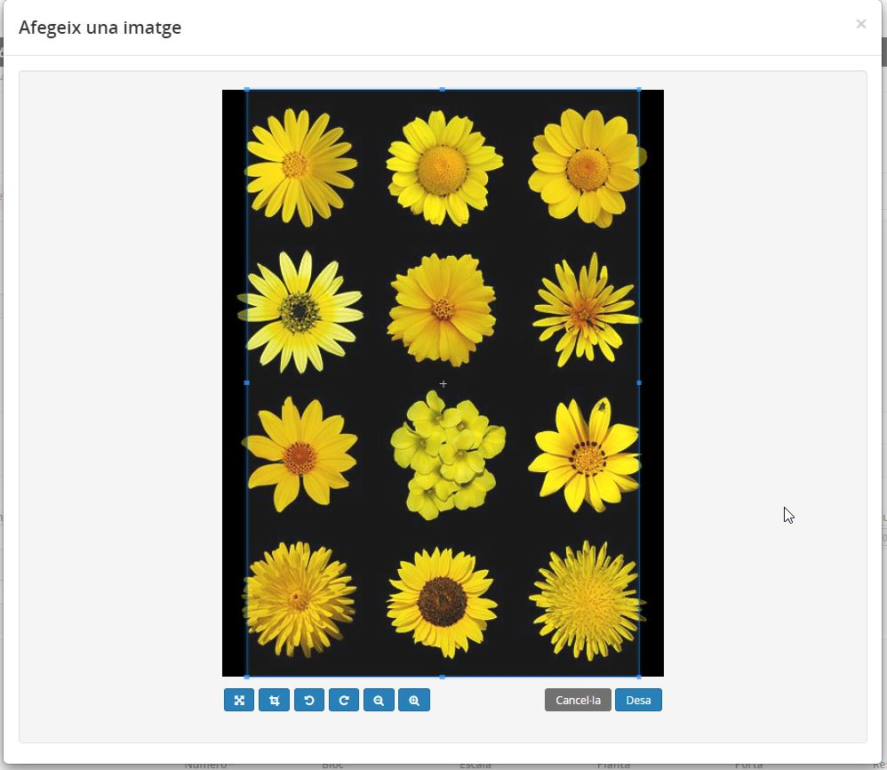
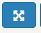
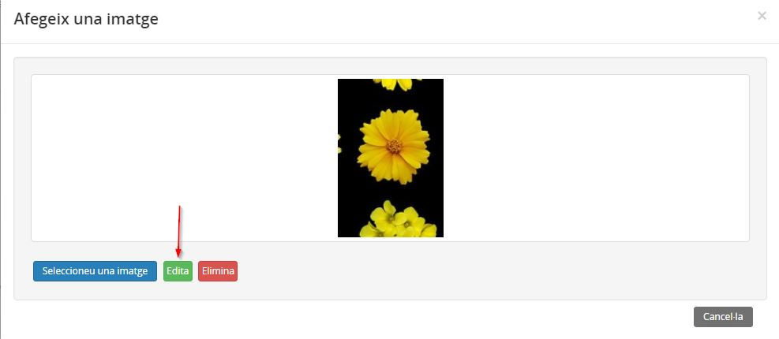
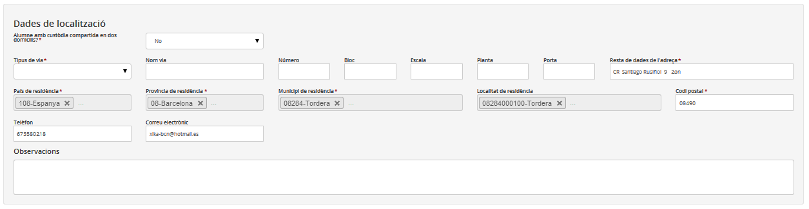
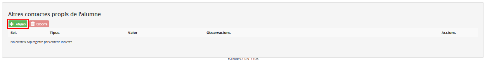

# Identificació

Les dades que es troben en aquesta pestanya corresponen a l'alumne i són les següents:

* [Dades personals](identificacio.md#dades-personals)
* [Fotografia de l'alumne/a](identificacio.md#fotografia-de-lalumnea)
* [Dades de localització](identificacio.md#dades-de-localització)
* [Altres contactes de l'alumne/a](identificacio.md#altres-contactes-de-lalumnea)

### Dades personals

Aquest bloc de dades correspon a les dades d'identificació de l'alumne.  

És molt important reflectir el màxim de dades sol·licitades de l'alumne i de contacte, així com respectar fidelment la informació que aporten els documents oficials.

*Imatge 1 - Dades personals de la fitxa de l'alumne*

La informació que recull és compartida amb el RALC, excepte els camps observacions. Qualsevol canvi que s'hi faci amb les dades compartides amb el RALC, quedarà reflectit a la resta d'aplicacions que les fan servir.

L'identificador de l'alumne és el número d'identificació de l'alumne durant tota la seva vida acadèmica i aquest no es pot modificar.

En aquest bloc es poden afegir les dades dels documents d'identificació de l'alumne com són el DNI, el TIS, el NIE i el passaport.

Si l'alumne és menor d'edat i està emancipat legalment, cal especificar el camp "Alumne emancipat legalment?" **Sí**. Si l'alumne és major d'edat i està tutelat, cal especificar **Sí** en el camp "Alumne tutelat legalment?".

---

### Fotografia de l'alumne/a

Per afegir la foto de l'alumne/a cal clicar a la imatge genèrica, a continuació cercar i seleccionar la foto, i aquesta s'afegeix.

*Imatge 2 - Quadre per afegir la foto de l'alumne*

*Imatge 3 - Selecció de la foto de l'alumne*

*Imatge 4 - Enregistrament de la foto de l'alumne*  
  
  
Podeu ajustar i modificar la imatge utilitzant els següents botons:

* El botó  serveix per desplaçar la imatge respecte el llenç.
* El botó  serveix per fixar la imatge i moure el quadre de selecció.
* El botó  serveix per girar la imatge en sentit antihorari.
* El botó  serveix per girar la imatge en sentit horari.
* El botó  serveix per disminuir el zoom.
* El botó  serveix per augmentar el zoom.

Un cop s'ha carregat la imatge, podeu tornar a editar-la.  
*Imatge 5 - Edició d'una fotografia existent*

---

### Dades de localització

En aquest apartat cal indicar les dades de localització de l'alumne.
En cas que l'alumne tingui custòdia compartida, serà obligatori especificar les dades del segon domicili.

*Imatge 6 - FDA - Dades de localització de la fitxa de l'alumne*

---

### Altres contactes de l'alumne/a

*Imatge 7 - FDA - Àmbit personal - Identificació - Altres contactes de l'alumne*

En aquest darrer bloc es poden especificar altres contactes de l'alumne. Aquests poden ser l'adreça electrònica, el telèfon, el número de fax i el web.

Cal tenir en compte que totes les dades personals i de localització (tret els camps "Altres contactes" i "Observacions"), provenen del
RALC. Per tant, si es modifica alguna d'aquestes dades a Esfer@, quan se'n validin els
resultats de les modificacions queden gravades
automàticament al RALC.

---