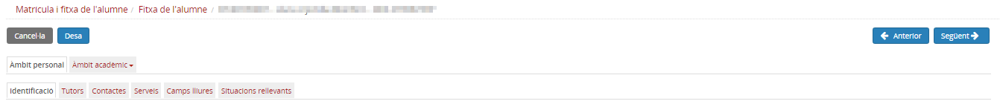

## Àmbit personal

L'**Àmbit personal** recull tota la informació de caràcter personal d'un alumne matriculat que el centre necessita per fer els diferents processos administratius.

* [Què és](index.md#que-es)
* [Com s'hi accedeix](index.md#com-shi-accedeix)
* [Quines operacions s'hi poden fer](index.md#quines-operacions-shi-poden-fer)

### Què és

La informació d'aquest àmbit s'organitza en pestanyes:

* [Dades identificatives](../../../../mgac/fda/fda-ap-identificacio.md)
* [Tutors](../../../../mgac/fda/fda-ap-tutors.md)
* [Contactes de l'alumne/a](../../../../mgac/fda/fda-ap-contactes.md)
* [Serveis](../../../../mgac/fda/fda-ap-serveis.md)
* [Camps lliures](../../../../mgac/fda/fda-ap-camps_lliures.md)
* [Situacions rellevants](../../../../mgac/fda/fda-ap-sit_rellevants.md)

---

### Com s'hi accedeix

Per accedir-hi cal clicar a la pestanya **Àmbit personal** de l'opció del menú **Fitxa de l'alumne** del mòdul **Matrícula i fitxa de l'alumne/a**.

*Imatge 1 - Accés a la fitxa de l'alumne*

*Imatge 2 - FDA - Accés a l'Àmbit personal de la fitxa de l'alumne*

---

### Quines operacions s'hi poden fer

* Revisar i rectificar, si cal, les dades personals
* Revisar, rectificar i afegir dades de contacte tant de l'alumne com dels tutors
* Enregistrar els serveis a l'alumne: transport i menjador
* Emplenar informació dels camps lliures
* Enregistrar situacions rellevants de l'alumne/a

---