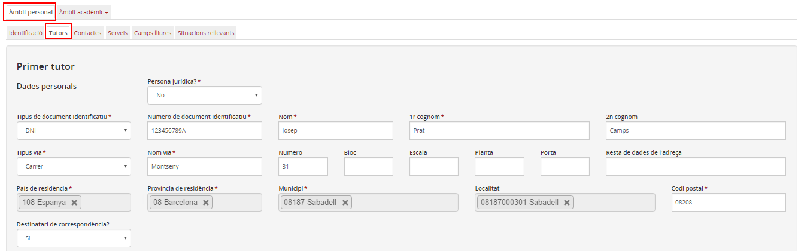
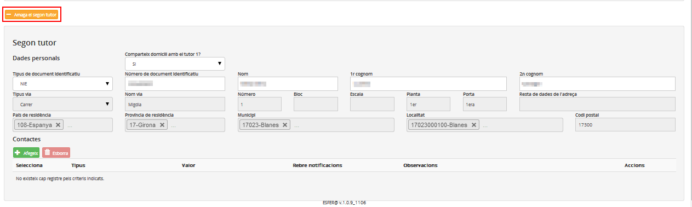

## Tutors

Les dades que es troben en aquesta pestanya són les següents:

* [Dades personals i de localització del primer tutor/a](tutors.md#dades-personals-i-de-localitzacio-del-primer-tutora)
* [Dades personals i de localització del segon tutor/a](tutors.md#dades-personals-i-de-localitzacio-del-segon-tutora)

*Imatge 1 - Dades del primer tutor o tutora*

### Dades personals i de localització del primer tutor/a

Aquest bloc de dades conté les dades personals i de localització del primer tutor o tutora. En cas que el tutor o tutora de l'alumne sigui una persona jurídica, s'hi faran constar les dades de localització de l'entitat jurídica.

A sota de les dades personals i de localització hi ha una taula amb els contactes que es van afegint (telèfon, adreça electrònica, fax i web).  
  
  

---

### Dades personals i de localització del segon tutor/a

Aquest bloc només és visible si l'alumne és menor d'edat. S'especifiquen les dades personals i de localització del segon tutor o tutora. Si aquest comparteix domicili amb el primer tutor o tutora, no caldrà emplenar-ne les dades de localització.

*Imatge 2 - Dades del segon tutor o tutora*

El botó  permet mostrar o amagar dades del segon tutor o tutora.

Es poden afegir més dades de localització com en el primer tutor.

---