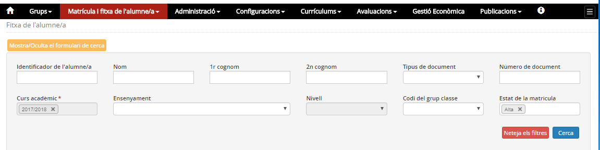
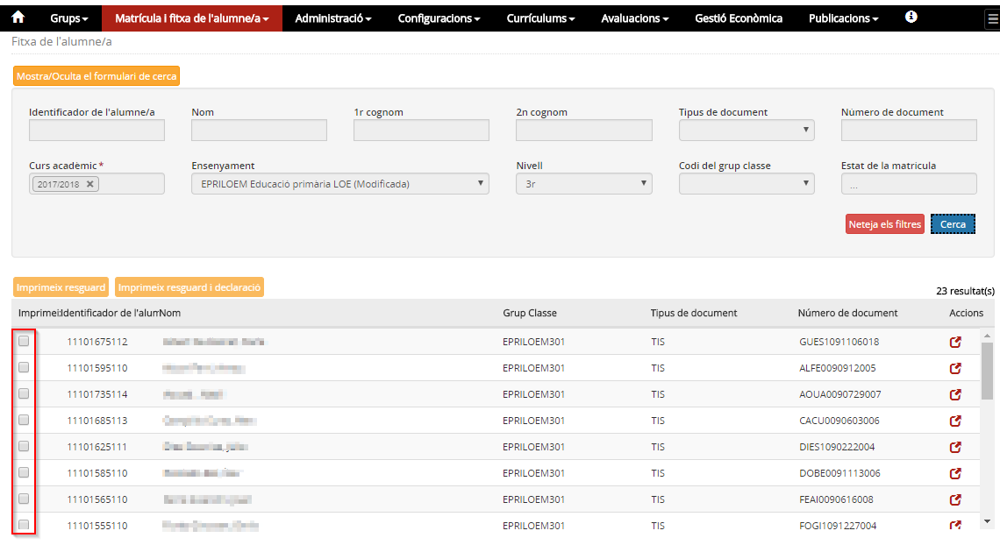
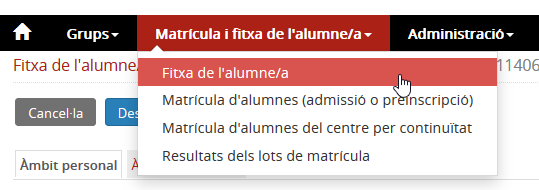

## Fitxa de l'alumne/a

* [Contextualització](index.md#contextualitzacio)
* [Funcions](index.md#funcions)
* [D'on venen les dades](index.md#don-venen-les-dades)
* [A quin lloc de l'aplicació es fan servir aquestes dades](index.md#a-quin-lloc-de-laplicacio-es-fan-servir-aquestes-dades)
* [Qui hi pot accedir](index.md#qui-hi-pot-accedir)
* [Com s'hi accedeix](index.md#com-shi-accedeix)

### Contextualització

El centre, com a resultat dels processos administratius amb els quals gestiona els alumnes, genera i necessita disposar de molta informació d'aquests. Alguns d'aquests processos administratius són la matrícula i l'avaluació.  
  
La fitxa de l'alumne esdevé, a Esfer@, una peça clau, ja que aglutina tota la informació d’un alumne o exalumne, tant la de l’àmbit personal com la de l’àmbit acadèmic. A la fitxa s’hi accedeix fàcilment perquè està recollida en un sol apartat del menú.

Les dades de l'alumne es distribueixen, a la fitxa de l'alumne, en dos blocs molt diferenciats: l'àmbit personal i l'àmbit acadèmic.  
  
Les dades corresponents a cadascun d'aquests dos àmbits es reparteixen en pestanyes per facilitar-ne l'accés. A continuació, es mostra com és aquesta distribució:

| Àmbit personal | Àmbit acadèmic |
| --- | --- |
| Dades identificatives | Dades curriculars de matrícula |
| Tutors | Resultats de les avaluacions finals |
| Contactes de l’alumne i/o tutors | Dades d’accés i finalització a l’ensenyament |
| Serveis | Especificitats dels cicles formatius |
| Camps lliures | Taxes i preus públics |
| Situacions rellevants | Atenció a la diversitat |

---

### Funcions

* [Definir els filtres per seleccionar els alumnes](index.md#definir-els-filtres-per-seleccionar-els-alumnes)
* [Seleccionar els alumnes i imprimir-ne el resguard i la declaració](index.md#seleccionar-els-alumnes-i-imprimir-ne-el-resguard-i-la-declaracio)

#### Definir els filtres per seleccionar els alumnes

La selecció de l'alumne o conjunt d'alumnes amb què es vol treballar es fa a partir de la següent pantalla de selecció:

*Imatge 1 - Filtre de selecció d'alumnes*
  
  
Es pot cercar un alumne concret o bé tots els alumnes d'un ensenyament, d'un ensenyament i nivell, d'un grup classe, etc.
  
  
Cal destacar el botó "Mostra/oculta el formulari de cerca", i el botó "Neteja filtres" que buida els filtres utilitzats en l'anterior cerca.

#### Seleccionar els alumnes i imprimir-ne el resguard i la declaració

*Imatge 2 - Selecció dels alumnes per treballar*
  
En la llista, hi ha una fila per a cada alumne amb la informació següent:

* Identificador de l'alumne
* Nom i cognoms
* Grup classe
* Tipus de document d'identificació
* Número del document d'identificació

A la capçalera de les columnes hi ha el nom del camp. A sota, hi ha uns camps per buscar informació detallada.
Amb el botó "Acció" s'accedeix a la fitxa dels alumnes seleccionats.
Des d'aquesta pantalla s'imprimeix el resguard de matrícula i la declaració de compromís.

---

### D'on venen les dades

Les dades de la fitxa de l'alumne provenen de diverses fonts:

* RALC (Registre d'alumnes de Catalunya)
* Processos de matrícula
* Processos d'avaluació
* Mòdul de configuracions

---

### A quin lloc de l'aplicació es fan servir aquestes dades

Les dades de la fitxa de l'alumne s'utilitzen en diferents llocs de l'aplicació:

* Mòdul de publicacions: On es pot generar diferent documentació.
* Mòdul de matrícula i fitxa de l'alumne: En concret en el procés de la matrícula
* Mòdul d'avaluació
* Mòdul de gestió administrativa
* Mòdul de grups

---

### Qui hi pot accedir

El director o directora, l'equip directiu, i el personal d'administració i serveis.

---

### Com s'hi accedeix

  
*Imatge 3 - Accés a la fitxa de l'alumne/a*

