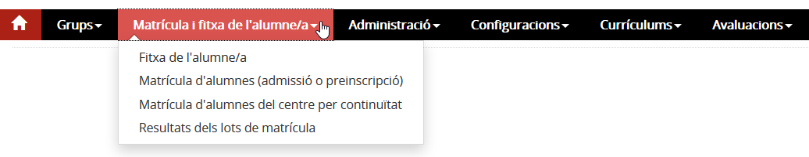

## Matrícula

* [Contextualització](index.md#contextualitzacio)
* [Funcions](index.md#funcions)
* [D’on venen les dades](index.md#don-venen-les-dades)
* [A quin lloc de l’aplicació es fan servir aquestes dades](index.md#a-quin-lloc-de-laplicacio-es-fan-servir-aquestes-dades)
* [Qui hi pot accedir](index.md#qui-hi-pot-accedir)
* [Com s’hi accedeix](index.md#com-shi-accedeix)
* [Organització](index.md#organitzacio)

### Contextualització

La matrícula és un procés administratiu que es fa una vegada per cada curs i amb el qual es lliga l’alumne a un centre, ensenyament i nivell. Les dades que conformen una matrícula són les dades personals i de localització de l’alumne i dels pares o tutors, i del currículum (matèries) que cursarà.

Per agilitzar el procés de matrícula, és interessant haver configurat prèviament el curs corresponent al curs en què es matricula l'alumnat en l'opció **Paràmetres del centre** dins de la pestanya **Configuracions**.

### Funcions

La matrícula es formalitza en el programa de gestió del centre i posteriorment es registra en el Registre d'alumnes (RALC), que és un sistema d’informació únic de dades bàsiques dels alumnes. El RALC assigna un identificador únic (IDALU) a cada alumne, que és una dada clau per identificar-lo unívocament en qualsevol sistema departamental.
  
La matrícula es pot formalitzar de les maneres següents:

* Matrícula individual d’alumnes assignats al centre.
* Matrícula individual d’alumnes que continuen al centre.
* Matrícula massiva d’alumnes que continuen al centre amb disposició de les dades per automatitzar-la.

En el moment de desar i registrar la matrícula s’han d’acomplir els requisits de qualitat de les dades, tant de RALC com d’Esfer@.

 

---

### D'on venen les dades

Les dades provenen dels sistemes d'informació del Departament d'Ensenyament i de dades que l'aplicació té de matrícules anteriors.

---

### A quin lloc de l’aplicació es fan servir aquestes dades

Les dades de la matrícula es visualitzen a la fitxa de l'alumne. També són dades que es fan servir en el procés d'avaluació i en properes matrícules de l'alumne.
Aquestes dades també formen part de l'expedient acadèmic de l'alumne i s'utilitzen per generar tota la documentació de l'alumne.

---

### Qui hi pot accedir

El director o directora, l'equip directiu, i el personal d'administració i serveis.

---

### Com s’hi accedeix

S'ha d'escollir l'opció **Matrícula d'alumnes (d'admissió o preinscripció)** o **Matrícula d'alumnes del centre per continuïtat** del mòdul **Matrícula i fitxa de l'alumne/a**.

*Imatge 1 - Accés a les opcions de matrícula*

---

### Organització

Està organitzat en els submòduls següents:

* [Matrícula d'alumnes (d'admissió o preinscripció)](../../mgac/mat/mat_pre.md)
* [Matrícula d'alumnes del centre per continuïtat](../../mgac/mat/mat_cont_1.md)
* [Resultats dels lots de matrícula](../../mgac/mat/mat_lot.md)

Una vegada ja s'ha efectuat la matrícula de l'alumnat, s'ha de distribuir en els **Grups classe**.

.

