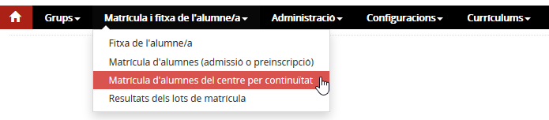
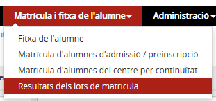

# Matrícula d'alumnes del centre per continuïtat

* [Què és](mat_cont.md#que-es)
* [Com s'hi accedeix](mat_cont.md#com-shi-accedeix)
* [Quines operacions s'hi poden fer](mat_cont.md#quines-operacions-shi-poden-fer)
* [Tipus de matrícules](mat_cont.md#tipus-de-matricules)

## Què és

Des d'aquesta opció del submòdul **Matrícula d'alumnes del centre per continuïtat** del mòdul **Matrícula i fitxa de l'alumne/a** es matriculen els alumnes que tenen una matrícula activa al centre, per cursar un altre nivell del **mateix ensenyament de la matrícula** o per accedir a un altre ensenyament en el **mateix centre** en els casos previstos per la normativa. [1)](mat_cont.md#1).

La matrícula es pot fer:

* Alumne per alumne. Permet fer la matrícula d'un alumne concret, especificant totes les dades de la matrícula i del currículum.
* D'un conjunt o lot d'alumnes que estan en condicions de poder-se matricular per continuïtat a un nivell determinat, tant els que accedeixen d'un nivell inferior i passen al nivell següent, com els que s'han de tornar a matricular al mateix nivell que repeteixen i als que s'assigna un mateix currículum.

Aquest pas és previ a la distribució de l'alumnat en els **Grups classe**.

.

En el cas dels alumnes d' **ESO** i **Batxillerat**, la matrícula no es podrà formalitzar fins l'endemà de la signatura de l'avaluació.

.
 

---

## Com s'hi accedeix

S'accedeix des de la pestanya **Àmbit acadèmic** de l'opció del menú **Matrícula d'alumnes del centre per continuïtat** del mòdul **Matrícula i fitxa de l'alumne/a**.
*Imatge 1 - Accés al menú Matrícula d'alumnes del centre per continuïtat*
 

---

## Quines operacions s'hi poden fer

### Selecció dels alumnes

En primer lloc, cal seleccionar els alumnes que es volen matricular. L'aplicació mostra un formulari de cerca amb els camps següents:

* **Curs escolar**: És un camp editable i obligatori. El valor que ve emplenat és el definit al camp **Curs per defecte de la matrícula** al mòdul **Configuracions**.
* **Ensenyament**: És un desplegable amb els ensenyaments del centre amb grups assignats.
* **Nivell**: És un desplegable amb els valors obtinguts de la selecció de l'ensenyament.
* **Règim**: És un desplegable amb els règims dels grups assignats al centre per l'ensenyament, pel nivell i pel curs escolar seleccionats.
* **Torn**: És un desplegable amb els règims dels grups assignats al centre per l'ensenyament, pel nivell i pel curs escolar seleccionats.

Quan es prem el botó , es mostra una llista dels alumnes candidats a ser matriculats per a aquest ensenyament, nivell, règim i torn. Aquests alumnes han d'estar matriculats al centre per al curs escolar immediatament anterior al seleccionat i han de tenir una matrícula donada d'alta per als mateixos criteris de cerca **i a més no estar seleccionats en cap lot de matrícula pendent de processar**.
  
A més, els alumnes que resulten de la cerca anterior compleixen alguna de les condicions següents:

* Cursen un ensenyament que no té avaluació final normativa i, per tant, no es disposa d'actes d'avaluació (per exemple, educació infantil). En aquest cas es mostren els alumnes del nivell immediatament anterior al seleccionat al formulari, per seleccionar els que passin de curs, i també es mostren els alumnes del nivell seleccionat al formulari, per seleccionar els que no passin de curs. En aquests casos la selecció entre els alumnes que passin o no passin de curs s'efectua directament en aquest punt del sistema;
* Tenen una matrícula per a un nivell inferior de l'especificat al formulari de cerca i, a l'acta d'avaluació final, consta que passen de nivell;
* Tenen una matrícula per al mateix nivell que l'especificat al formulari de cerca i, a l'acta d'avaluació final, consta que romanen al mateix nivell;
* Tenen una matrícula al nivell immediatament anterior d'un ensenyament en el qual l'acta d'avaluació no recull la informació de pas de nivell (com és el cas dels cicles formatius).

Es mostra la llista d'alumnes que compleixen les condicions de cerca explicades anteriorment.

#### Comprovar el currículum dels alumnes

En finalitzar la matrícula dels alumnes es pot [comprovar el seu currículum](http://educacio.gencat.cat/portal/page/portal/EducacioIntranet/Inici/PortalCentres/pcGestioAdministrativa/Detall)
  
 

---

## Tipus de matrícules

* **[Matrícula d'un alumne](mat_cont.md#matricula-dun-alumne)**: aquesta opció permet fer la matrícula puntual d'un alumne. És especialment útil per trobar i corregir fàcilment el problema pel qual no s'ha pogut matricular un alumne dins d'un lot de matrícula.
* **[Matrícula d'alumnes del centre a través d'un lot de matrícules](mat_cont.md#matricula-dalumnes-del-centre-a-traves-dun-lot-de-matricules)**: permet fer la matrícula d'un conjunt d'alumnes per un ensenyament i nivell amb el mateix currículum. Si es fa d'aquesta manera, s'ha de consultar l'estat del procés a l'opció del menú **Resultats dels lots de matrícula** del mòdul **Matrícula i fitxa de l'alumne**.

### Matrícula d'un alumne

Quan es clica la icona , l'aplicació mostra un assistent amb dos processos diferenciats:

* [Procés de matrícula](mat_cont.md#proces-de-matricula)
* [Fitxa de l'alumne/a](mat_cont.md#fitxa-de-lalumnea)

### Procés de matrícula

L'assistent mostra les dades de l'alumne. El primer pas correspon a les dades d'identificació, que cal completar-les amb les dades curriculars i, si és el cas, amb les especificitats i els preus públics dels cicles formatius:

* Les **dades identificatives** són les mateixes del RALC, però només de lectura.

Aquestes dades no es podran modificar fins després de finalitzar el procés de matrícula des de la **"Fitxa de l'alumne/a"**, a l'àmbit acadèmic, i a la pestanya **"Dades identificatives"**.

* Els camps venen emplenats segons el criteri següent:

  + Dades que són del RALC: Es mostren les dades de l'alumne al Registre.
  + Dades d'Esfer@: Es mostren les dades que l'aplicació té de matrícules anteriors.
* Cal especificar el **currículum** de l'alumne.

Prèviament, aquest s'ha d'haver definit al mòdul **Currículums**.

* Es poden especificar, en aquest moment, les **mesures d'atenció a la diversitat** o bé fer-ho a la fitxa de l'alumne més tard. El formulari que fa servir l'aplicació és el mateix que el de la fitxa de l'alumne, però sense recuperar cap dada de matrícules anteriors. Cal, però, haver especificat les mesures d'atenció a la diversitat que ofereix el centre als alumnes en el mòdul **Configuracions**.
* Si escau, s'indiquen les especificitats dels cicles formatius i les dades dels preus públics. El formulari que fa servir l'aplicació és el mateix que el de la fitxa de l'alumne, però sense recuperar cap dada de matrícules anteriors.

El fil d’Ariadna inclou la informació següent:

* Identificador de l'alumne;
* Cognoms i nom de l'alumne;
* Document d'identificació de l'alumne (si en té);
* Curs escolar;
* Codi i nom de l'ensenyament.

També hi ha els botons  i , que només estan actius si s'ha formalitzat la matrícula:

* **Resguard de la matrícula**: És el resguard tal com l'alumne s'ha matriculat al centre d'un ensenyament, nivell, règim i torn. A més, conté les dades curriculars de la matrícula.
* **Resguard de la matrícula i declaració**: S'imprimeix el resguard de la matrícula juntament amb una declaració assegurant que s'ha llegit la carta de compromís amb el centre, i que la família ha de signar.

#### Fitxa de l'alumne/a

Consisteix en el segon procés de l’assistent de matrícula on, un cop s’ha desat la matrícula, es permet accedir a les dades de la fitxa de l'alumne i modificar-ne el valor, si escau.
  
L'assistent mostra a la part superior els blocs de dades de la fitxa de l'alumne que es poden editar:

* [Dades identificatives](../../mgac/fda/fda-ap-identificacio.md)
* [Dades dels tutors](../../mgac/fda/fda-ap-tutors.md)
* [Dades dels serveis del menjador i transport](../../mgac/fda/fda-ap-serveis.md)
* [Situacions rellevants de l'alumne/a](../../mgac/fda/fda-ap-sit_rellevants.md)
* [Camps lliures](../../mgac/fda/fda-ap-camps_lliures.md)
* [Contactes](../../mgac/fda/fda-ap-contactes.md)

El formulari que es fa servir per a cadascun dels blocs anteriors coincideix amb el descrit a la fitxa de l'alumne.

### Matrícula d'alumnes del centre a través d'un lot de matrícules

En aquest cas, cal seleccionar els alumnes i prémer el botó "Lot de matrícula".
  
Tot seguit, l'aplicació mostra una finestra emergent on es demana que s'especifiqui el currículum del centre per als alumnes del lot.
  
Al confirmar l'acció anterior, l'aplicació mostra un missatge informatiu en què es rebrà un correu electrònic quan hagi finalitzat el procés.

S'ha de consultar el resultat d'aquest procés a l'opció del menú **Resultats dels lots de matrícula** del mòdul **Matrícula i fitxa de l'alumne**.

*Imatge 2 - Accés al menú Resultats dels lots de matrícula*
  
 

---

[1)](mat_cont.md#1)
Passar del 3r curs d'EINF a 1r d'EPRI, de 6è d'EPRI a 1r d'ESO o de 4t d'ESO a 1r de Batxillerat