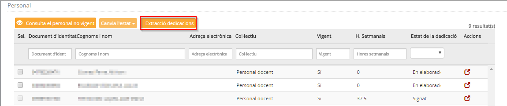
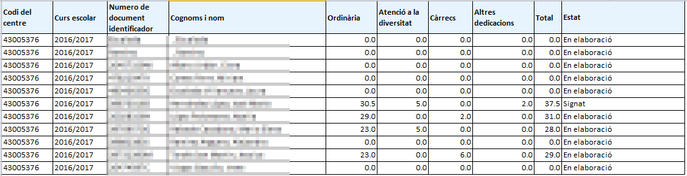

## Extraccions de la dedicació

* [Què és](extraccions.md#que-es)
* [Com s'hi accedeix](extraccions.md#com-shi-accedeix)
* [Quines operacions s'hi poden fer](extraccions.md#quines-operacions-shi-poden-fer)

### Què és

En aquesta opció del mòdul **Personal** es duen a terme les extraccions de les dedicacions laborals del personal.
  
 

---

### Com s'hi accedeix

Per accedir-hi, cal seleccionar l'opció del menú **Personal** del mòdul **Personal** i prémer el botó [**Extracció dedicacions**]
  
  
*Imatge 1 - Accés l'extracció de dedicacions*
  
  
 

---

### Quines operacions s'hi poden fer

#### Extraccions de dades

L'aplicació genera un fitxer XLS amb la informació de la dedicació laboral del personal docent del curs que estigui definit al mòdul **Configuracions**. El fitxer conté les dades següents:

* **Codi del centre**
* **Curs escolar**
* **Número de document identificador**
* **Cognoms i noms**
* **Resum de les hores ordinàries**
* **Resum de les hores d'atenció a la diversitat**
* **Resum de les hores per a càrrecs**
* **Resum de les hores per a altres dedicacions**
* **Resum del total d'hores**
* **Estat**: Els estats poden ser "En elaboració", "Elaborat", "Pendent de signatura" i "Signat".

*Imatge 2 - Extracció de la dedicació*
  
  
 

---