## Les meves dades

* [Què és](per_lmd.md#què-és)
* [Com s'hi accedeix](per_lmd.md#com-shi-accedeix)
* [Quines operacions s'hi poden fer](per_lmd.md#quines-operacions-shi-poden-fer)

### Què és

En aquesta opció del mòdul **Personal** cada persona del centre pot consultar les seves dades i dur a terme la gestió de la seva dedicació laboral.
  
Els professors o personal d'administració i serveis són els responsables d'introduir les dades de la seva dedicació horària i, quan completen aquesta tasca, indicar-ho a la mateixa pantalla.
  
 

---

### Com s'hi accedeix

Per accedir-hi, cal seleccionar l'opció **Visualitzar les meves dades** del mòdul **Personal**.
  
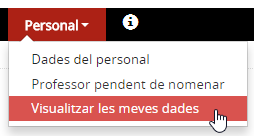*Imatge 1 - Accés al menú Visualitzar les meves dades* 
  
 

---

### Quines operacions s'hi poden fer

* [Consultar les dades](per_lmd.md#consultar-les-dades)
* [Gestionar la dedicació](per_lmd.md#gestionar-la-dedicació)

### Consultar les dades

En entrar al menú **Visualitza les meves dades** l'aplicació mostra les dades personals i laborals de la persona que hi accedeix.
  
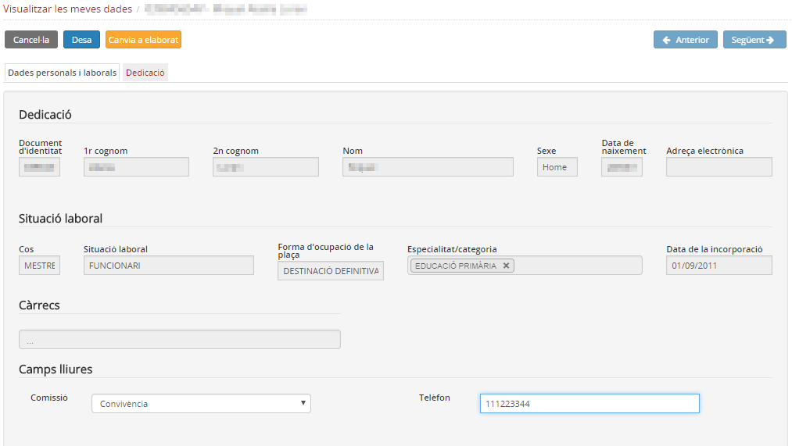*Imatge 2 - Fitxa del personal* 
  
A la part superior, es mostren les dades identificatives del personal (nom i cognoms, i document d'identitat).
  
Les dades del personal s'agrupen en dos blocs:

* Dades personals i laborals
* Dedicació

#### Dades personals i laborals

Es mostra una pantalla amb les dades següents:

* **Dades identificatives**:

  + Document d'identitat
  + 1r cognom
  + 2n cognom
  + Nom
  + Sexe
  + Data de naixement
  + Adreça electrònica
* **Situació laboral**:

  + Cos
  + Situació laboral
  + Forma d'ocupació de la plaça
  + Especialitat/categoria
  + Data de la incorporació

\* **Càrrecs**
\* **Camps lliures** (si se n'han definit)
  

Les dades que es mostren es corresponen amb la informació que hi ha a la base de dades de personal del Departament d'Ensenyament. Si alguna dada no és correcta s'ha de sol·licitar el canvi als Serveis Territorials corresponents.

  
 

---

### Gestionar la dedicació

La dedicació laboral del personal docent comporta un procés d'elaboració que finalitza amb la signatura per part d'algun membre de l'equip directiu del centre.
La dedicació passa pels següents estats:

* **En elaboració**: mentre s'hi està treballant .
* **Elaborat**: quan el mestre finalitza la compleció de la dedicació l'ha de posar en aquest estat.
* **Pendent de signatura**: és l'estat que indica que tot és correcte i només manca la signatura de l'equip directiu.
* **Signat**: en aquest estat es mostra la dedicació que ha estat signada per l'equip directiu.

A la primera part hi ha un **Resum** amb les següents dades:

* **Curs escolar**
* **Estat de la dedicació**

i les dades afegides a la **Dedicació**, apartat que es distribueix en quatre blocs:

* [Dedicació ordinària](per_lmd.md#dedicació-ordinària)
* [Atenció a la diversitat](per_lmd.md#atenció-a-la-diversitat)
* [Càrrecs](per_lmd.md#càrrecs)
* [Altres funcions](per_lmd.md#altres-funcions)

#### Dedicació ordinària

És la que s'obté de la gestió dels grups classe i agrupacions organitzatives. Conté la següent informació:

* **Ensenyament**: codi de l'ensenyament.
* **Grup**: codi del grup. Pot ser un grup classe o una agrupació organitzativa.
* **Contingut**: nom del contingut.
* **Hores de referència**: hores que determina la normativa vigent.
* **Hores setmanals**: hores que determina el centre.
* **No comptabilitza per simultaneïtat de grups**: xec per marcar si les hores del contingut es fan simultàniament amb un altre contingut.
* **Llengua vehicular en què s'imparteix**: pot ser català, aranès, castellà, anglès, … Per defecte es mostra català.
* **Percentatge**: és el percentatge del temps que es treballa en la llengua vehicular indicada. Per defecte es mostra 100%

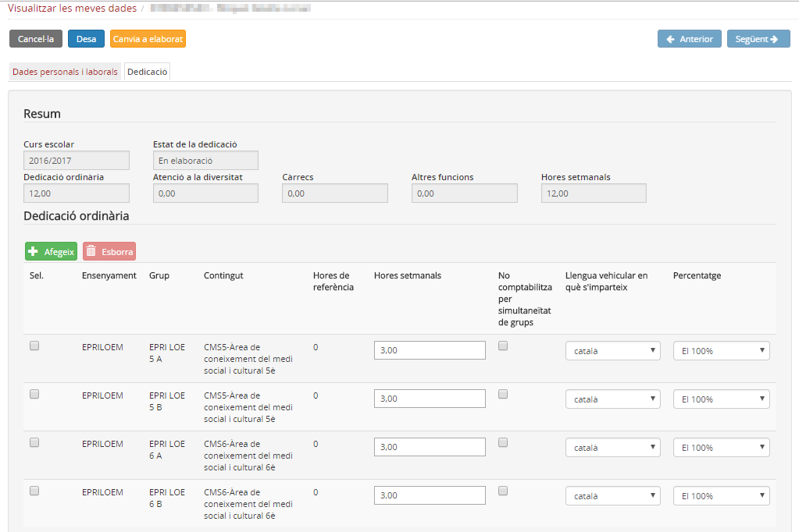*Imatge 3 - Dedicació ordinària* 
  
El mestre ha de completar la dedicació ordinària. Les entrades que es mostren es poden **esborrar**, **marcar que no compatibilitzin**, **canviar la llengua vehicular** i el **percentatge** d'ús.
  
Si és necessari també se'n poden **afegir**:
  
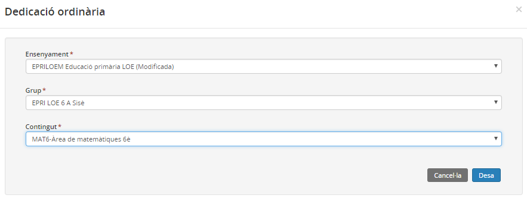*Imatge 4 - Afegir dedicació ordinària* 
  
A continuació es mostren els altres apartats de la dedicació:
  
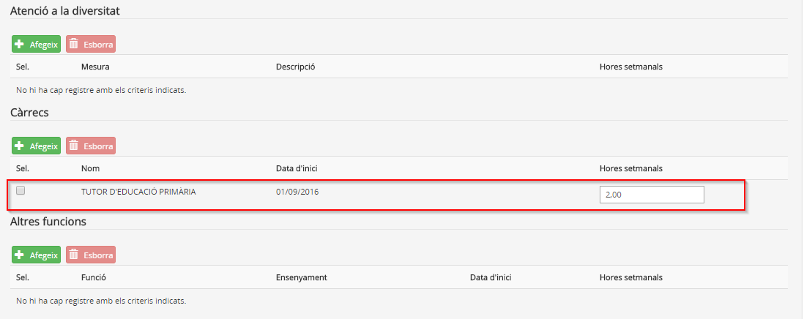*Imatge 5 - Altres dedicacions*

#### Atenció a la diversitat

Permet indicar les hores setmanals que el mestre dedica a mesures d'atenció a la diversitat, sempre que aquestes estiguin autoritzades i/o s'hagin activat en el mòdul de Configuracions.
  
  
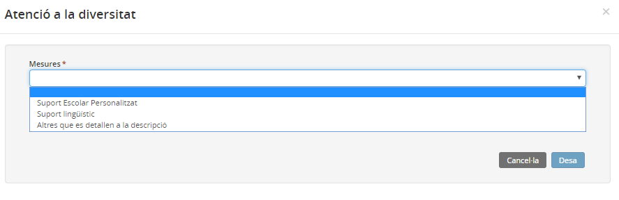*Imatge 6 - Afegir dedicació d'atenció a la diversitat*

#### Càrrecs

Els càrrecs que comporten un "nomenament" com ara els de l'equip directiu, tutor/a, coordinador, etc. es mostren carregats. L'usuari només ha de completar les hores de dedicació.
  
Si la persona ocupa un càrrec intern del centre s'haurà d'afegir:
  
  
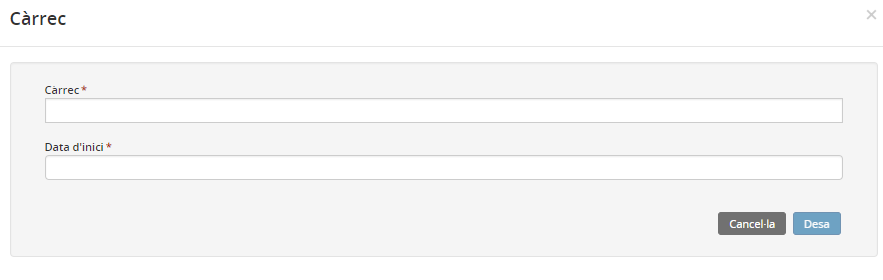*Imatge 7 - Afegir càrrec de centre*

#### Altres funcions

Permet incloure altres funcions de la persona en el centre que comportin temps de dedicació setmanal.
  
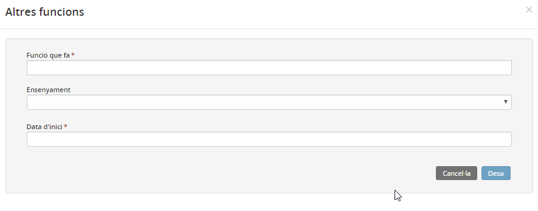*Imatge 8 - Afegir altres funcions*
  
Han de quedar completats tots els apartats necessaris:
  
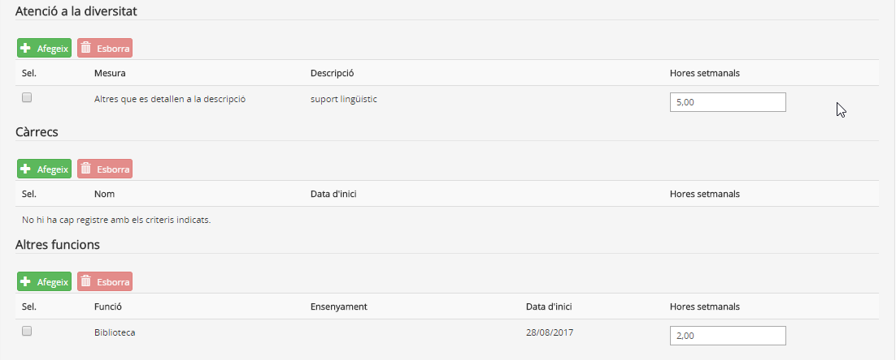*Imatge 9 - Dedicació complet*
  
Cal observar que a la part superior de la pantalla es mostra un resum de la dedicació de la persona:
  
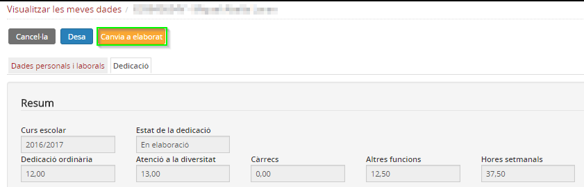*Imatge 10 - Resum horari de la dedicació*
  
Si tot és correcte cal canviar l'estat prement el botó 
  
L'estat de la dedicació canviarà a **Elaborat**:
  
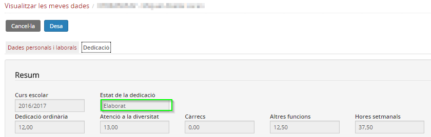*Imatge 11 - Dedicació en estat elaborat*
  
A partir d'aquest moment correspon a l'equip directiu i al personal de suport administratiu revisar la dedicació i canviar l'estat.

 

---