# Etiquetes d'alumnes

* [Què són](eti.md#què-són)
* [Com s’hi accedeix](eti.md#com-shi-accedeix)
* [Quines operacions s'hi poden fer](eti.md#quines-operacions-shi-poden-fer)

## Què són

En aquesta opció del menú **Publicacions** es dissenyen i s'elaboren les etiquetes.
  
  
Les etiquetes dissenyades, al contrari que les llistes, **no es poden desar**, s'elaboren i s'executen tot seguit.

---

## Com s’hi accedeix

Per accedir-hi, heu de seleccionar l'opció del menú **Etiquetes d'alumnes** del mòdul **Publicacions**.

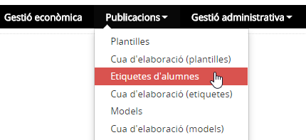*Imatge 1 - Accés a les etiquetes d'alumnes*

---

## Quines operacions s'hi poden fer

Les operacions que s'hi poden fer són:

* [Elaborar etiquetes preestablertes](eti.md#elaborar-etiquetes-preestablertes)
* [Elaborar etiquetes configurables](eti.md#elaborar-etiquetes-configurables)

Etiquetes **preestablertes** són etiquetes que ja estan dissenyades, així, l'usuari només ha de seleccionar els alumnes i obtenir les etiquetes.
  
  
Les etiquetes **configurables** necessiten la definició del contingut de l'etiqueta, és a dir, en aquest cas, l'usuari ha de definir l'etiqueta, seleccionar els alumnes i executar-la.
  
  
Tant en un com en l'altre cas cal, en primer lloc, determinar l'etiqueta que es vol generar:
  
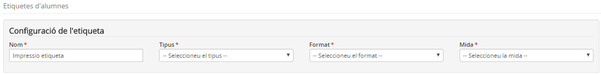*Imatge 2 - Configuració de l'etiqueta*

* **Nom**: servirà per identificar les etiquetes a la cua d'elaboració.
* **Tipus**: cal triar entre etiquetes configurables o preestablertes.
* **Format**: permet seleccionar l'etiqueta preestablerta que es vol utilitzar. **No aplica en el cas de les etiquetes configurables**.
* **Mida**: permet escollir la mida de l'etiqueta quan s'ha seleccionat etiqueta configurable. **No aplica en el cas de les etiquetes preestablertes**.

### Elaborar etiquetes preestablertes

L'aplicació disposa d'unes etiquetes ja elaborades, concretament l'**etiqueta postal** i cinc tipus diferents d'**etiquetes amb foto**. Aquestes etiquetes amb foto es diferencien per la mida de l'etiqueta i/o el tipus i mida de la lletra.
  
  
Triem **etiquetes preestablertes**, i, quan es tria un **Format** surt a la part inferior del boc informació de l'etiqueta seleccionada:
  
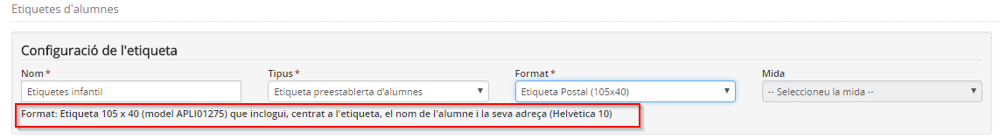*Imatge 3 - Informació del format de l'etiqueta* 
  
A continuació s'han de cercar els alumnes dels quals es volen imprimir etiquetes:
  
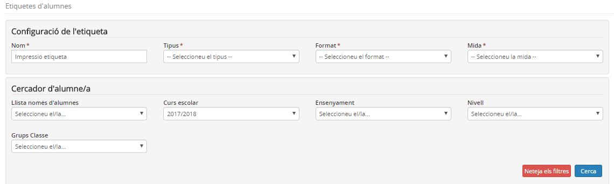*Imatge 4 - Cercador d'alumnes* 
  
Es poden utilitzar totes les combinacions possibles dels filtres existents, així com no informar-ne cap. En aquest cas la cerca mostrarà tots els alumnes del centre.
  
  
Un cop tenim el resultat de la cerca, s'han de seleccionar els alumnes concrets:
  
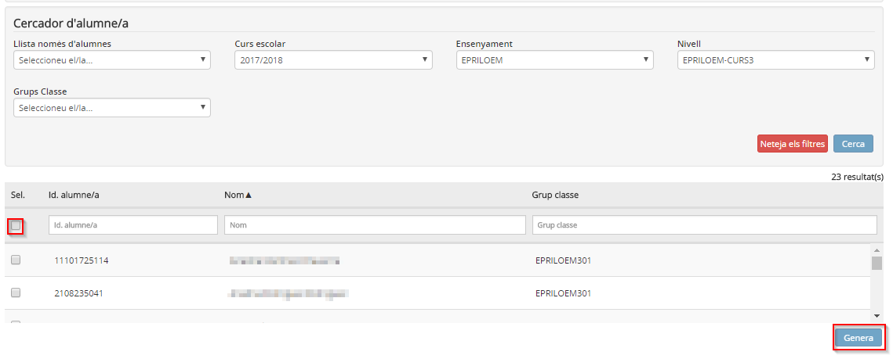*Imatge 5 - Resultat de la cerca i selecció d'alumnes* 
  
Per últim cal clicar el botó [**Genera**].
  
Es mostrarà un avís a la part superior de la pantalla informant que el resultat s'ha de cercar a l'opció del menú **Cua d'elaboració d'etiquetes** del mòdul **Publicacions**.
  
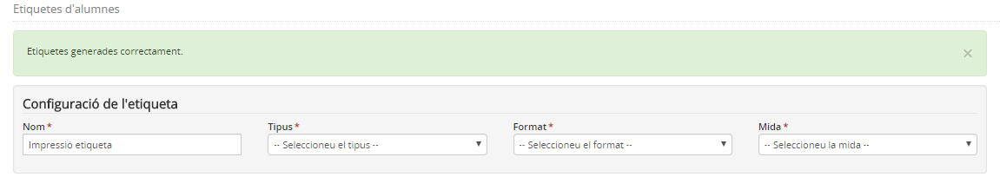*Imatge 6 - Avís* 
  
  

---

### Elaborar etiquetes configurables

L'aplicació permet dissenyar i elaborar altres etiquetes, amb altres mides o altres continguts. Són les etiquetes configurables.
  
Triem etiquetes configurables, i, quan es tria la **Mida** surt a la part inferior del boc informació de l'etiqueta seleccionada. En aquest cas la informació que es mostra també inclou el model de les etiquetes comercials "Apli" que cal utilitzar.
  
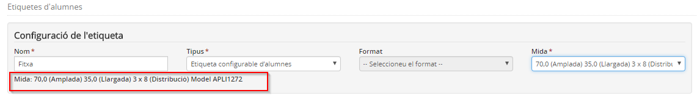*Imatge 7 - Etiqueta configurable* 
  
  
A continuació s'han de cercar els alumnes dels quals es volen imprimir etiquetes:
  
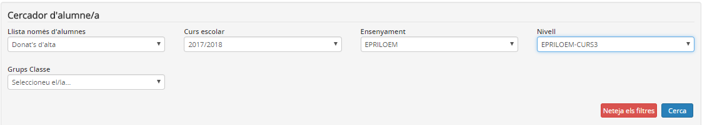*Imatge 8 - Cercador d'alumnes* 
  
Es poden utilitzar totes les combinacions possibles dels filtres existents, així com no informar-ne cap. En aquest cas la cerca mostrarà tots els alumnes del centre.
  
  
Un cop tenim el resultat de la cerca, s'han de seleccionar els alumnes concrets:
  
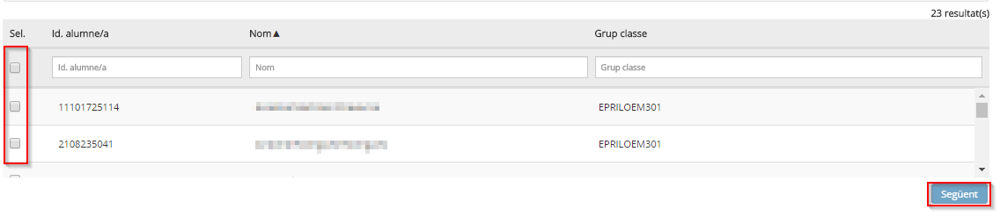*Imatge 9 - Resultat de la cerca i selecció d'alumnes* 
  
A continuació cal clicar el botó [**Següent**].
  
  
En aquest cas es mostrarà la pantalla per definir el contingut de l'etiqueta:
  
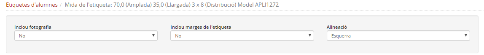*Imatge 10 - Definició de l'etiqueta configurable. 1a part*

* **Inclou fotografia**: "Sí" o "No" segons hagi de sortir o no la fotografia de l'alumne/a.
* **Inclou marges de l'etiqueta**: "Sí" o "No" segons es vulgui deixar marges als quatre costats de l'etiqueta.
* **Alineació**: "Esquerra", "Centre", "Dreta" segons es vulgui l'alineació del text.

Seguidament s'han de seleccionar els camps d'informació que ha de contenir l'etiqueta i situar-los a la línia que es desitgi:
  
Es mostrarà un nombre variable de **línies** (Fila 1, Fila 2, …) segons la mida de l'etiqueta seleccionada.
  
  
A continuació la relació de **camps disponibles**. A cada camp s'inclou el **nombre d'espais** que requereix.
  
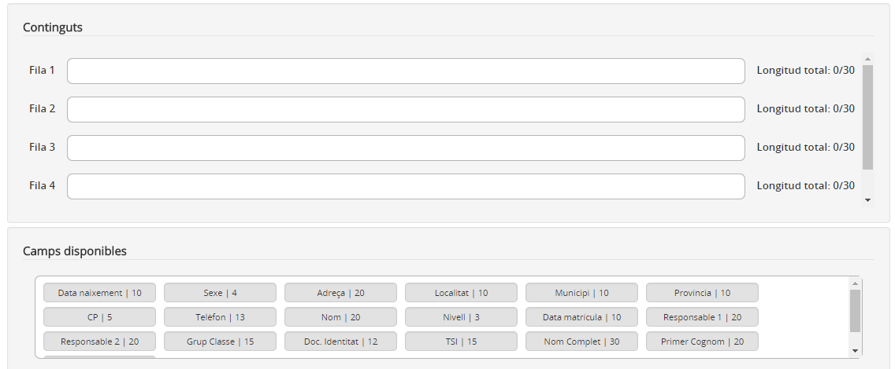*Imatge 11 - Definició de l'etiqueta configurable. 2a part*
  
  

Per seleccionar un **camp** cal clicar-lo amb el ratolí i arrossegar-lo fins a la **Fila** en què es vol mostrar.
Per treure de l'etiqueta un camp inserit, cal clicar-lo i arrossegar-lo al contenidor de camps disponibles.

  

Cal tenir en compte que només es mostraran disponibles els camps dels quals la seva amplada els permeti de ser inclosos a l'etiqueta.

  
Cal observar que a la dreta de cada **Fila** indica el nombre d'espais disponibles i el nombre d'espais ocupats. Això ens indica si és possible posar un altre camp a la mateixa fila.
  
Un cop realitzada tota la definició de l'etiqueta cal prémer el botó [**Genera**]:
  
  
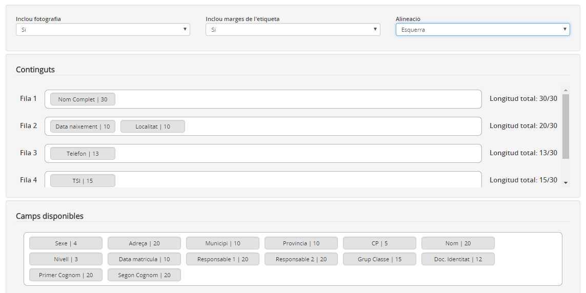*Imatge 12 - Definició de l'etiqueta configurable realitzada* 
  
  
Es mostrarà un avís a la part superior de la pantalla informant que el resultat s'ha de cercar a l'opció del menú **Cua d'elaboració d'etiquetes** del mòdul **Publicacions**.
  
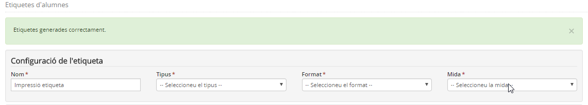*Imatge 13 - Avís*

---