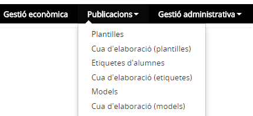

# Publicacions

* [Contextualització](index.md#contextualització)
* [Funcions](index.md#funcions)
* [D’on venen les dades](index.md#don-venen-les-dades)
* [A quin lloc de l’aplicació es fan servir aquestes dades](index.md#a-quin-lloc-de-laplicació-es-fan-servir-aquestes-dades)
* [Qui hi pot accedir](index.md#qui-hi-pot-accedir)
* [Com s’hi accedeix](index.md#com-shi-accedeix)
* [Organització](index.md#organització)

### Contextualització

Les dades dels alumnes i del personal que es desen en l'aplicació s'han de poder visualitzar mitjançant publicacions. Per altra banda, les dades dels alumnes i del personal del centre han de constar en els documents administratius o en els documents que dissenyi el centre.

---

### Funcions

Des d'aquest mòdul es poden dissenyar i elaborar documents diversos. El disseny el fa l'usuari de l'aplicació que és qui diu els camps que en formaran part i els filtres que s'hi aplicaran en el moment de l'elaboració. Qualsevol publicació que es pugui configurar podrà ser utilitzada només per la persona que la generi o podrà ser-ho per tot el centre.
  
Els formats de sortida són "WORD", "EXCEL" o "PDF".
  
 

---

### D'on venen les dades

Les dades provenen totes de l'aplicació, bàsicament de la **Fitxa de l'alumne/a** i de **Personal**.

---

### A quin lloc de l’aplicació es fan servir aquestes dades

Les publicacions configurables es defineixen i es fan servir només en aquest mòdul.

---

### Qui hi pot accedir

El director o directora, l'equip directiu, i el personal d'administració i serveis.

---

### Com s’hi accedeix

S'ha d'escollir l'opció **Publicacions**.

*Imatge 1 - Accés a les opcions de Publicacions*

---

### Organització

Està organitzat en els submòduls següents:

* [Plantilles](../../mgac/pub/men_pla.md)
* [Cua d'elaboració (plantilles)](../../mgac/pub/men_cuad.md)
* [Etiquetes d'alumnes](../../mgac/pub/men_eti.md)
* [Cua d'elaboració (etiquetes)](../../mgac/pub/men_cua_eti.md)
* [Models](../../mgac/pub/men_mod.md)
* [Cua d'elaboració (models)](../../mgac/pub/men_cua_mod.md)

