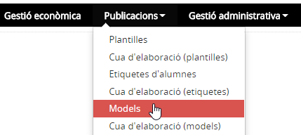
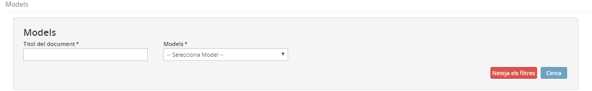
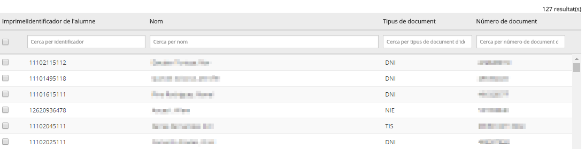
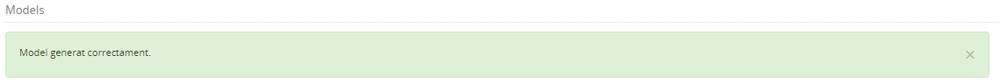

# Models

* [Què són](mod.md#que-son)
* [Com s’hi accedeix](mod.md#com-shi-accedeix)
* [Quines operacions s'hi poden fer](mod.md#quines-operacions-shi-poden-fer)

## Què són

En aquesta opció del menú **Publicacions** es poden obtenir alguns documents ja definits a l'aplicació.

---

## Com s’hi accedeix

Per accedir-hi, heu de seleccionar l'opció del menú **Models** del mòdul **Publicacions**.

*Imatge 1 - Accés als models*

---

## Quines operacions s'hi poden fer

Des d'aquesta opció de menú es poden elaborar documents d'un conjunt d'alumnes, sense necessitat d'haver d'accedir a la fitxa de cada alumne en particular.
  
  
En primer lloc cal determinar les següents dades:
  
*Imatge 2 - Determinació del model*

* **Títol**: servirà per identificar els models a la cua d'elaboració.
* **Models**: cal triar entre els models disponibles.

En funció del model seleccionat caldrà determinar altres dades:

* **Curs escolar**
* **Grup classe**

A continuació cal cercar i seleccionar els alumnes:
  
*Imatge 4 - Cerca i selecció d'alumnes*
  
Per acabar s'ha de prémer el botó [**Imprimir PDF**]
  
Es mostrarà un avís a la part superior de la pantalla informant que el model s'ha generat correctament. Per visualitzar-lo, cal anar a l'opció del menú **Cua d'elaboració (models)** del mòdul **Publicacions**.
  
*Imatge 5 - Avís* 
  
  

---