# 1.1 Dotació

* [1.1.1. Descripció](ap11.md#111-descripció)
* [1.1.2. Contingut pas a pas](ap11.md#112-contingut-pas-a-pas)

  + [1.1.2.1. Accés](ap11.md#1121-accés)
  + [1.1.2.2. Elaborar un nou pressupost](ap11.md#1122-elaborar-un-nou-pressupost)
  + [1.1.2.3. Esborrar un pressupost](ap11.md#1123-esborrar-un-pressupost)
  + [1.1.2.4. Edició del pressupost](ap11.md#1124-edició-del-pressupost)
  + [1.1.2.5. Afegir subpartides al pressupost](ap11.md#1125-afegir-subpartides-al-pressupost)
  + [1.1.2.6. Modificar una subpartida](ap11.md#1126-modificar-una-subpartida)
  + [1.1.2.7. Esborrar una subpartida](ap11.md#1127-esborrar-una-subpartida)
  + [1.1.2.8. Dotació de partides per centres de cost](ap11.md#1128-dotació-de-partides-per-centres-de-cost)

    - [1.1.2.8.1. Afegir centre de cost](ap11.md#11281-afegir-centre-de-cost)
    - [1.1.2.8.2. Esborrar centre de cost](ap11.md#11282-esborrar-centre-de-cost)

---

## 1.1.1. Descripció

Una de les funcionalitats principals del Mòdul de Gestió Econòmica d’Esfer@ és la gestió pressupostària.

Dins d’aquest contingut es descriu el procés de creació del pressupost i dotació (assignació de diners) de les partides que en formen part.

Tot i que els procediments són comuns en tots els casos, en alguns apartats es detalla separadament la gestió de la dotació en els centres escolars que empren centres de cost i en aquells que no n’empren.

Tota la funcionalitat de *Dotació* és específica per als usuaris dels centres *(Directors i Usuaris de Gestió Econòmica)*.

---

## 1.1.2. Contingut pas a pas

### 1.1.2.1. Accés

Des de la pàgina principal d’Esfer@ cal anar al mòdul de *Gestió Econòmica*.

Imatge 1. Pantalla inicial d’Esfer@

Una vegada s’accedeix al mòdul de *Gestió Econòmica* apareixerà un llistat de pressupostos que té el centre, amb les següents columnes (*Imatge 2. Llista pressupostos*):

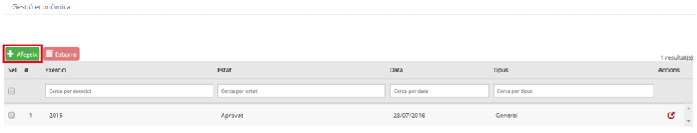

Imatge 2. Llista pressupostos

La informació de les columnes és la següent:

* *Exercici*: exercici fiscal (any) al qual pertany el pressupost.
* *Estat*: estat en el qual es troba el pressupost. Per informació detallada sobre els estats del pressupost, consultar els continguts específics d’Evolució del pressupost.

  + Podeu aconseguir diferents nivells
* *Data*: data en la qual hi va haver l’últim canvi d’estat del pressupost.

  + *General*.
  + *Menjador*.
* *Botó d’acció* : permet accedir al detall del pressupost i permet introduir la dotació a les partides.

A la capçalera de les columnes apareix el nom del camp corresponent. A sota, hi ha uns espais per poder aplicar filtres sobre la informació de detall.

Des d’aquesta pantalla es poden fer les operacions relacionades amb elaborar, esborrar i editar un pressupost, tal i com s’explica a continuació.

---

### 1.1.2.2. Elaborar un nou pressupost

Per elaborar un nou pressupost cal seguir el següent procediment:

* Des de la pantalla de llista de pressupost (imatge 2), prémer el botó *Afegeix*. 
* Apareix la pantalla de creació de nou pressupost (*Imatge 3. Crear un nou pressupost*).

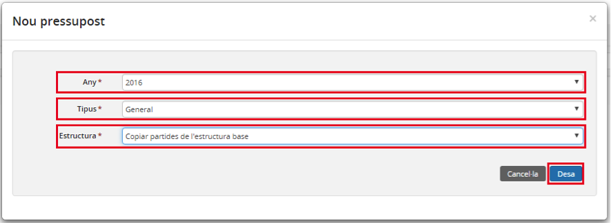

Imatge 3. Crear un nou pressupost

* Cal indicar les dades del nou pressupost:

  + *Any*: exercici fiscal (any) al qual pertany el pressupost.
  + *Tipus*: tipus de pressupost:

    - *General*.
    - *Menjador*.
  + *Estructura*: estructura base que es pren per crear el pressupost. Hi ha les següents opcions per escollir:

    - *Copiar partides de l’estructura base*:

      * Crea un pressupost que conté només les partides de l’estructura base del pressupost que hagi definit l’Administrador.
      * Els imports inicials de totes les partides són zero (0).
    - *Copiar l’estructura del pressupost de l’any anterior:*

      * Crea un pressupost amb les partides i subpartides del pressupost de l’any anterior.
      * Es poden afegir o eliminar noves subpartides.
      * Els imports inicials de totes les partides són zero (0).
    - *Copiar el pressupost de l’any anterior:*

      * Crea una còpia exacta del pressupost de l’any anterior.
      * Es poden afegir o eliminar noves subpartides
      * Els imports de les partides es copien del pressupost de l’any anterior, però es poden modificar.

* Prémer el botó *Desa* , per crear el pressupost.

  + Si es prem el botó *Cancel·la* no es crea el nou pressupost.
* Es crea el nou pressupost i es mostra la pantalla de detall del nou pressupost en estat *En elaboració* *(Imatge 4. Pressupost creat)*. Llevat que s’hagi creat el pressupost a partir del pressupost de l’any anterior (inclosos els imports), els camps *Total ingressos* i *Total despeses* es generen amb valor zero (0). A la pantalla apareix el missatge de confirmació de pressupost creat.

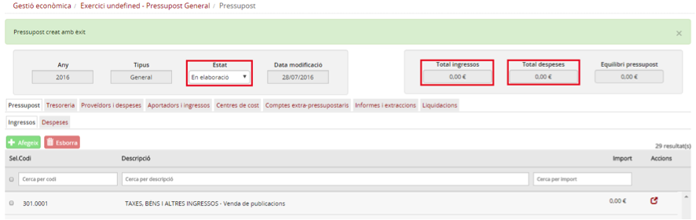

Imatge 4. Pressupost creat

Només es pot crear un únic pressupost per un mateix any i tipus.

---

### 1.1.2.3. Esborrar un pressupost

Per esborrar un pressupost existent cal seguir el següent procediment *(Imatge 5. Esborrar un pressupost)*:

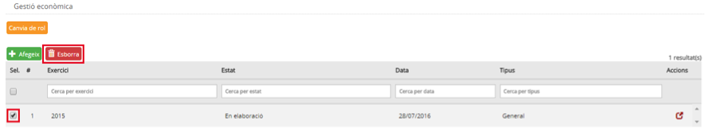

Imatge 5. Esborrar un pressupost

* Des de la pantalla de llista de pressupostos (imatge 2), seleccionar el pressupost que es vol esborrar, marcant el quadret a la part esquerra de la fila.
* Prémer el botó *Esborra*. 
* Apareix un missatge per confirmar l’acció. Cal confirmar.
* El pressupost només es podrà esborrar en cas que no s’hi hagi registrat cap ingrés ni despesa.

---

### 1.1.2.4. Edició del pressupost

Per fer totes les operacions d’edició del pressupost cal seleccionar el pressupost que es vol editar i entrar a la pantalla de detall del pressupost.

* Des de la pantalla de llista de pressupostos *(Imatge 2. Llista pressupostos)*, prémer el botó d’acció  del pressupost sobre el qual es vol fer la dotació.
* S’accedeix a la pantalla de detall del pressupost *(Imatge 6. Pantalla de detall del pressupost)*.
* Seleccionar la pestanya *Pressupost*.
* Triar la subpestanya:

  + *Ingressos*: per editar les partides i subpartides d’ingrés.
  + *Despeses*: per editar les partides i subpartides de despesa.

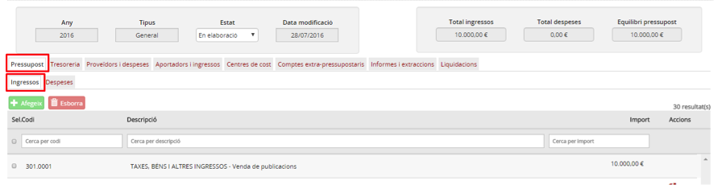

Imatge 6. Pantalla de detall del pressupost

Les operacions disponibles des de aquesta pantalla són:

* Afegir subpartides al pressupost.
* Modificar una subpartida.
* Esborrar una subpartida.
* Dotació de partides per centres de cost.

---

### 1.1.2.5. Afegir subpartides al pressupost

L’estructura de partides del pressupost ve fixada per l’estructura base del pressupost. Des del centre es poden afegir subpartides a les partides del pressupost.

Per afegir una subpartida al pressupost cal seguir el següent procediment:

* Des de la pantalla de detall del pressupost *(Imatge 6. Pantalla de detall del pressupost)*, cal seleccionar la partida per a la qual es vol afegir una subpartida.
* Prémer el botó *Afegeix* , tal com es mostra a la *Imatge 7. Afegir una subpartida*.

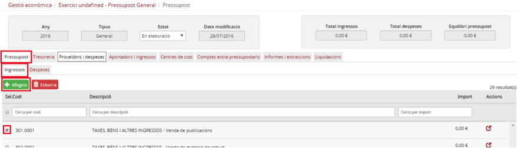

Imatge 7. Afegir una subpartida

* Apareix la pantalla de detall de la subpartida *(Imatge 8. Detall de subpartida)*.

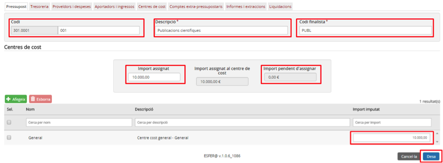

Imatge 8. Detall de subpartida

* Introduir els camps de detall de la subpartida:

  + *Codi*: codi específic de la subpartida. Valor alfanumèric únic (no hi pot haver cap altre subpartida amb el mateix codi).
  + *Descripció*: nom descriptiu de la subpartida.
  + *Codi finalista*: nom del codi finalista de la subpartida (Opcional).
  + *Import*: import total de la subpartida.

* En la taula de detall, per defecte apareix el *Centre de cost General*. En cas que el centre empri centres de cost (opció de configuració del centre), es podrà canviar la dotació per centres de cost. Veure l’apartat “*Dotació de partides per centres de cost*”.
* Prémer el botó *Desa* .

  + Només es podrà desar en cas que el camp *Import pendent d’assignar* tingui valor zero (0).
  + Si es prem el botó *Cancel·la* , la subpartida no es crea.

* Es torna a la pantalla de detall del pressupost on ja apareix la nova subpartida creada (Imatge 9. Nova subpartida creada).

  + Cal indicar que ja no es pot fer dotació sobre la partida a la qual hem afegit la subpartida.
  + En cas que s’hagués fet una dotació prèvia de la partida, aquesta dotació passa de forma automàtica a primera subpartida que es crea. Per exemple, si una partida té assignats 1.000 €, en el moment que es crea la primera subpartida, aquests 1.000 € passen automàticament a estar assignats a la subpartida, ja que les partides que tenen subpartides no tenen assignació pròpia.

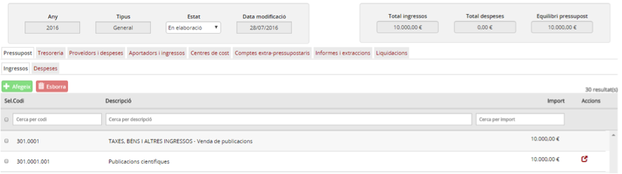

Imatge 9. Nova subpartida creada

---

### 1.1.2.6. Modificar una subpartida

* Per modificar una subpartida cal seguir el següent procediment:

  + Des de la pantalla de detall del pressupost (*Imatge 6. Pantalla de detall del pressupost*) prémer el botó d’acció  de la subpartida que es vol editar (a la part dreta de la fila corresponent).
  + Apareixerà la pantalla de detall de la subpartida (*Imatge 10. Modificar subpartida*).

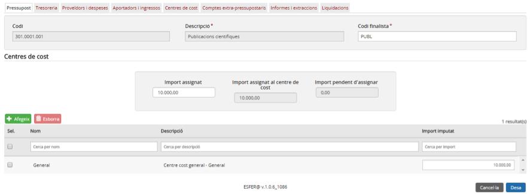

Imatge 10. Modificar subpartida

* Es poden Modificar els camps amb el quadre amb fons més clar. La resta de camps estan protegits.

  + En cas que es modifiqui el camp *Import* i la subpartida ja tingui moviments imputats, el camp *Import* no podrà ser inferior a l’import imputat a la subpartida.

* Prémer el botó *Desa* .

  + Si es prem el botó *Cancel·la*  es descarten els canvis.
* Si no hi ha cap error, el programa torna una pantalla de confirmació. Cal confirmar l’operació. Cas de que hi hagi algun error, el programa torna a la mateixa pantalla de modificació de subpartida, amb el missatge d’error corresponent.
* El programa torna a la pantalla de detall del pressupost (*Imatge 6. Pantalla de detall del pressupost*)

---

### 1.1.2.7. Esborrar una subpartida

Per esborrar una subpartida cal seguir el següent procediment (*Imatge 11. Esborrar subpartida*):

* Des de la pantalla de detall del pressupost (*Imatge 6. Pantalla de detall del pressupost*), seleccionar la subpartida que es vol esborrar.
* Prémer el botó Esborra. 

  + La subpartida només es podrà esborrar si no s’hi ha fet cap operació.

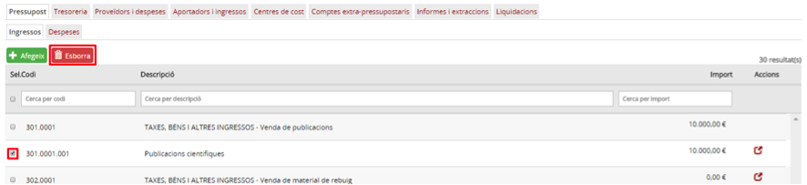

Imatge 11. Esborrar subpartida

* Apareix un quadre de diàleg que demana confirmació de l’operació.
* Es torna a la pantalla de detall del pressupost on ja no apareix la subpartida que s’ha esborrat.

---

### 1.1.2.8. Dotació de partides per centres de cost

Només és possible realitzar la dotació de partides per centres de cost en aquells centres que emprin centres de cost (opció de configuració del centre).

Per fer la dotació de partides o subpartides per centres de cost cal seguir el següent procediment:

* Des de la pantalla de detall del pressupost (*Imatge 6. Pantalla de detall del pressupost*) prémer el botó d’acció  de la subpartida que es vol editar.
* Apareixerà la pantalla de detall de la subpartida (*Imatge 12. Dotació per centres de cost*).

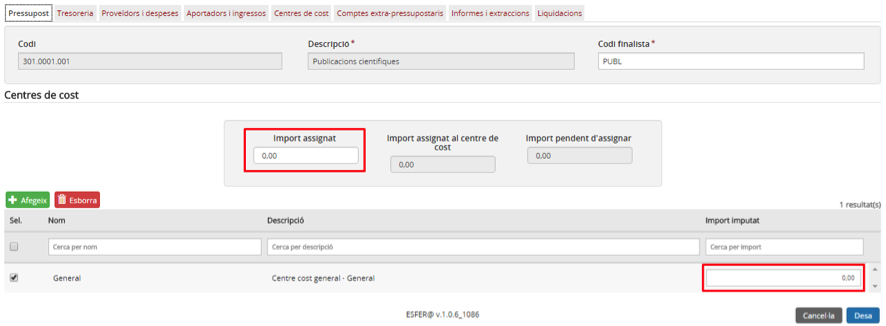

Imatge 12. Dotació per centres de cost

* Per defecte, la partida o subpartida té assignat el *Centre de cost General*.
* Sobre la taula de centres de cost es poden fer les següents operacions:

  + [Afegir centre de cost](ap11.md#afegir-centre-de-cost): permet afegir un o més centres de cost a la partida o subpartida.
  + [Esborrar centre de cost](ap11.md#esborrar-centre-de-cost): permet esborrar centres de cost de la taula.

    - La taula ha de tenir almenys un centre de cost. Per esborrar el *Centre de cost General* que les partides o subpartides tenen assignat per defecte, caldrà primer afegir un nou centre de cost.
* Una vegada feta la dotació per centres de cost, prémer el botó *Desa* .

  + Per poder desar els canvis de dotació per centre de cost, cal que la suma dels imports detallats en tots els centres de cost coincideixi amb el camp *Import assignat*, tal com s’indica en forma de quadrat vermell a la *imatge 12 – Dotació per centres de cost*.
  + Si es prem el botó *Cancel·la*  els canvis no es desen.

---

#### 1.1.2.8.1. Afegir centre de cost

Per afegir un centre de cost en la dotació per centres de cost cal seguir el següent procediment (*Imatge 13. Afegir centre de cost*):

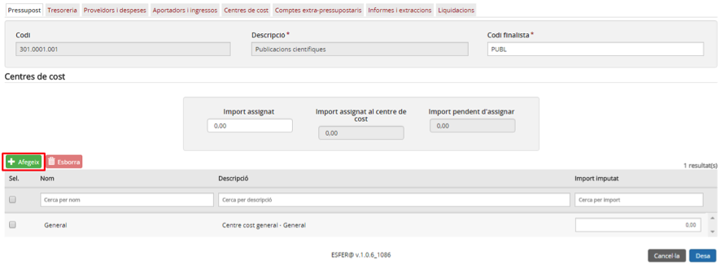

Imatge 13. Afegir centre de cost

* Prémer el botó Afegeix .
* Apareix la pantalla de selecció de centres de cost (*Imatge 14. Pantalla de selecció de centres de cost*).

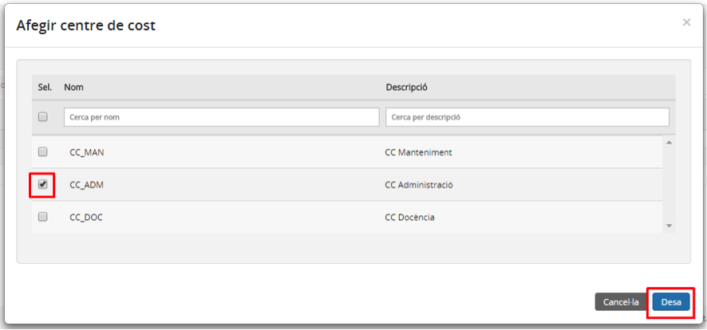

Imatge 14. Pantalla de selecció de centres de cost

* Seleccionar un centre de cost de la llista.
* Prémer el botó *Desa*.

  + Si es prem el botó *Cancel·la* no s’afegeix cap centre de cost.
* Es torna a la pantalla de detall de la partida o subpartida on hi figura el centre de cost afegit (*Imatge 15. Centre de cost afegit*).
* Una vegada afegit el centre de cost, assignar la quantitat a la columna *Import imputat* i actualitzar el camp *Import assignat* de manera que el camp *Import pendent d’assignar* valgui zero (0).
* Prémer el botó Desa  per desar els canvis i tornar a la pantalla de detall del pressupost.

  + Si es prem el botó *Cancel·la*  els canvis no es desen.

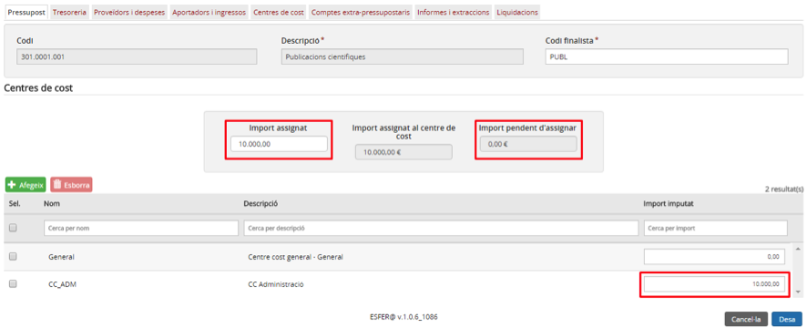

Imatge 15. Centre de cost afegit

---

#### 1.1.2.8.2. Esborrar centre de cost

Només es podrà esborrar un centre de cost de la dotació per centres de cost en el cas que no hi hagi cap operació imputada contra aquella partida o subpartida i centre de cost.

Per esborrar un centre de cost de la dotació per centres de cost cal seguir el següent procediment (*Imatge 16. Esborrar centre de cost*):

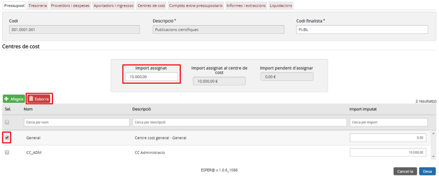

Imatge 16. Esborrar centre de cost

* Seleccionar el centre de cost que es vol esborrar.
* Prémer el botó Esborra. 
* Canviar el valor del camp *Import assignat* de manera que el camp *Import pendent d’assignar* valgui zero (0) (*Imatge 17. Centre de cost esborrat*).

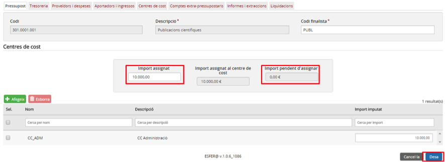

Imatge 17. Centre de cost esborrat

* Prémer el botó *Desa* . El programa demana confirmació, a través d’un quadre de diàleg.

  + Si es prem el botó *Cancel·la*  no es desen els canvis.
* Es torna a la pantalla de detall del pressupost.