# 1.2. Estats

* [1.2.1. Descripció](ap12.md#121-descripcio)
* [1.2.2. Contingut pas a pas](ap12.md#122-contingut-pas-a-pas)

  + [1.2.2.1. Accés](ap12.md#1221-acces)
  + [1.2.2.2. Passar el pressupost a l’estat Provisional](ap12.md#1222-passar-el-pressupost-a-lestat-provisional)
  + [1.2.2.3. Aprovar el pressupost](ap12.md#1223-aprovar-el-pressupost)
  + [1.2.2.4. Passar el pressupost a l’estat Liquidat pendent](ap12.md#1224-passar-el-pressupost-a-lestat-liquidat-pendent)
  + [1.2.2.5. Retornar el pressupost de l’estat Liquidat pendent a l’estat Aprovat](ap12.md#1225-retornar-el-pressupost-de-lestat-liquidat-pendent-a-lestat-aprovat)
  + [1.2.2.6. Passar el pressupost a l’estat Liquidat aprovat](ap12.md#1226-passar-el-pressupost-a-lestat-liquidat-aprovat)
  + [1.2.2.7. Retornar el pressupost de l’estat Liquidat aprovat a l’estat Aprovat](ap12.md#1227-retornar-el-pressupost-de-lestat-liquidat-aprovat-a-lestat-aprovat)

---

## 1.2.1. Descripció

Dins del mòdul de *Gestió econòmica* d’Esfer@ es porta a terme la gestió pressupostària dels centres.

Tot i que els pressupostos tenen una vigència anual, el cicle de vida dels pressupostos s’estén en el temps des de la seva creació abans que s’iniciï l’any fiscal al qual pertany el pressupost fins al seu tancament final quan l’exercici fiscal ja s’ha tancat. Durant aquest cicle de vida, el pressupost passa per diversos estats, cada un dels quals té el seu propòsit, el seu temps de vigència, tots encaminats a facilitar la gestió pressupostària dels centres i la seva supervisió per part del Departament.

El cicle de vida del pressupost és el següent (*Imatge 1. Cicle de vida del pressupost*):

Imatge 1. Cicle de vida del pressupost

A continuació s’enumeren els estats dins el cicle de vida i se’n detallen les principals característiques.

* *En elaboració*. És l’estat inicial de tots els pressupostos quan s’acaben de crear.

  + En aquest estat no es poden enregistrar ni ingressos ni despeses al pressupost.
  + No és obligatori que el pressupost estigui equilibrat.
  + De l’estat *En elaboració* només es pot passar a l’estat *Provisional*.

* *Provisional*:

  + El *pressupost* ha d’estar obligatòriament equilibrat.
  + En aquest estat es poden enregistrar ingressos i despeses.
  + Hi ha una data límit (configurable per l’Administrador) perquè el pressupost estigui en aquest estat. A partir d’aquesta data no es podran enregistrar més moviments fins que el pressupost no passi a l’estat Aprovat.
  + De l’estat *Provisional* només es pot passar a l’estat *Aprovat*.

* *Aprovat*: és l’estat principal del pressupost durant la major part de l’any.

  + El pressupost ha d’estar obligatòriament equilibrat.
  + En aquest estat es poden enregistrar ingressos i despeses.
  + Les modificacions del pressupost en estat Aprovat tenen restriccions. Vegeu l’apartat *1.3 Modificacions del pressupost*.
  + De l’estat *Aprovat* només es pot passar a l’estat *Liquidat pendent*.

* *Liquidat pendent*: s’arriba a aquest estat quan l’any fiscal s’ha tancat (i se n’han liquidat els impostos) i és el primer estat del procés de tancament del pressupost.

  + En aquest estat ja no es poden enregistrar ingressos ni despeses.
  + El pressupost s'envia al Consell Escolar perquè sigui revisat per procedir a la seva liquidació.
  + De l’estat *Liquidat pendent* el pressupost pot passar a dos estats:
  + En cas que el Consell Escolar doni el vistiplau i aprovi el pressupost, passarà a l’estat *Liquidat aprovat*.

    - En cas contrari, tornarà a l’estat *Aprovat* perquè es pugui esmenar. En aquest supòsit, el pressupost haurà de començar un nou cicle d’aprovació.

* *Liquidat aprovat*.

  + Quan el pressupost està en aquest estat ja no és en mans del centre sinó dels serveis territorials.
  + De l’estat *Liquidat aprovat* el pressupost pot passar a dos estats:

    - En cas que els serveis territorials donin el vistiplau i l’aprovin, el pressupost passarà a l’estat *Validat i tancat*.
    - En cas contrari, el pressupost tornarà a l’estat *Aprovat* perquè es pugui esmenar. En aquest supòsit, el pressupost haurà de començar un nou cicle d’aprovació.

* *Validat i tancat*. Aquest és l’estat final del pressupost. Quan el pressupost arriba a aquest estat ja no té cap evolució possible ni cap manera de modificar-lo o esmenar-lo.

A continuació es mostra com els usuaris dels centres (directors i usuaris de la *Gestió econòmica*) poden fer evolucionar el pressupost des de l’estat inicial (*En elaboració*) fins a l’estat *Liquidat aprovat*.

---

## 1.2.2. Contingut pas a pas

### 1.2.2.1 Accés

Des de la pàgina principal d’Esfer@ cal anar al mòdul de *Gestió econòmica*.

Imatge 2. Pantalla inicial d’Esfer@

Una vegada s’accedeix al mòdul de *Gestió econòmica* apareixerà una llista de pressupostos que té el centre amb les columnes següents (*Imatge 3. Llista pressupostos*):

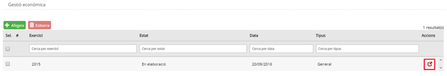

Imatge 3. Llista pressupostos

La informació de les columnes és la següent:

* *Exercici*: exercici fiscal (any) al qual pertany el pressupost.
* *Estat*: estat del pressupost. Per informació detallada sobre els estats del pressupost, consulteu els continguts específics d’*Evolució del pressupost*.
* *Data*: data de l’últim canvi d’estat del pressupost.
* *Tipus*: tipus de pressupost.

  + *General*.
  + *Menjador*.
* *Botó d’acció* : permet accedir al detall del pressupost i permet detallar la dotació.

A la capçalera de les columnes apareix el nom del camp corresponent. A sota, hi ha uns espais per poder aplicar filtres sobre la informació de detall.

Premeu el botó d’acció  per entrar en el detall del pressupost que es vol editar i evolucionar.

---

### 1.2.2.2. Passar el pressupost a l’estat Provisional

Quan s’edita un pressupost en estat *En elaboració (Imatge 4. Pressupost en estat En elaboració)* cal seguir el següent procediment per passar-lo a Provisional:

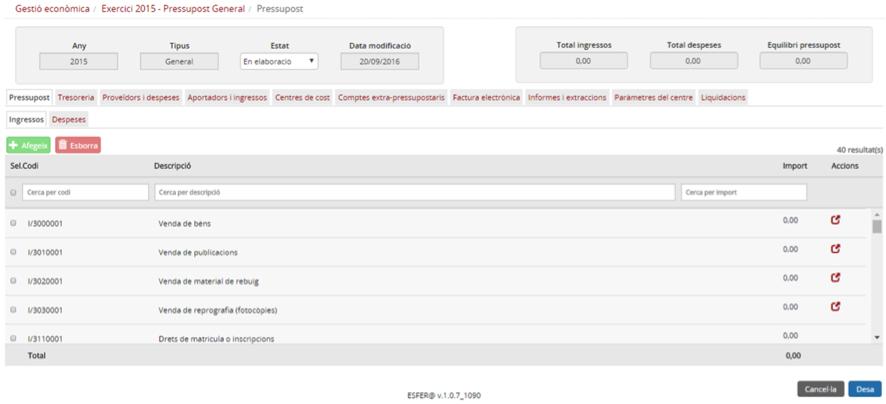

Imatge 4. Pressupost en estat En elaboració

* En el camp *Estat* seleccioneu el valor *Provisional*.
* El pressupost ha d’estat equilibrat (el camp *Equilibri pressupost* ha de valer 0).

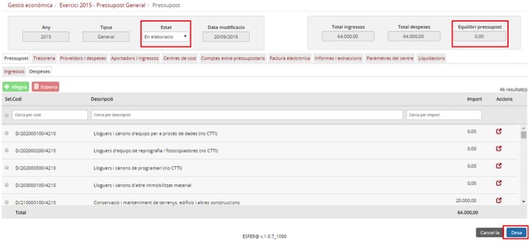

Imatge 5. Passar pressupost a l'estat Provisional

* Premeu el botó *Desa* .

  + Si premeu el botó *Cancel·la*  es torna a la pantalla de la llista de pressupostos (Imatge 3. Llista pressupostos).
* Confirmeu l’operació.
* Es mostra la pantalla de pressupost en estat *Provisional (Imatge 6. Pressupost en estat Provisional)*.

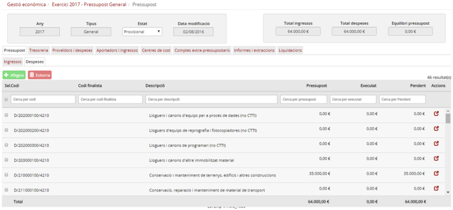

Imatge 6. Pressupost en estat Provisional

---

### 1.2.2.3. Aprovar el pressupost

Quan s’edita un pressupost en estat *Provisional (Imatge 6. Pressupost en estat Provisional)* cal seguir el procediment següent per passar-lo a *Aprovat (Imatge 7. Aprovar el pressupost)*:

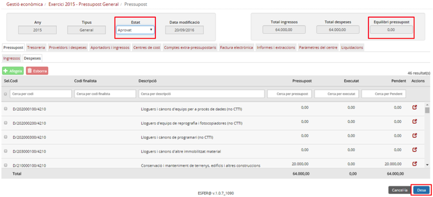

Imatge 7. Aprovar el pressupost

* En el camp *Estat* seleccioneu el valor *Aprovat*.
* El pressupost ha d’estat equilibrat (el camp *Equilibri pressupost* ha de valer 0).
* Premeu el botó *Desa* .

  + Si premeu el botó *Cancel·la*  es torna a la pantalla de la llista de pressupostos (*Imatge 3. Llista pressupostos*).
* Confirmar l’operació.
* Es mostra la pantalla de pressupost en estat *Aprovat (Imatge 8. Pressupost en estat Aprovat)*.

Imatge 8. Pressupost en estat Aprovat

Sobre el pressupost en estat *Aprovat* no es poden fer modificacions que canviïn l’import total d’alguna de les partides. Per poder fer aquesta mena de modificacions cal prémer el botó *Modifica* . Podeu trobar la informació específica sobre les modificacions del pressupost a l’apartat *1.3 Modificacions del pressupost*.

---

### 1.2.2.4. Passar el pressupost a l’estat Liquidat pendent

El pas del pressupost de l’estat *Aprovat* a l’estat *Liquidat* pendent és el canvi d’estat més important de tot el cicle de vida del pressupost. Com a part d’aquest pas també es fa:

* Traspàs de fons: serveix per traspassar saldo dels comptes extrapressupostaris al compte de romanent (que s’acabarà traspassant al romanent del pressupost de l’any següent en el moment que el pressupost passi a l’estat *Validat i tancat*).
* Tancament del saldo de reserva: deixar el saldo de reserva a zero (0) i tornar l’import a les partides de despesa del pressupost.

A part d’aquestes accions, per passar el pressupost a l’estat *Liquidat* pendent també és obligatori:

* El pressupost està equilibrat.
* El romanent té un import positiu.
* Els saldos de tots el comptes bancaris són positius.

Quan s’edita un pressupost en estat *Aprovat (Imatge 8. Pressupost en estat Aprovat)* cal seguir el següent procediment per passar-lo a estat *Liquidat pendent (Imatge 9. Passar el pressupost a l'estat Liquidat pendent)*:

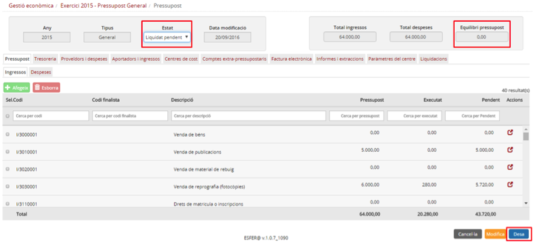

Imatge 9. Passar el pressupost a l'estat Liquidat pendent

* En el camp *Estat* seleccioneu el valor *Liquidat pendent*.
* El pressupost ha d’estar equilibrat (el camp *Equilibri pressupost* ha de valer 0).
* Premeu el botó *Desa* .

  + Si premeu el botó *Cancel·la*  es torna a la pantalla de la llista de pressupostos (*Imatge 3. Llista pressupostos*).
* Confirmar l’operació.
* S’inicia el procés de passar el pressupost a l’estat *Liquidat pendent*:

  + Es valida que s’hagin fet totes les liquidacions trimestrals d’IVA i IRPF. En cas que no s’hagin fet totes les liquidacions no es podrà continuar el procés i es tornarà a la pantalla del pressupost en estat aprovat (*Imatge 9. Passar el pressupost a l'estat Liquidat pendent*).
  + Es mostra la pantalla de *Traspàs de fons (Imatge 10. Pantalla de traspàs de fons)*.

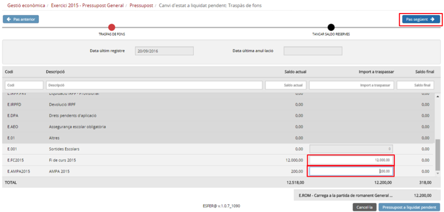

Imatge 10. Pantalla de traspàs de fons

* Es mostra una llista de tots els comptes extrapressupostaris.

  + Comptes genèrics. Estan en gris i no es poden editar.
  + Comptes no genèrics. Estan en blanc i es poden editar.
* Per cada un dels comptes no genèrics, introduïu la quantitat que es vol passar al romanent.

  + L’import no pot ser superior al saldo del compte extrapressupostari.

* Premeu el botó *Pas següent* .
* Es mostra la pantalla de tancament del saldo de reserves *(Imatge 11. Pantalla de tancament del saldo de reserves)*.

  + Es mostra un llistat amb totes les reserves del pressupost.

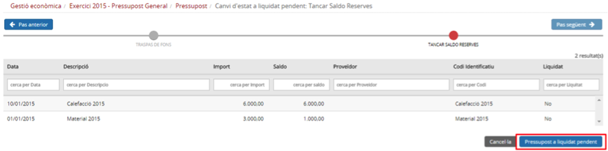

Imatge 11. Pantalla de tancament del saldo de reserves

* Si premeu el botó *Pas anterior*  es torna a la pantalla de Traspàs de fons (*Imatge 10. Pantalla de traspàs de fons*).
* Premeu el botó *Pressupost a liquidat pendent* .

  + Si premeu el botó *Cancel·la*  es torna a la pantalla de pressupost en estat aprovat (*Imatge 9. Passar el pressupost a l'estat Liquidat pendent*).
* Es mostra la pantalla del pressupost en estat liquidat pendent (*Imatge 12. Pantalla de pressupost en estat liquidat pendent*).

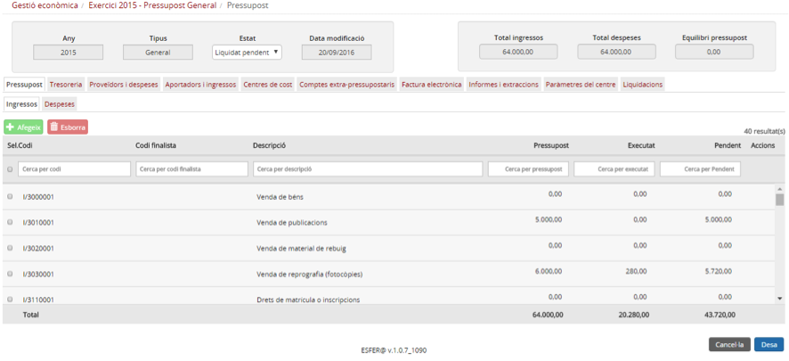

Imatge 12. Pantalla de pressupost en estat liquidat pendent

---

### 1.2.2.5. Retornar el pressupost de l’estat Liquidat pendent a l’estat Aprovat

En cas que el Consell Escolar no aprovi el pressupost, s’haurà de retornar a l’estat *Aprovat* per poder modificar-lo i sotmetre’l de nou al procés d’aprovació.

Quan s’edita un pressupost en estat *Liquidat Pendent (Imatge 12. Pantalla de pressupost en estat liquidat pendent)*, cal seguir el següent procediment per passar-lo a estat *Aprovat (Imatge 13. Passar pressupost de l'estat Liquidat pendent a l'estat Aprovat)*:

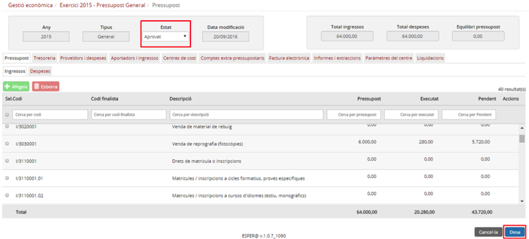

Imatge 13. Passar pressupost de l'estat Liquidat pendent a l'estat Aprovat

* En el camp *Estat* seleccionar el valor *Aprovat*.
* El pressupost ha d’estat equilibrat (el camp *Equilibri pressupost* ha de valer 0).
* Premeu el botó *Desa* .

  + Si premeu el botó *Cancel·la*  es torna a la pantalla de la llista de pressupostos (*Imatge 3. Llista pressupostos*).
* Confirmeu l’operació.

---

### 1.2.2.6. Passar el pressupost a l’estat Liquidat aprovat

En cas que el Consell Escolar aprovi el pressupost, es passa a l’estat *Liquidat aprovat*. En el moment que es passa el pressupost a l’estat Liquidat aprovat passa a mans de l’administrador d’àmbit per a la seva aprovació final i el centre ja no hi pot fer cap més canvi o edició.

Quan s’edita un pressupost en estat *Liquidat pendent (Imatge 12. Pantalla de pressupost en estat liquidat pendent)* cal seguir el següent procediment per passar-lo a l’estat *Liquidat aprovat (Imatge 14. Passar el pressupost de l'estat Liquidat pendent a l'estat Liquidat aprovat)*:

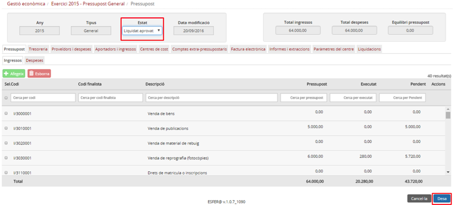

Imatge 14. Passar el pressupost de l'estat Liquidat pendent a l'estat Liquidat aprovat

* En el camp *Estat* seleccioneu el valor *Liquidat aprovat*.
* El pressupost ha d’estat equilibrat (el camp *Equilibri pressupost* ha de valer 0).
* Premeu el botó *Desa* .

  + Si premeu el botó *Cancel·la*  es torna a la pantalla de llistat de pressupostos (*Imatge 3. Llista pressupostos*).
* Confirmeu l’operació.
* Es mostra la pantalla de pressupost en estat *Liquidat aprovat (Imatge 15. Pantalla de pressupost en estat Liquidat aprovat)*.

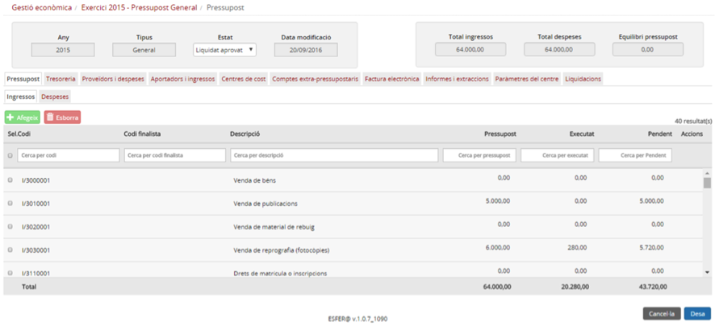

Imatge 15. Pantalla de pressupost en estat Liquidat aprovat

---

### 1.2.2.7. Retornar el pressupost de l’estat Liquidat aprovat a l’estat Aprovat

En el cas que l’Administrador d’àmbit rebutgi el pressupost, el director l’haurà de retornar a l’estat *Aprovat* per poder-lo modificar i tornar a iniciar el procés d’aprovació.

Quan s’edita un pressupost en estat *Liquidat aprovat (Imatge 15. Pantalla de pressupost en estat Liquidat aprovat)* cal seguir el següent procediment per passar-lo a estat *Aprovat (Imatge 16. Passar el pressupost de l'estat Liquidat aprovat a l'estat aprovat)*:

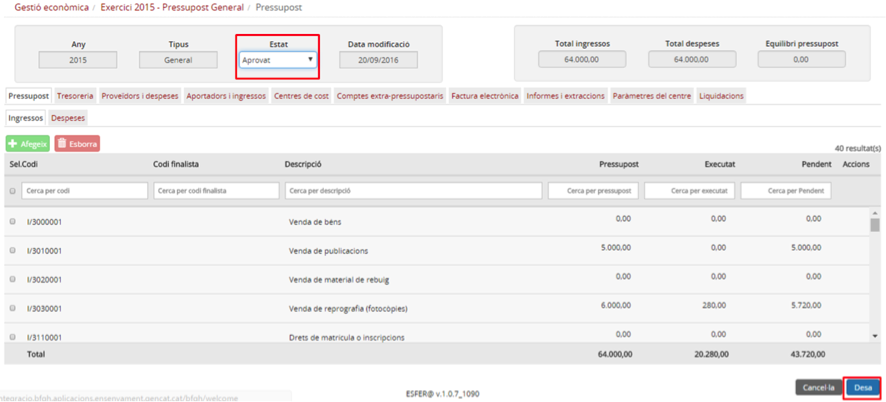

Imatge 16. Passar el pressupost de l'estat Liquidat aprovat a l'estat Aprovat

* En el camp *Estat* seleccioneu el valor *Aprovat*.
* El pressupost ha d’estat equilibrat (el camp *Equilibri* pressupost ha de valer 0).
* Premeu el botó *Desa* .

  + Si premeu el botó *Cancel·la*  es torna a la pantalla de la llista de pressupostos (*Imatge 3. Llista pressupostos*).
* Confirmeu l’operació.
* Es mostra la pantalla del pressupost en estat aprovat (*Imatge 17. Pantalla de pressupost en estat aprovat*).
* El pressupost resta a l’espera que l’administrador el passi a l’estat *Liquidat i tancat*.

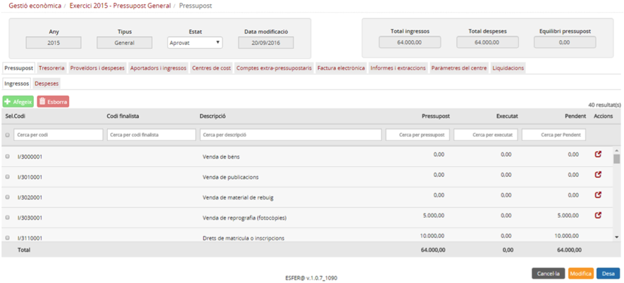

Imatge 17. Pantalla de pressupost en estat Aprovat