# 1.3. Modificació del pressupost

* [1.3.1. Descripció](ap13.md#131-descripció)
* [1.3.2. Contingut pas a pas](ap13.md#132-contingut-pas-a-pas)

  + [1.3.2.1. Accés](ap13.md#1321-accés)
  + [1.3.2.2. Modificar l’assignació a subpartides del pressupost](ap13.md#1322-modificar-lassignació-a-subpartides-del-pressupost)
  + [1.3.2.3. Modificar el pressupost](ap13.md#1323-modificar-el-pressupost)

---

## 1.3.1. Descripció

Durant el cicle de vida del pressupost, les accions que l’usuari pot fer per modificar-lo tenen certes restriccions depenent de l’estat en què es trobi el pressupost.

Mentre el pressupost està en estat *En elaboració* hi ha molt poques restriccions, ja que ni tan sols cal que el pressupost estigui equilibrat. Aquest tipus de modificació està cobert pel contingut *1.1 Dotació*.

Quan el pressupost està en estat *Provisional*, s’hi pot fer qualsevol modificació amb l’única condició que aquest quedi equilibrat una vegada que s’hagi acabat la modificació. Aquest tipus de modificació està cobert pel contingut *1.1 Dotació*.

Quan el pressupost està en estat *Aprovat*, només es poden fer modificacions que no afectin l’import total de qualsevol partida (modificar l’assignació de les subpartides del pressupost). En cas que sigui necessari modificar els imports de les partides, caldrà iniciar un procés de modificació que ha de ser aprovat pel mateix director amb el vistiplau del Consell Escolar.

En aquest contingut es fa una descripció de com fer les modificacions del pressupost.

---

## 1.3.2. Contingut pas a pas

### 1.3.2.1 Accés

Des de la pàgina principal d’Esfer@ cal anar al mòdul de *Gestió Econòmica*.

Imatge 1. Pantalla inicial d’Esfer@

Una vegada s’accedeix al mòdul de *Gestió Econòmica* apareixerà una llista de pressupostos que té el centre (*Imatge 2. Llista pressupostos*).

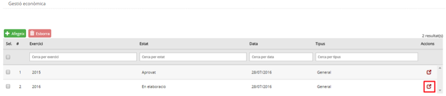

Imatge 2. Llista pressupostos

La informació de les columnes de la pantalla és la següent:

* *Exercici*: exercici fiscal (any) al qual pertany el pressupost.
* *Estat*: estat en el qual es troba el pressupost. Per a informació detallada sobre els estats del pressupost, consulteu els continguts específics *d’Estats del pressupost*.
* *Data*: data de l’últim canvi d’estat del pressupost.
* *Tipus*: tipus de pressupost.

  + *General*
  + *Menjador*
* *Botó d’acció* : permet accedir al detall del pressupost i permet detallar la dotació.
* A la part esquerra de la fila apareix un quadret que permet seleccionar la fila i fer algunes accions, que es veuran més endavant.

A la capçalera de les columnes apareix el nom del camp corresponent. A sota, hi ha uns espais per poder aplicar filtres sobre la informació de detall.

Premeu el botó d’acció  per entrar en el detall del pressupost que es vol editar i modificar (*Imatge 3. Pantalla de detall del pressupost*).

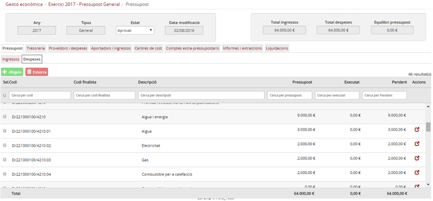

Imatge 3. Pantalla de detall del pressupost

---

### 1.3.2.2 Modificar l’assignació a subpartides del pressupost

Quan cal modificar l’assignació de subpartides del pressupost, però sense que canviï l’import total de la partida a la qual pertanyen, no és necessari iniciar un procés de modificació del pressupost; es pot modificar l’assignació a les subpartides del pressupost directament.

Per modificar l’assignació a subpartides del pressupost cal seguir el procediment següent:

* Des de la pantalla de detall del pressupost (*Imatge 4. Modificar assignació subpartides del pressupost*), premeu el botó d’acció  per accedir a la dotació de la subpartida que voleu canviar.

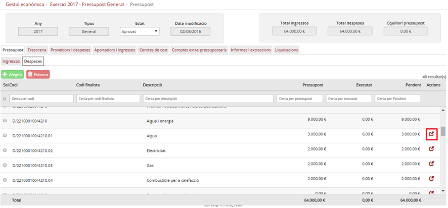

Imatge 4. Modificar assignació subpartides del pressupost

* En aquest moment, des de la pantalla de dotació de la subpartida (*Imatge 5. Modificar dotació subpartida*) podeu canviar els camps *Import assignat* i *Import imputat*.

  + Un cop editats, el camp *Import pendent d’assignar* ha de valer zero (0).

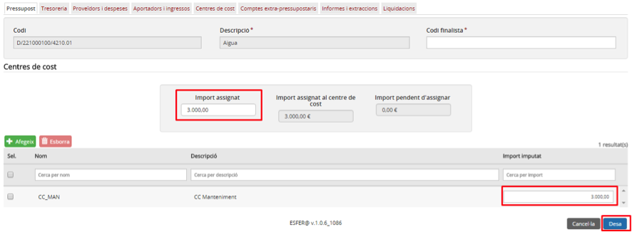

Imatge 5. Modificar dotació subpartida

* Premeu el botó *Desa* .

  + Si premeu el botó *Cancel·la* , no es desen els canvis i el programa torna a la mateixa pantalla de detall del pressupost.
* En cas que l’import assignat hagi estat modificat:

  + Si la partida només té una subpartida, no es permet fer la modificació. Per fer la modificació en aquest cas, cal fer una modificació del pressupost tal com es descriu en l’apartat *Modificar el pressupost* d’aquest mateix contingut.
  + Si la partida té diverses subpartides, es mostra la pantalla de balanceig de subpartides (*Imatge 6. Pantalla de balanceig de subpartides*) per tal de poder repartir la diferència entre la resta de les partide\s.

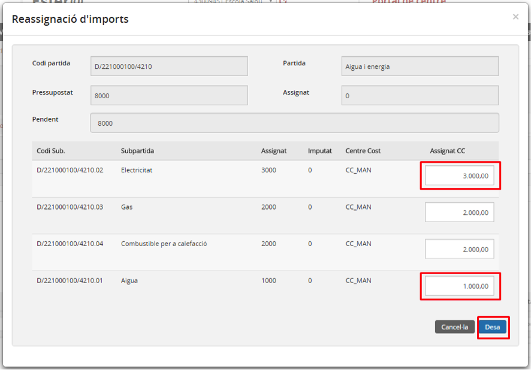

Imatge 6. Pantalla de balanceig de subpartides

* Modifiqueu la columna *Assignat CC* de les diferents partides per equilibrar les quantitats que s’hi han assignat.
* Premeu el botó *Desa* .

  + Si premeu el botó *Cancel·la* , es torna a la pantalla de dotació de la subpartida (*Imatge 5. Modificar dotació subpartida*).
* En cas que la suma de totes les subpartides coincideixi amb el total de la partida mare, es desen els canvis.
* Es torna a la pantalla de detall del pressupost on els imports de les subpartides ja apareixen modificats (*Imatge 7. Subpartides re-assignades*).

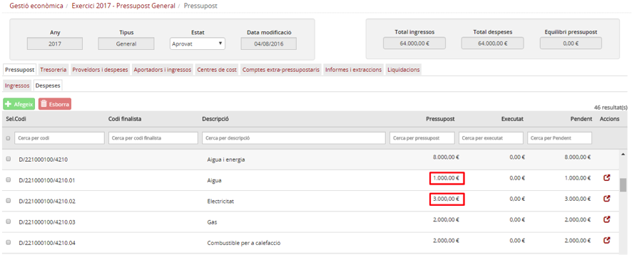

Imatge 7. Subpartides re-assignades

---

### 1.3.2.3. Modificar el pressupost

En cas que el pressupost estigui en estat *Aprovat* les modificacions que afectin l’import total de les partides requereixen d’un procés de modificació que inicia el **director del centre** i que ha de ser aprovat pel mateix director, prèvia consulta al Consell Escolar.

El director inicia el procés de modificació i, una vegada realitzat, imprimeix un informe de modificació que ha de remetre al Consell Escolar perquè l’aprovi.

* En cas que els canvis siguin aprovats, el director podrà confirmar els canvis en el pressupost.
* En cas que els canvis siguin rebutjats, el director haurà d’anul·lar els canvis i el pressupost tornarà al seu estat anterior.

En el període de temps que passa entre que el director sol·licita els canvis i que els canvis són acceptats (o rebutjats), el pressupost està bloquejat i no s’hi pot fer cap altra modificació fins que la modificació que està en curs hagi estat acceptada o rebutjada. Tampoc pot evolucionar cap a l’estat *Liquidat pendent*.

Fins que les modificacions no hagin estat acceptades o anul·lades, qualsevol imputació d’ingrés o despesa estarà restringida per a les partides que hagin estat modificades: es validarà el valor màxim de la imputació contra el mínim dels dos valors, l’original i el modificat.

Per fer les modificacions del pressupost s’ha de seguir el procediment següent:

* Des de la pantalla de la *Imatge 2.Llista de pressupostos*, seleccioneu, per modificar-lo, un pressupost que estigui en estat *Aprovat*.
* Un cop dins la pantalla de detall del pressupost en estat Aprovat (*Imatge 8. Iniciar la modificació del pressupost*), premeu el botó *Modifica* .

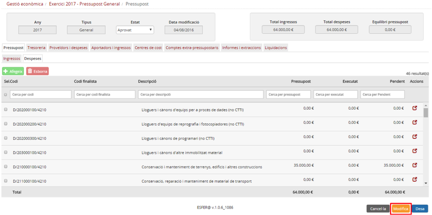

Imatge 8. Iniciar la modificació del pressupost

* El pressupost segueix en estat aprovat però entra en el cicle de modificació (*Imatge 9. Pressupost en cicle de modificació*). Això es detecta perquè el botó de color taronja ha canviat. Inicialment era *Modifica* , i ara és *Tramitar* . A partir d’aquest moment, es poden fer canvis en la dotació de les partides que en canviïn l’import total assignat. El procediment per modificar la dotació de les partides i subpartides és el mateix que el de l’apartat *1.1 Dotació*. L’única restricció que cal tenir en compte durant aquest procés de dotació és que no es poden esborrar centres de cost.

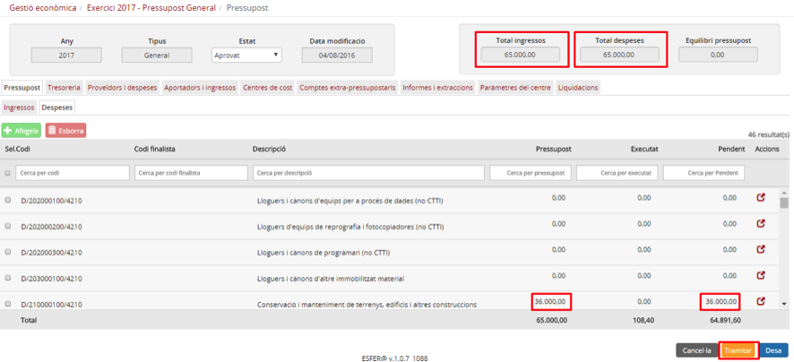

Imatge 9. Pressupost en cicle de modificació

* Una vegada que s’han fet els canvis en la dotació, premeu el botó Tramitar .

  + Confirmeu l’operació.
* Si premeu el botó *Cancel·la* , es torna a la pantalla de llista de pressupostos del centre.
* A partir d’aquest moment, el pressupost està en estat *Aprovat* però amb modificacions pendents. Per aquest motiu no es pot fer cap canvi de dotació fins que no s’acceptin o es rebutgin els canvis. Mentrestant, a la pantalla del pressupost apareixen dos botons per poder fer l’opció que correspongui: anul·lar o acceptar les modificacions, tal com es veu a la *Imatge 10. Pressupost amb modificacions pendents*.

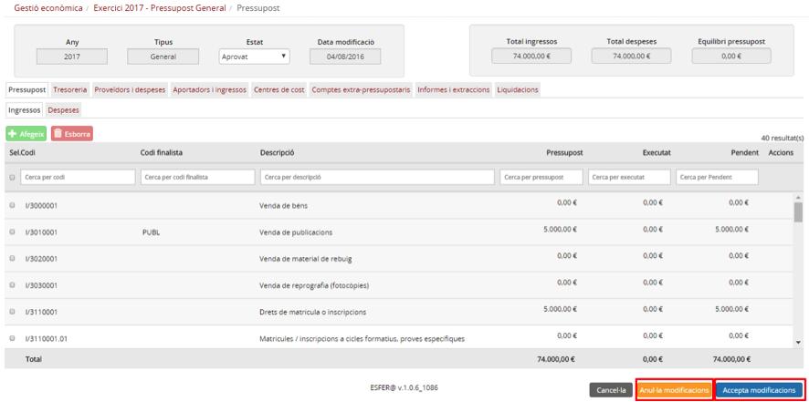

Imatge 10. Pressupost amb modificacions pendents

* En aquest moment s’ha d’imprimir l’informe de modificacions del pressupost per tal que el revisi el Consell Escolar. Per fer-ho, s’ha d’accedir al menú Informes i extraccions.

  + Seleccioneu la pestanya Informes i extraccions (*Imatge 11. Extracció modificacions pressupost*).
  + Seleccioneu l’opció de *Consulta de les modificacions del pressupost*.

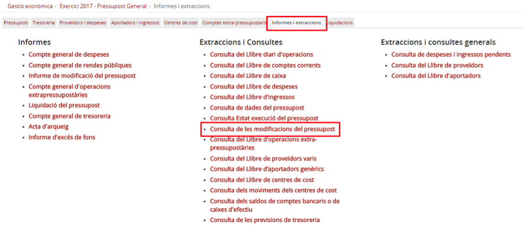

Imatge 11. Extracció modificacions pressupost

* Es mostrarà la consulta de modificacions del pressupost.

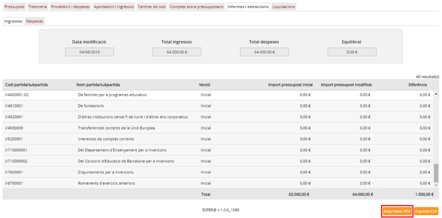

Imatge 12. Imprimir consulta de modificacions del pressupost

* Premeu el botó *Imprimeix PDF* .
* Porteu l’informe al Consell Escolar sol·licitant l’aprovació de les modificacions.

* Una vegada que obtingueu la resposta per part de l’administrador, torneu a la pantalla de detall de pressupost en estat Aprovat però amb modificacions pendents (*Imatge 10. Pressupost amb modificacions pendents*).

  + Si el Consell Escolar dóna el vistiplau als canvis, el director prem el botó *Accepta modificacions* . Les modificacions es desen i s’eliminen les restriccions en la imputació de despeses i ingressos.
  + Si el Consell Escolar no dóna el vistiplau als canvis, el director prem el botó *Anul·la modificacions* . Les modificacions es desfan, es torna a l’estat anterior del pressupost i s’eliminen les restriccions en la imputació de despeses i ingressos.

* En qualsevol dels dos casos el programa torna a la pantalla de detall del pressupost en estat Aprovat (*Imatge 13. Pressupost en estat aprovat*).

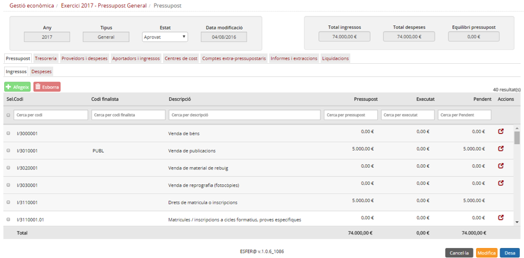

Imatge 13. Pressupost en estat aprovat