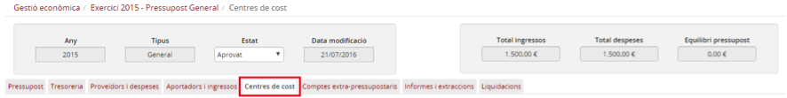
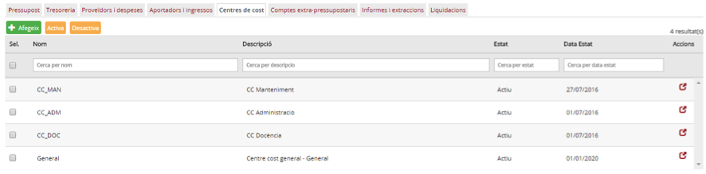
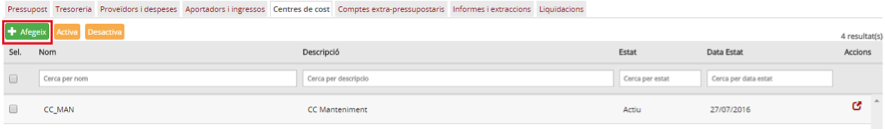
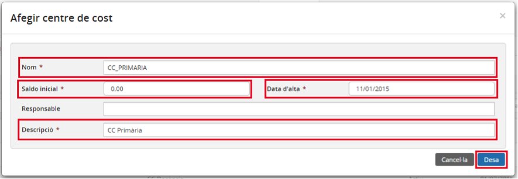
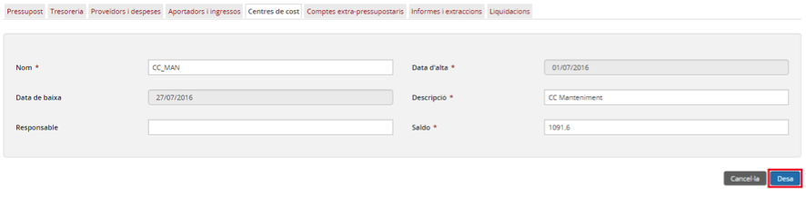
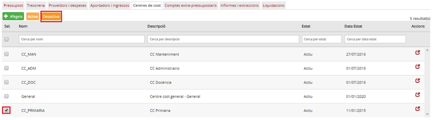
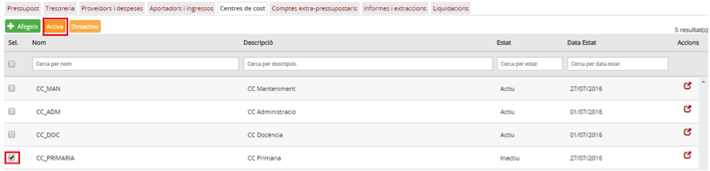

## 1.4. Gestió de centres de cost

* [1.4.1. Descripció](ap14.md#141-descripció)
* [1.4.2. Contingut pas a pas](ap14.md#142-contingut-pas-a-pas)

  + [1.4.2.1. Accés](ap14.md#1421-accés)
  + [1.4.2.2. Llista dels centres de cost](ap14.md#1422-llista-dels-centres-de-cost)
  + [1.4.2.3. Operacions amb centres de cost](ap14.md#1423-operacions-amb-centres-de-cost)
  + [1.4.2.4. Donar d’alta un centre de cost](ap14.md#1424-donar-dalta-un-centre-de-cost)
  + [1.4.2.5. Modificar dades d’un centre de cost](ap14.md#1425-modificar-dades-dun-centre-de-cost)
  + [1.4.2.6. Desactivar un centre de cost](ap14.md#1426-desactivar-un-centre-de-cost)
  + [1.4.2.7. Activar un centre de cost](ap14.md#1427-activar-un-centre-de-cost)

---

## 1.4.1. Descripció

Entenem per centre de cost una unitat del centre que té assignada i gestiona el seu propi pressupost, en funció dels objectius que pretén assolir.

Exemples més comuns de centre de cost: una activitat concreta (sortides), un projecte (Erasmus), un departament didàctic qualsevol, un espai del centre (biblioteca, gimnàs, etc.).

Els centres de cost permeten als centres tenir una categorització dels ingressos i les despeses. A part de la imputació pressupostària a partides, els centres de cost permeten portar un control detallat i agrupat d’ingressos i despeses de diferents partides.

Un centre pot treballar amb centres de cost o sense. Aquesta opció es pot canviar des de les opcions de configuració del centre.

En cas que un centre s’hagi configurat per treballar sense centres de cost, les diferències de comportament del sistema seran mínimes (respecte als que sí treballen amb centres de cost): aquests centres empraran un sol centre de cost (centre de cost general) ja definit per defecte en el sistema.

La gestió dels centres de cost és pròpia del centre i, per tant, se’n fa càrrec el director del centre. És el director qui decideix si es treballa sense centres de cost o amb centres de cost i, en aquest últim cas, quins són els centres de cost que es gestionen. Quant als centres de cost, no hi ha cap estructura base o referència imposada per l’administrador.

---

## 1.4.1. Contingut pas a pas

### 1.4.2.1. Accés

L’operativa per accedir als centres de cost és la següent: des de la pàgina principal d’Esfer@ cal anar al mòdul de Gestió econòmica.

Imatge 1. Pantalla inicial d’Esfer@

Una vegada s’hagi accedit al mòdul de *Gestió econòmica* apareix a sota un nou menú amb les opcions de Gestió econòmica. Cal triar la pestanya Centres de cost (*Imatge 2. Pestanyes del director del centre*). Apareixen tots els centres de cost del centre, tant el centre de cost general com els que hagi donat d’alta el mateix centre.

Imatge 2. Pestanyes del director del centre

---

### 1.4.2.2. Llista dels centres de cost

Es visualitza la relació de centres de cost (*Imatge 4. Afegir un centre de cost*)

Imatge 3. Llista de centres de cost

Es mostren tot un seguit de files, amb la informació següent:

* *Nom*: nom (codi) del centre de cost.
* *Descripció*: nom descriptiu del centre de cost.
* *Estat*: identifica si el centre de cost està actiu o inactiu.
* *Data estat*: última data en què el centre de cost s’ha activat o desactivat.

A la capçalera de les pantalles de detall apareix el nom del camp. A sota, hi ha uns espais per poder aplicar filtres sobre la informació de detall.

Des d’aquesta pantalla es pot fer el manteniment dels centres de cost (alta, baixa i modificació), segons s’explica en els apartats següents.

---

### 1.4.2.3. Operacions amb centres de cost

La gestió dels centres de cost permet a l’usuari definir l’estructura de centres de cost que permetrà al centre poder gestionar i categoritzar els ingressos i les despeses.

Les principals operacions que es poden fer són les següents:

* Donar d’alta un centre de cost: permet donar d’alta un nou centre de cost.
* Modificar un centre de cost: permet modificar les dades d’un centre de cost existent.
* Desactivar un centre de cost: com els centres de cost formen part dels moviments comptables, no es poden esborrar. Tanmateix es poden desactivar perquè no apareguin disponibles en el moment de fer la dotació de les partides del pressupost.
* Activar un centre de cost: en cas que es vulgui tornar a fer servir un centre de cost que hagi estat desactivat, en comptes de crear-lo de nou, n’hi ha prou amb tornar-lo a activar. D’aquesta manera, el centre de cost tornarà a aparèixer en el moment de fer la dotació de les partides del pressupost.

---

### 1.4.2.4. Donar d’alta un centre de cost

Per crear un nou centre de cost, des de la pantalla de la llista de centres de cost que s’ha mostrat a la imatge 3, cal seguir el procediment següent:

* Premeu el botó Afegeix  (*Imatge 4. Afegir un centre de cost*).

Imatge 4. Afegir un centre de cost

* Es mostra la pantalla per afegir el nou compte (*Imatge 5. Pantalla nou centre de cost*).

Imatge 5. Pantalla nou centre de cost

* Omplir els camps obligatoris (que porten asterisc):

  + *Nom*: nom (codi) del centre de cost. Valor alfanumèric que ha de ser únic (no hi pot haver cap altre centre de cost amb el mateix nom).
  + *Saldo inicial*: saldo inicial del centre de cost. Per defecte, zero (0).
  + *Data d’alta*: data en què es dóna d’alta el centre de cost. Per defecte, la data actual.
  + *Descripció*: nom descriptiu del centre de cost.

* Premeu el botó *Desa* : es desa el nou centre de cost i es torna a la pantalla de centres de cost (Imatge 3. Llista de centres de cost) on ja apareix el nou centre de cost acabat de crear.
* Si premeu el botó *Cancel·la* , no es desen els canvis.

---

### 1.4.2.5. Modificar dades d’un centre de cost

Per modificar un centre de cost cal seguir el procediment següent:

* Entreu a la pantalla de centres de cost (*Imatge 3. Llista de centres de cost*)
* Premeu el botó d’acció  del centre de cost que es vol modificar.
* Es mostra la pantalla d’edició del centre de cost (*Imatge 6. Modificar dades d'un centre de cost*).

Imatge 6. Modificar dades d'un centre de cost

* Modifiqueu els camps editables amb els nous valors.
* Premeu el botó Desa .
* Si premeu el botó Cancel·la , no s’apliquen els canvis.

---

### 1.4.2.6. Desactivar un centre de cost

Per poder desactivar un centre de cost, es validarà que el centre de cost no tingui imputacions ni moviments de l’exercici en curs assignats.

Per desactivar un centre de cost cal seguir el procediment següent:

Imatge 7. Desactivar centre de cost

* Des de la pantalla de llista de centres de cost, seleccioneu el centre de cost que voleu desactivar (*Imatge 7. Desactivar centre de cost*). En cas que el centre de cost estigui actiu, habiliteu el botó Desactiva.
* Premeu el botó *Desactiva* .
* El centre de cost passa a estar inactiu.

---

### 1.4.2.7. Activar un centre de cost

Per activar un centre de cost cal seguir el procediment següent:

* Des de la pantalla de llista de centres de cost, seleccioneu el centre de cost que voleu activar (*Imatge 8. Activar un centre de cost*). En cas que el centre de cost estigui inactiu, el programa habilita el botó *Activa*.

Imatge 8. Activar un centre de cost

* Premeu el botó *Activa* .
* El centre de cost passa a estar actiu.