## 1.5. Gestió de l’estructura base de comptes extrapressupostaris

* [1.5.1. Descripció](ap15.md#151-descripcio)
* [1.5.2. Contingut pas a pas](ap15.md#152-contingut-pas-a-pas)

  + [1.5.2.1. Accés](ap15.md#1521-acces)
  + [1.5.2.2. Llista de comptes extrapressupostaris](ap15.md#1522-llista-de-comptes-extrapressupostaris)
  + [1.5.2.3. Crear un nou compte extrapressupostari](ap15.md#1523-crear-un-nou-compte-extrapressupostari)
  + [1.5.2.4. Crear un nou subcompte extrapressupostari](ap15.md#1524-crear-un-nou-subcompte-extrapressupostari)
  + [1.5.2.5. Modificar dades d’un compte o subcompte extrapressupostari](ap15.md#1525-modificar-dades-dun-compte-o-subcompte-extrapressupostari)
  + [1.5.2.6. Esborrar un compte o subcompte extrapressupostari](ap15.md#1526-esborrar-un-compte-o-subcompte-extrapressupostari)
  + [1.5.2.7. Fer un traspàs entre comptes o subcomptes extrapressupostaris](ap15.md#1527-fer-un-traspas-entre-comptes-o-subcomptes-extrapressupostaris)

---

## 1.5.1. Descripció

En aquest contingut es mostrarà com donar d’alta i gestionar els comptes extrapressupostaris d’un centre educatiu.

Per defecte tots els centres tenen tots els comptes extrapressupostaris que hi hagi definits a l’estructura base de comptes extrapressupostaris. A part d’aquests, els centres poden gestionar els seus propis comptes extrapressupostaris, a través de la funcionalitat de manteniment de comptes extrapressupostaris de l’aplicació de *Gestió econòmica*.

---

## 1.5.2. Contingut pas a pas

### 1.5.2.1. Accés

Des de la pàgina principal d’Esfer@ cal anar al mòdul de Gestió econòmica.

Imatge 1. Pantalla inicial d’Esfer@

Una vegada s’hagi accedit al mòdul de *Gestió econòmica* apareix a sota un nou menú amb les opcions de *Gestió econòmica*. Trieu la pestanya *Comptes extrapressupostaris* i la subpestanya *Comptes*. (*Imatge 2. Pestanyes del director del centre*). Apareixen tots els comptes extrapressupostaris del centre, tant els que s’han generat automàticament a partir de l’estructura base de comptes extrapressupostaris com els que hagi donat d’alta el mateix centre.

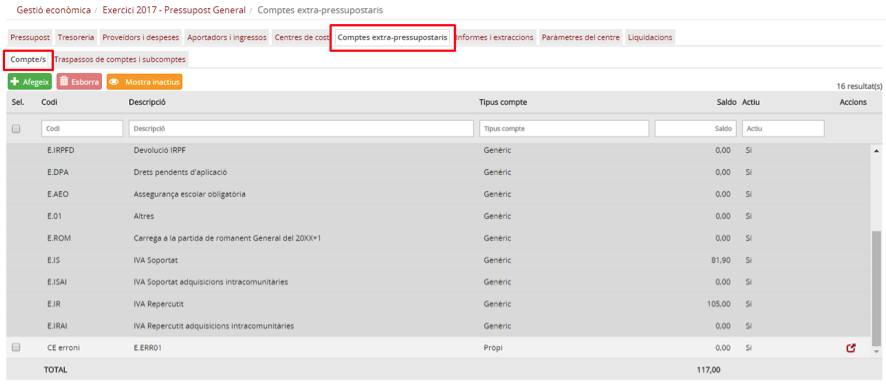

Imatge 2. Pestanyes del director del centre

---

### 1.5.2.2. Llista de comptes extrapressupostaris

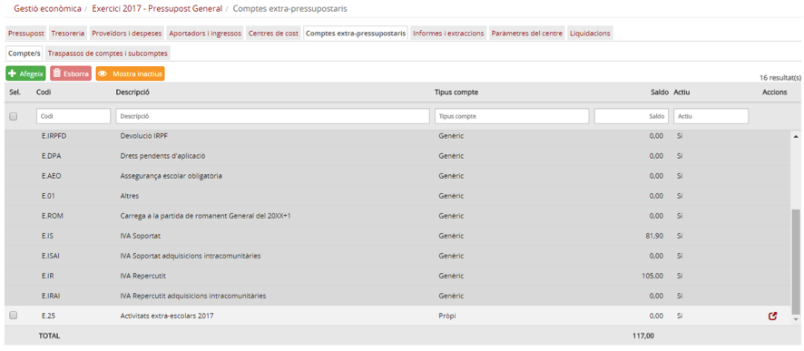

Imatge 3. Dades dels comptes extrapressupostaris

Dins la pantalla es visualitza la llista de comptes extrapressupostaris amb la informació següent, en format de columnes (*Imatge 3. Dades dels comptes extrapressupostaris*):

* *Codi*: codi del compte extrapressupostari.
* *Descripció*: nom descriptiu del compte extrapressupostari.
* *Tipus*: tipus de compte extrapressupostari:

  + *Genèric*: aquests comptes vénen donats pel mateix sistema, no els crea ni l’administrador ni l’usuari del centre, i són els únics comptes comuns en els dos tipus de pressupost (general i menjador). Es tracta d’un tipus de compte imprescindible per al registre de determinades operacions comptables, com per exemple operacions amb IVA transferit o IVA suportat. En general es tracta de comptes vinculats a impostos (IVA, IRPF…). Els comptes genèrics no es poden desactivar ni modificar per part de cap usuari.
  + *Estructura base*: es tracta de comptes extrapressupostaris que han estat creats per l’administrador dins de l’estructura base de comptes extrapressupostaris i que s’ha heretat automàticament als centres. Els comptes provinents de l’estructura base de comptes extrapressupostaris no es poden desactivar ni modificar.
  + *Propi*: compte creat pel mateix centre.
* *Saldo*: saldo del compte extrapressupostari. El saldo inicial de tots els comptes és zero (0) en el moment de crear-los i el seu valor posterior dependrà de les operacions que es facin sobre el compte.
* *Actiu (Sí/No)*: identifica si el compte està actiu i, per tant, si es poden fer moviments contra aquest compte.
* *Quadret de selecció*: apareix a la part esquerra de la fila. Aquest quadret només apareix als comptes de tipus Propi, ja que són els únics modificables per l’usuari.
* *Icona de modificació de la fila*: apareix a la part dreta de la fila, només a les files que siguin modificables (comptes propis).

A la capçalera de les pantalles de detall apareix el nom del camp. A sota, hi ha uns espais per poder aplicar filtres sobre la informació de detall.

Des d’aquesta pantalla es pot fer el manteniment dels comptes i subcomptes extrapressupostaris propis (alta, baixa i modificació), segons s’explica a continuació.

---

### 1.5.2.3. Crear un nou compte extrapressupostari

Per crear un nou compte extrapressupostari cal seguir el procediment següent:

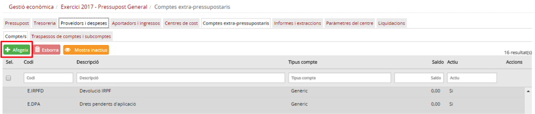

Imatge 4. Crear un nou compte extrapressupostari

* Des de la pantalla de la llista de comptes extrapressupostaris (imatge 3), premeu el botó Afegeix  (*Imatge 4. Crear un nou compte extrapressupostari*).
* A continuació es mostra la pantalla per afegir el nou compte (*Imatge 5. Pantalla nou compte extrapressupostari*).

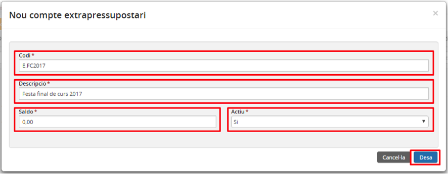

Imatge 5. Pantalla nou compte extrapressupostari

* Ompliu els camps obligatoris (marcats amb asterisc):

  + *Codi*: codi del compte. Valor alfanumèric que ha de ser únic (no hi pot haver cap altre compte amb el mateix codi sigui quin sigui el tipus: *Genèric, Estructura base o Propi*).
  + *Descripció*: nom descriptiu del compte.
  + *Saldo*: saldo inicial del compte. Per defecte és 0. El saldo inicial només es pot introduir i ser diferent de 0 en el primer any de funcionament d’Esfer@, entenent que aquests comptes ja existien i tenien saldo. A partir del segon any, tots els comptes extrapressupostaris que es creïn, tindran saldo inicial 0. Com és que segons la imatge es pot posar un saldo diferent de zero si abans hem dit que sempre era zero? Només es pot indicar que és zero el primer any que el centre comenci a funcionar amb Esfer@, després el saldo sempre vindrà determinat pels ingressos i despeses imputats al compte.
  + *Actiu*: defineix si el compte es crea com a actiu o inactiu. Per defecte, *Sí*.
* Premeu el botó Desa : es desa el nou compte extrapressupostari i es torna a la pantalla de comptes extrapressupostaris on ja apareix el nou compte acabat de crear.
* Si premeu el botó Cancel·la , no es desen els canvis, i es torna igualment a la pantalla de la llista de comptes extrapressupostaris (imatge 3).

---

### 1.5.2.4. Crear un nou subcompte extrapressupostari

Es pot crear un o més **subcomptes** extrapressupostaris sobre un compte extrapressupostari, però només sobre un compte que tingui saldo 0 i no tingui cap operació imputada.

Per crear un nou subcompte extrapressupostari cal seguir el procediment següent (*Imatge 6. Crear un nou subcompte extrapressupostari*):

* Des de la pantalla de llista de comptes extrapressupostaris (imatge 3), seleccioneu un compte existent per al qual voleu crear el subcompte (quadret a l’esquerra de la fila).
* Premeu el botó Afegeix .

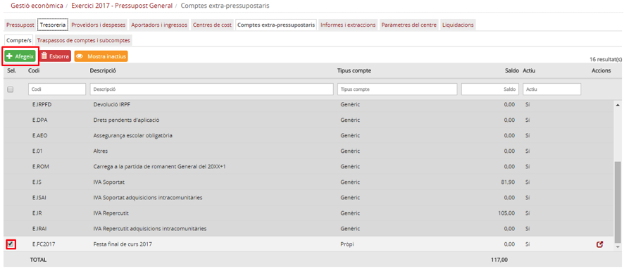

Imatge 6. Crear un nou subcompte extrapressupostari

* Es mostra la pantalla de creació de subcompte extrapressupostari (*Imatge 7. Pantalla de creació de subcompte extrapressupostari*).

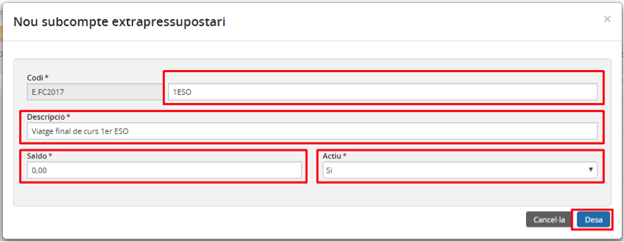

Imatge 7. Pantalla de creació de subcompte extrapressupostari

* Empleneu els camps obligatoris (que porten asterisc):

  + *Codi*: codi específic del subcompte. Valor alfanumèric que ha de ser únic (no hi pot haver cap altre compte o subcompte amb el mateix codi sigui quin sigui el tipus: *Genèric, Estructura base o Propi*).
  + *Descripció*: nom descriptiu del subcompte.

* Premeu el botó *Desa* : es desa el nou subcompte extrapressupostari i es torna a la pantalla de l’estructura base de comptes extrapressupostaris on ja apareix el nou subcompte acabat de crear.

  + *Nota*: només es pot afegir un subcompte sobre un compte que tingui saldo 0 i no tingui cap operació imputada.

* Si premeu el botó *Cancel·la* , no es desen els canvis.

Un cop s’ha creat un subcompte extrapressupostari, es torna a la pantalla de llista de comptes i subcomptes (*Imatge 8. Llista de comptes i subcomptes extrapressupostaris*)

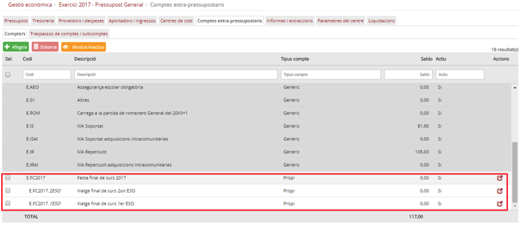

Imatge 8. Llista de comptes i subcomptes extrapressupostaris

Es pot veure la relació de subcomptes per cada compte extrapressupostari (de forma indentada, els subcomptes apareixen en cursiva i una mica més a la dreta). A més, cal remarcar que les línies corresponents a comptes que no són de tipus *Propi* apareixen d’un color més gris, la qual cosa indica que no són modificables.

---

### 1.5.2.5. Modificar dades d’un compte o subcompte extrapressupostari

Només es poden modificar els comptes o subcomptes que siguin de tipus *Propi*. Els comptes o subcomptes de tipus *Genèric* o *Estructura* base no es poden modificar.

En modificar un compte o subcompte extrapressupostari, no només se’n pot canviar el nom sinó que també es podrà *activar* i *desactivar* el compte.

Per modificar un compte o subcompte cal seguir el procediment següent:

* Accediu a la pantalla Comptes extrapressupostaris (*Imatge 3. Dades dels comptes extrapressupostaris*)
* Premeu el botó d’acció  del compte o subcompte que es vol modificar (a la part dreta de la fila corresponent).
* Es mostra la pantalla d’edició de compte o subcompte (*Imatge 9. Modificar compte o subcompte extrapressupostari*).

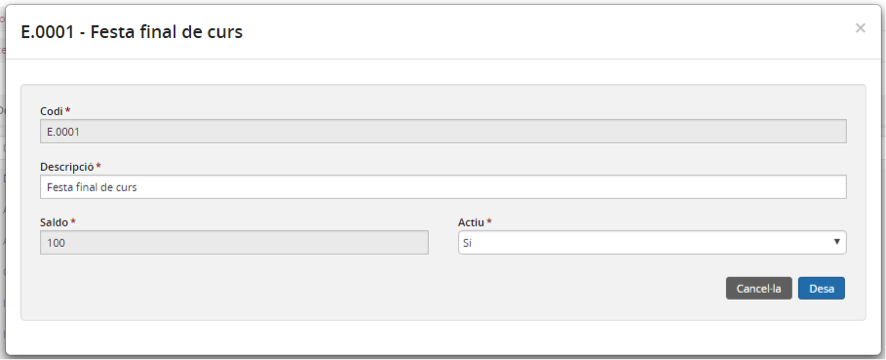

Imatge 9. Modificar compte o subcompte extrapressupostari

* Modifiqueu els camps amb els nous valors. Cal saber que només es poden canviar el camp *Descripció* i l’estat (*Actiu/inactiu*). Només es pot posar en estat Inactiu un compte que tingui saldo 0. En cas contrari, en el moment de prémer el botó *Desa* , es mostrarà un missatge d’error i no es guardaran els canvis.
* Premeu el botó *Desa* . En aquest moment s’apliquen els canvis (si està tot correcte).
* Si premeu el botó *Cancel·la* , no s’apliquen els canvis.

---

### 1.5.2.6. Esborrar un compte o subcompte extrapressupostari

Es poden esborrar comptes o subcomptes extrapressupostaris quan tinguin saldo 0 i a més no tinguin cap operació imputada. Si hi ha saldo 0 però té alguna operació imputada, no es pot esborrar. En aquest cas hi ha l’opció de desactivar (a través de la patalla de modificació del compte o del subcompte extrapressupostari, com s’ha vist en un apartat anterior).

Hi ha l’opció d’esborrar un subcompte o bé un compte. En aquest ultim cas, s’esborrarà tant el compte com els seus subcomptes associats.

Per fer una operació d’esborrar, des de la pantalla de la llista de comptes i subcomptes s’ha de marcar la fila corresponent que es vulgui esborrar, i prémer el botó Esborra  (Imatge 10. Esborrar compte o subcompte extrapressupostari).

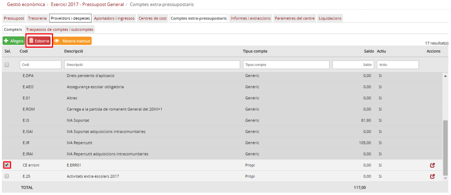

Imatge 10. Esborrar compte o subcompte extrapressupostari

El programa demanarà confirmació a través d’un quadre de diàleg, i si es confirma, s’esborrarà. Si l’operació es fa sobre un compte que té subcomptes associats, s’esborren tant el compte com els subcomptes.

---

### 1.5.2.7. Fer un traspàs entre comptes o subcomptes extrapressupostaris

Es pot fer l’operació de traspassar una quantitat (saldo) entre comptes o subcomptes extrapressupostaris. En el cas de comptes, només es podrà enviar un saldo si aquest compte no té subcomptes associats. Si no, caldrà fer-ho sobre un dels seus subcomptes. A més, quan es fa un traspàs de saldo entre comptes, caldrà que la quantitat a traspassar sigui menor que el saldo actual del compte (o subcompte) origen.

Per fer un traspàs de saldo entre comptes o subcomptes extrapressupostaris cal fer el procediment següent:

* Seleccioneu la pestanya *Comptes extrapressupostaris* i la subpestanya *Traspassos subcomptes* (*Imatge 11. Pantalla de traspassos entre comptes o subcomptes extrapressupostaris*).

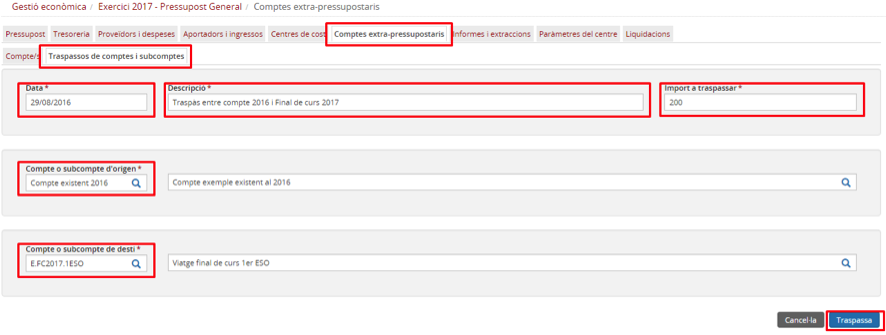

Imatge 10. Esborrar compte o subcompte extrapressupostari

* Introduïu els camps del traspàs:

  + *Data*: data comptable en què es fa el traspàs.
  + *Descripció*: text descriptiu del motiu del traspàs.
  + Import a traspassar: import del traspàs a fer entre els comptes o subcomptes.
  + *Subcompte origen*: compte o subcompte des del qual es farà el traspàs.
  + *Subcompte destí*: compte o subcompte que rebrà el traspàs.
  + En prémer el botó de cerca  es mostra la pantalla de cerca de comptes extrapressupostaris (*Imatge 12. Pantalla de cerca de comptes extrapressupostaris per fer un traspàs*).

    - Es mostra una llista de tots els comptes i subcomptes extrapressupostaris actius del centre. Si un compte té subcomptes, només apareixen els subcomptes, però no el compte arrel.
    - Seleccioneu el compte o subcompte.
    - Premeu el botó *Desa* . Queda seleccionat el compte o subcompte que s’ha marcat.
    - Si premeu el botó *Cancel·la* , no se selecciona cap compte.

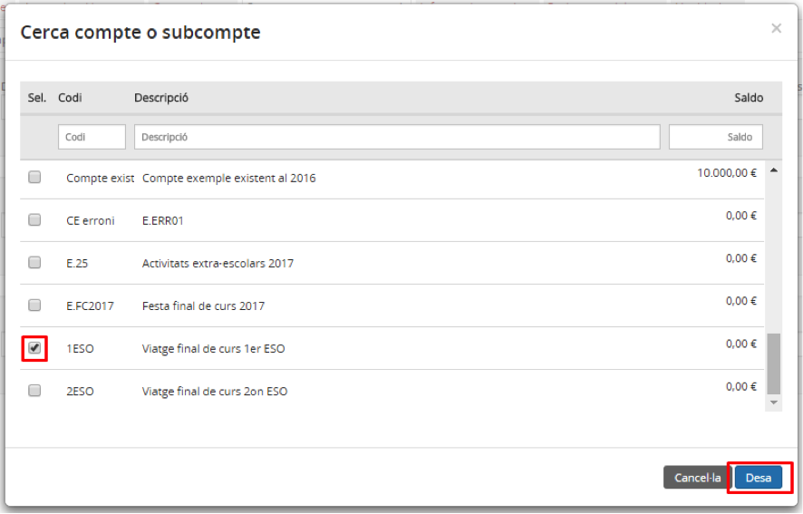

Imatge 12. Pantalla de cerca de comptes extrapressupostaris per fer un traspàs

Un cop s’han omplert les dades a la pantalla de traspàs, es poden fer dues accions:

* Prémer el botó *Traspassa* . Si no hi ha cap errada o incongruència (en dates o saldos) es guarden els canvis. Si hi ha alguna errada, el programa torna a la mateixa pantalla amb el missatge d’errada, per fer les correccions corresponents. Si es prem el botó *Cancel·la* , no s’apliquen els canvis.

* Es torna a la pantalla de llista de comptes extrapressupostaris on ja es mostren els saldos modificats (*Imatge 13. Traspàs efectuat*).

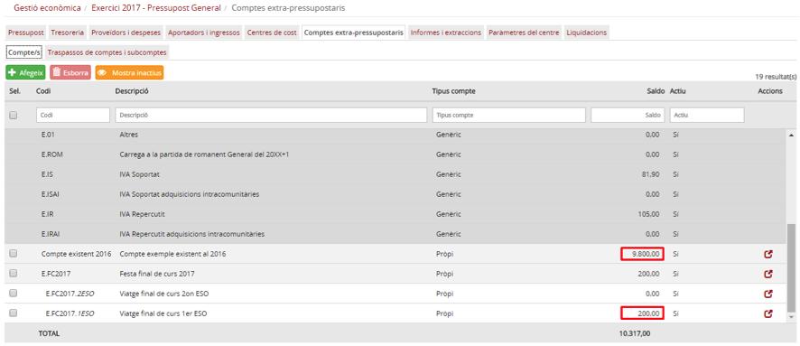

Imatge 13. Traspàs efectuat