# 2.1. Gestió de proveïdors i aportadors

* [2.1.1. Descripció](ap21.md#211-descripcio)
* [2.1.2. Gestió de proveïdors](ap21.md#212-gestio-de-proveidors)

  + [2.1.2.1. Accés](ap21.md#2121-acces)
  + [2.1.2.2. Llista de proveïdors](ap21.md#2122-llista-de-proveidors)
  + [2.1.2.3. Donar d’alta un proveïdor](ap21.md#2123-donar-dalta-un-proveidor)

    - [2.1.2.3.1. Donar d’alta un proveïdor creat per l’administrador](ap21.md#21231-donar-dalta-un-proveidor-creat-per-ladministrador)
  + [2.1.2.4. Modificar dades d’un proveïdor](ap21.md#2124-modificar-dades-dun-proveidor)
  + [2.1.2.5. Desactivar un proveïdor](ap21.md#2125-desactivar-un-proveidor)
  + [2.1.2.6. Reactivar un proveïdor](ap21.md#2126-reactivar-un-proveidor)
* [2.1.3. Gestió d’aportadors](ap21.md#213-gestio-daportadors)

  + [2.1.2.1. Accés](ap21.md#2121-acces)
  + [2.1.2.2. Llista d’aportadors](ap21.md#2122-llista-daportadors)
  + [2.1.2.3. Donar d’alta un aportador](ap21.md#2123-donar-dalta-un-aportador)

    - [2.1.3.3.1. Donar d’alta un aportador creat per l’administrador](ap21.md#21331-donar-dalta-un-aportador-creat-per-ladministrador)
  + [2.1.3.4. Modificar dades d’un aportador](ap21.md#2134-modificar-dades-dun-aportador)
  + [2.1.3.5. Desactivar un aportador](ap21.md#2135-desactivar-un-aportador)
  + [2.1.3.6. Reactivar un aportador](ap21.md#2136-reactivar-un-aportador)

---

## 2.1.1. Descripció

En aquest contingut es mostrarà com donar d’alta i gestionar els proveïdors i aportadors d’un centre educatiu per part del director/usuari del mòdul de Gestió econòmica.

Per tal que tots els centres puguin gestionar proveïdors i aportadors, el director/usuari de la Gestió econòmica defineix tots els proveïdors i aportadors que tindrà el centre.

Inicialment la llista de proveïdors i d’aportadors dins el programa apareix buida. El director/usuari haurà de carregar els proveïdors i aportadors del centre. En podrà afegir de dos tipus:

* Proveïdors/aportadors precarregats per l’usuari *Administrador*: ja tenen informació, que es carregarà un cop seleccionat el proveïdor/aportador per part de l’usuari. Són proveïdors comuns que poden tenir tots els centres.
* Proveïdor/aportador creat per l’usuari director/usuari: en aquest cas. l’usuari haurà d’informar tots els camps del proveïdor/aportador.

Els proveïdors i aportadors poden tenir dos tipus d’estat: *actiu/inactiu*, la qual cosa permet deshabilitar un proveïdor o aportador quan no sigui d’interès (per error en introduir-lo, perquè ja no existeix, etc.).

La gestió dels proveïdors i aportadors de l’exercici actual són d’ús exclusiu del director/usuari. Cada centre gestiona la seva part.

---

## 2.1.2. Gestió de proveïdors

A continuació es detalla la gestió dels proveïdors dins l’aplicació.

### 2.1.2.1. Accés

Per fer la gestió dels proveïdors, des de la pàgina principal d’Esfer@ cal anar al mòdul de *Gestió econòmica*.

Imatge 1. Pantalla inicial d'Esfer@

Una vegada s’hagi accedit al mòdul de *Gestió econòmica* apareix a sota un nou menú amb la llista dels pressupostos del centre. Aquí cal seleccionar un pressupost:

Imatge 2. Llista de pressupostos

A continuació cal seleccionar la pestanya *Proveïdors i despeses*, i l’opció de *Proveïdors*, que apareix seleccionada per defecte (*Imatge 3. Estructura de pestanyes*).

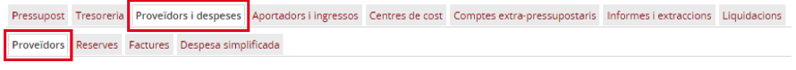

Imatge 3. Estructura de pestanyes

Apareix la pantalla amb la llista de proveïdors per aquell centre (*Imatge 4. Llista de proveïdors*).

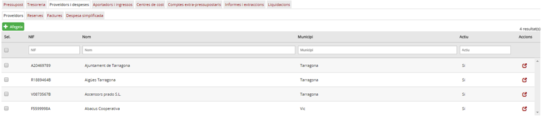

Imatge 4. Llista de proveïdors

---

### 2.1.2.2. Llista de proveïdors

Dins d’aquesta pantalla apareix una fila per a cada proveïdor amb la següent informació (en columnes):

* *NIF* (correspon al NIF del proveïdor)
* *Nom*: (correspon al nom del proveïdor)
* *Municipi*: (correspon al municipi del proveïdor)
* *Actiu*: estat en què es troba el proveïdor; pot estar actiu o inactiu.

Igualment, a la part esquerra de la fila apareix un quadrat per seleccionar la fila i fer alguna operació (que es comenta més endavant). I a la part dreta apareix la icona  per editar la fila corresponent del proveïdor (els definits pel centre).

A la capçalera de les pantalles de detall apareix el nom del camp. A sota de cada columna hi ha un requadre per poder aplicar filtres sobre la informació de detall.

Des d’aquesta pantalla es poden fer les accions d’afegir, modificar o reactivar els proveïdors.

Nota: El primer cop que s’accedeix a la llista de proveïdors, aquesta apareix buida. En aquest cas, el director/usuari, ha de carregar la llista de proveïdors, un per un, de la manera que es mostra més endavant.

---

### 2.1.2.3. Donar d’alta un proveïdor

Per afegir un nou proveïdor cal seguir el procediment següent:

* Des de la pantalla de llista de proveïdors, prmeu el botó *Afegeix*  (*Imatge 5. Donar d'alta un proveïdor*).

Imatge 5. Donar d'alta un proveïdor

* A continuació es mostra el quadre de diàleg per informar les dades del proveïdor que voleu afegir (*Imatge 6. Pantalla de nou proveïdor*).

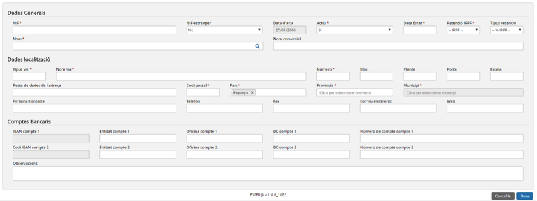

Imatge 6. Pantalla de nou proveïdor

* Cal omplir (com a mínim) tots els camps obligatoris de la pantalla (els que tenen l’asterisc al costat):

* Dades generals del proveïdor:

  + *NIF (obligatori)*: valor alfanumèric que ha de ser únic de cada proveïdor.
  + *NIF estranger*: el mateix cas que el NIF anterior. Ompliu-lo només quan el proveïdor sigui estranger .
  + *Data d’alta*: data d’alta el proveïdor. És un valor que el programa genera automàticament.
  + *Actiu (obligatori)*: valor sí/no. Determina si el proveïdor està actiu o no; per defecte apareix el valor actiu.
  + *Data estat (obligatori)*: data de l’últim canvi d’estat (actiu → inactiu o a l'inrevés).
  + *Retenció IRPF (obligatori)*: valor sí/no. Marqueu sí en cas que el proveïdor tingui retenció d’IRPF. En cas contrari marqueu no.
  + *Tipus retenció (obligatori si Retenció IRPF = SI)*: seleccioneu % d’IRPF que tingui el proveïdor.
  + *Nom (obligatori)*.
  + *Nom comercial*.

* Dades de localització del proveïdor:

  + *Tipus via (obligatori)*
  + *Nom via (obligatori)*
  + *Número (obligatori)*
  + *Bloc*
  + *Planta*
  + *Porta*
  + *Escala*
  + *Resta de dades de l’adreça*: dades complementàries de l’adreça
  + *Codi postal (obligatori)*
  + *País (obligatori)*
  + *Província (obligatori)*
  + *Municipi (obligatori)*
  + *Persona Contacte*
  + *Telèfon*
  + *Fax*
  + *Correu electrònic*
  + *Web*

* Comptes bancaris: apareix espai per a 2 blocs de comptes bancaris. En cada un d’ells hi ha els següents camps:

  + *IBAN compte*: camp de 24 caràcters, format per caràcters i números.
  + *Entitat compte*: camp numèric de 4 dígits.
  + *Oficina compte*: camp numèric de 4 dígits.
  + *DC compte*: camp numèric de 2 dígits.
  + *Número de compte*: camp numèric de 10 dígits.
  + *Observacions*: dades complementaries del compte del proveïdor.

* Prémer el botó *Desa* . Si no hi ha cap error a les dades introduïdes es desa la informació del nou proveïdor i el programa torna a la pantalla de la imatge (*Imatge 4. Llista de proveïdors*) on ja apareix la fila corresponent al nou proveïdor creat.

  + Si premeu el botó *Cancel·la*  apareix el següent quadre de diàleg (*Imatge 7. Confirmació cancel·lació*).

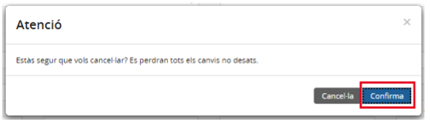

Imatge 7. Confirmació cancel·lació

* Si es *Confirma*  es retorna a la pantalla (*Imatge 4. Llista de proveïdors*) sense haver guardat el proveïdor.

---

#### 2.1.2.3.1. Donar d’alta un proveïdor creat per l’administrador

Per afegir un nou proveïdor creat per l’administrador cal seguir el següent procediment:

* Des de la pantalla de llista de proveïdors, prémer el botó *Afegeix*  (*Imatge 8. Donar d'alta un proveïdor creat per l'administrador*).

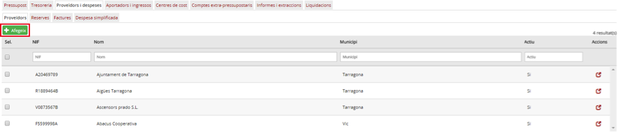

Imatge 8. Donar d'alta un proveïdor creat per l'administrador

* A continuació es mostra el mateix quadre de diàleg que a la *Imatge 9. Pantalla de nou proveïdor precarregat*.

Imatge 9. Pantalla de nou proveïdor precarregat

* En la mateixa pantalla, premeu el cercador  (del camp nom).

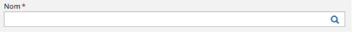

Imatge 10. Cercador d'un proveïdor precarregat per l'administrador

* Es mostra un nou quadre de diàleg on cal seleccionar un proveïdor de la llista de proveïdors precarregats per l’administrador, com es mostra a la imatge.

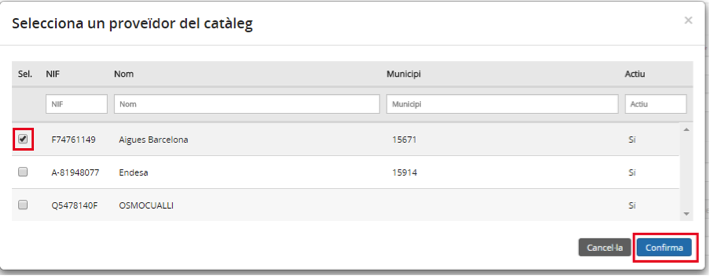

Imatge 11. Llista d'un nou proveïdor precarregat per l'administrador

* Premeu el botó *Confirma* . Es carrega la informació del nou proveïdor i el programa torna a la pantalla anterior, amb la informació carregada (*Imatge 11. Llista d'un nou proveïdor precarregat per l'administrador*)

  + Si premeu el botó *Cancel·la*  es retorna a la pantalla (Imatge 9. Pantalla de nou proveïdor precarregat) sense haver carregat cap dada de proveïdor.

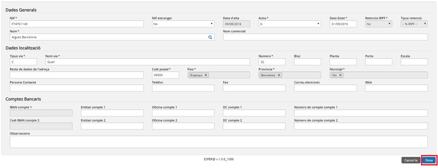

Imatge 12. Pantalla d'un nou proveïdor precarregat per l'administrador. Camps carregats

* Cal omplir o validar o completar (com a mínim) tots els camps obligatoris de la pantalla (els que porten l’asterisc al costat):

  + Dades generals del proveïdor:

    - *NIF (obligatori)*: valor alfanumèric que ha de ser únic de cada proveïdor.
    - *NIF estranger*: el mateix cas que el NIF anterior. Ompli-lo només en cas d’un proveïdor estranger.
    - *Data d’alta*: data d’alta el proveïdor. És un valor que genera el programa automàticament.
    - *Actiu (obligatori)*: valor sí/no. Determina si el proveïdor està actiu o no. Per defecte apareix el valor actiu.
    - *Data estat (obligatori)*: data de l’últim canvi d’estat (actiu → inactiu o a l'inrevés).
    - *Retenció IRPF (obligatori)*: valor sí/no. Marqueu sí en cas que el proveïdor tingui retenció d’IRPF. En cas contrari marqueu no.
    - *Tipus retenció (obligatori si Retenció IRPF = SI)*: seleccionar % d’IRPF que tingui el proveïdor.
    - *Nom (obligatori)*
    - *Nom comercial*
  + Dades de localització del proveïdor:

    - *Tipus via (obligatori)*
    - *Nom via (obligatori)*
    - *Número (obligatori)*
    - *Bloc*
    - *Planta*
    - *Porta*
    - *Escala*
    - *Resta de dades de l’adreça*: dades complementàries de l’adreça
    - *Codi postal (obligatori)*
    - *País (obligatori)*
    - *Província (obligatori)*
    - *Municipi (obligatori)*
    - *Persona Contacte*
    - *Telèfon*
    - *Fax*
    - *Correu electrònic*
    - *Web*
  + Comptes bancaris: hi ha espai per a 2 blocs de comptes bancaris. En cada un dells hi ha els camps següents:

    - *IBAN compte*: camp de 24 caràcters, format per caràcters i números.
    - *Entitat compte*: camp numèric de 4 dígits.
    - *Oficina compte*: camp numèric de 4 dígits.
    - *DC compte*: camp numèric de 2 dígits.
    - *Número de compte*: camp numèric de 10 dígits.
    - *Observacions*: dades complementaries del compte del proveïdor.
  + Premeu el botó *Desa* . Si no hi ha cap error a les dades introduïdes es desa la informació del nou proveïdor i el programa torna a la pantalla de la imatge (*Imatge 4. Llista de proveïdors*) on ja apareix la fila corresponent al nou proveïdor creat.

    - Si premeu el botó *Cancel·la* , apareix el següent quadre de diàleg (*Imatge 13. Confirmació cancel·lació*).

      * Si es *Confirma*  es retorna a la pantalla (*Imatge 4. Llista de proveïdors*) sense haver guardat el proveïdor.

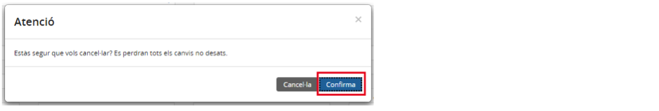

Imatge 13. Confirmació cancel·lació

---

### 2.1.2.4. Modificar dades d’un proveïdor

Les dades d’un proveïdor es poden modificar per actualitzar informació de contacte, comptes bancaris, etc., i igualment per canviar l’estat actiu/inactiu, així com deshabilitar un proveïdor.

Si un proveïdor està actiu permet crear factures i reserves. Quan està inactiu es deshabilita automàticament l’opció d’utilitzar el proveïdor per generar una factura o reserva.

Per modificar la informació d’un proveïdor existent, cal seguir el següent procediment:

Des de la pantalla de *Llista de proveïdors*, premeu el botó d’acció  corresponent a la fila del proveïdor que es vol modificar (*Imatge 14. Modificar un proveïdor*).

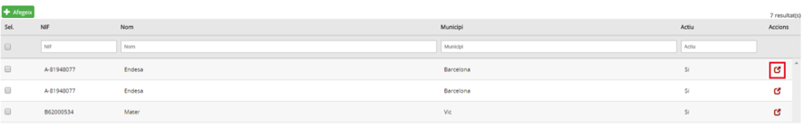

Imatge 14. Modificar un proveïdor

* Apareix la pantalla amb la informació del proveïdor (*Imatge 15. Dades del proveïdor*).

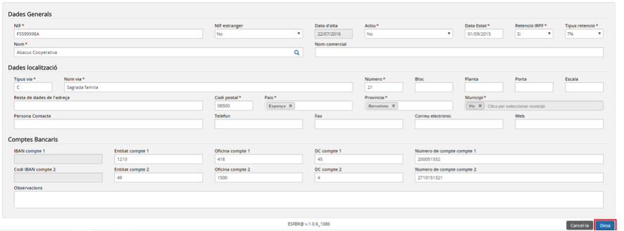

Imatge 15. Dades del proveïdor

* En aquest moment es pot modificar la informació del proveïdor amb nous valors.
* Premeu el botó *Desa* : si no hi ha cap error a les dades introduïdes es desa la nova informació del proveïdor i el programa torna a la pantalla de la imatge (Imatge 4. Llista de proveïdors), on ja apareix la nova la informació.

  + Si premeu el botó *Cancel·la* , apareix el següent quadre de diàleg (*Imatge 16. Confirmació cancel·lació*).

    - Si es *confirma*  el programa retorna a la pantalla de la imatge sense haver guardat la nova informació del proveïdor.

Imatge 16. Confirmació cancel·lació

---

### 2.1.2.5. Desactivar un proveïdor

Els proveïdors actius es poden canviar a un estat inactiu, la qual cosa permet deshabilitar un proveïdor que no sigui d’interès (per error en introduir-lo, perquè ja no existeix, etc.).
Per desactivar un proveïdor cal seguir el procediment següent:

* Des de la pantalla de llista de proveïdors (*Imatge 4. Llista de proveïdors*), premeu el botó d’acció  corresponent a la fila del proveïdor que es vol modificar.

Des d’aquesta pantalla es pot canviar el valor del camp “Actiu” (Si/no) (Imatge 17. Desacrtivar un proveïdor). Amb l’opció **No**, el proveïdor queda desactivat.

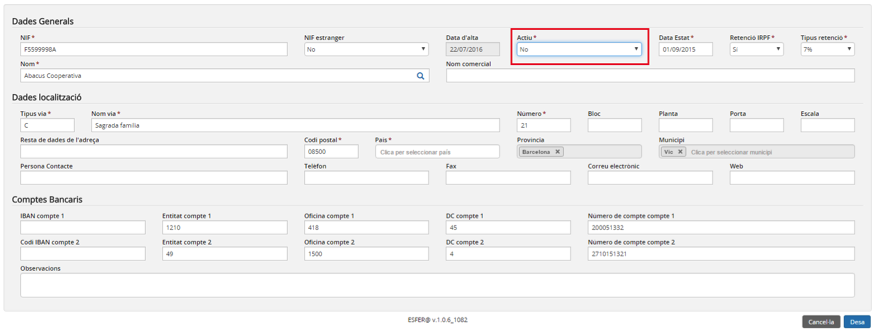

Imatge 17. Desacrtivar un proveïdor

* Premeu el botó *Desa* : si no hi ha cap error a les dades introduïdes, es desa la nova informació del proveïdor i el programa torna a la pantalla de proveïdors (*Imatge 4. Llista de proveïdors*) on ja apareix el proveïdor en estat inactiu.

  + Si es prem el botó *Cancel·la* ,apareix el següent quadre de diàleg (*Imatge 18. Confirmació cancel·lació*).

    - Si es *confirma*  el programa retorna a la pantalla de la imatge (*Imatge 4. Llista de proveïdors*) sense haver aplicat els canvis.

Imatge 18. Confirmació cancel·lació

---

### 2.1.2.6. Reactivar un proveïdor

Es pot reactivar un proveïdor que estava en estat inactiu, de manera que es podrà tornar a utilitzar en operacions de Gestió econòmica.

Per reactivar un proveïdor cal seguir el procediment següent:

* Des de la pantalla de llista de proveïdors (*Imatge 4. Llista de proveïdors*), premeu el botó d’acció  corresponent a la fila del proveïdor inactiu que es vol reactivar.

El programa mostra la pantalla de dades del proveïdor seleccionat. Des d’aquesta pantalla es pot canviar el valor del camp “Actiu” (Si/no) (*Imatge 19. Reactivar un proveïdor*). Amb l’opció **Si**, el proveïdor queda activat.

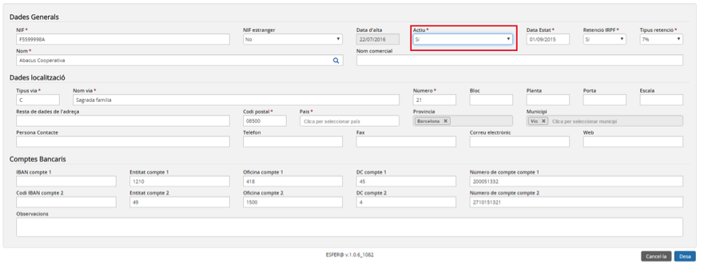

Imatge 19. Reactivar un proveïdor

* Premeu el botó *Desa* : si no hi ha cap error a les dades introduïdes es desa la nova informació del proveïdor i el programa torna a la pantalla de proveïdors (Imatge 4. Llista de proveïdors) on ja apareix el proveïdor en estat actiu.

  + Si es prem el botó *Cancel·la* , apareix el següent quadre de diàleg (*Imatge 20. Confirmació cancel·lació*) .

    - Si es *confirma* , el programa retorna a la pantalla de la imatge (*Imatge 4. Llista de proveïdors*) sense haver aplicat els canvis.

Imatge 20. Confirmació cancel·lació

---

## 2.1.3. Gestió d’aportadors

Dins aquesta secció es mostra com es fa la gestió d’aportadors amb l’aplicació.

### 2.1.3.1. Accés

Per fer la gestió d’aportadors, des de la pàgina principal d’Esfer@ cal anar al mòdul de *Gestió econòmica* *(Imatge 21. Pantalla inicial d'Esfer@)*.

Imatge 21. Pantalla inicial d'Esfer@

Una vegada s’hagi accedit al mòdul de *Gestió econòmica* apareix a sota un nou menú amb la llista dels pressupostos del centre (*Imatge 22. Llista de pressupostos*).

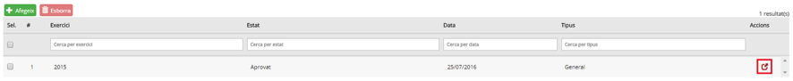

Imatge 22. Llista de pressupostos

A continuació cal seleccionar la pestanya *Aportadors* i ingressos i l’opció d’*Aportadors* que ja apareix seleccionada per defecte (*Imatge 23. Estructura de pestanyes*).

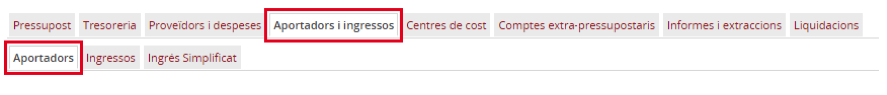

Imatge 23. Estructura de pestanyes

Apareix la pantalla amb la llista d’aportadors per aquell centre (*Imatge 24. Llista d'aportadors*).

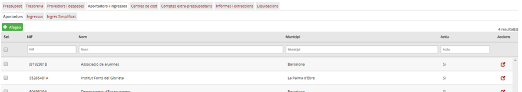

Imatge 24. Llista d'aportadors

---

### 2.1.3.2. Llista d’aportadors

Dins d’aquesta pantalla apareix una fila per cada aportador amb la següent informació (en forma de columnes):

* *NIF*: NIF de l’aportador
* *Nom*: nom de l’aportador
* *Municipi*: municipi de l’aportador
* *Actiu*: estat de l’aportador. Podrà ser actiu o inactiu.

Igualment, a la part esquerra de la fila apareix un quadrat per seleccionar la fila i fer alguna operació (que es comenta més endavant); i a la part dreta apareix la icona  per editar la fila corresponent de l’aportador (els definits pel centre).

A la capçalera de les pantalles de detall apareix el nom del camp. A sota de cada columna hi ha un requadre per poder aplicar filtres sobre la informació de detall.

Des d’aquesta pantalla es poden fer les accions d’afegir, modificar o reactivar els aportadors.

Nota: el primer cop que s’accedeix a la llista d’aportadors apareix buida. En aquest cas, el director/usuari, haurà de carregar la llista d’aportadors, un per un, de la manera que es mostra més endavant.

---

### 2.1.3.3. Donar d’alta un aportador

Per afegir un nou aportador cal seguir el següent procediment:

* Des de la pantalla de llista d’aportadors, premeu el botó Afegeix  (*Imatge 25. Donar d'alta un aportador*).

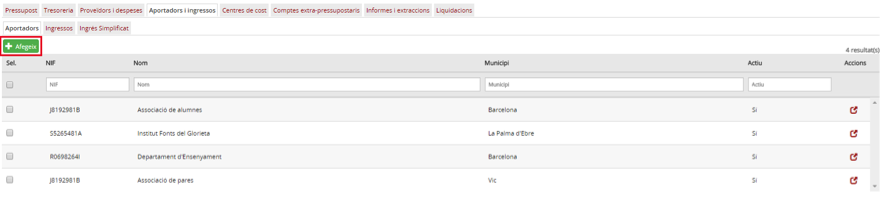

Imatge 25. Donar d'alta un aportador

* A continuació es mostra el quadre de diàleg per informar les dades de l’aportador que es vol afegir (*Imatge 26. Pantalla de nou aportador*).

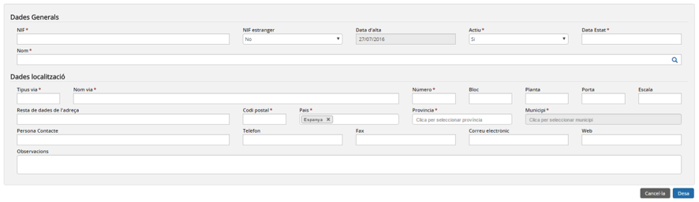

Imatge 26. Pantalla de nou aportador

* Cal omplir (com a mínim) tots els camps obligatoris de la pantalla (els que tenen l’asterisc al costat):

  + Dades generals de l’aportador:

    - *NIF (obligatori)*: valor alfanumèric que ha de ser únic de cada aportador.
    - *NIF estranger*: el mateix cas que el NIF anterior. Omplir-lo només en cas que l’aportador sigui estranger.
    - *Data d’alta*: data en què s’ha donat d’alta l’aportador. Data automàtica.
    - *Actiu (obligatori)*: valor sí/no. Determina si l’aportador està actiu o no. Per defecte està actiu.
    - *Data estat (obligatori)*: data de l’últim canvi d’estat (actiu → inactiu o a l'inrevés).
    - *Nom (obligatori)*
  + Dades de localització de l’aportador:

    - *Tipus via (obligatori)*
    - *Nom via (obligatori)*
    - *Número (obligatori)*
    - *Bloc*
    - *Planta*
    - *Porta*
    - *Escala*
    - *Resta de dades de l’adreça*: dades complementàries de l’adreça.
    - *Codi postal (obligatori)*
    - *País (obligatori)*
    - *Província (obligatori)*
    - *Municipi (obligatori)*
    - *Persona contacte*
    - *Telèfon*
    - *Fax*
    - *Correu electrònic*
    - *Web*
    - *Observacions*
* Premeu el botó *Desa* : si no hi ha errors a la informació introduïda, el programa desa el nou aportador i torna a la pantalla de la imatge (*Imatge 24. Llista d'aportadors*) on ja apareix el nou aportador creat.

  + Si es prem el botó *Cancel·la* , apareix el següent quadre de diàleg (*Imatge 27. Confirmació de cancel·lació*).

    - Si es *confirma* , es retorna a la pantalla (Imatge 24. Llista d'aportadors) sense haver guardat l’aportador.

Imatge 27. Confirmació de cancel·lació

---

#### 2.1.3.3.1. Donar d’alta un aportador creat per l’administrador

Per afegir un nou aportador creat per l’administrador cal seguir el procediment següent:

* Des de la pantalla de llista d’aportadors, premeu el botó *Afegeix*  (*Imatge 28. Donar d'alta un aportador*).

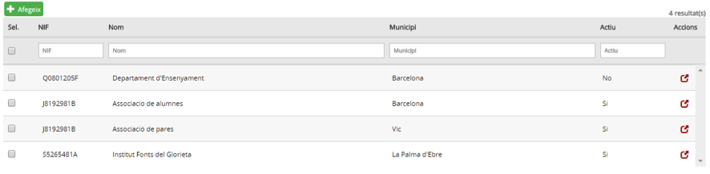

Imatge 28. Donar d'alta un aportador

* A continuació es mostra el mateix quadre de diàleg de la *Imatge 29. Pantalla de nou aportador*.

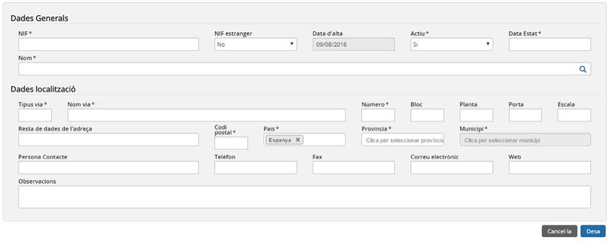

Imatge 29. Pantalla de nou aportador

* En la mateixa pantalla, preemu el cercador  del camp Nom.

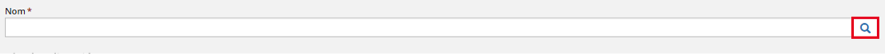

Imatge 30. Cercador d'un aportador precarregat per l'administrador

* Es mostra un nou quadre de diàleg on cal seleccionar un aportador de la llista d’aportadors precarregats per l’administrador, com es mostra a la *Imatge 31. Llista d'aportadors precarregats per l'administrador*.

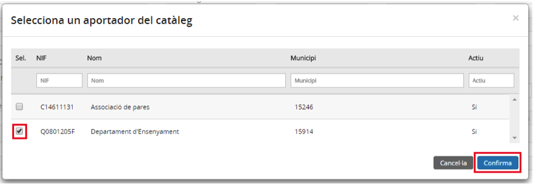

Imatge 31. Llista d'aportadors precarregats per l'administrador

* Premeu el botó *Confirma* . Es carrega la informació del nou aportador i el programa torna a la pantalla de la imatge (*Imatge 24. Llista d'aportadors*).

  + Si premeu el botó *Cancel·la*  es retorna a la pantalla (*Imatge 29. Pantalla de nou aportador*), sense haver carregat cap dada de l’aportador.

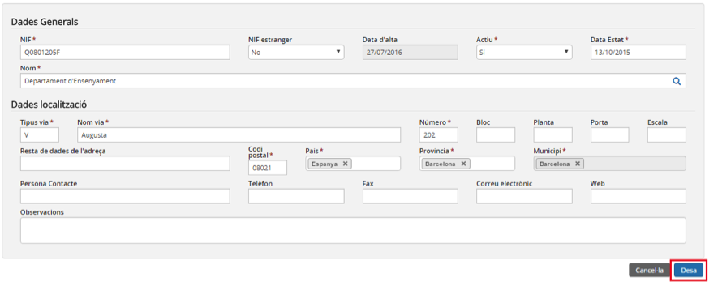

Imatge 32. Pantalla de nou aportador. Camps carregats

* Cal omplir o validar o completar (com a mínim) tots els camps obligatoris de la pantalla (els que tenen l’asterisc al costat):

  + Dades generals de l’aportador:

    - *NIF (obligatori)*: valor alfanumèric que ha de ser únic de cada aportador.
    - *NIF estranger*: el mateix cas que el NIF anterior. Omplir-lo només en cas que l’aportador sigui estranger.
    - Data d’alta: data d’alta l’aportador. Data automàtica.
    - *Actiu (obligatori)*: valor sí/no. Determina si l’aportador està actiu o no. Per defecte està actiu.
    - *Data estat (obligatori)*: data de l’últim canvi d’estat (actiu → inactiu o a l'inrevés).
    - *Nom (obligatori)*
  + Dades localització de l’aportador:

    - *Tipus via (obligatori)*
    - *Nom via (obligatori)*
    - *Número (obligatori)*
    - *Bloc*
    - *Planta*
    - *Porta*
    - *Escala*
    - *Resta de dades de l’adreça*: dades complementàries de l’adreça
    - *Codi postal (obligatori)*
    - *País (obligatori)*
    - *Província (obligatori)*
    - *Municipi (obligatori)*
    - *Persona Contacte*
    - *Telèfon*
    - *Fax*
    - *Correu electrònic*
    - *Web*
    - *Observacions*
* Premeu el botó *Desa* . Si no hi ha cap error a les dades introduïdes es desa la informació del nou aportador i el programa torna a la pantalla de la *Imatge 24. Llista d'aportadors* on ja apareix la fila corresponent al nou aportador creat.

  + Si es prem el botó *Cancel·la* , apareix el següent quadre de diàleg (*Imatge 33. Confirmació de cancel·lació*) .

    - Si es *confirma*  es retorna a la pantalla (*Imatge 24. Llista d'aportadors*), sense haver guardat l’aportador.

Imatge 33. Confirmació de cancel·lació

---

### 2.1.3.4. Modificar dades d’un aportador

Les dades d’un aportador es poden modificar per actualitzar informació de contacte, etc., i igualment serveix per poder canviar l’estat actiu/inactiu així com deshabilitar l’aportador.

Si un aportador està actiu, permet crear factures i reserves. Quan està inactiu es deshabilita automàticament l’opció d’utilitzar l’aportador per generar ingressos o ingrés simplificat.

Per modificar la informació d’un aportador existent cal seguir el següent procediment:

Des de la pantalla de Llista d’aportadors, premeu el botó d’acció  corresponent a la fila de l’aportador que es vol modificar (*Imatge 34. Modificar aportador*).

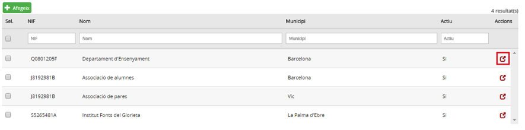

Imatge 34. Modificar aportador

* Apareix la pantalla amb la informació de l’aportador (*Imatge 35. Dades de l'aportador*).

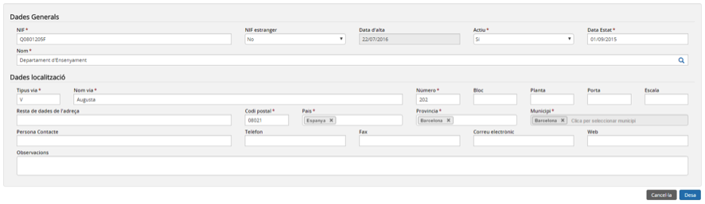

Imatge 35. Dades de l'aportador

* En aquest moment es pot modificar informació de l’aportador, amb nous valors.
* Premeu el botó *Desa* : si no hi ha cap error a les dades introduïdes es desa la nova informació de l’aportador i el programa torna a la pantalla de la imatge (*Imatge 24. Llista d'aportadors*) on ja apareix la nova informació.

  + Si es prem el botó *Cancel·la* , apareix el següent quadre de diàleg (*Imatge 36. Confirmació de cancel·lació*).

    - Si es *confirma*  el programa retorna a la pantalla de la imatge (*Imatge 24. Llista d'aportadors*), sense haver guardat la nova informació de l’aportador.

Imatge 36. Confirmació de cancel·lació

---

### 2.1.3.5. Desactivar un aportador

Els aportadors actius es poden canviar a un estat *inactiu*, la qual cosa permet deshabilitar un aportador que no sigui d’interès (per error en introduir-lo, perquè ja no existeix, etc.).
Per desactivar un aportador cal seguir el procediment següent:

* Des de la pantalla de llista d’aportadors *(Imatge 24. Llista d'aportadors)*, premeu el botó d’acció  corresponent a la fila de l’aportador que es vol modificar.

Des d’aquesta pantalla es pot canviar el valor del camp “Actiu” (Si/no) (*Imatge 37. Desactivar un aportador*). Amb l’opció **No**, l’aportador queda desactivat.

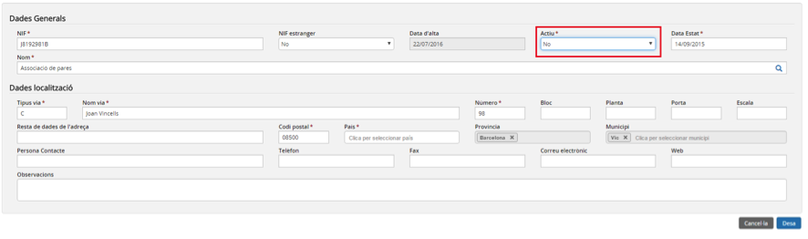

Imatge 37. Desactivar un aportador

* Premeu el botó *Desa* : si no hi ha cap error a les dades introduïdes es desa la nova informació de l’aportador i el programa torna a la pantalla d’aportadors (*Imatge 24. Llista d'aportadors*) on ja apareix l’aportador en estat Inactiu.

  + Si es prem el botó *Cancel·la* , apareix el següent quadre de diàleg (*Imatge 38. Confirmació de cancel·lació*).

    - Si es *confirma*  el programa retorna a la pantalla de la imatge (*Imatge 24. Llista d'aportadors*) sense haver aplicat els canvis.

Imatge 38. Confirmació de cancel·lació

---

### 2.1.3.6. Reactivar un aportador

Es pot tornar a reactivar un aportador que estava en estat inactiu, de manera que es podrà tornar a utilitzar en operacions de Gestió econòmica.

Per reactivar un aportador cal seguir el següent procediment:

* Des de la pantalla de llista d’aportadors, premeu el botó d’acció  corresponent a la fila de l’aportador inactiu que es vol reactivar (*Imatge 14. Modificar un proveïdor*).

El programa mostra la pantalla de dades de l’aportador seleccionat. Des d’aquesta pantalla es pot canviar el valor del camp “Actiu” (Si/no) (*Imatge 39. Reactivar un aportador*). Amb l’opció **Si**, l’aportador quedarà activat.

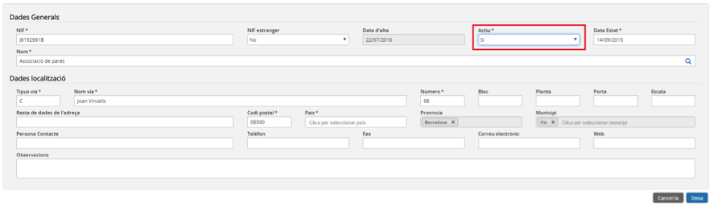

Imatge 39. Re-activar un aportador

* Premeu el botó *Desa* : si no hi ha cap error a les dades introduïdes, es desa la nova informació de l’aportador i el programa torna a la pantalla d’aportadors (*Imatge 24. Llista d'aportadors*) on ja apareix l’aportador en estat Actiu.

  + Si es prem el botó *Cancel·la* , apareix el quadre de diàleg següent (*Imatge 40. Confirmació de cancel·lació*) .

    - Si es *confirma*  el programa retorna a la pantalla de la imatge (*Imatge 24. Llista d'aportadors*) sense haver aplicat els canvis.

Imatge 40. Confirmació de cancel·lació