# 2.2. Despesa simplificada

* [2.2.1. Descripció](ap22.md#221-descripcio)
* [2.2.2. Contingut pas a pas](ap22.md#222-contingut-pas-a-pas)

  + [2.2.2.1. Accés](ap22.md#2221-acces)
  + [2.2.2.2. Llista de despeses simplificades](ap22.md#2222-llista-de-despeses-simplificades)
  + [2.2.2.3. Introduir una despesa simplificada](ap22.md#2223-introduir-una-despesa-simplificada)
  + [2.2.2.4. Anul·lar una despesa simplificada](ap22.md#2224-anullar-una-despesa-simplificada)
  + [2.2.2.5. Copiar una despesa simplificada](ap22.md#2225-copiar-una-despesa-simplificada)

---

## 2.2.1. Descripció

Dins el mòdul de Gestió econòmica d’Esfer@, a més de la gestió pressupostària, també hi ha la part de gestió comptable. L’enllaç entre el pressupost i la comptabilitat és la imputació d’ingressos i despeses.

Hi ha dos tipus de despeses:

* La despesa simplificada (d’ús excepcional i esporàdic), que correspon a una petita despesa de la qual es disposa d’un tiquet de caixa però no es té una factura. La despesa simplificada té un límit màxim de 300,00€. Aquest límit és un paràmetre del sistema.
* Les factures, que corresponen a aquelles despeses per les quals el centre ha rebut una factura.

Aquest contingut es centra en com s’han de registrar les **despeses simplificades** dins el mòdul de Gestió econòmica d’Esfer@ i la resta d’operacions associades:

* *Registrar despesa simplificada*: permet la creació de la despesa simplificada dins la comptabilitat.
* *Modificar despesa simplificada*: permet modificar algunes dades de la despesa simplificada i registrar els pagaments.
* *Anul·lar despesa simplificada*: permet anul·lar una despesa simplificada que s’ha creat per error.
* *Copiar despesa simplificada*: permet crear una nova despesa simplificada copiant les dades d’una altra despesa simplificada que ja existeix.

---

## 2.2.1. Contingut pas a pas

### 2.2.2.1. Accés

Des de la pàgina principal d’Esfer@ cal anar al mòdul de *Gestió Econòmica*.

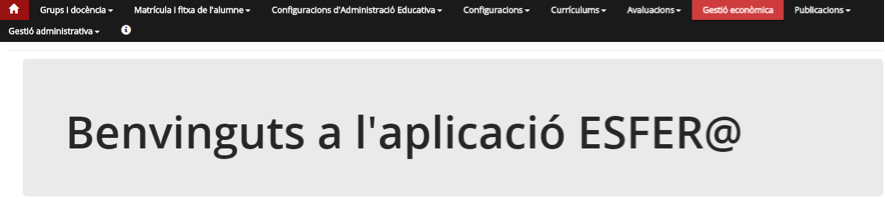

Imatge 1. Pantalla inicial d’Esfer@

Una vegada s’accedeix al mòdul de *Gestió econòmica* apareix una llista de pressupostos que té el centre (*Imatge 2. Llista pressupostos*).

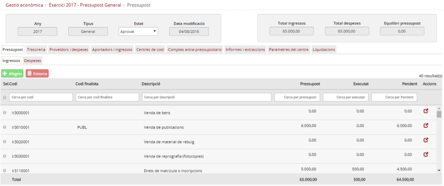

Imatge 2. Llista pressupostos

La informació de les columnes és la següent:

* *Exercici*: exercici fiscal (any) al qual pertany el pressupost.
* *Estat*: estat en el qual es troba el pressupost. Per a informació detallada sobre els estats del pressupost, consulteu els continguts específics d’Estats del pressupost.
* *Data*: data de l’últim canvi d’estat del pressupost.
* *Tipus*: tipus de pressupost.

  + *General*.
  + *Menjador*.
* Botó d’acció : permet accedir al detall del pressupost i permet introduir la dotació econòmica.

A la capçalera de les columnes apareix el nom del camp corresponent. A sota, hi ha uns espais per poder aplicar filtres sobre la informació detallada a la pantalla.

Prémer el botó d’acció  per accedir al detall del pressupost amb el qual es vol treballar (*Imatge 3. Pantalla de detall del pressupost*).

Imatge 3. Pantalla de detall del pressupost

---

### 2.2.2.2. Llista de despeses simplificades

El punt d’entrada a la gestió de les despeses simplificades és la llista de despeses simplificades. Per accedir a la llista de despeses simplificades cal seguir el següent procediment:

Des de la pantalla de detall del pressupost (Imatge 3):

* Seleccionar la pestanya *Proveïdors i despeses*.
* Seleccionar la subpestanya *Despesa simplificada*.
* Es mostra la llista de despeses simplificades amb el cercador per fer filtres (*Imatge 4. Llista de despeses simplificades*).

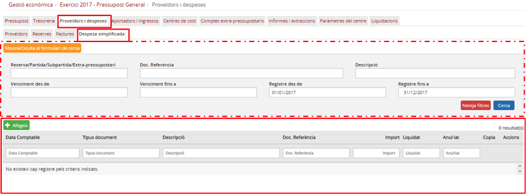

Imatge 4. Llista de despeses simplificades

Aquesta pantalla consta de dues parts: a la part inferior apareix la llista de despeses simplificades del centre, i a la part superior hi ha tot un seguit de camps per fer filtres i obtenir un subconjunt d’aquest tipus de despeses.

**a) Informació de les despeses simplificades:**

* La llista de despeses simplificades té les columnes següents:

  + *Data comptable*: data comptable de la despesa simplificada. És la data en la qual s’ha fet la despesa i que apareix en el tiquet de caixa.
  + *Tipus document*: tipus de document.
  + *Descripció*: descripció/concepte de la despesa simplificada.
  + *Doc. Referència*: número de document de referència (intern del sistema).
  + *Import*: import total de la despesa simplificada.
  + *Liquidat*: estat de liquidació de la despesa simplificada:

    - *Sí*: tots els venciments de la despesa simplificada han estat liquidats.
    - *No*: queden un o més venciments de la despesa simplificada pendents de liquidar.
  + Botó d’acció  que permet accedir a la pantalla de detall de la despesa simplificada.
  + *Anul·lat*: estat d’anul·lació de la despesa simplificada (Sí/No).
  + Botó d’acció de còpia  que permet crear una nova despesa simplificada copiant les dades d’una altra despesa simplificada que ja existeix.

La capçalera de la llista de despeses simplificades conté els noms dels camps (en forma de columnes), i unes caixetes per aplicar nous filtres a la llista de despeses de la pantalla.

**b) Filtre dins de la llista de despeses simplificades**

La part superior de la pantalla de Llista de despeses simplificades incorpora tot un seguit de camps per fer cerca de despeses, i d’obtenir un subconjunt de despeses segons una sèrie de paràmetres de cerca:

* *Reserva / Partida / Subpartida / Extrapressupostari*: permet cercar despeses simplificades en funció de les reserves, partides o comptes extrapressupostaris que s’hi hagin detallat:

  + Reserva: codi o descripció de la reserva contra la qual s’imputa la despesa simplificada.
  + Partida o subpartida: codi o descripció de la partida o subpartida.
  + Compte extrapressupostari: codi o descripció del compte extrapressupostari.
* *Doc. Referència*: permet cercar despeses simplificades a partir del número del document de referència (codi intern generat pel sistema).
* *Venciment des de / Venciment fins a*: permet cercar despeses simplificades que tinguin algun venciment dins del rang de dates especificat.
* *Registre des de / Registre fins a*: permet cercar despeses simplificades que tinguin la data de registre (per a la despesa simplificada és la mateixa que la data comptable) dins el rang de dates especificat.
* *Descripció*: permet cercar despeses simplificades que continguin el text introduït dins del seu camp de descripció.
* Per defecte tots els camps del cercador estan en blanc llevat de *Registre des de* i *Registre fins* a, que s’inicialitzen amb el primer dia de l’any del pressupost i l’últim dia de l’any del pressupost, respectivament.
* Això fa que la llista de despeses simplificades mostri per defecte totes les despeses simplificades de l’any corresponent al pressupost.
* El botó *Mostra/Ocultael formulari de cerca*  permet ocultar el cercador i deixar més espai de la pantalla disponible per a la llista de despeses simplificades (*Imatge 5. Cercador de despeses simplificades ocult*).

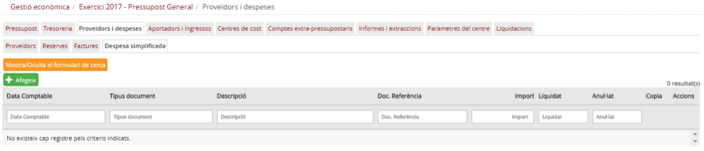

Imatge 5. Cercador de despeses simplificades ocult

* El botó *Neteja Filtres*  neteja tots els camps del cercador (i els deixa en blanc) llevat dels camps Registre des de i *Registre fins a* que es tornen al seu valor per defecte (el primer dia de l’any del pressupost i l’últim dia de l’any del pressupost, respectivament). Vegeu *Imatge 4. Llista de despeses simplificades*.
* El botó *Cerca*  mostra els registres trobats de les despeses simplificades resultants en aplicar els criteris de cerca introduïts.

**c) Accions sobre les despeses**
Des de la pantalla de llista de despeses simplificades es poden fer diferents accions, que s’expliquen a continuació:

* Introduir una despesa simplificada
* Anul·lar una despesa simplificada
* Copiar una despesa simplificada.

---

### 2.2.2.3. Introduir una despesa simplificada

Quan el centre fa una despesa de la qual no té factura (només té un tiquet de caixa), l’ha de registrar en la comptabilitat del mòdul de *Gestió econòmica* d’Esfer@ com a despesa simplificada.

Per introduir la despesa simplificada cal seguir el procediment següent:

* Des de la pantalla de llista de despeses simplificades, premeu el botó Afegeix  (*Imatge 6. Introduir una nova despesa simplificada*).

Imatge 6. Introduir una nova despesa simplificada

* Es mostra la pantalla de creació de despesa simplificada (*Imatge 7. Pantalla de nova despesa simplificada*).

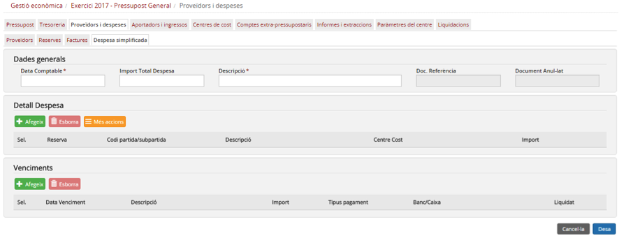

Imatge 7. Pantalla de nova despesa simplificada

En la pantalla de creació de despesa simplificada hi ha 3 blocs de dades:

* Dades generals
* Detall de despesa
* Venciments

A diferència de la despesa, en la despesa simplificada no cal seleccionar cap proveïdor, perquè totes es fan contra el mateix proveïdor genèric definit en el programa.

La composició d’informació per a cadascun d’aquests blocs és la següent:

* *Dades generals*: contenen la informació principal de la despesa simplificada, la que correspondria a les preguntes de “*Què?*” (concepte de la despesa simplificada i dates) i “*Quant?*” (imports totals).

  + *Data comptable*: data comptable de la despesa simplificada. En general, la data comptable és la mateixa que la data en què realment s’ha fet la despesa, llevat que aquesta data estigui dins un període del qual ja s’han liquidat els impostos. El sistema valida que la data comptable sigui correcta i impedeix introduir valors que corresponguin a períodes ja liquidats.
  + *Import total despesa*: import total de la despesa simplificada.
  + *Descripció*: descripció (concepte) de la despesa simplificada.
  + *Doc. Referència*: camp no modificable, ja que el número de document de referència el genera internament el sistema.
* *Detall despesa*: dades de com es fa la imputació de la despesa simplificada contra el pressupost (partides o subpartides i reserves) o contra els comptes extrapressupostaris. Aquesta secció correspondria a la pregunta de “*Com?*” (com es reparteix l’import entre les diferents partides, subpartides, centres de cost o comptes extrapressupostaris). El detall de la despesa simplificada és una taula on es poden especificar una o més línies d’assignació. Cada una d’elles té els camps següents:

  + *Reserva*: El camp permet cercar una reserva prement el botó d’acció  del mateix camp. En cas que ja s’hagi seleccionat una partida, no es pot seleccionar una reserva.
  + *Codi Partida / Subpartida / Extrapressupostari*: El camp permet cercar una partida, subpartida o compte extrapressupostari prement el botó d’acció  del mateix camp. En cas que ja s’hagi seleccionat una reserva, no es pot seleccionar una partida, subpartida o compte extrapressupostari.
  + *Descripció*: descripció de la partida / subpartida / compte extrapressupostari.
  + *Centre de cost*: permet seleccionar els centres de cost que tingui assignats la partida o subpartida (quan es va fer la dotació pressupostària). En cas que s’hagi triat un compte extrapressupostari, aquest camp està desactivat.
  + *Import*: import que s’assigna a aquesta línia.

* *Venciments*: dades de com es pagarà l’import de la despesa simplificada. Permet definir diversos venciments (terminis) amb diverses formes de pagament. Aquesta secció correspondria a la pregunta de “*Quan?*” (dates de pagament). La secció de venciments és una taula on es podran especificar una o més línies, cada una corresponent a un venciment. Cada una d’elles té els camps següents:

  + *Data venciment*: data del venciment.
  + *Descripció*: descripció del venciment.
  + *Import*: import del venciment.
  + *Tipus de pagament*: forma de pagament del venciment. És un desplegable amb els valors següents:

    - *Transferència*: transferència bancària.
    - *Rebut*: rebut domiciliat.
    - *Xec*: xec bancari.
    - *Targeta de crèdit*: targeta de crèdit bancària.
    - *Efectiu*: pagament en efectiu.
  + Banc/Caixa: camps desplegables per seleccionar el banc o caixa amb la qual es fa el pagament. El contingut de la llista de selecció s’omple en funció del valor seleccionat al camp *Tipus pagament*.

    - *Liquidat*: estat de liquidació del venciment:
    - *Sí*: el venciment ha estat liquidat (pagat).
    - *No*: el venciment no ha estat liquidat (pagat). Valor per defecte.

**Detall del procediment d’entrada d’una despesa simplificada**

Els passos a seguir per introduir una despesa simplificada són els següents:

1. Introduir les dades generals de la despesa simplificada.
2. Introduir el detall de la despesa.
3. Afegir venciments a la despesa simplificada.
4. Desar la despesa simplificada.

A continuació es detallen cadascun d’aquests passos.

---

**1. Introduir les dades generals de la despesa simplificada.**

Cal emplenar els camps de la secció Dades generals (*Imatge 8. Dades generals*):

* *Data comptable*: data comptable de la despesa simplificada.

  + En general, la data comptable és la mateixa que la data en què realment s’ha fet la despesa, llevat que aquesta data estigui dins un període del qual ja s’han liquidat els impostos. El sistema valida que la data comptable sigui correcta i impedeix introduir valors que corresponguin a períodes ja liquidats.
  + La data comptable ha d’estar dins de l’any del pressupost.
* *Import total despesa*: import total de la despesa simplificada.

  + Aquest import ha de ser inferior als 300,00€ (paràmetre de configuració del sistema).
* *Descripció*: descripció (concepte) de la despesa simplificada.

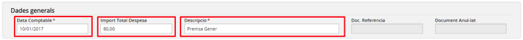

Imatge 8. Dades generals

---

**2. Introduir el detall de la despesa simplificada**

En el detall de la despesa simplificada es desglossa de quina manera l’import total de la despesa simplificada s’imputa al pressupost o als comptes extrapressupostaris. Dins de la secció *Detall* despesa es poden detallar una o més línies amb diferents reserves, partides/subpartides (amb els centres de cost que tinguin associats) o comptes extrapressupostaris.

Per poder afegir una línia a la taula de detall de la despesa simplificada cal seguir el procediment següent (*Imatge 9. Afegir una nova línia de detall*):

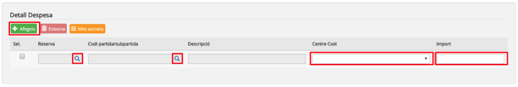

Imatge 8. Dades generals

* Premeu el botó Afegeix .
* S’afegeix una nova línia en blanc a la taula.
* Si la despesa simplificada s’imputa contra una reserva, premeu el botó de cerca  en el camp Reserva.

  + Es mostra la pantalla de cerca de reserves (*Imatge 10. Pantalla de cerca de reserves*).

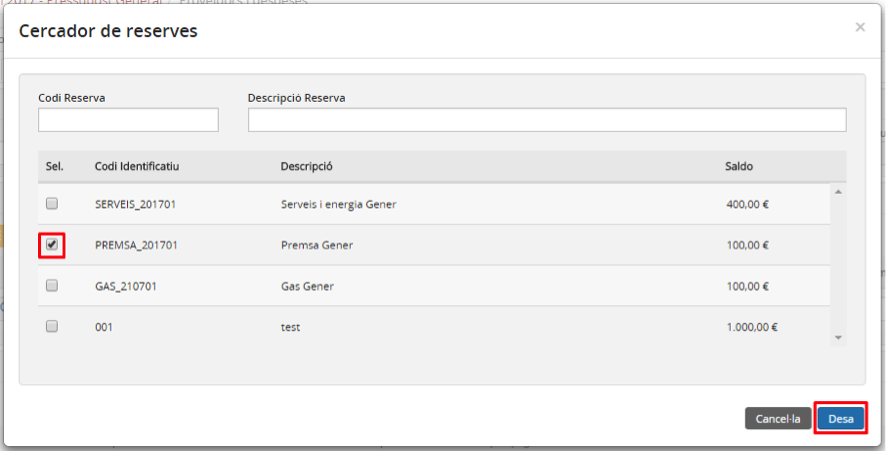

Imatge 10. Pantalla de cerca de reserves

* La pantalla conté una llista de totes les reserves del pressupost amb els camps següents:

  + *Codi identificatiu*: codi que s’ha assignat a la reserva en crear-la.
  + *Descripció*: descripció de la reserva.
  + *Saldo*: saldo disponible de la reserva, pendent d’executar.
* Seleccioneu la reserva contra la qual voleu fer la imputació.
* Premeu el botó *Desa* .

  + En cas que premeu el botó *Cancel·la* , torneu a la pantalla de creació de despesa simplificada sense haver seleccionat cap reserva.
* Les dades de la reserva s’incorporen a la línia que s’està creant.

  + En cas que la reserva tingui més d’una línia de dotació, es crea una línia a la despesa simplificada per cada línia de dotació de la reserva.
  + Es desactiven els botons de cerca  dels camps *Reserva i Partida / Subpartida / Extrapressupostari*.

* Si la despesa simplificada no s’imputa contra una reserva i va directament contra una partida/subpartida o un compte extrapressupostari, premeu el botó de cerca  del camp *Partida / Subpartida / Extrapressupostari*.

  + Es mostra la pantalla de cerca de partides/subpartides i comptes extrapressupostaris (*Imatge 11. Pantalla de cerca de partides/ subpartides o comptes extrapressupostaris*).

Imatge 11. Pantalla de cerca de partides/subpartides o comptes extrapressupostaris

* Obriu el desplegable *Cerca per* i trieu el tipus d’entitat que esteu buscant:

  + *Partides/subpartides*.
  + *Compte extrapressupostari*.   
    En ambdós casos es mostra una taula, amb les partides i subpartides o amb els comptes extrapressupostaris. La taula té els camps següents (Imatge 12. Selecció de partida/subpartida o compte extrapressupostari):

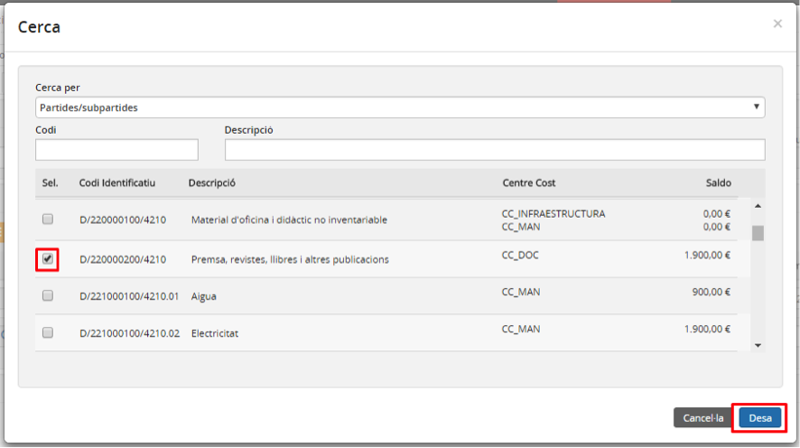

Imatge 12. Selecció de partida/subpartida o compte extrapressupostari

* *Codi identificatiu*: codi de la partida/subpartida o compte extrapressupostari (segons s’escaigui).
* *Descripció*: nom de la partida/subpartida o compte extrapressupostari (segons s’escaigui).
* *Centre de cost*: centre de cost assignat a la partida o subpartida.
* *Saldo*: saldo disponible a la partida/subpartida o compte extrapressupostari (segons s’escaigui).

* Seleccioneu la partida/subpartida o compte extrapressupostari (segons s’escaigui).
* Premeu el botó *Desa* .

  + En cas que premeu el botó *Cancel·la* , torneu a la pantalla de creació de despesa sense haver seleccionat cap partida/subpartida o compte extrapressupostari.
* Les dades de la partida/subpartida o compte extrapressupostari s’incorporen a la línia que s’està creant.

  + Es desactiven els botons de cerca  dels camps *Reserva* i *Partida / Subpartida / Extrapressupostari*.
  + En cas que seleccioneu un compte extrapressupostari, es desactivarà el camp *Centre de cost*.
  + La llista del desplegable del camp *Centre de cost*, s’omple amb els centres de cost que tingui assignats la partida.
* Introduir la resta de camps editables de la línia:
* *Centre de cost*: només en cas que la línia vagi contra una partida o subpartida (o una reserva).
* *Import*: import aplicable a aquesta partida/subpartida i centre de cost, o compte extrapressupostari.

D’aquesta manera es poden afegir una o més línies de detall (*Imatge 13. Línies de detall creades*).

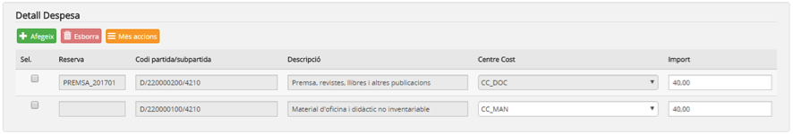

Imatge 13. Línies de detall creades

En cas que us hagueu equivocat en la tria de la reserva o la partida/subpartida o compte extrapressupostari, esborreu la línia i creeu-la de nou.

Per esborrar una línia de la taula de detall cal seguir el procediment següent (*Imatge 14. Esborrar línia de detall de despesa*):

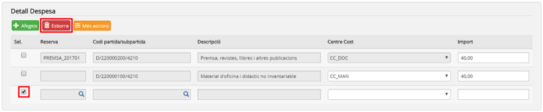

Imatge 14. Esborrar línia de detall de despesa

* Seleccioneu la línia de detall que voleu esborrar. Si voleu, podeu esborrar-ne més d’una a la vegada.
* Premeu el botó *Esborra* .

  + La línia seleccionada és esborrada.

Durant el procés de detall de la despesa simplificada podeu consultar les totalitzacions de les dades ja introduïdes. Per obtenir aquesta informació, premeu el botó Més accions  (*Imatge 15. Consulta totalitzacions detall:*

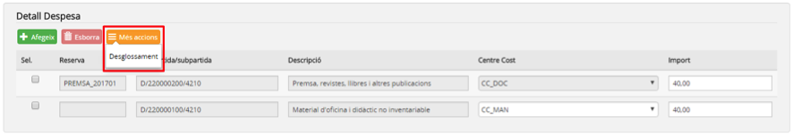

Imatge 15. Consulta totalitzacions detall

* *Desglossament*: extreu una pantalla amb informació totalitzada per partida/subpartida i centre de cost (*Imatge 16. Totalització per partida/subpartida i centre de cost*).

  + Premeu el botó *Confirma*  per tancar la pantalla i tornar a la pantalla de creació de despesa simplificada.

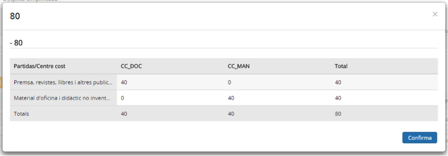

Imatge 16. Totalització per partida/subpartida i centre de cost

---

**3. Afegir venciments**

Els venciments permeten definir quins seran els pagaments que es faran per aquesta despesa simplificada. Cada venciment té la seva pròpia data, l’import i el tipus de pagament. Per la mateixa naturalesa de la despesa simplificada, tots els venciments s’introdueixen com a *Liquidats*.

Per afegir un nou venciment a la taula de venciments cal seguir el següent procediment (*Imatge 17. Crear un nou venciment*):

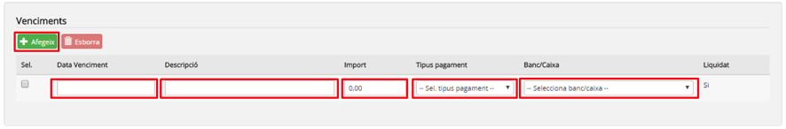

Imatge 17. Crear un nou venciment

* Premeu el botó Afegeix .
* S’afegeix una nova línia a la taula de venciments.
* Completeu els camps del venciment:

  + *Data venciment*: data del venciment.
  + *Descripció*: descripció del venciment.
  + *Import*: import del venciment.
  + *Tipus de pagament*: forma de pagament del venciment.   
    Desplegable amb els valors següents.

    - *Transferència*: transferència bancaria.
    - *Rebut*: rebut domiciliat.
    - *Xec*: xec bancari.
    - *Targeta de crèdit*: targeta de crèdit bancària.
    - *Efectiu*: pagament en efectiu.
  + *Banc/Caixa*: camps desplegables per seleccionar el banc o caixa contra la qual es fa el pagament. El contingut de la llista de selecció s’omple en funció del valor seleccionat al camp *Tipus pagament*.

    - Si el camp *Tipus pagament* val *Transferència, Rebut, Xec o Targeta de crèdit*, la llista s’omple amb tots els bancs actius del centre.
    - Si el camp *Tipus pagament* val *Efectiu*, la llista s’omple amb totes les caixes d’efectiu actives del centre.

D’aquesta manera es poden afegir un o més venciments (*Imatge 18. Venciments creats*). La suma dels imports de tots els venciments ha de coincidir amb el camp *Import total* despesa de la secció Dades generals.

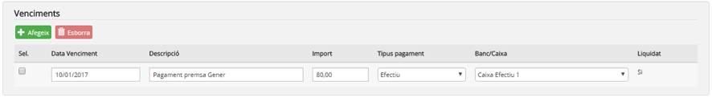

Imatge 18. Venciments creats

En cas que us equivoqueu en la creació del venciment, podeu esborrar-lo i crear-lo de nou.

Per esborrar una línia de la taula de venciments cal seguir el procediment següent (*Imatge 19. Esborrar venciments*):

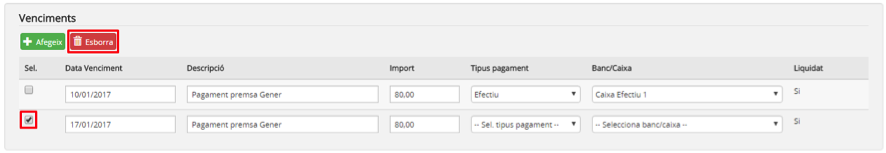

Imatge 19. Esborrar venciments

* Seleccioneu la línia de venciment que voleu esborrar. Si voleu, podeu esborrar-ne més d’una a la vegada.
* Premeu el botó *Esborra* .

  + La línia seleccionada és esborrada.

---

**4. Desar la despesa simplificada**

Una vegada que s’han completat tots els passos anteriors cal desar la despesa simplificada.

Per desar la despesa simplificada cal seguir el procediment següent (*Imatge 20. Desar la despesa simplificada*):

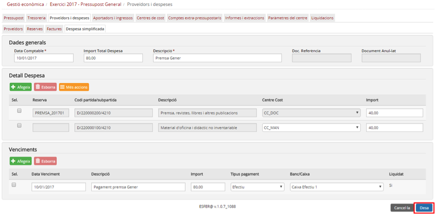

Imatge 20. Desar la despesa simplificada

* Premeu el botó *Desa* .

  + En cas que premeu el botó Cancel·la , torneu a la pantalla amb la llista de despeses simplificades (*Imatge 4. Llista de despeses simplificades*) sense desar-la.
* El sistema fa les validacions de la despesa simplificada. Les principals validacions són:

  + El camp *Data comptable* ha d’estar dins de l’any del pressupost i dins d’un període no liquidat d’impostos.
  + La suma dels imports de les línies de detall ha de coincidir amb el camp *Import total despesa*.
  + La suma de tots els imports dels venciments ha de coincidir amb el camp *Import total despesa*.
  + Validacions de saldo disponible (segons s’escaigui).

    - Saldo de la reserva.
    - Saldo de la partida/subpartida i centre de cost.
    - Saldo del compte extrapressupostari.
  + Validacions de saldo disponible als bancs i caixes especificats en els venciments.
* En cas que s’hagin passat les validacions, es desa la despesa simplificada i es torna a la pantalla de llista de despeses simplificades (*Imatge 21. Despesa simplificada creada*) on ja apareix la despesa simplificada creada.

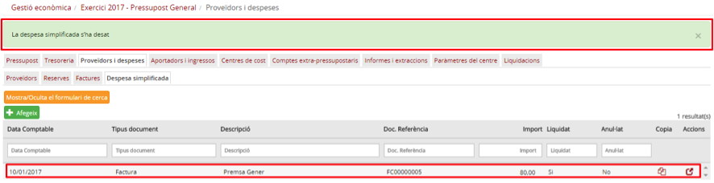

Imatge 21. Despesa simplificada creada

* Si una validació falla es mostra un missatge d’errada a l’usuari (*Imatge 22. Exemple de missatge d'errada*) per tal que pugui esmenar-la i tornar-ho a intentar.

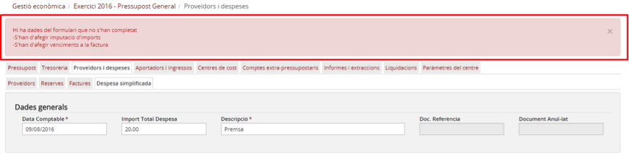

Imatge 22. Exemple de missatge d'errada

---

### 2.2.2.4. Anul·lar una despesa simplificada

En cas que s’hagi creat una despesa simplificada errònia el programa permet anul·lar-la. Els casos típics que poden portar a aquesta situació són els següents:

* S’ha creat una despesa simplificada amb dades errònies que no es poden modificar:

  + Errada en la data comptable.
  + Errada en l’import.
  + Errada en el proveïdor.
  + Altres errades.
* S’ha creat una despesa simplificada duplicada.

Només es poden anul·lar despeses simplificades que corresponguin a l’any del pressupost i que no hagin estat incloses en cap liquidació d’impostos (IVA, IRPF).

Per anul·lar una despesa simplificada cal seguir el procediment següent:

* Des de la pantalla de la llista de despeses simplificades, premeu el botó d’acció  de la despesa simplificada que voleu anul·lar (Imatge 23. Anul·lar despesa simplificada):

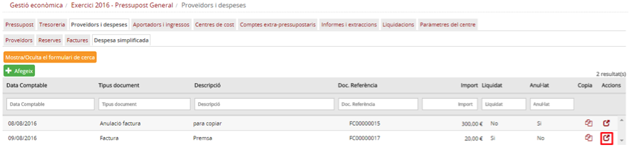

Imatge 23. Anul·lar una despesa simplificada

* Es mostrarà la pantalla de detall de la despesa simplificada (*Imatge 24. Pantalla de detall de la despesa simplificada*). Aquesta pantalla mostra tota la informació de la despesa simplificada però en format de consulta.

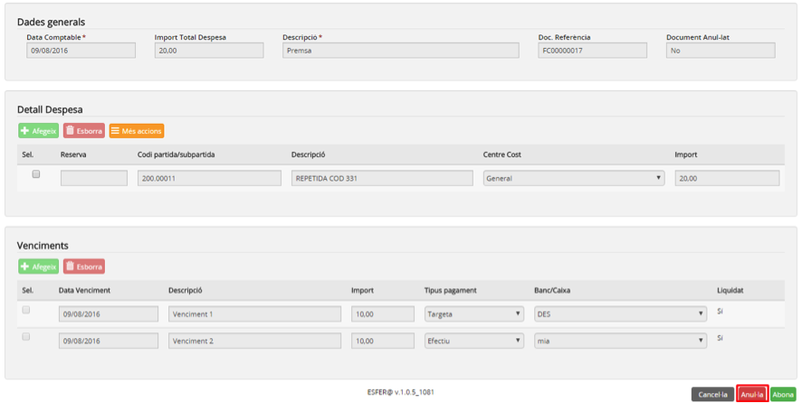

Imatge 24. Pantalla de detall de la despesa simplificada

* Premeu el botó *Anul·la* .

  + En cas que premeu el botó *Cancel·la* , torneu a la pantalla de detall de la despesa simplificada (Imatge 24. Pantalla de detall de la despesa simplificada) sense haver-la anul·lat.
* Introduïu el motiu de l’anul·lació (*Imatge 25. Motiu anul·lació*).

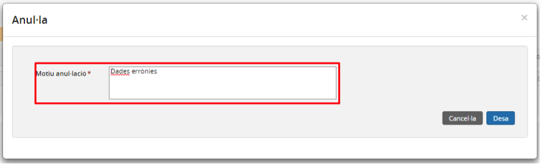

Imatge 25. Motiu anul·lació

* Premeu el botó *Desa* .

  + En cas que premeu el botó *Cancel·la* , torneu a la pantalla de detall de la despesa simplificada (*Imatge 24. Pantalla de detall de la despesa simplificada*) sense haver-la anul·lat.
* Es torna a la pantalla de la llista de despeses simplificades on ja apareix la despesa simplificada com a anul·lada (*Imatge 26. Despesa simplificada anul·lada*).

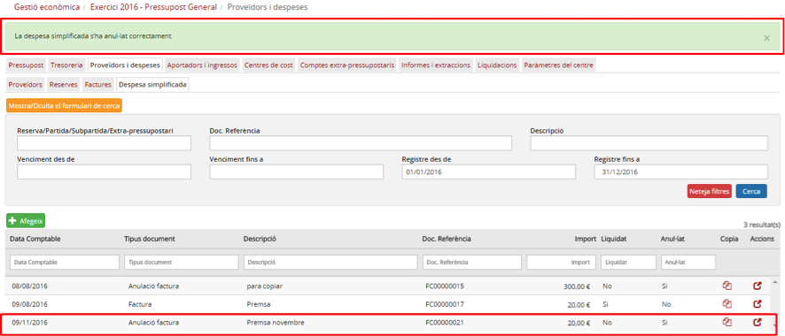

Imatge 26. Despesa simplificada anul·lada

---

### 2.2.2.5. Copiar una despesa simplificada

En cas que hi hagi una despesa simplificada que es repeteix en el temps, hi ha l’opció de copiar una despesa simplificada existent en lloc de crear-ne una de nova.

Per copiar una despesa simplificada cal seguir el procediment següent:

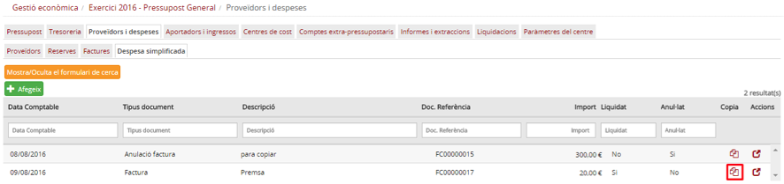

Imatge 27. Copiar una despesa simplificada

* Premeu el botó d’acció  per copiar la despesa simplificada (*Imatge 27. Copiar una despesa simplificada*).
* Es mostra la pantalla de creació de despesa simplificada amb les mateixes dades de la despesa simplificada que s’està copiant.(*Imatge 7. Pantalla de nova despesa simplificada*).
* Modifiqueu les dades de la despesa simplificada.
* Des de la pantalla de dotació de la reserva es poden canviar els camps següents:

  + *Data comptable*: data comptable de la despesa simplificada.
  + *Import total despesa*: import total de la despesa simplificada.
  + *Descripció*: descripció de la reserva.
* També es poden fer canvis en l’apartat *Detall despesa*:

  + Afegir noves partides i centres de cost (vegeu l’apartat *Detall del procediment d’entrada d’una despesa simplificada*).
  + Eliminar partides i centres de cost (vegeu l’apartat *Detall del procediment d’entrada d’una despesa simplificada*).
  + Canviar imports sobre les partides existents.

* Premeu el botó *Desa* .

  + En cas que premeu el botó Cancel·la , no es desa la nova despesa simplificada.
* Es torna a la pantalla de la llista de despeses simplificades (*Imatge 4. Llista de despeses simplificades*) on ja apareix la despesa simplificada copiada.