# 2.3. Reserves

* [2.3.1. Descripció](ap23.md#231-descripció)
* [2.3.2. Contingut pas a pas](ap23.md#232-contingut-pas-a-pas)

  + [2.3.2.1. Accés](ap23.md#2321-accés)
  + [2.3.2.2. Llista de reserves](ap23.md#2322-llista-de-reserves)
  + [2.3.2.3. Crear reserva de despesa](ap23.md#2323-crear-reserva-de-despesa)
  + [2.3.2.4. Modificar reserva de despesa](ap23.md#2324-modificar-reserva-de-despesa)
  + [2.3.2.5. Eliminar reserva de despesa](ap23.md#2325-eliminar-reserva-de-despesa)
  + [2.3.2.6. Copiar una reserva de despesa](ap23.md#2326-copiar-una-reserva-de-despesa)

---

## 2.3.1. Descripció

Una de les regles bàsiques de la gestió pressupostària d’Esfer@ és que un pressupost no pot ser deficitari (les despeses no poden superar mai els ingressos quan es tanca el pressupost). Per aquest motiu, és molt important poder fer un control molt acurat de les despeses.

Una de les eines que proposa el mòdul de *Gestió econòmica* d’Esfer@ són les *Reserves*.

El concepte de reserva permet fer per avançat una previsió de les despeses que tindrà el centre, independentment de quan es rebi la factura de proveïdor i se’n faci efectiu el conseqüent pagament. Això permet reservar una part del pressupost per a determinades partides de despesa, quan la despesa encara no s’ha executat realment, però es té previsió que es farà. L'import que s’ha assignat a una reserva i, en conseqüència, a una o diverses partides del pressupost, ja no està disponible (és a dir, és com si haguéssim congelat part del saldo d’una o diverses partides de despesa).

El concepte de reserva està vinculat exclusivament a les despeses i, per tant, només afecta les partides de despesa.

En aquest contingut es descriu com crear, modificar, anul·lar i copiar reserves. En els continguts específics de despesa es descriu com s’utilitzen les reserves quan es registra la despesa.

---

## 2.3.2. Contingut pas a pas

### 2.3.2.1. Accés

Des de la pàgina principal d’Esfer@ cal anar al mòdul de *Gestió econòmica*

Imatge 1. Pantalla inicial d’Esfer@

Una vegada s’accedeix al mòdul de *Gestió econòmica* apareixerà un llistat de pressupostos que té el centre (*Imatge 2. Llista de pressupostos*).

Imatge 2. Llista de pressupostos

La informació de les columnes dins aquesta pantalla és la següent:

* Exercici: exercici fiscal (any) al qual pertany el pressupost.
* *Estat*: estat en el qual es troba el pressupost. Per a informació detallada sobre els estats del pressupost, consulteu els continguts específics d’Estats del pressupost.
* *Data*: data en la qual hi va haver l’últim canvi d’estat del pressupost.
* *Tipus*: tipus de pressupost.

  + *General*.
  + *Menjador*.
* *Botó d’acció* : permet accedir al detall del pressupost i permet detallar la dotació.

A la capçalera de les columnes apareix el nom del camp corresponent. A sota, hi ha unes caixes que serveixen per aplicar filtres sobre la informació que es mostra a sota.

Premeu el botó d’acció  per entrar en el detall del pressupost que es vol editar per fer una reserva. Només es poden fer operacions sobre reserves quan el pressupost està en els estats *Provisional* o *Aprovat*. A continuació el programa dóna pas a la pantalla de detall del pressupost.

---

### 2.3.2.2. Llista de reserves

Tota l’operació de Reserves es fa des de la pantalla de llista de reserves (*Imatge 3. Llista de reserves*). Per accedir a aquesta pantalla, des de la pantalla de detall del pressupost:

* Seleccioneu la pestanya *Proveïdors* i *despeses*.
* Seleccioneu la subpestanya *Reserves*.

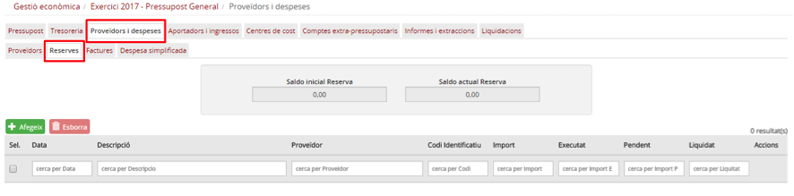

Imatge 3. Llista de reserves

La pantalla de llista de reserves consta d’una informació de resum de saldos i un conjunt de files (una per reserva):

* *Saldo inicial de reserva*: suma de l’import de totes les reserves del pressupost.
* *Saldo actual de reserva*: suma dels saldos de totes les reserves del pressupost pendents d’executar.
* Es mostra una taula amb totes les reserves del pressupost amb les columnes següents:

  + *Data*: data de la reserva.
  + *Descripció*: descripció de la reserva.
  + *Proveïdor*: codi del proveïdor al qual està associat la reserva.
  + *Codi identificatiu*: codi intern de la reserva.
  + *Import*: import total de la reserva.
  + *Executat*: import de les operacions que s’han registrat contra la reserva.
  + *Pendent*: import pendent d’executar (saldo). És la diferència entre la columna “Import” i la columna Executat.
  + *Liquidat (Sí/No)*: estat de liquidació de la reserva. Una reserva passa a estar liquidada al 100% quan s'ha enregistrat una o més factures o despeses simplificades per l'import total pendent de la reserva i, per tant, l’import pendent té el valor zero (0).
  + *Botó d’acció de còpia* : permet copiar una reserva.
  + *Botó d’acció d’edició* : permet entrar a la pantalla de detall de la reserva per poder-la editar.

A la capçalera de les columnes apareix el nom del camp corresponent. A sota, hi ha uns espais per poder aplicar filtres sobre la informació mostrada.

Des d’aquesta pantalla es fa la gestió de les reserves, amb les accions de crear, modificar, eliminar i copiar reserves de despesa, tal com es mostra a continuació.

---

### 2.3.2.3. Crear reserva de despesa

En el moment en què se sap que el centre farà una despesa (perquè per exemple s’ha acceptat un pressupost concret) s’ha de crear una reserva per a aquesta despesa.

Genèricament es crea una reserva en una data concreta, per a un proveïdor, i assignant imports a partides/subpartides i centres de cost concrets.

Dins del programa, per crear la reserva de despesa cal seguir el procediment següent:

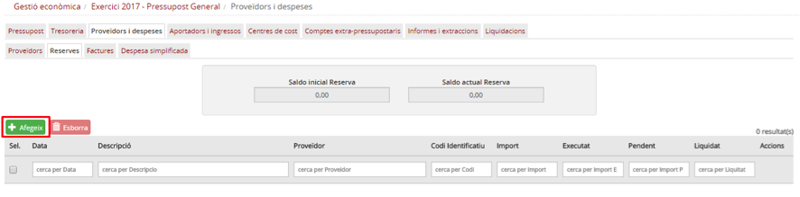

Imatge 4. Crear una nova reserva

* Des de la pantalla de llista de reserves premeu el botó *Afegeix*  (*Imatge 4. Crear una nova reserva*).
* Es mostra la pantalla de nova reserva (*Imatge 5. Pantalla de nova reserva*).

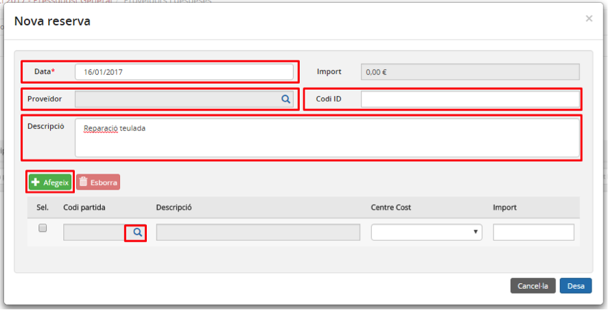

Imatge 5. Pantalla de nova reserva

* Completeu els camps principals de la reserva:

  + *Data*: data en què es fa la reserva.
  + *Codi ID (opcional)*: codi intern de la reserva. El posa el centre.
  + *Descripció (opcional)*: descripció de la reserva. Concepte per al qual es fa la reserva.

* En cas que en el moment que es crea la reserva se sàpiga quin és el proveïdor a qui es pagarà la despesa, es pot seleccionar un proveïdor prement el botó de cerca . En cas que s’assigni un proveïdor a la reserva, aquesta reserva només es podrà fer servir en una factura d’aquest mateix proveïdor.

  + Es mostra la pantalla de cerca de proveïdors (*Imatge 6. Pantalla de cerca de proveïdors*).

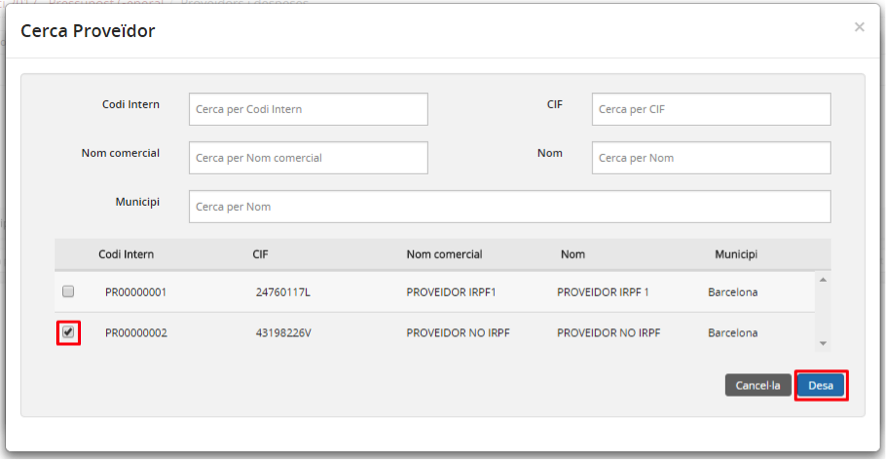

Imatge 6. Pantalla de cerca de proveïdors

* Dins la pantalla de cerca de proveïdors es mostra:

  + La llista de tots els proveïdors del centre.
  + Camps de cerca:

    - *Codi intern*: codi del proveïdor.
    - *CIF*: CIF del proveïdor.
    - *Nom comercial*: nom comercial del proveïdor.
    - *Nom*: nom mercantil del proveïdor.
    - *Municipi*: municipi del proveïdor.

* Seleccioneu un proveïdor de la llista.
* Premeu el botó *Desa* . El proveïdor s’incorpora a la pantalla de nova reserva (*Imatge 5. Pantalla de nova reserva*)

  + En cas que premeu el botó *Cancel·la* , no se selecciona cap proveïdor i es torna a la pantalla de nova reserva (*Imatge 5. Pantalla de nova reserva*).

**a) Dotació de la reserva**

* Un cop s’han omplert els camps de capçalera de la pantalla de nova reserva (*Imatge 5. Pantalla de nova reserva*), cal prémer el botó *Afegeix* per afegir una nova combinació de partida i centre de cost a la reserva.

  + S’afegeix una nova línia a la taula.
* Premeu el botó de cerca  de la columna *Codi partida* (*Imatge 5. Pantalla de nova reserva*).

  + Es mostra la pantalla de Cerca *de partida* (*Imatge 7. Pantalla de cerca de partida*).

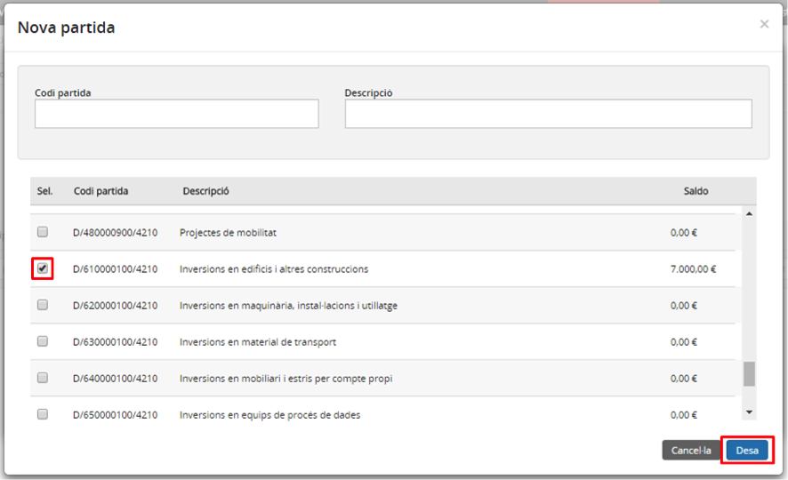

Imatge 7. Pantalla de cerca de partida

* Dins la pantalla de cerca de partida es mostra:

  + Llista de partides i subpartides del pressupost.
  + *Camps de cerca*:

    - *Codi partida*: codi de la partida.
    - *Descripció*: nom descriptiu de la partida.

* Seleccioneu una partida (no se’n pot seleccionar més d’una a la vegada).
* Premeu el botó *Desa* . El codi de la partida queda assignat a la columna *Codi partida* i el nom de la partida a la columna *Descripció*.

  + En cas que premeu el botó *Cancel·la* , no se selecciona cap partida i es torna a la pantalla de nova reserva (*Imatge 5. Pantalla de nova reserva*).

* La columna *Centre* de cost es carrega amb tots els centres de cost que té assignats la partida o subpartida seleccionada.
* Seleccioneu un centre de cost.
* Introduïu l’import assignat a aquest centre de cost.

  + Aquest import no pot ser superior al saldo que tingui la partida en el moment de crear la reserva.

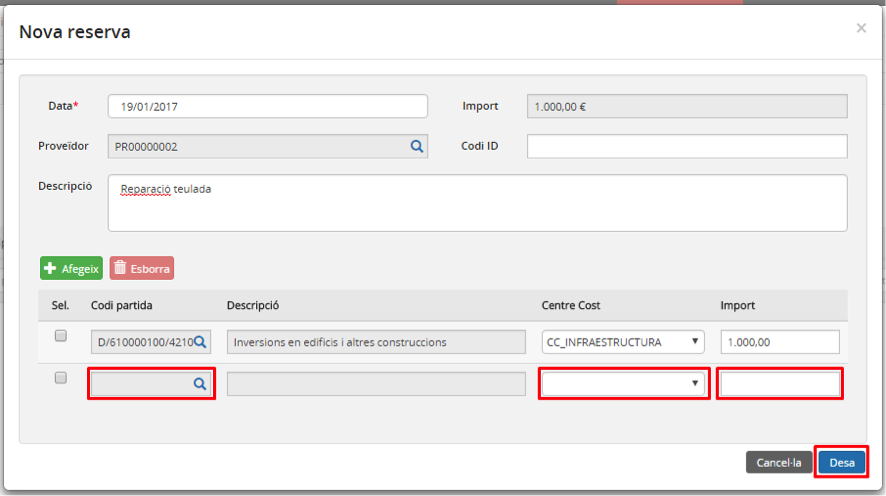

Imatge 8. Dotació de la reserva

* Premeu el botó *Desa* . Es desen les dades de la nova reserva.

  + En cas que premeu el botó *Cancel·la* , no es desa la nova reserva.
* Es torna a la pantalla de llista de reserves (Imatge 3. Llista de reserves) on ja apareix la nova reserva.

**b) Eliminar partida de la reserva**

En cas que per errada s’hagi afegit una partida a la reserva de manera indeguda o s’hagi de fer una modificació sobre alguna de les partides que s’han inclòs en la dotació de la reserva, cal esborrar-la de la taula. Això es fa des de la pantalla de la *Imatge 8. Dotació de la reserva*:

* Seleccioneu la partida que es vol eliminar de la reserva.
* Premeu el botó *Esborra* , tal com es mostra a la *Imatge 9. Esborrar una partida de la reserva*.

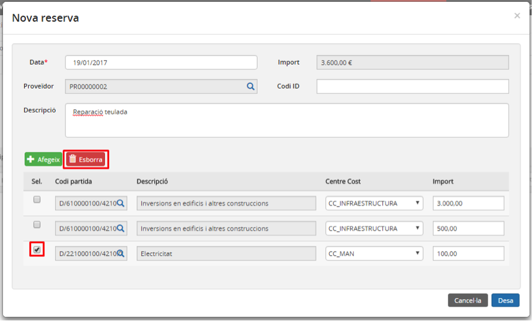

Imatge 9. Esborrar una partida de la reserva

El programa esborra aquella fila de la pantalla de Dotació de la reserva.

Per desar els canvis, s’ha de prémer el botó *Desa* .

---

### 2.3.2.4. Modificar reserva de despesa

En cas que hi hagi canvis en la previsió de la despesa es poden fer modificacions sobre la reserva. La quantitat de la reserva es pot augmentar (fins al límit del saldo de les partides i centres de cost) i es pot disminuir sempre que la quantitat no sigui inferior a la quantitat de la reserva que ja s’ha executat.

Per modificar una reserva de despesa cal seguir el procediment següent:

* Des de la pantalla de llista de reserves, premeu el botó d’acció  de la partida que es vol modificar (*Imatge 10. Modificar reserva de despesa*).

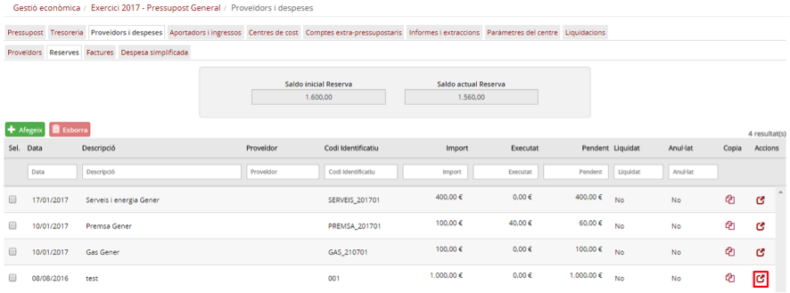

Imatge 10. Modificar reserva de despesa

* Es mostra la pantalla de dotació de la reserva (*Imatge 8. Dotació de la reserva*).
* Des de la pantalla de dotació de la reserva es poden canviar els camps següents:

  + *Data*: data de la reserva.
  + *Proveïdor*: codi del proveïdor associat a la reserva.
  + *Codi ID*: codi intern de la reserva.
  + *Descripció*: descripció de la reserva.
* També es poden fer canvis a la dotació:

  + Canviar l’import de les partides i centres de cost existents.
  + Afegir noves partides i centres de cost (vegeu l’apartat *Dotació de la reserva*).
  + Eliminar partides i centres de cost (vegeu l’apartat *Eliminar partida de la reserva*).
* Premeu el botó *Desa* .

  + Abans de desar es valida que l’import no sigui inferior al saldo de les partides i centres de cost i que no sigui inferior a l’import de la reserva que ja ha estat executat.
  + En cas que premeu el botó *Cancel·la* , no es desa la nova reserva.
* Es torna a la pantalla de llista de reserves (*Imatge 3. Llista de reserves*).

---

### 2.3.2.5. Eliminar reserva de despesa

Si una reserva deixa de ser necessària, ja sigui perquè l’usuari s’ha equivocat en crear-la o perquè la previsió de la despesa ha desaparegut, la reserva es pot esborrar. Una reserva només es pot esborrar en cas que no s’hi hagi fet cap imputació de despesa (el camp executat val zero (0)).

Per esborrar una reserva cal seguir el procediment següent (*Imatge 11. Esborrar reserva*):

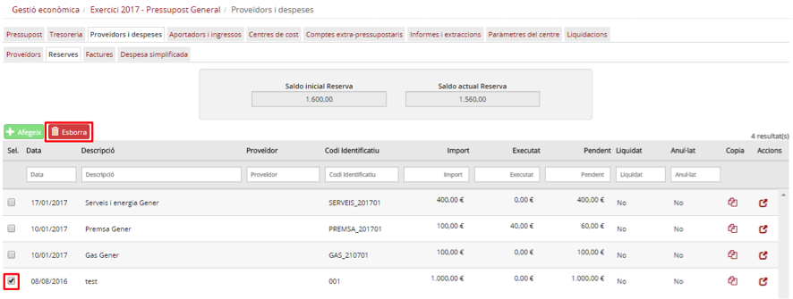

Imatge 11. Esborrar reserva

* Des de la pantalla de llista de reserves, seleccioneu la reserva que voleu esborrar.
* Premeu el botó *Esborra*.
* Confirmeu l’operació.
* El programa mostra una pantalla que sol·licita el motiu de l’anul·lació de la reserva (*Imatge 12. Motiu anul·lació reserva*).

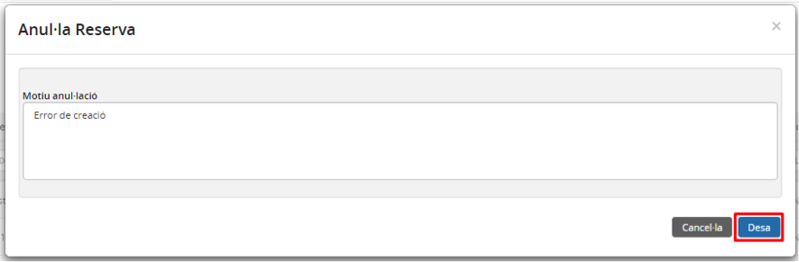

Imatge 12. Motiu anul·lació reserva

* Heu d’omplir el camp de *Motiu de l’anul·lació*.
* Premeu el botó *Desa* .

  + La reserva s’esborra (anul·la).
  + En cas que premeu el botó *Cancel·la* , no s’esborra la reserva.
* El programa torna a la pantalla de llista de reserves, on ja no apareix la reserva esborrada (*Imatge 13. Reserva esborrada*).

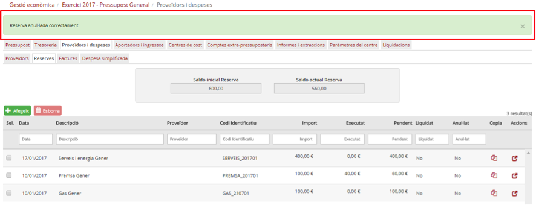

Imatge 13. Reserva esborrada

---

### 2.3.2.6. Copiar una reserva de despesa

En cas que hi hagi una previsió de despesa que es repeteix en el temps, hi ha l’opció de copiar una reserva existent en lloc de crear-ne una de nova.

Per copiar una reserva de despesa cal seguir el procediment següent:

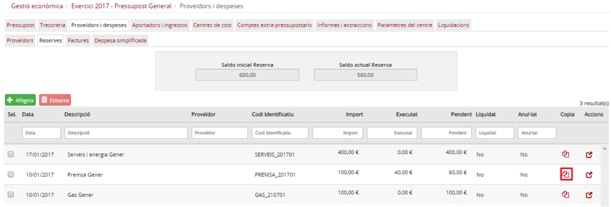

Imatge 14. Copiar reserva de despesa

* Premeu el botó d’acció  per copiar la reserva (*Imatge 14. Copiar reserva de despesa*).
* Es mostra la pantalla de dotació de la reserva amb les mateixes dades de la reserva que s’està copiant (*Imatge 8. Dotació de la reserva*).
* Modifiqueu les dades de la reserva.
* Des de la pantalla de dotació de la reserva es poden canviar els camps següents:

  + *Data*: data de la reserva.
  + *Proveïdor*: codi del proveïdor associat a la reserva.
  + *Codi ID*: codi intern de la reserva.
  + *Descripció*: descripció de la reserva.
* També es poden fer canvis a la dotació:

  + Canviar l’import de les partides i centres de cost existents.
  + Afegir noves partides i centres de cost (vegeu l’apartat *Dotació de la reserva*).
  + Eliminar partides i centres de cost (vegeu l’apartat *Eliminar partida de la reserva*).

* Premeu el botó *Desa* .

  + En cas que premeu el botó *Cancel·la* , no es desa la nova reserva.
* Es torna a la pantalla de llista de reserves (*Imatge 3. Llista de reserves*) on ja apareix la reserva copiada.