# 2.4. Gestió de la despesa

* [2.4.1. Descripció](ap24.md#241-descripcio)
* [2.4.2. Contingut pas a pas](ap24.md#242-contingut-pas-a-pas)

  + [2.4.2.1. Accés](ap24.md#2421-acces)
  + [2.4.2.2. Llista de factures](ap24.md#2422-llista-de-factures)
  + [2.4.2.3. Introduir la factura d’un proveïdor](ap24.md#2423-introduir-la-factura-dun-proveidor)
  + [2.4.2.4. Modificar una factura](ap24.md#2424-modificar-una-factura)
  + [2.4.2.5. Anul·lar una factura](ap24.md#2425-anullar-una-factura)
  + [2.4.2.6. Abonar una factura](ap24.md#2426-abonar-una-factura)
  + [2.4.2.7. Pagament parcial o total de l’import pendent d’una factura](ap24.md#2427-pagament-parcial-o-total-de-limport-pendent-duna-factura)
  + [2.4.2.8. Anul·lar un pagament](ap24.md#2428-anullar-un-pagament)
  + [2.4.2.9. Copiar una factura](ap24.md#2429-copiar-una-factura)

---

## 2.4.1. Descripció

Dins el mòdul de *Gestió econòmica* d’Esfer@, a més de la gestió pressupostària, també es fa la gestió comptable. L’enllaç entre el pressupost i la comptabilitat és la imputació d’ingressos i despeses. Dins d’aquest contingut es tracta la gestió de la despesa.

Hi ha dos tipus de despeses:

* La despesa simplificada, que correspon a una petita despesa de la qual es disposa d’un tiquet de caixa però no es té una factura.
* Les factures, que corresponen a aquelles despeses per les quals el centre ha rebut una factura.

Aquest contingut explica com s’han de registrar les factures dins el mòdul de *Gestió econòmica* d’Esfer@ i la resta d’operacions associades:

* *Registrar factures*: permet la creació de la factura dins la comptabilitat.
* *Modificar factura*: permet modificar algunes dades de la factura i registrar els pagaments.
* *Anul·lar factura*: permet anul·lar una factura que s’ha creat per error.
* *Abonar una factura*: permet registrar l’abonament d’una factura ja registrada.
* *Copiar factura*: permet crear una nova factura copiant les dades d’una factura ja existent.

---

## 2.4.2. Contingut pas a pas

### 2.4.2.1. Accés

Des de la pàgina principal d’Esfer@ cal anar al mòdul de *Gestió econòmica*.

Imatge 1. Pantalla inicial d’Esfer@

Una vegada s’accedeix al mòdul de *Gestió econòmica* apareix una llista de pressupostos que té el centre (*Imatge 2. Llista pressupostos*).

Imatge 2. Llista de pressupostos

Apareix una fila per cada pressupost del centre, amb la informació següent:

* *Exercici*: exercici fiscal (any) al qual pertany el pressupost.
* *Estat*: estat en el qual es troba el pressupost. Per a informació detallada sobre els estats del pressupost, consulteu els continguts específics d’Estats del pressupost.
* *Data*: data de l’últim canvi d’estat del pressupost.
* *Tipus*: tipus de pressupost.

  + *General*.
  + *Menjador*.
* *Botó d’acció* : permet accedir al detall del pressupost i introduir-hi la dotació.

A la capçalera de les columnes apareix el nom del camp corresponent. A sota, hi ha uns espais per poder aplicar filtres sobre la informació de detall.

Premeu el botó d’acció  per entrar en el detall del pressupost amb el qual voleu treballar. A continuació el programa mostra la pantalla següent:

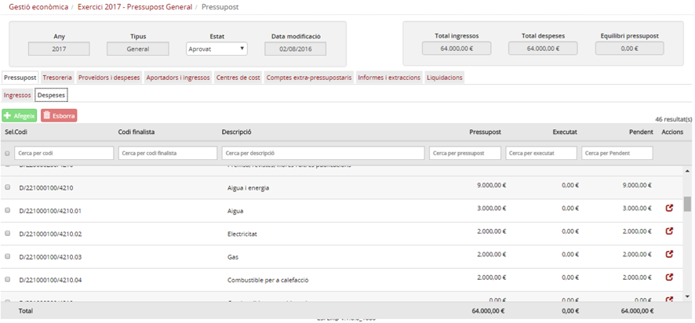

Imatge 3. Pantalla de detall del pressupost

---

### 2.4.2.2. Llista de factures

El punt d’entrada a tota la gestió de la despesa és la llista de factures. Per accedir a la pantalla de llista de factures cal seguir el procediment següent:

Des de la pantalla de detall del pressupost (imatge 3):

* Seleccioneu la pestanya *Proveïdors i despeses*.
* Seleccioneu la subpestanya *Factures*.
* Es mostra la llista de factures, amb el cercador per introduir-hi filtres (*Imatge 4. Llista de factures*).

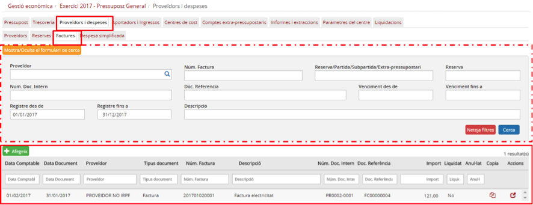

Imatge 4. Llista de factures

Aquesta pantalla consta de dues parts: a la part inferior apareix la llista de factures del centre, i a la part superior hi ha tot un seguit de camps per introduir-hi filtres i obtenir un subconjunt de factures.

**a) Informació de les factures:**

* La llista de factures de la part inferior de la pantalla mostra les columnes següents:

  + *Data comptable*: data comptable de la factura que correspon a la data en la qual s’ha de comptabilitzar.
  + *Data document*: data que apareix a la factura.
  + *Proveïdor*: codi del proveïdor de la factura.
  + *Tipus document*: Tipus de document (factura o abonament).
  + *Núm. Factura*: número de factura.
  + *Descripció*: descripció/concepte de la factura.
  + *Núm. Doc. Intern*: número de document intern que li ha donat el centre. (Opcional).
  + *Doc. Referència*: número de document de referèia (intern del sistema).
  + *Import* import total de la factura.
  + *Liquidat*: estat de liquidació de la factura:

    - *Sí*: tots els venciments de la factura han estat liquidats.
    - *No*: queden un o més venciments de la factura pendents de liquidar.
  + Botó d’acció  que permet accedir a la pantalla del detall de la factura.

La capçalera de la llista de factures conté els noms dels camps (en forma de columnes), i uns espais en forma de caixetes per aplicar nous filtres a la llista de factures de la pantalla.

**b) Filtre dins de la llista de factures**

La part superior de la pantalla de Llista de factures incorpora tot un seguit de camps per cercar factures, i d’obtenir un subconjunt de factures segons una sèrie de paràmetres:

* *Proveïdor*: permet cercar factures en funció d’alguna de les dades del proveïdor, a través d’una pantalla que apareix en prémer l’opció Cerca del camp Proveïdor:

  + Codi del proveïdor.
  + Nom (legal) del proveïdor.
  + Nom comercial del proveïdor.
  + CIF del proveïdor.
  + Municipi del proveïdor.
* *Núm. Factura*: permet cercar pel número de factura.
* *Partida / Subpartida / Extrapressupostari*: permet cercar factures en funció de les partides o comptes extrapressupostaris que s’hi hagin detallat:

  + Partida o subpartida: codi o descripció de la partida o subpartida.
  + Compte extrapressupostari: codi o descripció del compte extrapressupostari.
* *Reserva*: permet cercar les factures que s’hagin detallat contra una reserva a partir de la descripció de la reserva.
* *Núm. Doc Intern*: permet cercar factures a partir del número de document intern que se li hagi donat al centre.
* *Doc. Referència*: permet cercar factures a partir del número de document de referència (codi intern generat pel sistema).
* *Venciment des de / Venciment fins a*: permet cercar factures que tinguin algun venciment dins d’aquest rang de dates.
* *Registre des de / Registre fins a*: permet cercar factures que tinguin la data de registre dins d’aquest rang de dates.
* *Descripció*: permet cercar factures que continguin el text introduït dins del seu camp de descripció.
* Per defecte, tots els camps del cercador estan en blanc llevat de *Registre* des de i *Registre fins a*, que s’inicialitzen amb el primer dia de l’any del pressupost i l’últim dia de l’any del pressupost, respectivament.
* Això fa que la llista de factures mostri per defecte totes les factures de l’any corresponent al pressupost.
* Nota: dins dels camps de filtre de la pantalla mostrada a la *Imatge 4. Llista de factures*, el camp de cerca *Proveïdor* té un botó d’acció  que obre una pantalla de cerca de proveïdors, per aplicar-hi filtres més precisos (*Imatge 5. Pantalla de cerca de proveïdors*):

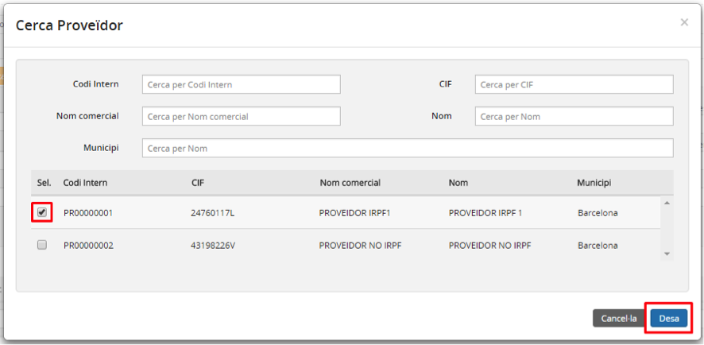

Imatge 5. Pantalla de cerca de proveïdors

* Es mostra una llista amb tots els proveïdors del centre amb els camps següents:

  + *Codi intern*: codi intern del proveïdor.
  + *CIF*: CIF del proveïdor.
  + *Nom comercial*: nom comercial del proveïdor.
  + *Nom*: nom (legal?) del proveïdor.
  + *Municipi*: municipi on té l’adreça el proveïdor.
* Per a cada un dels camps anteriors hi ha un camp a la capçalera de la pantalla que permet filtrar els continguts de la taula.
* Seleccioneu un proveïdor (només un). No està permès seleccionar-ne més d’un.
* Premeu el botó *Desa* .

  + En cas que premeu el botó *Cancel·la* , tornareu a la pantalla de cercador de factures sense seleccionar cap proveïdor.
* Es torna a la pantalla de cercador de factures (*Imatge 6. Cercador de factures*), on el camp de proveïdor de la part de filtres ja s’ha emplenat.

**Mostrar/ocultar camps de filtre**

Com que la pantalla de la Imatge *4.Llista de factures* mostra un conjunt elevat de camps de filtre que ocupen bona part de l’espai de pantalla, hi ha l’opció d’ocultar o mostrar aquest conjunt de camps, tal com es veu a la *Imatge 6. Cercador de factures*:

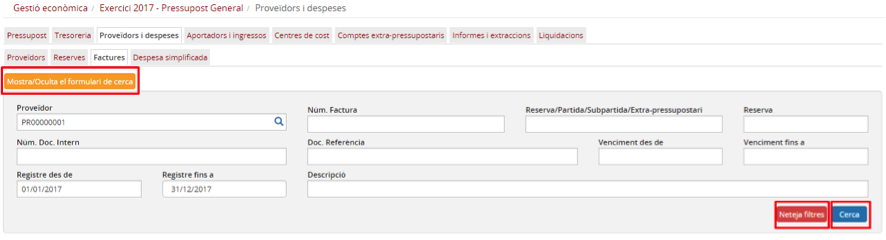

Imatge 6. Cercador de factures

* El botó *Mostra/Oculta el formulari de cerca*  permet ocultar el cercador i deixar més espai de la pantalla disponible per a la llista de factures (*Imatge 7. Cercador de factures ocult*).

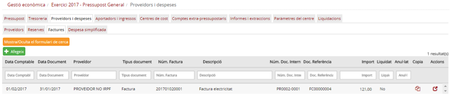

Imatge 7. Cercador de factures ocult

* El botó *Neteja Filtres*  neteja tots els camps del cercador (i els deixa en blanc) llevat dels camps *Registre* des de i *Registre fins a*, que tornen al seu valor per defecte (el primer dia de l’any del pressupost i l’últim dia de l’any del pressupost, respectivament).
* El botó *Cerca*  mostra les factures trobades en aplicar els criteris de cerca introduïts.

**c) Accions sobre les factures**

Des de la pantalla de llista de factures es poden fer diferents accions, que s’expliquen a continuació:

* Introduir la factura d’un proveïdor.
* Modificar una factura.
* Copiar una factura.
* Anul·lar una factura
* Abonar una factura
* Fer el pagament parcial o total de l’import pendent d’una factura
* Anul·lar un pagament

---

### 2.4.2.3. Introduir la factura d’un proveïdor

Quan el centre rep una factura d’un proveïdor, s’ha d’introduir (registrar) en la comptabilitat del mòdul de Gestió econòmica d’Esfer@. La factura només es podrà registrar si està en estat *Provisional o Aprovat*.

Per poder introduir la factura d’un proveïdor cal seguir el procediment següent:

* Des de la pantalla de llista de factures, premeu el botó *Afegeix*  (*Imatge 8. Introduir una nova factura*).

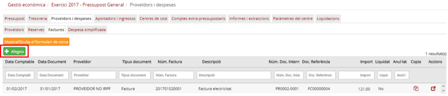

Imatge 8. Introduir una nova factura

* El programa mostra la pantalla de creació de factura (*Imatge 9. Pantalla de nova factura*).

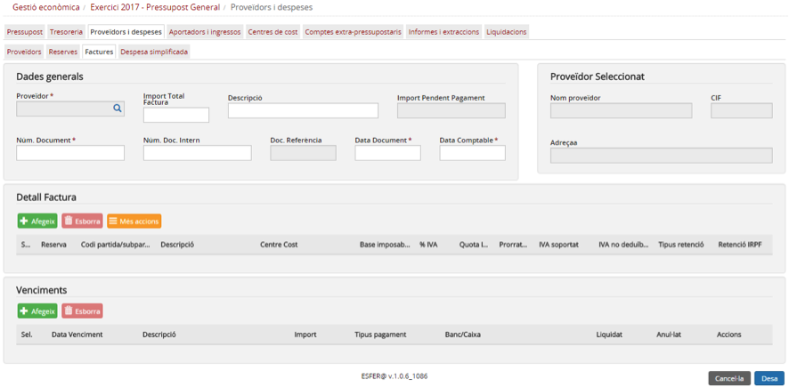

Imatge 9. Pantalla de nova factura

En la pantalla de creació de factura hi ha quatre blocs de dades:

* Dades generals
* Proveïdor seleccionat
* Detall de factura
* Venciments

La composició d’informació per a cadascun d’aquests blocs és la següent:

* *Dades generals*: contenen la informació principal de la factura, la que correspondria a les preguntes de “Què?” (concepte de la factura i dates) i “Quant?” (imports totals).

  + *Proveïdor*: codi del proveïdor de la factura. Cal seleccionar el proveïdor des de la pantalla de cerca de proveïdors (vegeu l’apartat 1. Selecció de proveïdor).
  + *Import total factura*: import total de la factura amb els impostos inclosos. Aquest import s’ha de correspondre amb la suma de les línies de detall de la factura (Base imposable més Quota d’IVA menys Retenció IRPF).
  + *Descripció*: descripció (concepte) de la factura.
  + *Import pendent de pagament*: camp calculat on es reflecteix la diferència entre l’import total de la factura i la suma dels imports de tots els venciments liquidats.
  + *Núm. Document*: número de factura que apareix en el document enviat pel proveïdor.
  + *Núm. Doc. Intern*: número de document intern que ha d’assignar l’usuari. (Opcional).
  + *Doc. Referència*: camp que no es pot modificar, ja que el número de document de referència el genera internament el sistema.
  + *Data Document*: data de la factura que apareix en el document enviat pel proveïdor.
  + *Data comptable*: En general, és la mateixa que la data de la factura (data del document) llevat que aquesta data estigui dins d’un període del qual ja s’han liquidat els impostos. El sistema valida que la data comptable sigui correcta i impedeix introduir valors que corresponguin a períodes ja liquidats.

* *Proveïdor seleccionat*: les dades del proveïdor que ha emès la factura. Aquesta secció correspondria a la pregunta de “Qui?”. Totes les dades d’aquesta secció s’obtenen des de la pantalla de selecció de proveïdors:

  + *Nom proveïdor*: nom (legal?) del proveïdor.
  + *CIF*: CIF del proveïdor.
  + *Adreça*: adreça del proveïdor.
* *Detall factura*: dades de com es fa la imputació de la factura contra el pressupost (partides o subpartides i reserves) o els comptes extrapressupostaris. Aquesta secció correspondria a la pregunta de “Com?” (com es reparteix l’import entre les diferents partides, subpartides, centres de cost o partides extrapressupostàries). El detall de la factura és una taula on es poden especificar una o més línies d’assignació. Cada una d’elles té els camps següents:

  + *Reserva*: El camp permet cercar una reserva prement el botó d’acció del mateix camp. En cas que ja s’hagi seleccionat una partida, no es pot seleccionar-ne una altra.
  + *Codi partida / subpartida / extrapressupostari*: El camp és només de lectura però permet cercar una reserva prement el botó d’acció del mateix camp. En cas que ja s’hagi seleccionat una reserva, no es pot seleccionar una partida / subpartida / compte extrapressupostari.
  + Descripció: descripció de la partida / subpartida / compte extrapressupostari.
  + *Centre de cost*: permet seleccionar un dels centres de cost que tingui assignat la partida o subpartida (mitjançant la dotació pressupostària). En cas que s’hagi triat un compte extrapressupostari, aquest camp està desactivat.
  + *Base imposable*: base imposable que s’assigna a aquesta línia.
  + %IVA: tipus d’impost que s’aplica a aquesta línia.
  + *Quota IVA*: camp que es calcula a partir dels camps Base imposable i %IVA. Tot i així, aquest camp és editable per l’usuari, ja que el càlcul generat pel sistema podria provocar problemes amb els decimals. L’usuari pot editar aquest camp per ajustar l’import total de la factura.
  + *Prorrata IVA*: valor de prorrata d’IVA que s’aplica al centre. Es correspon amb el percentatge de l’IVA que el centre es pot deduir. Aquest valor es recalcula cada any quan el centre fa la liquidació d’IVA al final de l’any. Aquest camp és informatiu i no editable.
  + *IVA suportat*: camp que es calcula a partir del camp Quota IVA i Prorrata IVA. Aquest valor es correspon amb la quantitat d’IVA que realment pot deduir el centre en funció del seu valor de prorrata. En cas que el centre no faci declaracions d’IVA aquest camp sempre val zero (0).
  + *IVA no deduïble*: aquest camp es calcula com la diferència entre els camps Quota IVA i IVA suportat. Aquest valor es correspon amb la quantitat d’IVA que el centre no es pot deduir en funció del seu valor de prorrata. En cas que el centre no faci declaracions d’IVA, aquest camp sempre té el mateix valor que el camp Quota IVA.
  + *Tipus retenció*: tipus de retenció d’IRPF i depèn del proveïdor que s’hagi seleccionat.
  + *Retenció IRPF*: camp que es calcula a partir dels camps Base imposable i Tipus retenció. Aquest camp és editable, ja que el càlcul generat pel sistema podria provocar problemes amb els decimals. L’usuari pot editar aquest camp per ajustar l’import total de la factura.

* *Venciments*: dades de quan i com es pagarà l’import de la factura. Permet definir diversos venciments (terminis) amb diverses formes de pagament. Aquesta secció correspondria a la pregunta de “Quan?” (dates de pagament) i “Com?” (mitjà de pagament). La secció de venciments és una taula on es poden especificar una o més línies cadascuna corresponent a un venciment. Cada una d’elles té els camps següents:

  + *Data venciment*: data del venciment.
  + *Descripció*: descripció del venciment.
  + *Import*: import del venciment.
  + *Tipus de pagament*: forma de pagament del venciment. Desplegable amb els valors següents.

    - *Transferència*: transferència bancària.
    - *Rebut*: rebut domiciliat.
    - *Xec*: xec bancari.
    - *Targeta de crèdit*: targeta de crèdit bancària.
    - *Efectiu*: pagament en efectiu.
    - *Compensació*: compte de compensació del proveïdor. Aquest valor només apareixerà disponible si el compte de compensació del proveïdor té saldo perquè s’hagi fet l’abonament d’una factura i en lloc de recuperar els diners, s’hagi acordat compensar-ho en la factura següent.
    - *No pagable*: Cal seleccionar-lo si per algun motiu la factura no es pot pagar (per exemple que el proveïdor hagi desaparegut).
  + *Banc/Caixa*: camps desplegables per seleccionar el banc o caixa contra els quals es fa el pagament. El contingut de la llista de selecció s’omple en funció del valor seleccionat al camp Tipus pagament.
  + *Liquidat*: estat de liquidació del venciment:

    - *Sí*: el venciment ha estat liquidat (pagat).
    - *No*: el venciment no ha estat liquidat (pagat). Valor per defecte.
  + *Anul·lat*: estat d’anul·lació del venciment:

    - *Sí*: el venciment ha estat anul·lat.
    - *No*: el venciment no ha estat anul·lat. Valor per defecte.
  + *Accions*: botons de les accions que es poden fer sobre els venciments.

    -  *Pagar*: només està actiu si el venciment no està liquidat.
    -  *Anul·lar*: només està actiu si el venciment està liquidat.

**Detall del procediment d’entrada d’una factura:**

Els passos a seguir per introduir una nova factura són els següents:

1. Selecció del proveïdor: és imprescindible seleccionar un proveïdor com a primer pas de la introducció de la factura. En cas contrari, no es pot detallar la factura ni afegir venciments.
2. Completar les dades generals de la factura.
3. Introduir el detall de la factura.
4. Afegir venciments a la factura.
5. Desar la factura.

A continuació es detallen cada un d’aquest passos.

---

**1. Selecció de proveïdor**

Per seleccionar un proveïdor cal seguir el procediment següent:

* Des de la pantalla d’entrada de factura, premeu el botó de cerca  del camp Proveïdor (*Imatge 10. Seleccionar proveïdor*).

Imatge 10. Seleccionar proveïdor

* Es mostra la pantalla de selecció del proveïdor (*Imatge 11. Pantalla de selecció de proveïdor en crear una factura*).

Imatge 11. Pantalla de selecció de proveïdor en crear una factura

* Apareix una llista amb tots els proveïdors del centre amb els camps següents:

  + *Codi intern*: codi intern del proveïdor.
  + *CIF*: CIF del proveïdor.
  + *Nom comercial*: nom comercial del proveïdor.
  + *Nom*: nom (mercantil) del proveïdor.
  + *Municipi*: municipi on té l’adreça el proveïdor.
* Per cada un dels camps anteriors hi ha un camp a la capçalera de la pantalla (en forma de caixeta) que permet filtrar els continguts de la taula.
* Seleccioneu un proveïdor (només un). No està permès seleccionar-ne més d’un.
* Premeu el botó *Desa* .

  + En cas que premeu el botó *Cancel·la* , tornareu a la pantalla de creació de factures.
* El programa torna a la pantalla de creació de factura on ja apareixen les dades del proveïdor seleccionat (*Imatge 12. Proveïdor seleccionat*).

Imatge 12. Proveïdor seleccionat

---

**2. Completar les dades generals de la factura**

Cal introduir la resta de camps de la secció *Dades Generals (Imatge 13. Dades generals)*:

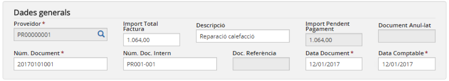

Imatge 13. Dades generals

* *Import total factura*: import total de la factura.
* *Descripció*: descripció (concepte) de la factura.
* *Núm. Document*: número de la factura que apareix en el document que ha emès el proveïdor. Ha de ser únic per al proveïdor seleccionat (no hi pot haver cap altra factura del mateix proveïdor amb el mateix número).
* *Núm. Doc. Intern*: número de document intern triat pel mateix usuari. Ha de ser únic (no hi pot haver cap altra factura amb el mateix número de document intern). (opcional).
* *Data document*: data de la factura que apareix en el document que ha emès el proveïdor.
* *Data comptable*: data comptable de la factura.

  + En general, la data comptable és la mateixa que la data de la factura (data document), llevat que aquesta data estigui dins un període del qual ja s’han liquidat els impostos. El sistema valida que la data comptable sigui correcta i impedeix introduir valors que corresponguin a períodes ja liquidats.
  + La data comptable ha d’estar dins de l’any del pressupost.

---

**3. Introduir el detall de la factura**

En el detall de la factura es desglossa la manera en què l’import total de la factura s’imputa al pressupost o als comptes extrapressupostaris. Dins de la secció *Detall factura* es poden detallar una o més línies amb diferents reserves, partides/subpartides (amb els centres de cost que tinguin associats) o comptes extrapressupostaris.

Per poder afegir una línia a la taula de detall de factura cal seguir el procediment següent (*Imatge 14. Afegir una nova línia de detall*):

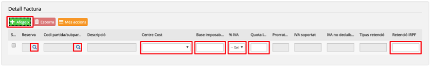

Imatge 14. Afegir una nova línia de detall

* Premeu el botó Afegeix .
* S’afegeix una nova línia en blanc a la taula.
* Si la factura s’imputa contra una reserva, premeu el botó de cerca en el camp Reserva.

  + Es mostra la pantalla de cerca de reserves (*Imatge 15. Pantalla de cerca de reserves*).

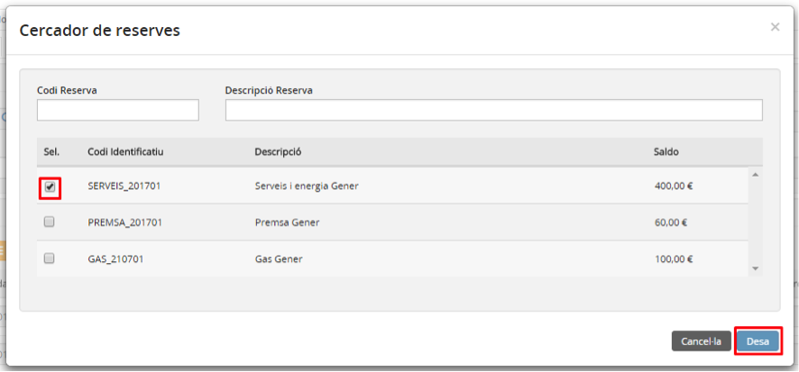

Imatge 15. Pantalla de cerca de reserves

* *Imatge 15. Pantalla de cerca de reserves*. La pantalla conté una llista de totes les reserves del pressupost amb els camps següents:

  + *Codi identificatiu*: codi que s’ha assignat a la reserva en crear-la
  + *Descripció*: descripció de la reserva.
  + *Saldo*: saldo disponible de la reserva, pendent d’executar.
* Seleccioneu la reserva contra la qual voleu fer la imputació.
* Premeu el botó *Desa* .

  + En cas que premeu el botó *Cancel·la* , tornareu a la pantalla de creació de factures sense haver seleccionat cap reserva.
* Les dades de la reserva s’incorporen a la línia de detall que s’està creant.

  + En cas que la reserva tingui més d’una línia de dotació, es crea una línia de detall a la factura per cada línia de dotació de la reserva.
  + Es desactiven els botons de cerca  dels camps *Reserva i Partida / Subpartida / Extrapressupostari*.

* Si la factura no s’imputa contra una reserva i va directament contra una partida/subpartida o un compte extrapressupostari, premeu el botó de cerca  del camp *Partida / Subpartida / Extrapressupostari*.

  + Es mostra la pantalla de cerca de partides/subpartides i comptes extrapressupostaris (*Imatge 16. Pantalla de cerca de partides/ subpartides o comptes extrapressupostaris*).

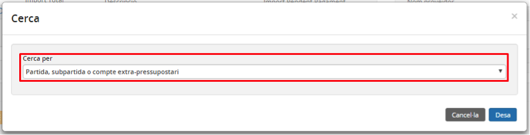

Imatge 16. Pantalla de cerca de partides/subpartides o comptes extrapressupostaris

* Obrir el desplegable *Cerca per* i triar el tipus d’entitat que s’està buscant:

  + *Partides/subpartides*.
  + *Compte extrapressupostari*. br>En ambdós casos, es mostra una taula amb les partides i subpartides o amb els comptes extrapressupostaris. La taula té els camps següents (*Imatge 17. Selecció de partida/subpartida o compte extrapressupostari*):

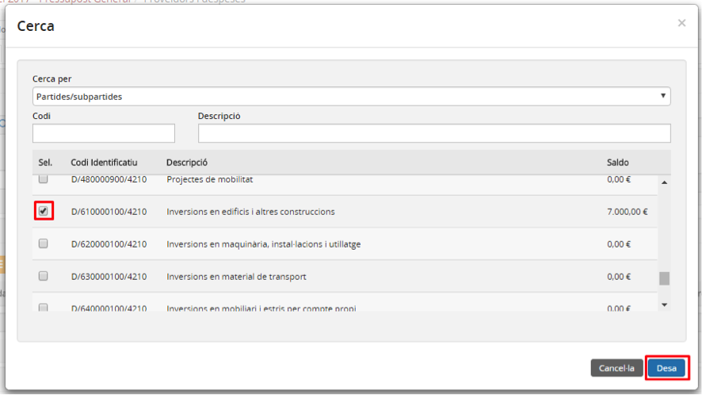

Imatge 17. Selecció de partida/subpartida o compte extrapressupostari

* *Codi identificatiu*: codi de la partida/subpartida o compte extrapressupostari (segons s’escaigui).
* *Descripció*: nom de la partida/subpartida o compte extrapressupostari (segons s’escaigui).
* *Saldo*: saldo disponible a la partida/subpartida o compte extrapressupostari (segons s’escaigui).

* Seleccioneu la partida/subpartida o compte extrapressupostari (segons s’escaigui).
* Premeu el botó *Desa* .

  + En cas que premeu el botó Cancel·la , tornareu a la pantalla de creació de factures sense haver seleccionat cap partida/subpartida o compte extrapressupostari.
* Les dades de la partida/subpartida o compte extrapressupostari s’incorporen a la línia de detall que s’està creant.

  + Es desactiven els botons de cerca  dels camps *Reserva i Partida / Subpartida / Extrapressupostari*.
  + En cas que s’hagi seleccionat un compte extrapressupostari, es desactiva el camp *Centre de cost*.
  + La llista del desplegable del camp *Centre de cost* s’omple amb els centres de cost que tingui assignats la partida.

* Introduir la resta de camps editables de la línia:

  + *Centre de cost*: Només en cas que la línia estigui detallada contra una partida o subpartida (o una reserva).
  + *Base imposable*: base imposable aplicable a aquesta partida/subpartida i centre de cost, o compte extrapressupostari.
  + *%IVA*: tipus d’IVA aplicable a aquesta partida/subpartida i centre de cost, o compte extrapressupostari.
  + *Quota IVA*: tot i que la quota d’IVA es recalcula automàticament quan canvia el camp *Base imposable* o *%IVA*, es pot editar per ajustar-la amb l’import total de la factura en cas que hi hagi problemes amb els decimals.
  + *Retenció IRPF*: tot i que la retenció d’IRPF es recalcula automàticament quan canvia el camp Base imposable, es pot editar per ajustar-la amb l’import total de la factura en cas que hi hagi problemes amb els decimals.

D’aquesta manera es poden afegir una o més línies de detall (Imatge 18. Línies de detall creades).

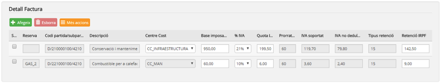

Imatge 18. Línies de detall creades

En cas que l’usuari s’hagi equivocat en la tria de la reserva o la partida/subpartida o compte extrapressupostari, cal esborrar la línia i crear-la de nou.

Per esborrar una línia de la taula de detall cal seguir el procediment següent (*Imatge 19. Esborrar detall factura*):

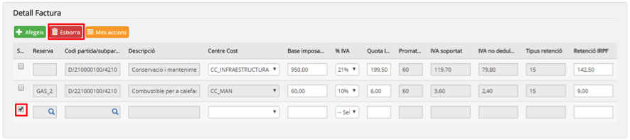

Imatge 19. Esborrar detall factura

* Seleccioneu la línia de detall que voleu esborrar. Podeu esborrar-ne més d’una a la vegada.
* Premeu el botó Esborra .

  + La línia seleccionada és esborrada.

Durant el procés de detall de la factura es poden consultar les totalitzacions de les dades ja introduïdes. Per obtenir aquesta informació, premeu el botó *Més accions*  i trieu una de les opcions (*Imatge 20. Consulta totalitzacions detall*):

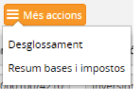

Imatge 20. Consulta totalitzacions detall

* *Desglossament*: extreu una pantalla amb informació totalitzada per partida/subpartida i centre de cost (*Imatge 21. Totalització per partida/subpartida i centre de cost*).

  + El títol d’aquesta pantalla es correspon amb el número de document i l’import total de la factura.
  + Premeu el botó *Confirma*  per tancar la pantalla i tornar a la pantalla de creació de factura.

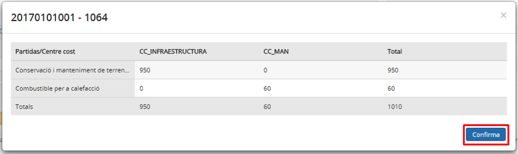

Imatge 21. Totalització per partida/subpartida i centre de cost

* *Resum bases i impostos*: extreu una pantalla amb informació totalitzada per tipus d’IVA (*Imatge 22. Totalització de bases i impostos*).

  + Premeu el botó *Confirma*  per tancar la pantalla i tornar a la pantalla de creació de factura.

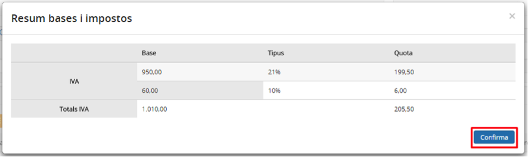

Imatge 22. Totalització de bases i impostos

---

**4. Afegir venciments**

Els venciments permeten definir quins seran els pagaments que es faran per aquesta factura. Cada venciment té la seva pròpia data, l’import i el tipus de pagament.

Per afegir un nou venciment a la taula de venciments cal seguir el procediment següent (*Imatge 23. Crear un nou venciment*):

Imatge 23. Crear un nou venciment

* Premeu el botó *Afegeix* .
* S’afegeix una nova línia a la taula de venciments.
* Completar els camps del venciment:

  + *Data venciment*: data prevista per al venciment.
  + *Descripció*: descripció del venciment.
  + *Import*: import previst per al venciment.
  + *Tipus de pagament*: forma de pagament del venciment. Desplegable amb els valors següents:

    - *Transferència*: transferència bancària.
    - *Rebut*: rebut domiciliat.
    - *Xec*: xec bancari.
    - *Targeta de crèdit*: targeta de crèdit bancària.
    - *Efectiu*: pagament en efectiu.
    - *Compensació*: compte de compensació del proveïdor. Aquest valor només apareixerà si el compte de compensació del proveïdor té saldo perquè s’hagi fet un abonament d’una factura i, en lloc de recuperar els diners, s’hagi acordat compensar-ho en la factura següent.
    - *No pagable*: seleccioneu-lo si per algun motiu la factura no es pot pagar (per exemple, que el proveïdor hagi desaparegut).
  + *Banc/Caixa*: camps desplegables per seleccionar el banc o caixa contra els quals es fa el pagament. El contingut de la llista de selecció s’omple en funció del valor seleccionat al camp *Tipus pagament*.

    - Si el camp *Tipus pagament* val *Transferència, Rebut, Xec o Targeta de crèdit*, la llista s’omple amb tots els bancs actius del centre.
    - Si el camp *Tipus pagament* val *Efectiu*, la llista s’omple amb totes les caixes d’efectiu actives del centre.
    - Si el camp *Tipus pagament* val *Compensació* s’omple amb el valor *Compte compensatori*.
    - Si el camp *Tipus pagament* val *No Pagable* s’omple amb la partida d’ingrés que estigui marcada com a *Altres ingressos*.
  + En cas que en el moment de crear el venciment aquest ja estigui pagat, es pot prémer el botó acció Pagar 

    - El camp *Liquidat* canviarà el seu valor (No → Sí).

D’aquesta manera es poden afegir un o més venciments (*Imatge 24. Venciments creats*). La suma dels imports de tots els venciments ha de coincidir amb el camp Import total factura de la secció *Dades generals*.

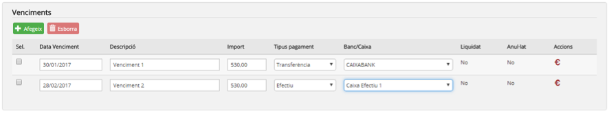

Imatge 24. Venciments creats

En cas que l’usuari s’hagi equivocat, en la creació del venciment, podrà esborrar-lo i crear-lo de nou. Durant la creació de la factura, considerant que la factura no ha estat registrada, els venciments es poden esborrar encara que s’hagin marcat com a liquidats. Una vegada la factura ha estat registrada, els venciments liquidats ja no es poden esborrar i caldrà anul·lar-los.

Per esborrar una línia de la taula de venciments cal seguir el procediment següent (*Imatge 25. Esborrar venciments*):

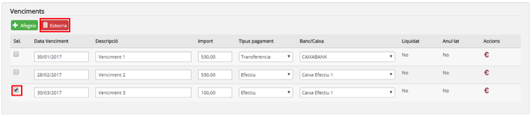

Imatge 25. Esborrar venciments

* Seleccioneu la línia de venciment que voleu esborrar. Podeu esborrar-ne més d’una a la vegada.
* Premeu el botó *Esborra* .

  + La línia seleccionada és esborrada.

---

**5. Desar la factura**

Una vegada que s’han completat tots els passos anteriors cal desar la factura.
Per desar la factura cal seguir el procediment següent (*Imatge 26. Desar la factura*):

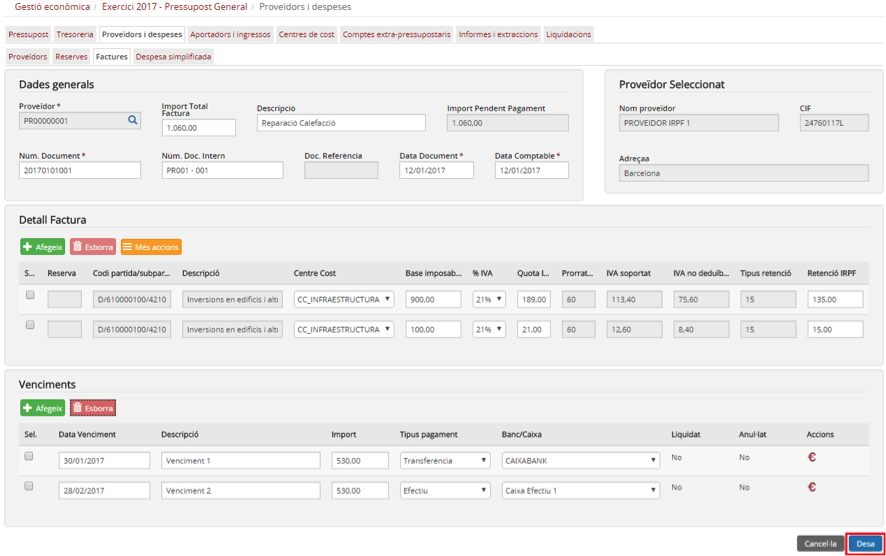

Imatge 26. Desar la factura

* Premeu el botó *Desa* .

  + En cas que premeu el botó *Cancel·la* , tornareu a la pantalla de la llista de factures (*Imatge 4. Llista de factures*) sense desar-la.
* El sistema fa les validacions de la factura. Les principals validacions són:

  + El camp *Data comptable* ha d’estar dins de l’any del pressupost i dins d’un període no liquidat d’impostos.
  + La suma de les línies de detall (*Base imposable + Quota IVA – Retenció IRPF*) ha de coincidir amb el camp Import total factura.
  + La suma de tots els imports dels venciments ha de coincidir amb el camp *Import total factura*.
  + Validacions de saldo disponible (segons s’escaigui).

    - Saldo de la reserva.
    - Saldo de la partida/subpartida i centre de cost.
    - Saldo del compte extrapressupostari.
  + Validacions de saldo disponible als bancs i caixes especificats en els venciments, els quals s’hagin marcat com a *Liquidats*.
* En cas que s’hagin passat les validacions, es desa la factura i es torna a la pantalla de llista de factures (*Imatge 27. Factura creada*) on ja apareix la factura creada.

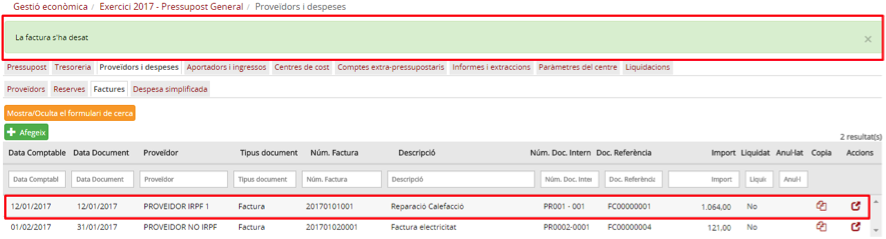

Imatge 27. Factura creada

* Si una validació falla es mostra un missatge d’errada a l’usuari (*Imatge 28. Exemple de missatge d'errada*) per tal que pugui esmenar-la i tornar-ho a intentar.

Imatge 28. Exemple de missatge d'errada

### 2.4.2.4. Modificar una factura

És possible fer algunes modificacions sobre una factura creada. L’abast de les modificacions que es poden fer en una factura és bastant limitat. En cas que les modificacions a fer no es puguin fer des de l’operació de modificació, caldrà anul·lar la factura o abonar-la (segons s’escaigui) i crear-la de nou (però hi ha l’opció de crear-la de nou agafant com a referència la que hem anul·lat).

Els camps de la factura que es poden modificar són els següents:

* *Núm. Document*: número de factura que apareix al document emès pel proveïdor.
* *Núm. Doc. Intern*: número de document intern introduït per l’usuari.
* *Data document*: data de factura que apareix al document emès pel proveïdor.
* Informació dels venciments no liquidats. Els venciments liquidats només es poden anul·lar (vegeu *Anul·lar un pagament*).

Per modificar una factura cal seguir el procediment següent:

* Des de la pantalla de la llista de factures, premeu el botó d’acció de la factura que voleu modificar (*Imatge 29. Modificar factura*):

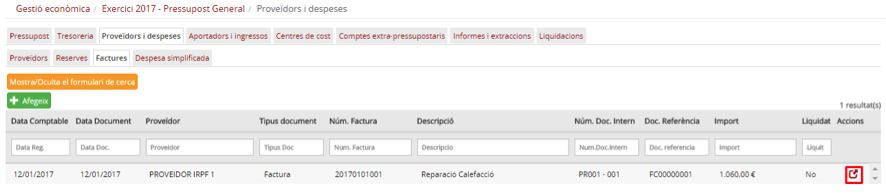

Imatge 29. Modificar factura

* Es mostra la pantalla de detall de la factura (*Imatge 30. Pantalla de detall de la factura*), amb tota la informació de la factura, però en mode consulta.

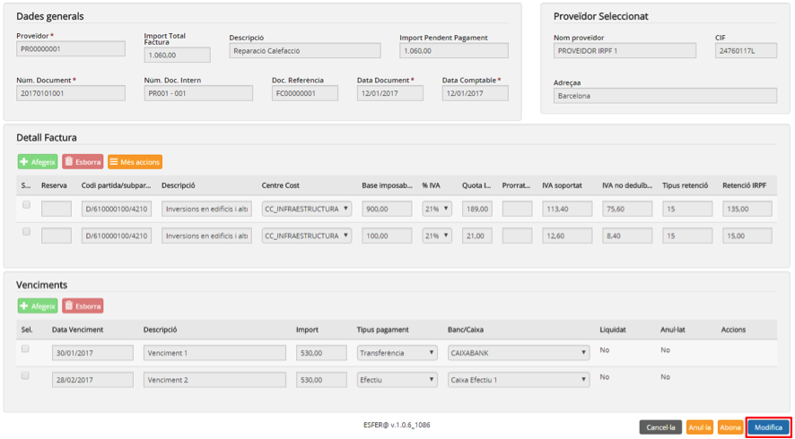

Imatge 30. Pantalla de detall de la factura

* Per accedir a fer modificacions, premeu el botó *Modifica* .

  + En cas que premeu el botó *Cancel·la*  tornareu a la pantalla de la llista de factures (*Imatge 29. Modificar factura*) sense haver-la modificat.
* Es mostra la pantalla de modificació de la factura (*Imatge 31. Factura en modificació*).

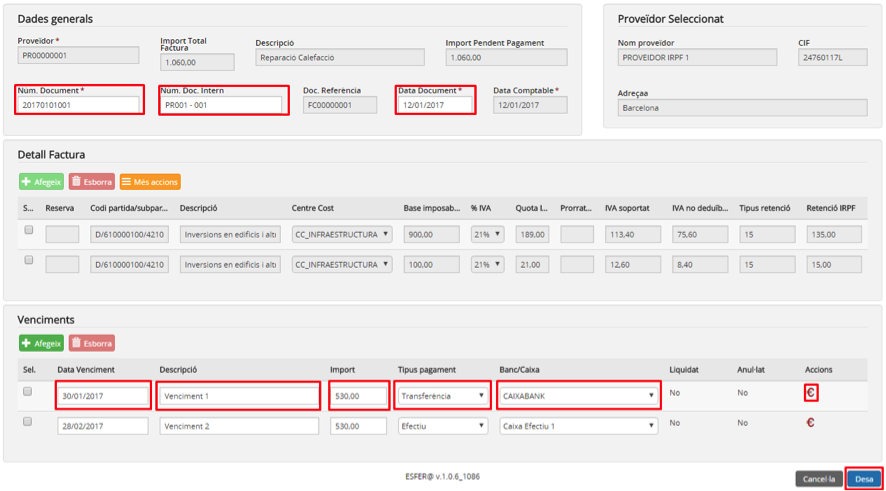

Imatge 31. Factura en modificació

* En aquest moment es poden modificar les dades de la factura.
* Premeu el botó *Desa* .

  + En cas que premeu el botó *Cancel·la*  tornareu a la pantalla de detall de la factura (Imatge 30. Pantalla de detall de la factura) sense desar els canvis.
* Si no hi ha errades, es guarda la informació modificada. El programa torna a la pantalla de la llista de factures. Pel contrari, si hi ha errades, cal esmenar-les i tornar a intentar l’acció de *Desar*.

---

### 2.4.2.5. Anul·lar una factura

En cas que s’hagi creat una factura errònia el sistema permet anul·lar-la. Els casos típics que poden portar a aquesta situació són els següents:

* S’ha creat una factura amb dades errònies que no es poden modificar:

  + Errada en data comptable.
  + Errada en l’import.
  + Errada en el proveïdor.
  + Altres errades.
* S’ha creat una factura duplicada.

Només es poden anul·lar factures que corresponguin a l’any del pressupost i que no hagin estat incloses en cap liquidació d’impostos (IVA, IRPF). En cas que no es compleixin aquestes condicions, la factura no es podrà anul·lar i caldrà generar un abonament.

Per anul·lar una factura cal seguir el procediment següent:

* Des de la pantalla de la llista de factures, premeu el botó d’acció de la factura que voleu anul·lar (*Imatge 32. Anul·lar factura*):

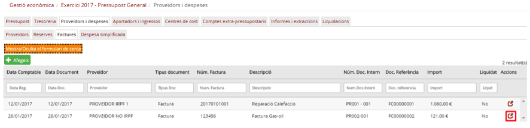

Imatge 32. Anul·lar factura

* El programa mostra la pantalla de detall de la factura (Imatge 30. Pantalla de detall de la factura). Aquesta pantalla mostra tota la informació de la factura però en un format que només permet l’opció consulta.

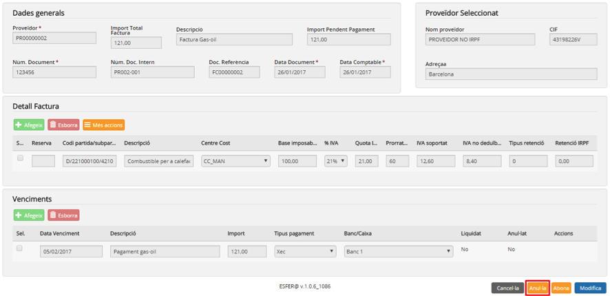

Imatge 33. Pantalla de detall de la factura

* Premeu el botó *Anul·la* .

  + En cas que premeu el botó Cancel·la , tornareu a la pantalla de la llista de factures (*Imatge 32. Anul·lar factura*) sense haver-la anul·lat.
* Introduïu el motiu de l’anul·lació (*Imatge 34. Motiu anul·lació*).

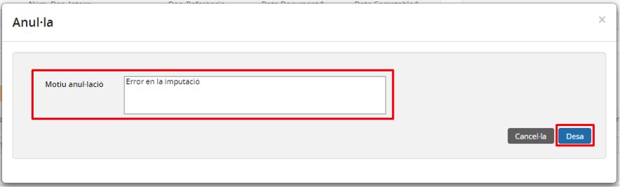

Imatge 34. Motiu anul·lació

* Premeu el botó *Desa* .

  + En cas que premeu el botó *Cancel·la* , tornareu a la pantalla de detall de la factura (Imatge 33. Pantalla de detall de la factura) sense haver-la anul·lat.
* Assumint que la factura s’ha anul·lat per alguna errada, es facilita a l’usuari tornar-la a crear: es mostra la pantalla de creació de factura amb les mateixes dades de la factura que s’acaba d’anul·lar per tal que l’usuari pugui esmenar-les i crear una nova factura, aquesta vegada, correcta (*Imatge 35. Crear de nou una factura anul·lada*).

  + El procés de creació d’aquesta nova factura és el mateix que s’ha descrit a *Introduir la factura d’un proveïdor*.
  + Si no voleu crear de nou la factura, premeu el botó Cancel·la , i el programa torna a la pantalla de llista de factures, sense crear una nova factura.

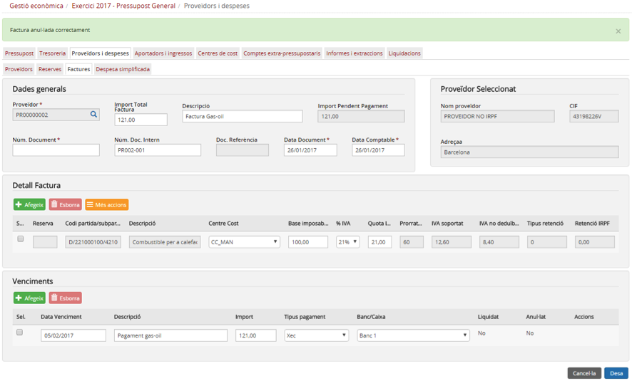

Imatge 35. Crear de nou una factura anul·lada

---

### 2.4.2.6. Abonar una factura

Quan per algun motiu el proveïdor anul·la (total o parcialment) una factura, emet un abonament que s’ha de registrar en el mòdul de Gestió econòmica d’Esfer@.

Abonar una factura és un cas similar a l’anul·lació però amb condicions pròpies (que van més enllà de les restriccions pròpies del cas d’anul·lació d’una factura):

* Un abonament pot ser total (de tot l’import d’una factura) o parcial.
* Es pot abonar una factura d’un any anterior o d’una factura del mateix any del pressupost però per la qual ja s’hagin liquidat els impostos (IVA, IRPF).

Alguns casos típics en què cal registrar un abonament:

* S’ha registrat una factura d’un proveïdor de manera correcta, però es tracta d’una factura indeguda. Després de fer una reclamació, el proveïdor envia un abonament per la factura.

  + En aquest cas es faria un abonament total, per tot l’import de la factura.
* S’ha registrat una factura per 10 ítems (llibres, per exemple) però es detecta que dels 10 rebuts n’hi ha 2 que estan defectuosos. Després de fer una reclamació, el proveïdor envia un abonament pels dos ítems defectuosos.

  + En aquest cas es faria un abonament parcial.
* S’ha registrat una factura a un professional amb una retenció d’IRPF incorrecta i en un període ja liquidat. Cal fer un abonament total.

Per abonar una factura cal seguir el procediment següent:

* Des de la pantalla de la llista de factures, premeu el botó d’acció de la factura que voleu abonar (*Imatge 36. Abonar factura*).

Imatge 36. Abonar factura

* Es mostra la pantalla de detall de la factura (Imatge 30. Pantalla de detall de la factura). Aquesta pantalla mostra tota la informació de la factura però en format de consulta.

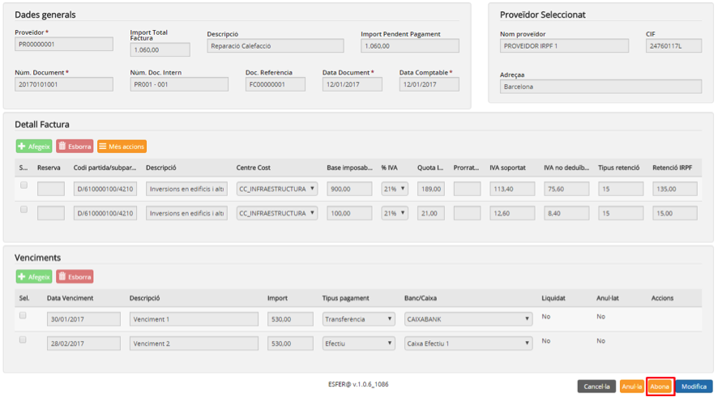

Imatge 37. Pantalla de detall de la factura

* Premeu el botó *Abona* .

  + En cas que premeu el botó *Cancel·la* , tornareu a la pantalla de la llista de factures (*Imatge 36. Abonar factura*) sense abonar la factura.
* Es mostra la pantalla de creació d’abonament (*Imatge 38. Creació d'abonament*). Aquest pàgina conté les mateixes dades que la factura que s’està abonant però amb les restriccions següents:

  + Tots els imports són negatius.
  + El proveïdor no es pot modificar perquè és el mateix de la factura.
  + *Import total factura*: per defecte apareix la quantitat total de la factura. En cas que es vulgui fer un abonament parcial, caldrà canviar aquesta quantitat per la quantitat que es vulgui abonar realment.
  + *Descripció*: cal introduir la descripció pròpia de l’abonament.
  + *Núm. document*: cal introduir el número de l’abonament emès pel proveïdor.
  + *Data document*: cal introduir la data de l’abonament emès pel proveïdor.
  + *Data comptable*: cal introduir la data comptable de l’abonament.

    - En general, la data comptable és la mateixa que la data de l’abonament (data document) llevat que aquesta data estigui dins un període del qual ja s’han liquidat els impostos. El sistema valida que la data comptable sigui correcta i impedeix introduir valors que corresponguin a períodes ja liquidats.
    - La data comptable ha d’estar dins de l’any del pressupost.
* Dins la secció *Detall de l’abonament* es mostren les partides/subpartides (i centres de cost) o comptes extrapressupostaris que hi havia a la factura amb les mateixes quantitats. En cas que es vulgui fer un abonament parcial, caldrà canviar aquestes quantitats per la quantitat que es vulgui abonar realment i fer que s’ajusti a la quantitat del camp *Import total factura*.

  + En cas que es tracti d’una factura d’un exercici anterior i les partides (o comptes extrapressupostaris) ja no existeixin en el pressupost de l’any en curs, la línia es carregarà en blanc (només amb els imports). L’usuari haurà d’assignar les partides/subpartides (i centres de cost) o comptes extrapressupostaris o esborrar aquestes línies i crear-ne de noves.

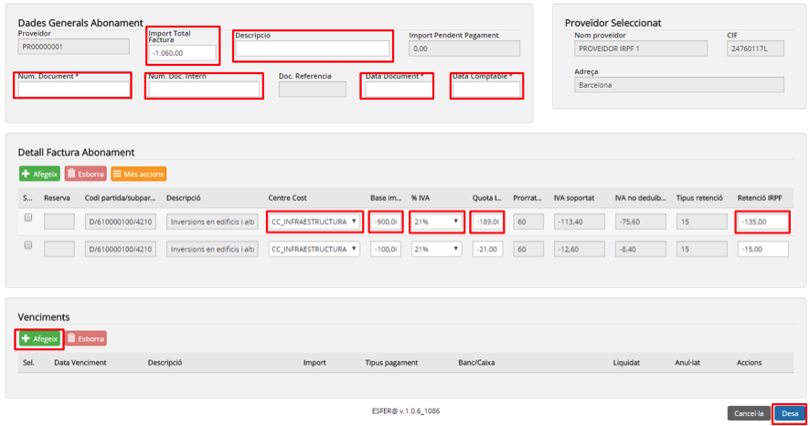

Imatge 38. Creació d'abonament

---

**a) Venciments en l’abonament**

Per defecte l’abonament es crea sense cap venciment.

El procediment per crear els venciments en l’abonament és el següent (*Imatge 39. Venciments abonament*):

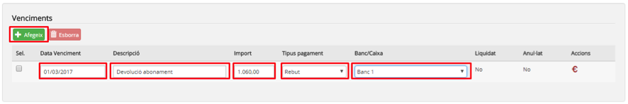

Imatge 39. Venciments abonament

* Premeu el botó *Afegeix* .
* S’afegeix una nova línia a la taula de venciments.
* Completeu els camps del venciment:

  + *Data venciment*: data prevista per al venciment.
  + *Descripció*: descripció del venciment.
  + *Import*: import previst per al venciment.
  + *Tipus de pagament*: forma de pagament del venciment. Desplegable amb els valors següents.

    - *Transferència*: transferència bancària.
    - *Rebut*: rebut domiciliat.
    - *Xec*: xec bancari.
    - *Targeta de crèdit*: targeta de crèdit bancària.
    - *Efectiu*: pagament en efectiu.
    - *Compensació*: compte de compensació del proveïdor.
    - *No cobrable*: seleccioneu si per algun motiu l’abonament no es pot cobrar (per exemple que el proveïdor hagi desaparegut).
  + *Banc/Caixa*: camps desplegables per seleccionar el banc o caixa contra els quals es fa el pagament. El contingut de la llista de selecció s’omple en funció del valor seleccionat al camp *Tipus pagament*.

    - Si el camp *Tipus pagament val Transferència, Rebut, Xec o Targeta de crèdit*, la llista s’omple amb tots els bancs actius del centre.
    - Si el camp *Tipus pagament* val *Efectiu*, la llista s’omple amb totes les caixes d’efectiu actives del centre.
    - Si el camp *Tipus pagament* val *Compensació* s’omple amb el valor *Compte compensatori*.
    - Si el camp *Tipus pagament* val *No Pagable* s’omple amb la partida d’ingrés que estigui marcada com a *Altres ingressos*.
  + En cas que en el moment de crear el venciment aquest ja estigui cobrat, premeu el botó d’acció *Pagar* .

    - El camp *Liquidat* canviarà el seu valor (No → Sí).

D’aquesta manera es poden afegir un o més venciments (*Imatge 40. Venciments creats*). La suma dels imports de tots els venciments ha de coincidir amb el camp *Import Total Factura* de la secció *Dades generals*.

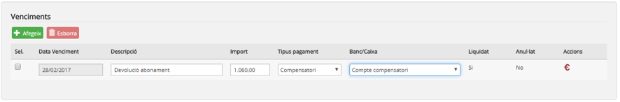

Imatge 40. Venciments creats

En cas que l’usuari s’hagi equivocat, en la creació del venciment, podrà esborrar-lo i crear-lo de nou.

Per esborrar una línia de la taula de venciments cal seguir el procediment següent (*Imatge 41. Esborrar venciments*):

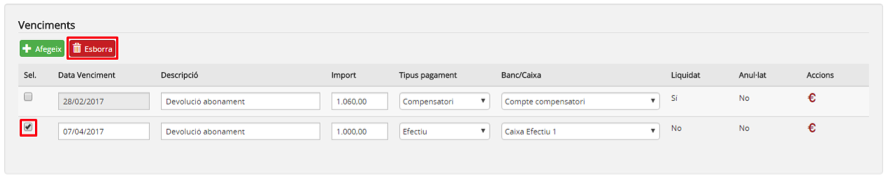

Imatge 41. Esborrar venciments

* Seleccioneu la línia de venciment que voleu esborrar. Podeu esborrar-ne més d’una a la vegada.
* Premeu el botó *Esborra* .

  + La línia seleccionada és esborrada.

**b) Desar l’abonament**

Una vegada que s’han completat tots els passos anteriors cal desar l’abonament.

Per desar l’abonament cal seguir el procediment següent (*Imatge 42. Desar l'abonament*):

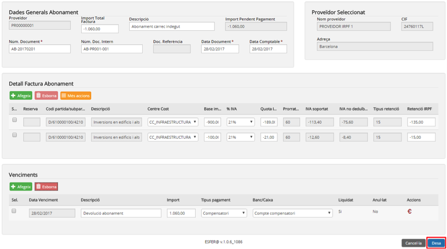

Imatge 42. Desar l'abonament

* Premeu el botó *Desa* .

  + En cas que premeu el botó *Cancel·la* , tornareu a la pantalla de la llista de factures (Imatge 36. Abonar factura) sense haver-la desat.
* El sistema fa les validacions de l’abonament. Les principals validacions són:

  + El camp *Data comptable* ha d’estar dins de l’any del pressupost.
  + La suma de les línies de detall (*Base imposable + Quota IVA – Retenció IRPF*) ha de coincidir amb el camp *Import total factura*.
  + La suma de tots els imports dels venciments ha de coincidir amb el camp *Import total factura*.
  + Validacions de contra l’imputat (segons s’escaigui).

    - Saldo de la reserva.
    - Saldo de la partida/subpartida i centre de cost.
    - Saldo del compte extrapressupostari.
* En cas que s’hagin passat les validacions, es desa l’abonament i es torna a la pantalla de la llista de factures (*Imatge 43. Abonament creat*) on ja apareix l’abonament creat.
* Si s’ha fet un abonament parcial, se’n poder fer més fins que s’arribi a assolir el total de la factura que s’està abonant.

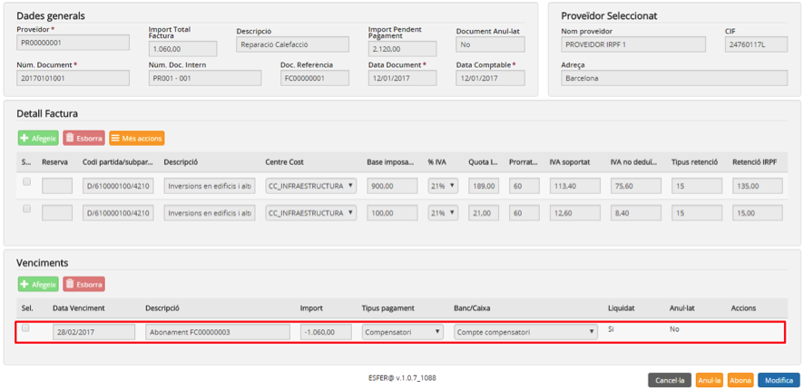

Imatge 43. Abonament creat

* En cas que s’hagi triat un venciment amb *Tipus de pagament: Compensatori*, també es modificarà la factura original:

  + S’eliminen els venciments no liquidats.
  + Si l’import pendent de liquidar de la factura és igual al del venciment compensatori de l’abonament:

    - Es crea un nou venciment amb *Tipus de pagament: Compensatori* i estat *Liquidat: Sí* pel mateix import del venciment compensatori de l’abonament.
  + Si l’import pendent de liquidar de la factura és superior al del venciment compensatori de l’abonament:

    - Es crea un nou venciment amb *Tipus de pagament: Compensatori* i estat *Liquidat: Sí* pel mateix import del venciment compensatori de l’abonament.
    - Es crea un nou venciment no liquidat per l’import restant.
  + Si l’import pendent de liquidar de la factura és inferior al del venciment compensatori de l’abonament:

    - Es crea un nou venciment amb *Tipus de pagament: Compensatori* i estat *Liquidat: Sí* per l’import pendent de liquidar de la factura.
    - L’import restant del venciment compensatori de l’abonament quedarà al compte compensatori del proveïdor i es podrà fer servir en els venciments de la propera factura del mateix proveïdor que es registri.

Si s’entra de nou a la pantalla de consulta (*Imatge 44. Factura abonada amb compensació*) de la factura que s’ha abonat, es pot veure com han canviat els venciments i apareix un nou venciment de tipus Compte compensatori.

Imatge 44. Factura abonada amb compensació

---

### 2.4.2.7. Pagament parcial o total de l’import pendent d’una factura

Moltes vegades, els venciments de les factures són posteriors a la data de registre. Això implica que el registre del pagament de la factura en la gestió comptable normalment serà posterior al registre de la factura.

Pel fet que els venciments estan estretament lligats a la factura, per poder registrar-ne el pagament caldrà entrar en la modificació de la factura i marcar el/s venciment/s com a pagats.

Per poder marcar un venciment com a pagat cal seguir el procediment següent:

* Des de la pantalla de la llista de factures, premeu el botó d’acció de la factura de la qual voleu registrar el pagament (*Imatge 45. Pagament total o parcial d'una factura*).

Imatge 45. Pagament total o parcial d'una factura

* Es mostrarà la pantalla de detall de la factura (*Imatge 46. Pantalla de detall de la factura*). Aquesta pantalla mostra tota la informació de la factura, però en mode consulta.

Imatge 46. Pantalla de detall de la factura

* Premeu el botó *Modifica* .

  + En cas que premeu el botó *Cancel·la* , tornareu a la pantalla de la llista de factures (Imatge 45. Pagament total o parcial d'una factura) sense modificar la factura.
* Es mostra la pantalla de modificació de la factura (*Imatge 47. Registrar pagament*).

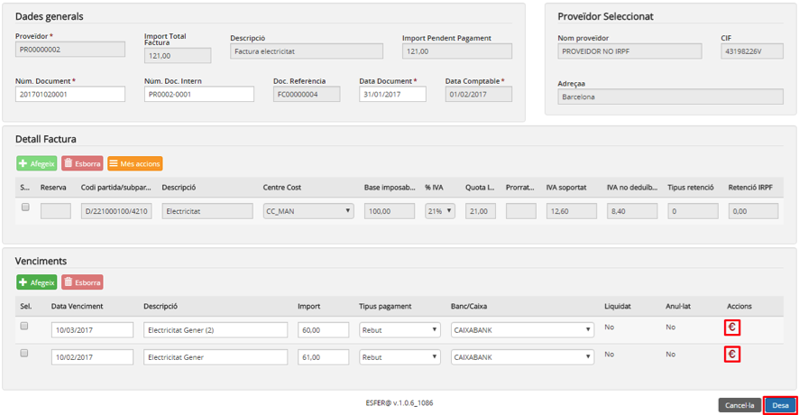

Imatge 47. Registrar pagament

* Premeu el botó d’acció  sobre el venciment per registrar el pagament.

  + El venciment canvia l’estat del camp *Liquidat de No a Sí (Imatge 48. Venciment liquidat)*.

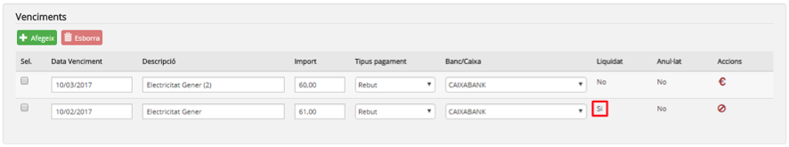

Imatge 48. Venciment liquidat

* Premeu el botó *Desa* .

  + En cas que es premi el botó *Cancel·la*  es torna a la pantalla de detall de la factura (*Imatge 46. Pantalla de detall de la factura*) sense desar els canvis.
* En cas que a la factura ja no hi quedi cap venciment pendent de liquidar, l’estat de liquidació de la factura canvia (No → Sí).

---

### 2.4.2.8. Anul·lar un pagament

En cas que, per algun motiu, un pagament que ha estat registrat s’hagi de tirar enrere (ja sigui perquè s’ha registrat erròniament o perquè ho hagi demanat el proveïdor), aquest es pot anul·lar.

Per poder anul·lar un pagament cal seguir el procediment següent:

* Des de la pantalla de la llistat de factures, premeu el botó d’acció  de la factura de la qual voleu anul·lar el pagament (*Imatge 49. Anul·lar un pagament*).

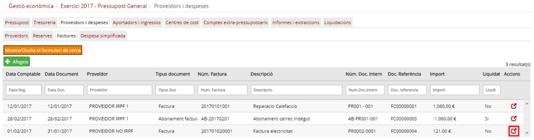

Imatge 49. Anul·lar un pagament

* Es mostrarà la pantalla de detall de la factura (*Imatge 46. Pantalla de detall de la factura*). Aquesta pantalla mostra tota la informació de la factura, però només de consulta.

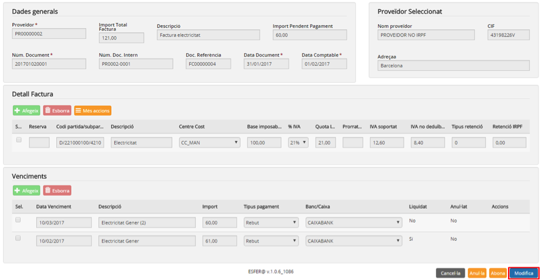

Imatge 50. Pantalla de detall de la factura

* Premeu el botó *Modifica* .

  + En cas que premeu el botó Cancel·la , tornareu a la pantalla de la llista de factures (*Imatge 49. Anul·lar un pagament*) sense haver-la modificat.
* Es mostra la pantalla de modificació de la factura (*Imatge 51. Anul·lar un pagament ja registrat*).

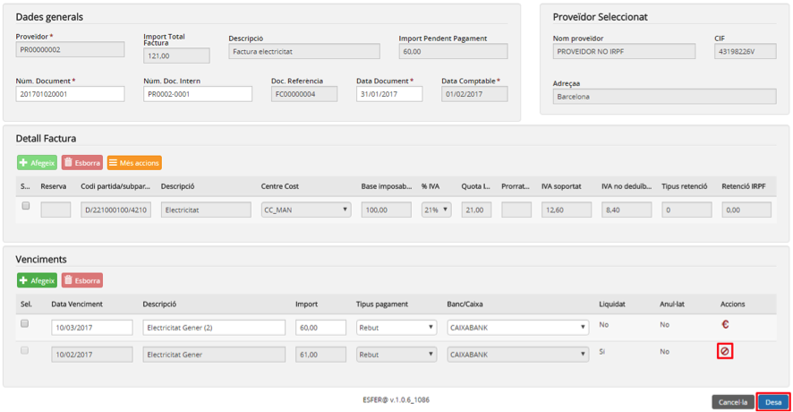

Imatge 51. Anul·lar un pagament ja registrat

* Premeu el botó d’acció  sobre el venciment per anul·lar-ne el pagament.

  + El venciment canvia l’estat del camp *Anul·lat de No a Sí (Imatge 52. Venciment anul·lat*).

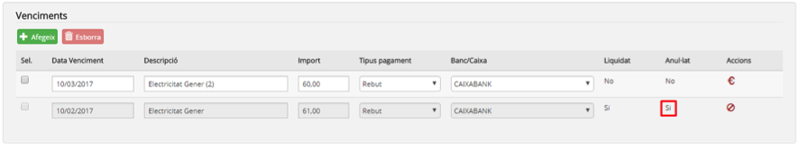

Imatge 52. Venciment anul·lat

* Pel fet que el venciment ha estat anul·lat, la suma dels imports dels venciments ja no coincideix amb el camp Import total factura. Per aquest motiu s’hauran d’afegir nous venciments a la factura per tal de restablir aquest equilibri. El procediment per afegir nous venciments està descrit a l’apartat *4. Afegir venciments (Imatge 53. Venciments equilibrats després d'una anul·lació)*.

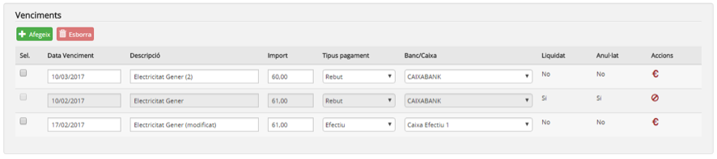

Imatge 53. Venciments equilibrats després d'una anul·lació

* Premeu el botó *Desa* .

  + En cas que premeu el botó Cancel·la , tornareu a la pantalla de detall de la factura (*Imatge 50. Pantalla de detall de la factura*) sense desar els canvis.
* En cas que a la factura ja estigués liquidada, l’estat de liquidació després d’anul·lar-ne un venciment canviarà (Sí → No).
* A partir d’aquest moment, el venciment que ha estat anul·lat ja no sortirà a la pantalla de detall de la factura (*Imatge 51. Anul·lar un pagament ja registrat*).

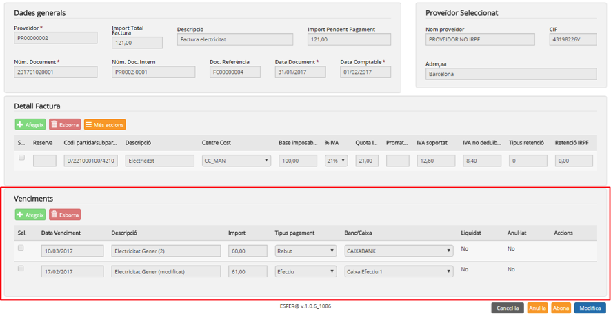

Imatge 54. Venciments anul·lats no apareixen a la llista

---

### 2.4.2.9. Copiar una factura

En cas que hi hagi una factura que es repeteix en el temps, hi ha l’opció de copiar una factura existent en lloc de crear-ne una de nova.

Per copiar una factura cal seguir el procediment següent:

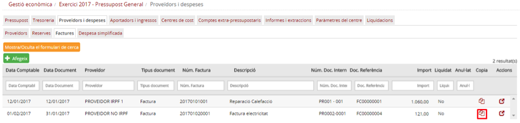

Imatge 55. Copiar una factura

* Premeu el botó d’acció  per copiar la factura (*Imatge 55. Copiar una factura*).
* Es mostra la pantalla de creació de factura amb les mateixes dades de la factura que s’està copiant (*Imatge 9. Pantalla de nova factura*).
* Modifiqueu les dades de la factura.
* Des de la pantalla de creació de la factura es poden modificar els camps següents:

  + *Proveïdor*: codi del proveïdor de la factura. Cal seleccionar el proveïdor des de la pantalla de cerca de proveïdors (vegeu l’apartat *1. Selecció de proveïdor*). Si es canvia de proveïdor, s’esborraran automàticament totes les dades dels apartats *Detall factura i Venciments*.
  + *Import total factura*: import total de la factura amb els impostos inclosos. Aquest import s’ha de correspondre amb la suma de les línies de detall de la factura (Base imposable més Quota d’IVA menys Retenció IRPF).
  + *Descripció*: descripció (concepte) de la factura.
  + *Núm. Document*: número de factura que apareix en el document enviat pel proveïdor. És obligatori canviar-lo ja que no pot estar repetit.
  + *Núm. Doc. Intern*: número de document intern que ha d’assignar l’usuari. (Opcional)
  + *Data Document*: data de la factura que apareix en el document enviat pel proveïdor.
  + *Data comptable*: En general, és la mateixa que la data de la factura (data del document), llevat que aquesta data estigui dins d’un període del qual ja s’han liquidat els impostos. El sistema valida que la data comptable sigui correcta i impedeix introduir valors que corresponguin a períodes ja liquidats.
* També es poden fer canvis en l’apartat *Detall factura*:

  + Afegir noves partides i centres de cost (vegeu apartat *Introduir la factura d’un proveïdor*).
  + Eliminar partides i centres de cost (vegeu apartat *Introduir la factura d’un proveïdor*).
  + Canviar imports sobre les existents.
* També es poden fer canvis en l’apartat dels venciments (per a informació detallada de tots els camps dels venciments, vegeu l’apartat *Introduir la factura d’un proveïdor*).

  + *Data venciment*: data del venciment (en què es farà el pagament).
  + *Descripció*: descripció del venciment.
  + *Import*: import del venciment.
  + *Tipus pagament*: mecanisme mitjançant el qual es fa el pagament.
  + *Banc/Caixa*: banc o caixa contra els quals es farà el pagament.
* Premeu el botó *Desa* .

  + En cas que premeu el botó *Cancel·la* , no es desa la nova factura.

Es torna a la pantalla de llista de factures (*Imatge 4. Llista de factures*) on ja apareix la factura copiada.