# 2.5. Ingrés simplificat

* [2.5.1. Descripció](ap25.md#251-descripció)
* [2.5.2. Contingut pas a pas](ap25.md#252-contingut-pas-a-pas)

  + [2.5.2.1. Accés](ap25.md#2521-accés)
  + [2.5.2.2. Llistat d’ingressos simplificats](ap25.md#2522-llistat-dingressos-simplificats)
  + [2.5.2.3. Introduir un ingrés simplificat](ap25.md#2523-introduir-un-ingrés-simplificat)
  + [2.5.2.4. Anul·lar un ingrés simplificat](ap25.md#2524-anullar-un-ingrés-simplificat)
  + [2.5.2.5. Copiar ingrés simplificat](ap25.md#2525-copiar-ingrés-simplificat)

---

## 2.5.1. Descripció

Dins el mòdul de *Gestió econòmica* d’Esfer@, a més de la gestió pressupostària també es fa la gestió comptable. L’enllaç entre el pressupost i la comptabilitat és la imputació d’ingressos i despeses. En aquest contingut es tracta la gestió de l’ingrés simplificat.

Hi ha dos tipus d’ingressos:

* L’ingrés simplificat, que correspon a un petit ingrés d’un particular i pel qual no es fa cap desglossament d’IVA.
* L’ingrés que corresponen a ingressos pels quals sí que es hi ha desglossament d’IVA.

Aquest contingut explica com s’han de registrar els ingressos simplificats dins el mòdul de *Gestió econòmica* d’Esfer@ i la resta d’operacions associades:

* *Registrar ingressos simplificats*: permet la creació de l’ingrés simplificat dins la comptabilitat.
* *Anul·lar ingrés simplificat*: permet anul·lar un ingrés simplificat que s’ha creat per error.

---

## 2.5.2. Contingut pas a pas

### 2.5.2.1. Accés

Des de la pàgina principal d’Esfer@ cal anar al mòdul de *Gestió econòmica*.

Imatge 1. Pantalla inicial d’Esfer@

Una vegada s’accedeix al mòdul de Gestió econòmica apareixerà un llistat de pressupostos que té el centre (*Imatge 2. Llista pressupostos*).

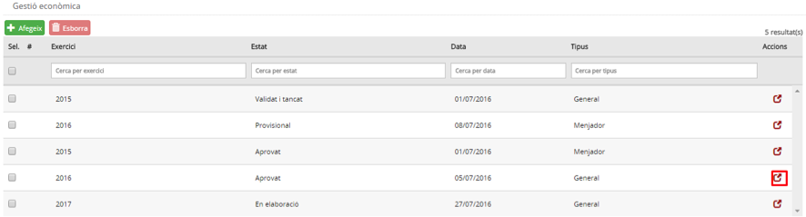

Imatge 2. Llista pressupostos

La informació de les columnes és la següent:

* *Exercici*: exercici fiscal (any) al qual pertany el pressupost.
* *Estat*: estat del pressupost. Per informació detallada sobre els estats del pressupost, consulteu els continguts específics *Evolució del pressupost*.
* *Data*: data de l’últim canvi d’estat del pressupost.
* *Tipus*: tipus de pressupost.

  + *General*.
  + *Menjador*.
* *Botó d’acció* : permet accedir al detall del pressupost i permet detallar la dotació.

A la capçalera de les columnes apareix el nom del camp corresponent. A sota, hi ha espais per poder aplicar filtres sobre la informació de detall.

Premeu el botó d’acció  per entrar en el detall del pressupost amb què es vol treballar (*Imatge 3. Pantalla de detall del pressupost*).

Imatge 3. Pantalla de detall del pressupost

---

### 2.5.2.2. Llistat d’ingressos simplificats

El punt d’entrada a la gestió dels ingressos simplificats és el llistat d’ingressos simplificats i per accedir-hi cal seguir el procediment següent:

Des de la pantalla de detall del pressupost (*Imatge 3. Pantalla de detall del pressupost*):

* Seleccioneu la pestanya *Aportadors i ingressos*.
* Seleccioneu la subpestanya *Ingrés simplificat*.
* Es mostra el llistat d’ingressos simplificats amb el cercador per fer filtres (*Imatge 4. Llista d’ingressos simplificats*).

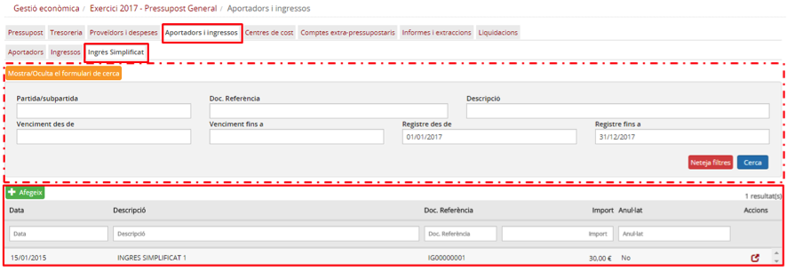

Imatge 4. Llista d’ingressos simplificats

Aquesta pantalla consta de dues parts: a la inferior apareix la llista d’ingressos simplificats del centre i a la superior hi ha un seguit de camps per fer filtres i obtenir un subconjunt d’ingressos simplificats.

**a) Informació dels ingressos simplificats:**

* La llista d’ingressos simplificats té les columnes següents:

  + *Data*: data comptable de l’ingrés simplificat.
  + *Descripció*: descripció/concepte de l’ingrés simplificat.
  + *Doc. Referència*: número de document de referència (intern del sistema).
  + *Import*: import total de l’ingrés simplificat.
  + *Liquidat*: estat de liquidació de l’ingrés simplificat:

    - *Sí*: tots els venciments de l’ingrés simplificat han estat liquidats.
    - *No*: queden un o més venciments de l’ingrés simplificat pendents de liquidar.
  + Botó d’acció  que permet accedir a la pantalla de detall de l’ingrés simplificat.
  + *Anul·lat*: estat d’anul·lació de l’ingrés simplificat.
  + Botó d’acció de còpia : permet copiar l’ingrés simplificat i crear-ne un de nou amb les mateixes dades que un altre que ja existeix.   
      
    La capçalera de la llista d’ingressos simplificats conté els noms dels camps (en forma de columnes) i uns espais en forma de caixetes per aplicar nous filtres a la llista de factures de la pantalla.

---

**b) Filtre dins la llista d’ingressos simplificats**

La part superior de la pantalla de *Llista d’ingressos* simplificats incorpora tot un seguit de camps per fer cerca d’ingressos simplificats i obtenir un subconjunt d’ingressos simplificats segons una sèrie de paràmetres de cerca:

* *Partida / Subpartida / Extrapressupostari*: permet cercar despeses simplificades en funció de les partides / subpartides (d’ingrés) o comptes extrapressupostaris que s’hi hagin detallat:

  + *Partida o subpartida*: codi o descripció de la partida o subpartida d’ingrés.
  + *Compte extrapressupostari*: codi o descripció del compte extrapressupostari.
* *Doc. Referència*: permet cercar ingressos simplificats a partir del número de document de referència (codi intern generat pel sistema).
* *Venciment des de / Venciment fins a*: permet cercar ingressos simplificats que tinguin algun venciment dins d’aquest rang de dates.
* *Registre des de / Registre fins a*: permet cercar ingressos simplificats que tinguin la data de registre dins d’aquest rang de dates.
* *Descripció*: permet cercar ingressos simplificats que tinguin a partir del seu camp de descripció.

* Per defecte, tots els camps del cercador estan en blanc llevat de *Registre des de i Registre fins a*, que s’inicien amb el primer dia de l’any del pressupost i l’últim dia de l’any del pressupost respectivament.

  + Això fa que el llistat d’ingressos simplificats mostri per defecte tots els ingressos simplificats de l’any corresponent al pressupost.
* El botó *Mostra/Oculta el formulari de cerca* , permet ocultar el cercador i deixar més espai de la pantalla disponible per al llistat d’ingressos simplificats (Imatge 5. Cercador d’ingressos simplificats ocult).

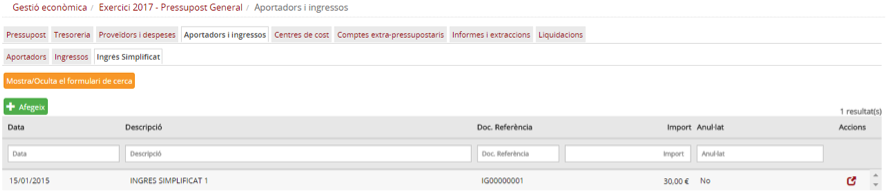

Imatge 5. Cercador d’ingressos simplificats ocult

* El botó *Neteja filtres*  neteja tots els camps del cercador (i els deixa en blanc) llevat dels camps *Registre des de* i *Registre fins a* que tornen al seu valor per defecte (el primer dia de l’any del pressupost i l’últim dia de l’any del pressupost respectivament).
* El botó *Cerca*  inicia la cerca dels ingressos simplificats i renova els continguts de llistat d’ingressos simplificats de la pantalla.

**c) Accions sobre els ingressos simplificats**

Des de la pantalla de llista d’ingressos simplificats es poden fer les diferents accions que s’expliquen a continuació:

* Introduir un ingrés simplificat.
* Anul·lar un ingrés simplificat.

---

### 2.5.2.3. Introduir un ingrés simplificat

Quan el centre rep un ingrés pel qual no emet factura, l’ha de registrar en la comptabilitat del mòdul de Gestió econòmica d’Esfer@ com a ingrés simplificat.

Per poder introduir l’ingrés simplificat cal seguir el procediment següent:

* Des de la pantalla de llista d’ingressos simplificats, premeu el botó *Afegeix*  (*Imatge 6. Introduir un nou ingrés simplificat*).

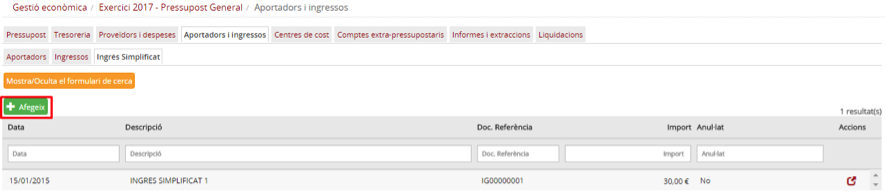

Imatge 6. Introduir un nou ingrés simplificat

* Es mostra la pantalla de creació d’ingrés simplificat (*Imatge 7. Pantalla de nou ingrés simplificat*).

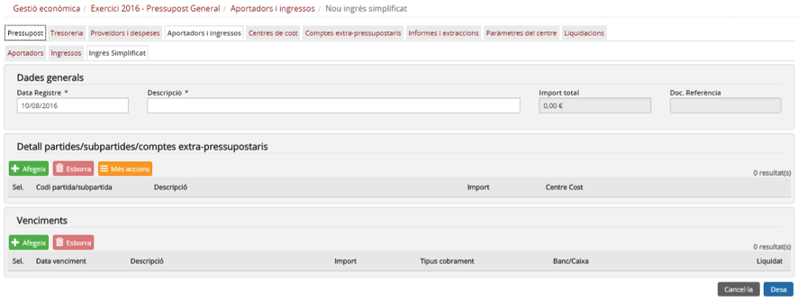

Imatge 6. Introduir un nou ingrés simplificat

A la pantalla de creació d’ingrés simplificat hi ha tres blocs de dades:

* Dades generals.
* Detall partides/subpartides/comptes extrapressupostaris.
* Venciments.

La composició d’informació per cadascun d’aquests blocs és la següent:

* *Dades generals*: les dades generals de l’ingrés simplificat contenen la informació del principal de l’ingrés simplificat, la que correspondria a les preguntes “Què?” (concepte de l’ingrés simplificat i dates) i “Quant?” (imports totals).

  + *Data registre*: data comptable de l’ingrés simplificat. En general, la data comptable serà la mateixa que la data en què realment s’ha fet l’ingrés llevat que aquesta data estigui dins un període del qual ja s’han liquidat els impostos. El sistema valida que la data comptable sigui correcta i impedeix introduir valors que correspongui a períodes ja liquidats.
  + *Import total*: import total de l’ingrés simplificat.
  + *Descripció*: descripció (concepte) de l’ingrés simplificat.
  + *Doc. Referència*: aquest camp només és de lectura ja que el número de document de referència el genera internament el sistema.

* *Detall ingrés*: les dades de com es fa la imputació de l’ingrés simplificat contra el pressupost (partides o subpartides d’ingrés) o els comptes extrapressupostaris. Aquesta secció correspondria a la pregunta “Com?” (com es reparteix l’import entre les diferents partides, subpartides, centres de cost o partides extrapressupostàries). El detall de l’ingrés simplificat és una taula on es podran especificar una o més línies d’assignació. Cada una d’elles té els següents camps:

  + *Codi partida / subpartida / extrapressupostari*: El camp només és de lectura però permet cercar una partida / subpartida o compte extrapressupostari prement el botó d’acció  del propi camp.
  + *Descripció*: descripció de la partida / subpartida / compte extrapressupostari.
  + *Centre de cost*: permet seleccionar un dels centres de cost que tingui assignat la partida o subpartida (mitjançant la dotació pressupostària). En cas que s’hagi triat un compte extrapressupostari, aquest camp està desactivat.
  + *Import*: import que s’assigna a aquesta línia.

* *Venciments*: les dades de com es cobrarà l’import de l’ingrés simplificat. Permet definir diversos venciments (terminis) amb diverses formes de pagament. Aquesta secció correspondria a la pregunta “Quan?” (dates de pagament). La secció de venciments és una taula on es podran especificar una o més línies cada una corresponent amb un venciment. Cadascuna d’aquestes té els camps següents:

  + *Data venciment*: data del venciment.
  + *Descripció*: descripció del venciment.
  + *Import*: import del venciments.
  + *Tipus de cobrament*: forma de cobrament del venciment. Desplegable amb els valors següents:

    - *Transferència*: transferència bancaria.
    - *Rebut*: rebut domiciliat.
    - *Xec*: xec bancari.
    - *Efectiu*: pagament en efectiu.
    - *No cobrable*: seleccioneu si per algun motiu l’ingrés no es pot cobrar (per exemple, que l’aportador hagi desaparegut).
  + *Banc/Caixa*: camp desplegable per seleccionar el banc o la caixa contra la que es fa el pagament. El contingut de la llista de selecció s’omple en funció del valor seleccionat al camp *Tipus cobrament*.
  + *Liquidat*: estat de liquidació del venciment:

    - *Sí*: el venciment ha estat liquidat (cobrat). Valor per defecte
    - *No*: el venciment no ha estat liquidat (cobrat).

**d) Entrada d’un nou ingrés simplificat**

Els passos que cal seguir per introduir un nou ingrés simplificat són els següents:

1. Informar les dades generals de l’ingrés simplificat.
2. Detall de l’ingrés simplificat.
3. Afegir venciments a l’ingrés simplificat.
4. Desar l’ingrés simplificat.

A continuació es detalla cada un d’aquest passos.

**1. Informar les dades generals de l’ingrés simplificat.**

Cal informar els camps de la secció Dades generals (Imatge 8. Dades generals):

* *Data comptable*: data comptable de l’ingrés simplificat.

  + En general, la data comptable ha de ser la mateixa que la data en què realment s’ha rebut l’ingrés llevat que aquesta data estigui dins un període del qual ja s’han liquidat els impostos. El sistema valida que la data comptable sigui correcta i impedeix introduir valors que correspongui a períodes ja liquidats.
  + La data comptable ha d’estar dins de l’any del pressupost.
* *Import total*: import total de l’ingrés simplificat. Aquest camp només és de lectura i es calcula com la suma dels imports del detall de l’ingrés.

  + Aquest import ha de ser inferior als 300,00€ (paràmetre de configuració del sistema).
* *Descripció*: descripció (concepte) de l’ingrés simplificat.

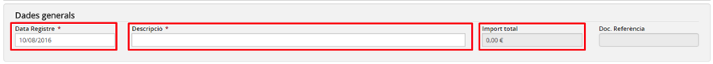

Imatge 8. Dades generals

---

**2. Detallar l’ingrés simplificat**

En el detall de l’ingrés simplificat es desglossa com l’import total de l’ingrés simplificat s’imputa al pressupost o als comptes extra-pressupostaris. Dins de la secció *Detall ingrés* es poden detallar una o més línies amb diferents partides / subpartides d’ingrés (amb els centres de cost que tinguin associats) o comptes extra-pressupostaris.

Per poder afegir una línia a la taula de detall de l’ingrés simplificat cal seguir el següent procediment (*Imatge 9. Afegir una nova línia de detall*):

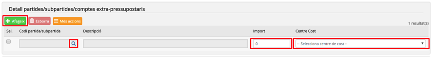

Imatge 9. Afegir una nova línia de detall

* Premeu el botó *Afegeix* .
* S’afegeix una nova en línia en blanc a la taula.
* Automàticament es mostra el diàleg de cerca de partida / subpartida o compte extrapressupostari (*Imatge 10. Pantalla de cerca de partides / subpartides o comptes extrapressupostaris*).

  + També es pot obrir la pantalla de cerca de partida / subpartida o compte extrapressupostari prement el botó de cerca  del camp *Partida / subpartida / extrapressupostari*.
  + Es mostra la pantalla de cerca de partides/subpartides i comptes extrapressupostaris (*Imatge 10. Pantalla de cerca de partides / subpartides o comptes extrapressupostaris*).   

    

    Imatge 10. Pantalla de cerca de partides / subpartides o comptes extra-pressupostaris
  + Obrir el desplegable Cerca per i triar el tipus d’entitat que s’està buscant:

    - *Partides / subpartides*.
    - *Compte extrapressupostari*.  
      En ambdós casos, es mostra una taula amb les partides i subpartides (d’ingrés) o amb els comptes extrapressupostaris. La taula té els camps següents (*Imatge 11. Selecció de partida / subpartida o compte extrapressupostari*):  

      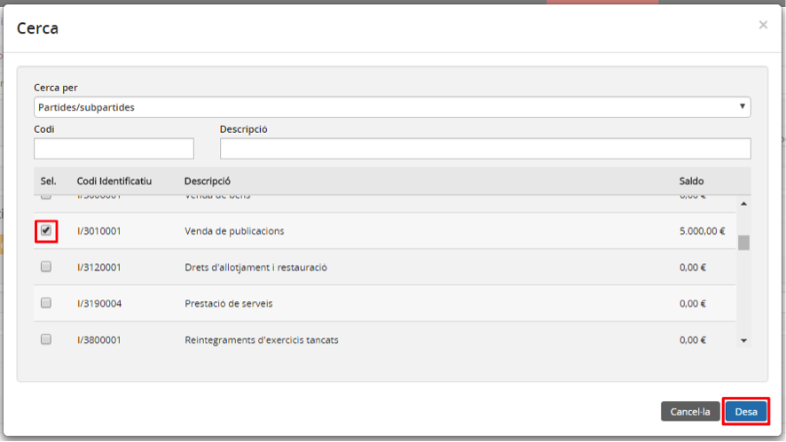

      Imatge 11. Selecció de partida / subpartida o compte extrapressupostari

      * *Codi identificatiu*: codi de la partida / subpartida o compte extrapressupostari (segons escaigui).
      * *Descripció*: nom de la partida / subpartida o compte extrapressupostari (segons escaigui).
      * *Saldo*: saldo disponible a la partida / subpartida o compte extrapressupostari (segons escaigui).
  + Seleccionar la partida / subpartida o compte extrapressupostari (segons escaigui).
  + Premeu el botó *Desa* .

    - En cas que es premi el botó *Cancel·la*  es torna a la pantalla de creació d’ingrés simplificat sense haver seleccionat cap partida/subpartida o compte extrapressupostari.
  + Les dades de la partida/subpartida o compte extrapressupostari s’incorporen a la línia de detall que s’està creant.

    - Es desactiva els botons de cerca  del camp *Partida / subpartida / extrapressupostari*.
    - En cas que s’hagi seleccionat un compte extrapressupostari es desactiva el camp *Centre de cost*.
    - La llista del desplegable del camp *Centre de cost*, s’omple amb els centres de cost que tingui assignats la partida.

* Introduir la resta de camps editables de la línia:

  + *Centre de cost*: Només en cas que la línia estigui detallada contra una partida o subpartida.
  + *Import*: import aplicable a aquesta partida / subpartida i centre de cost, o

D’aquesta manera es poden afegir una o més línies de detall (*Imatge 12. Línies de detall creades*).

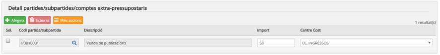

Imatge 12. Línies de detall creades

En cas que l’usuari s’hagi equivocat en la tria de la reserva o la partida / subpartida o compte extrapressupostari cal esborrar la línia i crear-la de nou.

Per esborrar una línia de la taula de detall cal seguir el procediment següent (*Imatge 13. Esborrar línia de detall d’ingrés*):

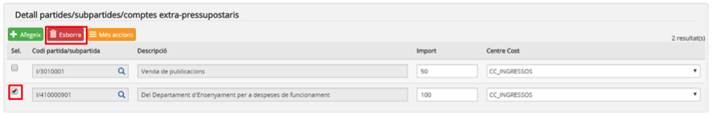

Imatge 13. Esborrar línia de detall d’ingrés

* Seleccioneu la línia de detall que es vol esborrar. Si es vol, se’n pot esborrar més d’una a la vegada.
* Premeu el botó *Esborra* .

  + La línia seleccionada s’esborra.

Durant el procés de detall de l’ingrés simplificat es poden consultar les totalitzacions de les dades ja introduïdes. Per obtenir aquesta informació, premeu el botó Més accions  (*Imatge 14. Consulta totalitzacions detall*):

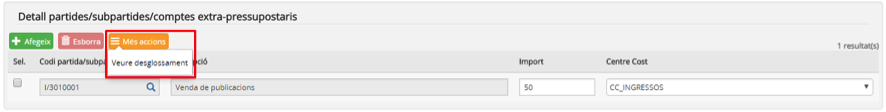

Imatge 14. Consulta totalitzacions detall

* *Desglossament*: extreu una pantalla amb informació totalitzada per partida / subpartida i centre de cost (*Imatge 15. Totalització per partida / subpartida i centre de cost*).

  + Premeu el botó *Confirma*  per tancar la pantalla i tornar a la pantalla de creació d’ingrés simplificat.

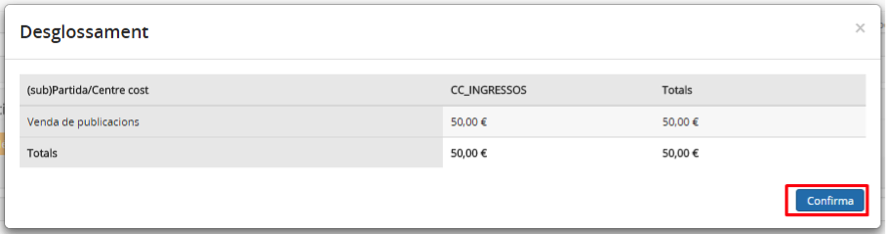

Imatge 15. Totalització per partida / subpartida i centre de cost

---

**3. Afegir venciments**

Els venciments permeten definir quins seran els cobraments que es faran per aquest ingrés simplificat. Cada venciment té la seva pròpia data, l’import i el tipus de cobrament. Per la pròpia naturalesa de l’ingrés simplificat, tots els venciments s’introdueixen com a *Liquidats*.

Per afegir un nou venciment a la taula de venciments cal seguir el següent procediment (*Imatge 16. Crear un nou venciment*):

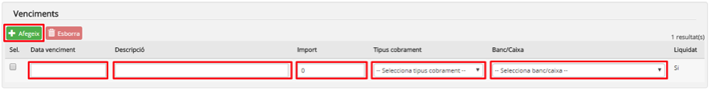

Imatge 16. Crear un nou venciment

* Premeu el botó *Afegeix* .
* S’afegeix una nova línia a la taula de venciments.
* Completeu els camps del venciment:

  + *Data venciment*: data del venciment.
  + Descripció: descripció del venciment.
  + *Import*: import del venciment.
  + *Tipus de cobrament*: forma de pagament del venciment. Desplegable amb els valors següents:

    - *Transferència*: transferència bancaria.
    - *Rebut*: rebut domiciliat.
    - *Xec*: xec bancari.
    - *Efectiu*: pagament en efectiu
    - *No cobrable*: seleccioneu si per algun motiu l’ingrés no es pot cobrar (per exemple, que l’aportador hagi desaparegut).
  + *Banc/Caixa*: camp desplegable per seleccionar el banc o la caixa contra la que es fa el pagament. El contingut de la llista de selecció s’omple en funció del valor seleccionat al camp Tipus cobrament.

    - Si el camp *Tipus cobrament* val *Transferència*, *Rebut* o *Xec* la llista s’omple amb tots els bancs actius del centre.
    - Si el camp *Tipus cobrament* val *Efectiu*, la llista s’omple amb totes les caixes d’efectiu actives del centre.
    - Si el camp *Tipus cobrament* val *No cobrable*, la llista s’omple amb totes les partides de despesa que estiguin marcades com a Altres despeses.

D’aquesta manera es poden afegir un o més venciments (*Imatge 17. Venciments creats*). La suma dels imports de tots els venciments ha de coincidir amb el camp Import total de la secció Dades generals.

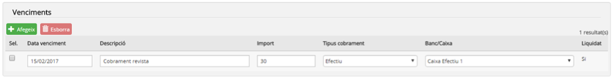

Imatge 17. Venciments creats

En cas que l’usuari s’hagi equivocat en la creació del venciment pot esborrar-lo i crear-lo de nou.

Per esborrar una línia de la taula de venciments cal seguir el procediment següent (*Imatge 18. Esborrar venciments*):

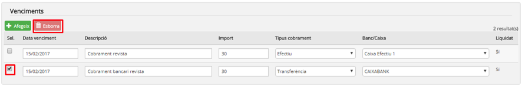

Imatge 18. Esborrar venciments

* Seleccioneu la línia de venciment que es vol esborrar. Si es vol, se’n pot esborrar més d’una a la vegada.
* Premeu el botó *Esborra* .

  + La línia seleccionada s’esborra.

---

**4. Desar l’ingrés simplificat**

Una vegada que s’han completat tots els passos anteriors cal desar l’ingrés simplificat.

Per desar l’ingrés simplificat cal seguir el procediment següent (*Imatge 19. Desar l’ingrés simplificat*):

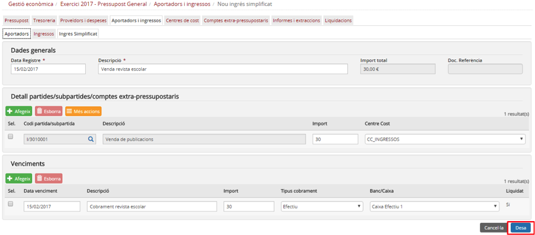

Imatge 19. Desar l’ingrés simplificat

* Premeu el botó *Desa* .

  + En cas que es premi el botó *Cancel·la* es torna a la pantalla del llistat d’ingressos simplificats (*Imatge 4. Llista d’ingressos simplificats*) sense desar-lo.
* El sistema fa les validacions de l’ingrés simplificat. Les principals validacions són:

  + El camp *Data comptable* ha d’estar dins de l’any del pressupost.
  + La suma dels imports de les línies de detall ha de coincidir amb el camp *Import total*.
  + La suma de tots els imports dels venciments ha de coincidir amb el camp *Import total*.
  + Validacions de saldo (segons escaigui).

    - Saldo de la partida / subpartida i centre de cost.
* En cas que hagin passat les validacions es desa l’ingrés simplificat i es torna a la pantalla de llistat d’ingressos simplificats (*Imatge 20. Ingrés simplificat creat*) on ja apareix l’ingrés simplificat creat.

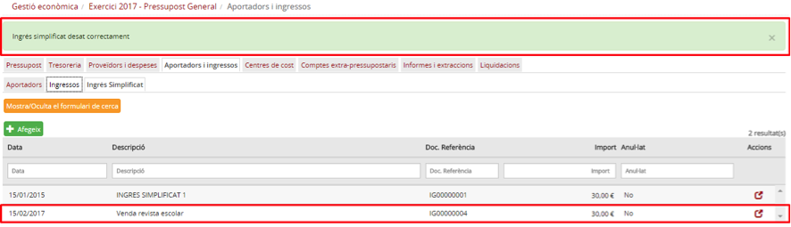

Imatge 20. Ingrés simplificat creat

* Si alguna validació falla es mostra un missatge d’error perquè l’usuari pugui esmenar-lo i tornar-ho a intentar (*Imatge 21. Exemple de missatge d'error*):

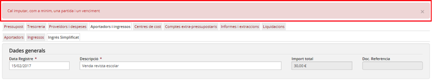

Imatge 21. Exemple de missatge d'error

---

### 2.5.2.4. Anul·lar un ingrés simplificat

En cas que s’hagi creat un ingrés simplificat erroni el sistema permet anul·lar-lo. Els casos més freqüents que poden portar a aquesta situació són els següents:

* S’ha creat una ingrés simplificat amb dades errònies que no es poden modificar:

  + Error en la data comptable.
  + Error en la dotació.
  + Altres errors.
* S’ha creat un ingrés simplificat duplicat.

Només es poden anul·lar ingressos simplificats que corresponguin a l’any del pressupost i que no hagin estat inclosos en cap liquidació d’impostos (IVA, IRPF).

Per anul·lar un ingrés simplificat cal seguir el següent procediment:

* Des de la pantalla de llistat d’ingressos simplificats, premeu el botó d’acció  de l’ingrés simplificat que es vol anul·lar (*Imatge 22. Anul·lar ingrés simplificat*):

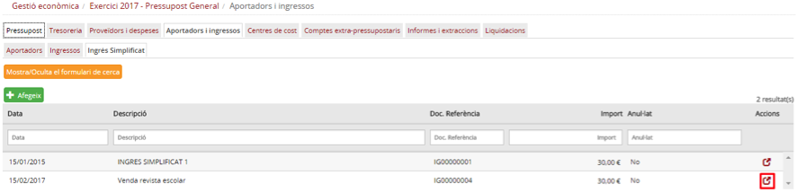

Imatge 22. Anul·lar ingrés simplificat

* Es mostrarà la pantalla de detall de l’ingrés simplificat (*Imatge 23. Pantalla de detall de l’ingrés simplificat*). Aquesta pantalla mostra tota la informació de l’ingrés simplificat però només en format de lectura.

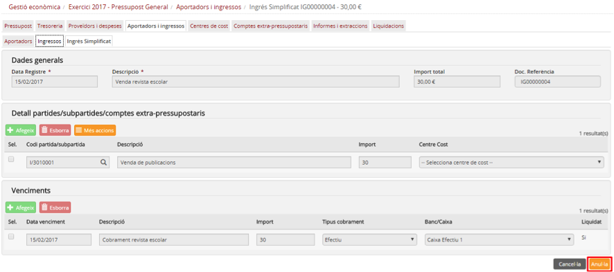

Imatge 23. Pantalla de detall de l’ingrés simplificat

* Premeu el botó *Anul·la* .

  + En cas que es premi el botó *Cancel·la*  es torna a la pantalla de llista d’ingressos simplificats (*Imatge 22. Anul·lar ingrés simplificat*) sense anul·lar l’ingrés simplificat.
* Introduïu el motiu de l’anul·lació (*Imatge 24. Motiu anul·lació*).

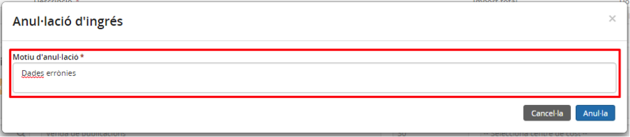

Imatge 24. Motiu anul·lació

* Premeu el botó *Desa* .

  + En cas que es premi el botó *Cancel·la*  es torna a la pantalla de detall de l’ingrés simplificat (*Imatge 23. Pantalla de detall de l’ingrés simplificat*) sense anul·lar l’ingrés simplificat.
* Es torna a la pantalla de llistat d’ingressos simplificats on ja no apareix l’ingrés simplificat com a anul·lat (*Imatge 25. Ingrés simplificat anul·lat*).

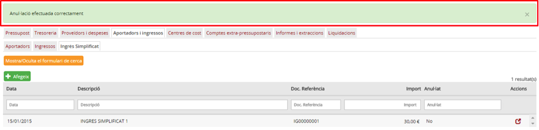

Imatge 25. Ingrés simplificat anul·lat

---

### 2.5.2.5. Copiar ingrés simplificat

En cas que hi hagi un ingrés simplificat que es repeteix en el temps, hi ha l’opció de copiar un ingrés simplificat existent en lloc de crear-ne un de nou.

Per copiar un ingrés simplificat cal seguir el procediment següent:

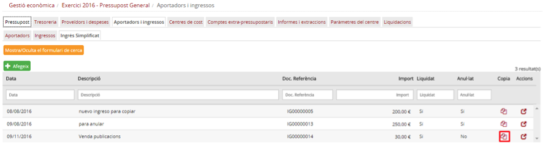

Imatge 26. Copiar un ingrés simplificat

* Premeu el botó d’acció  per copiar l’ingrés simplificat (*Imatge 26. Copiar un ingrés simplificat*).
* Es mostra la pantalla de creació d’ingrés simplificat amb les mateixes dades de l’ingrés simplificat que s’està copiant.(*Imatge 27. Nou ingrés simplificat copiat*).

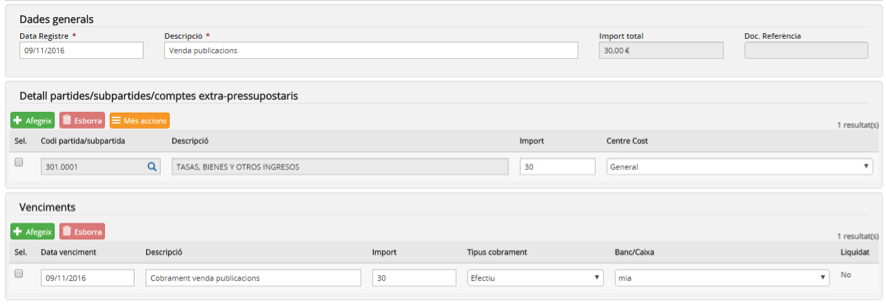

Imatge 27. Nou ingrés simplificat copiat

* Modifiqueu les dades de l’ingrés simplificat.
* Des de la pantalla de creació de l’ingrés simplificat es poden canviar els camps (*Imatge 28. Actualitzar dades ingrés simplificat copiat*):

  + *Data comptable*: data comptable de l’ingrés simplificat.
  + *Import total*: import total de l’ingrés simplificat.
  + *Descripció*: descripció de la reserva.
* També es poden fer canvis en l’apartat *Detall ingrés*:

  + Afegir noves partides i centres de cost (veure apartat *Introduir un ingrés simplificat*).
  + Eliminar partides i centres de cost (veure apartat *Introduir un ingrés simplificat*).
  + Canviar els imports sobre les línies existents.

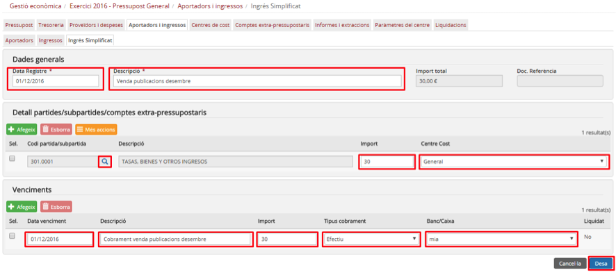

Imatge 28. Actualitzar dades ingrés simplificat copiat

* Premeu el botó *Desa* .

  + En cas que es premi el botó *Cancel·la*  no es desa el nou ingrés simplificat.
* Es torna a la pantalla de llistat d’ingressos simplificats (*Imatge 29. Nou ingrés simplificat copiat*) on ja apareix l’ingrés simplificat copiat.

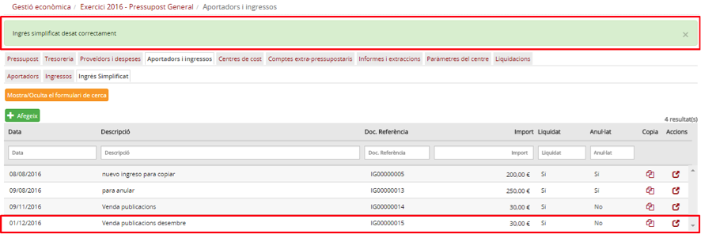

Imatge 29. Nou ingrés simplificat copiat