# 2.6. Gestió de l’ingrés

* [2.6.1. Descripció](ap26.md#261-descripció)
* [2.6.2. Contingut pas a pas](ap26.md#262-contingut-pas-a-pas)

  + [2.6.2.1. Accés](ap26.md#2621-accés)
  + [2.6.2.2. Llista d’ingressos](ap26.md#2622-llista-dingressos)
  + [2.6.2.3. Introduir l’ingrés d’un aportador](ap26.md#2623-introduir-lingrés-dun-aportador)
  + [2.6.2.4. Modificar un ingrés](ap26.md#2624-modificar-un-ingrés)
  + [2.6.2.5. Anul·lar un ingrés](ap26.md#2625-anullar-un-ingrés)
  + [2.6.2.6. Fer devolució d’un ingrés](ap26.md#2626-fer-devolució-dun-ingrés)
  + [2.6.2.7. Cobrament parcial o total de l’import pendent d’un ingrés](ap26.md#2627-cobrament-parcial-o-total-de-limport-pendent-dun-ingrés)
  + [2.6.2.8. Anul·lar un cobrament](ap26.md#2628-anullar-un-cobrament)

---

## 2.6.1. Descripció

Dins el mòdul de *Gestió econòmica* d’Esfer@, a més de la gestió pressupostària, també es fa la gestió comptable. L’enllaç entre el pressupost i la comptabilitat és la imputació d’ingressos i despeses. Dins aquest contingut es tracta la gestió de l’ingrés.

Hi ha dos tipus d’ingressos:

* L’ingrés simplificat, és a dir, un petit ingrés d’un particular per al qual no hi ha cap desglossament d’IVA.
* L’ingrés per al qual sí que hi ha desglossament d’IVA.

Aquest contingut explica com s’han de registrar els **ingressos** dins el mòdul de *Gestió econòmica* d’Esfer@ i la resta d’operacions associades:

* *Registrar ingressos*: permet la creació de l’ingrés dins la comptabilitat.
* *Modificar l’ingrés*: permet modificar algunes dades de l’ingrés i registrar els cobraments.
* *Anul·lar l’ingrés*: permet anul·lar un ingrés que s’ha creat per error.
* *Devolució d’un ingrés*: permet registrar la devolució d’un ingrés ja registrat.

---

## 2.6.2. Contingut pas a pas

### 2.6.2.1. Accés

Des de la pàgina principal d’Esfer@ cal anar al mòdul de *Gestió econòmica*.

Imatge 1. Pantalla inicial d’Esfer@

Quan s’accedeix al mòdul de *Gestió econòmica* apareix una llista de pressupostos del centre (*Imatge 2. Llista pressupostos*).

Imatge 1. Pantalla inicial d’Esfer@

Apareix una fila per cada pressupost del centre amb la següent informació en forma de columnes:

* *Exercici*: exercici fiscal (any) al qual pertany el pressupost.
* *Estat*: estat en què es troba el pressupost. Per informació detallada sobre els estats del pressupost, consulteu els continguts específics d’Evolució del pressupost.
* *Data*: data de l’últim canvi d’estat del pressupost.
* *Tipus*: tipus de pressupost.

  + *General*
  + *Menjador*
* *Botó d’acció* : permet accedir al detall del pressupost i detallar-ne la dotació.

A la capçalera de les columnes hi apareix el nom del camp. A sota, hi ha uns espais per poder aplicar filtres sobre la informació de detall.

Premeu el botó d’acció  per entrar en el detall del pressupost amb què es vol treballar.
A continuació, el programa mostra la pantalla corresponent a la *Imatge 3. Pantalla de detall del pressupost*.

Imatge 3. Pantalla de detall del pressupost

---

### 2.6.2.2. Llista d’ingressos

El punt d’entrada a tota la gestió de l’ingrés és la llista d’ingressos. Per accedir a la pantalla de llista d’ingressos cal seguir el procediment següent.

Des de la pantalla de detall del pressupost (*Imatge 3. Pantalla de detall del pressupost*):

* Seleccioneu la pestanya *Proveïdors i despeses*.
* Seleccioneu la subpestanya *Ingressos*.
* Es mostra la llista d’ingressos amb el cercador per fer filtres (*Imatge 4. Llista d'ingressos*).

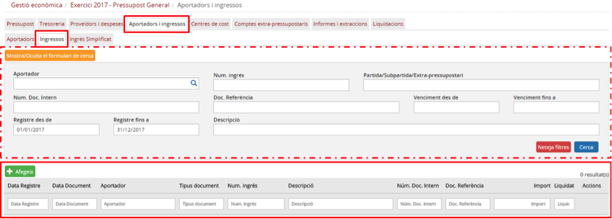

Imatge 4. Llista d'ingressos

Aquesta pantalla consta de dues parts: a la inferior apareix la llista d’ingressos del centre i a la superior hi ha tot un seguit de camps per fer filtres i obtenir un subconjunt d’ingressos.

**a) Informació dels ingressos:**

* La llista d’ingressos de la part inferior de la pantalla mostra les següents columnes:

  + *Data registre*: data comptable de l’ingrés.
  + *Data document*: data de registre de l’ingrés.
  + *Aportador*: codi de l’aportador de l’ingrés.
  + *Tipus document*: Tipus de document (ingrés o devolució).
  + *Núm. Ingrés*: número d’ingrés.
  + *Descripció*: descripció / concepte de l’ingrés.
  + *Núm. Doc. Intern*: número de document intern que li ha donat el centre.
  + *Doc. Referència*: número de document de referència (intern del sistema).
  + *Import*: import total de l’ingrés.
  + *Liquidat*: estat de liquidació de l’ingrés:

    - *Sí*: tots els venciments de l’ingrés s’han liquidat.
    - *No*: queden un o més venciments de l’ingrés pendents de liquidar.
  + Botó d’acció  que permet accedir a la pantalla de detall de l’ingrés.

La capçalera de la llista d’ingressos conté els noms dels camps (en forma de columnes) i uns espais en forma de caixetes per aplicar nous filtres a la llista d’ingressos de la pantalla.

**b) Filtre dins la llista d’ingressos**

La part superior de la pantalla de *Llista d’ingressos* incorpora tot un seguit de camps per fer cerca d’ingressos i obtenir un subconjunt d’ingressos segons una sèrie de paràmetres de cerca:

* *Aportador*: permet cercar ingressos en funció d’alguna de les dades de l’aportador a través d’un quadre de diàleg que apareix en prémer l’opció *Cerca* del camp “Aportador”:

  + Codi de l’aportador.
  + Nom (mercantil) de l’aportador.
  + Nom comercial de l’aportador.
  + CIF de l’aportador.
  + Municipi de l’aportador.
* *Núm. ingrés*: permet cercar pel número d’ingrés.
* *Partida / Subpartida / Extrapressupostari*: permet cercar ingressos en funció de les partides o comptes extrapressupostaris que s’hi hagin detallat:

  + Partida o subpartida: codi o descripció de la partida o subpartida.
  + Compte extrapressupostari: codi o descripció del compte extrapressupostari.
* *Núm. Doc Intern*: permet cercar ingressos a partir del número de document intern que se li hagi donat al centre.
* *Doc. Referència*: permet cercar ingressos a partir del número de document de referència (codi intern generat pel sistema).
* *Venciment des de / Venciment fins a*: permet cercar ingressos que tinguin algun venciment dins d’aquest rang de dates.
* *Registre des de / Registre fins a*: permet cercar ingressos que tinguin la data de registre dins d’aquest rang de dates.
* *Descripció*: permet cercar ingressos que tinguin a partir del seu camp de descripció.

* Per defecte, tots els camps del cercador estan en blanc llevat de *Registre des de* i *Registre fins a*, que s’inicialitzen amb el primer dia de l’any del pressupost i l’últim dia de l’any del pressupost respectivament.

  + Això fa que el llistat d’ingressos mostri per defecte tots els ingressos de l’any corresponent al pressupost.
* Nota: dins els camps de filtre de la pantalla (*Imatge 4. Llista d'ingressos*), el camp de cerca Aportador té un botó d’acció  que obre una pantalla de cerca d’aportadors per aplicar filtres més precisos (*Imatge 5. Pantalla de cerca d'aportadors*):  

  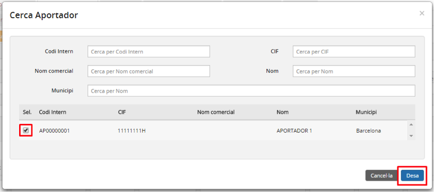

  Imatge 5. Pantalla de cerca d'aportadors

  + Es mostra una llista amb tots els aportadors del centre amb els següents camps:

    - *Codi intern*: codi intern de l’aportador.
    - *CIF*: CIF de l’aportador.
    - *Nom comercial*: nom comercial de l’aportador.
    - *Nom*: nom (mercantil) de l’aportador.
    - *Municipi*: municipi on té l’adreça l’aportador.
  + Per cadascun dels camps anteriors existeix un camp a la capçalera de la pantalla que permet filtrar els continguts de la taula.
  + Seleccioneu un aportador (i només un). No està permès seleccionar-ne més d’un.
  + Prémer el botó *Desa* .

    - En cas que es premi el botó *Cancel·la*  es torna a la pantalla de cercador d’ingressos sense seleccionar cap aportador.
  + Es torna a la pantalla de cercador d’ingressos (*Imatge 6. Cercador d'ingressos*) on el camp d’aportador de la part de filtres ja està informat.

**Mostrar ocultar camps de filtre**

Atès que la pantalla (*Imatge 4. Llista d'ingressos*) mostra un conjunt elevat de camps de filtre que ocupen bona part de l’espai, hi ha l’opció d’ocultar-lo o mostrar-lo, tal com es veu a la (*Imatge 6.Cercador d’ingressos*):

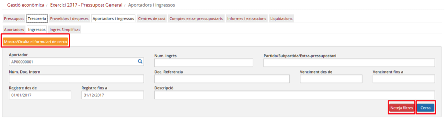

Imatge 6. Cercador d'ingressos

* El botó *Mostra/Oculta el formulari de cerca*  permet ocultar el cercador i deixar més espai de la pantalla disponible per a la llista d’ingressos (*Imatge 7. Cercador d'ingressos ocult*).

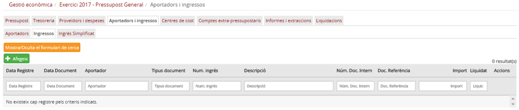

Imatge 7. Cercador d'ingressos ocult

* El botó *Neteja Filtres*  neteja tots els camps del cercador (i els deixa en blanc) llevat dels camps *Registre des de* i *Registre fins a* que tornen al seu valor per defecte (el primer dia de l’any del pressupost i l’últim dia de l’any del pressupost respectivament).
* El botó *Cerca* 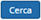 inicia la cerca dels ingressos i renova els continguts de la llista d’ingressos de la pantalla.

**c) Accions sobre els ingressos**

Des de la pantalla de llista d’ingressos es poden fer les accions que s’expliquen a continuació:

* Introduir l’ingrés d’un aportador.
* Modificar un ingrés.
* Anul·lar un ingrés.
* Fer devolució d’un ingrés.
* Cobrar parcialment o totalment l’import pendent d’un ingrés.
* Anul·lar un cobrament.

---

### 2.6.2.3. Introduir l’ingrés d’un aportador

Quan el centre rep un ingrés d’un aportador s’ha d’introduir (registrar) a la comptabilitat del mòdul de *Gestió econòmica* d’Esfer@.

Per poder introduir l’ingrés d’un aportador cal seguir el procediment següent:

* Des de la pantalla de la llista d’ingressos, premeu el botó *Afegeix*  (Imatge 8. Introduir un nou ingrés).

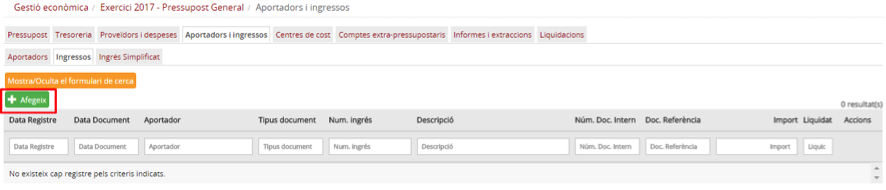

Imatge 8. Introduir un nou ingrés

* El programa mostra la pantalla de creació d’ingrés (*Imatge 9. Pantalla de nou ingrés)*.

Imatge 9. Pantalla de nou ingrés

A la pantalla de creació d’ingrés hi ha quatre blocs de dades:

* Dades generals
* Aportador seleccionat
* Detall de l’ingrés
* Venciments

La composició d’informació per a cadascun d’aquests blocs és la següent:

* *Dades generals*: les dades generals de l’ingrés contenen la informació principal de l’ingrés, la que correspondria a les preguntes “Què?” (concepte de l’ingrés i dates) i “Quant?” (imports totals).

  + *Aportador*: codi de l’aportador de l’ingrés. Aquest camp només és de lectura i cal seleccionar l’aportador des de la pantalla de cerca d’aportador (vegeu l’apartat Selecció d’aportador)
  + *Import total ingrés*: import total de l’ingrés amb els impostos inclosos. Aquest import s’ha de correspondre amb la suma de les línies de detall de l’ingrés (Base imposable més Quota d’IVA)
  + *Descripció*: descripció (concepte) de l’ingrés.
  + Import pendent de cobrament: camp calculat on es reflecteix la diferència entre l’import total de l’ingrés i la suma dels imports de tots els venciments liquidats.
  + *Núm. Document*: número d’ingrés que figura en el document enviat a l’aportador.
  + *Núm. Doc. Intern*: número de document intern que ha d’assignar l’usuari.
  + *Doc. Referència*: aquest camp només és de lectura ja que el número de document de referència el genera internament el sistema.
  + *Data Document*: data de l’ingrés que apareix en el document enviat a l’aportador.
  + *Data comptable*: data comptable de l’ingrés. En general, la data comptable serà la mateixa que la data de l’ingrés (data document) llevat que aquesta data estigui dins un període del qual ja s’han liquidat els impostos. El sistema valida que la data comptable sigui correcta i impedeix introduir valors que correspongui a períodes ja liquidats.

* *Aportador seleccionat*: les dades de l’aportador que fa l’ingrés. Aquesta secció correspondria a la pregunta “Qui?”. Totes les dades d’aquesta secció són només de lectura i s’obtenen des la pantalla de selecció d’aportadors.

  + *Nom aportador*: nom (mercantil) de l’aportador.
  + *CIF*: CIF de l’aportador.
  + *Adreça*: adreça de l’aportador.

* *Detall ingrés*: les dades sobre com es fa la imputació de l’ingrés contra el pressupost (partides o subpartides) o els comptes extrapressupostaris. Aquesta secció correspondria a la pregunta “Com?” (com es reparteix l’import entre les diferents partides, subpartides, centres de cost o partides extrapressupostàries). El detall de l’ingrés és una taula on es podran especificar una o més línies d’assignació. Cada una d’aquestes té els camps següents:

  + *Codi partida / subpartida / extrapressupostari*: El camp és només de lectura però permet cercar una partida/subpartida o compte extrapressupostari prement el botó d’acció  del propi camp.
  + *Descripció*: descripció de la partida / subpartida / compte extrapressupostari.
  + *Centre de cost*: permet seleccionar un dels centres de cost que tingui assignat la partida o subpartida (mitjançant la dotació pressupostària). En cas que s’hagi triat un compte extrapressupostari, aquest camp està desactivat.
  + *Base imposable*: base imposable que s’assigna a aquesta línia.
  + *%IVA*: tipus d’impost que aplica a aquesta línia.
  + *Quota IVA*: e camp es calcula a partir dels camps Base imposable i %IVA. Tot i així, és editable per l’usuari ja que el càlcul generat pel sistema podria provocar problemes amb els decimals. L’usuari pot editar aquest camp per ajustar l’import total de l’ingrés.

* *Venciments*: les dades sobre com es cobrarà l’import de l’ingrés. Permet definir diversos venciments (terminis) amb diverses formes de cobrament. Aquesta secció correspondria a la pregunta “Quan?” (dates de cobrament). La secció de venciments és una taula on es podran especificar una o més línies cada una corresponent a un venciment. Cadascuna té els camps següents:

  + *Data venciment*: data del venciment.
  + *Descripció*: descripció del venciment.
  + *Import*: import del venciments.
  + *Tipus cobrament*: forma de cobrament del venciment. Desplegable amb els valors següents:

    - *Transferència*: transferència bancaria.
    - *Rebut*: rebut domiciliat.
    - *Xec*: xec bancari.
    - *Targeta de crèdit*: targeta de crèdit bancària
    - *Efectiu*: cobrament en efectiu
    - *No cobrable*: seleccionar si per algun motiu l’ingrés no es pot cobrar (per exemple que l’aportador hagi desaparegut).
  + *Banc/Caixa*: camp desplegable per seleccionar el banc o la caixa contra la qual es fa el cobrament. El contingut de la llista de selecció s’omple en funció del valor seleccionat al camp Tipus cobrament.

    - *Liquidat*: estat de liquidació del venciment:

      * *Sí*: el venciment ha estat liquidat (cobrat).
      * *No*: el venciment no ha estat liquidat (cobrat). Valor per defecte.
    - *Anul·lat*: estat d’anul·lació del venciment:

      * *Sí*: el venciment ha estat anul·lat.
      * *No*: el venciment no ha estat anul·lat. Valor per defecte.
    - *Accions*: botons de les accions que es poden fer sobre els venciments.

      *  *Cobrar*: només està actiu si el venciment no està liquidat.
      *  *Anul·lar*: només està actiu si el venciment està liquidat.

---

**a) Entrada de nou ingrés**

Els passos a seguir per introduir un nou ingrés són els següents:

1. Selecció de l’aportador: és imprescindible seleccionar un aportador com a primer pas de la introducció de l’ingrés. En cas contrari, no podrem detallar l’ingrés ni afegir venciments.
2. Completar les dades generals de l’ingrés.
3. Detall de l’ingrés.
4. Afegir venciments a l’ingrés.
5. Desar l’ingrés.

A continuació es detallen cada un d’aquest passos.

**1. Selecció de l’aportador**

Per seleccionar un aportador cal seguir el procediment següent:

* Des de la pantalla d’entrada de l’ingrés, premeu el botó de cerca del camp aportador (*Imatge 10. Seleccionar aportador*).

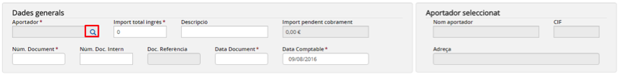

Imatge 10. Seleccionar aportador

* Es mostra la pantalla de selecció de l’aportador (*Imatge 11. Pantalla de selecció d’aportador al crear un ingrés*).

Imatge 11. Pantalla de selecció d’aportador al crear un ingrés

* Apareix una llista amb tots els aportadors del centre amb els camps següents:

  + *Codi intern*: codi intern de l’aportador.
  + *CIF*: CIF de l’aportador.
  + *Nom comercial*: nom comercial de l’aportador.
  + *Nom*: nom (mercantil) de l’aportador.
  + *Municipi*: municipi on té l’adreça l’aportador.

* Per cada un dels camps anteriors hi ha un camp a la capçalera de la pantalla (en forma de caixeta) que permet filtrar els continguts de la taula.
* Seleccionar un aportador (i només un). No està permès seleccionar-ne més d’un.
* Prémer el botó *Desa* .

  + En cas que es premi el botó *Cancel·la*  es torna a la pantalla de creació d’ingressos sense seleccionar cap aportador.
* El programa torna a la pantalla de creació d’ingrés on ja apareixen les dades de l’aportador seleccionat (*Imatge 12. Aportador seleccionat*).

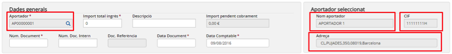

Imatge 12. Aportador seleccionat

**2. Completar les dades generals de l’ingrés**

Cal introduir la resta de camps de la secció *Dades generals (Imatge 13. Dades generals)*:

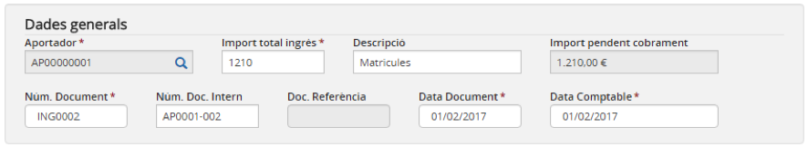

Imatge 13. Dades generals

* *Import total ingrés*: import total de l’ingrés.
* *Descripció*: descripció (concepte) de l’ingrés.
* *Núm. Document*: número de l’ingrés que apareix en el document que s’ha enviat a l’aportador. Ha de ser únic per a l’aportador seleccionat (no hi pot haver cap altre ingrés del mateix aportador amb el mateix número).
* *Núm. Doc. Intern*: número de document intern triat pel mateix usuari. Ha de ser únic (no hi pot haver cap altre ingrés amb el mateix número de document intern).
* *Data document*: data de l’ingrés que apareix en el document que s’ha enviat a l’aportador.
* *Data comptable*: data comptable de l’ingrés.

  + En general, la data comptable serà la mateixa que la data de l’ingrés (data document) llevat que aquesta estigui dins un període del qual ja s’han liquidat els impostos. El sistema valida que la data comptable sigui correcta i impedeix introduir valors que correspongui a períodes ja liquidats.
  + La data comptable ha d’estar dins de l’any del pressupost.

---

**3. Detall de l’ingrés**

En el detall de l’ingrés es desglossa la manera com l’import total de l’ingrés s’imputa al pressupost o als comptes extrapressupostaris. Dins de la secció *Detall ingrés* es poden detallar una o més línies amb diferents partides / subpartides (amb els centres de cost que tinguin associats) o comptes extrapressupostaris.

Per poder afegir una línia a la taula de detall de l’ingrés cal seguir el següent procediment (*Imatge 14. Afegir una nova línia de detall*):

Imatge 14. Afegir una nova línia de detall

* Premeu el botó *Afegeix* .
* S’afegeix una nova en línia en blanc a la taula.
* Premeu el botó de cerca  del camp *Partida / subpartida / extrapressupostari*.

  + Es mostra la pantalla de cerca de partides/subpartides i comptes extrapressupostaris (*Imatge 15. Pantalla de cerca de partides / subpartides o comptes extrapressupostaris*).  

    

    Imatge 15. Pantalla de cerca de partides / subpartides o comptes extra-pressupostaris
  + Obriu el desplegable *Cerca per* i trieu el tipus d’entitat que es busca:

    - *Partides / subpartides*.
    - *Compte extrapressupostari*.  
        
      En ambdós casos es mostra una taula amb les partides i subpartides (d’ingrés) o amb els comptes extrapressupostaris. La taula té els camps següents (*Imatge 16. Selecció de partida / subpartida o compte extrapressupostari*):br>

      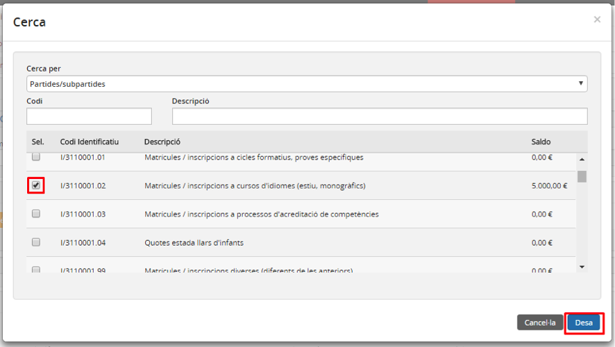

      Imatge 16. Selecció de partida / subpartida o compte extra-pressupostari

      * *Codi identificatiu*: codi de la partida / subpartida o compte extrapressupostari (segons escaigui).
      * *Descripció*: nom de la partida / subpartida o compte extrapressupostari (segons escaigui).
      * *Saldo*: saldo disponible a la partida / subpartida o compte extrapressupostari (segons escagiui).
    - Seleccionar la partida / subpartida o compte extrapressupostari (segons escaigui).
    - Premeu el botó *Desa* .

      * En cas que es premi el botó *Cancel·la*  es torna a la pantalla de creació d’ingressos sense haver seleccionat cap partida/subpartida o compte extrapressupostari.
    - Les dades de la partida/subpartida o compte extrapressupostari s’incorporen a la línia de detall que s’està creant.

      * Es desactiva el botó de cerca  del camp *Partida / subpartida / extrapressupostari*.
      * En cas que s’hagi seleccionat un compte extrapressupostari es desactiva el camp *Centre de cost*.
      * La llista del desplegable del camp *Centre de cost* s’omple amb els centres de cost que tingui assignats la partida.

* Introduir la resta de camps editables de la línia:

  + *Centre de cost*: Només en cas que la línia estigui detallada contra una partida o subpartida.
  + *Base imposable*: base imposable aplicable a aquesta partida / subpartida i centre de cost, o compte extrapressupostari.
  + *%IVA*: tipus d’IVA aplicable a aquesta partida / subpartida i centre de cost, o compte extrapressupostari.
  + *Quota IVA*: tot i que la quota d’IVA es recalcula automàticament quan canvia el camp Base imposable o %IVA es pot editar per ajustar amb l’import total de l’ingrés en cas que hi hagi problemes amb els decimals.

D’aquesta manera es poden afegir una o més línies de detall (*Imatge 17. Línies de detall creades*).

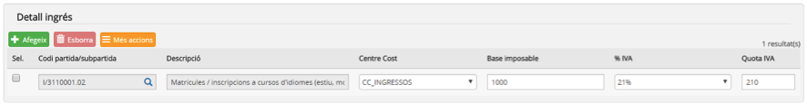

Imatge 17. Línies de detall creades

En cas que l’usuari s’hagi equivocat en la tria de la partida / subpartida o compte extrapressupostari cal esborrar la línia i crear-la de nou.

Per esborrar una línia de la taula de detall cal seguir el següent procediment (*Imatge 18. Esborrar detall ingrés*):

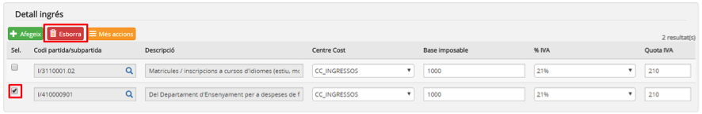

Imatge 18. Esborrar detall ingrés

* Seleccioneu la línia de detall que voleu esborrar. Si voleu, se’n pot esborrar més d’una a la vegada.
* Premeu el botó *Esborra*  .

  + La línia seleccionada s’esborra.

Durant el procés de detall de l’ingrés es poden consultar les totalitzacions de les dades ja introduïdes. Per obtenir aquesta informació premeu el botó *Més accions*  i trieu una de les opcions (*Imatge 19. Consulta totalitzacions detall*):

Imatge 19. Consulta totalitzacions detall

* Desglossament: extreu una pantalla amb informació totalitzada per partida / subpartida i centre de cost (*Imatge 20. Totalització per partida / subpartida i centre de cost*).

  + Premeu el botó *Confirma*  per tancar la pantalla i tornar a la pantalla de creació d’ingrés.

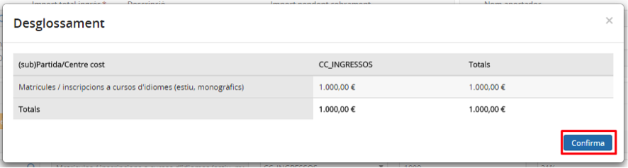

Imatge 20. Totalització per partida / subpartida i centre de cost

* Resum bases i impostos: extreu una pantalla amb informació totalitzada per tipus d’IVA (*Imatge 21. Totalització de bases i impostos*).

  + Premeu el botó *Confirma*  per tancar la pantalla i tornar a la pantalla de creació d’ingrés.

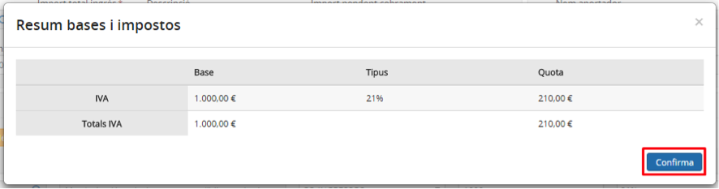

Imatge 21. Totalització de bases i impostos

---

**4. Afegir venciments**

Els venciments permeten definir els cobraments que es faran per aquest ingrés. Cada venciment té la seva pròpia data, l’import i el tipus de cobrament.

Per afegir un nou venciment a la taula de venciments cal seguir el procediment següent (*Imatge 22. Crear un nou venciment*):

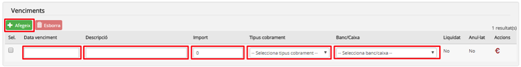

Imatge 22. Crear un nou venciment

* Premeu el botó *Afegeix* .
* S’afegeix una nova línia a la taula de venciments.
* Completeu els camps del venciment:

  + *Data venciment*: data prevista per al venciment.
  + *Descripció*: descripció del venciment.
  + *Import*: import previst per al venciment.
  + *Tipus cobrament*: forma de cobrament del venciment. Desplegable amb els següents valors.

    - *Transferència*: transferència bancaria.
    - *Rebut*: rebut domiciliat.
    - *Xec*: xec bancari.
    - *Targeta de crèdit*: tarja de crèdit bancària
    - *Efectiu*: cobrament en efectiu
    - *No pagable*: seleccioneu-lo si per algun motiu l’ingrés no es pot cobrar (per exemple que l’aportador hagi desaparegut).
  + *Banc/Caixa*: camp desplegables per seleccionar el banc o la caixa contra la qual es fa el cobrament. El contingut de la llista de selecció s’omple en funció del valor seleccionat al camp *Tipus cobrament*.

    - Si el camp *Tipus cobrament* val *Transferència, Rebut, Xec o Targeta de crèdit, la llista* s’omple amb tots els bancs actius del centre.
    - Si el camp *Tipus cobrament* té el valor *Efectiu*, la llista s’omple amb totes les caixes d’efectiu actives del centre.
    - Si el camp *Tipus pagament* té el valor No cobrable s’omple amb la partida de despesa que estigui marcada com a *Altres despeses*.
  + En cas que en el moment de crear el venciment aquest ja estigui cobrat es pot prémer el botó acció *Cobrar* .

    - El camp *Liquidat* canviarà el seu valor (No → Sí).

D’aquesta manera es poden afegir un o més venciments (*Imatge 23. Venciments creats*). La suma dels imports de tots els venciments ha de coincidir amb el camp *Import total ingrés* de la secció *Dades generals*.

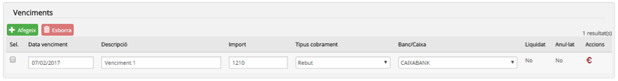

Imatge 23. Venciments creats

En cas que l’usuari s’hagi equivocat en la creació del venciment pot esborrar-lo i crear-lo de nou.

Per esborrar una línia de la taula de venciments cal seguir el procediment següent (*Imatge 24. Esborrar venciments*):

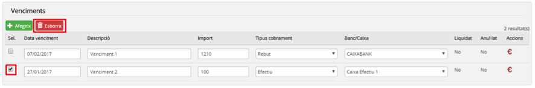

Imatge 24. Esborrar venciments

* Seleccioneu la línia de venciment que es vol esborrar. Se’n pot esborrar més d’una a la vegada.
* Premeu el botó *Esborra* .

  + La línia seleccionada s’esborra.

**5. Desar l’ingrés**

Una vegada que s’han completat tots els passos anteriors cal desar l’ingrés.

Per desar l’ingrés cal que seguiu el procediment següent (*Imatge 25. Desar l’ingrés*):

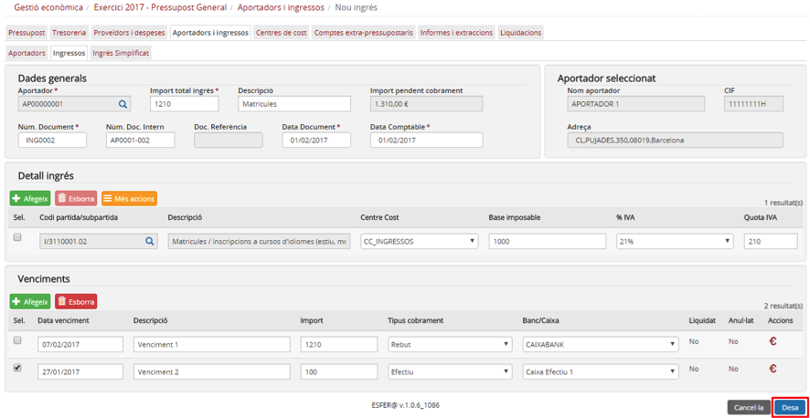

Imatge 25. Desar l’ingrés

* Premeu el botó *Desa* .

  + En cas que premeu el botó *Cancel·la*  es torna a la pantalla llistat d’ingressos (*Imatge 4. Llista d'ingressos*) sense guardar els canvis.
* El sistema fa les validacions de l’ingrés. Les principals validacions són:

  + El camp *Data comptable* ha d’estar dins de l’any del pressupost.
  + La suma de les línies de detall (*Base imposable + Quota IVA*) ha de coincidir amb el camp Import total ingrés.
  + La suma de tots els imports dels venciments ha de coincidir amb el camp *Import total ingrés*.
  + Validacions de saldo (segons escaigui).

    - Saldo de la partida / subpartida i centre de cost.
    - Saldo del compte extrapressupostari.
* En cas que hagin passat les validacions es desa l’ingrés i es torna a la pantalla de la llista d’ingrés (Imatge 26. Ingrés creat) on ja apareix l’ingrés creat, així com el missatge de confirmació de l’acció.

  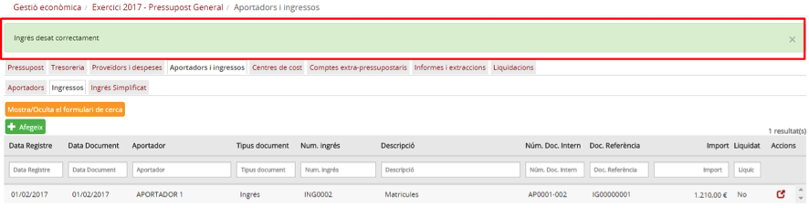

  Imatge 26. Ingrés creat

  + Si alguna validació falla es mostra un missatge d’error (*Imatge 27. Exemple de missatge d'error*) per tal que l’usuari pugui esmenar-la i tornar-ho a intentar.

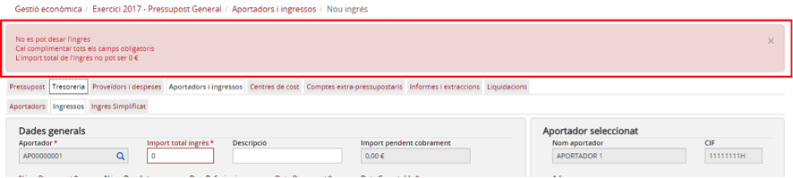

Imatge 27. Exemple de missatge d'error

---

### 2.6.2.4. Modificar un ingrés

És possible fer algunes modificacions sobre un ingrés ja creat. L’abast de les modificacions que es poden fer en un ingrés és bastant limitat. En cas que les modificacions no es puguin fer des de l’operació de modificació, cal anul·lar l’ingrés o fer una devolució (segons escaigui) i crear-lo de nou.

Els camps de l’ingrés que es poden modificar són els següents:

* *Núm. Document*: número d’ingrés que apareix al document enviat a l’aportador.
* *Núm. Doc. Intern*: número de document intern introduït per l’usuari.
* *Data document*: data de l’ingrés que apareix al document enviat a l’aportador.
* Informació dels venciments no liquidats. Els venciments liquidats només es poden anul·lar (veure l’apartat *Anul·lar un cobrament*).

Per modificar un ingrés cal seguir el procediment següent:

* Des de la pantalla de llista d’ingressos, premeu el botó d’acció  de l’ingrés que voleu modificar (*Imatge 28. Modificar ingrés*):

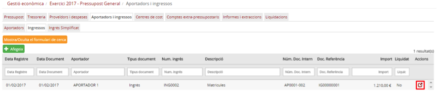

Imatge 28. Modificar ingrés

* Es mostra la pantalla de detall de l’ingrés (Imatge 29. Pantalla de detall de l’ingrés) amb tota la informació de l’ingrés, però només en format de lectura.

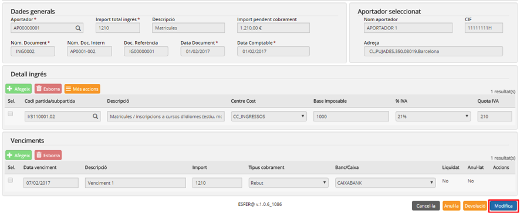

Imatge 29. Pantalla de detall de l’ingrés

* Per accedir a fer modificacions, premeu el botó *Modifica* .

  + En cas que premeu el botó *Cancel·la*  es torna a la pantalla de la llista d’ingressos (Imatge 28. Modificar ingrés) sense modificar l’ingrés.
* Es mostra la pantalla de modificació de l’ingrés (*Imatge 30. Ingrés en modificació*).

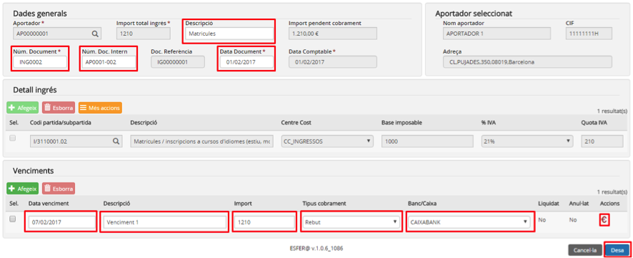

Imatge 30. Ingrés en modificació

* En aquest moment es poden modificar les dades de l’ingrés.
* Premeu el botó *Desa* .

  + En cas que es premi el botó *Cancel·la*  es torna a la pantalla de detall de l’ingrés (Imatge 29. Pantalla de detall de l’ingrés) sense desar els canvis.
* Si no hi ha errors, es guarda la informació modificada. El programa torna a la pantalla de la llista d’ingressos. Pel contrari, si hi ha errors, cal esmenar-los i tornar a intentar la acció de *Desar*.

---

### 2.6.2.5. Anul·lar un ingrés

En cas que s’hagi creat un ingrés de manera errònia el sistema permet anul·lar-lo. Els casos típics que poden portar a aquesta situació són els següents:

* S’ha creat un ingrés amb dades errònies que no es poden modificar:

  + Error en la data comptable.
  + Error en la dotació.
  + Error en l’aportador.
  + Altres errors.
* S’ha creat un ingrés duplicat.

Només es poden anul·lar ingressos corresponents a l’any del pressupost i que no hagin estat inclosos en cap liquidació d’impostos (IVA, IRPF).

Per anul·lar un ingrés cal seguir el procediment següent:

* Des de la pantalla de la llista d’ingressos, premeu el botó d’acció  de l’ingrés que es vol anul·lar (*Imatge 31. Selecció d'ingrés*):

Imatge 31. Selecció d'ingrés

* El programa mostra la pantalla de detall de l’ingrés (Imatge 32. Pantalla de detall de l’ingrés). Aquesta pantalla mostra tota la informació de l’ingrés però només en format de lectura.

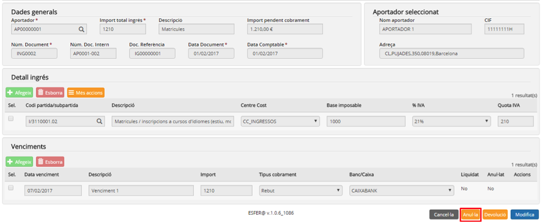

Imatge 32. Pantalla de detall de l’ingrés

* Premeu el botó *Anul·la* .

  + En cas que premeu el botó *Cancel·la*  es torna a la pantalla de la llista d’ingressos (*Imatge 31. Anul·lar ingrés*) sense anul·lar l’ingrés.
* Introduïu el motiu de l’anul·lació (*Imatge 33. Motiu anul·lació*).

Imatge 33. Motiu anul·lació

* Premeu el botó *Desa* .

  + En cas que premeu el botó *Cancel·la*  es torna a la pantalla de detall de l’ingrés (*Imatge 32. Pantalla de detall de l’ingrés*) sense anul·lar l’ingrés.
* Assumint que l’ingrés s’ha anul·lat per algun error, es facilita a l’usuari tornar-lo a crear: es mostra la pantalla de creació d’ingrés amb les mateixes dades de l’ingrés que s’acaba d’anul·lar per tal que l’usuari pugui esmenar-les i crear un nou ingrés, aquesta vegada, correcte (*Imatge 34. Crear de nou un ingrés anul·lat*).

  + El procés de creació d’aquest nou ingrés és el mateix que es descriu a *Introduir l’ingrés d’un aportador*.
  + Si no es vol crear de nou l’ingrés, premeu el botó *Cancel·la*  i el programa torna a la pantalla de la llista d’ingressos, sense crear el nou ingrés.

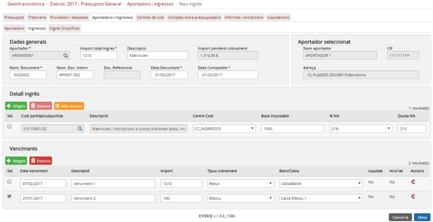

Imatge 34. Crear de nou un ingrés anul·lat

---

### 2.6.2.6. Fer devolució d’un ingrés

Quan per algun motiu cal fer una devolució (total o parcial) d’un ingrés cal emetre una devolució que s’ha de registrar en el mòdul de *Gestió econòmica* d’Esfer@.

Fer una devolució d’un ingrés és una acció similar a l’anul·lació però amb condicions pròpies (que van més enllà de les restriccions pròpies de l’anul·lació d’un ingrés):

* Una devolució pot ser total (de tot l’import d’un ingrés) o parcial.
* Es pot fer una devolució d’un ingrés d’un any anterior o d’un ingrés del mateix any del pressupost però per la qual ja s’hagin liquidat els impostos (IVA, IRPF).

Alguns casos típics en què cal registrar una devolució són:

* S’ha registrat un ingrés d’un aportador de manera correcta però es tracta d’una ingrés indegut. Després de fer una reclamació, es fa la devolució de l’ingrés.

  + En aquest cas es faria una devolució total per tot l’import de l’ingrés.
* S’ha registrat un ingrés per 10 ítems (llibres, per exemple) però l’aportador detecta que dels 10 rebuts n’hi ha 2 que de defectuosos. Després de fer una reclamació es fa una devolució pels dos ítems defectuosos.

  + En aquest cas es faria una devolució parcial.

Per fer una devolució cal seguir el procediment següent:

* Des de la pantalla de la llista d’ingressos, premeu el botó d’acció  de l’ingrés pel qual es vol fer la devolució (*Imatge 35. Selecció d'ingrés*).

Imatge 35. Selecció d'ingrés

* Es mostra la pantalla de detall de l’ingrés (*Imatge 36. Pantalla de detall de l’ingrés*). Aquesta pantalla mostra tota la informació de l’ingrés però només en format de lectura

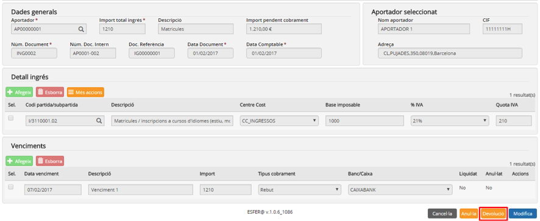

Imatge 36. Pantalla de detall de l’ingrés

* Premeu el botó *Devolució* .

  + En cas que premeu el botó *Cancel·la*  es torna a la pantalla de la llista d’ingressos (*Imatge 35. Devolució ingrés*) sense fer la devolució de l’ingrés.

* Es mostra la pantalla de creació de la devolució (*Imatge 37. Creació de la devolució d'abonament*). Aquest pàgina conté les mateixes dades de l’ingrés del qual es fa la devolució però amb les restriccions següents:

  + Tots els imports són negatius.
  + L’aportador no es pot modificar perquè és el mateix de l’ingrés.
  + Import total ingrés: per defecte apareix la quantitat total de l’ingrés. En cas que es vulgui fer una devolució parcial, cal canviar aquesta quantitat per la quantitat que es vol retornar realment.
  + *Descripció*: cal introduir la descripció pròpia de la devolució.
  + *Núm document*: cal introduir el número de la devolució enviat a l’aportador.
  + *Data document*: cal introduir la data de la devolució enviada a l’aportador.
  + *Data comptable*: cal introduir la data comptable de la devolució.

    - En general, la data comptable serà la mateixa que la data de l’ingrés (data document) llevat que aquesta estigui dins un període del qual ja s’han liquidat els impostos. El sistema valida que la data comptable sigui correcta i impedeix introduir valors que correspongui a períodes ja liquidats.
    - La data comptable ha d’estar dins de l’any del pressupost.
* Dins de la secció *Detall de la devolució* es mostren les partides / subpartides (i centres de cost) o comptes extrapressupostaris que hi havia a l’ingrés amb les mateixes quantitats i signe negatiu. En cas que es vulgui fer una devolució parcial, caldrà canviar aquestes quantitats per la quantitat que es vulgui retornar realment i fer que s’ajusti a la quantitat del camp *Import total ingrés*.

  + En cas que es tracti d’un ingrés d’un exercici anterior i les partides (o comptes extrapressupostaris) ja no existeixin en el pressupost de l’any en curs, la línia es carregarà en blanc (només amb els imports). L’usuari haurà d’assignar les partides / subpartides (i centres de cost) o comptes extrapressupostaris o esborrar aquestes línies i crear-ne de noves.

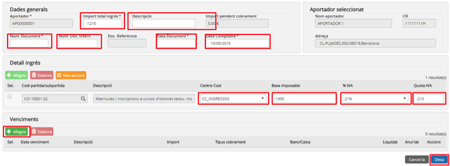

Imatge 37. Creació de la devolució d'abonament

**a) Venciments en la devolució**

Per defecte, la devolució es crea sense cap venciment.

El procediment per crear els venciments en l’abonament és el següent (*Imatge 38. Venciments devolució*):

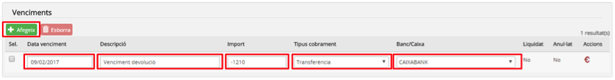

Imatge 38. Venciments devolució

* Premeu el botó *Afegeix*  .
* S’afegeix una nova línia a la taula de venciments.
* Completeu els camps del venciment:

  + *Data venciment*: data prevista per al venciment.
  + *Descripció*: descripció del venciment.
  + *Import*: import previst per al venciment.
  + *Tipus de cobrament*: forma de cobrament del venciment. Desplegable amb els valors següents:

    - *Transferència*: transferència bancaria.
    - *Rebut*: rebut domiciliat.
    - *Xec*: xec bancari.
    - *Targeta de crèdit*: targeta bancària de crèdit
    - *Efectiu*: pagament en efectiu
    - *No pagable*: seleccioneu-ho si per algun motiu la devolució no es pot pagar (per exemple que l’aportador hagi desaparegut).
  + *Banc/Caixa*: camp desplegable per seleccionar el banc o la caixa contra la qual es fa el pagament. El contingut de la llista de selecció s’omple en funció del valor seleccionat al camp *Tipus cobrament*.

    - Si el camp *Tipus cobrament* val *Transferència, Rebut, Xec o Targeta de crèdit*, la llista s’omple amb tots els bancs actius del centre.
    - Si el camp *Tipus cobrament* val *Efectiu*, la llista s’omple amb totes les caixes d’efectiu actives del centre.
    - Si el camp *Tipus cobrament* val *No Pagable* s’omple amb la partida de despesa que estigui marcada com a *Altres despeses*.
  + En cas que en el moment de crear el venciment aquest ja estigui cobrat, podeu prémer el botó acció *Cobrar* .

    - El camp *Liquidat* canviarà el seu valor (No → Sí).

D’aquesta manera es poden afegir un o més venciments (*Imatge 39. Venciments creats*). La suma dels imports de tots els venciments ha de coincidir amb el camp *Import total* a de la secció *Dades generals*.

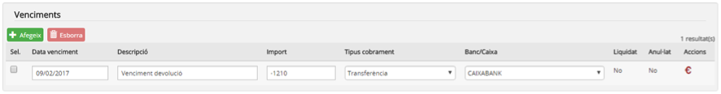

Imatge 39. Venciments creats

En cas que l’usuari s’hagi equivocat en la creació del venciment podrà esborrar-lo i crear-lo de nou.

Per esborrar una línia de la taula de venciments cal seguir el procediment següent (*Imatge 40. Esborrar venciments*):

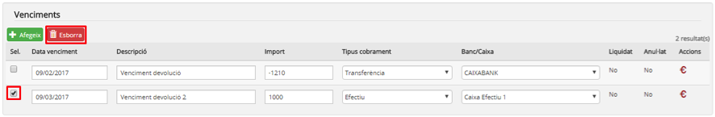

Imatge 40. Esborrar venciments

* Seleccioneu la línia de venciment que voleu esborrar. Si voleu, se’n pot esborrar més d’una a la vegada.
* Premeu el botó *Esborra* .

  + La línia seleccionada s’esborra.

**b) Desar la devolució**

Una vegada que s’han completat tots els passos anteriors cal desar la devolució.

Per desar la devolució cal seguir el procediment següent (*Imatge 41. Desar la devolució*):

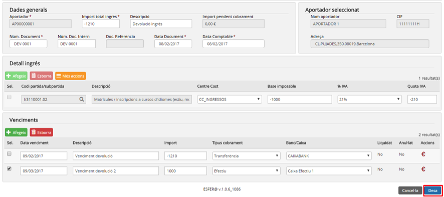

Imatge 41. Desar la devolució

* Premeu el botó *Desa* .

  + En cas que premeu el botó *Cancel·la*  es torna a la pantalla de la llista d’ingressos (*Imatge 35. Devolució ingrés*) sense desar-la.
* El sistema fa les validacions de la devolució. Les principals validacions són:

  + El camp *Data comptable* ha d’estar dins de l’any del pressupost.
  + La suma de les línies de detall (*Base imposable + Quota IVA*) ha de coincidir amb el camp *Import total ingrés*.
  + La suma de tots els imports dels venciments ha de coincidir amb el camp *Import total ingrés.*
  + Validacions de contra l’imputat (segons escaigui).
* Saldo de la partida / subpartida i centre de cost.
* Saldo del compte extrapressupostari.
* En cas que hagin passat les validacions, es desa l’abonament i es torna a la pantalla de la llista d’ingressos (*Imatge 42. Devolució creada*) on ja apareix la devolució creada.

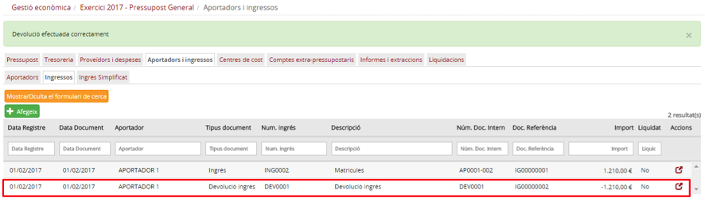

Imatge 42. Devolució creada

---

### 2.6.2.7. Cobrament parcial o total de l’import pendent d’un ingrés

Moltes vegades, els venciments dels ingressos són posteriors a la data de registre. Això vol dir que, en el moment en què el cobrament es faci efectiu, s’haurà de registrar el cobrament en la gestió comptable.

Atès que els venciments estan estretament lligats a l’ingrés, per poder registrar-ne el cobrament, cal entrar en la modificació de l’ingrés i marcar els venciments com a cobrats.

Per poder marcar un venciment com a cobrat cal seguir el procediment següent:

* Des de la pantalla de la llista d’ingressos, premeu el botó d’acció  de l’ingrés per al qual es vol registrar el cobrament (*Imatge 43. Cobrament total o parcial d'un ingrés*).

Imatge 43. Cobrament total o parcial d'un ingrés

* Es mostrarà la pantalla de detall de l’ingrés (*Imatge 44. Pantalla de detall de l’ingrés*). Aquesta pantalla mostra tota la informació de l’ingrés però només en format de lectura.

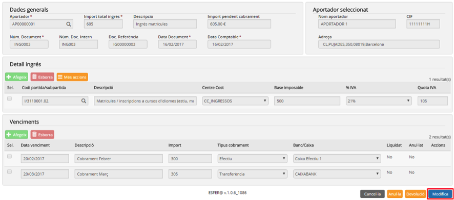

Imatge 44. Pantalla de detall de l’ingrés

* Premeu el botó *Modifica* .

  + En cas que premeu el botó *Cancel·la*  es torna a la pantalla de la llista d’ingressos (Imatge 43. Cobrament total o parcial d'un ingrés) sense modificar l’ingrés.
* Es mostra la pantalla de modificació de l’ingrés (*Imatge 45. Registrar cobrament*).

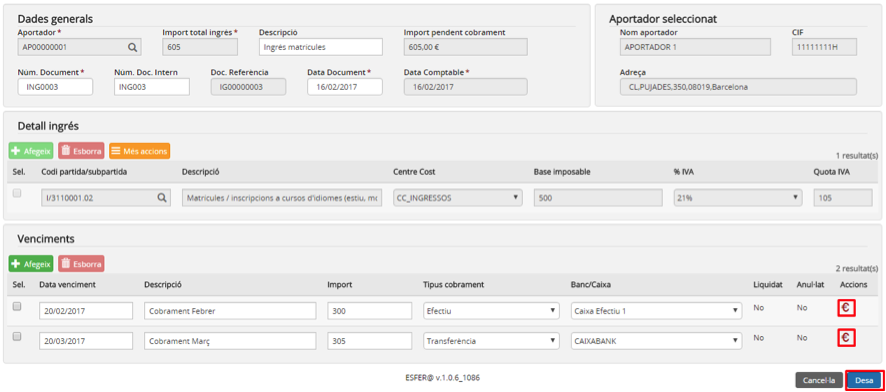

Imatge 45. Registrar cobrament

* Premeu el botó d’acció  sobre el venciment per registrar el cobrament.

  + El venciment canvia l’estat del camp *Liquidat de No a Sí* (*Imatge 46. Venciment liquidat*).

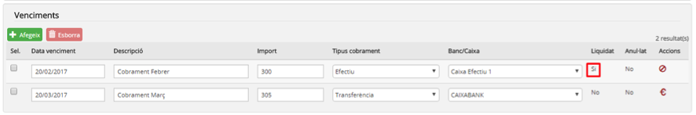

Imatge 46. Venciment liquidat

* Premeu el botó *Desa* .

  + En cas que premeu el botó *Cancel·la*  es torna a la pantalla de detall de l’ingrés (*Imatge 44. Pantalla de detall de l’ingrés*) sense desar els canvis.
* En cas que a l’ingrés ja no hi quedi cap venciment pendent de liquidar, l’estat de liquidació de l’ingrés canvia (No → Sí).

---

## 2.6.2.8. Anul·lar un cobrament

En cas que per algun motiu, un cobrament ja registrat s’hagi de tirar enrere (ja sigui perquè s’ha registrat erròniament o perquè ho hagi demanat l’aportador), es pot anul·lar el cobrament.

Per poder anul·lar un cobrament cal seguir el procediment següent:

* Des de la pantalla de la llista d’ingressos, premeuel botó d’acció  de l’ingrés per al qual es vol anul·lar el cobrament (*Imatge 47. Anul·lar un cobrament*).

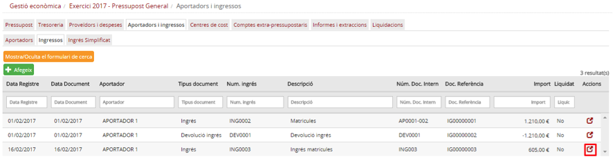

Imatge 47. Anul·lar un cobrament

* Es mostrarà la pantalla de detall de l’ingrés (*Imatge 48. Pantalla de detall de l’ingrés*). Aquesta pantalla mostra tota la informació de l’ingrés, però només en format de lectura.

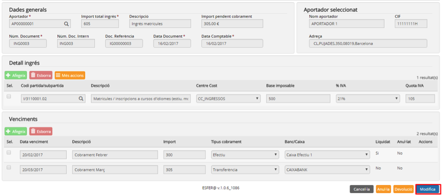

Imatge 48. Pantalla de detall de l’ingrés

* Premeu el botó *Modifica* .

  + En cas que premeu el botó *Cancel·la* es torna a la pantalla de la llista d’ingressos (*Imatge 47. Anul·lar un cobrament*) sense modificar l’ingrés.
* Es mostra la pantalla de modificació de l’ingrés (*Imatge 49. Anul·lar un cobrament ja registrat*).

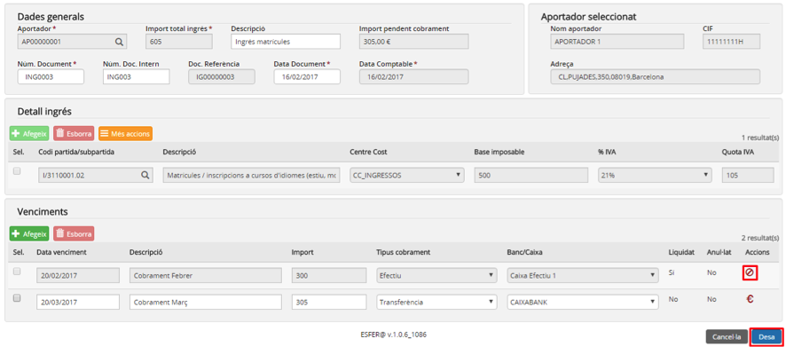

Imatge 49. Anul·lar un cobrament ja registrat

* Premeu el botó d’acció  sobre el venciment per anul·lar-ne el cobrament.

  + El venciment canvia l’estat del camp *Anul·lat de No a Sí (Imatge 50. Venciment anul·lat)*.

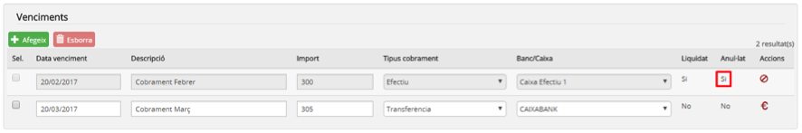

Imatge 50. Venciment anul·lat

* Atès que el venciment s’ha anul·lat, la suma dels imports dels venciments ja no coincideix amb el camp *Import total ingrés*. Per aquest motiu caldrà afegir nous venciments a l’ingrés per restablir l’equilibri. El procediment per afegir nous venciments és que es descriu a l’apartat 4.-Afegir venciments (*Imatge 51. Venciments equilibrats després d'una anul·lació*).

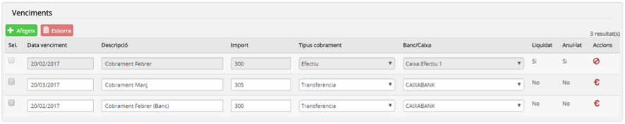

Imatge 51. Venciments equilibrats després d'una anul·lació

* Premeu el botó *Desa* .

  + En cas que premeu el botó *Cancel·la*  es torna a la pantalla de detall de l’ingrés (*Imatge 48. Pantalla de detall de l’ingrés*) sense desar els canvis.
* En cas que l’ingrés ja estigués liquidat, l’estat de liquidació després d’anul·lar-ne un venciment canviarà (*Sí* → *No*).
* A partir d’aquest moment, el venciment anul·lat ja no sortirà a la pantalla de detall de l’ingrés (*Imatge 49. Anul·lar un cobrament ja registrat*).

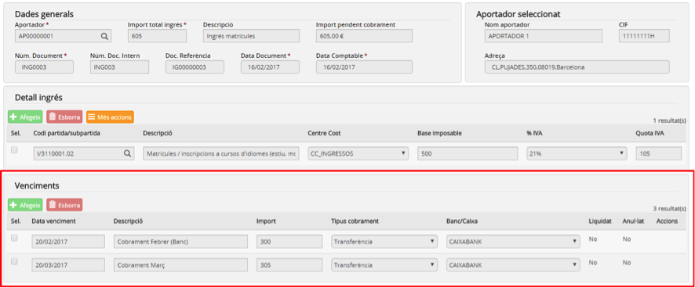

Imatge 52. Venciments anul·lats no apareixen a la llista