# 3.1 Gestió de comptes bancaris i caixes d’efectiu

* [3.1.1. Descripció](ap31.md#311-descripcio)
* [3.1.2. Gestió de comptes bancaris](ap31.md#312-gestio-de-comptes-bancaris)

  + [3.1.2.1. Accés](ap31.md#3121-acces)
  + [3.1.2.2. Llista de comptes bancaris](ap31.md#3122-llista-de-comptes-bancaris)
  + [3.1.2.3. Donar d’alta un compte bancari](ap31.md#3123-donar-dalta-un-compte-bancari)
  + [3.1.2.4. Modificar dades d’un compte bancari](ap31.md#3124-modificar-dades-dun-compte-bancari)
  + [3.1.2.5. Desactivar un compte bancari](ap31.md#3125-desactivar-un-compte-bancari)
  + [3.1.2.6. Reactivar un compte bancari](ap31.md#3126-reactivar-un-compte-bancari)
* [3.1.3. Gestió de caixes d’efectiu](ap31.md#313-gestio-de-caixes-defectiu)

  + [3.1.3.1. Accés](ap31.md#3131-acces)
  + [3.1.2.2. Llista de caixes d’efectiu](ap31.md#3122-llista-de-caixes-defectiu)
  + [3.1.2.3. Donar d’alta una caixa d’efectiu](ap31.md#3123-donar-dalta-una-caixa-defectiu)
  + [3.1.2.4. Modificar dades d’una caixa d’efectiu](ap31.md#3124-modificar-dades-duna-caixa-defectiu)
  + [3.1.2.5. Desactivar una caixa d’efectiu](ap31.md#3125-desactivar-una-caixa-defectiu)
  + [3.1.2.6. Reactivar una caixa d’efectiu](ap31.md#3126-reactivar-una-caixa-defectiu)

---

## 3.1.1. Descripció

En aquest contingut es mostrarà com donar d’alta i gestionar els comptes bancaris i caixes de diners en efectiu d’un centre educatiu per part del director/usuari de Gestió econòmica del mòdul de *Gestió econòmica*.

El director/usuari de la Gestió econòmica pot definir els comptes bancaris i les caixes d’efectiu que tindrà el seu propi centre per tal que tots el centre pugui gestionar comptes bancaris i caixes de diners específics

La gestió dels comptes bancaris i caixes de diners en efectiu de l’exercici actual són d’ús exclusiu del director/usuari.

---

## 3.1.2. Gestió de comptes bancaris

La gestió dels comptes bancaris permet definir els comptes bancaris que té el centre a Esfer@. Aquests comptes bancaris seran els que apareixeran en els mòduls d’ingrés i despesa per poder registra-ne les operacions.

### 3.1.2.1. Accés

Des de la pàgina principal d’Esfer@ cal anar al mòdul de *Gestió econòmica*.

Imatge 1. Pantalla inicial d’Esfer@

Una vegada s’hagi accedit al mòdul de Gestió econòmica apareix a sota un nou menú amb les opcions dels pressupostos vigents. Aquí cal seleccionar un pressupost.

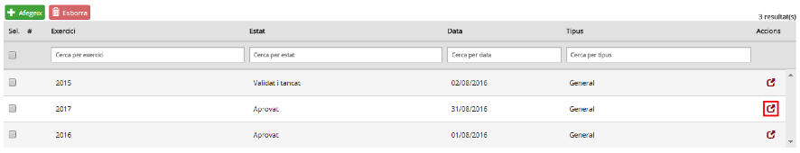

Imatge 2. Llista de pressupostos

A continuació cal seleccionar la pestanya Tresoreria i l’opció Comptes bancaris, que ja apareix seleccionada per defecte (Imatge 3. Estructura de pestanyes).

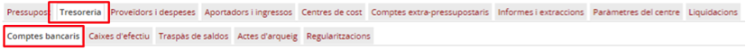

Imatge 3. Estructura de pestanyes

Apareix la llista de comptes bancaris (*Imatge 4. Llista de comptes bancaris*).

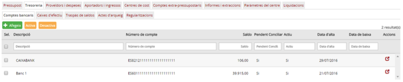

Imatge 4. Llista de comptes bancaris

---

### 3.1.2.2. Llista de comptes bancaris

En aquesta pantalla apareix una fila per cada *compte bancari* amb la informació següent (en forma de columnes):

* *Titular del compte*: correspon al titular del compte bancari.
* *Número de compte*: correspon al número de compte bancari.
* *Saldo*: correspon al saldo del compte bancari.
* *Data d’alta*: correspon a la data d’alta del compte bancari.
* *Data de baixa*: correspon a la data de baixa del compte bancari.

I dos camps corresponents a una propietat del compte bancari mateix:

* *Pendent de conciliar*: identifica el compte bancari específic per Pendent de conciliar
* *Actiu*: estat del compte bancari (*Actiu / inactiu*).

Igualment, a la part esquerra de la fila apareix un quadrat per seleccionar la fila i fer alguna operació (que es comenta més endavant); a la part dreta apareix la icona  per editar la fila corresponent del compte bancari.

A la capçalera de les pantalles de detall apareix el nom del camp. A sota de cada columna hi ha un requadre per poder aplicar filtres sobre la informació de detall.

Des d’aquesta pantalla es poden fer les accions d’afegir, modificar, desactivar o reactivar *comptes bancaris*.

---

### 3.1.2.3. Donar d’alta un compte bancari

Per afegir un nou *compte bancari* cal seguir el procediment següent:

* Des de la pantalla de la llista de comptes bancaris, premeu el botó *Afegeix*  (*Imatge 5. Donar d'alta un compte bancari*).

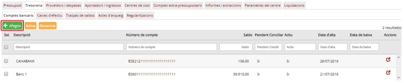

Imatge 5. Donar d'alta un compte bancari

* A continuació es mostra la pantalla per afegir les dades d’un compte bancari (*Imatge 6. Pantalla de nou compte bancari*).

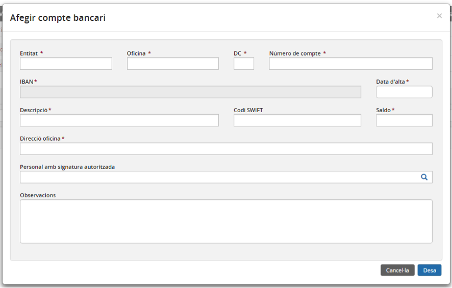

Imatge 6. Pantalla de nou compte bancari

* Cal omplir (com a mínim) tots els camps obligatoris de la pantalla (els que tenen un asterisc al costat):

  + *Entitat (obligatori)*: entitat del compte bancari. Valor numèric que ha de ser únic per cada compte bancari de la mateixa entitat financiera.
  + *Oficina (obligatori)*: oficina del compte bancari.
  + *DC (obligatori)*: digit de control de l’entitat financiera del compte bancari.
  + *Número de compte (obligatori)*: número de compte bacari.
  + *IBAN (obligatori)*: IBAN del compte bancari
  + *Data d’alta (obligatori)*: data d’alta del compte bancari. Data automàtica.
  + *Descripció (obligatori)*: descripció del compte bancari
  + *Titular del compte (obligatori)*: titular del compte bancari
  + *Codi SWIFT*: codi Swift del compte bancari
  + *Direcció oficina (obligatori)*: direcció de l’oficina del compte bancari
  + *Personal amb signatura autoritzada*: nom del personal amb signatura autoritzada del compte bancari
  + *Observacions*: observacions del compte bancari

* Premeu el botó *Desa* . Si no hi ha cap error a les dades introduïdes, es desa la informació del nou compte bancari i el programa torna a la pantalla de comptes bancaris (*Imatge 4. Llista de comptes bancaris*), on ja apareix la fila corresponent al nou compte.

  + Si es prem el botó *Cancel·la*  apareix el quadre de diàleg següent (*Imatge 7. Confirmació cancel·lació*):  

    

    Imatge 7. Confirmació cancel·lació

    - Si es *confirma*  es retorna a la pantalla (*Imatge 4. Llista de comptes bancaris*) sense haver guardat el compte bancari.

---

### 3.1.2.4. Modificar dades d’un compte bancari

Les dades d’un compte bancari es poden modificar per actualitzar-ne la informació. Per modificar la informació d’un compte bancari cal seguir el següent procediment:

* Des de la pantalla de la *Imatge 4. Llista de comptes bancaris*, seleccioneu la fila del compte bancari que es vol modificar (*Imatge 8. Modificar les dades d'un compte bancari*).

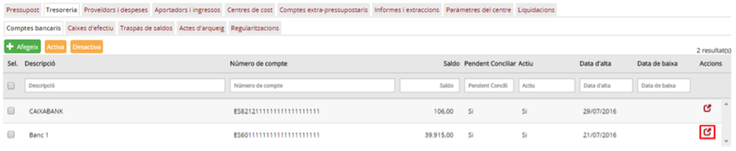

Imatge 8. Modificar les dades d'un compte bancari

* Apareix la pantalla amb la informació del compte bancari (*Imatge 9. Dades del compte bancari*).

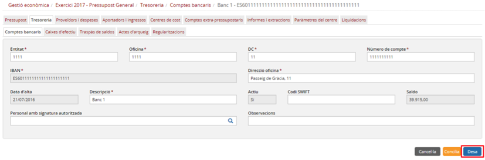

Imatge 9. Dades del compte bancari

* En aquest moment es pot modificar la informació del compte bancari, amb nous valors.
* Premeu el botó *Desa* : si no hi ha cap error a les dades introduïdes, es desa la nova informació del compte bancari i el programa torna a la pantalla de la imatge (*Imatge 4. Llista de comptes bancaris*), on ja apareix la nova la informació.

  + Si es prem el botó *Cancel·la* , apareix el quadre de diàleg següent (*Imatge 10. Confirmació cancel·lació*):  

    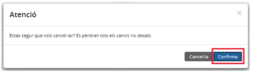

    10. Confirmació cancel·lació

    - Si es *confirma* , el programa retorna a la pantalla de la imatge (*Imatge 4. Llista de comptes bancaris*), sense haver guardat la nova informació del compte bancari.

---

### 3.1.2.5. Desactivar un compte bancari

Un compte bancari es pot desactivar per tal de no poder-hi fer operacions. Per desactivar un compte bancari haurem de seguir el procediment següent:

* Des de la patalla de la *Imatge 4. Llista de comptes bancaris*, seleccioneu el compte que es voleu desactivar, (marcant el quadrat a la part esquerra de la fila), i premeu l’opció *Desactiva*  (*Imatge 11. Desactivar un compte bancari*).  

  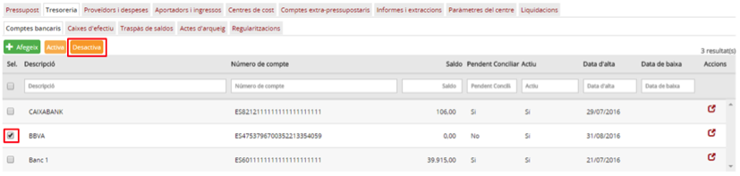

  Imatge 11. Desactivar un compte bancari

  + o NOTA: Aquesta acció serà vàlida sempre que el saldo del compte bancari sigui igual a 0. Per aconseguir-ho es pot fer un traspàs de saldos entre comptes bancaris i/o caixes d’efectiu.
* En el cas que estigui permès desactivar un compte bancari, abans de l’acció el programa demana una data de desactivació (no pot ser anterior a la data d’alta) (*Imatge 12. Data descativació d'un compte bancari*).

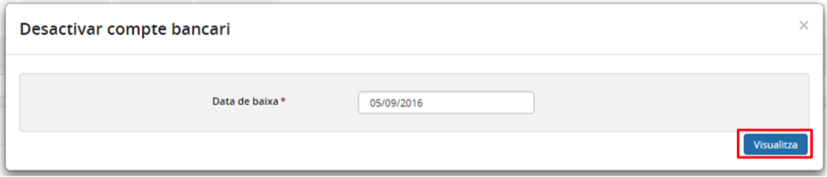

Imatge 12. Data de descativació d'un compte bancari

* Es torna a la pantalla de llista de comptes bancaris on el compte ja apareix com a desactivat.

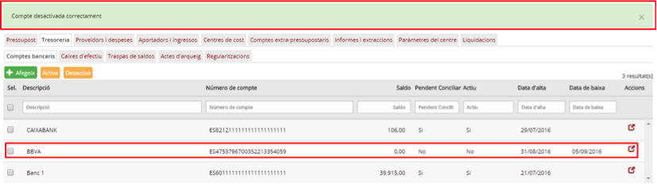

---

### 3.1.2.6. Reactivar un compte bancari

Es pot reactivar un compte bancari inactiu de manera que es podrà tornar a utilitzar en operacions de Gestió econòmica.

Per reactivar un compte bancari cal seguir el procediment següent:

* Des de la patalla de la *Imatge 4. Llista de comptes bancaris*, seleccioneu el compte inactiu que voleu reactivar marcant el quadrat a la part esquerra de la fila i premeu l’opció *Activa*  (*Imatge 13. Reactivar un compte bancari*) .

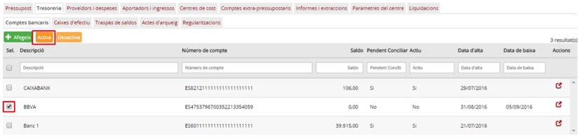

Imatge 13. Reactivar un compte bancari

* Abans de l’acció, el programa demana una data d’alta, que no pot ser anterior a la data de desactivació (*Imatge 13. Data de reactivació de compte bancari*).

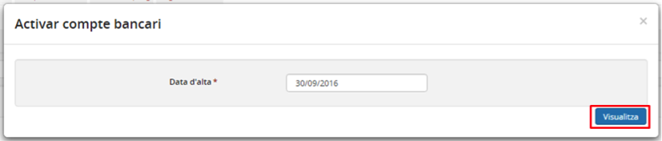

Imatge 14. Data de reactivació d'un compte bancari

* Es torna a la pantalla de llista de comptes bancaris on el compte ja apareix com a activat (*Imatge 15. Compte bancari reactivat*).

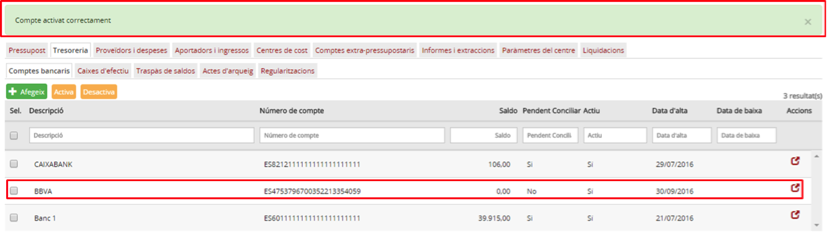

Imatge 15. Compte bancari reactivat

---

## 3.1.3. Gestió de caixes d’efectiu

La gestió de les caixes d’efectiu permet definir les caixes que té el centre a d’Esfer@. Aquestes caixe són les que apareixeran en els mòduls d’ingrés i despesa per poder registra-ne les operacions.

### 3.1.3.1. Accés

Des de la pàgina principal d’Esfer@ cal anar al mòdul de *Gestió econòmica*.

Imatge 16. Pantalla inicial d’Esfer@

Una vegada s’hagi accedit al mòdul de Gestió econòmica apareix a sota un nou menú amb les opcions dels pressupostos vigents. Aquí cal seleccionar un pressupost.

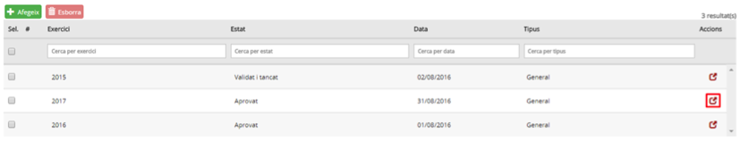

Imatge 17. Llista de pressupostos

A continuació cal seleccionar la pestanya *Tresoreria* i l’opció *Caixes d’efectiu*,

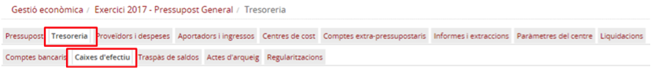

Imatge 18. Estructura de pestanyes

Apareix la llista de llista de Caixes d’efectiu (*Imatge 19. Llista de caixes d’efectiu*).

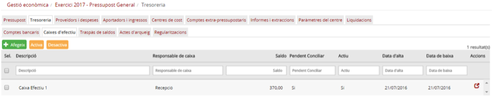

Imatge 19. Llista de caixes d’efectiu

---

### 3.1.3.2. Llista de caixes d’efectiu

En aquesta pantalla apareix una fila per cada *caixa d’efectiu* amb la informació següent (en forma de columnes):

* *Descripció*: correspon a la descripció de la caixa d’efectiu.
* *Responsable de caixa*: correspon al responsable de la caixa d’efectiu.
* *Saldo*: correspon al saldo de la caixa d’efectiu.
* *Data d’alta*: correspon a la data d’alta de la caixa d’efectiu.
* *Data de baixa*: correspon a la data de baixa de la caixa d’efectiu.
* *Pendent de conciliar*: identifica la caixa d’efectiu específica pendent conciliar.
* *Actiu*: identifica l’estat de la caixa d’efectiu (Activa / Inactiva).

Igualment, a la part esquerra de la fila apareix un quadrat per seleccionar la fila i fer alguna operació (que es comenta més endavant). I a la part dreta apareix la icona  per editar la fila de la caixa d’efectiu corresponent.

A la capçalera de les pantalles de detall apareix el nom del camp. A sota de cada columna hi ha un requadre per poder aplicar filtres sobre la informació de detall.

Des d’aquesta pantalla es poden fer les accions d’afegir, modificar, desactivar o reactivar caixes d’efectiu.

---

### 3.1.3.3. Donar d’alta una caixa d’efectiu

Per afegir un nova caixa d’efectiu cal seguir el procediment següent:

* Des de la pantalla de llista de caixes d’efectiu, premeu el botó *Afegeix*  (*Imatge 20. Donar d'alta caixa d’efectiu*).

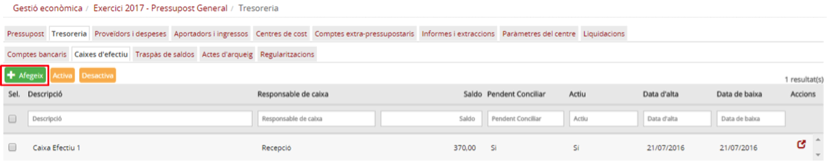

Imatge 20. Donar d'alta una nova caixa d’efectiu

* A continuació es mostra el quadre de diàleg per afegir les dades d’una caixa d’efectiu (Imatge 21. Pantalla d’una nova caixa d’efectiu).

Imatge 21. Pantalla d’una nova caixa d’efectiu

* Cal omplir (com a mínim) tots els camps obligatoris de la pantalla (els que tenen l’asterisc al costat):

  + *Descripció (obligatori)*: descripció de la caixa d’efectiu.
  + *Data d’alta(obligatori)*: data d’alta la caixa d’efecti u
  + *Responsable (obligatori)*: resposable de la caixa d’efectiu.
  + *Observacions*: observacions de la caixa d’efectiu

* Prémer el botó *Desa* . Si no hi ha cap error a les dades introduïdes, es desa la informació de la nova caixa d’efectiu i el programa torna a la pantalla de la imatge (*Imatge 19. Llista de caixes d’efectiu*), on ja apareix la fila corresponent a la nova caixa d’efectiu creada.

  + Si es prem el botó , apareix el quadre de diàleg següent (*Imatge 22. Confirmació cancel·lació*).  

    

    Imatge 22. Confirmació cancel·lació

    - Si es confirma  es retorna a la pantalla de la imatge (*Imatge 19. Llista de caixes d’efectiu*), sense haver guardat el compte bancari.

---

### 3.1.3.4. Modificar dades d’una caixa d’efectiu

Les dades d’una caixa d’efectiu es poden modificar per actualitzar-ne la informació. Per modificar una caixa d’efectiu cal seguir el procediment següent:

* Des de la pantalla de la *Imatge 17. Llista de caixes d’efectiu*, seleccioneu la fila de la caixa d’efectiu que es vol modificar (*Imatge 23. Modificar caixa d'efectiu*).

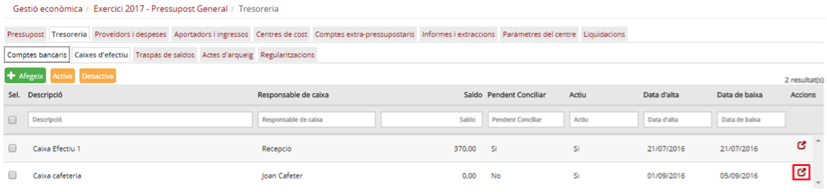

Imatge 23. Modificar caixa d'efectiu

* Apareix la pantalla amb la informació de la caixa d’efectiu (*Imatge 24. Dades de la caixa d'efectiu*).

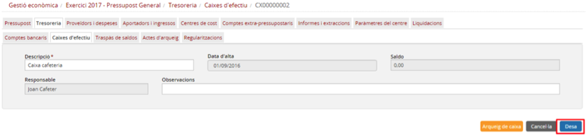

Imatge 24. Dades de la caixa d'efectiu

* En aquest moment es pot modificar la informació de la caixa d’efectiu, amb nous valors.
* Premeu el botó *Desa* : si no hi ha cap error a les dades introduïdes, es desa la nova informació de la caixa d’efectiu i el programa torna a la pantalla de la imatge (*Imatge 19. Llista de caixes d’efectiu*), on ja apareix la nova la informació.

  + Si es prem el botó *Cancel·la* , apareix el quadre de diàleg següent (Imatge 25. Confirmació cancel·lació):  

    

    Imatge 24. Dades de la caixa d'efectiu

    - Si es es *Confirma* , el programa retorna a la pantalla de la imatge (*Imatge 19. Llista de caixes d’efectiu*), sense haver guardat la nova informació del compte bancari.

---

### 3.1.3.5. Desactivar una caixa d’efectiu

Una caixa d’efectiu es pot desactivar per tal de no poder-hi operar. Per desactivar una caixa d’efectiu hem de seguir el procediment següent:

* Des de la patalla de la imatge (*Imatge 19. Llista de caixes d’efectiu*), seleccioneu la caixa d’efectiu que voleu desactivar (marcant el quadret a la part esquerra de la fila), i premeu l’opció *Desactiva*  (*Imatge 26. Desactivar una caixa d'efectiu*).

  + NOTA: Aquesta acció serà vàlida sempre que el saldo de la caixa d’efectiu sigui igual a 0. Per aconseguir-ho es pot fer un traspàs de saldos entre comptes bancaris i/o caixes d’efectiu.

* En el cas que estigui permès desactivar un compte bancari, prèviament a l’acció el programa demana una data de desactivació, que no pot ser anterior a la data d’alta. (*Imatge 25. Data de desactivació de caixa d’efectiu*).

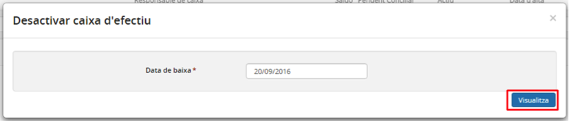

Imatge 27. Data desactivació caixa d'efectiu

* Es torna a la pantalla de llista de caixes d’efectiu on la caixa ja apareix com a inactiva (*Imatge 28. Caixa d'efectiu desactivada*).

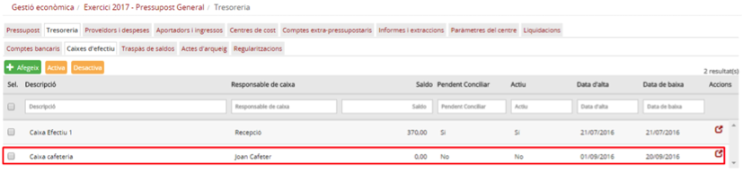

Imatge 28. Caixa d'efectiu desactivada

---

### 3.1.3.6. Reactivar una caixa d’efectiu

Es pot reactivar una caixa d’efectiu que estava en estat inactiu, de manera que es podrà tornar a utilitzar en operacions de Gestió econòmica.

Per reactivar una caixa d’efectiu cal seguir el procediment següent:

* Des de la patalla de la *Imatge 17. Llista de caixes d’efectiu*, seleccioneu la caixa d’efectiu en estat inactiu que es vol reactivar, (marcant el quadret a la part esquerra de la fila), i premeu l’opció *Activa*  (*Imatge 26. Reactivar caixa d’efectiu)*.  

  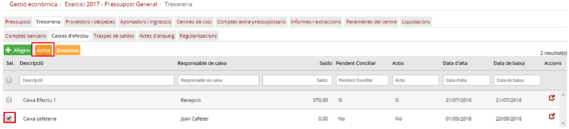

  Imatge 29. Reactivar una caixa d'efectiu

  + Abans de l’acció, el programa demana una data d’alta, que no pot ser anterior a la data de desactivació (*Imatge 30. Data reactivació de caixa d'efectiu*).

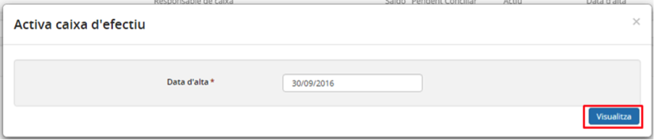

Imatge 30. Data reactivació de caixa d'efectiu

* Es torna a la pantalla de llista de caixes d’efectiu on la caixa ja apareix com a activa (*Imatge 31. Caixa d'efectiu reactivada*).

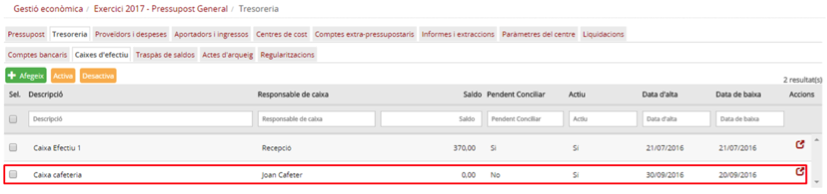

Imatge 31. Caixa d'efectiu reactivada