# 3.2. Gestió de la tresoreria

* [3.2.1. Descripció](ap32.md#321-descripció)
* [3.2.2. Contingut pas a pas](ap32.md#322-contingut-pas-a-pas)

  + [3.2.2.1. Accés](ap32.md#3221-accés)
  + [3.2.2.2. Fer traspàs de tresoreria entre comptes bancaris o de caixa efectiu](ap32.md#3222-fer-traspàs-de-tresoreria-entre-comptes-bancaris-o-de-caixa-efectiu)
  + [3.2.2.3. Arqueig de caixa d’efectiu](ap32.md#3223-arqueig-de-caixa-defectiu)
  + [3.2.2.4. Conciliació d’un compte bancari](ap32.md#3224-conciliació-dun-compte-bancari)
  + [3.2.2.5. Sol·licitud de regularitzacions de saldos](ap32.md#3225-sollicitud-de-regularitzacions-de-saldos)
  + [3.2.2.6. Actes d’arqueig](ap32.md#3226-actes-darqueig)

---

## 3.2.1. Descripció

En l’activitat del dia a dia del centre hi ha certes operacions relacionades amb els moviments de diners i amb la gestió de les caixes d’efectiu i els centres bancaris.

En aquest contingut es mostrarà com gestionar les operacions de tresoreria que afecten **caixes d’efectiu i comptes bancaris**:

* Traspassos de saldo.
* Conciliació de comptes bancaris.
* Arqueig de caixes.
* Actes d’arqueig.
* Sol·licitud de regularització de saldos.

La gestió dels comptes bancaris i caixes de diners en efectiu de l’exercici actual són d’ús exclusiu del director/usuari.

---

## 3.2.2. Contingut pas a pas

## 3.2.2.1 Accés

L’operativa per accedir als centres de cost és la següent: des de la pàgina principal d’Esfer@ cal anar al mòdul de *Gestió econòmica*.

Imatge 1. Pantalla inicial d’Esfer@

Una vegada s’accedeix al mòdul de *Gestió econòmica (Imatge 1. Pantalla inicial d’Esfer@)* apareixerà una llista de pressupostos del centre *(Imatge 1. Pantalla inicial d’Esfer@)*.

Imatge 2. Llista de pressupostos

La informació de les columnes d’aquesta llista és la següent:

* *Exercici*: exercici fiscal (any) del pressupost.
* *Estat*: estat del pressupost. Per informació detallada sobre els estats del pressupost, consulteu els continguts específics d’Evolució del pressupost.
* *Data*: data de l’últim canvi d’estat del pressupost.
* *Tipus*: tipus de pressupost.

  + *General*.
  + *Menjador*.
* *Botó d’acció* : permet accedir al detall del pressupost i permet detallar la dotació.

A la capçalera de les columnes apareix el nom del camp corresponent. A sota, hi ha uns espais per poder aplicar filtres sobre la informació de detall.

Premeu el botó d’acció  per entrar en el detall del pressupost amb què es vol treballar (Imatge 3. Pantalla de detall del pressupost).

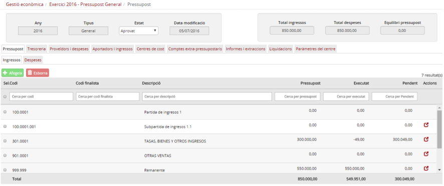

Imatge 3. Pantalla de detall del pressupost

A continuació heu de triar la pestanya *Tresoreria* per accedir a les operacions relacionades amb la tresoreria (*Imatge 3. Pantalla de detall del pressupost*).

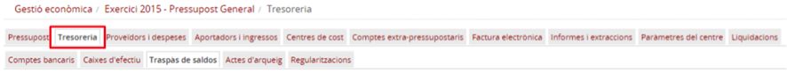

Imatge 4. Pestanya de les operacions de Tresoreria

A través de les diferents subpestanyes es faran les operacions de Tresoreria següents:

* Traspàs de tresoreria
* Arqueig de caixa d’efectiu
* Conciliació d’un compte bancari
* Sol·licitud de regularització de saldos
* Actes d’arqueig

Aquestes operacions s’expliquen a continuació:

---

## 3.2.2.2. Fer traspàs de tresoreria entre comptes bancaris o de caixa efectiu

Un traspàs de tresoreria es correspon amb els moviments de diners que fa el centre entre qualsevol caixa d’efectiu o banc. Per exemple, quan es fa una transferència bancària entre dos comptes bancaris del centre o quan es fa un ingrés de diners en efectiu des d’una caixa d’efectiu a un compte bancari.

Per accedir al traspàs de tresoreria, cal accedir a la subpestanya *Traspàs de saldo (Imatge 5. Pantalla de traspàs de saldos)*.

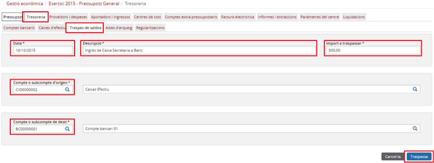

Imatge 5. Pantalla de traspàs de saldos

Per realitzar un nou traspàs de tresoreria cal seguir el procediment següent:

* Ompliu els camps de la pantalla (com a mínim els que tenen l’asterisc al costat):

  + Dades:

    - *Data (obligatori)*: data del traspàs de tresoreria.
    - *Descripció (obligatori)*: descripció del traspàs de tresoreria.
    - *Compte o subcompte d’origen (obligatori)*: compte bancari o caixa d’efectiu d’origen.
    - *Compte o subcompte de destí*: compte bancari o caixa d’efectiu destí.  
      Nota: Pels camps de compte o subcompte, d’origen o de destí, hi ha l’opció d’ajuda a la cerca. Si premeu el boto de cerca , s’obre la pantalla de cerca de comptes (caixes d’efectiu i bancs) (Imatge 6. Pantalla de selecció de bancs o caixes):  

      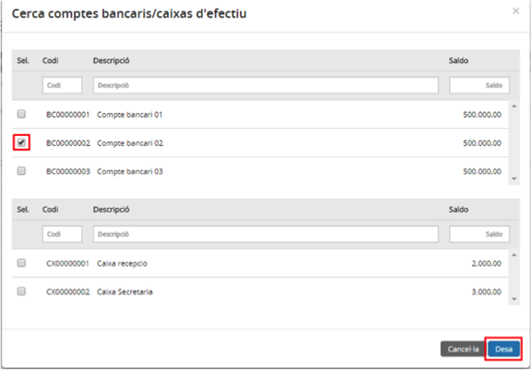

      Imatge 6. Pantalla de selecció de bancs o caixes
    - Seleccioneu el banc o la caixa.
    - Premeu el botó *Desa* . S’incorpora la informació del compte bancari seleccionat a la pantalla de traspàs de saldos de la imatge 5

      * Si premeu el botó *Cancel·la*  es torna a la pantalla de traspàs de saldo (*Imatge 5. Pantalla de traspàs de saldos*) sense haver seleccionat cap caixa d’efectiu o banc.

* Un cop completada la informació, premeu el botó *Traspassa* : es desa el traspàs de saldo informat i el programa torna a la pantalla de traspàs de saldos (Imatge 7. Traspàs de saldo realitzat) amb el missatge de confirmació.

  + Abans de fer el traspàs es valida que el compte origen (banc o caixa d’efectiu) tingui saldo suficient.
  + Si premeu el botó *Cancel·la*  no es realitza el traspàs.

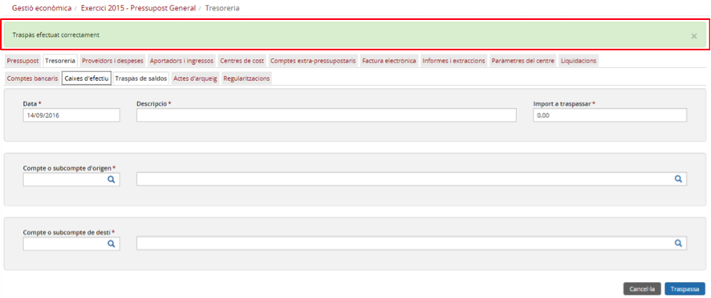

Imatge 7. Traspàs de saldo realitzat

---

## 3.2.2.3. Arqueig de caixa d’efectiu

L’arqueig d’una caixa d’efectiu permet revisar tots els moviments registrats en aquesta caixa i marcar-los com a conciliats. D’aquesta manera es garanteix que el saldo comptable de la caixa d’efectiu és el mateix que el saldo real (els diners que realment hi ha a la caixa d’efectiu).

Per fer l’arqueig d’una caixa d’efectiu cal seguir el següent procediment:

* Des de la pestanya de Tresoreria (*Imatge 4. Pestanya de les operacions de Tresoreria*) se selecciona la subpestanaya Caixes d’efectiu i apareix la llista de caixes d’efectiu, amb una primera informació del detall de cadascuna, en forma de fila (*Imatge 8. Arqueig de caixa d'efectiu*).

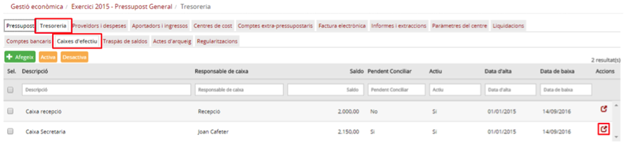

Imatge 8. Arqueig de caixa d'efectiu

* Premeu el botó d’edició  per accedir a la pantalla de detall de la caixa d’efectiu què es vol treballar (*Imatge 9. Detall de caixa d'efectiu*).

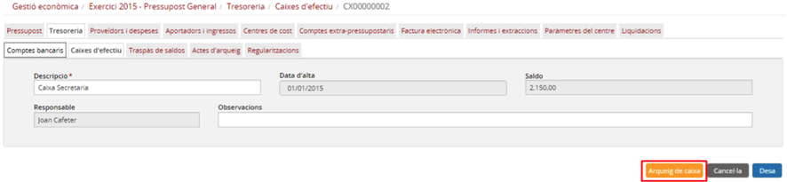

Imatge 9. Detall de caixa d'efectiu

* Premeu el botó *Arqueig de caixa* .
* Es mostra la pantalla de selecció de dates (*Imatge 10. Selecció de dates d'arqueig de caixa*).

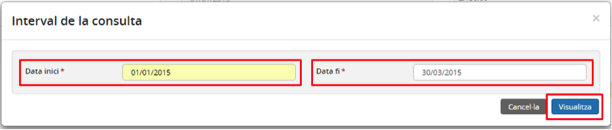

Imatge 10. Selecció de dates d'arqueig de caixa

* Introduïu els camps de la pantalla:

  + *Data inici*: data des de la qual es vol fer l’arqueig.
  + *Data fi*: data fins la qual es vol fer l’arqueig.
* Premeu el botó *Visualitza* .

  + Si premeu el botó *Cancel·la*  es torna a la pantalla de detall de la caixa d’efectiu.

* Es mostra la llista de moviments pendents de conciliar dins del període (*Imatge 11. Llista de moviments a conciliar*).

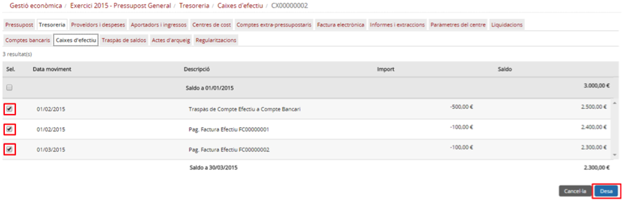

Imatge 11. Llista de moviments a conciliar

* Per defecte tots els moviments surten seleccionats. Els moviments que s’han conciliats prèviament ja no apareixen a la llista..
* En aquesta pantalla cal desmarcar el quadradet de selecció dels moviments que no es volen conciliar.
* Seleccioneu tots els moviments que voleu conciliar.
* Premeu el botó *Desa* .

  + Si no hi ha errades:

    - Tots els moviments marcats a la pantalla es marquen com a conciliats i ja no tornaran a sortir en les properes conciliacions d’aquell període.
    - Es torna a la pantalla de detall del compte bancari (*Imatge 9. Detall de caixa d'efectiu*).
  + Si premeu el botó *Cancel·la*  es torna a la pantalla de detall del compte bancari sense fer-hi cap operació .
  + Si hi ha errades:

    - El programa torna a la mateixa pantalla (*Imatge 11. Llista de moviments a conciliar*) amb un missatge d’errades per poder-hi fer les modificacions adients.

* El programa torna a la pantalla de detall de la caixa d’efectiu (*Imatge 9. Detall de caixa d'efectiu*).

  + Si el compte no té cap moviment pendent de conciliar, la columna Pendent de conciliar passa a tenir valor *No (Imatge 12. Caixa d'efectiu ja arquejada)*.

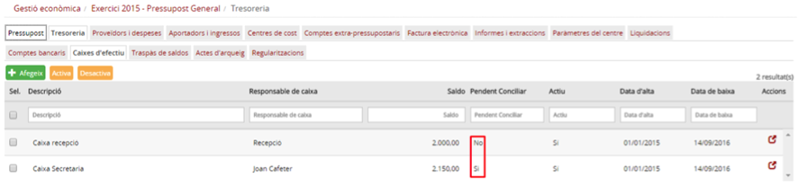

Imatge 12. Caixa d'efectiu ja arquejada

---

## 3.2.2.4. Conciliació d’un compte bancari

La conciliació d’un compte bancari permet revisar tots els moviments registrats en un banc i marcar-los com a conciliats. D’aquesta manera es garanteix que el saldo comptable del banc sigui el mateix que el saldo real (el que apareix en l’extracte bancari). La conciliació permet puntejar tots els moviments enregistrats a la comptabilitat que apareixen en l’extracte del compte bancari.

Per fer la conciliació bancària cal seguir el següent procediment:

* Des de la pestanya de *Tresoreria (Imatge 4. Pestanya de les operacions de Tresoreria)* es selecciona la subpestanaya *Comptes bancaris*, i apareix la llista de comptes bancaris, amb una primera informació del detall de cadascun en forma de fila (*Imatge 8. Arqueig de caixa d'efectiu d’un compte bancari*).

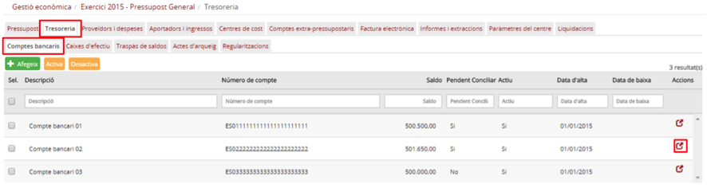

Imatge 13. Conciliació d'un compte bancari

* Premeu el botó d’edició  per accedir a la pantalla de detall del compte bancari (*Imatge 14. Detall del compte bancari*).

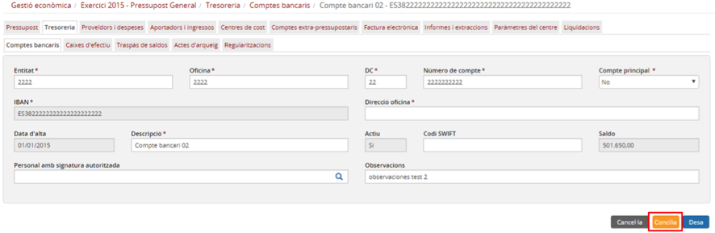

Imatge 14. Detall del compte bancari

* Premeu el botó Concilia .
* Es mostra la pantalla de selecció de dates (*Imatge 15. Selecció de dates de conciliació*).

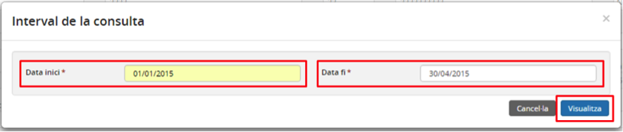

Imatge 15. Selecció de dates de conciliació

* Introduir els camps de la pantalla:

  + *Data inici*: data des de la qual es vol fer la conciliació bancària.
  + *Data fi*: data fins a la qual es vol fer la conciliació bancària.
* Premeu el botó *Visualitza* .

  + Si premeu el botó *Cancel·la*  es torna a la pantalla de detall del compte bancari (*Imatge 14. Detall del compte bancari*).
* Es mostra la llista de moviments pendents de conciliar dins del període (*Imatge 16. Llista de moviments a conciliar*).

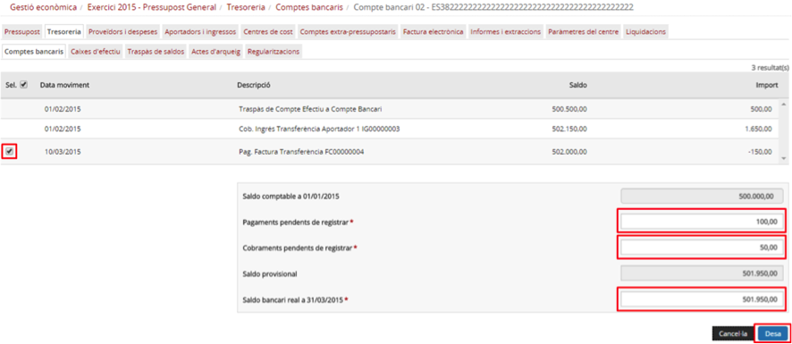

Imatge 16. Llista de moviments a conciliar

Aquesta pantalla consta de dos grans blocs:

* A la part superior, la llista de moviments pendents de conciliar pel període seleccionat.
* Uns camps per fer l’arqueig corresponent i assegurar que els comptes estan quadrats.

A la part superior de la pantalla:

* Per defecte tots els moviments surten seleccionats. Els moviments que ja han estat conciliats prèviament apareixen a la llista però no es poden seleccionar.
* En aquesta pantalla cal desmarcar el quadradet de selecció dels moviments que no es volen conciliar.

A la part inferior de la pantalla:

* El sistema calcula i mostra el saldo comptable enregistrat la data d’inici marcada i el saldo comptable teòric a partir dels moviments seleccionats.
* Introduïu els camps:

  + *Pagaments pendents d’enregistrar*: en aquest camp cal introduir la suma de tots els pagaments que ja apareixen en l’extracte bancari (i que tenen data anterior al camp *Data fi*) però que encara no s’han enregistrat a la comptabilitat (factura o despesa simplificada).
  + *Cobraments pendents d’enregistrar*: en aquest camp cal introduir la suma de tots els cobraments que ja apareixen en l’extracte bancari (i que tenen data anterior al camp *Data fi*) però que encara no s’han enregistrat a la comptabilitat (ingrés o ingrés simplificat).
* Per poder fer la conciliació, els camps *Saldo provisional* (calculat a partir dels moviments del compte) i *Saldo bancari real* (introduït per l’usuari, consta a l’extracte bancari) han de ser iguals. El càlcul del camp *Saldo Provisional* es fa de la següent manera:

  + *Saldo comptable a data inici + suma dels moviments seleccionats – Pagaments pendents + Cobraments pendents*
* Premeu el botó *Desa* .

  + Si no hi ha errades:

    - Tots els moviments marcats a la pantalla es marquen com a conciliats i ja no tornaran a sortir en les properes conciliacions que es facin en el aquell període.
    - Es torna a la pantalla de detall del compte bancari (*Imatge 14. Detall del compte bancari*).
  + Si premeu el botó *Cancel·la*  es torna a la pantalla de detall del compte bancari (*Imatge 14. Detall del compte bancari*) sense fer cap operació .
  + Si hi ha errades:

    - El programa roman a la mateixa pantalla de la *Imatge 15. Llista de moviments a conciliar* amb un missatge d’errades per poder-hi fer les modificacions adients (*Imatge 17. Errada en la conciliació*)

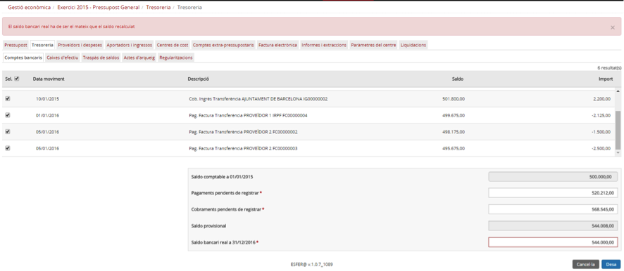

Imatge 17. Errada en la conciliació

---

## 3.2.2.5. Sol·licitud de regularitzacions de saldos

Si per algun motiu el saldo comptable d’un banc o una caixa d’efectiu no coincideix amb el saldo real (el que apareix amb l’extracte bancari o els diners que realment hi ha a la caixa d’efectiu), cal sol·licitar una **regularització de saldo**.

Des del centre es fa la sol·licitud i posteriorment l’administrador la rep i la tramita.

Per sol·licitar una regularització de saldo cal seguir el següent procediment:

* Des de la pestanya *Tresoreria* (*Imatge 4. Pestanya de les operacions de Tresoreria*) se selecciona la subpestanya *Regularitzacions (Imatge 18. Sol·licitud de regularització de saldo)*.

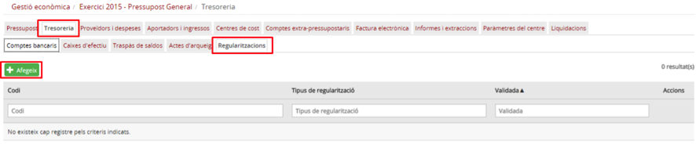

Imatge 18. Sol·licitud de regularització de saldo

* En aquesta pantalla es mostra una llista de totes les sol·licituds de regularització amb les següents columnes:

  + *Codi*: codi de la regularització.
  + *Tipus de regularització*: pot de tipus minoració o de tipus augment.
  + *Validada*: estat de validació de la regularització. Presenta el valor No quan es crea i el valor Sí quan l’administrador l’ha validat.
* Premeu el botó *Afegeix*  per crear una nova sol·licitud de regularització de saldo (*Imatge 19. Nova sol·licitud de regularització de saldo*).

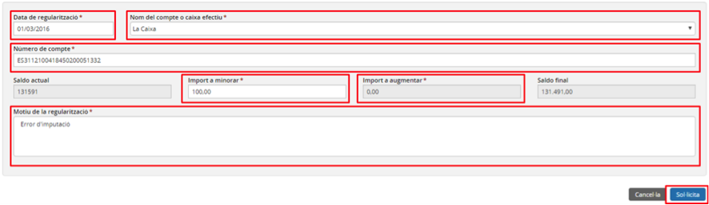

Imatge 19. Nova sol·licitud de regularització de saldo

* Cal introduir els camps de la pantalla:

  + *Data de regularització*: data en què s’ha de modificar el saldo.
  + Nom del compte o caixa d’efectiu: seleccioneu un compte bancari o caixa d’efectiu de la llista.
  + *Número de compte*: número del compte bancari seleccionat
  + *Import a minorar*: import que cal minorar al saldo teòric.
  + *Import a augmentar*: import que cal augmentar al saldo teòric.

    - Quan es dóna valor a un dels dos camps, l’altre queda deshabilitat.
    - En funció del valor d’aquests dos camps es calcula el camp Saldo final que ha de coincidir amb el saldo real de l’extracte bancari en aquesta data (*Data de regularització*).
  + *Motiu de la regularització*: descripció dels motius que fan necessària la regularització.

* Premeu el botó *Sol·licita* .

  + Si premeu el botó *Cancel·la*  es torna a la pantalla de llista de regularitzacions (*Imatge 18. Sol·licitud de regularització de saldo*).

* Es crea la sol·licitud de regularització que ja apareix a la pantalla de llista de regularitzacions (*Imatge 20. Solicitud de regularització creada correctament*).

  + Aquesta llista de regularització arribarà a la pantalla de l’administrador perquè aquest la tramiti.
  + Una vegada l’administrador l’ha tramitat canviarà l’estat de la columna Validada.

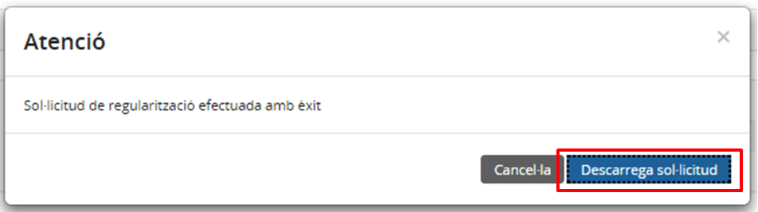

Imatge 20. Solicitud de regularització creada correctament

* Premeu el botó *Descarrega sol·licitud*  per descarregar el document de sol·licitud de regularització de saldo.
* Si premeu el botó *Cancel·la*  es torna a la pantalla de llista de sol·licituds de regularització de saldos on ja apareix la nova sol·licitud creada (*Imatge 21. Sol·licitud de regularització de saldos creada*).

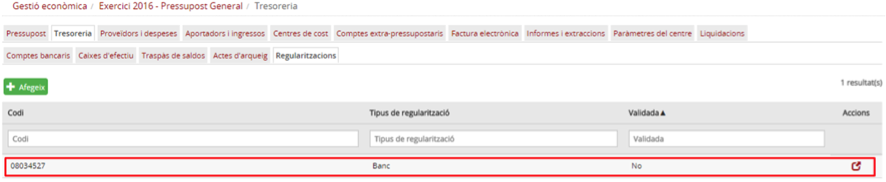

Imatge 21. Sol·licitud de regularització de saldos creada

---

## 3.2.2.6. Actes d’arqueig

Les actes d’arqueig generen una foto fixa de tots els saldos del centre per poder tenir informació de l’estat de la tresoreria en un moment determinat.

Per poder crear una acta d’arqueig s’ha de seguir el següent procediment:

* Des de la pestanya de tresoreria (*Imatge 4. Pestanya de les operacions de Tresoreria*) ses selecciona la subpestanaya *Actes d’arqueig (Imatge 22. Actes d'arqueig)*.

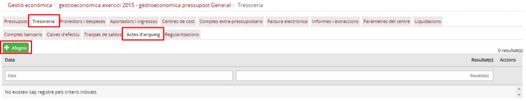

Imatge 22. Actes d'arqueig

* A la pantalla es mostra una llista de totes les actes d’arqueig que s’han fet per a l’any del pressupost. La llista té les següents columnes:

  + *Data*: data de l’acta d’arqueig.
  + *Resultat*: resultat de l’acta d’arqueig (diferència entre el saldo comptable i el saldo real).
* Premeu el botó *Afegeix*  per crear una nova acta d’arqueig (*Imatge 23. Nova acta d'arqueig*).

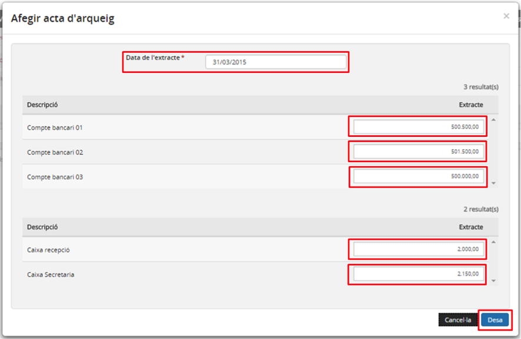

Imatge 23. Nova acta d'arqueig

* Introduir els camps de la pantalla:

  + *Data de l’extracte*: data en què es fa l’acta d’arqueig.
  + *Extracte*: per cada una de les caixes d’efectiu i els bancs cal introduir el saldo que tenien la data de Data de l’extracte.
* Premeu el botó *Desa* .

  + Si premeu el botó *Cancel·la*  es torna a la pantalla de llista de d’actes d’arqueig (Imatge 22. Actes d'arqueig) .
* Es crea l’acta d’arqueig i el programa torna a la pantalla de llista d’actes d’arqueig on ja apareix l’acta acaba de crear (Imatge 24. Acta d'arqueig creada).

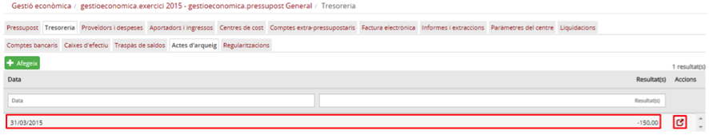

Imatge 24. Acta d'arqueig creada

* Prement el botó d’edició  sobre l’acte d’arqueig s’accedeix a la pantalla de consulta de l’acta d’arqueig (*Imatge 25. Pantalla de consulta de l'acte d'arqueig*) des d’on es pot fer la impressió del document.

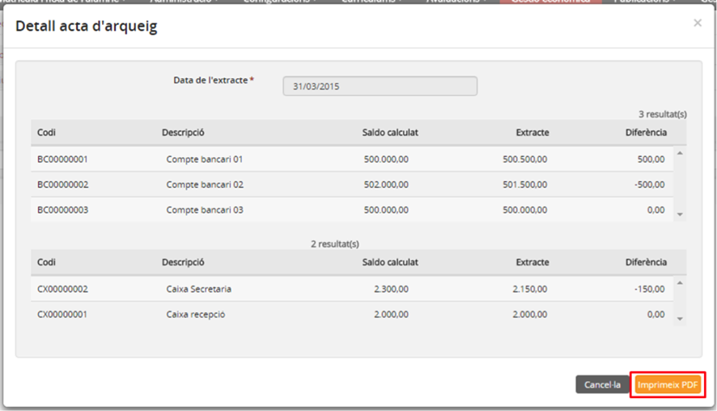

Imatge 25. Pantalla de consulta de l'acte d'arqueig

* Quan es prem el botó *Imprimeix PDF*  (Imatge 26. Document d'acta d'arqueig) s’accedeix al document en format PDF.

  + Si premeu el botó *Cancel·la*  es torna a la pantalla de llista d’actes d’arqueig (*Imatge 24. Acta d'arqueig creada*).

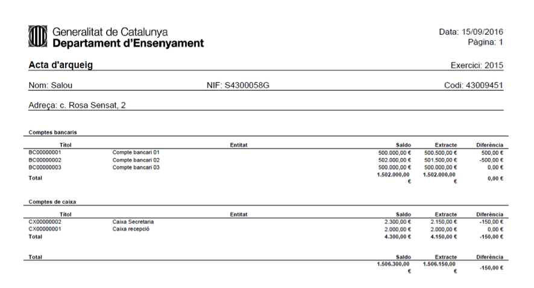

Imatge 26. Document d'acta d'arqueig