# 4.1. Liquidacions d’impostos

* [4.1.1. Descripció](ap41.md#411-descripció)
* [4.1.2. Contingut pas a pas](ap41.md#412	contingut-pas-a-pas)

  + [4.1.2.1. Accés](ap41.md#4121-accés)
  + [4.1.2.2. Liquidació trimestral d’IVA (Model 303)](ap41.md#4122-liquidació-trimestral-diva-model-303)
  + [4.1.2.3. Registrar el cobrament de la devolució de l’IVA](ap41.md#4123-registrar-el-cobrament-de-la-devolució-de-liva)
  + [4.1.2.4. Registrar l’ajust de la prorrata de l’IVA](ap41.md#4124-registrar-lajust-de-la-prorrata-de-liva)
  + [4.1.2.5. Liquidació trimestral d’IRPF (Model 111)](ap41.md#4125-liquidació-trimestral-dirpf-model-111)
  + [4.1.2.6. Registrar el cobrament de la devolució d’IRPF](ap41.md#4126-registrar-el-cobrament-de-la-devolució-dirpf)
  + [4.1.2.7. Resum anual d’IRPF](ap41.md#4127-resum-anual-dirpf)
  + [4.1.2.8. Resum anual d’IVA. Model 390](ap41.md#4128-resum-anual-diva-model-390)

    - [4.1.8.1. Presentar la declaració d’operacions amb tercers (M.347)](ap41.md#4181-presentar-la-declaració-doperacions-amb-tercers-m347)
    - [4.1.8.2. Consulta de liquidacions de períodes anteriors](ap41.md#4182-consulta-de-liquidacions-de-períodes-anteriors)

---

## 4.1.1. Descripció

Com a part del funcionament diari del centre, s’han de complir les obligacions tributàries. Esfer@ no només dóna suport a la gestió pressupostària i comptable sinó que també té un mòdul de liquidacions que permet al centre extreure la informació tributària de manera senzilla i en facilita la presentació i liquidació davant l’Administració Tributària.

Els dos impostos que es controlen des d’Esfer@ són:

* IVA
* IRPF

Aquest contingut està centrat en les següents operacions que els centres han de portar a terme durant l’any:

* Liquidacions trimestrals
* Liquidacions anuals
* Registre de devolucions (si les declaracions són a retornar)

A més d’això, també hi ha altres operacions relacionades amb els impostos:

* Registres d’operacions amb tercers (model 347).
* Registre d’ajust de la prorrata d’IVA.

Les operacions relatives a l’IVA només les hauran de fer els centres que facin liquidació d’IVA. Els centres que no en facin no han de fer cap de les liquidacions d’IVA (ni trimestrals ni anuals) ni tampoc l’ajust de la prorrata d’IVA.

---

## 4.1.2. Contingut pas a pas

### 4.1.2.1. Accés

Des de la pàgina principal d’Esfer@ cal anar al mòdul de *Gestió econòmica*.

Imatge 1. Pantalla inicial d’Esfer@

Quan s’accedeix al mòdul de *Gestió econòmica* apareix la llista de pressupostos que té el centre, amb les següents columnes (*Imatge 2. Llista pressupostos*):

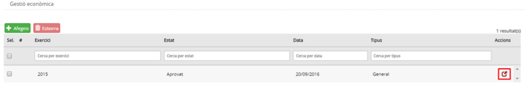

Imatge 2. Llista pressupostos

La informació de les columnes és la següent:

* *Exercici*: exercici fiscal (any) al qual pertany el pressupost.
* *Estat*: estat del pressupost. Per informació detallada sobre els estats del pressupost, consulteu els continguts específics de l’apartat Evolució del pressupost.
* *Data*: data de l’últim canvi d’estat del pressupost.
* *Tipus*: tipus de pressupost.

  + *General*
  + *Menjador*
* *Botó d’acció* : permet accedir al detall del pressupost i permet detallar la dotació.

A la capçalera de les columnes apareix el nom del camp corresponent. A sota, hi ha uns espais per poder aplicar filtres sobre la informació de detall.

Premeu el botó d’acció  del pressupost de l’any per al qual es vol fer la liquidació d’impostos.

Una vegada hem entrat en el pressupost, seleccioneu la pestanya *Liquidacions (Imatge 3. Pantalla de liquidacions)*.

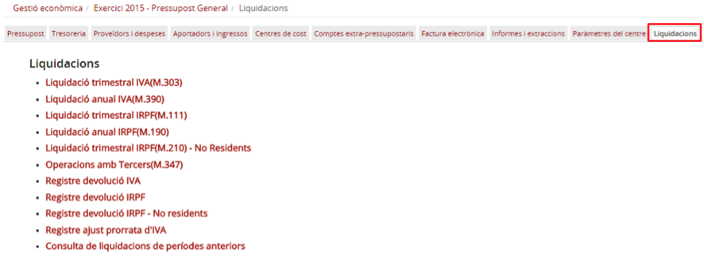

Imatge 3. Pantalla de liquidacions

---

### 4.1.2.2. Liquidació trimestral d’IVA (Model 303)

Els centres que fan liquidació d’IVA han de fer la liquidació trimestral d’IVA i presentar el model 303 al final de cada trimestre.

Per poder fer la liquidació trimestral d’IVA cal seguir el següent procediment:

* Des de la pantalla de liquidacions, trieu l’opció *Liquidació trimestral IVA(M.303) (Imatge 4. Accés a la liquidació trimestral d'IVA)*.

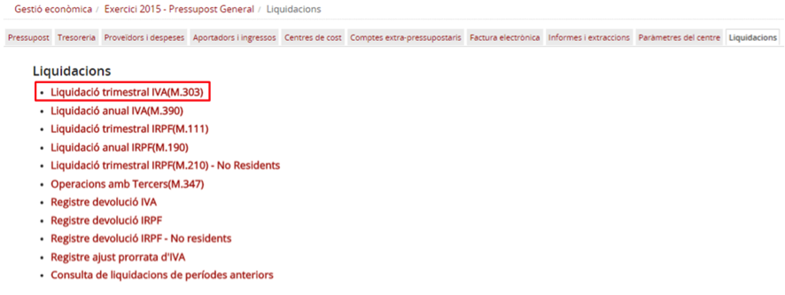

Imatge 4. Accés a la liquidació trimestral d'IVA

* Es mostra la pantalla de selecció de dates de liquidació (*Imatge 5. Dates de liquidació trimestral d'IVA*).

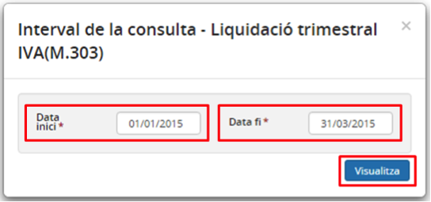

Imatge 5. Dates de liquidació trimestral d'IVA

* Triar les dates d’inici i final del trimestre que es vol liquidar.

  + El programa controla que la data d’inici correspongui amb el primer trimestre pendent de liquidar. Si no s’ha liquidat el primer trimestre no es pot fer liquidació del segon.
* Es mostra la pantalla de liquidació de l’IVA. Aquesta pantalla té dues seccions:

  + A la part superior hi ha el resum de la liquidació (*Imatge 6. Resum de la liquidació*).
  + A la part inferior hi ha el resum de les operacions que es liquiden (*Imatge 7. Registres d'operacions del trimestre*):

    - Registres d’ingressos: llista d’operacions d’ingrés que han imputat IVA.
    - Registres de despeses: llista d’operacions de despesa (factures) que han imputat IVA.

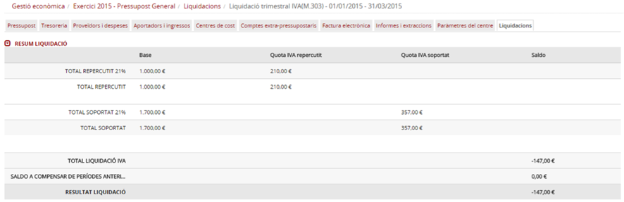

Imatge 6. Resum de la liquidació

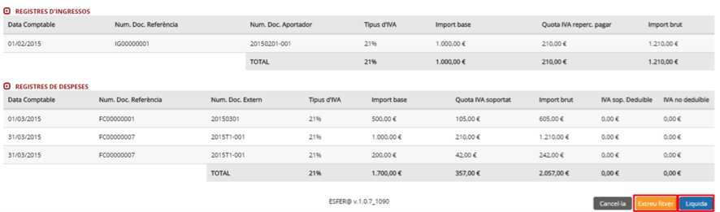

Imatge 7. Registres d'operacions del trimestre

* Si premeu el botó *Cancel·la*  es torna a la pantalla de liquidacions (*Imatge 3. Pantalla de liquidacions*).
* Premeu el botó *Extreu fitxer*  per extreure el fitxer de liquidació. Es guardarà un arxiu PDF amb la liquidació (*Imatge 8. Document de resultat de la liquidació trimestral d'IVA*). Aquest document servirà al centre per omplir el formulari del Model 303 de l’Administració Tributària per fer la liquidació trimestral d’IVA.

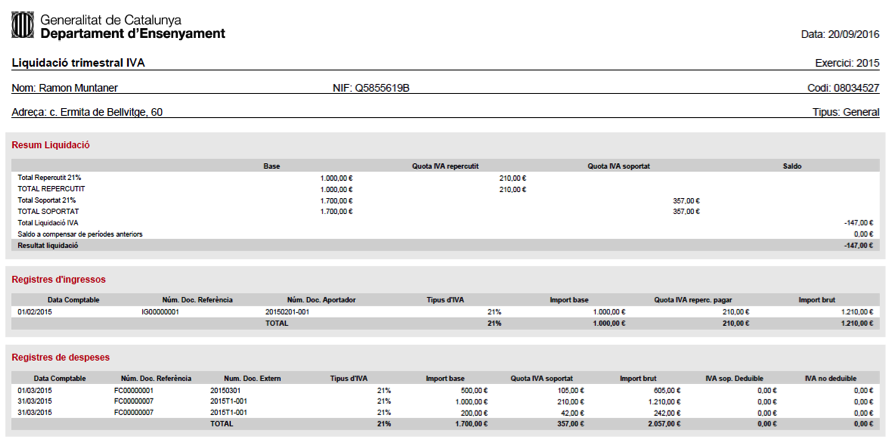

Imatge 8. Document de resultat de la liquidació trimestral d'IVA

* Premeu el botó Liquida  per fer la liquidació dins del programa.

  + Per als centres que fan liquidació d’IVA amb prorrata general, es valida que s’hagi fet el registre de l’ajust de la prorrata. Si el centre encara no ha fet aquest ajust, el programa mostra la pantalla de registre de l’ajut de prorrata (*Imatge 15. Pantalla ajust de prorrata d'IVA*).  

    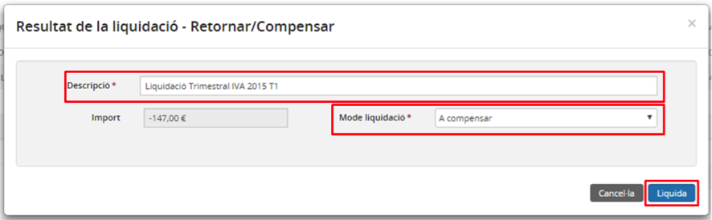

    Imatge 9. Pantalla de resultat de la liquidació a compensar
  + Apareixerà la pantalla de resultat de la liquidació. Cal omplir els camps obligatoris:

    - *Descripció*: text descriptiu de la liquidació.
    - *Mode de liquidació*: mode amb el qual es fa la liquidació (Imatge 9. Pantalla de resultat de la liquidació a compensar).

      * A compensar, si el camp *Import* és inferior a 0. En aquest cas, l’import a compensar no es retorna de manera trimestral sinó que queda acumulat al compte comptable de compensació d’IVA i es regularitza en la propera liquidació.
      * *Sol. Devolució*: En cas que s’hagi fet la liquidació de l’últim trimestre de l’any i el resultat total sigui A compensar (import inferior a 0) es podrà sol·licitar la devolució de l’import. En aquest cas es podrà triar el banc on s’espera la devolució (*Imatge 10. Pantalla de resultat de liquidació a compensar i sol·licitud de devolució*).  

        

        Imatge 10. Pantalla de resultat de liquidació a compensar i sol·licitud de devolució
      * *A pagar*, si el camp import és superior a 0. En aquest cas, es podrà triar el banc des del qual es vol fer el pagament i fer-lo (*Imatge 11. Pantalla de resultat de la liquidació a pagar*).  

        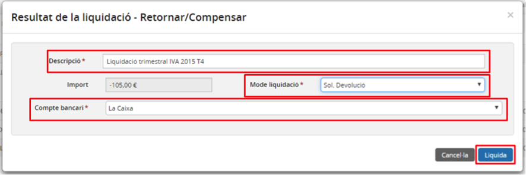

        Imatge 11. Pantalla de resultat de la liquidació a pagar

* Prémer el botó *Liquida* .

  + Si premeu el botó *Cancel·la* , es torna a la pantalla de resum de liquidació (*Imatge 6. Resum de la liquidació*).
  + Es torna a la pantalla de liquidacions (*Imatge 3. Pantalla de liquidacions*).

---

### 4.1.2.3. Registrar el cobrament de la devolució de l’IVA

En cas que l’última liquidació trimestral de l’IVA de l’any hagi sortit *A compensar* (import inferior a 0) i s’hagi sol·licitat la devolució, s’ha de registrar el cobrament d’aquesta devolució en el moment en què l’Administració Tributària la faci realment efectiva.

Per registrar el cobrament de la devolució de l’IVA cal seguir el següent procediment:

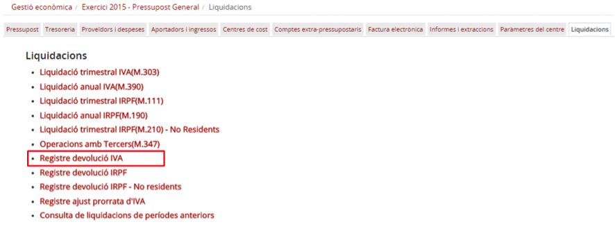

Imatge 12. Registre de la devolució de l'IVA

* Des de la pantalla de liquidacions (*Imatge 12. Registre de la devolució de l'IVA*), trieu l’opció *Registre devolució IVA*.
* Es mostra la pantalla de registre de la devolució de l’IVA (*Imatge 13. Pantalla registre de devolució de l'IVA*).

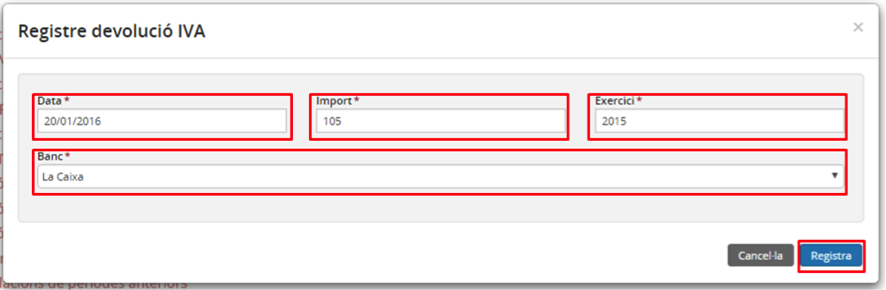

Imatge 13. Pantalla registre de devolució de l'IVA

* Ompliu els camps obligatoris:

  + *Data*: data en què s’ha rebut la devolució al banc.
  + *Import*: import de la devolució (hauria de coincidir amb l’import de l’última liquidació trimestral de l’any on s’ha sol·licitat la devolució) (Imatge *10. Pantalla de resultat de liquidació a compensar i sol·licitud de devolució*).
  + *Exercici*: exercici al qual correspon la devolució.
  + *Banc*: seleccioneu un banc de la llista de bancs actius del centre.
* Premeu el botó *Registra* .

  + Si premeu el botó *Cancel·la* , es torna a la pantalla de liquidacions (*Imatge 3. Pantalla de liquidacions*).
* Una vegada s’ha registrat la devolució, es torna a la pantalla de liquidacions (*Imatge 3. Pantalla de liquidacions*).

---

### 4.1.2.4. Registrar l’ajust de la prorrata de l’IVA

Els centres que fan liquidació d’IVA, atès que una part important de l’IVA suportat no té a veure amb l’activitat educativa pròpia del centre, no es pot liquidar la totalitat de l’IVA suportat. La quantitat que el centre pot liquidar està regulada per un percentatge de prorrata. Aquesta prorrata es fa servir de manera automàtica a la pantalla de creació de factures.

Aquest percentatge de prorrata s’ha d’actualitzar manualment al final de l’any i s’ha d’introduir manualment quan el centre ja ha totalitzat l’IVA suportat i l’IVA repercutit de l’any, a partir de les dades de la liquidació de l’últim trimestre de l’any.

Calculat el nou valor de prorrata, cal fer calcular com influeix aquest nou valor en la liquidació de l’IVA; fet aquest càlcul, cal registrar l’ajust de la prorrata de l’IVA.

Aquesta opció només està disponible per als centres que fan liquidacions d’IVA i tenen prorrata general. El Registre d’ajust de prorrata cal fer-lo abans de fer la liquidació de l’últim trimestre de l’any.

Per registrar l’ajust de la prorrata de l’IVA cal seguir el següent procediment:

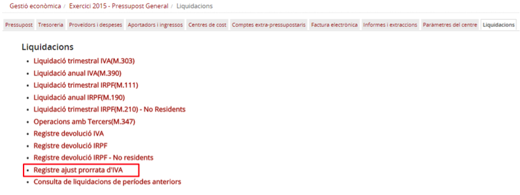

Imatge 14. Registre de l'ajust de la prorrata de l'IVA

* Des de la pantalla de liquidacions (*Imatge 14. Registre de l'ajust de la prorrata de l'IVA*), trieu l’opció *Registre ajust prorrata d’IVA*.
* Apareix la pantalla d’ajust de prorrata (*Imatge 15. Pantalla ajust de prorrata d'IVA*).

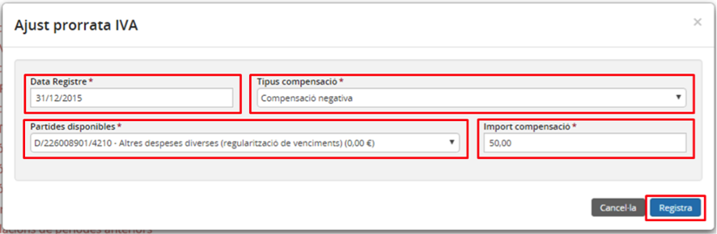

Imatge 15. Pantalla ajust de prorrata d'IVA

* Introduïels camps obligatoris:

  + *Data del registre*: data en què es fa el registre de l’ajust de la prorrata.
  + *Tipus de compensació*:

    - *Compensació positiva*: quan el nou total d’IVA suportat (aplicant la nova prorrata) és positiu.
    - *Compensació negativa*: qual el nou total d’IVA suportat (aplicant la nova prorrata) és negatiu.
  + *Partides disponibles*:

    - Si es tracta d’una *Compensació positiva*, apareixen a la llista totes les partides d’ingrés marcades com a *Altres ingressos*.
    - Si es tracta d’una *Compensació negativa*, apareixen a la llista totes les partides de despesa marcades com a *Altres despeses*.
  + *Import de la compensació*: import de la compensació que s’ha calculat aplicant el nou percentatge de prorrata sobre l’IVA suportat.
* Premeu el botó *Registra* .

  + Si premeu el botó *Cancel·la*  es torna a la pantalla de liquidacions (*Imatge 3. Pantalla de liquidacions*).
* Una vegada s’ha fet el registre, es torna a la pantalla de liquidacions (*Imatge 3. Pantalla de liquidacions*).

---

### 4.1.2.5. Liquidació trimestral d’IRPF (Model 111)

Tots els centres que hagin fet operacions amb proveïdors que liquiden IRPF, han de fer la liquidació trimestral d’IRPF al final de cada trimestre. Si no tenen operacions subjectes a IRPF no estan obligats a fer la liquidació.

Per poder fer la liquidació trimestral d’IRPF cal seguir el següent procediment:

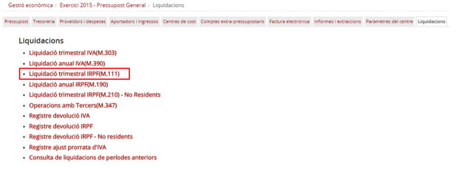

Imatge 16. Liquidació trimestral d'IRPF

* Des de la pantalla de liquidacions, trieu l’opció *Liquidació trimestral IRPF (M.111)* (*Imatge 4. Accés a la liquidació trimestral d'IVA*).
* Es mostra la pantalla de selecció de dates de liquidació d’IRPF (*Imatge 17. Dates de liquidació trimestral d'IRPF*).

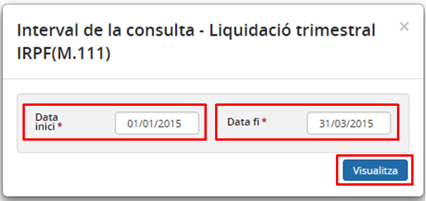

Imatge 17. Dates de liquidació trimestral d'IRPF

* Trieu les dates d’inici i fi de trimestre que voleu liquidar.

  + El programa controla que la data d’inici correspongui al primer trimestre pendent de liquidar. Si no s’ha liquidat el primer trimestre no es pot liquidar el segon.
* Es mostra la pantalla de liquidació d’IRPF (*Imatge 18. Pantalla de liquidació trimestral d'IRPF*).

  + Es mostra una secció de capçalera *Total declaració IRPF* amb els totals de la liquidació.
  + Es mostra una taula (*Relació de proveïdors*) amb totes les operacions del trimestre que es liquida agrupades per proveïdor.

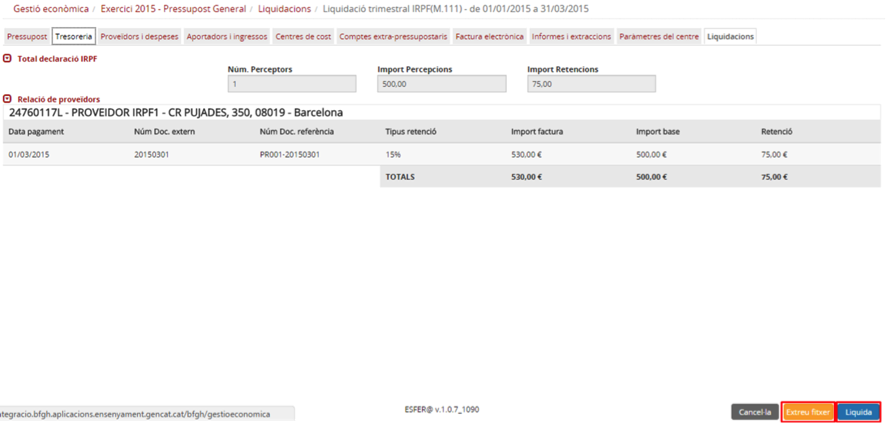

Imatge 18. Pantalla de liquidació trimestral d'IRPF

* Si premeu el botó *Cancel·la*  es torna a la pantalla de liquidacions (*Imatge 3. Pantalla de liquidacions*).
* Premeu el botó *Extreu fitxer*  per extreure el fitxer de liquidació. Es guardarà un arxiu PDF amb la liquidació (*Imatge 19. Document de resultat de la liquidació trimestral d'IRPF*). Aquest document servirà al centre per omplir el formulari Model 111 de l’Administració Tributària per fer la liquidació trimestral d’IRPF.

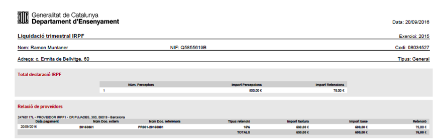

Imatge 19. Document de resultat de la liquidació trimestral d'IRPF

* Premeu el botó *Liquida*  per fer la liquidació dins del programa.

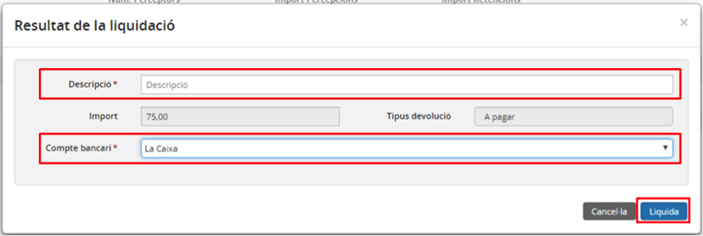

Imatge 20. Pantalla de resultat de la liquidació

* Apareixerà la pantalla de resultat de la liquidació. Ompliu els camps obligatoris (*Imatge 20. Pantalla de resultat de la liquidació*):

  + *Descripció*: text descriptiu de la liquidació.
  + *Compte bancari*: es pot triar un dels comptes bancaris actius del centre per fer el pagament.
* Premeu el botó *Liquida*  .

  + Si premeu el botó *Cancel·la*  es torna a la pantalla de resum de liquidació (*Imatge 18. Pantalla de liquidació trimestral d'IRPF*).
* Es torna a la pantalla de liquidacions (*Imatge 3. Pantalla de liquidacions*).

En el cas extraordinari que durant un trimestre el saldo d’IRPF a liquidar sigui negatiu (perquè els abonaments superen les factures subjectes a IRPF) el resultat de la liquidació serà a retornar i se’n podrà sol·licitar la devolució.

---

### 4.1.2.6. Registrar el cobrament de la devolució d’IRPF

En cas que la liquidació trimestral de l’IRPF resultant sigui A retornar (import inferior a 0) i s’hagi sol·licitat la devolució, s’ha de registrar el cobrament d’aquesta devolució quan l’Administració Tributària la faci realment efectiva.

Per registrar el cobrament de la devolució de l’IRPF cal seguir el següent procediment:

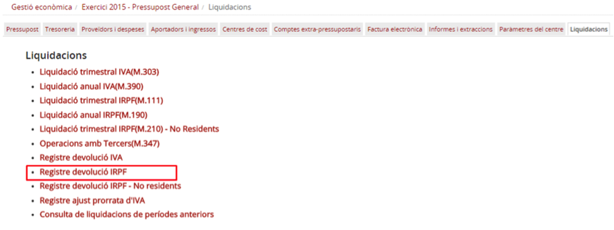

Imatge 21. Registre de la devolució de l'IRPF

* Des de la pantalla de liquidacions (*Imatge 21. Registre de la devolució de l'IRPF*), trieu l’opció Registre devolució IRPF.
* Es mostra la pantalla de registre de la devolució de l’IVA (*Imatge 22. Pantalla registre de devolució de l'IRPF*).

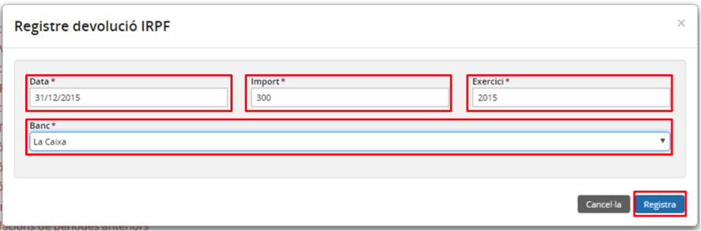

Imatge 22. Pantalla registre de devolució de l'IRPF

* Ompliu els camps obligatoris:

  + *Data*: data en què s’ha rebut la devolució al banc.
  + *Import*: import de la devolució. Aquest import ha de coincidir amb l’import de l’última liquidació trimestral de l’any on s’ha sol·licitat la devolució.
  + *Exercici*: exercici al qual correspon la devolució.
  + *Banc*: cal seleccionar un banc de la llista de bancs actius del centre.
* Premeu el botó *Registra* .

  + Si premeu el botó *Cancel·la*  es torna a la pantalla de liquidacions (*Imatge 3. Pantalla de liquidacions*).

Una vegada s’ha registrat la devolució, es torna a la pantalla de liquidacions (*Imatge 3. Pantalla de liquidacions*).

---

### 4.1.2.7. Resum anual d’IRPF

Com a part del tancament d’un exercici cal presentar davant l’Administració tributària el resum anual d’IRPF (model 190).

Per poder generar el resum anual d’IRPF cal seguir el següent procediment:

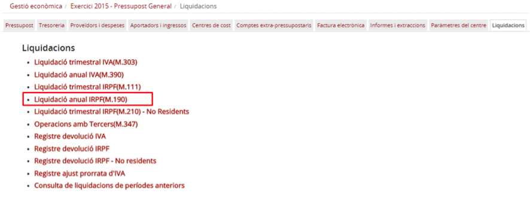

Imatge 23. Resum anual IRPF

* Des de la pantalla de liquidacions (*Imatge 23. Resum anual IRPF*), trieu l’opció Liquidació anual IRPF (M.190).
* Es mostra la pantalla de registre de la devolució de l’IVA (*Imatge 24. Selecció any liquidació anual IRPF*).

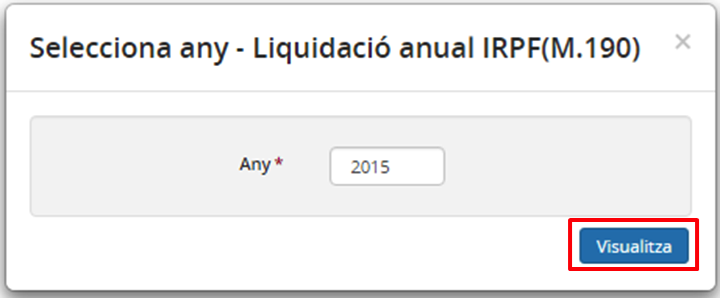

Imatge 24. Selecció any liquidació anual IRPF

* Premeu el botó *Visualitza* .
* Es mostra la pantalla de liquidació anual d’IRPF (*Imatge 25. Pantalla de liquidació anual d'IRPF*).

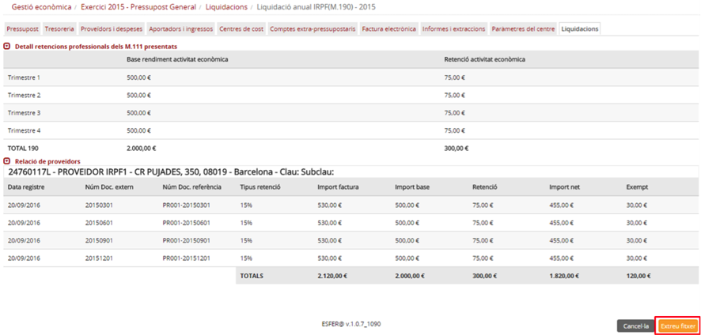

Imatge 25. Pantalla de liquidació anual d'IRPF

* Si premeu el botó *Cancel·la*  es torna a la pantalla de liquidacions (Imatge 3. Pantalla de liquidacions).
* Premeu el botó *Extreu fitxer* .

  + Es descarrega un fitxer PDF amb la liquidació anual d’IRPF. Aquest arxiu servirà de base per omplir el formulari 190 que s’ha de presentar a l’Administració Tributària (*Imatge 26. Arxiu liquidació Model 190*).

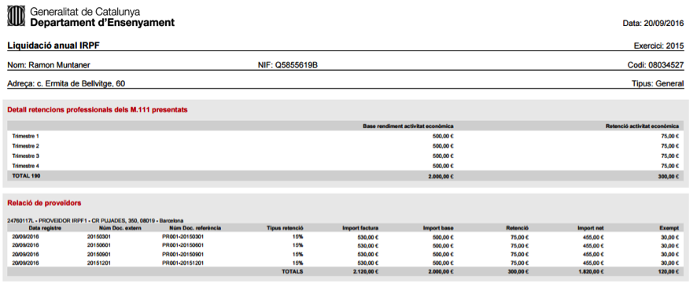

Imatge 26. Arxiu liquidació Model 190

---

### 4.1.2.8. Resum anual d’IVA. Model 390

Com a part del tancament d’un exercici cal presentar a l’Administració tributària el resum anual d’IVA (model 390).

Per poder generar el resum anual d’IVA cal seguir el següent procediment:

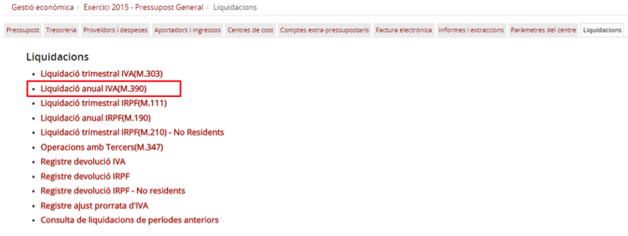

Imatge 27. Resum anual IVA

* Des de la pantalla de liquidacions (*Imatge 27. Resum anual IVA*), trieu l’opció *Liquidació anual IVA (M.390)*.
* Es mostra la pantalla de registre de la devolució de l’IVA (*Imatge 28. Selecció any liquidació anual IVA*).

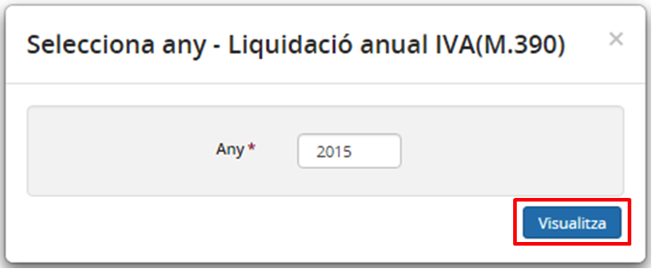

Imatge 28. Selecció any liquidació anual IVA

* Premeu el botó *Visualitza* .
* Es mostra la pantalla de liquidació anual d’IVA (*Imatge 29. Pantalla de liquidació anual d’IVA*).

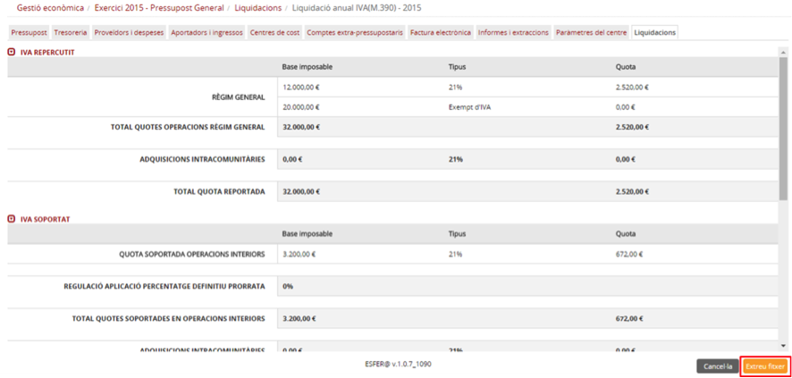

Imatge 29. Pantalla de liquidació anual d’IVA

* Si premeu el botó *Cancel·la*  , es torna a la pantalla de liquidacions (*Imatge 3. Pantalla de liquidacions*).
* Premeu el botó *Extreu fitxer* .

  + Es descarrega un fitxer PDF amb la liquidació anual d’IRPF. Aquest arxiu servirà de base per omplir el formulari 390 que s’ha de presentar a l’Administració Tributària.

---

### 4.1.8.1. Presentar la declaració d’operacions amb tercers (M.347)

Com a part del tancament d’un exercici cal presentar la declaració d’operacions amb tercers que resumeix l’activitat de tots els proveïdors i aportadors agrupada per trimestre.

Per poder generar el resum anual d’IVA cal seguir el següent procediment:

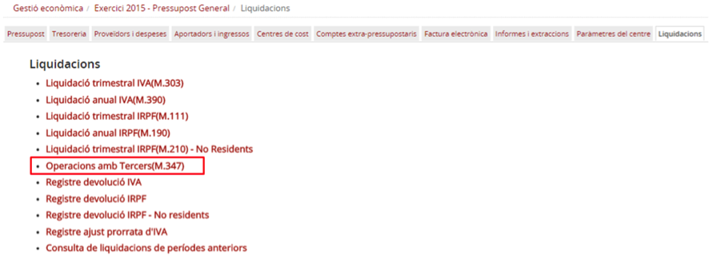

Imatge 30. Operacions amb tercers (M.347)

* Des de la pantalla de liquidacions (*Imatge 30. Operacions amb tercers (M.347)*), trieu l’opció *Operacions amb tercers (M.347)*.
* Es mostra la pantalla de selecció del període d’operacions amb tercers (*Imatge 31. Selecció del període d’operacions amb tercers*).

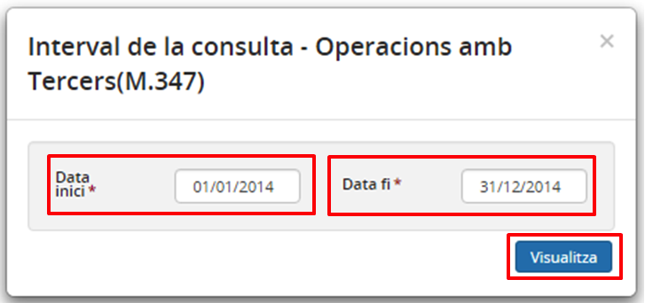

Imatge 31. Selecció del període d’operacions amb tercers

* Introduïu els camps obligatoris:

  + *Data inici*: data d’inici de la consulta (en aquest cas, el primer dia de l’any del pressupost)
  + *Data fi*: data de fi de la consulta (en aquest cas, l’últim dia de l’any del pressupost).
* Premeu el botó *Visualitza* .
* Es mostra la pantalla de resum d’operacions amb tercers (*Imatge 32. Pantalla de resum d’operacions amb tercers*).

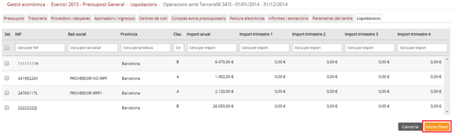

Imatge 32. Pantalla de resum d’operacions amb tercers

* Si premeu el botó *Cancel·la*  es torna a la pantalla de liquidacions (*Imatge 3. Pantalla de liquidacions*).
* Premeu el botó *Extreu fitxer* .

  + Es descarrega un fitxer PDF amb el resum d’operacions amb terceres. Aquest arxiu servirà de base per omplir el formulari 347 que s’ha de presentar a l’Administració Tributària (*Imatge 33. Document de resum d'operacions amb tercers*).

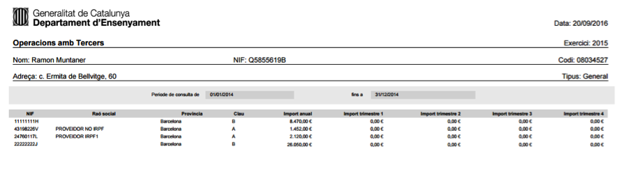

Imatge 33. Document de resum d'operacions amb tercers

---

### 4.1.2.8.2. Consulta de liquidacions de períodes anteriors

Fetes les liquidacions trimestrals i anuals, l’usuari les pot consultar de nou.

Per poder consultar les liquidacions de períodes anteriors s’ha de seguir el següent procediment:

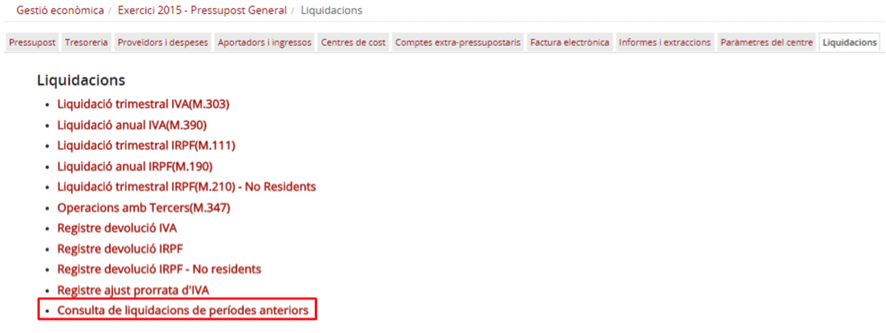

Imatge 34. Liquidacions de períodes anteriors

* Des de la pantalla de liquidacions (*Imatge 34. Liquidacions de períodes anteriors*) trieu l’opció *Consulta de liquidacions de períodes anteriors*.
* Es mostra la pantalla de selecció de dates (*Imatge 35. Selecció de dates de consulta de liquidacions de períodes anteriors*).

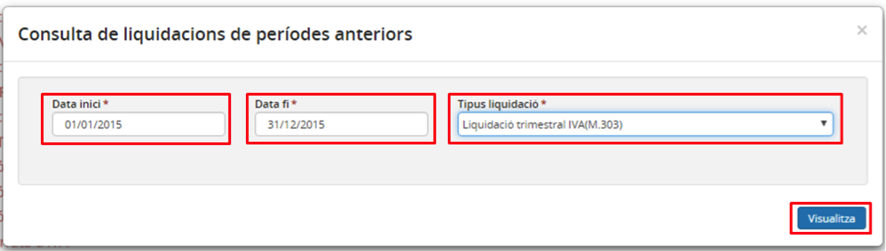

Imatge 35. Selecció de dates de consulta de liquidacions de períodes anteriors

* Ompliu les dades obligatòries:

  + *Data inici*: data d’inici de la consulta.
  + *Data fi*: data de fi de la consulta.
  + *Tipus liquidació*: tipus de liquidació que es vol mostrar:

    - *Liquidació trimestral IVA (M.303)*: es mostren les liquidacions trimestrals d’IVA (model 303) del període seleccionat.
    - *Liquidació trimestral IRPF (M.111)*: es mostren les liquidacions trimestrals d’IRPF (model 111) del període seleccionat.
    - *Liquidació trimestral IRPF de no residents (M.111)*: es mostren les liquidacions trimestrals d’IRPF de no residents (model 111) del període seleccionat.
    - *Operacions amb tercers (M.347)*: es mostren els resums d’operacions amb tercers (model 347) del període seleccionat.
* Es mostra una llista de liquidacions del tipus seleccionat per període seleccionat.
* Premeu el botó d’acció  per accedir a la liquidació que es vol consultar.