# 5.1 Gestió d’informes

* [5.1.1. Descripció](ap51.md#511-descripció)
* [5.1.2. Gestió d’informes](ap51.md#512	gestió-dinformes)

  + [5.1.2.1. Accés](ap51.md#5121-accés)
  + [5.1.2.2. Llista d’informes](ap51.md#5122-llista-dinformes)
  + [5.1.2.3. Compte general de despeses](ap51.md#5123-compte-general-de-despeses)
  + [5.1.2.4. Compte general de rendes públiques](ap51.md#5124-compte-general-de-rendes-públiques)
  + [5.1.2.5. Informe de modificació del pressupost](ap51.md#5125-informe-de-modificació-del-pressupost)
  + [5.1.2.6. Compte general d’operacions extrapressupostàries](ap51.md#5126-compte-general-doperacions-extrapressupostàries)
  + [5.1.2.7. Liquidació del pressupost](ap51.md#5127-liquidació-del-pressupost)
  + [5.1.2.8. Compte general de tresoreria](ap51.md#5128-compte-general-de-tresoreria)
  + [5.1.2.9. Acta d’arqueig](ap51.md#5129-acta-darqueig)
  + [5.1.2.10. Informe d’excés de fons](ap51.md#51210-informe-dexcés-de-fons)
  + [5.1.2.11. Acta traspàs d’equip directiu](ap51.md#51211-acta-traspàs-dequip-directiu)

---

## 5.1.1. Descripció

En aquest contingut s’explica el funcionament del mòdul *Informes i Consultes* del programa de *Gestió econòmica* per a un centre educatiu.

Poden accedir a aquest mòdul les figures de director/usuari.

## 5.1.2. Gestió d’informes

### 5.1.2.1. Accés

Des de la pàgina principal d’Esfer@ cal anar al mòdul de *Gestió econòmica*.

Imatge 1. Pantalla inicial d’Esfer@

A continuació apareix a sota un nou menú amb les opcions dels pressupostos vigents. S’ha de seleccionar un pressupost. Després cal triar la pestanya *Informes i extraccions. (Imatge 2. Estructura de pestanyes de econòmica)*.

Imatge 2. Estructura de pestanyes de Gestió econòmica

Un cop s’ha triat aquesta opció, apareix una llista amb tots els informes i extraccions disponibles estructurats de la manera següent. (*Imatge 3. Llistat d’informes i extraccions*).

Imatge 3. Llistat d’informes i extraccions

A la pantalla apareixen tres grups d’opcions (tres grans columnes):

* A la columna de l’esquerra, el conjunt de llistats (amb sortida en format PDF). Normalment es treuran quan es liquida el pressupost.
* A la part central hi ha el conjunt de consultes i extraccions que afecten només el tipus de pressupost seleccionat (el pressupost pot ser de tipus general o de tipus menjador)
* A la part dreta hi ha un conjunt de consultes i extraccions que engloben als dos tipus de pressupost (general i menjador).

---

### 5.1.2.2. Llista d’informes

En aquest apartat s’explica la dinàmica d’extracció de la llista d’informes (els de la part esquerra de la pantalla) (Imatge 4. Informes).

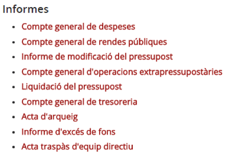

Imatge 4. Informes

Normalment aquests informes es treuran quan es liquida un pressupost. A continuació es detalla la forma d’obtenir cadascun dels informes:

---

### 5.1.2.3. Compte general de despeses

Per accedir a l’informe *Compte general de despeses* cal seguir el següent procediment:

* Premeu l’opció d’informe *Compte general de despeses (Imatge 5. Solicitud d’informe de Compte general de despeses)*.

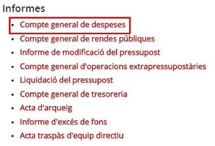

Imatge 5. Solicitud d’informe de Compte general de despeses

* El programa genera un arxiu en format *PDF*  amb les dades corresponents a aquest llistat. Es mostra un exemple a la imatge (Imatge 6. PDF del Compte general de despeses).

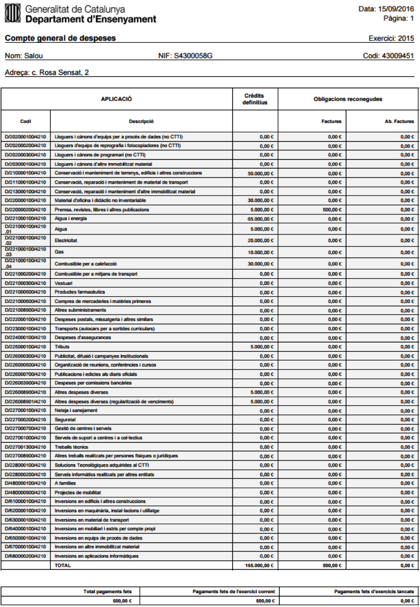

Imatge 6. PDF del Compte general de despeses

---

### 5.1.2.4. Compte general de rendes públiques

Per accedir a l’informe *Compte general de rendes públiques* cal seguir el procediment següent:

* Premeu l’opció d’informe *Compte general de rendes públiques (Imatge 7. Sol·licitud d'informe de Compte general de rendes públiques)*.

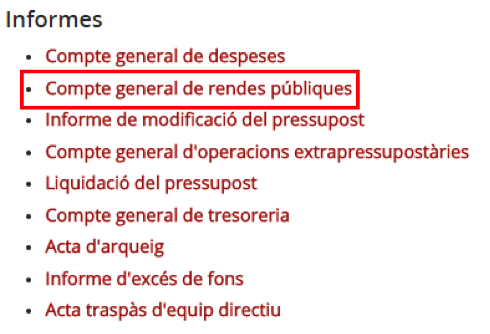

Imatge 7. Sol·licitud d'informe de Compte general de rendes públiques

* El programa genera un arxiu en format *PDF*  amb les dades corresponents a aquesta llista. Es mostra un exemple a la imatge (Imatge 8. PDF del Compte general de rendes públiques).

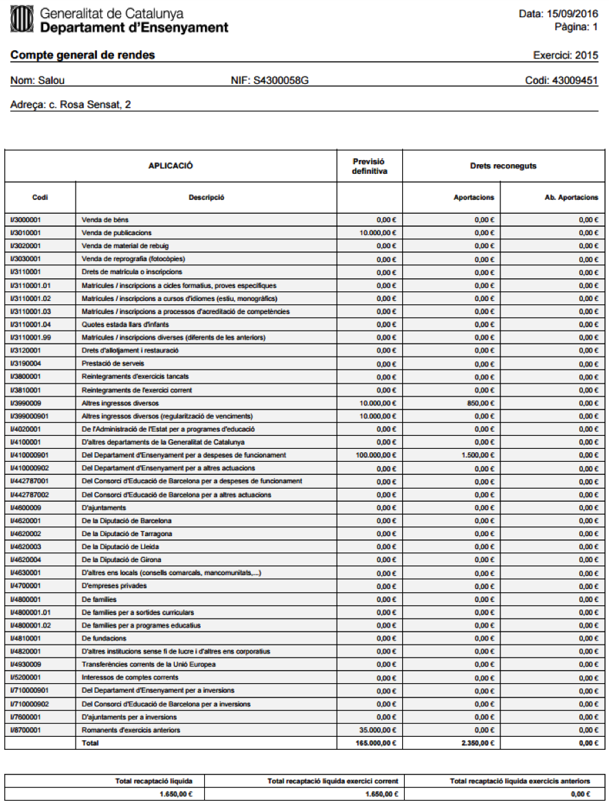

Imatge 8. PDF del Compte general de rendes públiques

---

### 5.1.2.5. Informe de modificació del pressupost

Per accedir a l’informe *Modificació del pressupost* cal seguir el següent procediment:

* Premeu l’opció d’informe de *Modificació de pressupost (Imatge 9. Sol·licitud d'informe de modificació de pressupost)*.

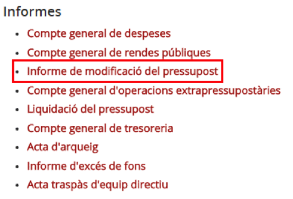

Imatge 9. Sol·licitud d'informe de modificació de pressupost

* El programa genera un arxiu en format *PDF*  amb les dades corresponents a aquesta llista. Es mostra un exemple a la imatge (Imatge 10. PDF de l'Informe de modificació de pruessupost).

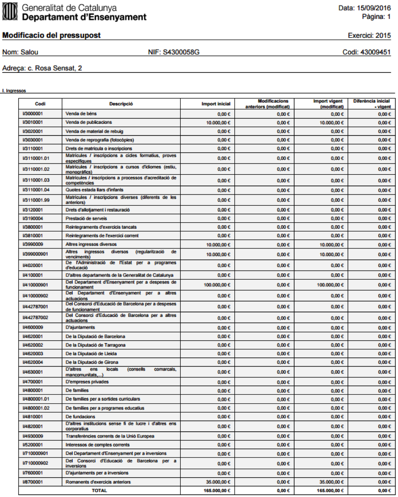

Imatge 10. PDF de l'Informe de modificació de pruessupost

---

### 5.1.2.6. Compte general d’operacions extrapressupostàries

Per accedir a l’informe de compte general d’operacions extrapressupostàries cal seguir el següent procediment:

* Premeu l’opció d’informe de *Compte general d’operacions extrapressupostàries (Imatge 11. Sol·licitud d'informe de Compte general d'operacions extrapressupostàries)*.

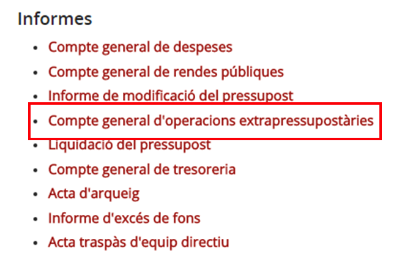

Imatge 11. Sol·licitud d'informe de Compte general d'operacions extrapressupostàries

* El programa genera un arxiu en format *PDF*  amb les dades corresponents a aquesta llista. Es mostra un exemple a la imatge (Imatge 12. PDF de l'informe de compte general d’operacions extra-pressupostàries).

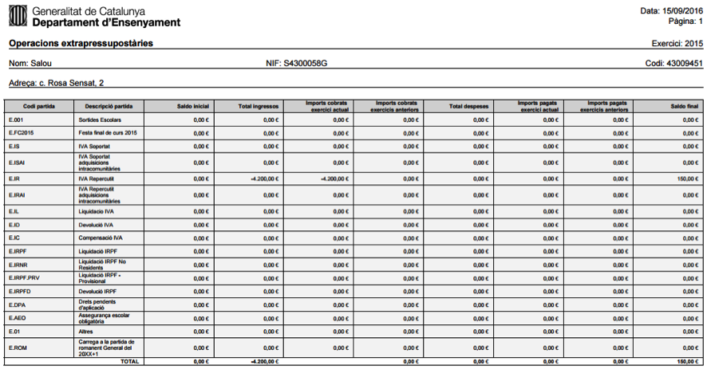

Imatge 12. PDF de l'informe de compte general d’operacions extra-pressupostàries

---

### 5.1.2.7. Liquidació del pressupost

Per accedir a l’informe de liquidació del pressupost cal seguir el següent procediment:

* Premeu l’opció d’informe *Liquidació de pressupost (Imatge 13. Sol·licitud d'Informe de liquidació de pressupost)*.

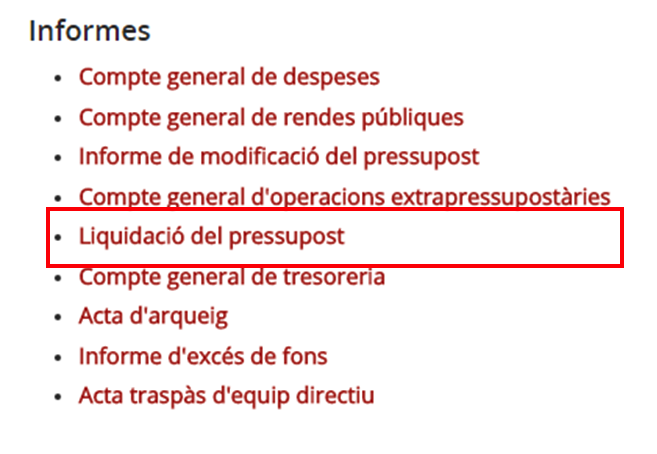

Imatge 13. Sol·licitud d'Informe de liquidació de pressupost

* El programa genera un arxiu en format *PDF*  amb les dades corresponents a aquesta llista. Es mostra un exemple a la imatge (Imatge 14. PDF de l'Informe de liquidació de pressupost).

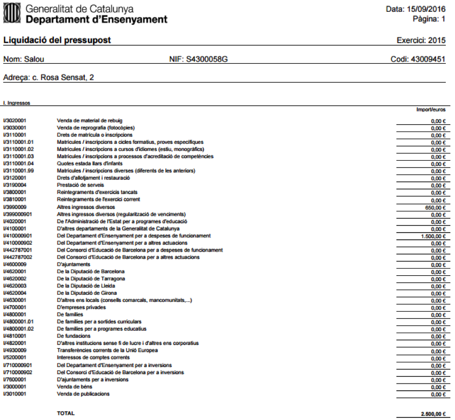

Imatge 14. PDF de l'Informe de liquidació de pressupost

---

### 5.1.2.8. Compte general de tresoreria

Per accedir a l’informe de compte general de tresoreria cal seguir el següent procediment:

* Premeu l’opció d’informe *Compte general de tresoreria (Imatge 15. Sol·licitud d'Informe de compte general de tresoreria)*.

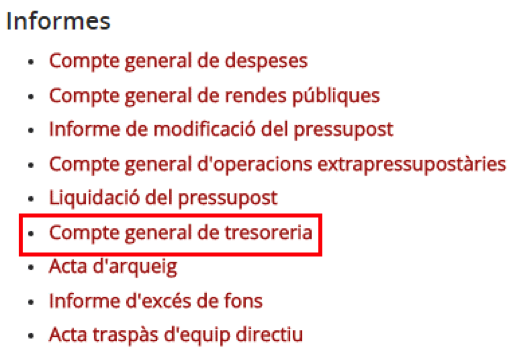

Imatge 15. Sol·licitud d'Informe de compte general de tresoreria

* El programa genera un arxiu en format *PDF*  amb les dades corresponents a aquesta llista. Es mostra un exemple a la imatge (*Imatge 16. PDF de l'Informe de compte general de tresoreria*).

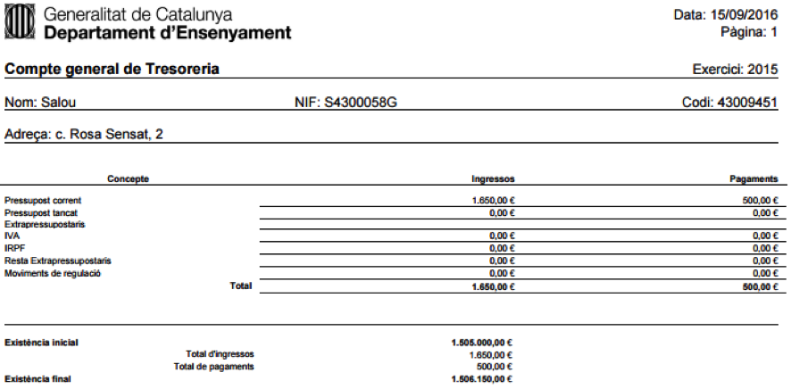

Imatge 16. PDF de l'Informe de compte general de tresoreria

---

### 5.1.2.9. Acta d’arqueig

Per accedir a l’informe d’acta d’arqueig cal seguir el següent procediment:

* Premeu l’opció d’informe de *Acta d’arqueig (Imatge 17. Sol·licitud d'Informe d'acta d'arqueig)*.

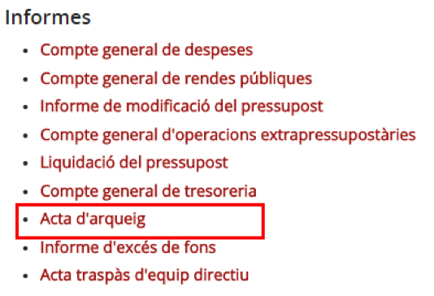

Imatge 17. Sol·licitud d'Informe d'acta d'arqueig

* Es mostra el quadre de diàleg per introduir la data en què es vol consultar l’acta (*Imatge 18. Sol·licitud de data per l'acta d'arqueig*).

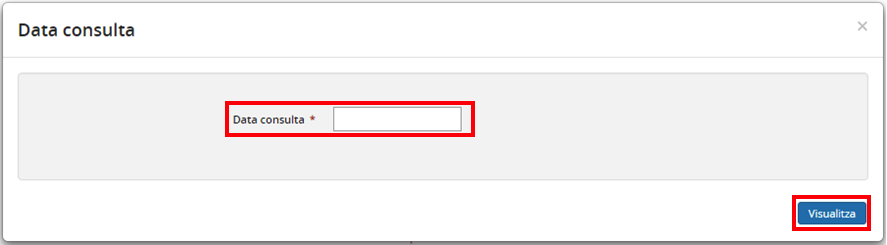

Imatge 18. Sol·licitud de data per l'acta d'arqueig

* Premeu el botó *Visualitza*  i el programa descarrega un *PDF*  amb les dades corresponents. (*Imatge 19. PDF de l'acta d'arqueig*)

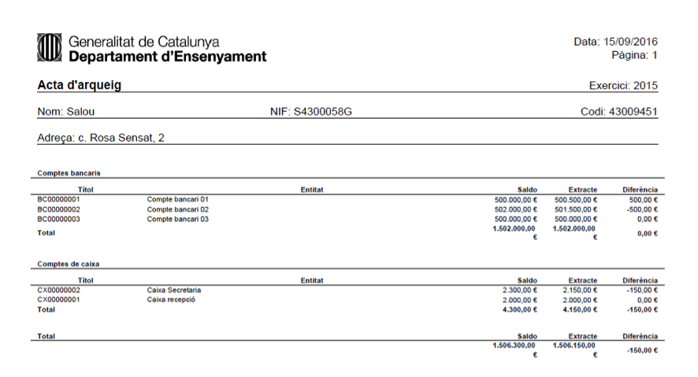

Imatge 19. PDF de l'acta d'arqueig

---

### 5.1.2.10. Informe d’excés de fons

Per accedir a l’informe d’excés de fons cal seguir el següent procediment:

* Premeu l’opció *Informe d’excés de fons (Imatge 20. Sol·licitud d'Informe d'excés de fons)*.

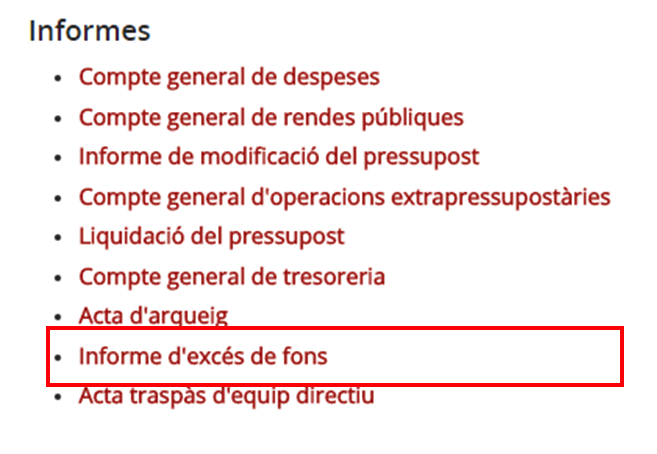

Imatge 20. Sol·licitud d'Informe d'excés de fons

* El programa genera un arxiu en format *PDF*  amb les dades corresponents a aquesta llista. Es mostra un exemple a la imatge (*Imatge 21. PDF de l'Informe d'excés de fons*).

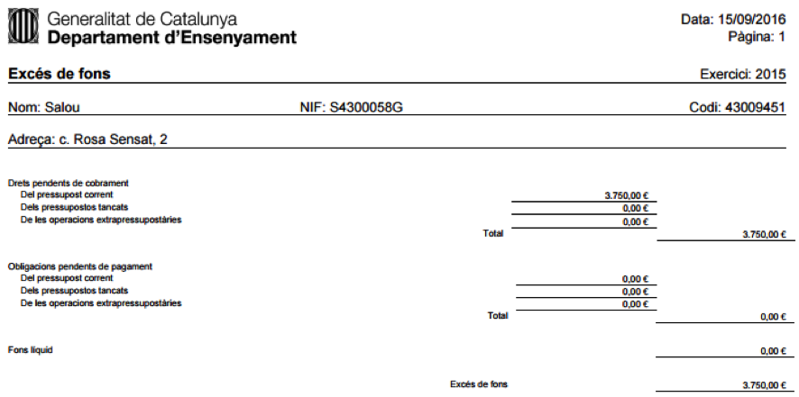

Imatge 21. PDF de l'Informe d'excés de fons

---

### 5.1.2.11. Acta traspàs d’equip directiu

Per accedir a l’informe d’acta traspàs d’equip directiu cal seguir el següent procediment:

Premeu l’opció d’informe *Acta de traspàs d’equip directiu (Imatge 22. Sol·licitud d'Informe d'acta de traspàs d'equip directiu)*

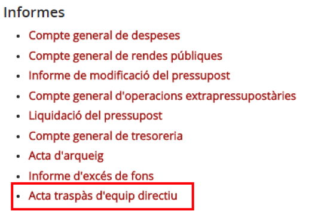

Imatge 22. Sol·licitud d'Informe d'acta de traspàs d'equip directiu

* Es mostra el quadre de diàleg per omplir la informació necessària per l’acta de traspàs d’equip directiu (*Imatge 23. Pantalla de traspàs de l'equip directiu*).

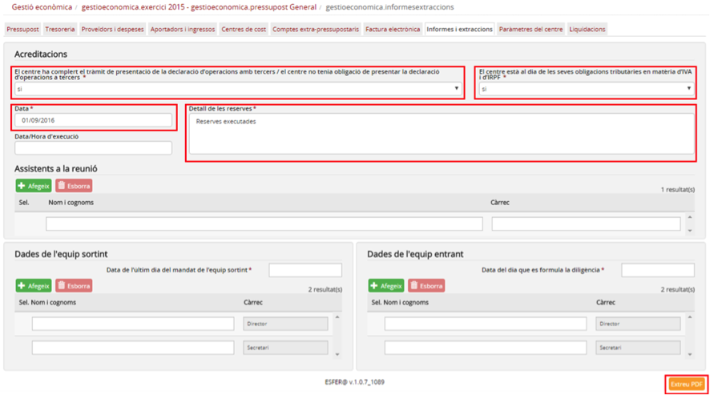

Imatge 23. Pantalla de traspàs de l'equip directiu

* Ompliu tots els camps de la pantalla (com a mínim els que tenen l’asterisc al costat):

  + Dades de la pantalla:

    - *El centre ha complert el tràmit de presentació de la declaració d’operacions amb tercers / El centre no tenia obligació de presentar la declaració d’operacions a tercers (obligatori)*: SI / NO
    - *El centre està al dia de les seves obligacions tributàries en matèria d’IVA i d’IRPF (obligatori)*: SI / NO
    - *Data (obligatori)*: data de l’acta de traspàs
    - *Detall de les reserves (obligatori)*: detall de les reserves
    - *Data/Hora d’execució (obligatori)*: data / hora d’execució de l’acta de traspàs.
    - *Nom i cognoms d’assitents a la reunió (obligatori)*: nom i cognoms d’assitents a la reunió
    - *Càrrec de l’assistent (obligatori)*: càrrec de l’assistent
    - *Data de l’últim dia del mandat de l’equip sortint (obligatori)*: data de l’últim dia del mandat de l’equip sortint
    - *Nom i cognoms de l’equip sortint (obligatori)*: nom i cognoms de l’equip sortint
    - *Nom i cognoms de l’equip entrant (obligatori)*: nom i cognoms de l’equip entrant

* Premeu el botó *Extreu PDF* : el programa descarrega un *PDF*  amb totes les dades corresponents (*Imatge 24. PDF de l'acta de traspàs de l'equip directiu*).

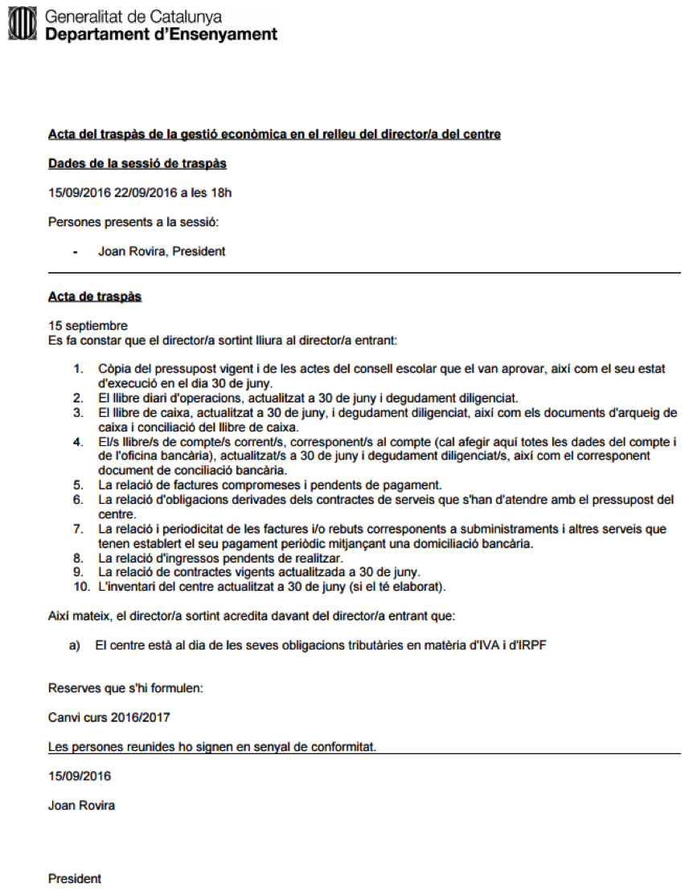

Imatge 24. PDF de l'acta de traspàs de l'equip directiu