# 5.2 Gestió de consultes i extraccions

* [5.2.1. Descripció](ap52.md#521-descripcio)
* [5.2.2. Gestió d’informes](ap52.md#522-gestio-dinformes)

  + [5.2.2.1. Accés](ap52.md#5221-acces)
  + [5.2.2.2. Llista d’informes](ap52.md#5222-llista-dinformes)
  + [5.2.2.3. Consulta del Llibre diari d'operacions](ap52.md#5223-consulta-del-llibre-diari-doperacions)
  + [5.2.2.4. Consulta del Llibre de comptes corrents](ap52.md#5224-consulta-del-llibre-de-comptes-corrents)
  + [5.2.2.5. Consulta del Llibre de caixa](ap52.md#5225-consulta-del-llibre-de-caixa)
  + [5.2.2.6. Consulta del Llibre de despeses](ap52.md#5226-consulta-del-llibre-de-despeses)
  + [5.2.2.7. Consulta del Llibre d'ingressos](ap52.md#5227-consulta-del-llibre-dingressos)
  + [5.2.2.8. Consulta de dades del pressupost](ap52.md#5228-consulta-de-dades-del-pressupost)
  + [5.2.2.9. Consulta Estat execució del pressupost](ap52.md#5229-consulta-estat-execucio-del-pressupost)
  + [5.2.2.10. Consulta de les modificacions del pressupost](ap52.md#52210-consulta-de-les-modificacions-del-pressupost)
  + [5.2.2.11. Consulta del Llibre d'operacions extrapressupostàries](ap52.md#52211-consulta-del-llibre-doperacions-extrapressupostaries)
  + [5.2.2.12. Consulta del Llibre de proveïdors varis](ap52.md#52212-consulta-del-llibre-de-proveidors-varis)
  + [5.2.2.13. Consulta del Llibre d’aportadors genèrics](ap52.md#52213-consulta-del-llibre-daportadors-generics)
  + [5.2.2.14. Consulta del Llibre de centres de cost](ap52.md#52214-consulta-del-llibre-de-centres-de-cost)
  + [5.2.2.15. Consulta dels moviments dels centres de cost](ap52.md#52215-consulta-dels-moviments-dels-centres-de-cost)
  + [5.2.2.16. Consulta dels saldos de comptes bancaris o caixes d'efectiu](ap52.md#52216-consulta-dels-saldos-de-comptes-bancaris-o-caixes-defectiu)
  + [5.2.2.17. Consulta dels comptes bancaris o caixes d’efectiu en saldo negatiu](ap52.md#52217-consulta-dels-comptes-bancaris-o-caixes-defectiu-en-saldo-negatiu)
  + [5.2.2.18. Consulta de les previsions de tresoreria](ap52.md#52218-consulta-de-les-previsions-de-tresoreria)
  + [5.2.2.19. Consulta dels moviments de romanent d’exercicis anteriors](ap52.md#52219-consulta-dels-moviments-de-romanent-dexercicis-anteriors)

---

## 5.2.1. Descripció

Com a part del funcionament del dia a dia del centre, hi ha diverses consultes i informes que serveixen als usuaris per poder extreure informació sobre el pressupost i sobre la comptabilitat.

En aquest contingut es mostren les diverses extraccions i consultes de què disposa l’usuari dins del mòdul de Gestió econòmica d’Esfer@. Tots els informes i extraccions estan disponibles per al director dins el mòdul de Gestió econòmica.

La gestió dels informes i les extraccions de l’exercici actual són d’ús exclusiu del director/usuari.

---

## 5.2.2. Gestió d’informes

### 5.2.2.1. Accés

Des de la pàgina principal d’Esfer@ cal anar al mòdul de *Gestió econòmica*.

Imatge 1. Pantalla inicial d’Esfer@

Una vegada s’hagi accedit al mòdul de *Gestió econòmica* apareix a sota un nou menú amb les opcions dels pressupostos vigents. Seleccioneu un pressupost i trieu la pestanya *Informes i extraccions*. (*Imatge 2. Estructura de pestanyes de l'administrador d'àmbit*).

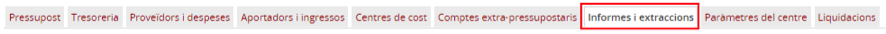

Imatge 2. Estructura de pestanyes de l'administrador d'àmbit

Un cop s’ha seleccionat aquesta opció, apareix una llista amb tots els informes i extraccions disponibles estructurats de la manera següent. (Imatge 3. Llista d’informes i extraccions).

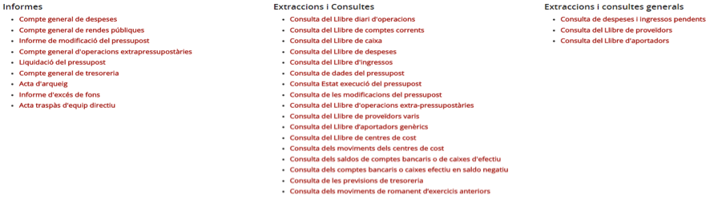

Imatge 3. Llista informes i extraccions

---

### 5.2.2.2. Llista d’informes

Aquest apartat se centra en la llista d’extraccions i consultes, tal com es mostra a continuació (*Imatge 4.Extraccions i consultes*).

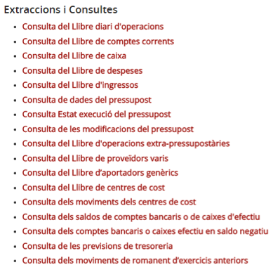

Imatge 4.Extraccions i consultes

---

### 5.2.2.3. Consulta del Llibre diari d'operacions

El llibre diari d’operacions permet consultar totes les operacions comptables que s’hagin produït entre dues dates.

Per accedir a la consulta del Llibre diari d’operacions cal seguir el procediment següent:

* Premeu Consulta del Llibre diari d’operacions (Imatge 5. Consulta del Llibre diari d'operacions).

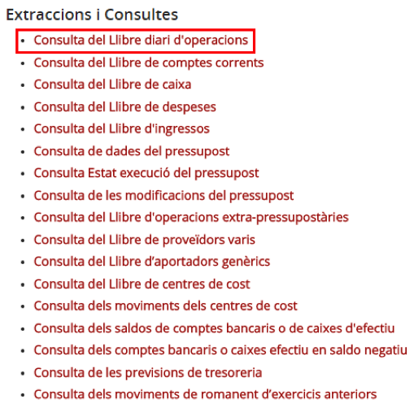

Imatge 5. Consulta del Llibre diari d'operacions

* Es mostra un quadre de diàleg (*Imatge 6. Interval de dates de consulta*) on heu d’introduir l’interval de data de consulta.
* Introduïu els camps obligatoris:

  + *Data inici*: data d’inici de la consulta.
  + *Data fi*: data final de la consulta.

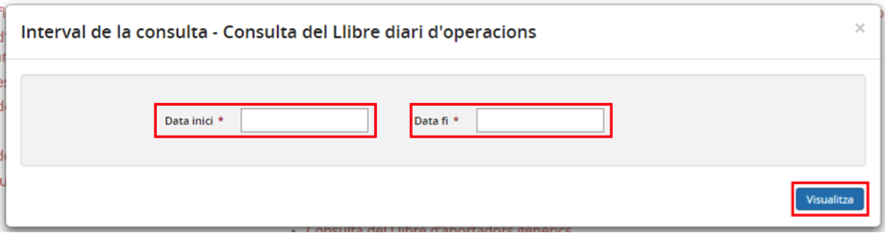

Imatge 6. Interval de dates de consulta

* Premeu el botó *Visualitza* .

  + Es mostra el resultat de la consulta (Imatge 7. Llista d'operacions)

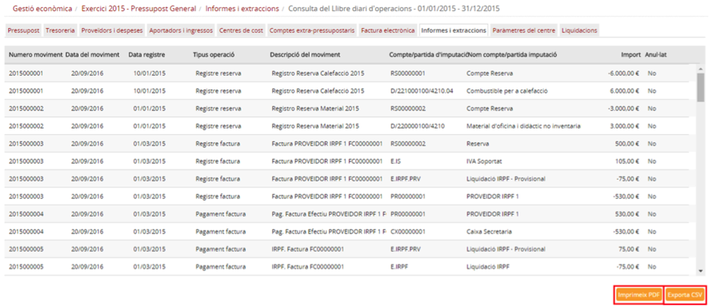

Imatge 7. Llista d'operacions

Com es pot veure a la imatge (*Imatge 7. Llista d'operacions*) apareixen tot un seguit de columnes amb la informació de detall següent:

* *Número moviment*: correspon al número de moviment de l’operació.
* *Data moviment*: correspon a la data de moviment de l’operació.
* *Tipus operació*: correspon al tipus d’operació de l’operació.
* *Descripció moviment*: correspon a la descripció del moviment de l’operació.
* *Compte/partida d’imputació*: correspon al compte/partida d’imputació de l’operació.
* *Nom compte/partida imputació*: correspon al nom del compte/partida d’imputació de l’operació.
* *Import*: correspon a l’import de l’operació.
* *Anul·lat*: sí/no.

Opcions d’exportació:

* Premeu el botó *Imprimeix*  per exportar a PDF (*Imatge 8. PDF Llibre diari d'operacions*).
* Premeu el botó *Exporta CSV*  per exportar a format Excel (*Imatge 9. Excel Llibre diari d'operacions*).

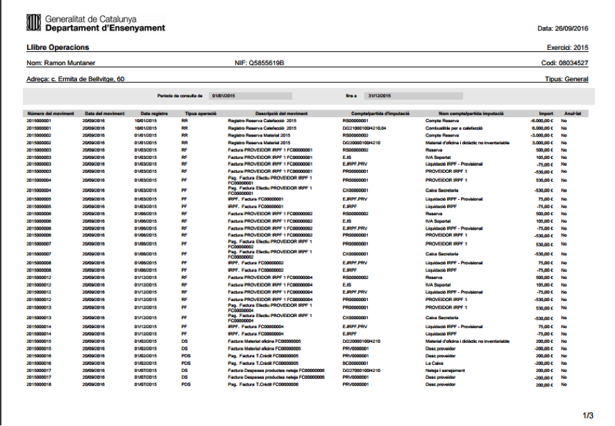

Imatge 8. PDF Llibre diari d'operacions

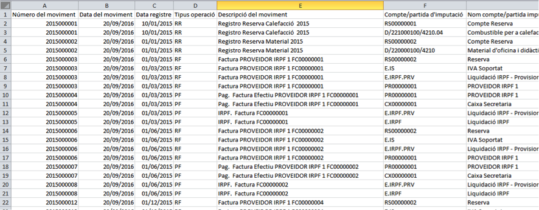

Imatge 9. Excel Llibre diari d'operacions

---

### 5.2.2.4. Consulta del Llibre de comptes corrents

Per accedir a la consulta del Llibre de comptes corrents cal seguir el procediment següent:

* Premeu Consulta del Llibre de comptes corrents (Imatge 10. Consulta del Llibre de comptes corrents).

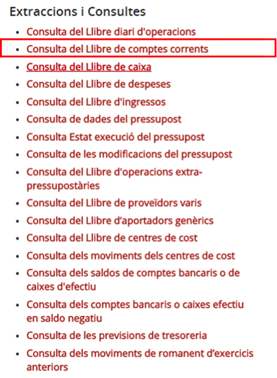

Imatge 10. Consulta del Llibre de comptes corrents

* Es mostra la pantalla (*Imatge 11. Interval de dates de la consulta*) on heu d’introduir l’interval de dates de la consulta i seleccionar els comptes corrents.

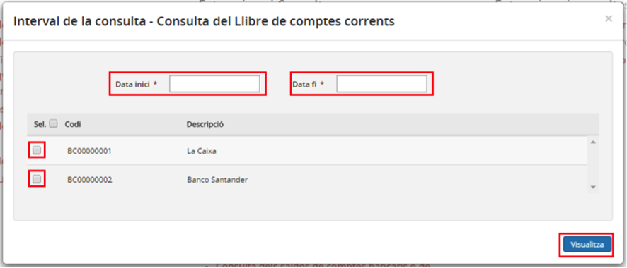

Imatge 11. Interval de dates de la consulta

* Premeu el botó *Visualitza*  .

  + Es mostra la pantalla de resultat de la consulta (*Imatge 12. Resultat consulta Llibre comptes corrents*)

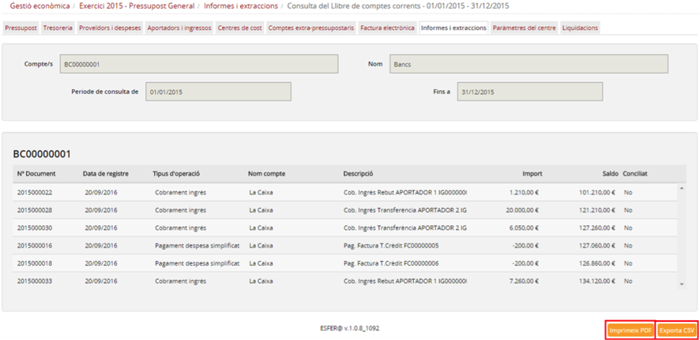

Imatge 12. Resultat consulta Llibre comptes corrents

Com es veu a la imatge anterior, en el resultat de la consulta apareixen columnes amb la informació de detall següent:

* *Número document*: correspon al número de document del compte corrent.
* *Data de registre*: correspon a la data de registre del compte corrent.
* *Tipus operació*: correspon al tipus d’operació del compte corrent.
* *Nom compte*: correspon al nom del compte corrent.
* *Descripció*: correspon a la descripció del compte corrent.
* *Import*: correspon a l’import del compte corrent.
* *Conciliat*: sí/no.

Opcions d’exportació:

* Premeu el botó *Imprimeix*  per exportar a PDF (*Imatge 13. PDF del Llibre de comptes corrents*).
* Premeu el botó *Exporta CSV*  per exportar a format Excel (*Imatge 14. Excel del Llibre diari de comptes corrents*).

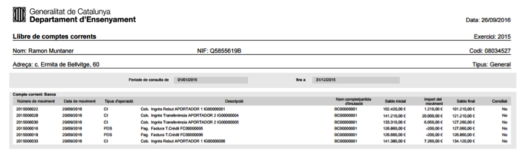

Imatge 13. PDF del Llibre de comptes corrents

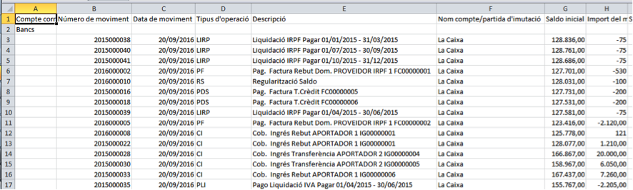

Imatge 14. Excel del Llibre diari de comptes corrents

---

### 5.2.2.5. Consulta del Llibre de caixa

Per accedir a l’informe de modificació del pressupost cal seguir el procediment següent:

* Premeu *Consulta del Llibre de caixa (Imatge 15. Consulta del Llibre de caixa)*.

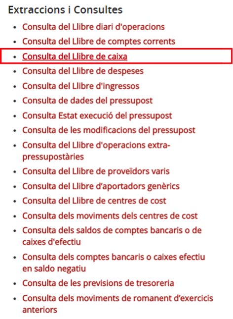

Imatge 15. Consulta del Llibre de caixa

* Es mostra la pantalla (*Imatge 16. Interval de dates de la consulta*) on heu d’introduir l’interval de dates de la consulta i seleccionar la caixa d’efectiu.

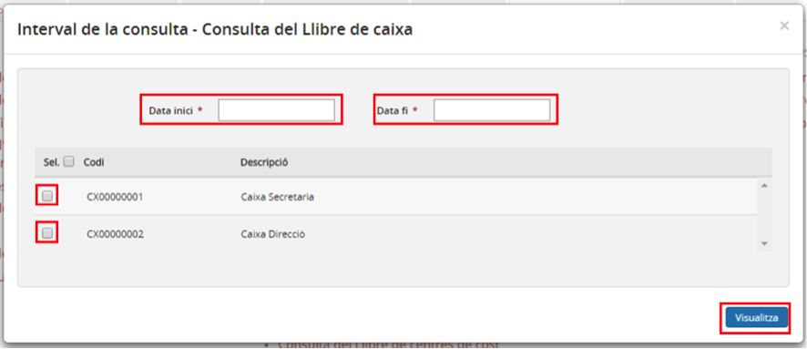

Imatge 16. Interval de dates de la consulta

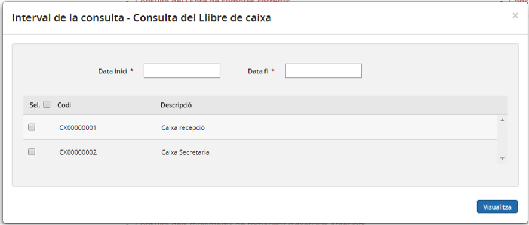

Imatge 15. Consulta

* Premeu el botó *Visualitza* .

  + Es mostra la pantalla de resultat de la consulta del Llibre de caixa (*Imatge 17. Resultat consulta del Llibre de caixa*)

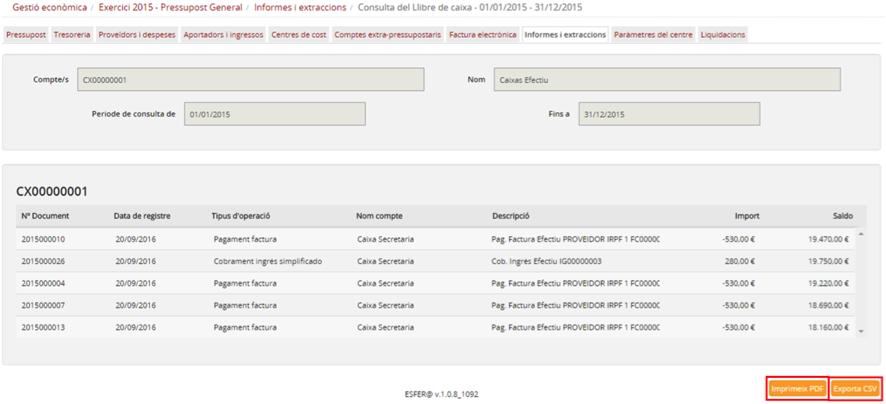

Imatge 17. Resultat consulta del Llibre de caixa

Com es pot veure en la imatge anterior apareixen columnes amb la informació de detall següent:

* *Número document*: correspon al número de document de la caixa.
* *Data de registre*: correspon a la data de registre de la caixa.
* *Tipus operació*: correspon al tipus d’operació de la caixa.
* *Nom compte*: correspon al nom de la caixa.
* *Descripció*: correspon a la descripció de l’operació.
* *Import*: correspon a l’import de l’operació.
* *Saldo*: correspon al saldo de la caixa.

Opcions d’exportació:

* Premeu el botó *Imprimeix*  per exportar a PDF (*Imatge 18. PDF de la consulta del Llibre de caixa*).
* Premeu el botó *Exporta CSV*  per exportar a format Excel (*Imatge 19. Excel de la consulta del Llibre de caixa*).

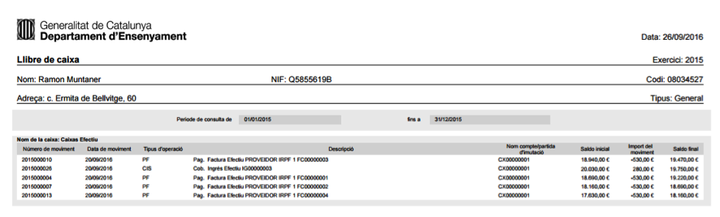

Imatge 18. PDF de la consulta del Llibre de caixa

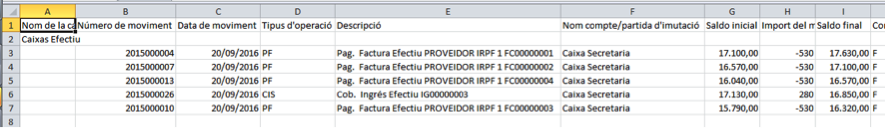

Imatge 19. Excel de la consulta del Llibre de caixa

---

### 5.2.2.6. Consulta del Llibre de despeses

Per accedir a la consulta del Llibre de despeses cal seguir el procediment següent:

* Premeu *Consulta del Llibre de despeses (Imatge 20. Consulta del Llibre de despeses)*.

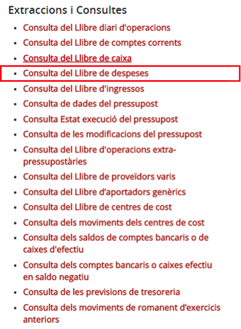

Imatge 20. Consulta del Llibre de despeses

* Es mostra la pantalla (*Imatge 21. Interval de dates de la consulta*) on heu d’introduir l’interval de dates de la consulta i seleccionar les partides de despesa.

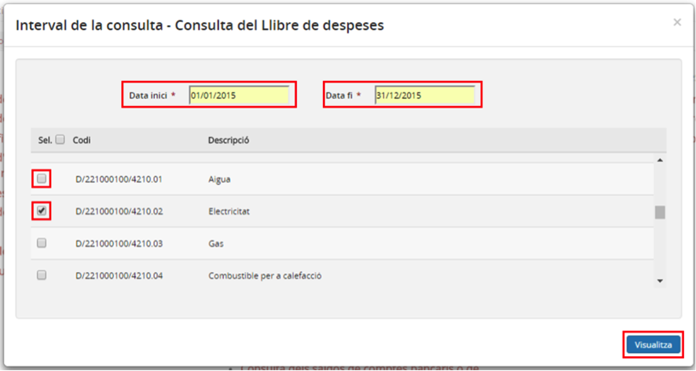

Imatge 21. Interval de dates de la consulta

* Premeu el botó *Visualitza* .

  + Es mostra la pantalla següent (*Imatge 22. Resultat consulta del Llibre de despeses*).

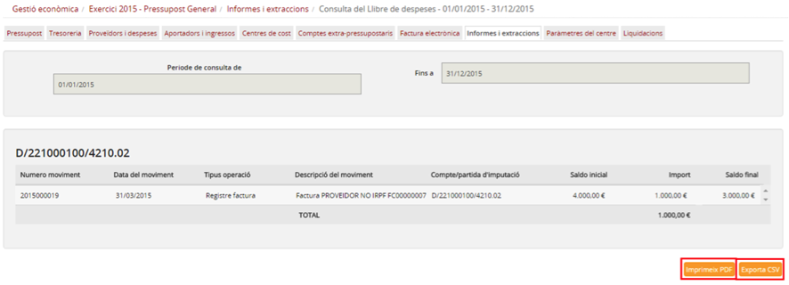

Imatge 22. Resultat consulta del Llibre de despeses

Com es pot veure en la imatge anterior apareixen columnes amb la informació de detall següent:

* *Número moviment*: correspon al número de moviment de la despesa.
* *Data moviment*: correspon a la data de moviment de la despesa.
* *Tipus operació*: correspon al tipus d’operació de la despesa.
* *Descripció moviment*: correspon a la descripció del moviment de la despesa.
* *Compte/partida d’imputació*: correspon al compte/partida d’imputació de la despesa.
* *Saldo inicial*: correspon al saldo inicial de la despesa.
* *Import*: correspon a l’import de la despesa.
* *Saldo final*: correspon al saldo final de la despesa.

Opcions d’exportació:

* Premeu el botó *Imprimeix*  per exportar a PDF (*Imatge 23. PDF de la consulta Llibre de despeses*).
* Premeu el botó *Exporta CSV*  per exportar a format Excel (*Imatge 24. Excel de la consulta del Llibre de despeses*).

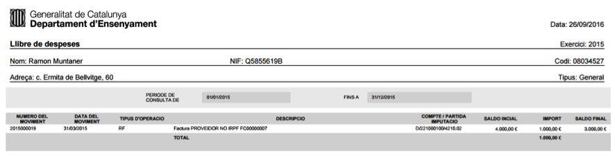

Imatge 23. PDF de la consulta Llibre de despeses

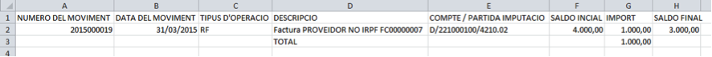

Imatge 24. Excel de la consulta del Llibre de despeses

---

### 5.2.2.7. Consulta del Llibre d'ingressos

Per accedir a la consulta del Llibre d’ingressos cal seguir el procediment següent:

* Premeu *Consulta del Llibre d’ingressos* (*Imatge 25. Consulta del Llibre d'ingressos*).

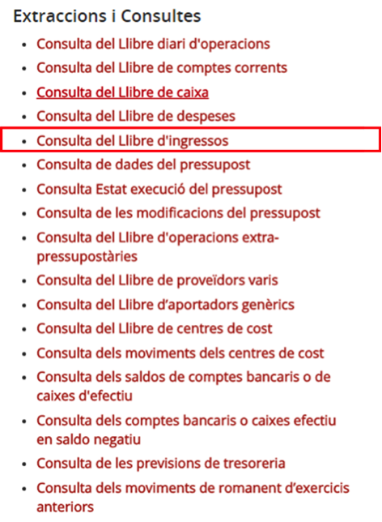

Imatge 25. Consulta del Llibre d'ingressos

* Es mostra la pantalla (*Imatge 26. Interval de dates de la consulta*) on heu d’introduir l’interval de dates de la consulta i seleccionar les partides d’ingrés.

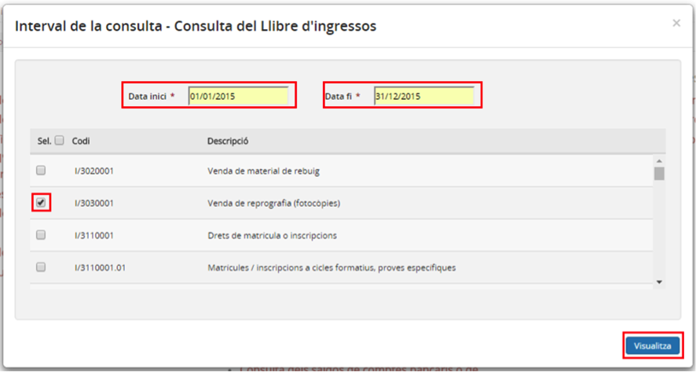

Imatge 26. Interval de dates de la consulta

* Premeu el botó *Visualitza* 

  + Es mostra la pantalla següent (*Imatge 27. Resultat de la consulta del Llibre d'ingressos*)

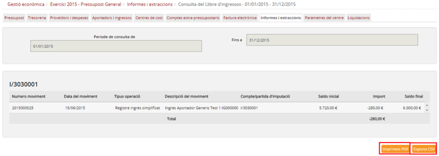

Imatge 27. Resultat de la Consulta del Llibre d'ingressos

Com es pot veure a la pantalla anterior, apareixen columnes amb la informació de detall següent:

* *Número moviment*: correspon al número de moviment de l’ingrés.
* *Data moviment*: correspon a la data del moviment de l’ingrés.
* *Tipus operació*: correspon al tipus d’operació de l’ingrés.
* *Descripció moviment*: correspon a la descripció del moviment de l’ingrés.
* *Compte/partida d’imputació*: correspon al compte/partida d’imputació de l’ingrés.
* *Saldo inicial*: correspon al saldo inicial de l’ingrés.
* *Import*: correspon a l’import de l’ingrés.
* *Saldo final*: correspon al saldo final de l’ingrés.

Opcions d’exportació:

* Premeu el botó *Imprimeix*  per exportar a PDF (Imatge 28. PDF del Llibre d'ingressos).
* Premeu el botó *Exporta CSV*  per exportar a format Excel (Imatge 29. Excel del Llibre d'ingressos).

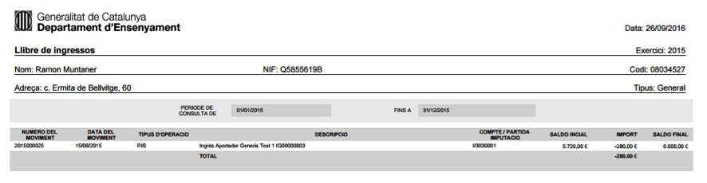

Imatge 28. PDF del Llibre d'ingressos

Imatge 29. Excel del Llibre d'ingressos

---

### 5.2.2.8. Consulta de dades del pressupost

Per accedir a la consulta de dades del pressupost cal seguir el procediment següent:

* Premeu *Consulta de dades del pressupost (Imatge 30. Consulta de dades del pressupost)*.

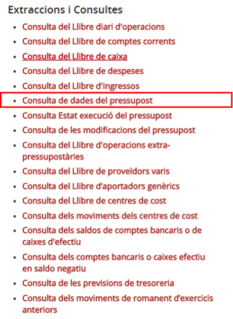

Imatge 30. Consulta de dades del pressupost

* Es mostra la pantalla de resultat de la consulta (*Imatge 31. Resultat del la consulta de dades del pressupost*).

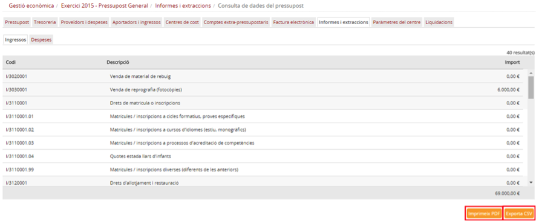

Imatge 31. Resultat del la consulta de dades del pressupost

Com es pot veure en la imatge anterior apareixen dues pestanyes:

* *Ingressos*: es mostra la informació de les partides d’ingrés.
* *Despeses*: es mostra la informació de les partides de despesa.

Cada una de les pestanyes anteriors té les columnes amb la informació de detall següent:

* *Codi*: correspon al codi del pressupost.
* *Descripció*: correspon a la descripció del pressupost.
* *Import*: correspon al tipus d’operació de l’aportador.

Opcions d’exportació:

* Premeu el botó *Imprimeix*  per exportar a PDF (Imatge 32. PDF de la consulta de dades del pressupost).
* Premeu el botó *Exporta CSV*  per exportar a format Excel (Imatge 33. Excel de la consulta de dades del pressupost).

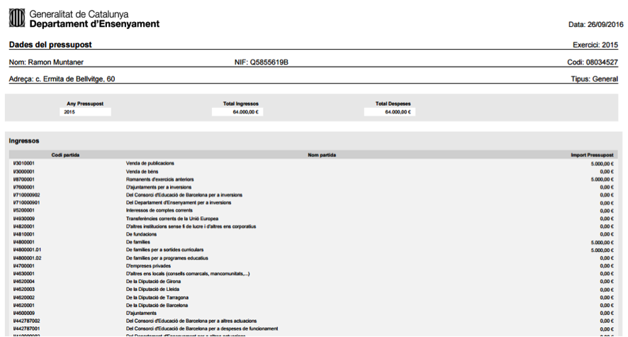

Imatge 32. PDF de la consulta de dades del pressupost

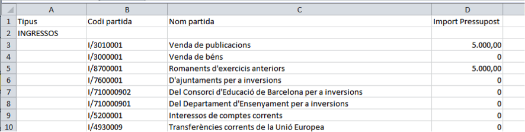

Imatge 33. Excel de la consulta de dades del pressupost

---

### 5.2.2.9. Consulta Estat execució del pressupost

Per accedir a la consulta de l’estat d’execució del pressupost cal seguir el procediment següent:

* Premeu *Consulta Estat execució del pressupost (Imatge 34. Consulta d'estat d'execució del pressupost)*.

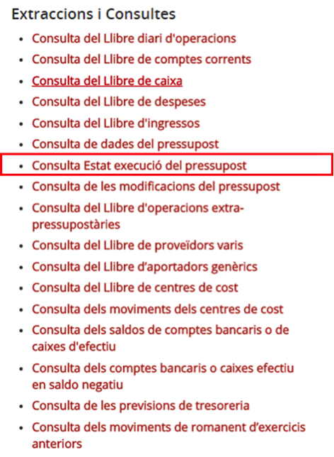

Imatge 30. Consulta de dades del pressupost

* Es mostra la pantalla de resultat de la consulta (*Imatge 35. Resultat de la consulta d'estat d'execució del pressupost*).

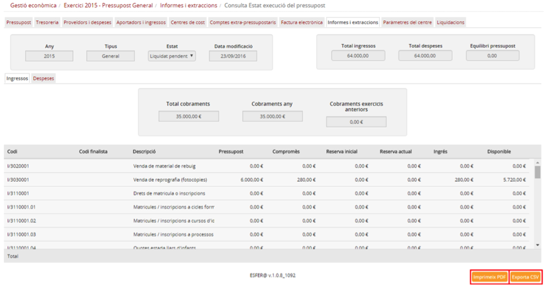

Imatge 35. Resultat de la consulta d'estat d'execució del pressupost

Com es pot veure en la imatge anterior apareixen dues pestanyes:

* *Ingressos*: es mostra la informació de les partides d’ingrés.
* *Despeses*: es mostra la informació de les partides de despesa.

Cada una de les pestanyes anteriors té columnes amb la informació de detall següent:

* *Codi*: correspon al codi del pressupost.
* *Codi finalista*: correspon al codi finalista del pressupost.
* *Descripció*: correspon a la descripció del pressupost.
* *Pressupost*: correspon a la quantitat del pressupost.
* *Compromès*: correspon a la quantitat compromesa del pressupost.
* *Reserva inicial*: correspon a la reserva inicial del pressupost.
* *Reserva actual*: correspon a la reserva actual del pressupost.
* *Ingrés*: correspon a l’ingrés del pressupost.
* *Disponible*: correspon a la quantitat disponible del pressupost.

Opcions d’exportació:

* Premeu el botó *Imprimeix*  per exportar a PDF (*Imatge 36. PDF de la consulta d'estat d'execució del pressupost*).
* Premeu el botó *Exporta CSV*  per exportar a format Excel (*Imatge 37. Excel de la consulta d'estat d'execució del pressupost*).

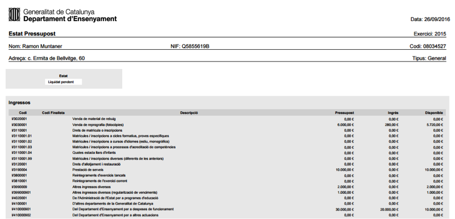

Imatge 36. PDF de la consulta d'estat d'execució del pressupost

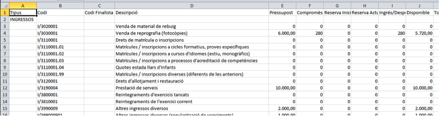

Imatge 37. Excel de la consulta d'estat d'execució del pressupost

---

### 5.2.2.10. Consulta de les modificacions del pressupost

Per accedir a l’informe d’excés de fons cal seguir el procediment següent:

* Premeu *Consulta de les modificacions del pressupost (Imatge 38. Consulta de les modificacions del pressupost)*.

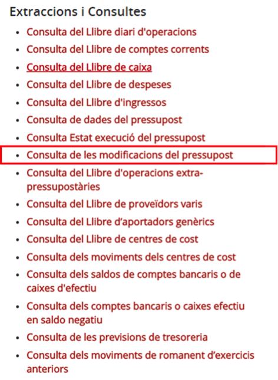

Imatge 38. Consulta de les modificacions del pressupost

* Es mostra la pantalla de resulta de la consulta de les modificacions del pressupost (*Imatge 39. Resultat consulta de les modificacions del pressupost*).

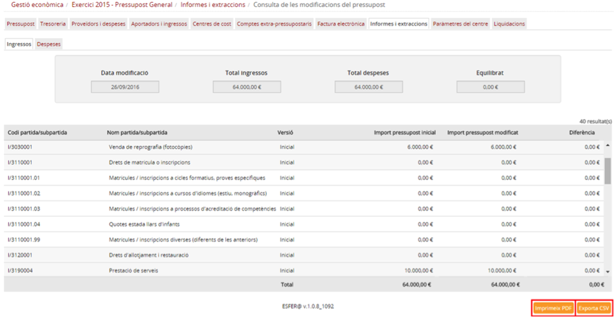

Imatge 39. Resultat consulta de les modificacions del pressupost

Com es pot veure en la imatge anterior apareixen dues pestanyes:

* *Ingressos*: es mostra la informació de les partides d’ingrés.
* *Despeses*: es mostra la informació de les partides de despesa.

Cada una de les pestanyes anteriors té columnes amb la informació de detall següent:

* *Codi partida/subpartida*: correspon al codi de la partida/subpartida.
* *Nom partida/subpartida*: correspon al nom de la partida/subpartida.
* *Versió*: correspon a la versió de la partida/subpartida.
* *Import pressupost inicial*: correspon a la quantitat de l’import de pressupost inicial.
* *Import pressupost modificat*: correspon a la quantitat de l’import de pressupost modificat.
* *Diferència*: correspon a la diferència entre l’import del pressupost inicial i el modificat.

Opcions d’exportació:

* Premeu el botó *Imprimeix*  per exportar a PDF (*Imatge 40. PDF de la consulta de les modificacions del pressupost*).
* Premeu el botó *Exporta CSV*  per exportar a format Excel (*Imatge 41. Excel de la consulta de modificacions del pressupost*).

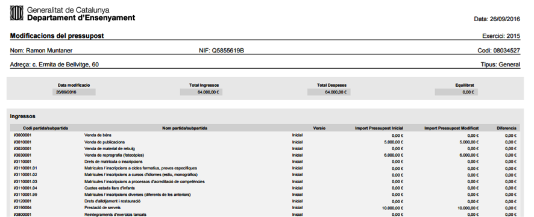

Imatge 40. PDF de la consulta de les modificacions del pressupost

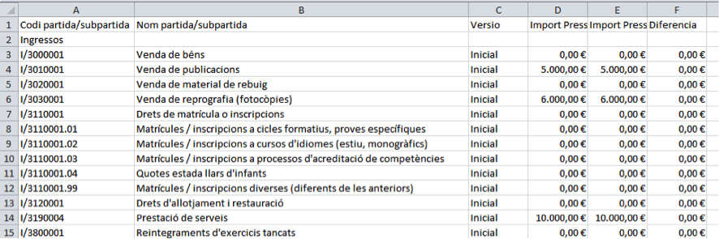

Imatge 41. Excel de la consulta de modificacions del pressupost

---

### 5.2.2.11. Consulta del Llibre d'operacions extrapressupostàries

Per accedir a la consulta del Llibre d’operacions extrapressupostàries cal seguir el procediment següent:

* Premeu *Consulta del Llibre d’operacions extrapressupostàries (Imatge 42. Consulta del Llibre d'operacions extrapressupostàries)*.

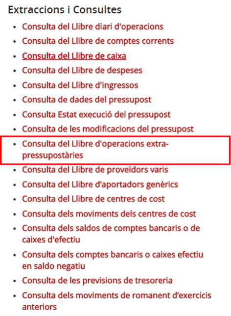

Imatge 42. Consulta del Llibre d'operacions extrapressupostàries

* Es mostra la pantalla de selecció de dates i comptes extrapressupostaris (Imatge 43. Interval de dates de la consulta) on heu d’introduir l’interval de dates de la consulta i seleccionar els comptes extrapressupostaris.

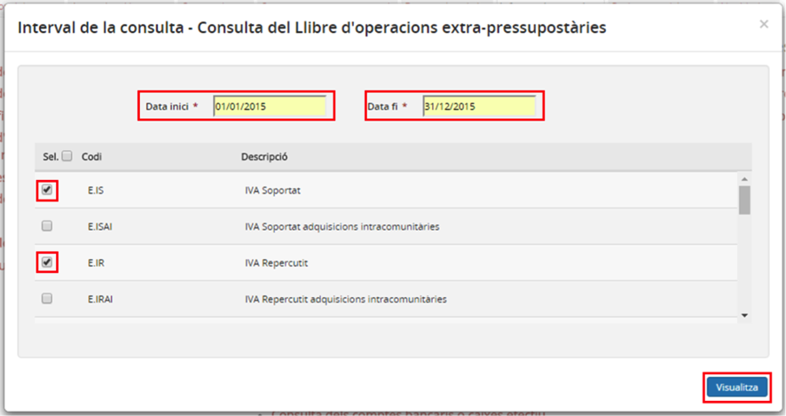

Imatge 43. Interval de dates de la consulta

* Premeu el botó *Visualitza* .

  + Es mostra la pantalla següent (*Imatge 44. Resultat consulta d'operacions extrapressupostàries*).

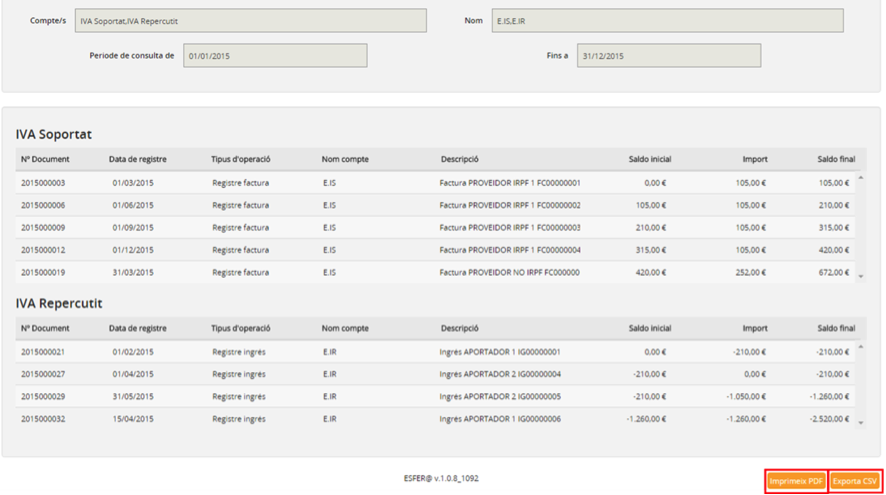

Imatge 44. Resultat consulta d'operacions extrapressupostàries

* Premeu el botó *Imprimeix*  per exportar a PDF (*Imatge 45. PDF de la consulta d'operacions extrapressupostàries*).
* Premeu el botó *Exporta CSV*  per exportar a format Excel (*Imatge 46. Excel de la consulta d'operacions extrapressupostàries*).

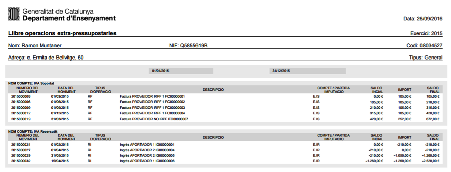

Imatge 45. PDF de la consulta d'operacions extrapressupostàries

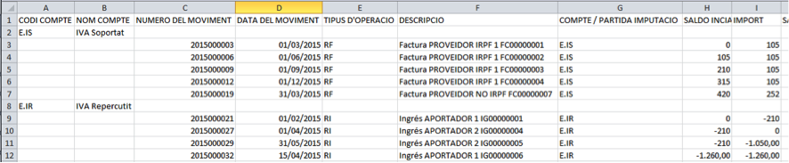

Imatge 46. Excel de la consulta d'operacions extrapressupostàries

---

### 5.2.2.12. Consulta del Llibre de proveïdors varis

Per accedir a la consulta del Llibre de proveïdors varis cal seguir el procediment següent:

* Premeu *Consulta del Llibre de proveïdors varis (Imatge 47. Consulta del Llibre de proveïdors varis)*.

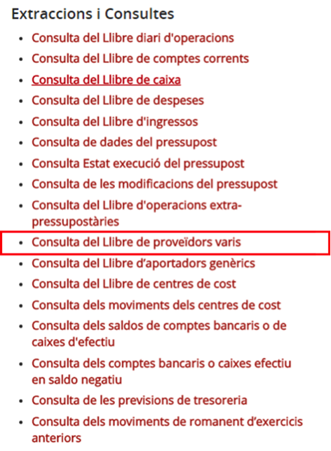

Imatge 47. Consulta del Llibre de proveïdors varis

* Es mostra la pantalla de Consulta del Llibre de proveïdors varis (*Imatge 48. Interval de dates de consulta*) on heu d’introduir l’interval de dates de la consulta i seleccionar els proveïdors.

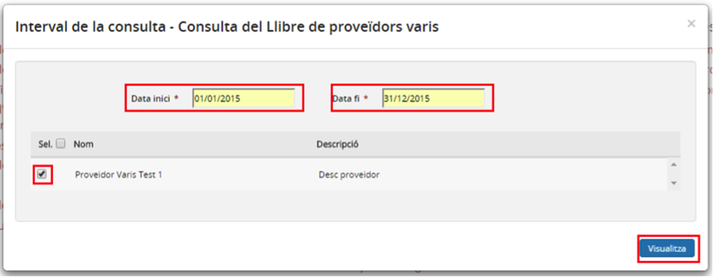

Imatge 48. Interval de dates de consulta

* Premeu el botó *Visualitza* .

  + Es mostra la pantalla de resultats de la consulta de proveïdors varis (*Imatge 49. Resultats consulta proveïdors varis*).

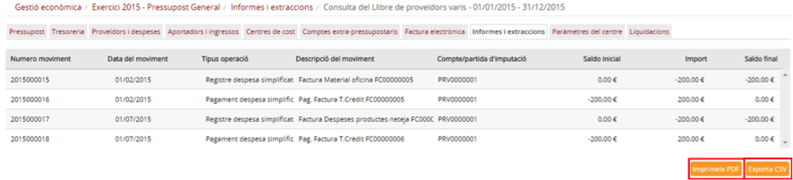

Imatge 49. Resultats consulta proveïdors varis

Com es pot veure en la imatge anterior apareixen columnes amb la informació de detall següent:

* *Numero moviment*: correspon al numero de moviment del proveïdor.
* *Data moviment*: correspon a la data de moviment del proveïdor.
* *Tipus operació*: correspon al tipus d’operació del proveïdor.
* *Descripció moviment*: correspon a la descripció del moviment del proveïdor.
* *Compte/partida d’imputació*: correspon al compte/partida d’imputació del proveïdor.
* *Saldo inicial*: correspon al saldo inicial del proveïdor.
* *Import*: correspon a l’import de l’operació.
* *Saldo final*: correspon al saldo final del proveïdor.

Opcions d’exportació:

* Premeu el botó *Imprimeix*  per exportar a PDF (*Imatge 50. PDF de la consulta de proveïdors varis*).
* Premeu el botó *Exporta CSV*  per exportar a format Excel (*Imatge 51. Excel de la consulta de proveïdors varis*).

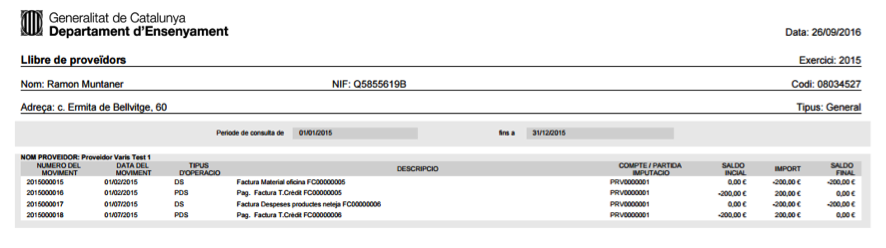

Imatge 50. PDF de la consulta de proveïdors varis

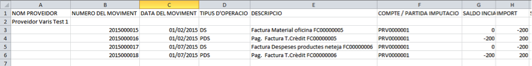

Imatge 51. Excel de la consulta de proveïdors varis

---

### 5.2.2.13. Consulta del Llibre d’aportadors genèrics

Per accedir a la consulta del Llibre d’aportadors genèrics cal seguir el procediment següent:

* Premeu Consulta del Llibre d’aportadors genèrics (*Imatge 52. Llibre d'aportadors genèrics*).

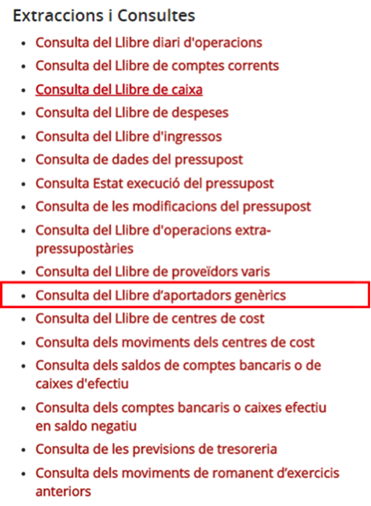

Imatge 52. Llibre d'aportadors genèrics

* Es mostra la pantalla de Consulta del Llibre d’aportadors genèrics (*Imatge 53. Interval de dates de la consulta*) on heu d’introduir l’interval de dates de la consulta i seleccionar els aportadors.

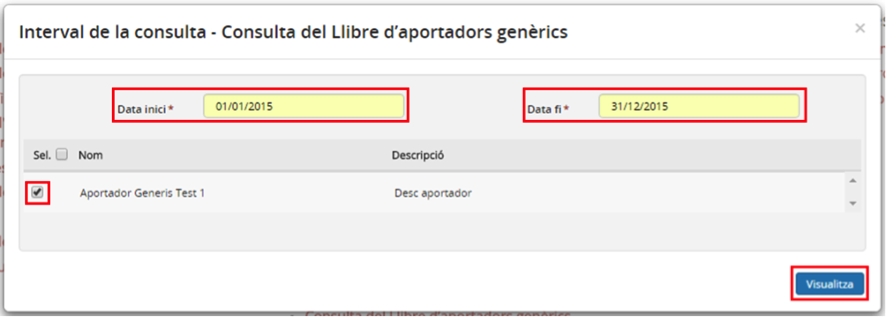

Imatge 53. Interval de dates de la consulta

* Premeu el botó *Visualitza* .

  + Es mostra la pantalla de resultat de la consulta d’aportadors genèrics (*Imatge 54. Resultat consulta aportadors genèrics*).

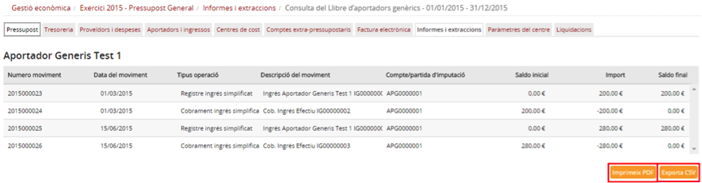

Imatge 54. Resultat consulta aportadors genèrics

Com es pot veure en la imatge anterior apareixen columnes amb la informació de detall següent:

* *Numero moviment*: correspon al numero de moviment de l’aportador.
* *Data moviment*: correspon a la data del moviment de l’aportador.
* *Tipus operació*: correspon al tipus d’operació de l’aportador.
* *Descripció moviment*: correspon a la descripció del moviment de l’aportador.
* *Compte/partida d’imputació*: correspon al compte/partida d’imputació del moviment.
* *Saldo inicial*: correspon al saldo del compte abans de fer l’operació.
* *Import*: correspon a l’import de l’operació.
* *Saldo final*: correspon al saldo final de l’aportador després de fer l’operació.

Opcions d’exportació:

* Premeu el botó *Imprimeix*  per exportar a PDF (*Imatge 55. PDF de la consulta d'aportadors genèrics*).
* Premeu el botó *Exporta CSV*  per exportar a format Excel (*Imatge 56. Excel de la consulta d'aportadors genèrics*).

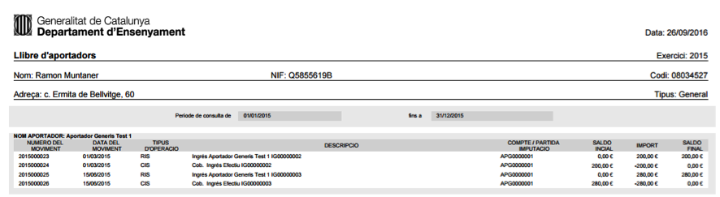

Imatge 55. PDF de la consulta d'aportadors genèrics

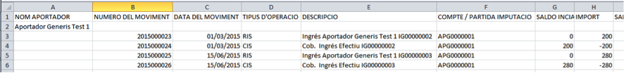

Imatge 56. Excel de la consulta d'aportadors genèrics

---

### 5.2.2.14. Consulta del Llibre de centres de cost

Per accedir a la consulta del llibre de centres de cost cal seguir el procediment següent:

* Premeu *Consulta del Llibre de centres de cost (Imatge 57. Consulta del Llibre de centres de cost).*

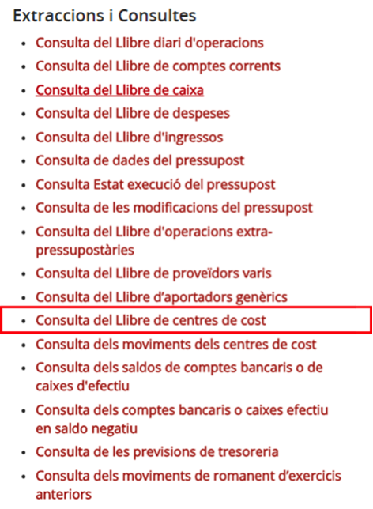

Imatge 57. Consulta del Llibre de centres de cost

* Es mostra la pantalla de consulta de centres de cost (*Imatge 58. Interval de dates de la consulta*) on s’ha d’introduir l’interval de dates de la consulta i seleccionar els centres de cost.

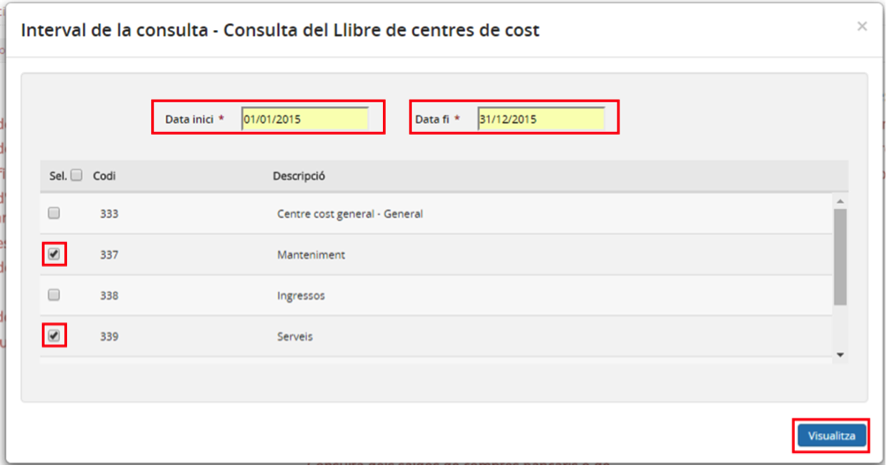

Imatge 58. Interval de dates de la consulta

* Premeu el botó *Visualitza* .

  + Es mostra la pantalla de resultat de la consulta de centres de cost (*Imatge 59. Resultat de la consulta del Llibre de centres de cost*).

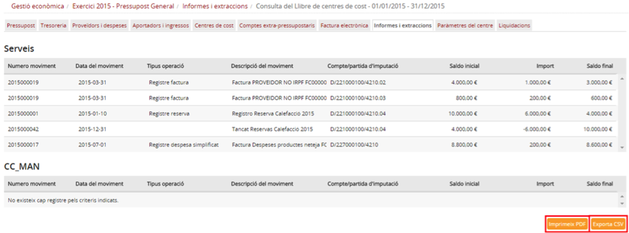

Imatge 59. Resultat de la consulta del Llibre de centres de cost

Com es pot veure a la pantalla anterior, apareixen columnes amb la informació de detall següent:

* *Numero moviment*: correspon al número de moviment del centre de cost.
* *Data moviment*: correspon a la data de moviment del centre de cost.
* *Tipus operació*: correspon al tipus d’operació del centre de cost.
* *Descripció moviment*: correspon a la descripció del moviment del centre de cost.
* *Compte/partida d’imputació*: correspon al compte/partida d’imputació del centre de cost.
* *Saldo inicial*: correspon al saldo inicial del centre de cost abans de fer l’operació.
* *Import*: correspon a l’import de l’operació.
* *Saldo final*: correspon al saldo final del centre de cost després de fer l’operació.

Opcions d’exportació:

* Premeu el botó *Imprimeix*  per exportar a PDF (*Imatge 60. PDF de la consulta del Llibre de centres de cost*).
* Premeu el botó *Exporta CSV*  per exportar a format Excel (*Imatge 61. Excel de la consulta del Llibre de centres de cost*).

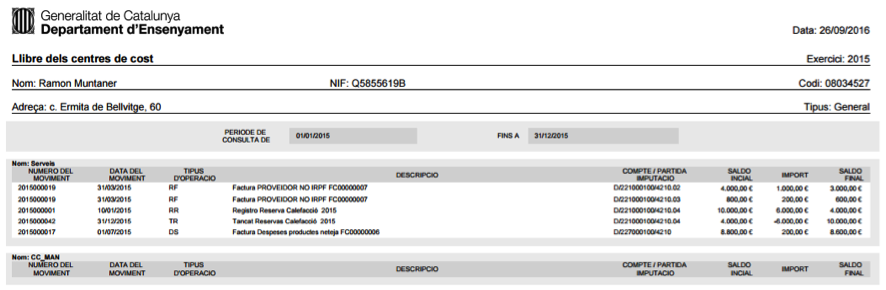

Imatge 60. PDF de la consulta del Llibre de centres de cost

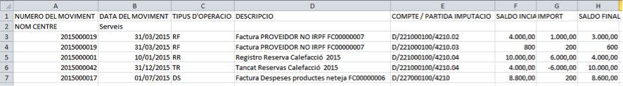

Imatge 61. Excel de la consulta del Llibre de centres de cost

---

### 5.2.2.15. Consulta dels moviments dels centres de cost

Per accedir a la consulta dels moviments dels centres de cost cal seguir el procediment següent:

* Premeu *Consulta dels moviments dels centres de cost (Imatge 62. Consulta dels moviments dels centres de cost)*.

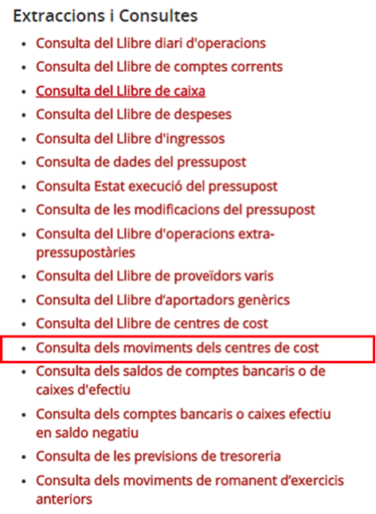

Imatge 62. Consulta dels moviments dels centres de cost

* Es mostra la pantalla de consulta de moviments dels centres de cost (*Imatge 63. Interval de dates de la consulta*) on heu d’introduir l’interval de dates de la consulta i seleccionar els centres de cost i les partides.

  + A part de les dates, seleccioneu, almenys, un centre de cost i una partida.

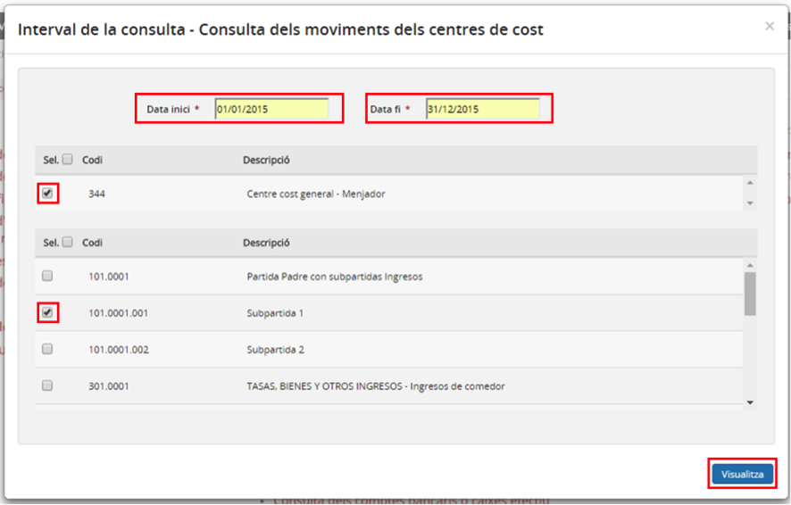

Imatge 63. Interval de dates de la consulta

* Premeu el botó *Visualitza* .

  + Es mostra la pantalla de resultat de la consulta de moviments per centre de cost (*Imatge 64. Resultat de la consulta de moviments per centre de cost*)

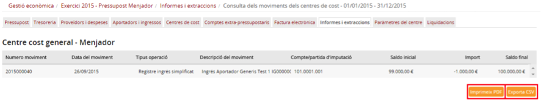

Imatge 64. Resultat de la consulta de moviments per centre de cost

Com es pot veure en la pantalla anterior apareixen columnes amb la informació de detall següent:

* *Numero moviment*: correspon al numero de moviment del centre de cost.
* *Data moviment*: correspon a la data moviment del centre de cost.
* *Tipus operació*: correspon al tipus d’operació del centre de cost.
* *Descripció moviment*: correspon a la descripció del moviment del centre de cost.
* *Compte/partida d’imputació*: correspon al compte/partida d’imputació del centre de cost.
* *Saldo inicial*: correspon al saldo inicial del centre de cost.
* *Import*: correspon a l’import del centre de cost.
* *Saldo final*: correspon al saldo final del centre de cost.

Opcions d’exportació:

* Premeu el botó *Imprimeix*  per exportar a PDF (*Imatge 65. PDF de la consulta de moviments per centre de cost*).
* Premeu el botó *Exporta CSV*  per exportar a format Excel (*Imatge 66. Excel de la consulta de moviments per centre de cost*).

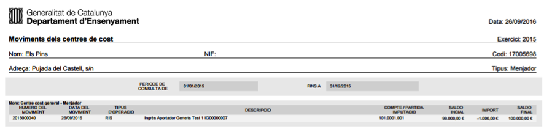

Imatge 65. PDF de la consulta de moviments per centre de cost

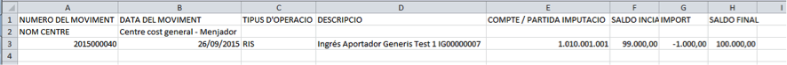

Imatge 66. Excel de la consulta de moviments per centre de cost

---

### 5.2.2.16. Consulta dels saldos de comptes bancaris o caixes d'efectiu

Per accedir a la consulta dels saldos de comptes bancaris o de caixes d’efectiu cal seguir el procediment següent:

* Premeu *Consulta dels saldos de comptes bancaris o de caixes d’efectiu (Imatge 67. Consulta de saldos de comptes bancaris o caixes d'efectiu).*

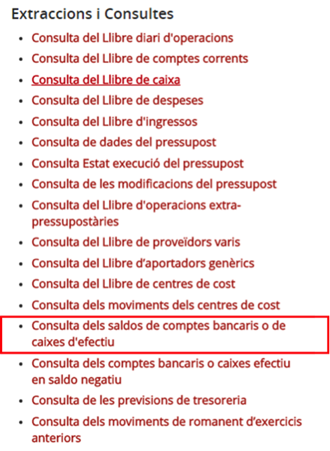

Imatge 67. Consulta de saldos de comptes bancaris o caixes d'efectiu

* Es mostra la pantalla de consulta de saldos de comptes bancaris o caixes d’efectiu (*Imatge 68. Interval de dates de la consulta*) on heu d’introduir la data de la consulta.

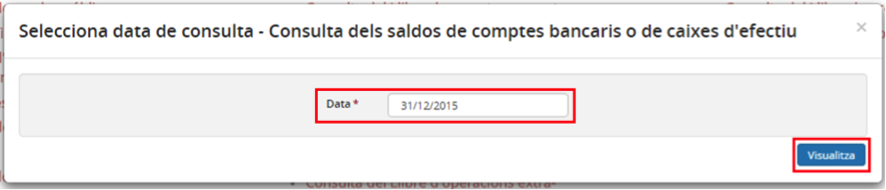

Imatge 68. Interval de dates de la consulta

* Premeu el botó *Visualitza* .

  + Es mostra la pantalla de resultat de la consulta de saldos de comptes bancaris o caixes d’efectiu negatius (*Imatge 69. Resultat de la consulta de saldos de comptes bancaris o caixes d'efectiu*).

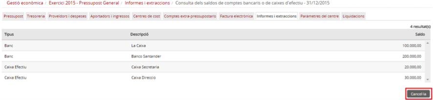

Imatge 69. Resultat de la consulta de saldos de comptes bancaris o caixes d'efectiu

Com es veu a la imatge anterior apareixen columnes amb la informació de detall següent:

* *Tipus*: correspon al tipus de compte (banc o caixa d’afectiu).
* *Descripció*: correspon a la descripció del compte bancari o de caixa d’efectiu.
* *Saldo*: correspon al saldo del compte bancari o de caixa d’efectiu.

Premeu el botó *Cancel·la*  per retornar a la pantalla principal (*Imatge 3. Llista informes i extraccions*).

---

### 5.2.2.17. Consulta dels comptes bancaris o caixes d’efectiu en saldo negatiu

Per accedir a la consulta dels comptes bancaris o de caixes d’efectiu en saldo negatiu cal seguir el procediment següent:

* Premeu *Consulta dels comptes bancaris o de caixes d’efectiu en saldo negatiu (Imatge 69. Consulta dels comptes bancaris o caixes d'efectiu amb saldo negatiu)*.

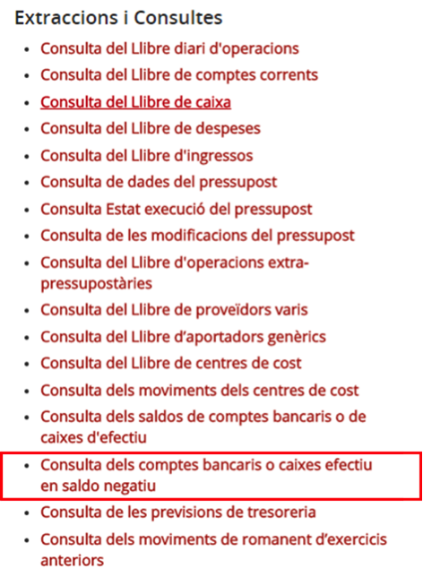

Imatge 70. Consulta dels comptes bancaris o caixes d'efectiu amb saldo negatiu

* Es mostra la pantalla de consulta dels comptes bancaris o caixes d’efectiu en saldo negatiu (*Imatge 71. Interval de la consulta*).

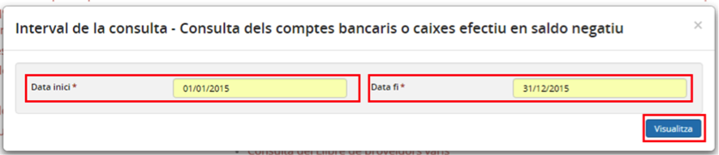

Imatge 71. Interval de la consulta

* Premeu el botó *Visualitza* .

  + Es mostra la pantalla de resultat de la consulta de saldos de comptes bancaris o de caixes d’efectiu negatius (*Imatge 72. Resultat de la consulta de saldos de comptes bancaris o caixes d'efectiu*).

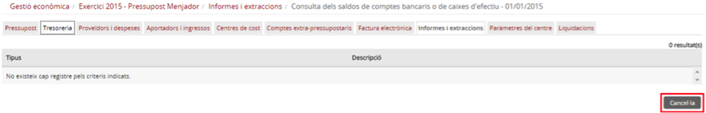

Imatge 72. Resultat de la consulta de saldos de comptes bancaris o caixes d'efectiu

Com es veu a la imatge anterior apareixen columnes amb la informació de detall següent:

* *Tipus*: correspon al tipus de compte (banc o caixa d’afectiu).
* *Descripció*: correspon a la descripció del compte bancari o de caixa d’efectiu.
* *Saldo*: correspon al saldo del compte bancari o de caixa d’efectiu.

Premeu el botó *Cancel·la*  per retornar a la pantalla principal (*Imatge 3. Llista informes i extraccions*).

---

### 5.2.2.18. Consulta de les previsions de tresoreria

La consulta de previsions de tresoreria permet als centres saber com evolucionaran els saldos dels bancs i les caixes d’efectiu en funció dels venciments previstos, per poder detectar problemes de tresoreria que facin que algun dels comptes quedi amb saldo negatiu.

Per accedir a la consulta del Llibre d’aportadors cal seguir el procediment següent:

* Premeu *Consulta de les previsions de tresoreria (Imatge 73. Consulta de les previsions de tresoreria)*.

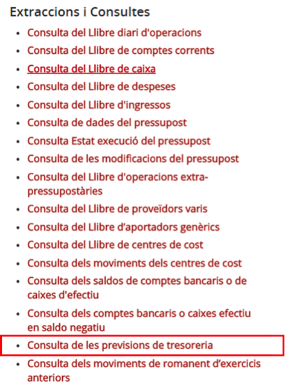

Imatge 70. Consulta dels comptes bancaris o caixes d'efectiu amb saldo negatiu

* Es mostra la pantalla de consulta de les previsions de tresoreria (*Imatge 74. Consulta de les previsions de tresoreria*) on heu d’introduir l’interval de dates de la consulta i seleccionar els comptes bancaris i/o caixes d’efectiu.

  + Podeu seleccionar un o més bancs o caixes.

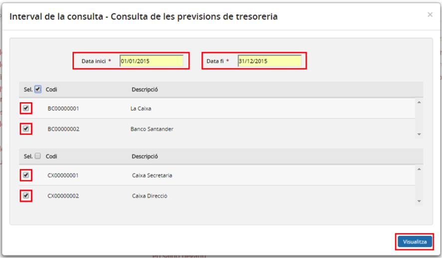

Imatge 74. Consulta de les previsions de tresoreria

* Premeu el botó *Visualitza* .

  + Es mostra la pantalla de resultat de la consulta de previsions de tresoreria (*Imatge 75. Resultat de la consulta de previsions de tresoreria*).

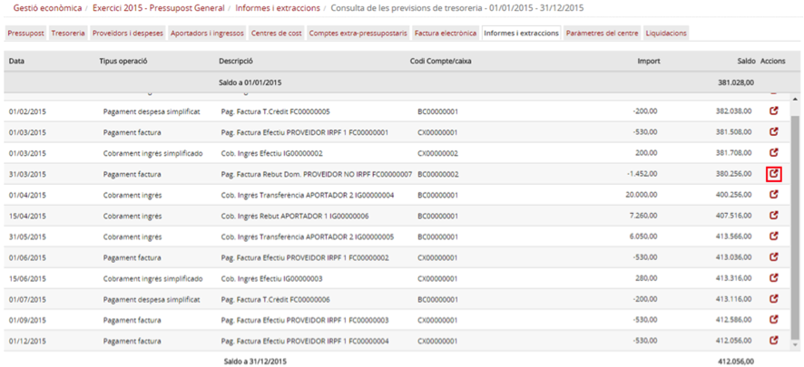

Imatge 75. Resultat de la consulta de previsions de tresoreria

Com es pot veure en la imatge anterior, apareixen columnes amb la informació de detall següent:

* *Data*: correspon a la data del compte bancari / caixa d’efectiu.
* *Tipus d’operació*: correspon al tipus d’operació del compte bancari / caixa d’efectiu.
* *Descripció*: correspon a la descripció de l’operació.
* *Codi*: correspon al codi del compte bancari / caixa d’efectiu.
* *Import*: correspon a l’import de l’operació.
* *Saldo*: correspon al saldo del compte bancari / caixa d’efectiu després de l’operació.

En cas que el saldo d’algun dels comptes sigui negatiu en alguna de les línies, aquest línia es mostrarà en cursiva i en color vermell.

Cada una de les línies de la pantalla de resultat de la consulta té un botó d’acció  que permet consultar com està distribuït el saldo total entre els diferents bancs i caixes d’efectiu (*Imatge 76. Saldos detallats*).

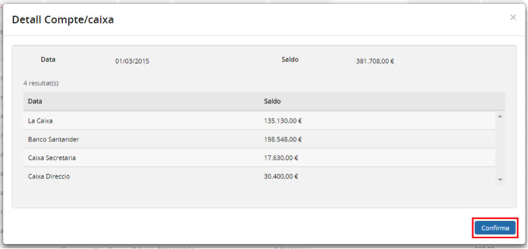

Imatge 76. Saldos detallats

* Premeu el botó *Confirma*  per retornar a la pantalla anterior (Imatge 75. Resultat de la consulta de previsions de tresoreria).

---

### 5.2.2.19. Consulta dels moviments de romanent d’exercicis anteriors

Per accedir a la consulta dels moviments de romanent d’exercicis anteriors cal seguir el procediment següent:

* Premeu Consulta dels moviments de romanent d’exercicis anteriors (*Imatge 71. Consulta dels moviments de romanent d'exercicis anteriors*).

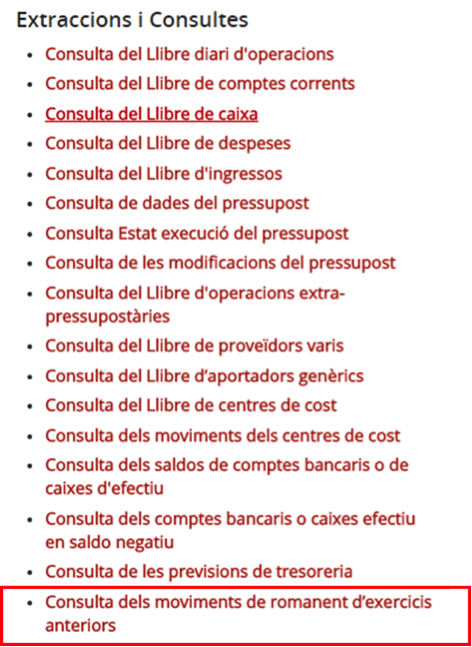

Imatge 71. Consulta dels moviments de romanent d'exercicis anteriors

* Es mostra la pantalla de consulta dels moviments de romanent d’exercicis anteriors (*Imatge 78. Interval de dates de la consulta*) on heu d’introduir l’interval de dates de la consulta.

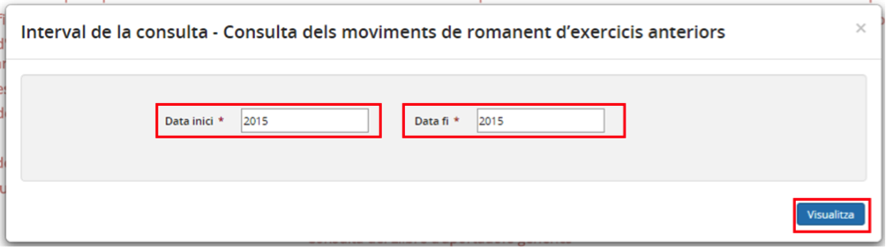

Imatge 78. Interval de dates de la consulta

* Premeu el botó *Visualitza* .

  + Es mostra la pantalla de resultat de la consulta de moviments de romanent d’exercicis anteriors (*Imatge 79. Resultat de la consulta de moviments de romanent d'anys anteriors*)

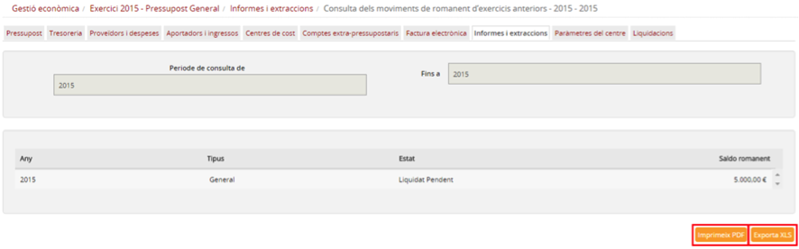

Imatge 79. Resultat de la consulta de moviments de romanent d'anys anteriors

Opcions d’exportació:

* Premeu el botó *Imprimeix*  per exportar a PDF (*Imatge 80. PDF de la consulta de romanent d'exercicis anteriors*).
* Premeu el botó *Exporta CSV*  per exportar a format Excel (*Imatge 81. Excel de la consulta de romanent d'exercicis anteriors*).

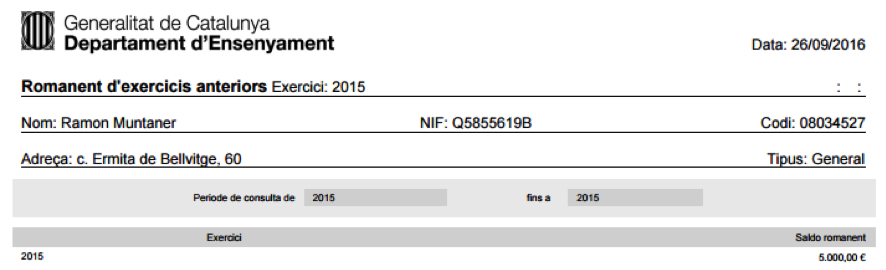

Imatge 80. PDF de la consulta de romanent d'exercicis anteriors

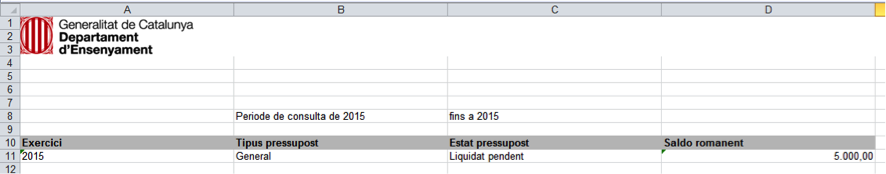

Imatge 81. Excel de la consulta de romanent d'exercicis anteriors