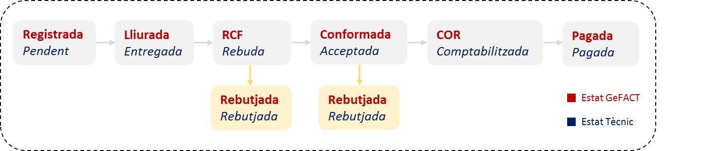

# 6.1 Descripció

La part principal de la gestió de la despesa d’Esfer@ és la imputació de factures (i abonaments). La legislació actual de l’Agència Tributària permet i regula l’enviament de factures amb format electrònic, el què es coneix com a **Factura electrònica**.

Per tal de facilitar la gestió de les factures electròniques, la Generalitat de Catalunya ha desenvolupat el servei **e.Fact** que permet l’intercanvi de factures electròniques entre els proveïdors i les administracions públiques catalanes:

* Actua com a **punt d’entrada on els proveïdors** han d’enviar les seves factures electròniques.
* Actua com a **punt de lliurament on les administracions públiques** accedeixen per recuperar les seves factures electròniques.

El cicle que segueixen les factures electròniques des de que són enviades pel proveïdor és el següent:

Imatge 1. Cicle d'una factura electrònica

Esfer@ permet la recepció i registres (o rebuig, si s’escau) de les factures electròniques dels centres.

El sistema s’encarrega de fer automàticament la recepció i la primera validació formal de les factures. Una vegada s’ha passat aquesta primera validació formal de la factura electrònica, la factura passa a estar disponible dins de la llista de factures electròniques pendents de registrar.

A continuació es mostra com els usuaris dels centres (Directors i Usuaris de Gestió Econòmica) poden registrar les factures electròniques que rebi el centre.