# 6.2 Contingut pas a pas

* [6.2.1 Accés](ap62.md#621-acces)
* [6.2.2 Pantalla de factures electròniques pendents](ap62.md#622-pantalla-de-factures-electroniques-pendents)
* [6.2.3 Tramitació d’una factura electrònica](ap62.md#623-tramitacio-duna-factura-electronica)
* [6.2.4 Registrar la factura electrònica](ap62.md#624-registrar-la-factura-electronica)

## 6.2.1. Descripció

Des de la pàgina principal d’Esfer@ cal anar al mòdul de Gestió econòmica.

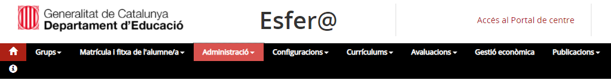

Imatge 1. Pantalla inicial d’Esfer@

Una vegada s’accedeix al mòdul de Gestió econòmica apareixerà la llista de pressupostos que té el centre, amb les columnes següents:

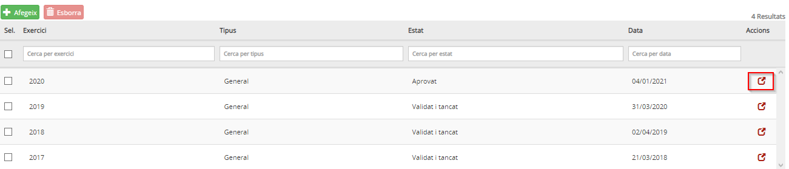

Imatge 2. Llista pressupostos

La informació de les columnes és la següent:

* **Exercici**: exercici fiscal (any) al qual pertany el pressupost.
* **Estat**: estat en el qual es troba el pressupost. Per obtenir la informació detallada sobre els estats del pressupost, cal consultar els continguts específics d’**Evolució del pressupost**.
* **Data**: data en la qual hi va haver l’últim canvi d’estat del pressupost.
* **Tipus**: tipus de pressupost.

  + **General**.
  + **Menjador**.
* **Botó d’acció** : permet accedir al detall del pressupost i permet detallar la dotació.

A la capçalera de les columnes apareix el nom del camp corresponent. A sota, hi ha uns espais per poder aplicar filtres sobre la informació de detall.
Cal prémer el botó d’acció  per entrar en el detall del pressupost que es vol editar i evolucionar.

En cas que el centre tingui factures electròniques pendents de registrar per a l’any del pressupost, apareixerà un missatge a l’usuari/ària:

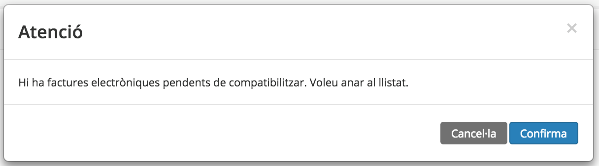

Imatge 3. Missatge de factures electròniques pendents

En cas que l’usuari/ària confirmi, es mostra la pantalla de factures electròniques pendents.

## 6.2.2 Pantalla de factures electròniques pendents

Per accedir a la pantalla de factures electròniques pendents de registrar, l’usuari/ària ha d’accedir a la pestanya **Factura electrònica**:

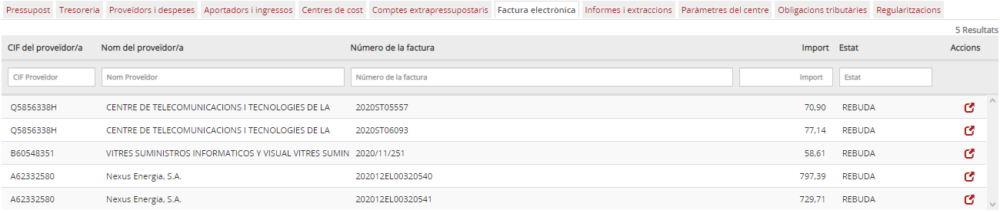

Imatge 4. Pantalla de factures electròniques pendents

En aquesta pantalla es mostra una llista de totes les factures electròniques pendents corresponents a l’any del pressupost.
La llista té les següents columnes:

* **CIF Proveïdor**: CIF del proveïdor de la factura electrònica.
* **Nom Proveïdor**: Nom del proveïdor de la factura electrònica.
* **Número de factura**: Número de factura (correspon amb el camp número de document extern de la pantalla de registre de factures).
* **Import**: Import total de la factura (inclosos els impostos).
* **Estat**: Estat de la factura electrònica.
* **Botó d’acció** : permet consultar el detall de la factura electrònica, iniciar el procés de registre o rebutjar-la.

Tots aquests camps són ordenables (fent clic al títol de la columna) i filtrables (mitjançant les caixes que hi ha a la capçalera).

## 6.2.3 Tramitació d’una factura electrònica

Una factura electrònica es pot **rebutjar** (en cas que el centre no la reconegui com a pròpia) o **iniciar-ne el registre** (en cas que el centre reconegui la factura com a pròpia).

Per poder iniciar la tramitació de la factura electrònica cal prémer el botó d’acció  des de la pantalla de **llista de factures electròniques pendents** (*Imatge 4. Pantalla de factures electròniques pendents*).
Es mostra la pantalla de detall de la factura electrònica:

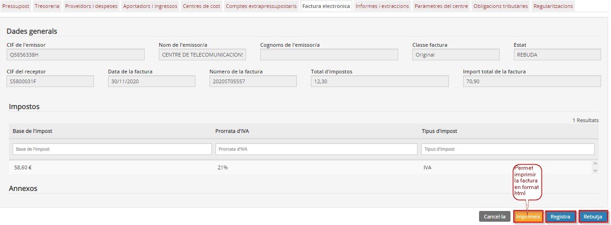

Imatge 5. Pantalla de detall de la factura electrònica

En aquesta pantalla es mostren les següents dades. En la capçalera:

* **CIF emissor**: CIF de l’emissor de la factura.
* **Nom emissor**: nom de l’emissor de la factura.
* **Classe factura**: tipus de factura electrònica (original, original rectificativa, original recapitulativa…).
* **Estat**: Estat de la factura electrònica *([Imatge 1. Cicle d'una factura electrònica](ap61.md))*. En aquesta pantalla les factures haurien d’estar en estat **Acceptada**.
* **CIF receptor**: CIF del receptor. Ha de coincidir amb el del centre.
* **Data factura**: data de la factura.
* **Número de factura**: número de la factura (correspon amb el camp número de document extern de la pantalla de registre de factures).
* **Base imposable**: base imposable de la factura.
* **Import total factura**: import total de la factura inclosos els impostos.

Després de la capçalera es mostra una taula amb el desglossament d’impostos amb les següents columnes:

* **Base impost**: base imposable per a aquest tipus d’impost.
* **Percentatge impost**: percentatge de l’impost que s’aplica.
* **Tipus impost**: nom de l’impost. Típicament IVA, tot i que poden ser altres impostos depenent de la residència fiscal del proveïdor (per exemple IGIC si és de les Illes Canàries).

Si es punxa el botó **Imprimeix ** es mostra tot el detall i annexos de la factura, en format html, ja que és la visualització que ofereix el sistema e.Fact. Aquest document té diverses pàgines:

* Dades generals de la factura.
* Detall de línies de la factura.
* Altres dades de la factura.
* Dades de l’emissor.
* Dades del receptor.
* …

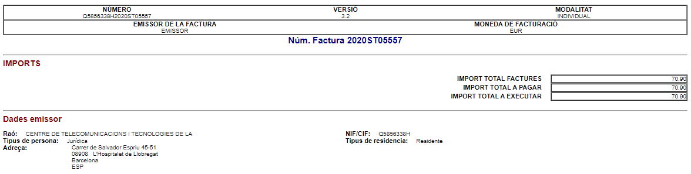

Imatge 6. Document html de suport de la factura electrònica (annex)

L’usuari té dues opcions:

* **Rebutjar la factura**.

  + Prémer el botó **Rebutja**  .
  + L’usuari ha d’introduir el motiu del rebuig:

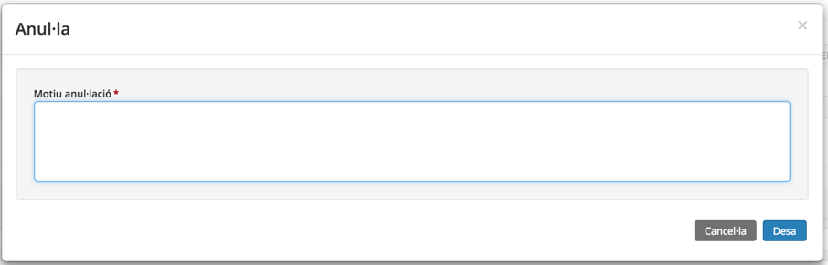

Imatge 7. Motiu rebuig

* Prémer el botó **Desa**  .
* Es passa la factura a l’estat **Rebutjada**. Es torna a la pantalla de llista de factures electròniques pendents (Imatge 4. Pantalla de factures electròniques pendents) on ja no apareix la factura rebutjada.
* Si es prem el botó **Cancel·la**  es torna a la pantalla de detall de la factura (Imatge 5. Pantalla de detall de la factura electrònica).

* **Registrar la factura**.

  + Prémer el botó **Registra **  .

    - S’inicia el procés de registre de la factura electrònica *(veure [6.2.4 Registrar la factura electrònica](ap62.md#624-registrar-la-factura-electronica))*.

## 6.2.4 Registrar la factura electrònica

El procés de registre de la factura electrònica s’inicia quan l’usuari/ària prem el botó **Registra ** en la pantalla de detall de la factura electrònica.

El **procés de registre** de la factura és el següent:

* **El programa valida que el proveïdor que envia la factura existeixi en el centre.**

  + **En cas que el proveïdor no existeixi** es sol·licita a l’usuari/ària confirmació per iniciar el registre del proveïdor:

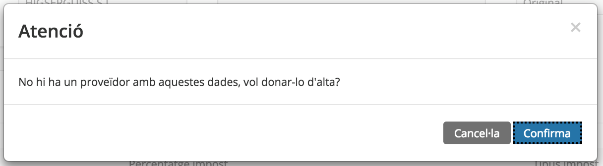

Imatge 8. Proveïdor no existeix

* En **cas que l’usuari** **cancel·li**, es **torna a la pantalla de detall** de la factura electrònica *(Imatge 5. Pantalla de detall de la factura electrònica)*.
* Si **l’usuari confirma, s’obre la pantalla de registre del nou proveïdor** *(Imatge 9. Nou proveïdor de factura electrònica).*
* En aquesta pantalla, les dades conegudes del proveïdor que s’obtenen a partir de la factura electrònica (NIF i nom) estan bloquejats.

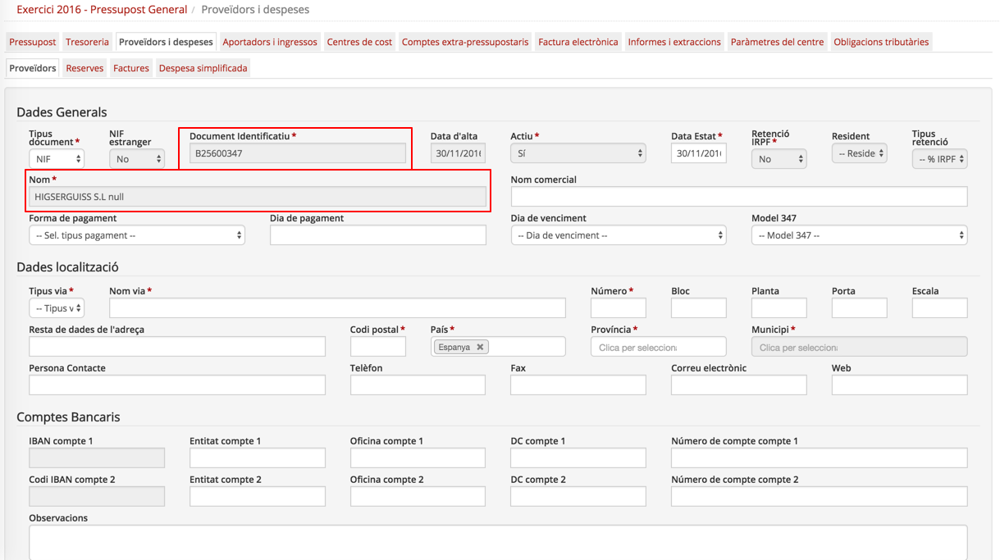

Imatge 9. Nou proveïdor de factura electrònica

* Una vegada s’han introduït totes les dades del proveïdor, es prem el botó **Desa**  .
* El programa va a la pantalla de llista de proveïdors on ja apareix el proveïdor registrat *(Imatge 10. Pantalla llista de proveïdors).*
* L’usuari haurà de tornar a la pantalla de llista de factures electròniques *(Imatge 4. Pantalla de factures electròniques pendents)* pendents per iniciar de nou el registre de la factura.

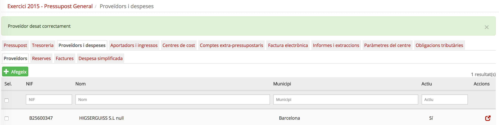

Imatge 10. Pantalla llista de proveïdors

* Si quan es prem el botó **Registra**  **el proveïdor ja existeix, es mostra la pantalla de registre de factures** *(Imatge 11. Pantalla de registre de factures)*. El funcionament d’aquesta pantalla és el mateix que el de registre de factures no electròniques llevat dels camps següents que estan bloquejats perquè vénen directament de la factura electrònica:

  + **Proveïdor**: número de proveïdor. Això també determina els camps de la secció Proveïdor seleccionat (Nom proveïdor, NIF, Adreça).
  + **Import Total Factura**: import total de la factura electrònica.
  + **Núm Document**: número que figura a la factura electrònica.
  + **Data Document**: data que figura a la factura electrònica.

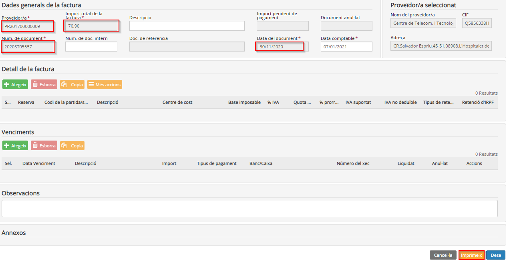

Imatge 11. Pantalla de registre de factures

* Per **facilitar el registre** de la factura, al peu de la factura apareix el botó **Imprimeix** . En clicar es mostra el detall i annexos de la factura tal com es mostrava anteriorment, a la *Imatge 6. Document html de suport de la factura electrònica (annex).*
* L’usuari ha de completar la informació de la factura seguint el mateix procediment del registre d’una factura no electrònica *(Imatge 12. Detall factura electrònica)*:

  + **Secció Detall factura**: s’ha de detallar a quines reserves, partides (o subpartides) o comptes extra-pressupostaris s’imputa la factura.
  + **Venciments**: s’ha de detallar com es farà el pagament de la factura.

Les validacions dels imports són les mateixes que es fan per a una factura no electrònica.

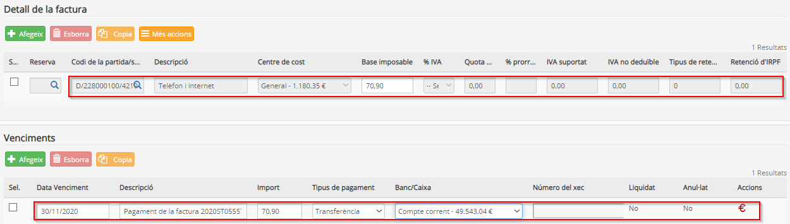

Imatge 12. Detall factura electrònica

* Quan es prem el botó **Desa** , es fan les mateixes validacions que es fan al registrar una factura no electrònica. A aquestes validacions s’hi afegeixen altres validacions específiques per les factures electròniques:

  + En cas que el centre faci **liquidacions d’IVA**, també es valida que les totalitzacions per tipus d’IVA del detall de la factura *(Imatge 13. Resum de bases i impostos)* coincideixin amb les quantitats detallades en la capçalera de la factura electrònica (i que es pot consultar en l’arxiu html de la factura electrònica).
  + En cas que el **proveïdor liquidi IRPF**, també es valida que les totalitzacions d’IRPF coincideixin amb les quantitats detallades a la capçalera de la factura electrònica (i que es pot consultar en l’arxiu html de la factura electrònica).

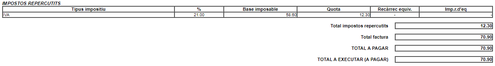

Imatge 13. Resum de bases i impostos

* Una vegada que s’ha registrat la factura, es passa a la pantalla de llista de factures registrades *(Imatge 14. Pantalla de llista de factures registrades)* on ja apareix la factura electrònica que acabem de registrar.

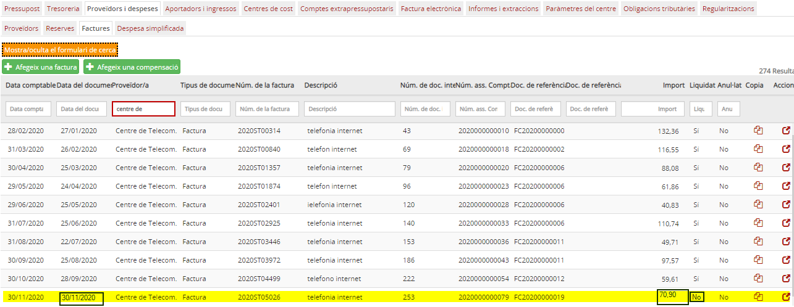

Imatge 14. Pantalla de llista de factures registrades

