# 7.1 Gestió de paràmetres del centre

* [7.1.1. Descripció](ap71.md#711-descripcio)
* [7.1.2. Gestió dels paràmetres de centre](ap71.md#712-gestio-dels-parametres-de-centre)

  + [7.1.2.1. Accés](ap71.md#7121-acces)
  + [7.1.2.2. Llista de paràmetres](ap71.md#7122-llista-de-parametres)
  + [7.1.2.3. Mostrar assentaments anul·lats](ap71.md#7123-mostrar-assentaments-anullats)
  + [7.1.2.4. Mostrar partides sense import](ap71.md#7124-mostrar-partides-sense-import)
  + [7.1.2.5. Centre amb liquidació d’IVA](ap71.md#7125-centre-amb-liquidacio-diva)
  + [7.1.2.6. Tipus de prorrata](ap71.md#7126-tipus-de-prorrata)
  + [7.1.2.7. Nom i codi del centre com a titular del compte bancari](ap71.md#7127-nom-i-codi-del-centre-com-a-titular-del-compte-bancari)
  + [7.1.2.8. Treballar amb centres de cost](ap71.md#7128-treballar-amb-centres-de-cost)
  + [7.1.2.9. Data d’inici d’activitat](ap71.md#7129-data-dinici-dactivitat)
  + [7.1.2.10. Percentatge de prorrata](ap71.md#71210-percentatge-de-prorrata)

---

## 7.1.1. Descripció

El comportament d’Esfer@ no és uniforme per a tots els centres i el seu funcionament s’adapta a les necessitats del centre en funció d’uns determinats paràmetres que el centre controla i pot canviar segons li convingui.

En aquest contingut es mostrarà els diferents paràmetres i les modificacions que hi pot aplicar el director/usuari del mòdul de *Gestió econòmica* d’un centre educatiu.

La gestió dels paràmetres del centre de l’exercici actual són d’ús exclusiu del director/usuari.

---


## 7.1.2. Gestió dels paràmetres de centre

### 7.1.2.1. Accés

Des de la pàgina principal d’Esfer@ cal anar al mòdul de *Gestió econòmica*.


Imatge 1. Pantalla inicial d’Esfer@

Una vegada s’ha accedit al mòdul de Gestió econòmica apareix a sota un nou menú amb les opcions dels pressupostos vigents. Seleccioneu un pressupost i trieu la pestanya Paràmetres del centre (Imatge 2. Estructura de pestanyes del director de centre).

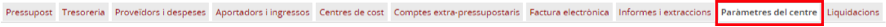

Imatge 2. Estructura de pestanyes del director de centre

Un cop s’ha triat aquesta opció, la llista de paràmetres del centre (*Imatge 3. Llista de paràmetres del centre*).

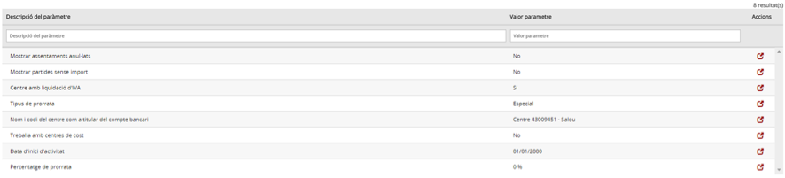

Imatge 3. Llista de paràmetres del centre

---


### 7.1.2.2. Llista de paràmetres

Per cada un dels paràmetres de la llista (*Imatge 3. Llista de paràmetres del centre*) es mostra la informació següent:

* *Descripció del paràmetre*: correspon a la descripció del paràmetre
* *Valor del paràmetre*: correspon al valor del paràmetre
* Botó d’acció  per editar el valor del paràmetre.

A sota, hi ha uns espais per poder aplicar filtres sobre la informació de detall

---


### 7.1.2.3. Mostrar assentaments anul·lats

Aquest paràmetre determina si en les diferents pantalles del mòdul de *Gestió econòmica* d’Esfer@ es mostraran o no els assentaments anul·lats.

Per accedir al paràmetre d’assentaments anul·lats cal seguir el següent procediment:

* Premeu el botó d’acció  del paràmetre d’assentaments anul·lats (*Imatge 4. Assentaments anul·lats*).

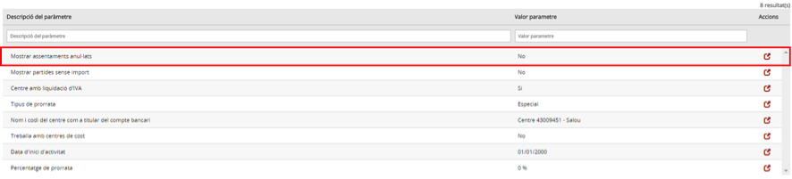

Imatge 4. Assentaments anul·lats

* Es mostra una pantalla on es pot modificar el valor del paràmetre (*Imatge 5. Modificació paràmetre assentaments anul·lats*).

  + Opcions:

    - *Sí*: es mostren els assentaments anul·lats.
    - *No*: no es mostren els assentaments anul·lats.

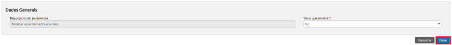

Imatge 5. Modificació paràmetre assentaments anul·lats

* Premeu el botó *Desa* .

  + Es desen les modificacions
  + Si premeu el botó *Cancel·la*  no es desen els canvis.
* Es torna a la pantalla de paràmetres del centre (*Imatge 3. Llista de paràmetres del centre*).

---


### 7.1.2.4. Mostrar partides sense import

Aquest paràmetre determina si en les diferents pantalles del mòdul de *Gestió econòmica* d’Esfer@ es mostraran o no les partides que no tinguin cap import assignat.

Per accedir al paràmetre de partides sense import cal seguir el següent procediment:

```
* Premeu el botó d’acció {{:esfera:mge1:bloc1:btn-accio.png|}} del paràmetre partides sense import (//Imatge 6. Partides sense import//).
```

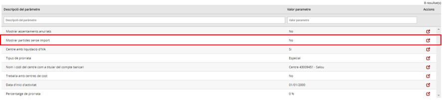

Imatge 6. Partides sense import

* Es mostra la pantalla d’edició del paràmetre (*Imatge 7. Modificació del paràmetre de partides sense import*):


Imatge 7. Modificació del paràmetre de partides sense import

* Premeu el botó *Desa* 

  + Es desen les modificacions.
  + Si premeu el botó *Cancel·la* , no es desen els canvis.
* Es torna a la pantalla de paràmetres del centre (*Imatge 3. Llista de paràmetres del centre*).

---


### 7.1.2.5. Centre amb liquidació d’IVA

Aquest paràmetre determina si el centre fa liquidacions d’IVA. Això té efecte, sobre tot, a les pantalles d’ingrés i de factura on s’habiliten els camps corresponents a l’IVA i també en la pestanya de *Liquidacions* des d’on es pot accedir a les liquidacions específiques de l’IVA.

Per accedir al paràmetre de centre amb liquidació d’IVA cal seguir el següent procediment:

* Premeu el botó d’acció  del paràmetre *Centre amb liquidació d’IVA* (*Imatge 8. Centre amb liquidació d'IVA*).

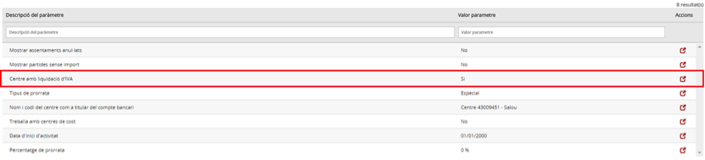

Imatge 8. Centre amb liquidació d'IVA

* Es mostra la pantalla on es pot modificar el valor del paràmetre (*Imatge 9. Modificació del paràmetre de liquidació d'IVA*).

  + Opcions:

    - *Sí*: el centre fa liquidacions d’IVA.
    - *No*: el centre no fa liquidacions d’IVA.


Imatge 9. Modificació del paràmetre de liquidació d'IVA

* Premeu el botó *Desa* 

  + Es desen les modificacions.
  + Si premeu el botó *Cancel·la* , no es desen els canvis.
* Es torna a la pantalla de paràmetres del centre (*Imatge 3. Llista de paràmetres del centre*).

---


### 7.1.2.6. Tipus de prorrata

En cas que el centre faci liquidacions d’IVA, aquest paràmetre determina el tipus de prorrata que s’aplica a l’IVA suportat.

Per accedir al paràmetre tipus de prorrata cal seguir el següent procediment:

* Premeu el botó d’acció  del paràmetre Tipus de prorrata (*Imatge 10. Tipus de prorrata*).

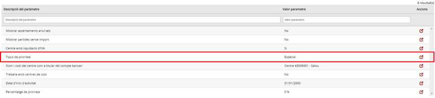

Imatge 10. Tipus de prorrata

* Es mostra una pantalla on es pot modificar el valor del paràmetre (Imatge 11. Modificació paràmetre Tipus de prorrata).

  + *Opcions*:

    - General: prorrata general.
    - *Especial*: prorrata especial.

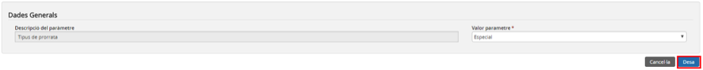

Imatge 11. Modificació paràmetre Tipus de prorrata

* Premeu el botó *Desa* 

  + Es desen les modificacions.
  + Si premeu el botó *Cancel·la* , no es desen els canvis.
* Es torna a la pantalla de paràmetres del centre (*Imatge 3. Llista de paràmetres del centre*).

---


### 7.1.2.7. Nom i codi del centre com a titular del compte bancari

Aquest paràmetre determina el nom i el codi de centre que apareixerà per defecte com a titular dels comptes bancaris.

Per accedir al paràmetre nom i codi del centre com a titular del compte bancari cal seguir el següent procediment:

* Premeu el botó d’acció  del paràmetre *Nom i codi del centre com a titular del compte bancari (Imatge 12. Nom i codi de centre)*.

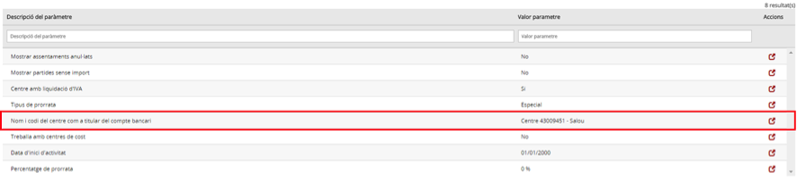

Imatge 12. Nom i codi de centre

* Es mostra una pantalla on es pot modificar el valor del paràmetre (*Imatge 13. Modificació del paràmetre del nom i codi del centre*).

  + Opcions: text lliure.

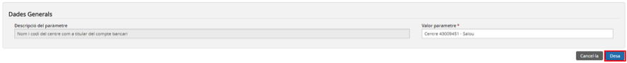

Imatge 13. Modificació del paràmetre del nom i codi del centre

* Premeu el botó *Desa* 

  + Es desen les modificacions.
  + Si premeu el botó *Cancel·la* , no es desen els canvis.
* Es torna a la pantalla de paràmetres del centre (*Imatge 3. Llista de paràmetres del centre*).

---


### 7.1.2.8. Treballar amb centres de cost

Aquest centre determina si el centre treballa amb múltiples centres de cost o no (només el General) tant en la dotació del pressupost com en la imputació dels ingressos i les despeses.

Per accedir al paràmetre treballa amb centres de cost cal seguir el següent procediment:

* Premeu el botó d’acció  del paràmetre Treballa amb centres de cost (*Imatge 14. Treballa amb centres de cost*).

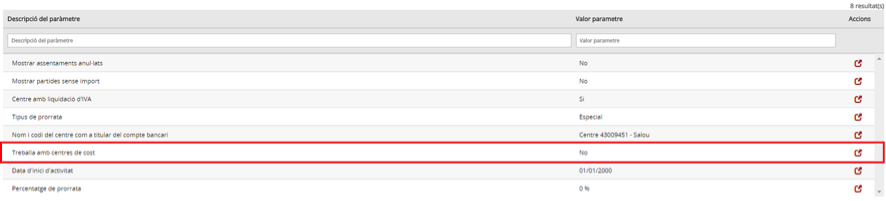

Imatge 14. Treballa amb centres de cost

* Es mostra una pantalla on es pot modificar el valor del paràmetre (*Imatge 15. Modificació del paràmetre Treballa amb centres de cost*).

  + Opcions:

    - *Sí*: el centre pot treballar amb múltiples centres de cost.
    - *No*: el centre només treballa amb el centre de cost *General*.

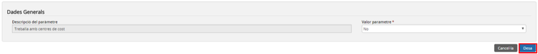

Imatge 15. Modificació del paràmetre Treballa amb centres de cost

* Premeu el botó *Desa* 

  + Es desen les modificacions.
  + Si premeu el botó *Cancel·la* , no es desen els canvis.
* Es torna a la pantalla de paràmetres del centre (*Imatge 3. Llista de paràmetres del centre*).

---


### 7.1.2.9. Data d’inici d’activitat

Aquest paràmetre estableix la data d’inici d’activitat del centre dins d’Esfer@. Aquesta data es fa servir per diversos càlculs i validacions, sobre tot les que fan referència al funcionament específic del primer any d’Esfer@.

Per accedir al paràmetre data d’inici d’activitat cal seguir el següent procediment:

* Premeu el botó d’acció  del paràmetre *Data d’inici d’activitat (Imatge 16. Data d'inici d'activitat)*.

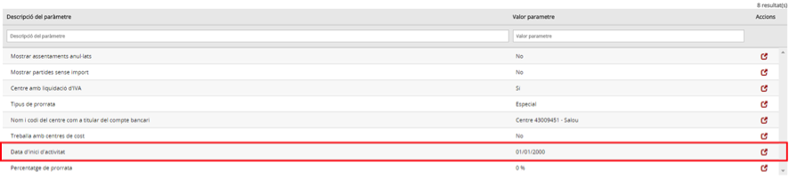

Imatge 16. Data d'inici d'activitat

* Es mostra una pantalla on es pot modificar el valor del paràmetre (*Imatge 17. Modificació del paràmetre Data d'inici d'activitat*).

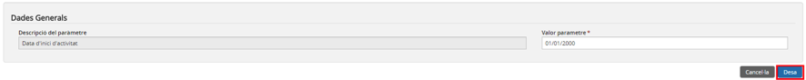

Imatge 17. Modificació del paràmetre Data d'inici d'activitat

* Premeu el botó *Desa* 

  + Es desen les modificacions.
  + Si premeu el botó *Cancel·la* , no es desen els canvis.
* Es torna a la pantalla de paràmetres del centre (*Imatge 3. Llista de paràmetres del centre*).

---


### 7.1.2.10. Percentatge de prorrata

En cas que el centre faci liquidacions d’IVA i tingui prorrata general, aquest paràmetre determina el valor prorrata que s’aplicarà sobre l’IVA suportat en la imputació de factures.

Per accedir al paràmetre percentatge de prorrata cal seguir el següent procediment:

* Premeu el botó d’acció  del paràmetre percentatge de prorrata (*Imatge 18. Percentatge de prorrata*).

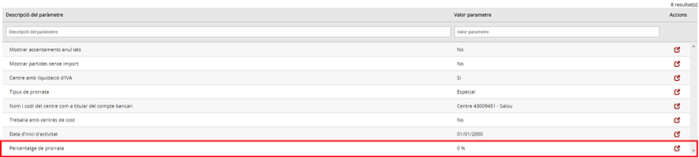

Imatge 18. Percentatge de prorrata

* Es mostra una pantalla on es pot modificar el valor del paràmetre (Imatge 19. Modificació del paràmetre Percentatge de prorrata).


Imatge 19. Modificació del paràmetre Percentatge de prorrata

* Premeu el botó *Desa* 

  + Es desen les modificacions.
  + Si premeu el botó *Cancel·la* , no es desen els canvis.
* Es torna a la pantalla de paràmetres del centre (*Imatge 3. Llista de paràmetres del centre*).