# 8.1. Gestió de l’estructura base del pressupost

* [8.1.1. Descripció](ap81.md#811-descripcio)
* [8.1.2. Contingut pas a pas](ap81.md#812-contingut-pas-a-pas)

  + [8.1.2.1. Accés](ap81.md#8121-acces)
  + [8.1.2.2. Dades de l’estructura base](ap81.md#8122-dades-de-lestructura-base)
  + [8.1.2.3. Afegir partides o subpartides a l’estructura base](ap81.md#8123-afegir-partides-o-subpartides-a-lestructura-base)

    - [8.1.2.3.1. Afegir una partida](ap81.md#81231-afegir-una-partida)
    - [8.1.2.3.2. Afegir una subpartida](ap81.md#81232-afegir-una-subpartida)
  + [8.1.2.4. Eliminar partides o subpartides de l’estructura base](ap81.md#8124-eliminar-partides-o-subpartides-de-lestructura-base)
  + [8.1.2.5. Modificar partides o subpartides de l’estructura base](ap81.md#8125-modificar-partides-o-subpartides-de-lestructura-base)
  + [8.1.2.6. Copiar l’estructura base del pressupost](ap81.md#8126-copiar-lestructura-base-del-pressupost)
  + [8.1.2.7. Publicar l’estructura base del pressupost](ap81.md#8127-publicar-lestructura-base-del-pressupost)

---

## 8.1.1. Descripció

En aquest contingut es mostra com donar d’alta i gestionar l’estructura base del pressupost d’un centre educatiu per part de l’administrador del mòdul de Gestió econòmica.

Per tal que tots els centres tinguin pressupostos homogenis i normalitzats, l’administrador de la gestió econòmica ha de definir l’estructura base del pressupost que compartiran tots els centres.

L’estructura base del pressupost garanteix que quan els centres donin d’alta un nou pressupost aquest tingui, com a mínim, totes les partides d’ingrés i despesa que hi ha definides en aquesta estructura base.

La gestió de l’estructura base del pressupost és una funcionalitat d’ús exclusiu de l’administrador de la gestió econòmica.

---

## 8.1.2. Contingut pas a pas

### 8.1.2.1. Accés

Des de la pàgina principal d’Esfer@ cal anar al mòdul de *Gestió econòmica*.

Imatge 1. Pantalla inicial d’Esfer@

Una vegada s’hagi accedit al mòdul de Gestió econòmica apareix a sota un nou menú amb les opcions de Gestió econòmica. Trieu la pestanya *Estructura base del pressupost*. (Vegeu *Imatge 2*).

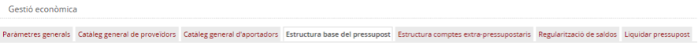

Imatge 2. Estructura de pestanyes de l’administrador

Un cop s’ha seleccionat aquesta opció, apareix per defecte l’estructura base definida pel pressupost de l’exercici fiscal més recent (Vegeu *Imatge 3*).

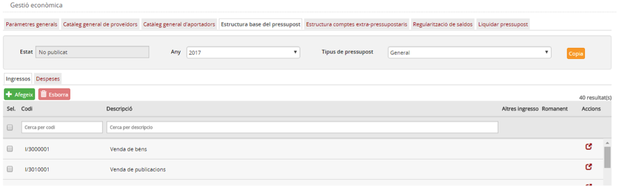

Imatge 3. Estructura base del pressupost

---

### 8.1.2.2. Dades de l’estructura base

Dins la pantalla de l’estructura base del pressupost (*Imatge 3. Estructura base del pressupost*) apareix una informació de capçalera i dues pestanyes, corresponents a la informació detallada, per a ingressos i per a despeses. La informació de capçalera és la següent:

* *Estat*: Estat de publicació de l’estructura base:

  + *No publicat* (valor per defecte).
  + *Publicat*.
* *Any*: Any de vigència de l’estructura base del pressupost visualitzada.
* *Tipus del pressupost*:

  + *General*.
  + *Menjador*.
* *Copia*: Botó d’acció que permet copiar l’estructura visualitzada en la d’un nou exercici.

A sota es poden seleccionar dues pestanyes per veure la informació de detall:

* *Ingressos*: partides i subpartides d’ingrés.
* *Despeses*: partides i subpartides de despesa.

Per defecte apareix la informació corresponent a ingressos, tal com es veu a la *Imatge 4. Partides d’ingrés*.

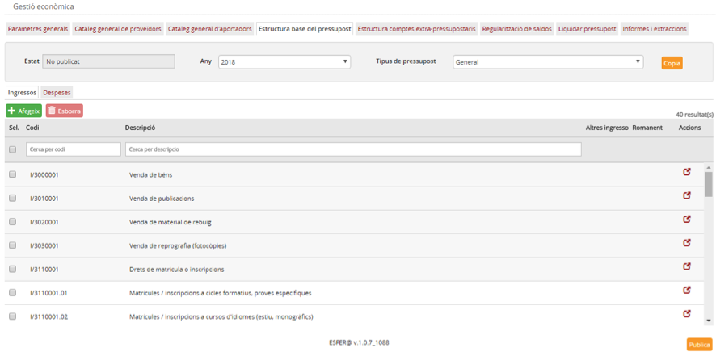

Imatge 4. Partides d’ingrés

A la pestanya d’ingressos (*Imatge 4. Partides d’ingrés*) apareixen tot un seguit de columnes amb la informació de detall següent:

* Codi (correspon al codi de la partida)
* Descripció (correspon a la descripció de la partida)

I uns camps corresponents a propietats pròpies de les partides i subpartides d’ingrés:

* *Altres ingressos*: identifica la partida específica per a *Altres ingressos*, utilitzada per a les regularitzacions de venciments (de despeses que no es pagaran).
* *Romanent*: identifica la partida d’ingrés corresponent al *Romanent*.

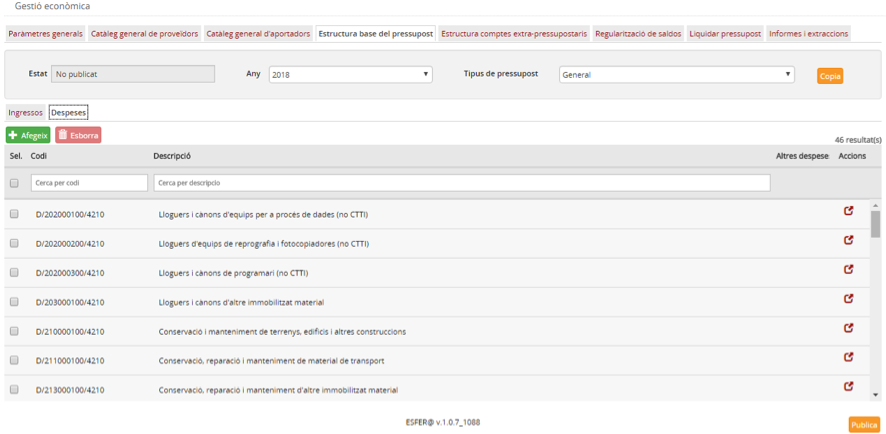

Imatge 5. Partides de despesa

A la pestanya de despeses (*Imatge 5. Partides de despesa*) apareix la informació de codi i descripció, com en el cas dels ingressos, i a més es mostren les següents propietats pròpies de les partides i subpartides de despesa:

* *Altres despese*s: identifica la partida específica per a *Altres despeses*, utilitzada per a les regularitzacions de venciments (d’ingressos que no es cobraran).

A la capçalera de les pantalles de detall apareix el nom del camp. A sota, hi ha uns espais per poder aplicar filtres sobre la informació de detall.

Totes les partides o subpartides tenen el botó d’acció  per editar-les. Aquest botó romandrà ocult en cas que l’estructura base del pressupost estigui en estat *Publicat*.

Des d’aquesta pantalla es poden fer les accions d’afegir, modificar o esborrar partides o subpartides a l’estructura base.

---

### 8.1.2.3. Afegir partides o subpartides a l’estructura base

#### 8.1.2.3.1. Afegir una partida

Per afegir una nova partida a l’estructura base del pressupost cal seguir el procediment següent:

* Trieu la pestanya d’*Ingressos* o *Despeses* segons el tipus de partida que vulgueu afegir.
* Premeu el botó *Afegeix*  (*Imatge 6. Afegir partida*).

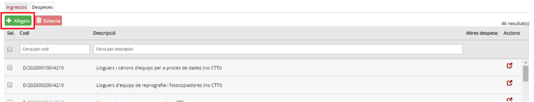

Imatge 6. Afegir partida

* Es mostra la pantalla per afegir la partida.

  + En cas que es tracti d’una partida d’ingrés es mostrarà la pantalla per afegir una partida d’ingrés (*Imatge 7. Pantalla de nova partida d’ingrés*).

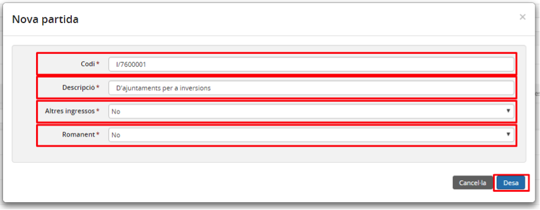

Imatge 7. Pantalla de nova partida d’ingrés

* En cas que es tracti d’una partida de despesa es mostrarà el diàleg per afegir una partida de despesa (*Imatge 8. Pantalla de nova partida de despesa*).

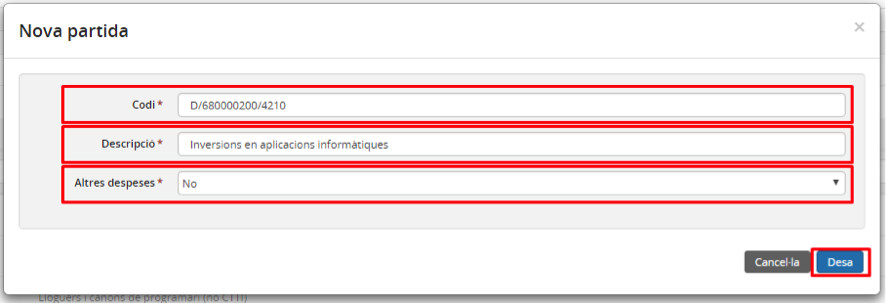

Imatge 8. Pantalla de nova partida de despesa

* Empleneu tots els camps obligatoris de la pantalla (els que porten l’asterisc al costat):

  + *Codi*: codi de la partida. Valor alfanumèric que ha de ser únic (no hi pot haver cap altra partida amb el mateix codi).
  + *Descripció*: descripció de la partida.
  + *Altres ingressos o Altres despeses*: selecció de si la partida correspon a Altres ingressos (a la pantalla de partida d’ingrés) o a Altres despeses (a la pantalla de partida de despesa). Només hi pot haver definida una única partida d’ingrés del tipus Altres ingressos i una única partida de despesa del tipus Altres despeses. En cas que ja n’hi hagi una i en definim una de nova, l’anterior deixa de ser-ho automàticament.
  + *Romanent* (només partides d’ingrés): selecció de si la partida d’ingrés correspon al Romanent. Només hi pot haver definida una única partida d’ingrés de Romanent. En cas que ja n’hi hagi una i en definim una de nova, l’anterior deixa de ser-ho automàticament.
* Premeu el botó *Desa* : es desa la nova partida i es torna a la pantalla de l’estructura base del pressupost (Imatge 3. Estructura base del pressupost) on ja apareix la nova partida creada.
* Si premeu el botó *Cancel·la* 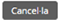, no es desen els canvis.

---

#### 8.1.2.3.2. Afegir una subpartida

Per afegir una nova subpartida a l’estructura base del pressupost cal seguir el procediment següent:

* Des de la pantalla inicial d’Estructura base del pressupost (figura 3), trieu la pestanya d’*Ingressos* o *Despeses* segons el tipus de subpartida que vulgueu afegir.
* Seleccioneu la partida per a la qual voleu crear una subpartida (clicant la marca a l’esquerra de la fila).
* Premeu el botó *Afegeix*  (*Imatge 9. Afegir nova subpartida*).

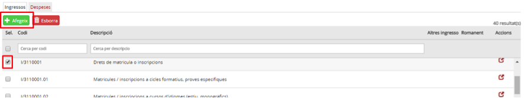

Imatge 9. Afegir nova subpartida

* Es mostra un quadre de diàleg en la pantalla d’afegir subpartida (Imatge 10. Pantalla nova subpartida).

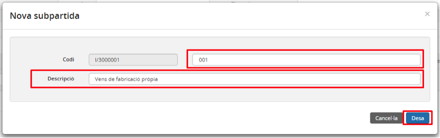

Imatge 10. Pantalla nova subpartida

* Empleneu tots els camps obligatoris de la pantalla:

  + *Codi*:

    - Apareix el codi principal de la partida (no modificable).
    - Cal completar amb el codi de subpartida. Valor alfanumèric que ha de ser únic (no hi pot haver cap altra subpartida amb el mateix codi – codi de partida i subpartida).
  + *Descripció*: Descripció de la subpartida.
* Premeu el botó *Desa* : es desa la nova subpartida i es torna a la pantalla de l’estructura base del pressupost (*Imatge 3. Estructura base del pressupost*) on ja apareix la nova subpartida creada.
* En cas que premeu el botó *Cancel·la* , no s’apliquen els canvis del quadre de diàleg.

---

### 8.1.2.4. Eliminar partides o subpartides de l’estructura base

Les partides o subpartides de l’estructura base del pressupost només es podran eliminar en cas que l’estructura es trobi en estat *No publicat*.

Per esborrar una partida o subpartida de l’estructura base del pressupost cal seguir el procediment següent:

* Des de la pantalla d’estructura base del pressupost (figura 3), trieu la pestanya d’*Ingressos* o *Despeses* segons el tipus de subpartida que vulgueu afegir.
* Seleccioneu la partida o subpartida que voleu esborrar (marcant el quadre de selecció a l’esquerra de la fila corresponent).
* Premeu el botó *Esborra*  (*Imatge 11. Esborrar partida o subpartida*)

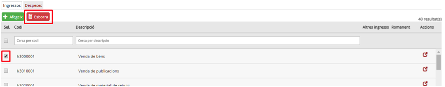

Imatge 11. Esborrar partida o subpartida

El programa demana confirmació de l’acció d’esborrar la partida o subpartida:

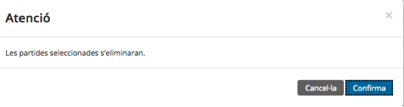

Imatge 12. Confirmar esborrat de partida o subpartida

* En cas que es tracti d’una partida s’esborraran automàticament totes les subpartides que aquesta tingui definides.

---

### 8.1.2.5. Modificar partides o subpartides de l’estructura base

Les partides o subpartides de l’estructura base del pressupost només es podran modificar en cas que l’estructura es trobi en estat *No publicat*.

Per modificar una partida o subpartida de l’estructura base del pressupost cal seguir el procediment següent:

* A la pantalla d’estructura base del pressupost (*Imatge 3*), trieu la pestanya d’Ingressos o Despeses segons el tipus de subpartida que vulgueu afegir.
* Premeu el botó d’acció  de la partida o subpartida que voleu modificar.
* Es mostra la pantalla d’edició de partida o de subpartida (*Imatge 13. Modificar partida o subpartida*).

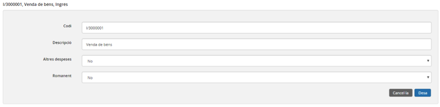

Imatge 13. Modificar partida o subpartida

* Modifiqueu els camps amb els valors nous.
* Premeu el botó *Desa* .

  + En cas que premeu el botó *Cancel·la* , no s’apliquen els canvis.

---

### 8.1.2.6. Copiar l’estructura base del pressupost

L’estructura base del pressupost té una vigència anual i cal copiar-la cada any i per a les diferents combinacions de tipus (*General o Menjador*).

Per copiar l’estructura base del pressupost d’un determinat tipus (*General o Menjador*) l’any següent, cal seguir aquest procediment:

* Seleccioneu l’estructura base del pressupost a publicar a partir dels criteris següents (*Imatge 14. Copiar l'estructura base del pressupost*):

  + *Tipus: General o Menjador*.
  + *Any*.

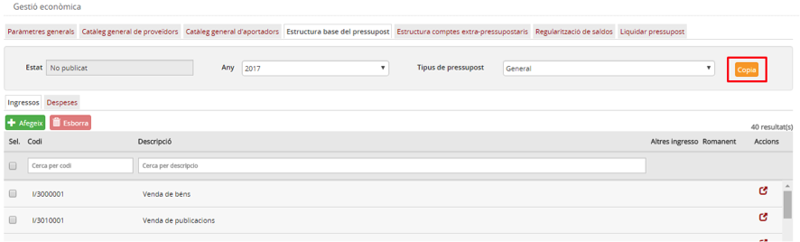

Imatge 14. Copiar l'estructura base del pressupost

* Premeu el botó *Copia* .
* Es demana confirmació de l’acció de copiar.

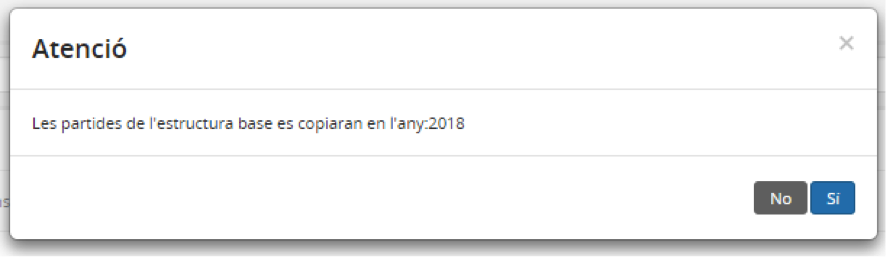

Imatge 15. Confirmació de l’acció de copiar

* Un cop realitzada la còpia, apareix la mateixa pantalla de l’estructura base del pressupost amb el nou any.

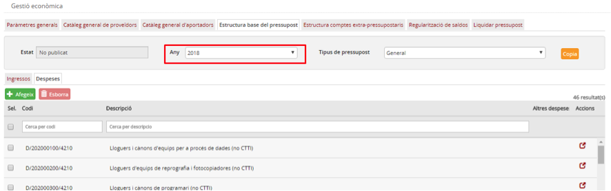

Imatge 16. Estructura base del pressupost un cop feta la còpia

---

### 8.1.2.7. Publicar l’estructura base del pressupost

Per tal que els centres puguin crear un pressupost per a un any concret i per a un cert tipus (*General o Menjador*), cal que l’estructura base del pressupost per a aquell any i aquell tipus estigui en estat *Publicat*.

Per publicar l’estructura base del pressupost cal seguir el procediment següent:

* Seleccioneu l’estructura base del pressupost a publicar a partir dels criteris següents (*Imatge 17. Publicar l’estructura base del pressupost*):

  + *Any*.
  + *Tipus*: General o Menjador

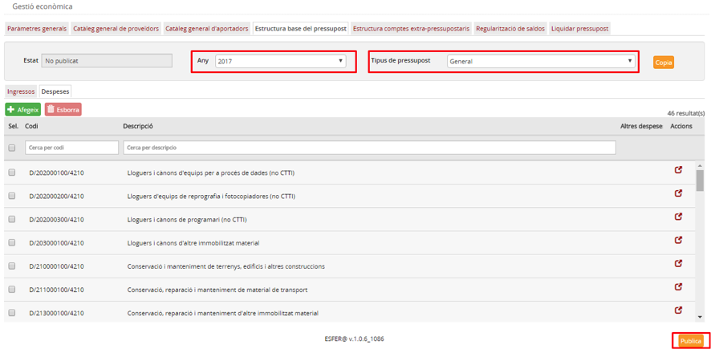

Imatge 17. Publicar l’estructura base del pressupost

* Premeu el botó *Publica* .

  + El sistema valida:

    - Que s’hagi marcat una partida de despesa com a *Altres despeses*.
    - Que s’hagi marcat una partida d’ingrés com a *Altres ingressos*.
    - Que hi hagi una i només una partida d’ingrés marcada com a *Romanent*.
  + Es canvia l’estat de l’estructura a *Publicat*.
  + Es carrega la pantalla de l’estructura base del pressupost en estat *Publicat*.

*· Nota: si com a resultat de la validació el sistema detecta alguna errada, s’han de fer les modificacions corresponents i tornar a executar l’acció de publicar.*

Una vegada que l’estructura base ha estat publicada, ja no es pot tornar enrere ni tornar-la a publicar. A partir d’aquest moment només es podran crear noves partides i subpartides sobre l’estructura base del pressupost, però no se’n podran eliminar.