# 8.2. Gestió de l’estructura base de comptes extrapressupostaris

* [8.2.1. Descripció](ap82.md#821-descripció)
* [8.2.2. Contingut pas a pas](ap82.md#822-contingut-pas-a-pas)

  + [8.2.2.1. Accés](ap82.md#8221-accés)
  + [8.2.2.2. Dades de l’estructura base](ap82.md#8222-dades-de-lestructura-base)
  + [8.2.2.3. Copiar l’estructura base de comptes extrapressupostaris](ap82.md#8223-copiar-lestructura-base-de-comptes-extrapressupostaris)
  + [8.2.2.4. Publicar l’estructura base de comptes extrapressupostaris](ap82.md#8224-publicar-lestructura-base-de-comptes-extrapressupostaris)
  + [8.2.2.5. Propagar l’estructura base de comptes extrapressupostaris als centres](ap82.md#8225-propagar-lestructura-base-de-comptes-extrapressupostaris-als-centres)
  + [8.2.2.6. Crear un nou compte extrapressupostari](ap82.md#8226-crear-un-nou-compte-extrapressupostari)
  + [8.2.2.7. Crear un nou subcompte extrapressupostari](ap82.md#8227-crear-un-nou-subcompte-extrapressupostari)
  + [8.2.2.8. Modificar dades d’un compte o subcompte extrapressupostari](ap82.md#8228-modificar-dades-dun-compte-o-subcompte-extrapressupostari)
  + [8.2.2.9. Desactivar un compte extrapressupostari](ap82.md#8229-desactivar-un-compte-extrapressupostari)

---

## 8.2.1. Descripció

En aquest contingut es mostra com donar d’alta i gestionar l’estructura base de comptes extrapressupostaris d’un centre educatiu per part de l’administrador del mòdul de Gestió econòmica.

Per tal que tots els centres tinguin una estructura de comptes extrapressupostaris homogènia i normalitzada, l’administrador de la gestió econòmica pot definir l’estructura base de comptes extrapressupostaris que compartiran tots els centres.

L’estructura base de comptes extrapressupostaris garanteix que tots els centres tinguin, com a mínim, tots els comptes extrapressupostaris definits en aquesta estructura base.

La gestió de l’estructura base de comptes extrapressupostaris és una funcionalitat d’ús exclusiu de l’**administrador** de gestió econòmica.

Aquesta gestió consta de dues parts complementàries:

* Creació de l’estructura base de comptes extrapressupostaris: l’administrador ha de crear l’estructura base, creant els comptes que calgui i desactivant els que ja no siguin necessaris. Per fer-ho, disposeu de les opcions següents:

  + Copiar l’estructura base de comptes extrapressupostaris d’un any anterior.
  + Crear nous comptes o subcomptes extrapressupostaris per afegir els comptes extrapressupostaris que calgui.
  + Desactivar comptes extra-pressupostaris per eliminar aquells comptes que ja no siguin necessaris.
* Posar l’estructura base de comptes extrapressupostaris a disposició dels centres. Per fer-ho disposeu de les opcions següents:

  + Publicar aquesta estructura base.
  + Propagar l’estructura base entre els centres.

A continuació es mostren els diferents procediments.

---

## 8.2.2. Contingut pas a pas

### 8.2.2.1. Accés

Des de la pàgina principal d’Esfer@ cal anar al mòdul de *Gestió econòmica*.

Imatge 1. Pantalla inicial d’Esfer@

Una vegada s’hagi accedit al mòdul de *Gestió econòmica* apareix a sota un nou menú amb les opcions de Gestió econòmica. Trieu la pestanya *Estructura comptes extrapressupostaris*. (*Imatge 2. Estructura de pestanyes de l’administrador de Gestió Econòmica*).

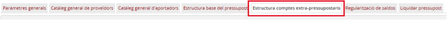

Imatge 2. Estructura de pestanyes de l’administrador de Gestió econòmica

Un cop s’ha triat aquesta opció, l’usuari podrà triar l’estructura base en funció dels criteris següents (*Imatge 3 Criteris selecció estructura base comptes extra-pressupostari*):

* *Any*: es podrà triar qualsevol dels anys pels quals ja hi hagi definida una estructura base de comptes extrapressupostaris.
* *Tipus de pressupost*: cada tipus de pressupost té associada una estructura base de comptes extrapressupostaris propi:

  + *General*: Pressupost de tipus general relacionat amb el funcionalment general del centre.
  + *Menjador*: Pressupost relacionat amb el funcionament del menjador.

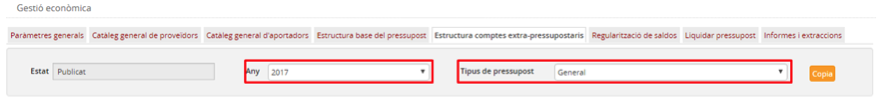

Imatge 3 Criteris selecció estructura base comptes extra-pressupostari

---

### 8.2.2.2. Dades de l’estructura base

Quan es selecciona un any i un tipus de pressupost, apareix l’estructura base definida per a aquesta combinació.

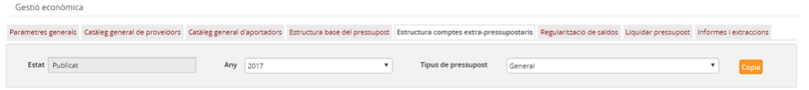

Imatge 4. Dades principals de l'estructura base

En la capçalera (*Imatge 4. Dades principals de l'estructura base*):

* *Estat*: estat de publicació de l’estructura base:

  + *Publicat*: en aquest estat només es poden afegir nous comptes però no es poden modificar ni esborrar els existents.
  + *No publicat*: en aquest estat es poden afegir, esborrar i modificar els comptes existents.
* *Any*: any al qual està vinculada l’estructura base de comptes extrapressupostaris.
* *Tipus de pressupost*: tipus de pressupost al qual està vinculada l’estructura base de comptes extrapressupostaris.

  + *General*.
  + *Menjador*.

Dins l’estructura base de comptes extrapressupostaris, es visualitza la llista de comptes extrapressupostaris amb les columnes següents (*Imatge 5. Comptes de l'estructura base*):

* *Codi*: codi del compte extrapressupostari.
* *Descripció*: nom descriptiu del compte extrapressupostari.
* *Actiu (Sí/No)*: identifica si el compte està actiu i, per tant, disponible per als centres.
* *Genèric (Sí/No)*: identifica si es tracta d’un compte genèric.

  + Els comptes genèrics vénen donats pel mateix sistema, no els crea ni l’administrador ni l’usuari del centre, i són els únics comptes comuns en els dos tipus de pressupost (*General i Menjador*). Es tracta d’un tipus de compte imprescindible per registrar determinades operacions comptables, com per exemple operacions amb IVA transferit o IVA suportat. En general es tracta de comptes vinculats a impostos (IVA, IRPF…). Tots els comptes extrapressupostaris creats per l’administrador en l’estructura base de comptes extrapressupostaris o pels mateixos centres són comptes no genèrics.

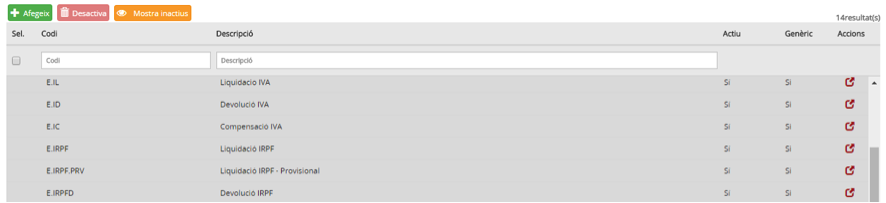

Imatge 5. Comptes de l'estructura base

Per defecte només es visualitzen els comptes actius. Per visualitzar els comptes inactius, premeu el botó *Mostra inactius* .

A la capçalera de les pantalles de detall apareix el nom del camp. A sota, hi ha uns espais per poder aplicar filtres sobre la informació de detall.

Des d’aquesta pantalla es pot fer el manteniment dels comptes i subcomptes extrapressupostaris (alta, baixa i modificació), i les operacions de còpia, publicació i propagació de l’estructura base, segons s’explica en els apartats següents.

---

### 8.2.2.3. Copiar l’estructura base de comptes extrapressupostaris

L’estructura base de comptes extrapressupostaris té una vigència anual i cal copiar-la per a les diferents combinacions de tipus (*General* o Menjador) i any.

Copiar l’estructura base de comptes extrapressupostaris és el mecanisme que permet copiar una estructura base existent per a l’any següent a l’últim que tingui estructura base definida. Per exemple, si l’últim any que té una estructura base definida és el 2017, quan es fa la còpia es generarà l’estructura base per a l’any 2018. Així s’evita que hi hagi anys que no tinguin estructura base definida.

Per copiar l’estructura base de comptes extrapressupostaris d’un determinat tipus (General o Menjador) es fa el següent (*Imatge 6. Copiar estructura base de comptes extra-pressupostaris*):

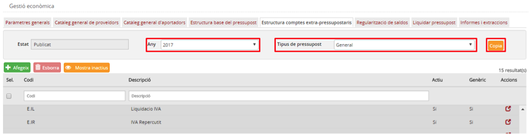

Imatge 6. Copiar estructura base de comptes extrapressupostaris

* Seleccioneu l’estructura base del pressupost a copiar a partir dels criteris següents:

  + *Any*
  + *Tipus: General o Menjador*
* Premeu el botó *Copia* .
* El sistema demana confirmació de l’acció abans de fer la còpia (*Imatge 7. Confirmació còpia estructura base de comptes extrapressupostaris*):

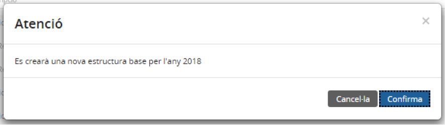

Imatge 7. Confirmació còpia estructura base de comptes extra-pressupostaris

* Un cop feta la còpia, apareix la mateixa pantalla de l’estructura base del pressupost amb el nou any i en estat *No publicat* (*Imatge 8. Nova estructura base de comptes extra-pressupostaris creada*).

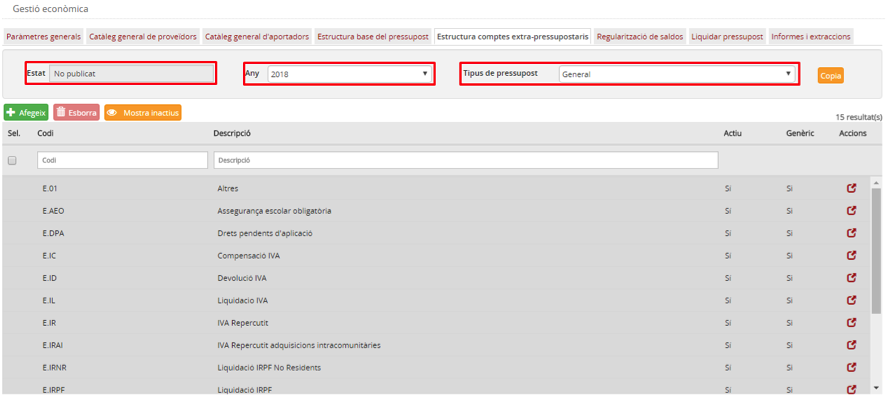

Imatge 8. Nova estructura base de comptes extra-pressupostaris creada

---

### 8.2.2.4. Publicar l’estructura base de comptes extrapressupostaris

Per tal que els centres tinguin accés al conjunt de comptes extrapressupostaris que ha definit l’administrador, cal que l’estructura base de comptes extrapressupostaris estigui, per a aquell any i aquell tipus, en estat **publicat**.

Per publicar l’estructura base de comptes extrapressupostaris cal seguir el procediment següent:

* Seleccioneu l’estructura base de comptes extrapressupostaris a publicar a partir dels criteris següents (Imatge 9. Publicar l'estructura base comptes extrapressupostaris):

  + *Any*
  + *Tipus: General o Menjador*

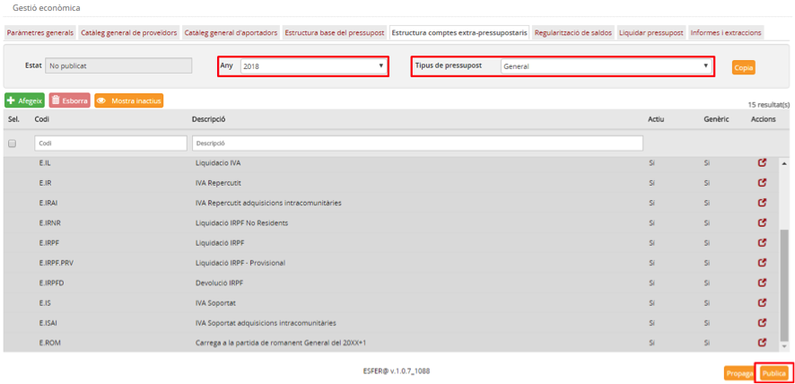

Imatge 9. Publicar l'estructura base comptes extra-pressupostaris

* Premeu el botó *Publica* .

  + El sistema demana confirmació de l’operació (*Imatge 10. Confirmació publicació estructura base comptes extra-pressupostaris*).
  + Es canvia l’estat de l’estructura a *Publicat*.
  + Es carrega la pantalla de l’estructura base del pressupost en estat *Publicat*.

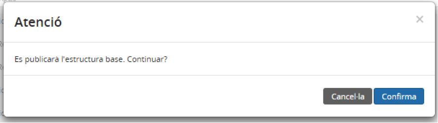

Imatge 10. Confirmació publicació estructura base comptes extra-pressupostaris

Una vegada que l’estructura base de comptes extrapressupostaris ha estat publicada, no es pot tornar enrere a l’estat *No publicat*.

---

### 8.2.2.5. Propagar l’estructura base de comptes extrapressupostaris als centres

La creació i publicació de l’estructura base de comptes extrapressupostaris té efectes només en l’àmbit de l’**usuari administrador**. I en el moment de publicar l’estructura els comptes no estan disponibles automàticament als centres.

La propagació de l’estructura base de comptes extrapressupostaris és el mecanisme que permet que l’estructura base de comptes extrapressupostaris estigui disponible en tots els centres.

La propagació comporta les actuacions internes següents (per a cada centre):

* Es creen tots els comptes que hi ha a l’estructura base de comptes extrapressupostaris i que no existeixen en el centre.
* S’actualitzen els comptes que hi ha a l’estructura base de comptes extrapressupostaris i que ja existeixen al centre (en cas que, per exemple, hagin mantingut el codi però hagin canviat el nom).
* Es desactiven tots els comptes del centre que no apareguin a l’estructura base de comptes extrapressupostaris (o que hagin estat desactivats a l’estructura base). Només es desactivaran aquells comptes que tinguin saldo 0.

La propagació de l’estructura base de comptes extrapressupostaris als centres pot ser de dos tipus:

* Manual
* Automàtica

**a) Propagació manual**

Per fer la propagació de l’estructura base dels comptes extrapressupostaris als centres cal seguir el procediment següent:

* Seleccioneu l’estructura base de comptes extrapressupostaris a publicar a partir dels criteris següents (*Imatge 11. Propagar estructura base de comptes extra-pressupostaris*):

  + *Any*
  + *Tipus: General o Menjador*

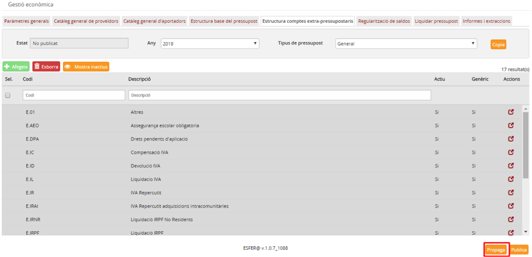

Imatge 11. Propagar estructura base de comptes extrapressupostaris

* Premeu el botó *Propaga* .

  + Es valida que l’estructura base estigui en estat *Publicat*. Si l’estructura base està en estat *No Publicat*, no es durà a terme la propagació.
  + El sistema demana confirmació de l’operació i informa l’usuari que el procés pot ser llarg (fins i tot algunes hores).

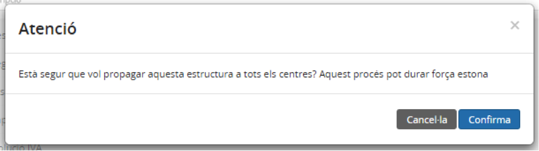

* S’inicia el procés de propagació de l’estructura base de comptes extrapressupostaris als centres.

**b) Propagació automàtica**

L’aplicació disposa d’un procés automàtic que es fa diàriament sense que l’usuari se n’assabenti, i que s’ocupa de fer la propagació dels comptes de l’estructura base de comptes extrapressupostaris als centres.

---

### 8.2.2.6. Crear un nou compte extrapressupostari

Per crear un nou compte extrapressupostari cal seguir el procediment següent:

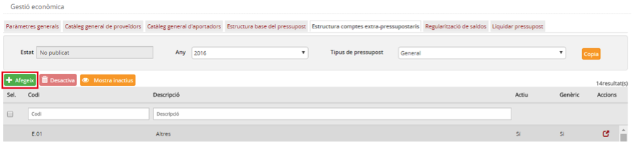

Imatge 12. Afegir un nou compte extrapressupostari

* Premeu el botó Afegeix  (*Imatge 12. Afegir un nou compte extrapressupostari*).
* Es mostra la pantalla per afegir el nou compte (*Imatge 13. Pantalla de nou compte extrapressupostari*).

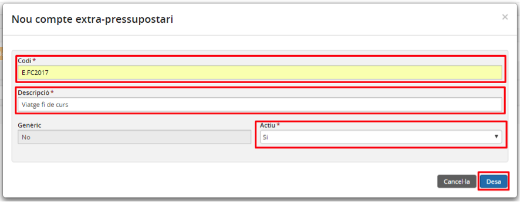

Imatge 13. Pantalla de nou compte extra-pressupostari

* Empleneu els camps obligatoris (que porten un asterisc):

  + *Codi*: codi del compte. Valor alfanumèric que ha de ser únic (no pot haver-hi cap altre compte amb el mateix codi).
  + *Descripció*: nom descriptiu del compte.
* Premeu el botó *Desa* : es desa el nou compte extrapressupostari i es torna a la pantalla de l’estructura base de comptes extrapressupostaris on ja apareix el nou compte acabat de crear.
* Si premeu el botó *Cancel·la* , no es desen els canvis.

---

### 8.2.2.7. Crear un nou subcompte extrapressupostari

Per crear un nou subcompte extrapressupostari cal seguir el procediment següent (*Imatge 14. Crear un nou subcompte extrapressupostari*):

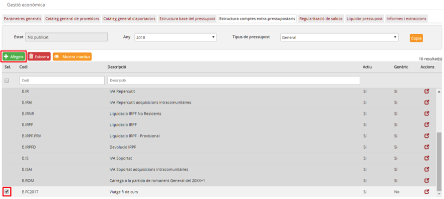

Imatge 14. Crear un nou subcompte extrapressupostari

* Seleccioneu un compte existent per al qual voleu crear un subcompte (marcant el quadret a l’esquerra de la fila corresponent).
* Premeu el botó *Afegeix* .
* Es mostra la pantalla de creació de subcompte extrapressupostari (*Imatge 15. Pantalla de creació de subcompte extrapressupostari*).

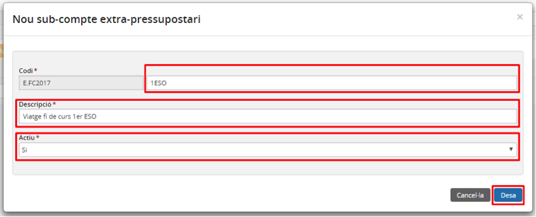

Imatge 15. Pantalla de creació de subcompte extra-pressupostari

* Empleneu els camps obligatoris (que porten asterisc):

  + *Codi*: codi específic del subcompte. Valor alfanumèric que ha de ser únic (no pot haver-hi cap altre compte o subcompte amb el mateix codi).
  + *Descripció*: nom descriptiu del subcompte.

* Premeu el botó *Desa* : es desa el nou subcompte extrapressupostari i es torna a la pantalla de l’estructura base de comptes extrapressupostaris on ja apareix el nou compte acabat de crear.

  + El nou subcompte extrapressupostari apareix sota el compte pare i es pot identificar fàcilment perquè està una mica més a la dreta i està en format cursiva (*Imatge 16. Nou subcompte extrapressupostari creat*).
  + Si premeu el botó *Cancel·la* , no es desen els canvis.

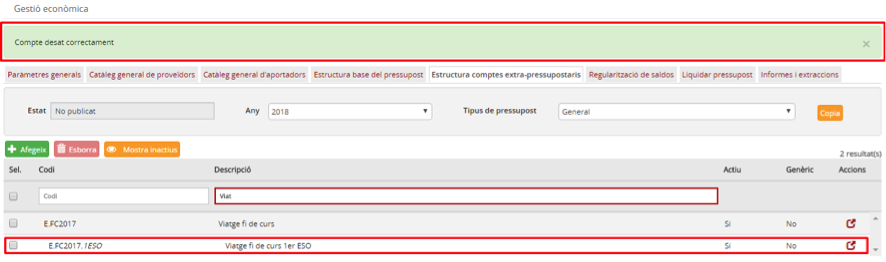

Imatge 16. Nou subcompte extrapressupostari creat

---

### 8.2.2.8. Modificar dades d’un compte o subcompte extrapressupostari

Els comptes o subcomptes de l’estructura base de comptes extrapressupostaris només es podran modificar en cas que l’estructura es trobi en estat *No publicat.*

Els comptes marcats com a *Genèrics* no es podran modificar sigui quin sigui l’estat de l’estructura base.

Per modificar un compte o subcompte de l’estructura base de comptes extrapressupostaris cal seguir el procediment següent:

* Accediu a la pantalla de l’estructura base de comptes extrapressupostaris (*Imatge 4. Dades principals de l'estructura base*)
* Premeu el botó d’acció  del compte o subcompte que voleu modificar.
* Es mostra la pantalla d’edició de compte o subcompte (*Imatge 17. Modificar compte o subcompte extrapressupostari*).

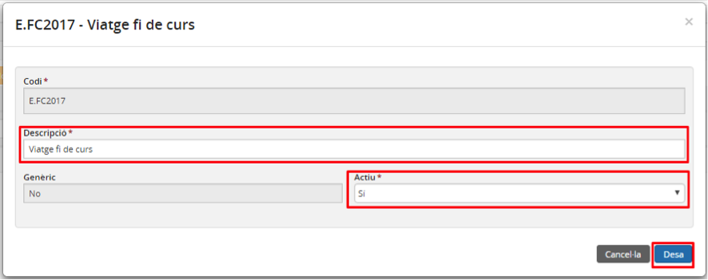

Imatge 17. Modificar compte o subcompte extra-pressupostari

* Modifiqueu els camps amb els nous valors.

  + *Descripció*: nom del compte extrapressupostari.
  + *Actiu*: estat del compte (*Sí/No*).
* Premeu el botó *Desa* .
* Si premeu el botó *Cancel·la* , no s’apliquen els canvis.

---

### 8.2.2.9. Desactivar un compte extrapressupostari

El propòsit de desactivar un compte extrapressupostari és eliminar-lo de l’estructura base de comptes extrapressupostaris.

Només es pot desactivar un compte extrapressupostari en cas que l’estructura base de comptes extrapressupostaris estigui en estat *No Publicat*.

Per desactivar un compte extrapressupostari cal seguir el procediment següent (*Imatge 18. Desactivar compte o subcompte extrapressupostari*):

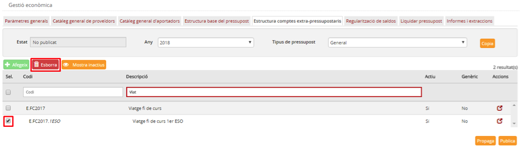

Imatge 18. Desactivar compte o subcompte extra-pressupostari

* Seleccioneu el compte o subcompte que voleu desactivar. Només podeu desactivar un compte o subcompte a la vegada.
* Premeu el botó *Desactiva* .
* Confirmeu l’operació.

En cas que es desactivi un compte també es desactivaran tots els subcomptes que aquest tingui associats.

---