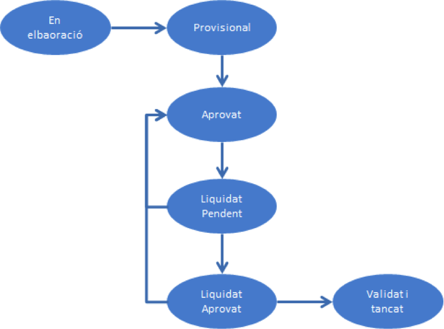
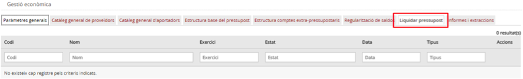
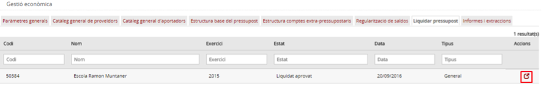
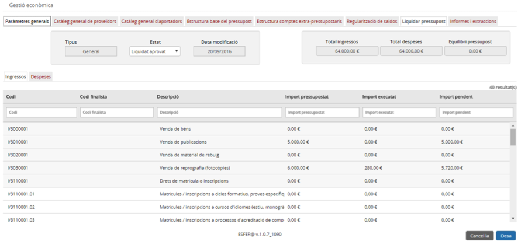
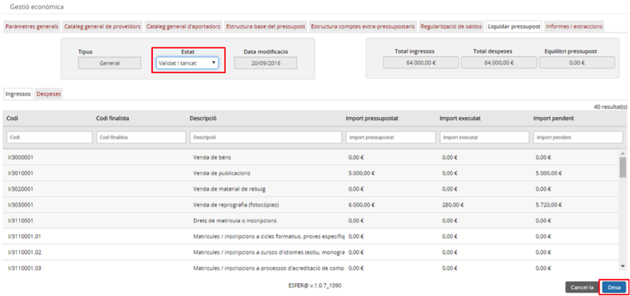

# 8.5. Tancar el pressupost

* [8.5.1. Descripció](ap85.md#851-descripció)
* [8.5.2. Contingut pas a pas](ap85.md#852-contingut-pas-a-pas)

  + [8.5.2.1. Accés](ap85.md#8521-accés)
  + [8.5.2.2. Liquidació de pressupostos](ap85.md#8522-liquidació-de-pressupostos)

---

## 8.5.1. Descripció

Dins del mòdul de *Gestió econòmica* d’Esfer@ es realitza la gestió pressupostària dels centres.

Tot i que els pressupostos tenen una vigència anual, el cicle de vida dels pressupostos s’estén en el temps des de la seva creació abans que s’iniciï l’any fiscal al qual pertany el pressupost fins al seu tancament final quan l’exercici fiscal ja s’ha tancat. Durant aquest cicle de vida, el pressupost passa per diversos estats, cada un dels quals té el seu propòsit, el seu temps de vigència, tots encaminats a facilitar la gestió pressupostària dels centres i la seva supervisió per part del Departament.

El cicle de vida del pressupost és el següent (*Imatge 1. Cicle de vida del pressupost*):

En elaboració / Liquidat pendent / Liquidat aprovat.

Imatge 1. Cicle de vida del pressupost

A continuació s’enumeren els estats dins el cicle de vida i se’n detallen les principals característiques.

* *En elaboració*. És l’estat inicial en el que estan tots els pressupostos quan s’acaben de crear.

  + En aquest estat no es poden enregistrar ni ingressos ni despeses al pressupost.
  + No és obligatori que el pressupost estigui equilibrat.
  + De l’estat *En elaboració* només es pot passar a l’estat *Provisional*.
* *Provisional*:

  + El pressupost ha d’estar obligatòriament equilibrat.
  + En aquest estat es poden enregistrar ingressos i despeses.
  + Hi ha una data límit (configurable per l’Administrador) perquè el pressupost estigui en aquest estat. A partir d’aquesta data, no es podran enregistrar més moviments fins que el pressupost no es passi a l’estat *Aprovat*.
  + De l’estat *Provisional* només es pot passar a l’estat *Aprovat*.
* *Aprovat*: és l’estat principal del pressupost durant la major part de l’any.

  + El pressupost ha d’estar obligatòriament equilibrat.
  + En aquest estat es poden enregistrar ingressos i despeses.
  + Les modificacions del pressupost en estat Aprovat tenen restriccions. Vegeu l’apartat *1.3 Modificacions del pressupost*.
  + De l’estat Aprovat només es pot passar a l’estat *Liquidat pendent*.
* *Liquidat pendent*: s’arriba a aquest estat quan l’any fiscal s’ha tancat (i se n’han liquidat els impostos) i és el primer estat del procés de tancament del pressupost.

  + En aquest estat ja no es poden enregistrar ingressos ni despeses.
  + El pressupost s'envia al Consell Escolar perquè sigui revisat per procedir a la seva liquidació.
  + De l’estat *Liquidat pendent* el pressupost pot passar a dos estats:

    - En cas que el Consell Escolar doni el vistiplau i aprovi el pressupost, passarà a l’estat *Liquidat aprovat*.
    - En cas contrari, tornarà a l’estat Aprovat perquè es pugui esmenar. En aquest supòsit, el pressupost haurà de començar un nou cicle d’aprovació.
* *Liquidat aprovat*.

  + Quan el pressupost està en aquest estat ja no és en mans del centre sinó dels serveis territorials.
  + De l’estat *Liquidat aprovat* el pressupost pot passar a dos estats:

    - En cas que els serveis territorials hi donin el vistiplau i l’aprovin, el pressupost passarà a l’estat *Validat i tancat*.
    - En cas contrari, el pressupost tornarà a l’estat Aprovat perquè es pugui esmenar. En aquest supòsit, el pressupost haurà de començar un nou cicle d’aprovació.
* *Validat i tancat*. Aquest és l’estat final del pressupost. Quan el pressupost arriba a aquest estat ja no té cap evolució possible ni cap manera de modificar-lo o esmenar-lo.

Tot el cicle del pressupost llevat de l’últim pas (passar a *Validat i tancat*) els realitza el centre. L’últim pas el realitza l’administrador d’àmbit.

Aquest contingut es centra en el pas del pressupost des de l’estat *Liquidat pendent* a l’estat *Validat i tancat*. Aquest pas el realitza exclusivament l’*administrador d’àmbit*.

---

## 8.5.2. Contingut pas a pas

### 8.5.2.1. Accés

L’operativa per accedir als centres de cost és la següent: des de la pàgina principal d’Esfer@ cal anar al mòdul de *Gestió econòmica*.

Imatge 2. Pantalla inicial d'Esfer@

Una vegada s’accedeix al mòdul de Gestió econòmica (*Imatge 2. Pantalla inicial d'Esfer@*) apareixerà la pantalla d’administrador d’Esfer@.

Seleccioneu la pestanya Liquidar pressupost (*Imatge 3. Pantalla de liquidació de pressupost*).

Imatge 3. Pantalla de liquidació de pressupost

---

### 8.5.2.2. Liquidació de pressupostos

A la pantalla de liquidació de pressupostos (*Imatge 3. Pantalla de liquidació de pressupost*) apareix una llista de tots els pressupostos pendents de liquidar.
Les columnes de la llista són les següents:

* *Codi*: codi del centre que sol·licita la regularització.
* *Nom*: nom del centre que sol·licita la regularització.
* *Exercici*: exercici del pressupost
* *Estat*: estat del pressupost (per defecte *Liquidat pendent*).
* *Data*: data en què el pressupost ha passat a l’estat Liquidat pendent.
* *Tipus*: tipus de pressupost (*General o Menjador*).
* *Botó d’acció*  per accedir al detall del pressupost que es vol tancar.

Per fer el tancament del pressupost cal seguir el següent procediment:

Imatge 4. Llista de pressupostos pendents de tancar

* Premeu el botó acció  per accedir a la pantalla de detall del pressupost que es vol tancar (*Imatge 4. Llista de pressupostos pendents de tancar*).
* Es mostra la pantalla del pressupost en estat *Liquidat aprovat (Imatge 5. Pantalla de pressupost en estat Liquidat aprovat*).

Imatge 5. Pantalla de pressupost en estat Liquidat aprovat

* Canvieu el camp *estat a Validat i tancat (Imatge 6. Passar el pressupost a l'estat Validat i tancat)*.

Imatge 6. Passar el pressupost a l'estat Validat i tancat

* Premeu el botó *Desa* .

  + Si premeu el botó *Cancel·la*  es torna a la pantalla de llista de pressupostos en estat *Liquidat aprovat* (*Imatge 4. Llista de pressupostos pendents de tancar*).
* Es torna a la pantalla de llista de pressupostos en estat *Liquidat aprovat* (*Imatge 4. Llista de pressupostos pendents de tancar*).