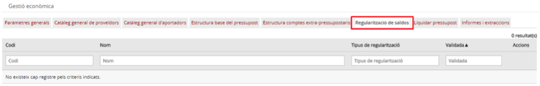
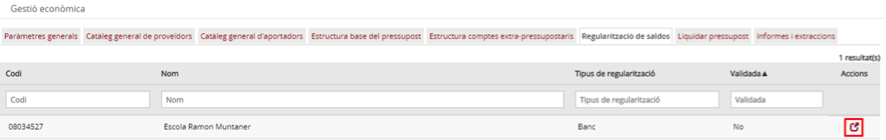
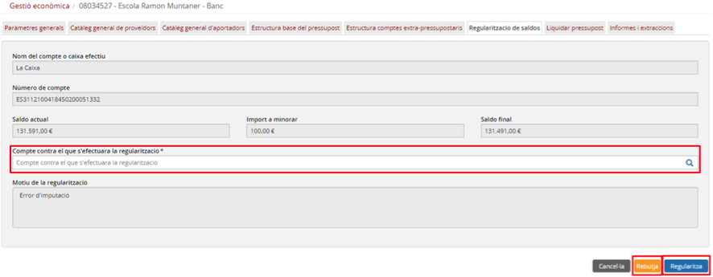
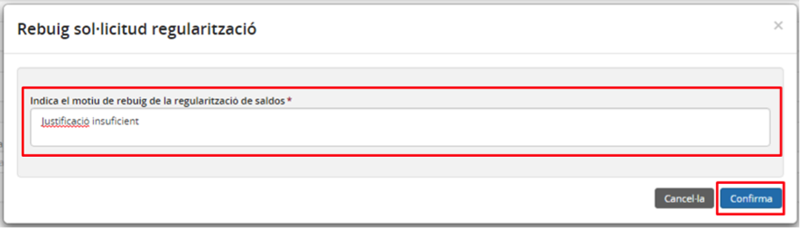
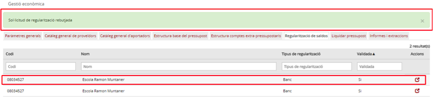
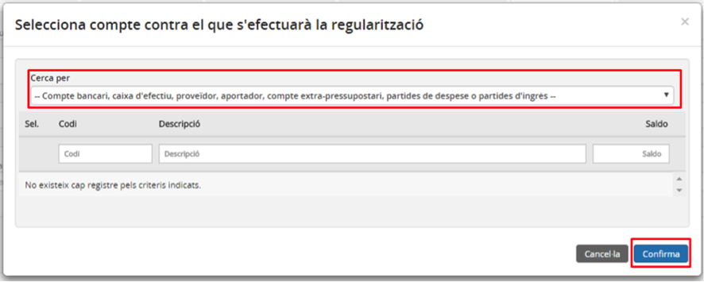
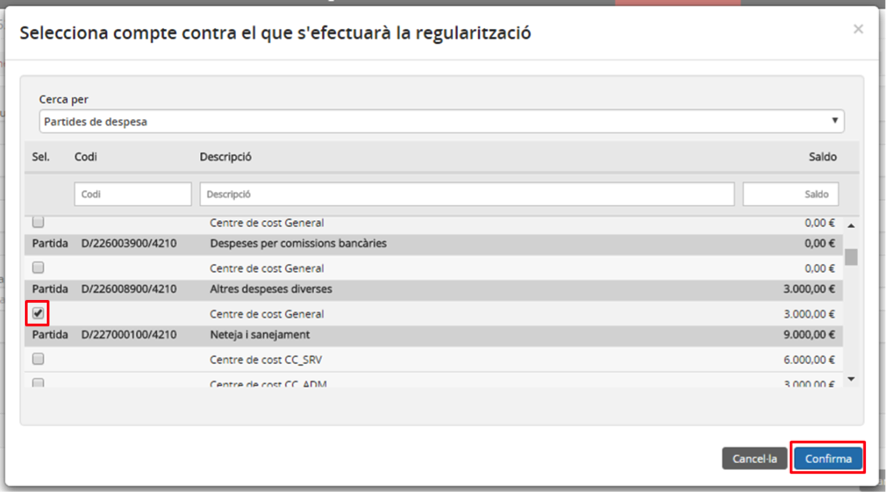
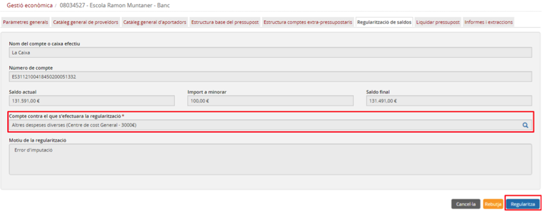
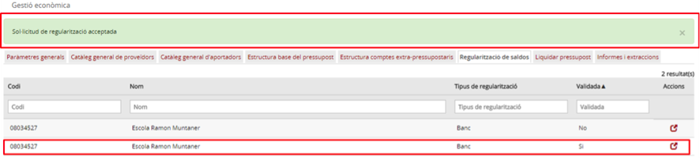

# 8.6. Regularització de saldo

* [8.6.1. Descripció](ap86.md#861-descripcio)
* [8.6.2. Contingut pas a pas](ap86.md#862-contingut-pas-a-pas)

  + [8.6.2.1. Accés](ap86.md#8621-acces)
  + [8.6.2.2. Regularització de saldos](ap86.md#8622-regularitzacio-de-saldos)

---

## 8.6.1. Descripció

Tot i que un dels objectius d’Esfer@ és que els centres portin la gestió pressupostària i comptable al dia i sense errades, en algunes circumstàncies pot passar que el saldo comptable d’algun compte bancari o caixa d’efectiu no coincideixi amb el saldo real del compte.

Per poder resoldre aquestes situacions existeix el procés de regularització de saldos:

* El centre fa una sol·licitud de regularització de saldos.
* L’administrador rep la sol·licitud de regularització i emprèn les accions necessàries per corregir la situació.

Aquest contingut es centra en la part que correspon a l’administrador per fer la regularització.

---

## 8.6.2. Contingut pas a pas

### 8.6.2.1. Accés

L’operativa per accedir als centres de cost és la següent: des de la pàgina principal d’Esfer@ cal anar al mòdul de *Gestió econòmica*.

Imatge 1. Pantalla inicial d'Esfer@

Una vegada s’accedeix al mòdul de *Gestió econòmica (Imatge 1. Pantalla inicial d’Esfer@)* apareixerà la pantalla d’administrador d’Esfer@.

Seleccioneu la pestanya *Regularització de saldos (Imatge 2. Pantalla de regularització de saldos)*.

Imatge 2. Pantalla de regularització de saldos

---

### 8.6.2.2. Regularització de saldos

A la pantalla de regularització de saldos (*Imatge 2. Pantalla de regularització de saldos*), apareix una llista de totes les regularitzacions de saldos pendents de tramitar.

Les columnes de la llista són les següents:

* *Codi*: codi del centre que sol·licita la regularització.
* *Nom*: nom del centre que sol·licita la regularització.
* *Tipus de regularització*: tipus de regularització (minorar / incrementar).
* *Validada*: estat de validació de la regularització.

  + *No*: la sol·licitud encara no ha estat validada.
  + *Sí*: la sol·licitud ja ha estat validada.
* *Botó d’acció*  per validar la sol·licitud de regularització.

Per fer la regularització de saldos cal seguir el següent procediment (*Imatge 3. Llista de sol·licituds de regularització pendents*):

Imatge 3. Llista de sol·licituds de regularització pendents

* Premeu el *botó acció*  per accedir a la pantalla de detall de la regularització (*Imatge 4. Tramitació de la sol·licitud de regularització de saldo*).

Imatge 4. Tramitació de la sol·licitud de regularització de saldo

* Si l’administrador decideix rebutjar la sol·licitud, prem el botó *Rebutja*

  + Introdueix el motiu del rebuig (*Imatge 5. Motiu rebuig*).  

    

    Imatge 5. Motiu rebuig
  + Prem el botó confirma i la sol·licitud es desa com a rebutjada. Es notificarà automàticament al director o directora del centre que l’havia sol·licitat.
  + Es torna a la llista de regularitzacions pendents, on la regularització ja apareix com a validada (*Imatge 6. Sol·licitud rebutjada*).

Imatge 6. Sol·licitud rebutjada

* Si l’administrador decideix acceptar la regularització prem el botó cerca per cercar el compte comptable contra el qual es farà la regularització.
* Es mostra la pantalla de cerca de comptes (*Imatge 7. Pantalla de selecció de compte de regularització*).

Imatge 7. Pantalla de selecció de compte de regularització

* Seleccioneu el tipus de compte contra el qual es vol fer la regularització (en funció del tipus, la llista de la part baixa de la pantalla s’omplirà amb els comptes corresponents).

  + *Compte bancari*: apareix la llista de tots els comptes bancaris actius del centre que ha fet la sol·licitud.
  + *Caixa d’efectiu*: apareix la llista de totes les caixes d’efectiu actives del centre que ha fet la sol·licitud.
  + *Proveïdor*: apareix la llista de tots els proveïdors actius del centre que ha fet la sol·licitud.
  + *Aportador*: apareix la llista de tots els aportadors actius del centre que ha fet la sol·licitud.
  + *Compte extrapressupostari*: apareix la llista de tots els comptes extrapressupostaris actius del centre que ha fet la sol·licitud.
  + *Partida d’ingrés*: apareix la llista de totes les partides d’ingrés del centre que ha fet la sol·licitud. Només apareix si la regularització és del tipus A augmentar.
  + *Partida de despesa*: apareix la llista de totes les partides de despesa del centre que ha fet la sol·licitud. Només apareix si la regularització és del tipus A minorar.

* Seleccioneu el compte contra el qual es vol fer la regularització (*Imatge 8. Selecció de compte de regularització*).

Imatge 8. Selecció de compte de regularització

* Premeu el botó *Confirma* .

  + Si prenmeu el botó *Cancel·la*  es torna a la pantalla de tramitació de la sol·licitud de regularització (*Imatge 4. Tramitació de la sol·licitud de regularització de saldo*) sense haver seleccionat cap compte.
* Una vegada seleccionat el compte es confirma la regularització prement el botó *Regularitza*  (*Imatge 9. Sol·licitud de regularització llesta per la tramitació*).

Imatge 9. Sol·licitud de regularització llesta per la tramitació

* Es torna a la pantalla de sol·licituds de regularització de saldo on ja apareix la sol·licitud com a validada (*Imatge 10. Sol·licitud de regularització validada*).

Imatge 10. Sol·licitud de regularització validada