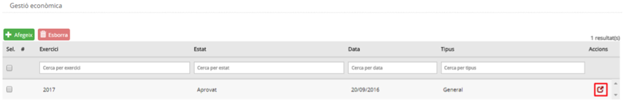
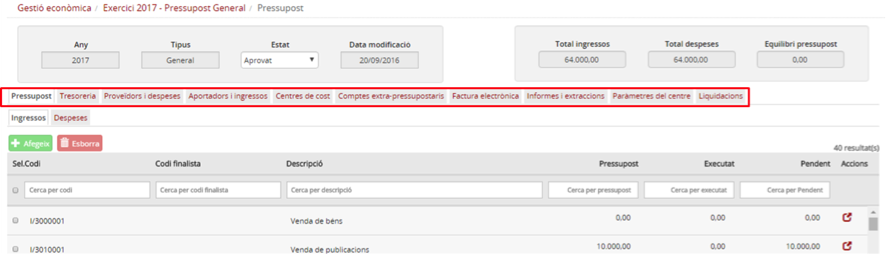

## 9.2. Accés

Com que totes les funcions que conté aquest document són pròpies del centre, l’accés és comú per a totes elles.

Des de la pàgina principal d’Esfer@ cal anar al mòdul de *Gestió Econòmica* (*Imatge 1. Pantalla inicial d'Esfer@*).

Imatge 1. Pantalla inicial d'Esfer@

Apareixerà la llista de pressupostos del centre (*Imatge 2. Llista de pressupostos del centre*).

Imatge 2. Llista de pressupostos del centre

Premeu el botó d’acció del pressupost per entrar a la pantalla de detall del pressupost (*Imatge 3. Estructura de pestanyes del director*) on apareix l’estructura de pestanyes del director.

Imatge 3. Estructura de pestanyes del director

---

