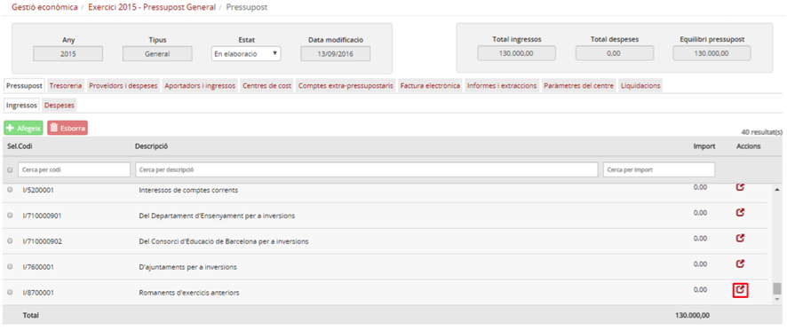
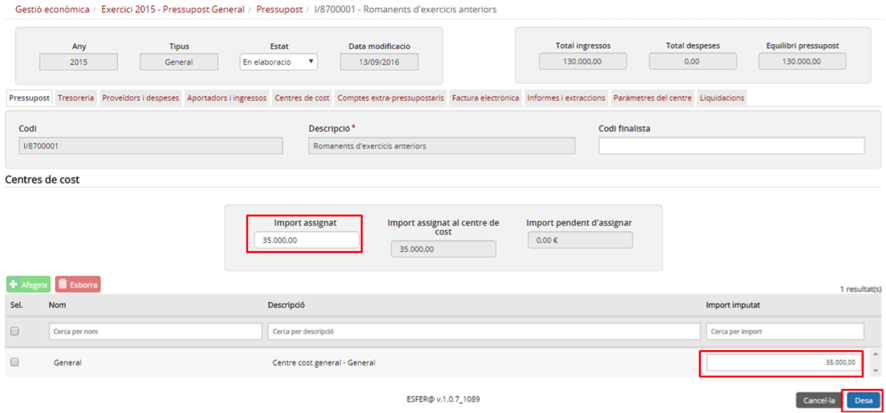

## 9.3. Introduir el saldo del romanent

Durant el primer any que un centre funcioni amb Esfer@, el centre podrà editar la partida de *Romanent*, permetent així que pugui introduir manualment el saldo de la partida de *Romanent* que hagi quedat al tancament de l’any anterior en el sistema anterior a Esfer@.

Per editar la partida de romanent cal seguir el següent procediment:

* Seleccioneu la pestanya *Pressupost* i, dins d’aquesta, la subpestanya *Ingressos (Imatge 4. Partides d'ingrés del pressupost)*.

Imatge 4. Partides d'ingrés del pressupost

* Busqueu la partida amb codi *I/8700001 (Romanents d’exercicis anteriors)*.
* Premeu el botó d’acció  per editar la partida.
* Es mostrarà la pantalla de dotació de la partida de *Romanent (Imatge 5. Dotació de la partida de Romanent)*.

Imatge 5. Dotació de la partida de Romanent

* Introduïu el valor del camp *Import assignat*.

  + En cas que el centre treballi amb centres de cost, caldrà consignar la mateixa quantitat en el centre de cost *General*.
* Premeu el botó *Desa* .

  + En cas que premeu el botó *Cancel·la*  es torna a la pantalla de detall del pressupost sense desar els canvis.

En cas que el pressupost estigui en estat *Aprovat*, s’haurà d’iniciar el procés de modificació del pressupost abans de poder fer la dotació de la partida de romanent. També s’hauran de modificar les partides de despesa per tal que el pressupost quedi equilibrat i es puguin tramitar la modificació.

---

