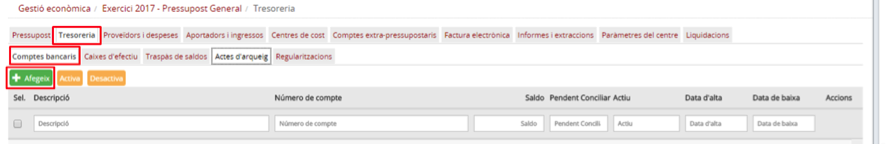
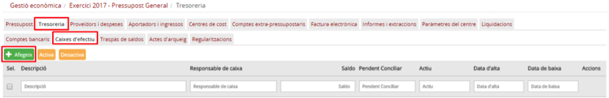
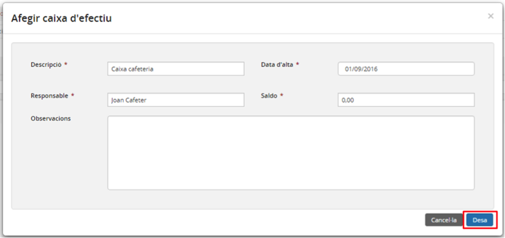

## 9.4. Introduir els saldos bancaris i de caixa d’efectiu

* [9.4.1. Comptes bancaris](ap94.md#941-comptes-bancaris)
* [9.4.2. Caixa d’efectiu](ap94.md#942-caixa-defectiu)

### 9.4.1. Comptes bancaris

Quan es dóna d’alta un compte bancari es pot introduir el saldo que ha quedat en el compte del sistema anterior.

Per donar d’alta un nou compte bancari cal seguir el següent procediment:

* Des del les pestanyes del director (*Imatge 3. Estructura de pestanyes del director*) trieu la pestanya *Tresoeria* i, dins d’aquesta, la subpestanya *Comptes bancaris*.

  + Es mostra la pantalla amb la llista de comptes bancaris del centre (*Imatge 6. Llista de bancs del centre*).

Imatge 6. Llista de bancs del centre

* Premeu el botó *Afegeix* .
* A continuació es mostra la pantalla per afegir les dades d’un compte bancari (*Imatge 7. Pantalla de nou compte bancari*).

Imatge 7. Pantalla de nou compte bancari

* Cal omplir (com a mínim) tots els camps obligatoris de la pantalla (els que tenen l’asterisc al costat):

  + *Entitat (obligatori)*: entitat del compte bancari. Valor numèric que ha de ser únic per cada compte bancari de la mateixa entitat financera.
  + *Oficina (obligatori)*: oficina del compte bancari.
  + *DC (obligatori)*: DC (dígit de control) de l’entitat financera del compte bancari.
  + *Número de compte (obligatori)*: número del compte bancari.
  + *IBAN (obligatori)*: IBAN del compte bancari.
  + *Data d’alta (obligatori)*: data d’alta el compte bancari (data automàtica).
  + *Descripció (obligatori)*: descripció del compte bancari
  + *Titular del compte (obligatori)*: titular del compte bancari
  + *Codi SWIFT*: codi SWIFT del compte bancari
  + *Saldo inicial*: saldo del compte amb el qual s’ha tancat l’exercici anterior en el sistema anterior.
  + *Direcció oficina (obligatori)*: direcció de l’oficina del compte bancari
  + *Personal amb signatura autoritzada*: nom de les persones amb signatura autoritzada del compte bancari
  + *Observacions*: observacions del compte bancari

* Premeu el botó *Desa* . Si no hi ha cap errada a les dades introduïdes, es desa la informació del nou compte bancari i el programa torna a la pantalla de comptes bancaris (Imatge 6. Llista de bancs del centre) on ja apareix la fila corresponent al nou compte bancari.

  + Si premeu el botó *Cancel·la* , es torna a la pantalla de llista de comptes bancaris sense desar les dades.

---

### 9.4.2. Caixa d’efectiu

Quan es dóna d’alta una caixa d’efectiu es pot introduir el saldo de caixa que ha quedat en el sistema anterior.

Per donar d’alta una nova caixa d’efectiu cal seguir el següent procediment:

* Des del les pestanyes del director (*Imatge 3. Estructura de pestanyes del director*) trieu la pestanya *Tresoeria* i, dins d’aquesta, la subpestanya *Caixes d’efectiu*.

  + Es mostrarà la pantalla amb la llista de caixes d’efectiu del centre (Imatge 8. Llista de caixes d'efectiu del centre).

Imatge 8. Llista de caixes d'efectiu del centre

* Premeu el botó *Afegeix* .
* A continuació es mostra el quadre de diàleg per afegir les dades d’una caixa d’efectiu (*Imatge 9. Pantalla d’una nova caixa d’efectiu*).

Imatge 9. Pantalla d’una nova caixa d’efectiu

* Cal omplir (com a mínim) tots els camps obligatoris de la pantalla (els que tenen l’asterisc al costat):

  + *Descripció (obligatori)*: descripció de la caixa d’efectiu.
  + *Data d’alta(obligatori)*: data d’alta de la caixa d’efectiu.
  + *Responsable (obligatori)*: responsable de la caixa d’efectiu.
  + *Saldo*: saldo de la caixa d’efectiu amb el qual s’ha tancat l’exercici anterior en el sistema anterior.
  + *Observacions*: observacions de la caixa d’efectiu.

* Premeu el botó *Desa*  . Si no hi ha cap errada en les dades introduïdes es desa la informació de la nova caixa d’efectiu i el programa torna a la pantalla de la imatge (*Imatge 8. Llista de caixes d'efectiu del centre*) on ja apareix la fila corresponent a la nova caixa d’efectiu.

  + Si premeu el botó *Cancel·la* , es torna a la pantalla de llista de caixes d’efectiu sense desar les dades.

---

