## 9.5. Registre de factures de proveïdors pendents de pagament

* [9.5.1. Introducció](ap95.md#951-introduccio)
* [9.5.2. Entrada de nova factura](ap95.md#952-entrada-de-nova-factura)

  + [9.5.2.1. Seleccionar el proveïdor](ap95.md#9521-seleccionar-el-proveidor)
  + [9.5.2.2. Completar les dades generals de la factura](ap95.md#9522-completar-les-dades-generals-de-la-factura)
  + [9.5.2.3. Detall de la factura](ap95.md#9523-detall-de-la-factura)
  + [9.5.2.4. Afegir venciments](ap95.md#9524-afegir-venciments)
  + [9.5.2.5. Desar la factura](ap95.md#9525-desar-la-factura)

### 9.5.1. Introducció

En cas que en tancar l’exercici anterior en el sistema anterior hagin quedat factures amb venciments pendents, cal enregistrar aquestes factures a Esfer@ seguint el procediment específic.

En cas que aquestes factures tinguin el venciment pendent (no s’hagi enregistrat cap pagament en l’exercici anterior) la factura s’ha d’abonar en el sistema anterior i introduir-la a Esfer@ seguint el procediment convencional.

Per enregistrar factures pendents de pagament cal seguir el següent procediment:

* Des del les pestanyes del director (*Imatge 3. Estructura de pestanyes del director*) trieu la pestanya *Proveïdors i despeses* i, dins d’aquesta, la subpestanya *Factures*.

  + Es mostra la llista de factures (*Imatge 10. Llista de factures*).

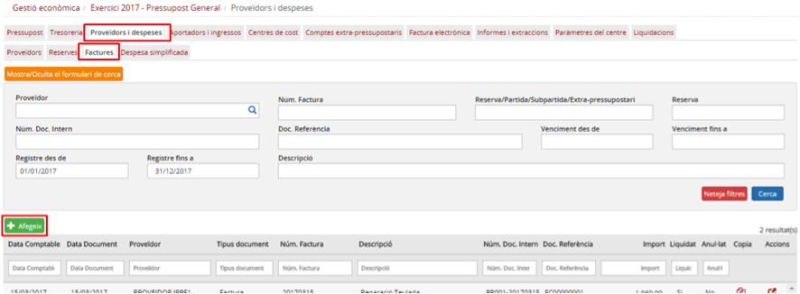

Imatge 10. Llista de factures

* Premeu el botó *Afegeix* .
* El programa mostra la pantalla de creació de factura (*Imatge 11. Pantalla de nova factura*).

Imatge 11. Pantalla de nova factura

La pantalla de creació de factura conté quatre blocs de dades:

* Dades generals
* Proveïdor seleccionat
* Detall de factura
* Venciments

La composició d’informació per cadascun d’aquests blocs és la següent:

* *Dades generals*: dades generals de la factura, la informació principal que correspondria a les preguntes “Què?” (concepte de la factura i dates) i “Quant?” (imports totals).

  + *Proveïdor*: codi del proveïdor de la factura. És un camp només de lectura i cal seleccionar el proveïdor des de la pantalla de cerca de proveïdors (vegeu l’apartat *1.-Selecció de proveïdor*)
  + *Import total factura*: en aquest camp s’hi ha de consignar **només l’import pendent de pagament** i no l’import de la factura original.
  + *Descripció*: descripció (concepte) de la factura. Atès que és una factura d’un any anterior i que no es comptabilitza en el pressupost actual, es recomana afegir a la descripció un text que permeti identificar-la fàcilment (per exemple “*Pendent 2016*”). Així, una factura amb la descripció “Reparació calefacció” es recomana que es registri com a “*Reparació calefacció – Pendent 2016*”.
  + *Import pendent de pagament*: camp calculat on es reflecteix la diferència entre l’import total de la factura i la suma dels imports de tots els venciments liquidats.
  + *Núm. Document*: número de factura que apareix en el document enviat pel proveïdor.
  + *Núm. Doc. Intern*: número de document intern que ha d’assignar l’usuari.
  + *Doc. Referència*: aquest camp és de només lectura ja que el número de document de referència el genera internament el sistema.
  + *Data Document*: data de la factura que apareix en el document enviat pel proveïdor.
  + *Data comptable*: data comptable de la factura. Atès que l’exercici anterior està tancat, la data comptable ha de ser un dels primers dies de l’any en curs (per exemple 2 de gener).

* *Proveïdor seleccionat*: les dades del proveïdor que ha emès la factura. Aquesta secció correspondria a la pregunta “Qui?”. Totes les dades d’aquesta secció només són de lectura i s’obtenen des la pantalla de selecció de proveïdors.

  + *Nom proveïdor*: nom (mercantil) del proveïdor.
  + *CIF*: CIF del proveïdor.
  + *Adreça*: adreça del proveïdor.

* *Detall factura*: dades sobre com es fa la imputació de la factura contra el pressupost (partides o subpartides i reserves) o els comptes extrapressupostaris. Aquesta secció correspondria a la pregunta “Com?” (com es reparteix l’import entre les diferents partides, subpartides, centres de cost o partides extrapressupostàries). El detall de la factura és una taula on es poden especificar una o més línies d’assignació. Cada una d’elles té els camps següents:

  + *Reserva*: el camp només és de lectura però permet cercar una reserva prement el botó d’acció del propi camp. En cas que ja s’hagi seleccionat una partida, no es pot seleccionar una reserva.
  + *Codi partida / subpartida / extra-pressupostari*: El camp només és de lectura però permet cercar una reserva prement el botó d’acció del propi camp. En cas que ja s’hagi seleccionat una reserva, no es pot seleccionar una partida / subpartida / compte extrapressupostari.
  + *Descripció*: descripció de la partida / subpartida / compte extrapressupostari.
  + *Centre de cost*: permet seleccionar un dels centres de cost que tingui assignada la partida o subpartida (mitjançant la dotació pressupostària). En cas que s’hagi triat un compte extra-pressupostari, aquest camp està desactivat.
  + *Base imposable*: base imposable que s’assigna a aquesta línia.
  + *%IVA*: tipus d’impost que aplica a aquesta línia.
  + *Quota IVA*: aquest camp es calcula a partir dels camps Base imposable i %IVA. Tot i així, aquest camp és editable per l’usuari, ja que el càlcul generat pel sistema podria provocar problemes amb els decimals. L’usuari pot editar aquest camp per ajustar l’import total de la factura.
  + *Prorrata IVA*: valor de prorrata d’IVA que aplica al centre. Aquest camp és informatiu i no editable.
  + *IVA Suportat*: es calcula a partir del camp Quota IVA i Prorrata IVA. En cas que el centre no faci declaracions d’IVA aquest camp sempre val zero (0).
  + *IVA no deduïble*: aquest camp es calcula com la diferència entre els camps Quota IVA i IVA suportat. En cas que el centre no faci declaracions d’IVA, aquest camp sempre té el mateix valor que el camp Quota IVA.
  + *Tipus retenció*: aquest camp és el tipus de retenció d’IRPF i depèn del proveïdor que s’hagi seleccionat.
  + *Retenció IRPF*: aquest camp es calcula a partir dels camps Base imposable i Tipus retenció. Tot i així, l’usuari el pot editar ja que el càlcul generat pel sistema podria provocar problemes amb els decimals. L’usuari pot editar aquest camp per ajustar l’import total de la factura.

Les factures pendents de pagament de l’any anterior s’enregistren sempre contra la partida extrapressupostària “*E.OP1 - Operacions pendents primer any funcionament*”.

* *Venciments*: dades sobre com es pagarà l’import de la factura. Permet definir diversos venciments (terminis) amb diverses formes de pagament. Aquesta secció correspondria a la pregunta “Quan?” (dates de pagament). La secció de venciments és una taula on es poden especificar una o més línies, cada una corresponent a un venciment. Cadascuna té els camps següents:

  + *Data venciment*: data del venciment
  + *Descripció*: descripció del venciment
  + *Import*: import del venciments
  + *Tipus de pagament*: forma de pagament del venciment Desplegable amb els següents valors:

    - *Transferència*: transferència bancaria.
    - *Rebut*: rebut domiciliat.
    - *Xec*: xec bancari.
    - *Targeta de crèdit*: targeta bancària de crèdit.
    - *Efectiu*: pagament en efectiu.
    - *Compensació*: compte de compensació del proveïdor. Aquest valor només apareix si el compte de compensació del proveïdor té saldo perquè s’hagi fet una abonament d’una factura i en lloc de recuperar els diners, s’hagi acordat compensar-ho en la següent factura.
    - *No pagable*: seleccioneu-lo si per algun motiu la factura no es pot pagar (per exemple, que el proveïdor hagi desaparegut).
  + *Banc/Caixa*: camp desplegables per seleccionar el banc o la caixa contra la qual es fa el pagament. El contingut de la llista de selecció s’omple en funció del valor seleccionat al camp Tipus pagament.
  + *Liquidat*: estat de liquidació del venciment:

    - *Sí*: el venciment ha estat liquidat (pagat).
    - *No*: el venciment no ha estat liquidat (pagat). Valor per defecte.
  + *Anul·lat*: estat d’anul·lació del venciment:

    - *Sí*: el venciment ha estat anul·lat.
    - *No*: el venciment no ha estat anul·lat. Valor per defecte.
  + *Accions*: botons de les accions que es poden fer sobre els venciments.

    -  *Pagar*: només està actiu si el venciment no està liquidat.
    -  *Anul·lar*: només està actiu si el venciment està liquidat.

---

### 9.5.2 Entrada de nova factura

Els passos a seguir per introduir una nova factura són els següents:

1. Seleccionar el proveïdor: és imprescindible seleccionar un proveïdor com a primer pas de la introducció de la factura. En cas contrari, no podrem detallar la factura ni afegir venciments.
2. Completar les dades general de la factura.
3. Detall de la factura.
4. Afegir els venciments a la factura.
5. Desar la factura.

A continuació es detalla cada un d’aquest passos.

#### 1. Seleccionar el proveïdor

Per seleccionar un proveïdor cal seguir el següent procediment:

* Des de la pantalla d’entrada de factura

  + Premeu el botó de cerca  del camp proveïdor (*Imatge 12. Seleccionar proveïdor*).

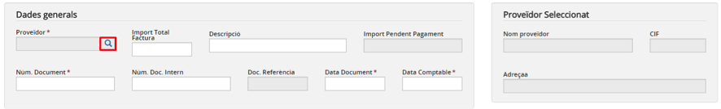

Imatge 12. Seleccionar proveïdor

* Es mostra la pantalla de selecció del proveïdor (*Imatge 13. Pantalla de selecció de proveïdor al crear factura*).

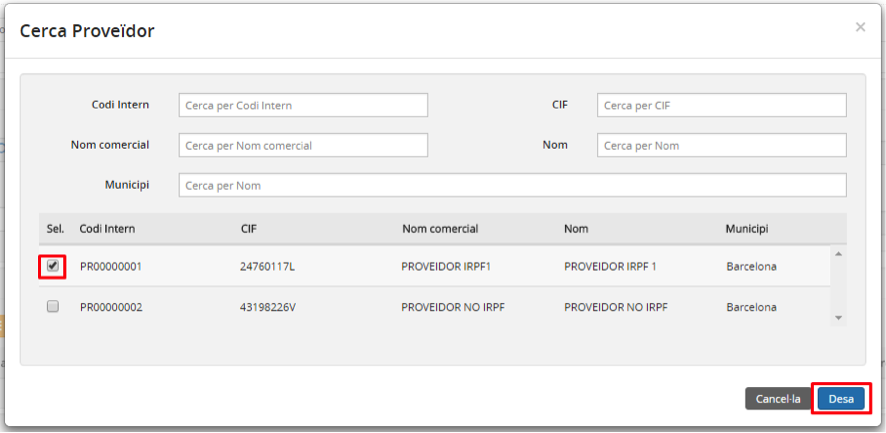

Imatge 13. Pantalla de selecció de proveïdor al crear factura

* Apareix una llista amb tots els proveïdors del centre amb els següents camps:

  + *Codi intern*: codi intern del proveïdor
  + *CIF*: CIF del proveïdor
  + *Nom comercial*: nom comercial del proveïdor
  + *Nom*: nom (mercantil) del proveïdor
  + *Municipi*: municipi on té l’adreça el proveïdor
* Per cada un dels camps anteriors existeix un camp a la capçalera de la pantalla (en forma de caixeta) que permet filtrar els continguts de la taula.
* Seleccioneu un proveïdor (i només un). No està permès seleccionar-ne més d’un.
* Premeu el botó *Desa* .

  + En cas que premeu el botó *Cancel·la*  es torna a la pantalla de creació de factures.
* El programa torna a la pantalla de creació de factura on ja apareixen les dades del proveïdor seleccionat (*Imatge 14. Proveïdor seleccionat*).

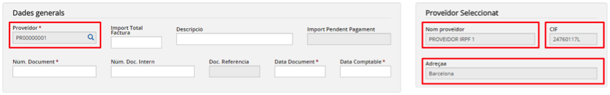

Imatge 14. Proveïdor seleccionat

---

#### 2. Completar les dades generals de la factura

Cal introduir la resta de camps de la secció Dades Generals (Imatge 15. Dades generals):

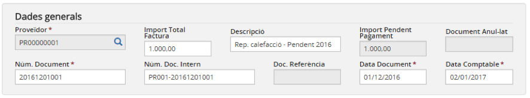

Imatge 15. Dades generals

* *Import total factura*: en aquest camp s’haurà de consignar **només l’import pendent de pagament**, i no l’import de la factura original.
* *Descripció*: descripció (concepte) de la factura. Atès que és una factura d’un any anterior que no es comptabilitza en el pressupost actual, es recomana afegir dins de la descripció un text que permeti identificar-la fàcilment (per exemple “Pendent 2016”). Així, una factura amb descripció “Reparació calefacció” es recomana que es registri com a “Reparació calefacció – Pendent 2016”.
* *Núm. Document*: número de la factura que apareix en el document que ha emès el proveïdor. Ha de ser únic per al proveïdor seleccionat (no hi pot haver cap altra factura del mateix proveïdor amb el mateix número).
* *Núm. Doc. Intern*: número de document intern triat per l’usuari. Ha de ser únic (no hi pot haver cap altra factura amb el mateix número de document intern).
* *Data document*: data de la factura que apareix en el document que ha emès el proveïdor.
* *Data comptable*: data comptable de la factura. Atès que l’exercici anterior està tancat, la data comptable ha de ser un dels primers dies de l’any en curs (per exemple 2 de gener).

---

#### 3. Detall de la factura

En el detall de la factura es desglossa la manera que l’import total de la factura s’imputa al pressupost o als comptes extrapressupostaris. Dins de la secció *Detall factura* es poden detallar una o més línies amb diferents reserves, partides / subpartides (amb els centres de cost que tinguin associats) o comptes extra-pressupostaris.

Per poder afegir una línia a la taula de detall de factura cal seguir el següent procediment (*Imatge 16. Afegir una nova línia de detall*):

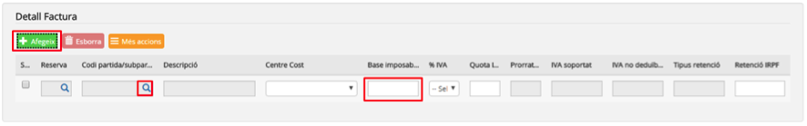

Imatge 16. Afegir una nova línia de detall

* Premeu el botó *Afegeix* .
* S’afegeix una nova en línia en blanc a la taula.
* Premeu el botó de cerca  del camp Partida / subpartida / extrapressupostari.

  + Es mostra la pantalla de cerca de partides/subpartides i comptes extrapressupostaris (*Imatge 17. Pantalla de cerca de partides / subpartides o comptes extrapressupostaris*).  

    

    Imatge 17. Pantalla de cerca de partides / subpartides o comptes extra-pressupostaris
  + Obriu el desplegable *Cerca per* i trieu el tipus *Compte extrapressupostari*.
  + Trieu el compte extrapressupostari “*E.OP1 - Operacions pendents primer any funcionament*”.  

    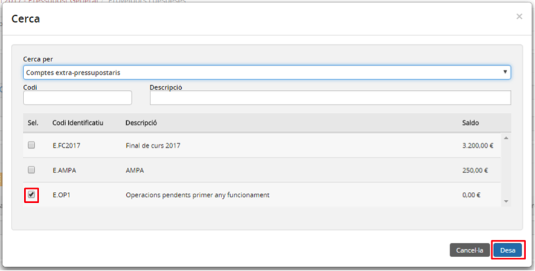

    Imatge 18. Selecció de partida / subpartida o compte extra-pressupostari
  + Premeu el botó *Desa* .

    - En cas que premeu el botó *Cancel·la*  es torna a la pantalla de creació de factures sense haver seleccionat cap partida/subpartida o compte extrapressupostari.
  + Les dades del compte extrapressupostari “*E.OP1 - Operacions pendents primer any funcionament*” s’incorporen a la línia de detall que es crea.

    - Es desactiven els botons de cerca  dels camps *Reserva i Partida / subpartida / extrapressupostari*.
    - Es desactiva el camp *Centre de cost.*
* Introduïu la resta de camps editables de la línia:

  + *Base imposable*: consigneu l’import pendent de pagament de l’IVA inclòs. L’import ha de coincidir amb el camp *Import total* factura de la secció *Dades generals*.
  + *%IVA*: Seleccioneu el tipus IVA no deduïble.
  + *Quota IVA*: ha de ser 0.
  + *Retenció IRPF*: ha de ser 0.

Per a aquestes factures, només es pot introduir una línia de detall i no es pot fer imputació a cap altre partida o compte extrapressupostari (*Imatge 19. Detall factura pendent de pagament exercici anterior*).

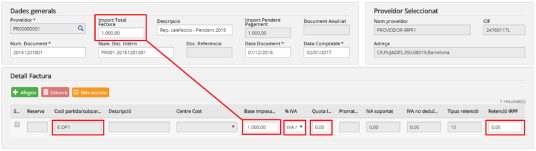

Imatge 19. Detall factura pendent de pagament exercici anterior

---

#### 4. Afegir venciments

Els venciments permeten definir quins seran els pagaments que es faran per aquesta factura. Cada venciment té la seva pròpia data, l’import i el tipus de pagament.

Per afegir un nou venciment a la taula de venciments cal seguir el següent procediment (*Imatge 20. Crear un nou venciment*):

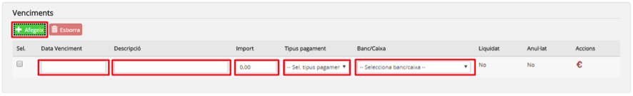

Imatge 20. Crear un nou venciment

* Premeu el botó *Afegeix* .
* S’afegeix una nova línia a la taula de venciments.
* Completeu els camps del venciment:

  + *Data venciment*: data prevista per al venciment.
  + *Descripció*: descripció del venciment.
  + *Import*: import previst per al venciment.
  + *Tipus de pagament*: forma de pagament del venciment. Desplegable amb els següents valors.

    - *Transferència*: transferència bancaria.
    - *Rebut*: rebut domiciliat.
    - *Xec*: xec bancari.
    - *Targeta de crèdit*: targeta bancària de crèdit
    - *Efectiu*: pagament en efectiu
    - *Compensació*: compte de compensació del proveïdor. Aquest valor només apareix si el compte de compensació del proveïdor té saldo perquè s’ha fet una abonament d’una factura i enlloc de recuperar els diners, s’hagi acordat compensar-ho en la següent factura.
    - *No pagable*: seleccionar si per algun motiu la factura no es pot pagar (per exemple que el proveïdor hagi desaparegut).
  + *Banc/Caixa*: camp desplegable per seleccionar el banc o la caixa contra la qual es fa el pagament. El contingut de la llista de selecció s’omple en funció del valor seleccionat al camp *Tipus pagament*.

    - Si el camp *Tipus pagament val Transferència, Rebut, Xec o Targeta de crèdit*, la llista s’omple amb tots els bancs actius del centre.

• Si el camp *Tipus pagament val Efectiu*, la llista s’omple amb totes les caixes d’efectiu actives del centre.

* Si el camp *Tipus pagament val Compensació* s’omple amb el valor *Compte compensatori*.
* Si el camp *Tipus pagament* val *No Pagable* s’omple amb la partida d’ingrés marcada com a *Altres ingressos*.
* En cas que en el moment de crear el venciment aquest ja estigui pagat, es pot prémer el botó acció *Pagar* .
* El camp *Liquidat* canviarà el valor (*No* → *Sí*).

D’aquesta manera es poden afegir un o més venciments (*Imatge 21. Venciments creats*). La suma dels imports de tots els venciments ha de coincidir amb el camp Import total factura de la secció *Dades generals*.

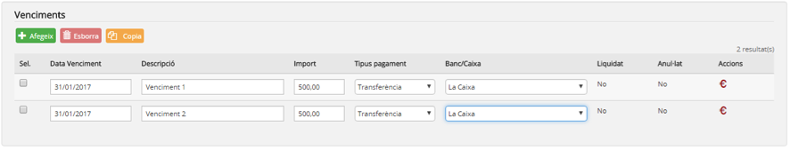

Imatge 21. Venciments creats

---

#### 5. Desar la factura

Una vegada s’han completat tots els passos anteriors cal desar la factura.

Per desar la factura cal seguir el següent procediment (*Imatge 22. Desar la factura*):

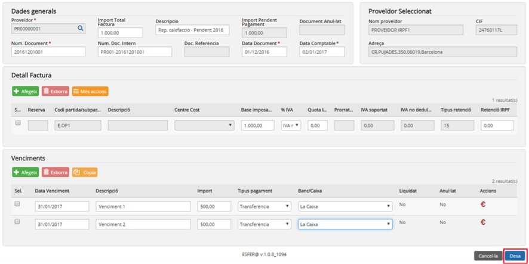

Imatge 22. Desar la factura

* Premeu el botó *Desa*  .

  + En cas que premeu el botó *Cancel·la*  es torna a la pantalla amb la llista de factures (*Imatge 10. Llista de factures*) sense desar-la.
* El sistema fa les validacions de la factura. Les principals validacions són:

  + El camp *Data comptable* ha d’estar dins de l’any del pressupost.
  + La suma de les línies de detall (*Base imposable*) ha de coincidir amb el camp *Import total factura*.
  + La suma de tots els imports dels venciments ha de coincidir amb el camp *Import total factura*.
  + Validacions dels saldos de bancs i caixes per als venciments marcats com a *Liquidats*.
* En cas que s’hagin passat les validacions, es desa la factura i es torna a la pantalla amb la llista de factures (*Imatge 23. Factura creada*) on ja apareix la factura creada.  

  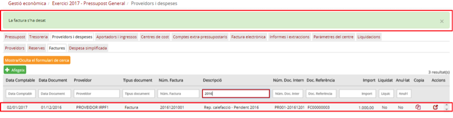

  Imatge 23. Factura creada

  + Si alguna validació falla es mostra un missatge d’errada (*Imatge 24. Exemple de missatge d'errada*) per tal que l’usuari pugui esmenar-lo i tornar-ho a intentar.

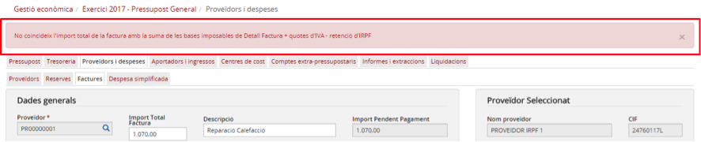

Imatge 24. Exemple de missatge d'errada

---

