## 9.6. Registre d’ingressos d’aportadors pendents de cobrament

* [9.6.1. Introducció](ap96.md#961-introduccio)
* [9.6.2. Entrada de nou ingrés](ap96.md#962-entrada-de-nou-ingres)

  + [9.6.2.1. Selecció de l’aportador](ap96.md#9621-seleccio-de-laportador)
  + [9.6.2.2. Completar les dades generals de l’ingrés](ap96.md#9622-completar-les-dades-generals-de-lingres)
  + [9.6.2.3. Detall de l’ingrés](ap96.md#9623-detall-de-lingres)
  + [9.6.2.4. Afegir venciments](ap96.md#9624-afegir-venciments)
  + [9.6.2.5. Desar l’ingrés](ap96.md#9625-desar-lingres)

En cas que en tancar l’exercici anterior en el sistema anterior hagin quedat ingressos amb venciments pendents, cal enregistrar-los a Esfer@ seguint aquest procediment específic.

Per enregistrar ingressos pendents de cobrament cal seguir el següent procediment:

* Des del les pestanyes del director (*Imatge 3. Estructura de pestanyes del director*) trieu la pestanya *Aportadors i ingressos* i, dins d’aquesta, la subpestanya *Ingressos*.

  + Es mostra la pantalla amb la llista d’ingressos (*Imatge 25. Llista d'ingressos*).

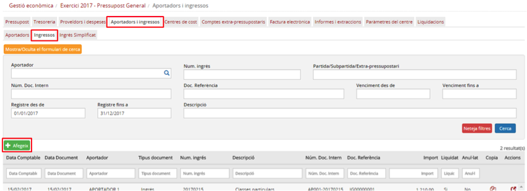

Imatge 25. Llista d'ingressos

* Premeu el botó *Afegeix* .
* El programa mostra la pantalla de creació d’ingrés (*Imatge 26. Pantalla de nou ingrés*).

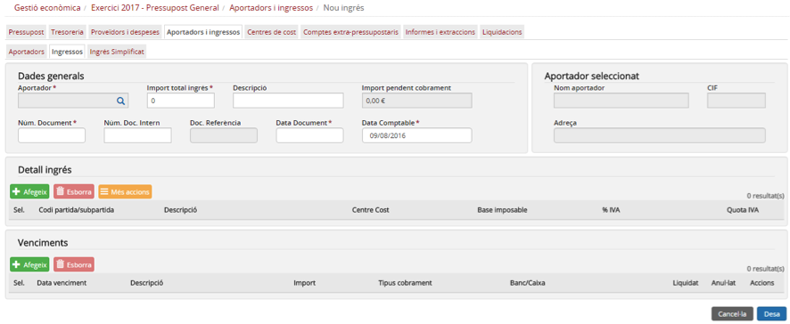

Imatge 26. Pantalla de nou ingrés

En la pantalla de creació d’ingrés hi ha quatre blocs de dades:

* Dades generals.
* Aportador seleccionat.
* Detall ingrés.
* Venciments

La composició d’informació per cadascun d’aquests blocs és la següent:

* *Dades generals*: les dades generals de l’ingrés contenen la informació principal de l’ingrés, la que correspondria a les preguntes “Què?” (concepte de l’ingrés i dates) i “Quant?” (imports totals).

  + *Aportador*: codi de l’aportador de l’ingrés. Aquest camp només és de lectura i cal seleccionar l’aportador des de la pantalla de cerca d’aportador (vegeu l’apartat Selecció d’aportador).
  + *Import total ingrés*: en aquest camp s’hi ha de consignar **només l’import pendent de cobrament**, i no l’import de l’ingrés original.
  + *Descripció*: descripció (concepte) de l’ingrés. Atès que és un ingrés d’un any anterior que no es comptabilitza en el pressupost actual, es recomana afegir dins de la descripció un text que permeti identificar-lo fàcilment (per exemple “Pendent 2016”). Així, un ingrés amb descripció “Publicacions centre” es recomana que es registri com a “Publicacions centre – Pendent 2016”.
  + *Núm. Document*: número d’ingrés que figura en el document enviat a l’aportador.
  + *Núm. Doc. Intern*: número de document intern que ha d’assignar l’usuari.
  + *Doc. Referència*: aquest camp només és de lectura ja que el número de document de referència el genera internament el sistema.
  + *Data Document*: data de l’ingrés que apareix en el document enviat a l’aportador.
  + *Data comptable*: data comptable de la factura. Atès que l’exercici anterior està tancat, la data comptable ha de ser un dels primers dies de l’any en curs (per exemple 2 de gener).

* *Aportador seleccionat*: les dades de l’aportador que fa l’ingrés. Aquesta secció correspondria a la pregunta de “Qui?”. Totes les dades d’aquesta secció només són de lectura i s’obtenen des la pantalla de selecció d’aportadors.

  + *Nom aportador*: nom (mercantil) de l’aportador.
  + *CIF*: CIF de l’aportador.
  + *Adreça*: adreça de l’aportador.

* *Detall ingrés*: les dades sobre com es fa la imputació de l’ingrés contra el pressupost (partides o subpartides) o els comptes extrapressupostaris. Aquesta secció correspondria a la pregunta “Com?” (com es reparteix l’import entre les diferents partides, subpartides, centres de cost o partides extrapressupostàries). El detall de l’ingrés és una taula on es poden especificar una o més línies d’assignació. Cadascuna té els següents camps:

  + *Codi partida / subpartida / extrapressupostari*: el camp només és de lectura però permet cercar una partida/subpartida o compte extrapressupostari prement el botó d’acció del mateix camp.
  + *Descripció*: descripció de la partida / subpartida / compte extrapressupostari.
  + *Centre de cost*: permet seleccionar un dels centres de cost que tingui assignat la partida o subpartida (mitjançant la dotació pressupostària). En cas que s’hagi triat un compte extrapressupostari, aquest està desactivat.
  + *Base imposable*: base imposable que s’assigna a aquesta línia.
  + *%IVA*: tipus d’impost que aplica a aquesta línia.
  + *Quota IVA*: aquest camp es calcula a partir dels camps Base imposable i %IVA. Tot i així, és editable per l’usuari ja que el càlcul generat pel sistema podria provocar problemes amb els decimals. L’usuari pot editar aquest camp per ajustar l’import total de l’ingrés.

Els ingressos pendents de pagament de l’any anterior s’enregistren sempre contra la partida extrapressupostària “E.OP1 - Operacions pendents primer any funcionament”.

* *Venciments*: les dades sobre com es cobrarà l’import de l’ingrés. Permet definir diversos venciments (terminis) amb diverses formes de cobrament. Aquesta secció correspondria a la pregunta “Quan?” (dates de cobrament). La secció de venciments és una taula on es poden especificar una o més línies, cada una corresponent a un venciment. Cadascuna té els següents camps:

  + *Data venciment*: data del venciment.
  + *Descripció*: descripció del venciment.
  + *Import*: import del venciment.
  + *Tipus cobrament*: forma de cobrament del venciment. Desplegable amb els següents valors.

    - *Transferència*: transferència bancaria.
    - *Rebut*: rebut domiciliat.
    - *Xec*: xec bancari.
    - *Targeta de crèdit*: targeta bancària de crèdit
    - *Efectiu*: cobrament en efectiu
    - *No cobrable*: seleccioneu-lo si per algun motiu l’ingrés no es pot cobrar (per exemple que l’aportador hagi desaparegut).
  + *Banc/Caixa*: camp desplegable per seleccionar el banc o la caixa contra la qual es fa el cobrament. El contingut de la llista de selecció s’omple en funció del valor seleccionat al camp Tipus cobrament.
  + *Liquidat*: estat de liquidació del venciment:

    - *Sí*: el venciment ha estat liquidat (cobrat).
    - *No*: el venciment no ha estat liquidat (cobrat). Valor per defecte.
  + *Anul·lat*: estat d’anul·lació del venciment:

    - *Sí*: el venciment ha estat anul·lat.
    - *No*: el venciment no ha estat anul·lat. Valor per defecte.
  + *Accions*: botons de les accions que es poden fer sobre els venciments.

    - 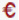 *Cobrar*: només està actiu si el venciment no està liquidat.
    -  *Anul·lar*: només està actiu si el venciment està liquidat.

---

### 9.6.2. Entrada de nou ingrés

Els passos a seguir per introduir un nou ingrés són els següents:

1. Selecció de l’aportador: és imprescindible seleccionar un aportador com a primer pas de la introducció de l’ingrés. En cas contrari, no podrem detallar l’ingrés ni afegir venciments.
2. Completar les dades generals de l’ingrés.
3. Detall de l’ingrés.
4. Afegir venciments a l’ingrés.
5. Desar l’ingrés.

A continuació es detallen cada un d’aquests passos.

#### 1. Selecció de l’aportador

Per seleccionar un aportador cal seguir el següent procediment:

* Des de la pantalla d’entrada de l’ingrés, premeu el botó de cerca  del camp aportador (*Imatge 27. Seleccionar aportador*).

Imatge 27. Seleccionar aportador

* Es mostra la pantalla de selecció de l’aportador (*Imatge 28. Pantalla de selecció d’aportador al crear un ingrés*).

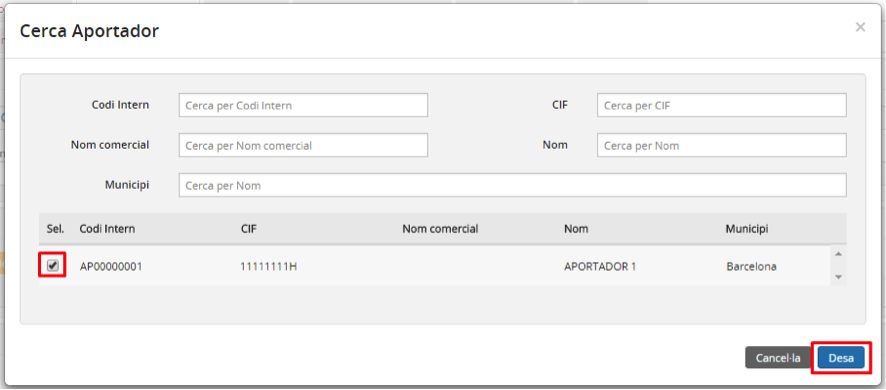

Imatge 28. Pantalla de selecció d’aportador al crear un ingrés

* Apareix una llista amb tots els aportadors del centre amb els següents camps:

  + *Codi intern*: codi intern de l’aportador.
  + *CIF*: CIF de l’aportador.
  + *Nom comercial*: nom comercial de l’aportador.
  + *Nom*: nom (mercantil) de l’aportador.
  + *Municipi*: municipi on té l’adreça l’aportador.
* Per cada un dels camps anteriors existeix un camp a la capçalera de la pantalla (en forma de caixeta) que permet filtrar els continguts de la taula.
* Seleccioneu un aportador (i només un). No està permès seleccionar-ne més d’un.
* Premeu el botó *Desa* .

  + En cas que premeu el botó *Cancel·la*  es torna a la pantalla de creació d’ingressos sense seleccionar cap aportador.
* El programa torna a la pantalla de creació d’ingrés on ja apareixen les dades de l’aportador seleccionat (*Imatge 29. Aportador seleccionat*).

Imatge 29. Aportador seleccionat

#### 2. Completar les dades generals de l’ingrés

Cal introduir la resta de camps de la secció Dades generals (*Imatge 30. Dades generals*):

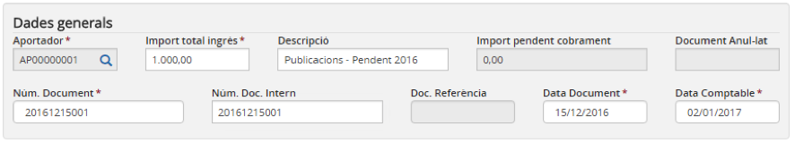

Imatge 30. Dades generals

* *Import total ingrés*: en aquest camp s’ha de consignar només l’import pendent de cobrament, IVA inclòs, i no l’import de l’ingrés original.
* *Descripció*: descripció (concepte) de l’ingrés. Atès que és un ingrés d’un any anterior que no es comptabilitza en el pressupost actual, es recomana afegir dins de la descripció un text que permeti identificar-lo fàcilment (per exemple “Pendent 2016”). Així, un ingrés amb descripció “Publicacions centre” es recomana que es registri com a “Publicacions centre – Pendent 2016”.
* *Núm. Document*: número de l’ingrés que apareix en el document que s’ha enviat a l’aportador. Ha de ser únic per a l’aportador seleccionat (no hi pot haver cap altre ingrés del mateix aportador amb el mateix número).
* *Núm. Doc. Intern*: número de document intern triat pe l’usuari. Ha de ser únic (no hi pot haver cap altre ingrés amb el mateix número de document intern).
* *Data document*: data de l’ingrés que apareix en el document que s’ha enviat a l’aportador.
* *Data comptable*: data comptable de la factura. Atès que l’exercici anterior està tancat, la data comptable ha de ser un dels primers dies de l’any en curs (per exemple 2 de gener).

---

#### 3. Detall de l’ingrés

Per poder afegir una línia a la taula de detall de l’ingrés cal seguir el següent procediment (*Imatge 31. Afegir una nova línia de detall*):

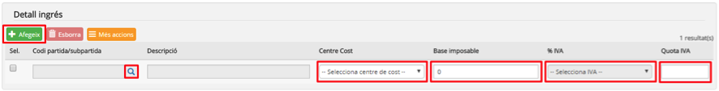

Imatge 31. Afegir una nova línia de detall

* Premeu el botó *Afegeix* .
* S’afegeix una nova en línia en blanc a la taula.
* Premeu el botó de cerca  del camp *Partida / subpartida / extrapressupostari*.

  + Es mostra la pantalla de cerca de partides/subpartides i comptes extrapressupostaris (*Imatge 32. Pantalla de cerca de partides / subpartides o comptes extrapressupostaris*).  

    

    Imatge 32. Pantalla de cerca de partides / subpartides o comptes extra-pressupostaris
  + Obriu el desplegable *Cerca per* i trieu el tipus *Compte extrapressupostari*.
  + Seleccioneu el compte extrapressupostari “*E.OP1 - Operacions pendents primer any funcionament*” (*Imatge 33. Selecció compte extra-pressupostari*).  

    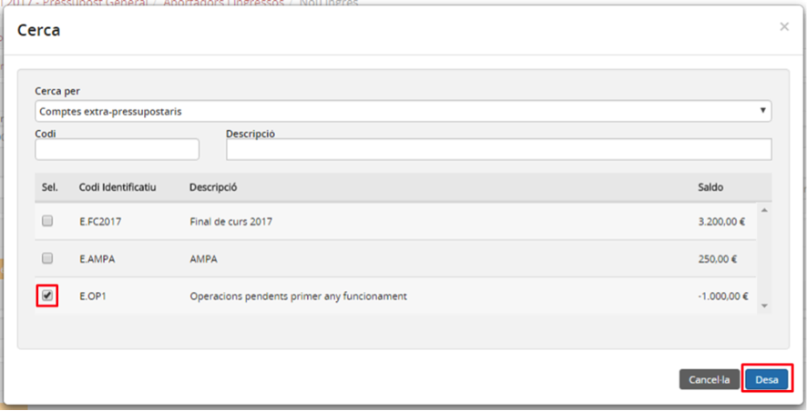

    Imatge 33. Selecció compte extra-pressupostari
  + Premeu el botó *Desa* .

    - En cas que es premi el botó *Cancel·la*  es torna a la pantalla de creació d’ingressos sense haver seleccionat el compte extrapressupostari.
  + Les dades del compte extrapressupostari s’incorporen a la línia de detall que es crea.

    - Es desactiva el botó de cerca  del camp *Partida / subpartida / extrapressupostari*.
    - Es desactiva el camp *Centre de cost*.
* Introduïu la resta de camps editables de la línia:

  + *Base imposable*: consigneu l’import pendent de cobrament IVA inclòs. L’import ha de coincidir amb el camp Import total ingrés de la secció Dades generals.
  + *%IVA*: seleccioneu el tipus IVA no deduïble.
  + *Quota IVA*: ha de ser 0.

Per a aquests ingressos, només es pot introduir una línia de detall i no es pot fer imputació a cap altra partida o compte extrapressupostari (*Imatge 34. Línies de detall creades*).

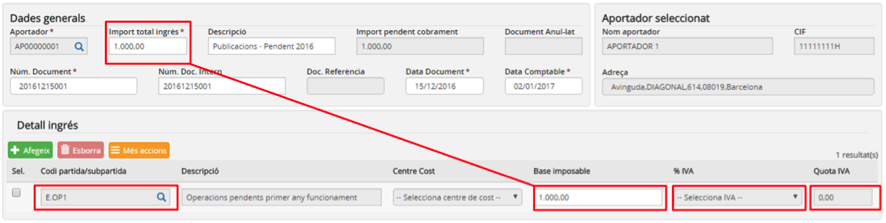

Imatge 34. Línies de detall creades

---

#### 4. Afegir venciments

Els venciments permeten definir els cobraments que es faran per aquest ingrés. Cada venciment té la seva pròpia data, l’import i el tipus de cobrament.

Per afegir un nou venciment a la taula de venciments cal seguir el següent procediment (*Imatge 20. Crear un nou venciment*):

Imatge 35. Crear un nou venciment

* Premeu el botó *Afegeix* .
* S’afegeix una nova línia a la taula de venciments.
* Completeu els camps del venciment:

  + *Data venciment*: data prevista per al venciment.
  + *Descripció*: descripció del venciment.
  + *Import*: import previst per al venciment.
  + *Tipus cobrament*: forma de cobrament del venciment. Desplegable amb els següents valors.

    - *Transferència*: transferència bancaria.
    - *Rebut*: rebut domiciliat.
    - *Xec*: xec bancari.
    - *Targeta de crèdit*: targeta bancària de crèdit.
    - *Efectiu*: cobrament en efectiu.
    - *No pagable*: seleccioneu si per algun motiu l’ingrés no es pot cobrar (per exemple que l’aportador hagi desaparegut).
  + *Banc/Caixa*: camp desplegables per seleccionar el banc o la caixa contra la qual es fa el cobrament. El contingut de la llista de selecció s’omple en funció del valor seleccionat al camp *Tipus cobrament*.

    - Si el camp *Tipus cobrament val Transferència, Rebut, Xec o Targeta de crèdit*, la llista s’omple amb tots els bancs actius del centre.
    - Si el camp *Tipus cobrament* té el valor *Efectiu*, la llista s’omple amb totes les caixes d’efectiu actives del centre.
    - Si el camp *Tipus pagament* té el valor *No cobrable* s’omple amb la partida de despesa que estigui marcada com a *Altres despeses*.
  + En cas que en el moment de crear el venciment aquest ja estigui cobrat, es pot prémer el botó d’acció *Cobrar* .

    - El camp *Liquidat* canvia de valor (*No* → *Sí*).

D’aquesta manera es poden afegir un o més venciments (*Imatge 36. Venciments creats*). La suma dels imports de tots els venciments ha de coincidir amb el camp Import total ingrés de la secció *Dades generals*.

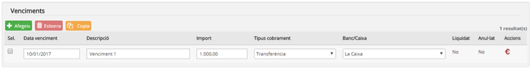

Imatge 36. Venciments creats

---

#### 5. Desar l’ingrés

Una vegada s’han completat tots els passos anteriors cal desar l’ingrés.

Per desar l’ingrés cal seguir el següent procediment (*Imatge 37. Desar l’ingrés*):

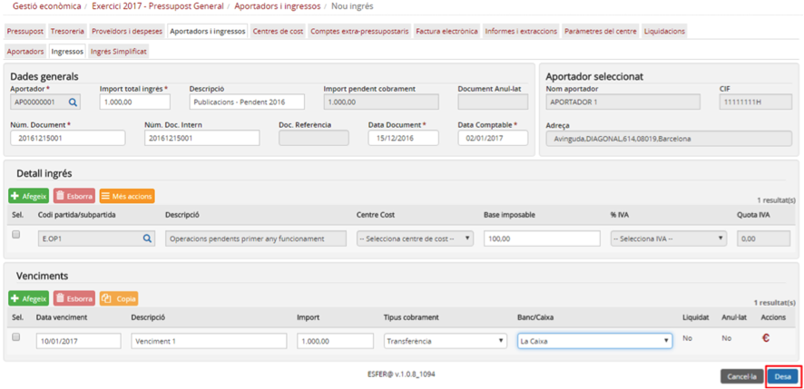

Imatge 37. Desar l’ingrés

* Premeu el botó *Desa* .

  + En cas que premeu el botó *Cancel·la*  es torna a la pantalla amb la llista d’ingressos (*Imatge 25. Llista d'ingressos*) sense guardar els canvis.
* El sistema fa les validacions de l’ingrés. Les principals validacions són:

  + El camp *Data comptable* ha d’estar dins de l’any del pressupost.
  + La suma de les línies de detall (*Base imposable*) ha de coincidir amb el camp *Import total ingrés*.
  + La suma de tots els imports dels venciments ha de coincidir amb el camp *Import total ingrés*.
* En cas que hagin passat les validacions, es desa l’ingrés i es torna a la pantalla amb la llista d’ingrés (*Imatge 38. Ingrés creat*) on ja apareix l’ingrés creat, així com el missatge de confirmació de l’acció.  

  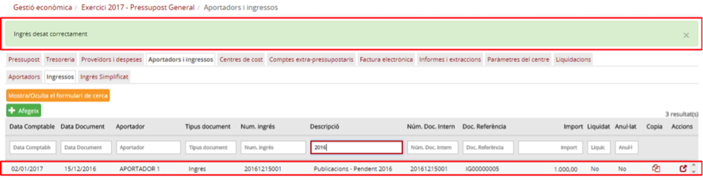

  Imatge 38. Ingrés creat

  + Si alguna validació falla es mostra un missatge d’errada (*Imatge 39. Exemple de missatge d'errada*) per tal a l’usuari pugui esmenar-ho i tornar-ho a intentar.

Imatge 39. Exemple de missatge d'errada

---

