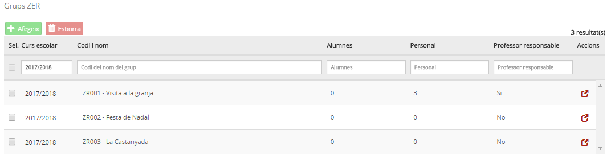
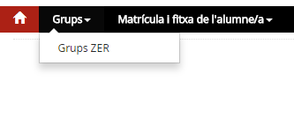
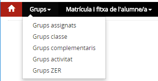
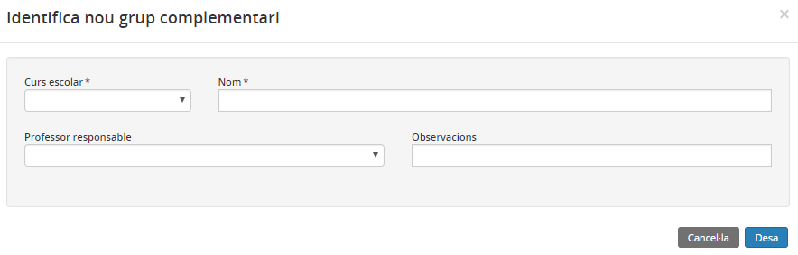
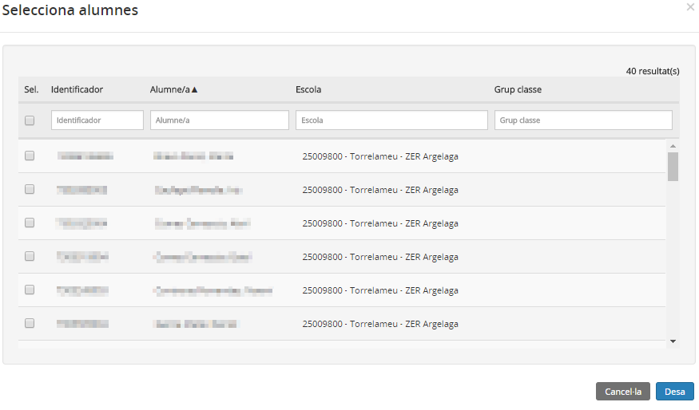
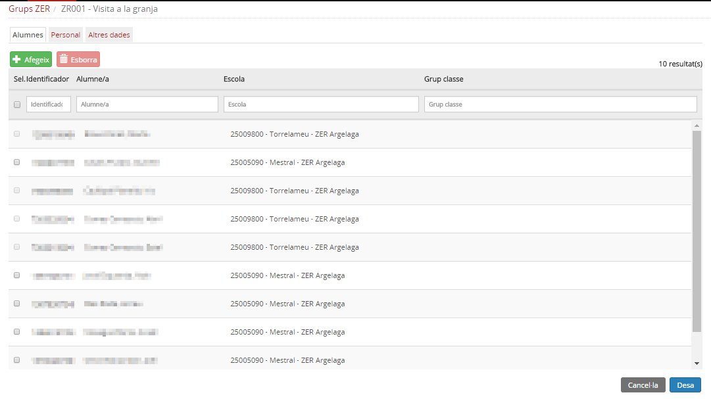
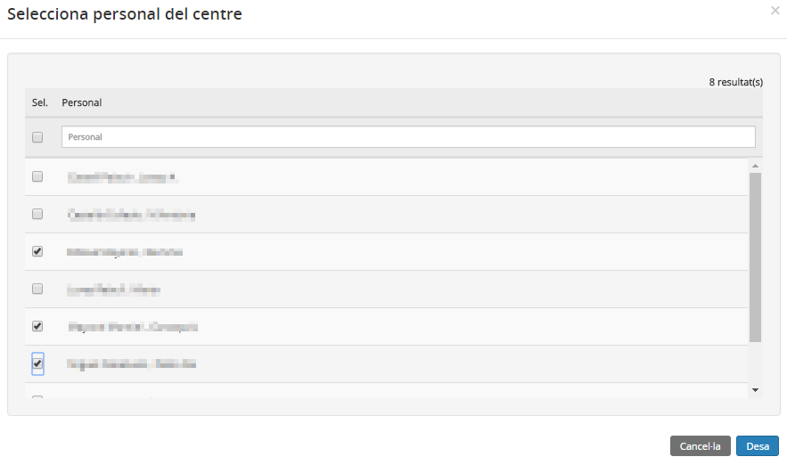
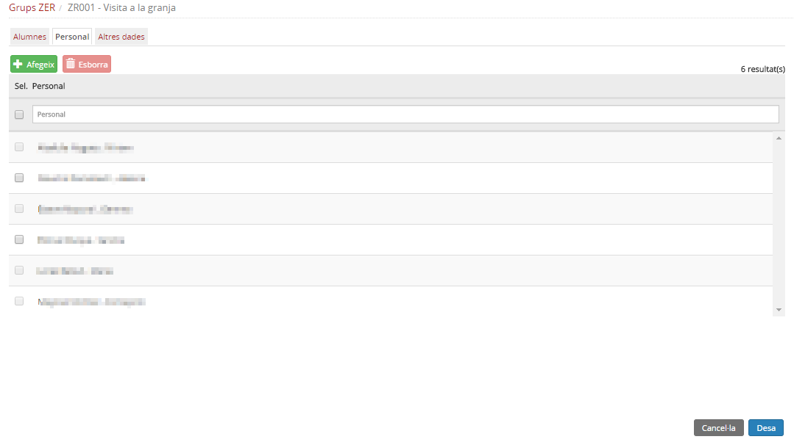
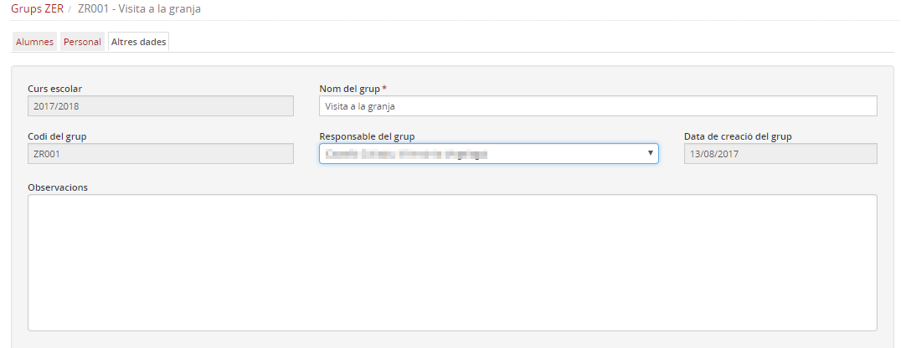

# Grups ZER

* [Què són](grups_zer.md#què-són)
* [Com s’hi accedeix](grups_zer.md#com-shi-accedeix)
* [Quines operacions s'hi poden fer](grups_zer.md#quines-operacions-shi-poden-fer)

  + [Crear un grup ZER](grups_zer.md#crear-un-grup-zer)
  + [Modificar un grup ZER](grups_zer.md#modificar-un-grup-zer)
  + [Esborrar un grup ZER](grups_zer.md#esborrar-un-grup-zer)

### Què són

Els grups ZER són grups complementaris amb la particularitat que poden incloure alumnes i personal, docent o no docent, de qualsevol de les escoles que formen part de la ZER.  
Aquests grups permeten agrupar alumnes de la ZER que tenen en comú alguna activitat, com ara una sortida.
  
  
Els grups ZER no tenen continguts assignats i, per tant, no estan subjectes a l'avaluació.
  
  
Els grups ZER només es poden crear des de la pròpia ZER. Després, les diferents escoles de la ZER els hauran de completar posant-hi els seus alumnes i el seu personal.   
Quan la ZER ha creat grups, la pantalla mostra una taula amb la informació següent:

* **Curs escolar**
* **Codi - Nom**: El codi i el nom del grup ZER.
* **Alumnes**: Nombre d'alumnes que formen part del grup.
* **Personal**: Nombre de personal assignat al grup.
* **Professor responsable**: "Sí/No" segons si s'ha especificat o no el professor responsable del grup.
* **Accions**: Icona mitjançant la qual es pot accedir al detall del grup.

*Imatge 1 - Llista de grups ZER* 
  
  

---

### Com s’hi accedeix

Per accedir, s'ha d'escollir l'opció del menú **Grups ZER** del mòdul **Grups**

*Imatge 2 - Accés als grups ZER des d'una ZER*
  
  
*Imatge 2 - Accés als grups ZER des d'una escola de la ZER*
  
  
Damunt la relació de grups, hi ha un conjunt de camps que faciliten la cerca.
  
També és possible variar l'ordre en què es mostren els grups per pantalla clicant sobre cada capçalera.
  
  

---

### Quines operacions s'hi poden fer

* [Crear un grup ZER](grups_zer.md#crear-un-grup-zer) - **Només des de la ZER**. Permet crear nous grups ZER
* [Modificar un grup ZER](grups_zer.md#modificar-un-grup-zer) - Per veure la composició del grup, és a dir, la relació d'alumnes i personal i modificar-lo, si és el cas.

  + Des de la ZER es poden modificar les dades generals del grup i gestionar el personal assignat a la ZER.
  + Des de les escoles de la ZER es pot gestionar els alumnes i el personal de l'escola.
* [Esborrar un grup ZER](grups_zer.md#esborrar-un-grup-zer) - **Només des de la ZER** El programa permet esborrar un grup ZER sempre que no tingui alumnes, personal ni responsable.

---

#### Crear un grup ZER

* [Identificar el grup](grups_zer.md#identificar-el-grup)
* [Afegir/treure alumnes del grup](grups_zer.md#afegirtreure-alumnes-del-grup)
* [Afegir/treure personal al grup](grups_zer.md#afegirtreure-personal-al-grup)

En primer lloc, s'ha de clicar el botó . Aquesta opció només està disponible per a la ZER.
Aquesta acció obrirà una finestra modal on introduir les dades generals.
  
  

---

##### Identificar el grup

* **Curs escolar**: Camp obligatori. S'ha de seleccionar del desplegable el curs escolar a què correspon el grup.
* **Nom del grup**: Camp opcional on s'especifica el nom per identificar el grup a les diferents pantalles de l'aplicació.
* **Responsable**: Camp opcional que permet seleccionar, d'entre la relació de personal de la ZER, la persona responsable del grup.
* **Observacions**: Camp opcional que permet escriure allò que ajudi a identificar el grup.

*Imatge 3 - Identificació d'un grup ZER*
  
  
La ZER no té alumnes, per tant des de la pròpia ZER només es pot gestionar el personal i el responsable. Per a fer-ho cal clicar la icona del grup seleccionat.
  
  

---

##### Afegir/treure alumnes del grup

Només des de cada escola de la ZER es podran posar i treure alumnes del grup ZER.
Cada escola podrà actuar únicament sobre els seus alumnes.

  
La primera pestanya **Alumnes**, permet veure els alumnes que hi ha al grup, i afegir-ne i treure'n.
  
Per afegir alumnes al grup cal clicar el botó .
  
  
S'obrirà una finestra modal que permetrà cercar qualsevol alumne del centre.
  
  
*Imatge 4 - Cerca d'alumnes*
  
  
Cal marcar els alumnes que es desitgi incorporar al grup i acabar clicant al botó .
  
Els alumnes passaran a mostrar-se a la llista d'alumnes del grup.
  
*Imatge 5 - Llista d'alumnes del grup*
  
La taula d'alumnes del grup disposa de la informació següent:

* **Identificador de l'alumne/a**
* **Nom i cognoms de l'alumne/a**
* **Escola** codi i nom de l'escola de la ZER a la qual pertany l'alumne.
* **Grup classe**: codi del grup classe al qual pertany l'alumne.

Si cal treure algun alumne del grup, cal seleccionar-lo de la llista d'alumnes i a continuació clicar al botó .
  
**Recordeu que cada escola només pot actuar sobre els seus alumnes.**
  
  

---

##### Afegir/treure personal al grup

La segona pestanya **Personal**, permet veure el personal que hi ha al grup i permet afegir-ne i treure'n.
  
Per afegir personal al grup cal clicar el botó .
  
  
S'obrirà una finestra modal que permetrà cercar qualsevol treballador del centre.  
En aquest cas, cada centre, la ZER i cadascuna de les escoles, podran gestionar el seu personal.
  
  
*Imatge 6 - Cerca de personal de la ZER*
  
  
*Imatge 7 - Cerca de personal d'una escola*
  
  
Cal marcar les persones que es desitgi incorporar al grup i acabar clicant al botó .
  
Les persones passaran a mostrar-se a la llista de personal del grup.
  
  
Si cal treure alguna persona del grup cal seleccionar-lo de la llista i a continuació clicar al botó .
  
  
**Recordeu que cada escola, inclosa la ZER, només pot actuar sobre el seu personal.**
  
  

---

#### Esborrar un grup ZER

A la pantalla principal es mostra la llista de grups ZER que hi ha. La ZER pot, des d'aquesta pantalla, esborrar els grups creats.
  
Només es pot esborrar un grup si no conté alumnes, personal ni responsable.
Cal marcar el grup o grups i prémer el botó .
  

---

#### Modificar un grup ZER

Des de la ZER, clicant la icona d'acció d'un grup s'accedeix a la seva composició i a les seves dades d'identificació.
  
És possible modificar el nom del grup, les observacions i la composició del personal de la ZER.
  
  
*Imatge 8 - Altres dades del grup*
  
  

---