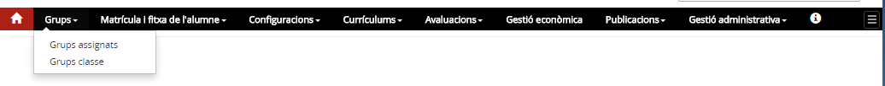

# Grups

* [Contextualització](index.md#contextualització)
* [Funcions](index.md#funcions)
* [D’on venen les dades](index.md#don-venen-les-dades)
* [A quin lloc de l’aplicació es fan servir aquestes dades](index.md#a-quin-lloc-de-laplicació-es-fan-servir-aquestes-dades)
* [Qui hi pot accedir](index.md#qui-hi-pot-accedir)
* [Com s’hi accedeix](index.md#com-shi-accedeix)
* [Organització](index.md#organització)

### Contextualització

L'activitat docent del centre s'organitza en funció del projecte educatiu i, en el cas dels centres públics, de les concrecions previstes al projecte de direcció vigent, a partir de l'agrupament dels alumnes; la confecció d'horaris es fa d'acord amb les prescripcions curriculars que s'estableixen en la normativa vigent, amb els criteris de les normes d'organització i funcionament del centre, i en funció de l'especialitat i la preparació específica dels professors.
  
  
L'organització dels alumnes en grups s'ha d'establir d'acord amb els criteris definits en les normes d'organització i funcionament del centre, en el marc de l'autonomia pedagògica i d'acord amb el principi de l'educació inclusiva. Així mateix, aquests agrupaments a l'aula s'han de fer de manera equilibrada, segons el que estableix el Pla per a la igualtat de gènere en el sistema educatiu (aprovat per l'Acord de Govern de 20 de gener de 2015).
  
  
Els recursos assignats als centres permeten definir, en funció de l'ensenyament, agrupaments diferents d'acord amb les opcions metodològiques: desdoblaments de grups o agrupaments flexibles per a determinades àrees o matèries, organització dels alumnes per a les matèries optatives o específiques, i qualsevol altra organització possible que el centre pugui dissenyar per facilitar l'aprenentatge dels alumnes.

### Funcions

Aquest mòdul fa referència a l’agrupació d’alumnes. L’equip directiu ha de marcar les línies per garantir que la distribució dels alumnes en grups és la millor per assolir els objectius marcats.
  
  
L'agrupació d'alumnes a Esfer@ es concreta de la manera següent:  
  
**Grups classe.**
Conjunt d’alumnes d'un mateix ensenyament i nivell. En el grup classe hi consten tots els continguts que cursen els alumnes, els professors, i la relació entre cada contingut i el docent o docents que els imparteixen.

Cal tenir en compte que tots aquests elements determinen els accessos dels professors als grups i continguts, especialment pel que fa a les posteriors avaluacions així com els lligams del tutor o tutora amb el grup.

  
  
**Agrupació organitzativa.**
Professorat que imparteix determinats continguts a determinats alumnes atenent a l'organització pròpia dels alumnes i continguts del centre.  
  
**Grups complementaris.**
Altres vegades el centre necessita fer agrupacions d’alumnes per a activitats no lligades directament amb la docència. Qualsevol activitat de centre ha de tenir un professor o professora responsable del grup.  
  
**Grups ZER.**
Sovint la ZER organitza activitats complementàries en les quals agrupa alumnes de totes les seves escoles.  
  
  
De l'organització se n'extreu la dedicació dels professors a la docència, tot i que aquesta no és l'única activitat dels docents en el centre.

### D’on venen les dades

La informació dels alumnes, així com la del seu currículum, s'obté de la fitxa de l'alumne, on hi consten les opcions curriculars de la matrícula vigent; la informació dels professors prové de la relació del personal docent assignat al centre.

### A quin lloc de l’aplicació es fan servir aquestes dades

La informació dels grups classe i de les agrupacions organitzatives (alumnes, continguts i professors) determina els accessos de cada docent a la informació del grup, fet que permet que el professor o professora pugui consultar la fitxa dels seus alumnes, obtenir llistes dels grups on intervé, i accedir a la informació que concreta els continguts que ha d'avaluar i els alumnes que han de ser avaluats.  
  
En els grups complementaris, grups PIM i grups ZER, la utilització és la mateixa tret de l'avaluació que no es contempla en aquest tipus de grups.

### Qui hi pot accedir

* El director o directora i l'equip directiu tenen accés a la creació, manteniment i consulta de tots el tipus de grups.
* El personal de suport administratiu.
* El personal docent.

### Com s’hi accedeix

*Imatge 1 - Accés al menú Grups*

### Organització

En els centres educatius està organitzat en sis opcions de menú:
  
**Grups assignats**

* consulta

**Grups classe**

* creació
* consulta
* manteniment
* còpia

**Agrupacions organitzatives**

* creació
* consulta
* manteniment

**Grups complementaris**

* creació
* consulta
* manteniment

En les ZER les opcions de menú són:
**Grups ZER**

* creació
* consulta
* manteniment