# Registre d'assistència

El **registre d'assistència** es pot obtenir directament des de l'opció del menú Models del mòdul Publicacions i des de l'opció Plantilles del mòdul **Publicacions**.

## Des de models

Escolliu l'opció **Models** del mòdul **Publicacions**.

*Imatge 1 - Accés a Models*

Determineu les següents dades:

* Títol: servirà per identificar els models a la cua d'elaboració.
* Models: cal triar el model **Assistència mensual**.

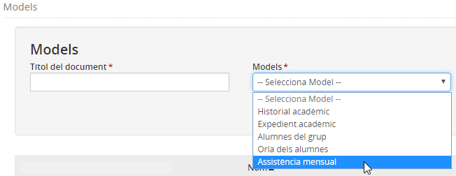*Imatge 2 - Selecció del model*

A continuació cal definir les diferents opcions que mostren el filtres:

* Curs escolar
* Ensenyament
* Nivell
* Grup classe

i prémer el botó [Cerca].

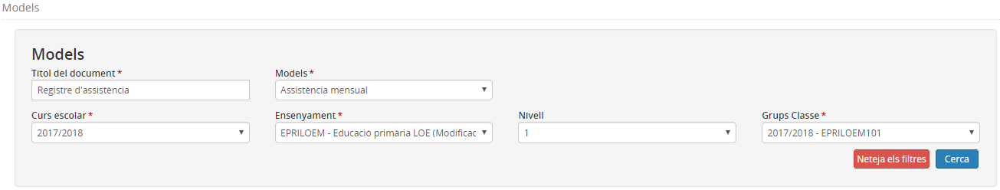*Imatge 3 - Tria de les opcions dels filtres i cerca*

Per últim seleccioneu els alumnes:

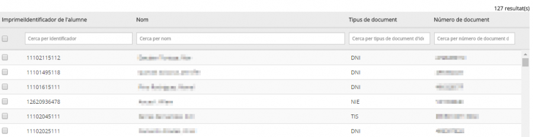*Imatge 4 - Selecció d'alumnes*

Per acabar s'ha de prémer el botó [Imprimir PDF].
Es mostrarà un avís a la part superior de la pantalla informant que el model s'ha generat correctament. Per visualitzar-lo, cal anar a l'opció del menú Cua d'elaboració (models) del mòdul Publicacions.

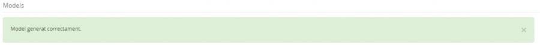*Imatge 5 - Avís*

## Des de plantilles

Escolliu l'opció **Plantilles** del mòdul **Publicacions**.

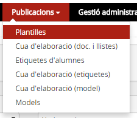*Imatge 6 - Accés a les Plantilles*

Afegiu una plantilla nova i empleneu els camps següents:

* **Títol de la llista**: Especifiqueu el nom "Registre d'assistència".
* **Codi extern**: Especifiqueu un codi.
* **Àmbit**: Escolliu "Centre".
* **Tipus de llistat**: Escolliu "Llistats relacionats amb les dades personals dels alumnes".
* **Orientació de la pàgina**: Escolliu "Horitzontal".
* **Format de sortida**: Escolliu entre Pdf, Excel o Word.
* **Columnes addicionals en blanc**: Especifiqueu 31
* **Seleccioneu els camps**: Nom, Primer cognom i Segon cognom

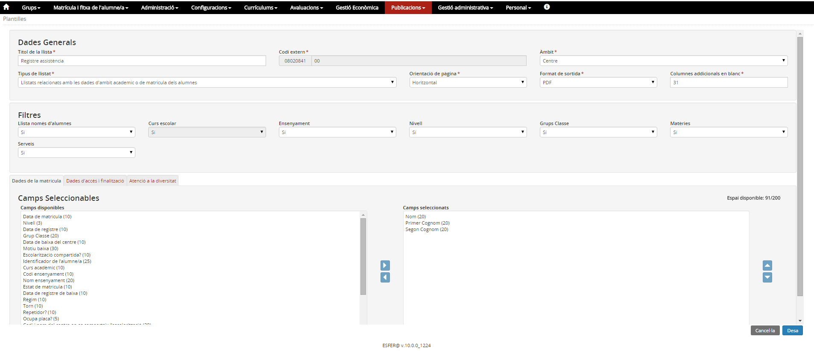*Imatge 7 - Definició de la plantilla*

Executeu el "Registre d'assistència" i a la finestra emergent informeu:

* **Llista només d'alumnes**: Escolliu "Donats d'alta".
* **Grups classe**: Seleccioneu els grups. Si se'n selecciona més d'un, obtindreu un registre d'assistència per a cadascun.
* Premeu el botó **Executa**.

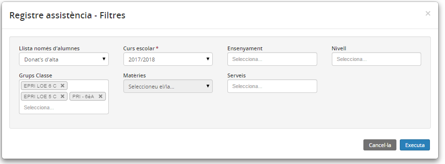*Imatge 8 - Publicacions - Plantilles - Execució de la plantilla*

Aneu a l'opció de menú **Cua d'elaboració (doc. i llistes)** del mòdul **Publicacions**.

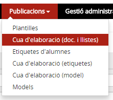*Imatge 9 - Publicacions - Cua d'elaboració (doc. i llistes)*

Quan estigui generada premeu la icona  per obtenir el registre d'assistència.

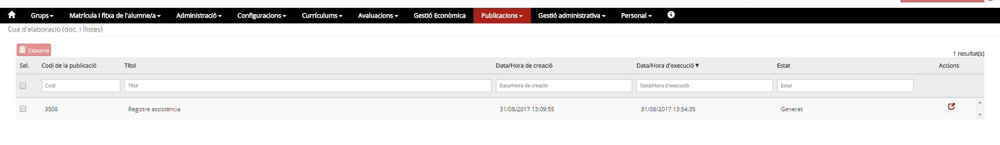*Imatge 10 - Publicacions - Plantilles - Accés a la plantilla generada*

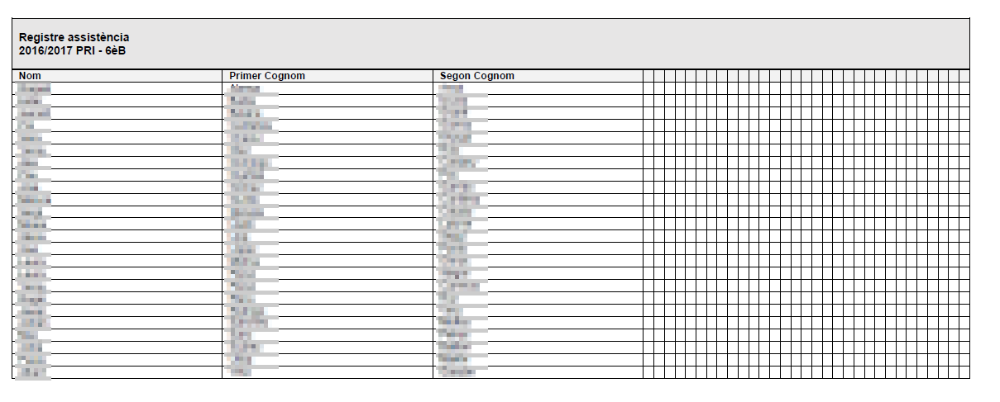*Imatge 11 - Publicacions - Plantilles - Plantilla en format PDF*

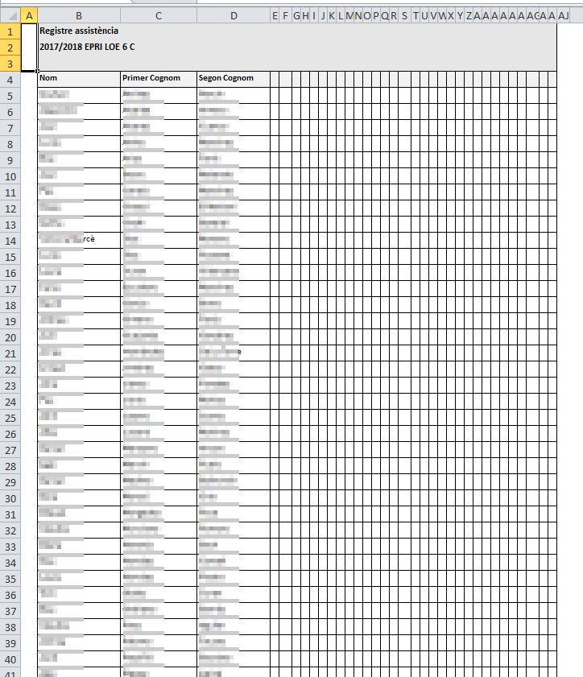*Imatge 12 - Publicacions - Plantilles - Plantilla en format EXCEL*