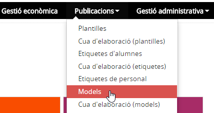
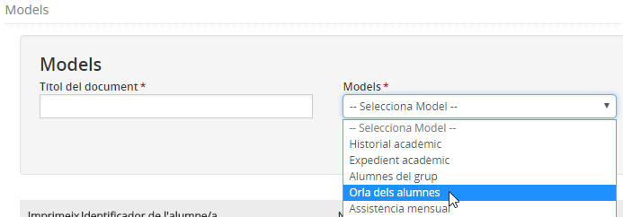
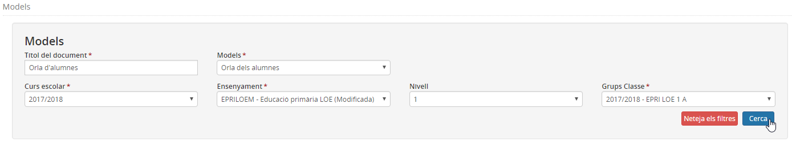
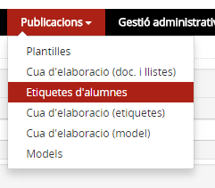
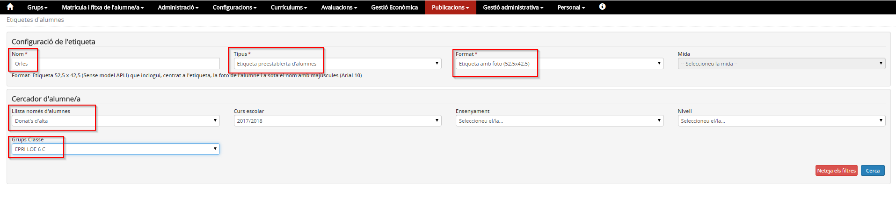
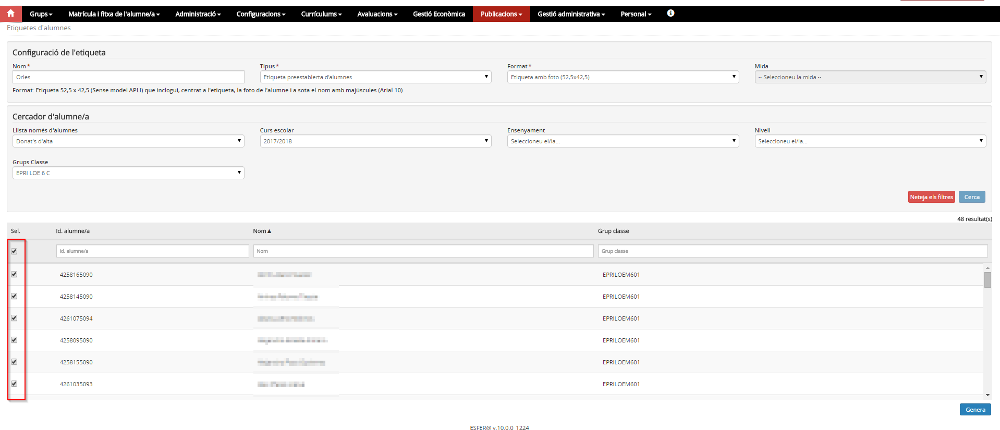
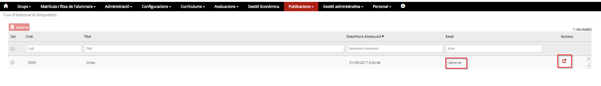

# Orles

**L'orla** es pot obtenir directament des de l'opció del menú Models del mòdul Publicacions i des de l'opció Etiquetes del mòdul Publicacions.

## Des de models

Escolliu l'opció **Models** del mòdul **Publicacions**.

*Imatge 1 - Accés a Models*

Determineu les següents dades:

* Títol: servirà per identificar els models a la cua d'elaboració.
* Models: cal triar el model **Orla dels alumnes**.

*Imatge 2 - Selecció del model*

A continuació cal definir les diferents opcions que mostren el filtres:

* Curs escolar
* Ensenyament
* Nivell
* Grup classe

i prémer el botó [Cerca].

*Imatge 3 - Tria de les opcions dels filtres i cerca*

Per últim seleccioneu els alumnes:

*Imatge 4 - Selecció d'alumnes*

Per acabar s'ha de prémer el botó [Imprimir PDF].
Es mostrarà un avís a la part superior de la pantalla informant que el model s'ha generat correctament. Per visualitzar-lo, cal anar a l'opció del menú Cua d'elaboració (models) del mòdul Publicacions.

*Imatge 5 - Avís*

## Des d'etiquetes d'alumnes

Escolliu l'opció **Etiquetes d'alumnes** del mòdul **Publicacions**.

*Imatge 6 - Accés a Etiquetes d'alumnes*

Especifiqueu un nom a l'etiqueta i empleneu els paràmetres de la cerca:

* **Nom**: Especifiqueu el nom "Orla".
* **Tipus**: Escolliu "Etiqueta preestablerta d'alumnes".
* **Format**: Escolliu "Etiqueta amb foto (52,5 x 42,5)".
* **Llista només d'alumnes**: Escolliu "Donats d'alta".
* **Grup classe**: Especifiqueu els grups classe. Si seleccioneu més d'un grup, es mostrarà una pàgina per grup quan executeu aquesta plantilla.

*Imatge 7 - Publicacions - Definició dels paràmetres de l'etiqueta*

Premeu el botó **Cerca** i seleccioneu els alumnes.

*Imatge 8 - Publicacions - Selecció dels alumnes i generació*

Premeu el botó **Genera** que es troba al final de la pàgina.  
Aneu a l'opció de menú **Cua d'elaboració d'etiquetes** del mòdul **Publicacions** i quan l'estat sigui \*\*Generat"" podeu prémer la icona  per veure l'orla amb les fotografies dels alumnes.

*Imatge 9 - Publicacions - Accés a la visualització de les etiquetes generades*