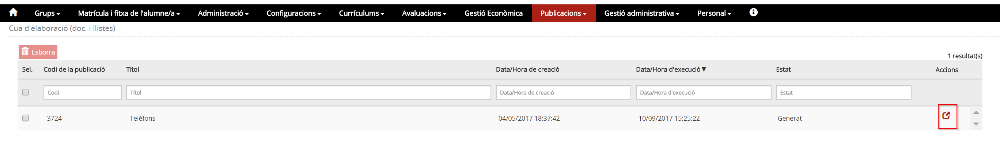
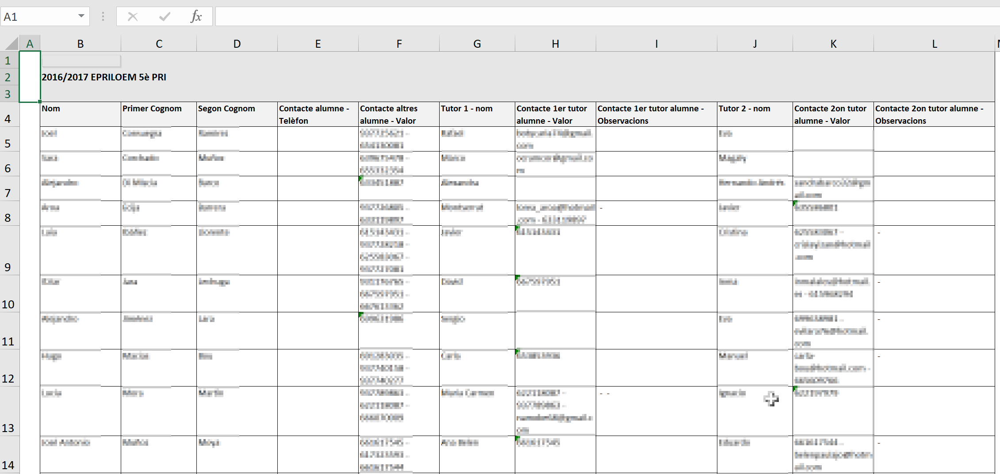

# Llistat dels telèfons

El **llistat dels telèfons** es pot preparar des de l'opció Plantilles del mòdul **Publicacions**.  
  
Escolliu l'opció **Plantilles** del mòdul **Publicacions**.

*Imatge 1 - Accés a les Plantilles*

Afegiu una plantilla nova i empleneu els camps següents:

* **Títol de la llista**: Especifiqueu el nom "Llistat de telèfons".
* **Codi extern**: Especifiqueu un codi.
* **Àmbit**: Escolliu "Centre".
* **Tipus de llistat**: Escolliu "Llistats relacionats amb les dades personals dels alumnes".
* **Orientació de la pàgina**: Escolliu "Vertical".
* **Format de sortida**: Escolliu Excel
* **Columnes addicionals en blanc**: Per defecte ja indica "0"
* **Seleccioneu el camp**: "Telèfon"

Seleccioneu els camps:

* **Nom** (20)
* **Primer Cognom** (20)
* **Segon Cognom** (20)
* **Contacte alumne - Telèfon** (20)
* **Contacte altres alumne** - Valor (20)
* **Tutor 1 - nom** (20)
* **Contacte 1er tutor alumne - Valor** (20)
* **Contacte 1er tutor alumne - Observacions** (30)
* **Tutor 2 - nom** (20)
* **Contacte 2on tutor alumne - Valo**r (20)
* **Contacte 2on tutor alumne - Observacions** (30)

Executeu el "Llistat de telèfons" i a la finestra emergent informeu:

* **Llista només d'alumnes**: Escolliu "Donats d'alta".
* **Grups classe**: Seleccioneu els grups. Si se'n selecciona més d'un, obtindreu un registre d'assistència per a cadascun.
* Premeu el botó **Executa**.

A continuació aneu a l'opció de menú **Cua d'elaboració (plantilles)** del mòdul **Publicacions**.

*Imatge 1 - Accés a la cua d'elaboració (plantilles)*

Quan estigui generada la llista, premeu la icona  per obtenir el llistat de telèfons.

*Imatge 1 - Llista dels telèfons en format Excel*

El programa té diferents camps per incorporar telèfons, tots ells inclosos al llistat. Feu un repàs al document final i si apareix alguna columna sense contingut elimineu-la.

Abans d'imprimir redimensioneu les columnes per tal de que tota la informació us càpiga en un sol full