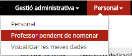
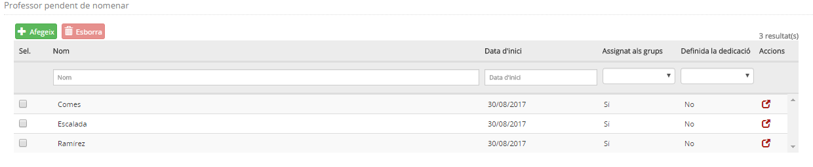
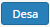
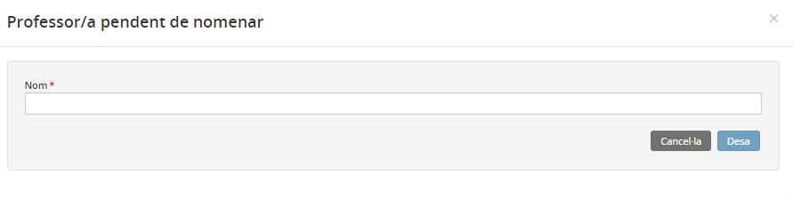
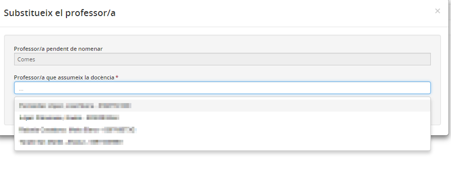

## Professor pendent de nomenar

* [Què és](prof_pendent.md#què-és)
* [Com s'hi accedeix](prof_pendent.md#com-shi-accedeix)
* [Quines operacions s'hi poden fer](prof_pendent.md#quines-operacions-shi-poden-fer)

### Què és

En aquesta opció del mòdul **Personal** es gestiona el personal pendent de nomenar.
  
Sovint, quan es prepara el curs següent, hi ha personal del qual el centre no coneix la identitat, però que, per altra banda, el centre cal que en disposi per poder preparar els grups i l'organització de la docència. Per tal de facilitar-li aquesta tasca, es crea la figura "Personal pendent de nomenar". Quan se'n conegui la identitat, se n'ha de substituir pel definitiu en tots els llocs que pertoqui.
  
  
 

---

### Com s'hi accedeix

Per accedir-hi, cal seleccionar l'opció del menú **Personal pendent de nomenar** del mòdul **Personal**.
  
  
*Imatge 1 - Accés a personal pendent de nomenar*
  
  
 

---

### Quines operacions s'hi poden fer

* [Consultar els professors pendents de nomenar](prof_pendent.md#consultar-els-professors-pendents-de-nomenar)
* [Afegir un professor pendent de nomenar](prof_pendent.md#afegir-un-professor-pendent-de-nomenar)
* [Eliminar un professor pendent de nomenar](prof_pendent.md#eliminar-un-professor-pendent-de-nomenar)

#### Consultar els professors pendents de nomenar

En entrar a l'opció del menú **Professor pendent de nomenar** del mòdul **Personal**, l'aplicació mostra una pantalla amb la llista dels professors pendents de nomenar. Els camps que es mostren són els següents:

* **Casella de verificació**: Per poder seleccionar el professor o professora pendent de nomenar.
* **Nom**: Nom amb què, provisionalment, s'identifica aquest professor o professora pendent de nomenar.
* **Data d'inici**: És un camp calculat pel sistema. S'hi desa la data en què aquest professor o professora pendent de nomenar s'ha afegit a la llista.
* **Assignat als grups (Sí/No)**: És un camp calculat pel sistema. Es mostra un "Sí", si el professor o professora està assignat almenys a un grup classe; en cas que no n'estigui assignat a cap, s'hi mostra un "No".
* **Definida la dedicació (Sí/No)**: És un camp calculat pel sistema. Es mostra un "Sí", quan el professor o professora té enregistrades dades en algun dels blocs de la dedicació (docència, atenció a la diversitat, càrrecs o altres dedicacions); en cas que no en tingui en cap bloc, s'hi mostra un "No".
* **Acció**: Icona que serveix per accedir a més informació del professor o professora pendent de nomenar.

*Imatge 2 - Relació de personal pendent de nomenar*

#### Afegir un professor pendent de nomenar

Cal prémer la icona  des de la llista de professors pendents de nomenar.
  
L'aplicació mostra una pantalla emergent amb un formulari on cal emplenar les dades següents:

* Nom

Si es clica a , i no hi ha registrat un altre professor o professora pendent de nomenar amb aquest nom, se'n crea un de nou. En cas contrari, es mostra un missatge en què s'informa de l'error.
  
  
*Imatge 3 - Afegir una persona pendent de nomenar*

#### Eliminar un professor pendent de nomenar

Cal seleccionar, de la llista de professors pendents de nomenar, el que es vol esborrar i prémer el botó . L'aplicació comprova, abans d'esborrar-lo, que el professor o professora seleccionat no estigui assignat a cap grup classe, ni per impartir-hi docència ni per ser-ne el tutor o tutora, i també comprova que no hi hagin dades de dedicació enregistrades.

##### Substituir-ne un

Cal clicar a la icona  que hi ha a la fila del professor o professora pendent de nomenar que es vol substituir.
  
A continuació es mostra una pantalla amb les dades següents:
  
  
*Imatge 4 - Substitueix a...*

* **Professor/a pendent de nomenar**: Conté el nom del professor o professora. No es pot modificar.
* **Professor/a que assumeix la docència**: És un desplegable amb la llista del personal docent vigent del centre, ordenada per cognoms i nom. És un camp obligatori.

En prémer el botó , l'aplicació en demana la confirmació.  
  
L'aplicació permet fer la substitució del **Professor/a pendent de nomenar** pel **Professor/a que assumeix la docència**, si la dedicació està en estat **Signat** o bé si el total d'hores de la dedicació no sobrepassa les 37 hores i mitja.
Si se'n fa la substitució, l'aplicació fa els canvis següents:

* Es substitueix el **Professor/a pendent de nomenar** pel **Professor/a que assumeix la docència** en tots els grups classe.
* Si el **Professor/a que assumeix la docència** té la dedicació en estat **Signat** no es fa cap canvi a la dedicació. En cas contrari, assumeix la dedicació del **Professor/a pendent de nomenar**.

 

---