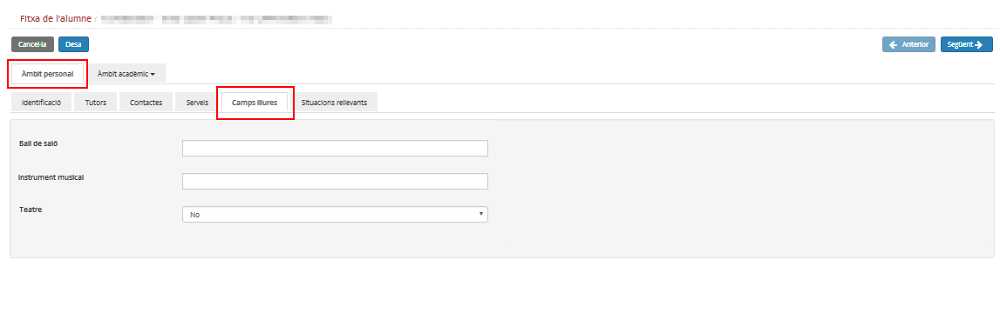

## Camps lliures

S'accedeix des de la pestanya **Camps lliures** de l'**Àmbit personal** de la fitxa de l'alumne.

*Imatge 1 - FDA - Camps lliures de la fitxa de l'alumne*
  
  

En aquesta pàgina es mostren els camps lliures que s'han definit prèviament en l'opció del menú **Camps lliures** del mòdul **Configuracions** que estiguin vigents, i que afectin a l'ensenyament i nivell de la matrícula activa de l'alumne/a.

  
  
Per guardar-ne els canvis s'ha de prémer el botó .
  
  
Si s'han definit **camps lliures obligatoris**, no es podrà desar si no s'emplenen aquests camps.